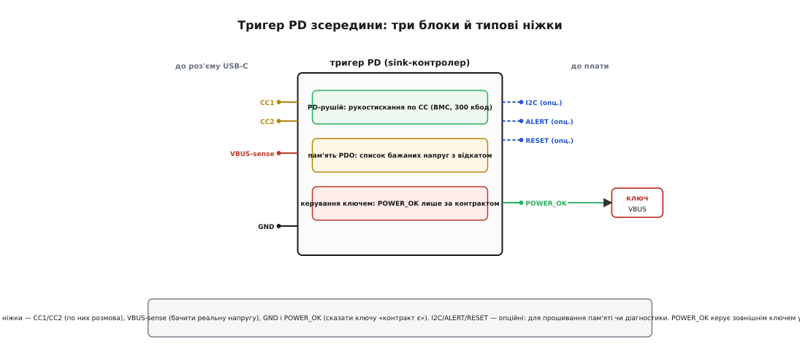
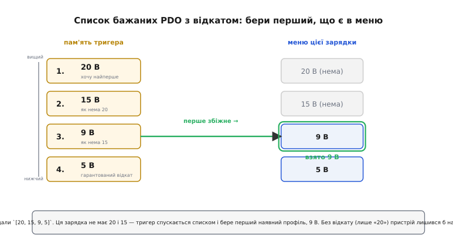

# 🔌 Клас пристроїв: тригер PD-sink

Тригер PD (англ. *trigger* — «спусковий гачок»; ще кажуть sink-контролер, англ. *sink* — «приймач, стік») — це окрема мікросхема, яка бере на себе всю розмову [Power Delivery](root:com-devices/usb-pd) в апаратному вигляді й видає одну заздалегідь обрану напругу вищу за стартові п'ять вольтів. У ньому немає процесора, який ви програмуєте щодня: ви один раз кажете чипу, чого хотіти, а далі він на кожному під'єднанні сам домовляється й сам відмикає живлення на плату. Це найдешевший спосіб дістати з USB-C, скажімо, стабільні 12 чи 20 В — без рядка коду й без окремого мікроконтролера.

Клас цікавий тим, що пояснюється **до кінця** самим принципом дії, однаково в будь-якого виробника: у всіх усередині ті самі три блоки, ті самі обов'язкові ніжки, та сама пастка з передчасним навантаженням. Конкретні номінали, коди й партномери різняться — але вони тут і не потрібні, бо не вони роблять пристрій тим, чим він є. Тож розберімо клас: що це за чип і чому окремий; що в нього входить і виходить; як сказати йому напругу; як завести вихід; і на яких граблях спотикаються всі, хто його вперше ставить.

## Чому окремий чип, а не пара резисторів

Спокуса зекономити тут природна: адже щоб просто **оголоситися** споживачем, справді досить двох резисторів. Стік підтягує кожну лінію CC (англ. *configuration channel* — «канал конфігурації») до землі через **Rd = 5.1 кОм** — і джерело, побачивши цю підтяжку, розуміє, що на кінці кабелю сидить споживач, і подає безпечні 5 В. Ця частина — суто аналогова, [пасивне оголошення стіком](root:com-devices/type-c-cc), і жодного чипа не потребує.

Але п'ять вольтів — це стеля такого способу. Щойно вам треба 9, 12 чи 20 В, самих рівнів на CC мало: доведеться **домовлятися словами**. А слова тут — це справжній цифровий протокол. Джерело й стік обмінюються пакетами по тій самій лінії CC, кодуючи біти **біфазним маркерним кодом** (англ. *biphase mark coding*, BMC — різновид манчестерського, де кожен біт починається переходом рівня, а одиниця має ще один перехід посередині) на швидкості **300 кбод**, півдуплексом, із перевіркою CRC на кожному повідомленні. Це не «підтягнув ніжку» — це приймач-передавач, машина станів протоколу, лічильники таймаутів, обробка повторів. Ось чому пари резисторів мало: **хтось** мусить фізично вести цю розмову.

І тут два шляхи. Або ви пишете PD-стек на власному мікроконтролері (гнучко, але це чимала прошивка — розбір пакетів, стеження за таймаутами, реакція на зміну меню). Або берете **тригер** — чип, у якому вся ця машина вже зашита в кремній і працює без вашого коду. Тригер — це, по суті, «пара резисторів, що виросла в закінчений автомат»: він робить рівно те, що робили б резистори (оголошує стіка), плюс усе те, чого резистори не вміють (веде переговори й пускає напругу на плату лише коли домовився).

> 🔧 **Навіщо це.** Різниця «резистори проти чипа» — це різниця між пристроєм, який назавжди застряг на 5 В, і пристроєм, який бере з зарядки повні 20 В — але без жодного процесора на платі. Тригер дає високу напругу тим виробам, де мікроконтролера або нема взагалі (світлодіодна панель, паяльник, вентилятор), або він є, але завантажувати його ще й PD-стеком не хочеться. Один чип, кілька пасивних деталей — і USB-порт стає програмованим блоком живлення.

## Три блоки всередині

Щоб не тонути в даташитах, корисно бачити тригер як коробку з трьома блоками — вони є в кожного, хоч і названі по-різному.


*Обов'язкові ніжки — CC1/CC2, VBUS-sense, GND і POWER_OK; I2C/ALERT/RESET опційні. POWER_OK керує зовнішнім ключем у лінії VBUS: доки контракту нема — ключ розімкнений.*

**PD-рушій** — серце чипа. Це той самий приймач-передавач BMC плюс машина станів протоколу: він ловить на CC «меню» джерела, формує запит на потрібний профіль, чекає згоди, відстежує таймаути й повтори. Усе, що в стеку на мікроконтролері було б сотнями рядків коду, тут — фіксована логіка в кремнії, яку не можна змінити, але й не треба супроводжувати.

**Пам'ять бажаних профілів** — що саме просити. Тригер не хоче «довільні вольти»; він хоче один із **PDO** (англ. *power data object* — рядок меню джерела «така напруга при такому струмі»). Список цих бажань зберігається у **власній незалежній пам'яті** чипа (NVM, англ. *non-volatile memory* — не зникає при знеструмленні). Саме сюди ви один раз «зашиваєте» свій вибір.

**Керування ключем** — коли пускати напругу далі. Цей блок стежить, чи справді контракт укладено й напруга піднялася, і аж тоді підіймає вихідний сигнал **POWER_OK** (англ. «живлення в нормі»), яким відмикається ключ між VBUS і навантаженням. Доти вихід тримається закритим.

Три блоки — три ролі: **домовитися**, **знати про що**, **пустити коли готово**. Далі два практичні питання, через які проєктувальник із таким чипом реально працює: як записати йому напругу й як правильно завести вихід на плату.

## Типова розпіновка

Партномери різні, але набір ніжок у класу впізнаваний. Обов'язкові — ті, без яких чип не виконає своєї єдиної функції.

- **CC1 і CC2** — дві сигнальні лінії до роз'єму, по них іде вся розмова PD. Дві, а не одна, бо роз'єм Type-C реверсивний: кабель замикає лише одну з них, і чип має тримати підтяжку на обох, а «живою» стане та, яку з'єднав штекер. Заодно так визначається орієнтація вставленого штекера.
- **VBUS-sense** — вхід, яким чип **бачить реальну напругу** на силовій шині. Це його очі: він не «вірить на слово», що напруга піднялася, а міряє її, і лише переконавшись — вважає контракт станом, за якого можна вмикати навантаження.
- **GND** — спільна земля; відносно неї відлічуються і рівні на CC, і напруга VBUS.
- **POWER_OK** (у різних чипів зветься `PG`, `POWER_GOOD`, `VBUS_EN`, `FLGnG`) — вихід «контракт є, напруга та, що просили». Керує ключем навантаження. Це найголовніша ніжка обв'язки, і про неї найчастіше забувають.

Опційні ніжки з'являються, коли тригером хоче керувати ще й мікроконтролер:

- **I2C** (лінії `SDA`/`SCL`) — послідовна шина, якою МК читає стан чипа, а головне — **записує ту саму NVM** з бажаними профілями (або на етапі виробництва, або на льоту). Без I2C багато тригерів однаково працюють, узявши список із заводської прошивки чи з ніжок-конфігураторів.
- **ALERT** (він же `INT`) — вихід-переривання «щось сталося»: під'єднання, зміна контракту, помилка. МК за ним прокидається замість того, щоб постійно опитувати чип.
- **RESET** — вхід примусового перезапуску машини станів, якщо треба почати переговори з нуля.

Багато дешевих тригерів обходяться взагалі без I2C: напругу їм задають **ніжками-конфігураторами**. Кілька виводів, які чип читає на старті; рівень на них (до землі, до живлення чи через резистор певного номіналу) кодує бажану напругу. Підтягнув ніжку так — дістав 9 В, інакше — 12, ще інакше — 20. Розклад «який стан = яка напруга» у кожного чипа свій, його беруть із таблиці конкретної мікросхеми, і плутати таблиці не можна.

```
Ніжка-конфігуратор вибору напруги (схема; коди в кожного чипа СВОЇ):
  CFG до GND           → 5 В   (без підняття)
  CFG через R1 до GND  → 9 В
  CFG не під'єднаний    → 12 В
  CFG через R2 до VDD  → 15 В
  CFG до VDD           → 20 В
```

## Підключення POWER_OK до ключа VBUS

Найважливіша частина обв'язки — **ключ між VBUS і навантаженням** та сигнал POWER_OK, що ним керує. Логіка проста й незламна: **спершу контракт — потім напруга на платі**. Ніколи навпаки.

Чому взагалі ключ, чому не завести навантаження прямо на VBUS? Бо доки контракту нема, на VBUS висять стартові 5 В, а під час переговорів джерело ще тільки готується піднімати напругу. Якщо повести з цієї шини пристрій, розрахований на 12 чи 20 В, він побачить спершу замалі 5 В (може не стартувати або стартувати напівживим), потім різкий стрибок до контрактної напруги (може виявитися зашвидким для вхідного каскаду). А коли переговори зірвуться — кабель смикнули, зарядка не вміє PD, вийшов таймаут — пристрій лишиться на 5 В, і схема, розрахована рівно на 12, має бути **від'єднана**, а не голодувати під половинним живленням. Ключ і дає цю відсічку: навантаження під'єднується до живлення **однією подією** — коли все домовлено й напруга виміряна.

Є ще друга, підступніша причина тримати ключ розімкненим під час переговорів. Поки джерело плавно веде VBUS від 5 до контрактних вольтів, воно розраховує на **майже порожнє** навантаження — стандарт вимагає від стіка на час переходу споживати мізер (порядку 2.5 Вт). Якщо в цей момент навантаження вже висить на шині й тягне повний струм, напруга просяде, джерело вирішить, що щось не так, і **скине контракт** назад на 5 В. Пристрій опиниться в циклі «домовився → навантажив → скинуло → знову домовляється», зовні схожому на «нічого не працює». Розімкнений ключ прибирає це фізично: доки POWER_OK не активний, повному струму просто нема куди текти, і ощадність під час переходу виходить сама собою.

Як саме приєднати ключ — залежить від того, чи є він у чипі:

- **Вбудований ключ або драйвер затвора.** Багато тригерів мають ніжку, що прямо керує затвором зовнішнього MOSFET (або навіть містять силовий ключ усередині). Чип тримає затвор закритим, аж доки VBUS-sense не показав контрактну напругу, і лише тоді відмикає польовик.
- **Зовнішній p-канальний MOSFET у плюсовій шині.** Якщо драйвера нема, ставлять окремий p-MOSFET у лінії VBUS, а POWER_OK керує його затвором — через підтяжку, а за потреби й через рівневий перетворювач (бо POWER_OK часто логічний, а затвор треба гойдати відносно високої VBUS).

```
VBUS ──┬────────────[ Q1 ]──────────── на навантаження
       │              │ (p-MOSFET у плюсі)
    тригер ── POWER_OK ──> затвор Q1
                (відмикає ключ ЛИШЕ після контракту)
```

Поруч із ключем не забувають про дрібниці, які й роблять вузол надійним. **Конденсатор на вході** навантаження — щоб згладити стрибок у мить, коли ключ замикається. **Підтяжка затвора в безпечний стан** — щоб ключ був гарантовано закритий, поки POWER_OK ще не піднявся (інакше в перші мілісекунди після подачі 5 В навантаження може моргнути живленням). І перевірка **на найвищу напругу зі списку**: якщо профілі сягають 20 В, то і сам ключ, і вхідний конденсатор навантаження мають бути розраховані на 20 В, а не на робочі 12.

## «Перший байт»: список PDO у пам'яті з відкатом

Тепер найцінніше в класі — те, як тригеру задають напругу, коли він має NVM. Це не «одна напруга», а **впорядкований список бажаних PDO з пріоритетом**. І в цьому списку — уся надійність пристрою в реальному світі.

Записується він одноразово: або чип уже приходить із заводським списком, або ви шиєте свій по I2C на етапі виробництва. Пам'ять незалежна — раз записаний список лишається в чипі назавжди, навіть коли живлення зникло. Типово таких PDO три (буває більше), і між ними задано **порядок пріоритету**: який хочеться найдужче, який — як запасний.

Далі магія відбувається сама. На кожному під'єднанні тригер отримує від джерела його меню й бере **перший зі свого списку, що там реально є**. Задали `[12 В, 9 В, 5 В]` — отримаєте 12, якщо зарядка їх має; нема 12 — візьме 9; нема й 9 — лишиться на гарантованих 5. Це та сама звичка з безпечного відкату, тільки реалізована апаратно, без жодного рядка коду.


*Задано `[20, 15, 9, 5]`. Ця зарядка не має ні 20, ні 15 В — тригер спускається списком і бере перший наявний профіль, 9 В. Без відкату (лише «20») пристрій лишився б на 5 В.*

**Умова.** У пам'ять зашито список `[20 В, 15 В, 9 В, 5 В]`. Пристрій під'єднали до слабкої зарядки, чиє меню — тільки `5 В` і `9 В`.
```
Тригер порівнює свій список із меню (згори вниз, до першого збігу):
   20 В — свій №1  →  у меню НЕМА  → пропустити
   15 В — свій №2  →  у меню НЕМА  → пропустити
    9 В — свій №3  →  у меню Є     → ВЗЯТИ, зупинитися
    5 В — свій №4  →  далі вже не дивимось

Запит: профіль 9 В. Джерело: Accept → піднімає VBUS 5 → 9 В → «готово».
POWER_OK підіймається → ключ замикається на 9 В.
```
**Висновок.** Замість «мертвий на неправильній зарядці» пристрій сам осів на найкращому доступному — 9 В. Задавши один список, ви наперед описали **всю драбину деградації**: на потужній зарядці буде 20 В і повна сила, на слабшій — 9 і урізана, а на звичайному 5-вольтовому блоці пристрій хоча б не вимкнеться. І все це — без мікроконтролера й без прошивки.

> 🔧 **Навіщо це.** Список запасних у NVM — це різниця між пристроєм, що працює лише з «правильною» зарядкою, і пристроєм, що бере найкраще з будь-якої. Один рядок `[20, 15, 9, 5]` замінює цілий алгоритм вибору й гарантує чесний відступ аж до 5 В. Пропустите цю думку, зашиєте тільки «20» — і на першій же зарядці без 20 В пристрій виглядатиме поламаним, хоча спаяно все правильно.

## Чому воно працює без процесора

Найдивовижніше в тригері — те, що він **сам стартує й сам працює, коли на платі ще нема ніякого живлення для логіки**. Розгадка проста: USB-порт **завжди** спершу подає безпечні 5 В, щойно побачив підтяжку Rd на CC. Ці 5 В і живлять сам чип. Тобто тригер запускається від тієї самої напруги, домовитися про заміну якої — його єдина задача.

Послідовність виходить самозамкнена:

```
1. Кабель з'єднав контакти → на CC з'явилась напруга (дільник Rp джерела й Rd стіка).
2. Джерело бачить стіка → подає 5 В на VBUS.
3. Цих 5 В досить, щоб ожив сам тригер (жодного зовнішнього живлення не треба).
4. Тригер веде переговори по CC → просить перший придатний профіль зі свого списку.
5. Джерело підняло напругу → VBUS-sense це бачить → тригер підіймає POWER_OK.
6. POWER_OK замкнув ключ → узгоджена напруга дійшла до навантаження.
```

Ніде в цьому ланцюжку немає «мікроконтролер завантажився, ініціалізував периферію, запустив PD-стек». Немає прошивки, яку треба оновлювати; немає стану, який треба відновлювати після скидання; немає завантажувального часу. Устромили кабель — за десятки мілісекунд на виході потрібна напруга. Для виробів на кшталт активного кабелю, портативного дисплея чи USB-паяльника це ідеально: уся «розумність» — в одному чипі, решта плати про PD навіть не здогадується й бачить просто готові 12 чи 20 В.

## Типові граблі класу

Клас має свій сталий набір помилок — вони повторюються з чипа в чип, бо ростуть із самого принципу, а не з конкретної моделі.

- **Забули POWER_OK — повели навантаження прямо з VBUS.** Найпоширеніша. Пристрій «іноді не стартує» або живиться ривками, бо тягне струм зі стартових 5 В саме тоді, коли тригер ще домовляється, і просаджує шину, змушуючи джерело скинути контракт. Ключ по POWER_OK прибирає це повністю: усе спаяно так само, лише навантаження вмикається на одну подію пізніше.
- **Немає запасного профілю.** Зашили в пам'ять єдину напругу без відкату — і на зарядці, яка її не має, пристрій лишається на 5 В (а в деяких тригерів узагалі не отримує контракту). Зовні — «не працює», хоча схема справна. Лікується списком із чесним відступом аж до 5 В.
- **Не прошили пам'ять (лишилися заводські значення).** NVM приїхала з дефолтом — часто це просто 5 В або якийсь один профіль, не той, що вам треба. Пристрій слухняно бере дефолтну напругу, і ви годинами шукаєте «баг», якого нема: чип просто не отримав вашого списку. NVM треба або зашити по I2C, або задати напругу ніжками-конфігураторами — інакше працює заводська настройка, а не ваша.
- **Плутанина в кодах ніжок-конфігураторів.** Розклад «стан виводу = напруга» різний у різних чипів. Узятий із чужої таблиці код дасть не ту напругу (у кращому разі меншу — пристрій недоживлений; у гіршому більшу — ризик спалити вхід). Звіряти лише з документом **своєї** мікросхеми.
- **Ключ і конденсатор не на ту напругу.** Польовик і вхідний конденсатор навантаження мають витримувати **найвищу** напругу зі списку профілів (часто 20 В), а не робочі 12. Порахуєте на 12 — на потужній зарядці, що дасть 20, ключ або конденсатор пробиває.
- **Кабель без e-marker, а система хоче понад 3 А.** Без чипа-маркера в кабелі стандарт дозволяє тягнути **не більше 3 А** — це навмисний запобіжник, щоб тонкий кабель не перегрівся. Тож навіть від зарядки на 100 Вт через звичайний кабель ви дістанете максимум 60 Вт (20 В × 3 А). Хочете більший струм — потрібен кабель з e-marker (на 5 А), або проєктуйте вузол під 3 А.
- **Чекали від тригера того, чого клас не вміє.** Тригер просить **фіксований** профіль — і на цьому все. Він не змінює напругу на ходу, не веде тонких режимів на кшталт плавно-регульованого PPS (англ. *programmable power supply*), не реагує на перерозподіл потужності. Треба політика в реальному часі — це вже власний PD-стек на мікроконтролері, а не тригер.
- **Хотіли, щоб пристрій ще й ЖИВИВ інших.** Останнє й головне обмеження класу: тригер — **лише стік**. Він уміє тільки **брати** живлення, і жодним налаштуванням не перетвориться на джерело, що подає напругу назовні. Роль джерела (а тим паче обидві ролі з їх перемиканням) — це зовсім інша мікросхема й інша задача. Тригер у цій ролі не виступить ніколи — не тому, що «не так налаштований», а тому, що фізично на це не розрахований.

## Коли тригер — правильний вибір, а коли ні

Підсумуймо межі класу однією думкою. Тригер PD — це закінчений апаратний автомат, що робить рівно одне: **надійно дістає з USB-C одну наперед задану напругу (з відкатом на нижчі), без процесора й без коду**. Він блискучий там, де саме це й потрібно: фіксоване живлення для виробу, де мікроконтролера нема або його не хочеться вантажити PD-стеком; де важливі копійчана ціна, миттєвий старт від 5 В і мінімум деталей.

Він **не** підходить, щойно потрібна динаміка: міняти напругу під час роботи, торгуватися за потужність із іншими споживачами, лізти в тонкі режими PD, а тим паче самому роздавати живлення. Усе це — територія власного стека на мікроконтролері, де переговори веде ваша прошивка. Вибір між «тригер» і «свій стек» — головне архітектурне рішення будь-якого стіка: візьмете тригер там, де досить сталої напруги, і не змусите його робити те, для чого він принципово не створений.
