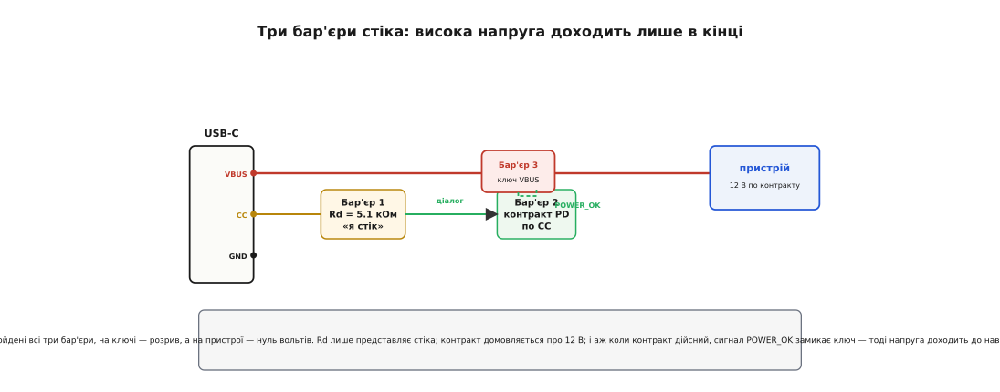
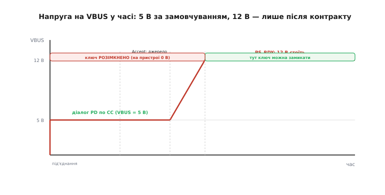

# USB PD sink: як пристрій безпечно бере живлення

У парі, що спілкується по USB-C, ролі несиметричні. Один бік **дає** енергію, другий її **бере** — і той, хто бере, у стандарті зветься **стік** (англ. *sink* — «стік, приймач», те, що вбирає потік). Слово взяте буквально з фізики: як стічний отвір збирає воду, так стік збирає струм із шини. Цей текст — саме про стік: про пристрій, який хоче витягти з USB-порту більше за скромні п'ять вольтів і зробити це так, щоб нічого не згоріло.

Чому взагалі це окрема задача, а не «під'єднав дріт — і живись»? Бо USB-C приносить у пристрій напругу, якою можна щось спалити. Звичайний порт віддає безпечні 5 В, але зарядка з [USB Power Delivery](topic:com-devices/usb-pd) уміє підняти на тому самому дроті 9, 12, а то й 20 вольтів. Двадцять вольтів, поданих на схему, розраховану на п'ять, — це дим за секунду. Тому весь задум стіка крутиться навколо однієї думки: **висока напруга має з'явитися на пристрої лише тоді, коли пристрій сам її попросив і сам до неї готовий**. Не раніше. Ніколи випадково.

## Що робить пристрій стіком

Перше, що варто зрозуміти: пристрій не стає стіком від того, що ви встромили штекер. Він мусить **оголосити** себе стіком — і робить це навіть без жодного рядка коду, самою електрикою.

У роз'ємі Type-C, окрім силових VBUS і GND, є дві тонкі сигнальні лінії **CC** (англ. *configuration channel* — «канал конфігурації»). Стік підтягує кожну з них до землі через резистор **Rd = 5.1 кОм**. Це і є оголошення: «на цьому кінці кабелю сидить споживач, який хоче живлення». Джерело зі свого боку тримає на CC підтяжку **вгору** (Rp), і коли кабель фізично з'єднав контакти, на лінії виникає напруга — дільник із Rp джерела та Rd стіка. За величиною цієї напруги джерело розуміє: підключився саме стік, а не інше джерело й не порожнє гніздо, — і подає безпечні 5 В.

> 🔧 **Навіщо це.** Rd — це найдешевший «розпізнавальний знак» у всій системі: один резистор на 5.1 кОм на кожній CC, і ваш пристрій уже бачать як споживача. Помилитесь із номіналом — джерело або не впізнає стіка й не подасть навіть 5 В, або хибно прочитає, скільки струму пристрій готовий брати. Тому ці два резистори ставлять першими й перевіряють найпильніше.

Чому саме дві лінії CC, а не одна? Бо роз'єм Type-C **реверсивний** — його можна встромити будь-яким боком, і ви наперед не знаєте, котрий фізичний контакт замкне кабель. Кабель з'єднує лише **одну** з двох CC; друга лишається висіти. Тому стік тримає Rd на **обох**, а напруга від Rp джерела з'явиться рівно на тій, яку замкнув кабель. Так система заодно дізнається орієнтацію штекера: «жива» саме та CC, де виникла напруга. Ця аналогова гра підтяжок — окрема тема сама по собі; тут досить знати, що Rd на CC — це [спосіб пасивно оголоситися стіком](topic:com-devices/type-c-cc), який працює завжди, ще до будь-яких переговорів.

І тут ключова розвилка. Якщо пристрою вистачає 5 В — на цьому все й закінчується: Rd на CC, джерело подало 5 В, живись. Такий пристрій — теж повноцінний стік, просто найпростіший. Але щойно потрібна вища напруга, самих резисторів мало: доведеться **домовлятися словами**.

## Три бар'єри на шляху високої напруги

Найкраще уявити захист стіка як три послідовні бар'єри, крізь які висока напруга мусить пройти, перш ніж торкнутися чутливої схеми. Пропустити хоч один — і задум ламається.


*Rd на CC лише представляє стіка й тримає базові 5 В. Контракт PD по тих самих CC домовляється про 12 В. І аж коли контракт дійсний, сигнал POWER_OK замикає ключ у лінії VBUS — тільки тоді напруга доходить до навантаження. Доки не пройдені всі три бар'єри, на пристрої нуль вольтів.*

**Бар'єр перший — Rd.** Ми його вже поставили: пристрій оголосив себе стіком, отримав безпечні 5 В. Поки що жодної небезпеки — п'ять вольтів витримає будь-яка логіка.

**Бар'єр другий — контракт.** Щоб дістати більше, стік вступає в **цифровий діалог** по тій самій живій CC. Це вже не статичні рівні, а протокол [USB Power Delivery](topic:com-devices/usb-pd): джерело шле «меню» напруг, які вміє дати (кожен рядок — профіль, англ. *power data object*, PDO), стік вибирає один і **просить** його, джерело погоджується й **плавно** піднімає VBUS до домовленого, а тоді каже «готово». Ця узгоджена пара «напруга + максимальний струм» і зветься **контракт**. Суть у тому, що напруга ніколи не підіймається навмання — лише за явним запитом стіка й явною згодою джерела.

**Бар'єр третій — ключ.** Ось найтонше місце, яке відрізняє надійний пристрій від того, що згорить. Навіть коли контракт домовився про 12 В і джерело їх подало, ці 12 В не можна пускати прямо в схему **автоматично**. Між шиною VBUS і чутливим навантаженням ставлять **керований ключ** (силовий MOSFET або готовий [load switch](topic:hw-power/load-switch)), і замикають його лише за сигналом «контракт дійсний, напруга та, що просили». Доки контракту нема — доки на шині ще стартові 5 В або взагалі йдуть переговори — ключ **розімкнений**, і на пристрої рівно нуль вольтів.

Навіщо третій бар'єр, якщо контракт уже домовився? Бо між «попросив 12 В» і «12 В стоять на шині» минає час, і в цей час на VBUS ще старі 5 В. Якби навантаження висіло на шині напряму, воно спершу побачило б 5 В (замало — може не стартувати чи стартувати напівживим), потім стрибок до 12 (може виявитися зашвидким для вхідного каскаду). А головне — якщо переговори **зірвуться** (кабель смикнули, зарядка не вміє PD, таймаут), стік лишиться на 5 В, і схема, розрахована рівно на 12, має бути в цю мить від'єднана, а не голодувати під половинною напругою. Ключ і дає цю відсічку: пристрій під'єднується до живлення **однією подією** — коли все вже домовлено й перевірено.

## Напруга VBUS у часі

Щоб бар'єри стали відчутними, гляньмо, як напруга на шині поводиться від миті під'єднання.


*Під'єднання дає стрибок до 5 В; поки йде діалог PD по CC, VBUS тримається на 5 В. Аж коли джерело сказало Accept, воно плавно піднімає напругу до 12 В і завершує сигналом PS_RDY («напруга стоїть»). Замикати ключ на пристрій можна ЛИШЕ в зеленій зоні — після PS_RDY; в усій червоній зоні ключ розімкнено й на пристрої нуль.*

Дві миті на цій діаграмі — суть усього. Перша: **до** сигналу «готово» на шині не та напруга, якої пристрій хоче. Друга: цей сигнал приходить пізно, вже після того, як напруга піднялася. Тому вся логіка ключа зводиться до простого правила: **чекай сигналу «напруга стоїть» — і лише тоді замикай**. Замкнеш раніше — впіймаєш або замалі 5 В, або перехідний стрибок.

## Стік мусить бути ощадним у переговорах

Є ще одна тонкість, яку легко проґавити й яка мстить непередбачувано. Поки триває діалог і поки джерело перебудовує напругу, стік має **майже нічого не споживати** — стандарт вимагає тримати навантаження мізерним (порядку 2.5 Вт) на час переходу.

Чому? Уявіть джерело як людину, що обережно наливає воду в склянку до потрібної позначки. Якщо в цей момент хтось почне сьорбати зі склянки, рівень «попливе», і наливати доведеться навмання. Так і тут: джерело плавно веде VBUS від 5 до 12 В за заданою кривою, розраховуючи на легке навантаження; якщо стік у цей момент почне тягнути повний струм, напруга просяде, джерело вирішить, що щось не так, і **скине контракт** — поверне безпечні 5 В. Пристрій опиниться в циклі «домовився → навантажив → скинуло → знову домовляється», зовні схожому на «нічого не працює».

Ось чому третій бар'єр — ключ — розв'язує одразу дві задачі. Він не лише відсікає високу напругу до контракту; він ще й **тримає навантаження від'єднаним під час переходу**, бо доки не прийшов сигнал «готово», ключ розімкнений, і повний струм фізично нема куди текти. Ощадність під час переговорів виходить сама собою — саме тому схему з ключем після сигналу готовності роблять майже завжди, а не «за бажанням».

> 🔧 **Навіщо це.** Це найковарніша пастка новачка: усе спаяно правильно, контракт у логіці укладається, а пристрій живиться ривками або взагалі тільки на 5 В. Причина майже завжди одна — навантаження ввімкнули занадто рано, воно просаджує шину під час переходу й змушує джерело відкотитися. Правильний ключ, замкнений лише по сигналу готовності, знімає цю проблему цілком.

## Дві дороги: чип-тригер чи власний стек

Тепер практичне питання: **хто** веде цей цифровий діалог? Хто розбирає пакети PD, стежить за таймаутами, формує запит? Тут дві дороги, і вибір між ними — головне архітектурне рішення стіка.

**Дорога перша — готовий чип-«тригер».** Є окремі мікросхеми-контролери приймача, які роблять **усе** самі: усередині вже сидять потрібні Rd, машина станів протоколу, лічильники таймаутів. Ви один раз задаєте (перемичкою, резистором або записом у вбудовану незалежну пам'ять), яку напругу хочете, — і чип на кожному під'єднанні сам домовляється й сам піднімає вихідний сигнал «контракт є», що керує ключем. Процесор не потрібен взагалі: чип стартує від тих самих 5 В, які USB подає завжди, і працює автономно. Це і є [клас пристроїв-тригерів PD](topic:hw-power/usb-pd-sink/comp-pd-trigger.md) — найдешевший спосіб дістати з PD одну фіксовану напругу без жодного рядка коду.

**Дорога друга — власний PD-стек на вашому МК.** Тут переговори веде ваша прошивка (часто через простіший чип фізичного рівня, що лише перетворює біти CC у повідомлення). Складніше — треба реалізувати логіку вибору профілю, обробку таймаутів, реакцію на зміну меню, — але й гнучкіше: можна міняти запитану напругу на ходу, реагувати на перерозподіл потужності, під'єднуватися до тонших режимів PD.

Ось як виглядає серце другої дороги — момент, коли прийшло меню й стік має вибрати профіль. Правило вибору просте: **бери найвищу напругу, яка не перевищує того, що витримує пристрій**; не знайшлося придатної — лишайся на безпечних 5 В.

**Вибрати профіль 12 В із меню джерела (стік на власному МК).**
:::tabs
```c
// callback: контролер віддав меню Source_Capabilities (масив PDO)
bool sink_pick_profile(const pdo_t *pdo, uint8_t n) {
    const uint32_t v_max_mv = 12000;      // стеля пристрою: понад 12 В брати НЕ можна
    int best = -1;
    for (uint8_t i = 0; i < n; i++)        // перебрати всі рядки меню
        if (pdo[i].type == PDO_FIXED &&
            pdo[i].voltage_mv <= v_max_mv &&                 // не вище за стелю
            (best < 0 || pdo[i].voltage_mv > pdo[best].voltage_mv))
            best = i;                       // лишити найвищий придатний
    if (best < 0) return false;             // нічого не лягло → лишаємось на 5 В

    pd_send_request(best + 1, 2000);        // Request: профіль #(1-based), робочий струм 2 А
    if (pd_wait_accept(50) != PD_ACCEPT)    // джерело має відповісти Accept у межах таймауту
        return false;                       // відмова → контракту нема, на шині 5 В
    pd_wait_event(PD_PS_RDY);               // PS_RDY: нова напруга на VBUS стоїть
    gate_enable();                          // ЛИШЕ ТЕПЕР замкнути ключ на навантаження
    return true;                            // контракт діє, 12 В дійшли до пристрою
}
```
```python
# callback: контролер віддав меню Source_Capabilities (масив PDO)
def sink_pick_profile(pdos):
    V_MAX_MV = 12_000                        # стеля пристрою: понад 12 В брати НЕ можна
    fits = [p for p in pdos                  # перебрати всі рядки меню
            if p.type == PDO_FIXED and p.voltage_mv <= V_MAX_MV]  # тільки придатні
    if not fits:
        return False                         # нічого не лягло → лишаємось на 5 В
    best = max(fits, key=lambda p: p.voltage_mv)  # лишити найвищий придатний

    pd.send_request(best.index, operating_ma=2000)  # Request: цей профіль, робочий струм 2 А
    if pd.wait_accept(timeout_ms=50) != PD_ACCEPT:  # джерело має відповісти Accept у межах таймауту
        return False                         # відмова → контракту нема, на шині 5 В
    pd.wait_event(PD_PS_RDY)                  # PS_RDY: нова напруга на VBUS стоїть
    gate_enable()                            # ЛИШЕ ТЕПЕР замкнути ключ на навантаження
    return True                              # контракт діє, 12 В дійшли до пристрою
```
:::

Зверніть увагу на порядок двох останніх дій: `gate_enable()` викликається **після** `PD_PS_RDY`, ніколи раніше. Це той самий третій бар'єр, але вже в коді: замкнути ключ можна тільки коли джерело підтвердило, що напруга стоїть. Переставте ці рядки — і отримаєте рівно ту пастку з просадкою, про яку йшлося вище.

**Умова.** Пристрій живиться з PD-зарядника, стеля входу — 12 В, зарядник у меню має 5 / 9 / 12 / 20 В.
```
Перебір меню (шукаємо найвищий рядок ≤ 12 В):
   5 В  ≤ 12 → кандидат
   9 В  ≤ 12 → кращий кандидат
   12 В ≤ 12 → кращий кандидат  ← лишається як best
   20 В > 12 → відкинути (спалило б пристрій)

Запит: профіль 12 В, робочий струм 2 А.
Джерело: Accept → плавно піднімає VBUS 5 → 12 В → PS_RDY.
gate_enable() спрацьовує ПІСЛЯ PS_RDY: ключ замикається на 12 В.
```
**Висновок.** Стік вибрав 12 В — найвище, що витримує, — і свідомо **не** взяв спокусливі 20 В, бо вони понад стелю. Ключ замкнувся аж після підтвердження напруги, тож пристрій жодної миті не бачив ні перехідного стрибка, ні чужих 20 В. Якби меню взагалі не мало рядка ≤ 12 В, стік лишився б на 5 В — незручно, але безпечно.

> 🔧 **Навіщо це.** Ця петля «перебрати меню → попросити найвище придатне → дочекатися готовності → замкнути ключ» — увесь код, що відрізняє пристрій, який живиться з PD на 12 В, від такого, що мовчки сидить на 5 В. Помилка тут коштує або спаленої плати (взяли зависоку напругу), або мертвого пристрою (взяли зависоку й спалили вхід, чи ввімкнули навантаження до готовності й зациклили переговори).

## Запасний профіль і чесний відкат

Останнє, що робить стік надійним у реальному світі, — **не покладатися на щастя**. Не кожен зарядник дає кожну напругу: один має 12 В, інший — тільки 5 і 9, третій узагалі не вміє PD. Тому добрий стік завжди має **відкат**: список бажаних напруг за пріоритетом («хочу 12; нема — візьму 9; нема — проживу на 5»), а не одну-єдину мрію.

У коді вище відкат уже закладено природою вибору: цикл шукає найвищий придатний рядок, тож на біднішому меню сам осяде на нижчому профілі, а в найгіршому разі поверне `false` і лишить пристрій на гарантованих 5 В. У чипі-тригері те саме роблять списком профілів у пам'яті. Якщо ж задати **тільки** 12 В без відкату — на зарядці, яка їх не має, пристрій просто лишиться на 5 В (або, у деяких тригерів, узагалі не отримає контракту), і зовні це виглядатиме як поломка. Тому правило стіка: проси найкраще, але завжди май, на що чесно відступити.

Уся ця дисципліна — оголоситися через Rd, домовитися контрактом, пропустити напругу лише через ключ після готовності, тримати навантаження легким під час переходу й мати відкат — і є те, що перетворює просте «під'єднав USB-C» на пристрій, який **надійно** живиться від будь-якого сучасного зарядника, не ризикуючи згоріти на перших же 20 вольтах.
