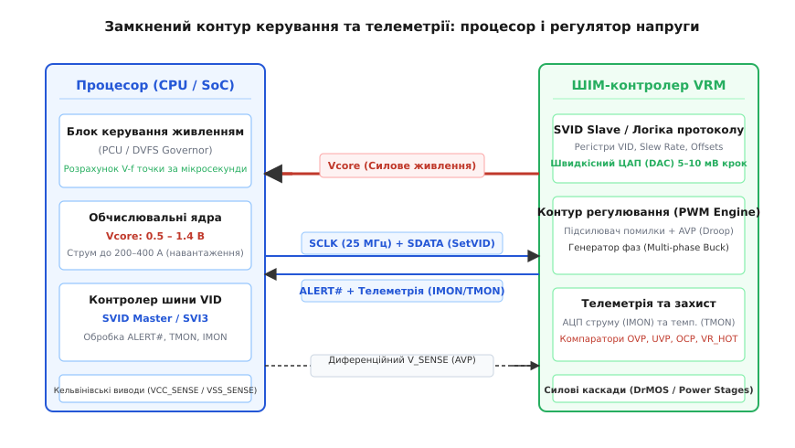
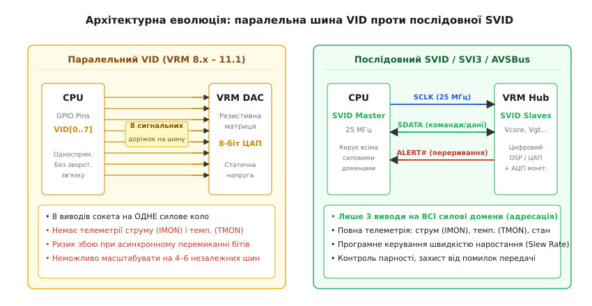
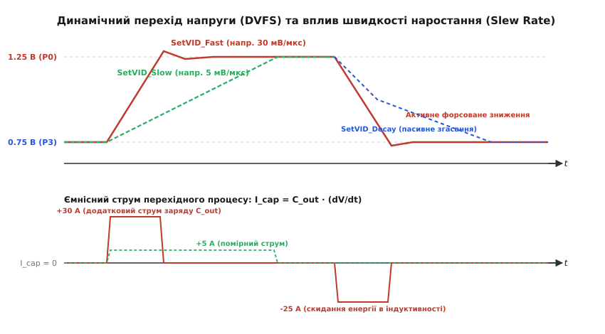
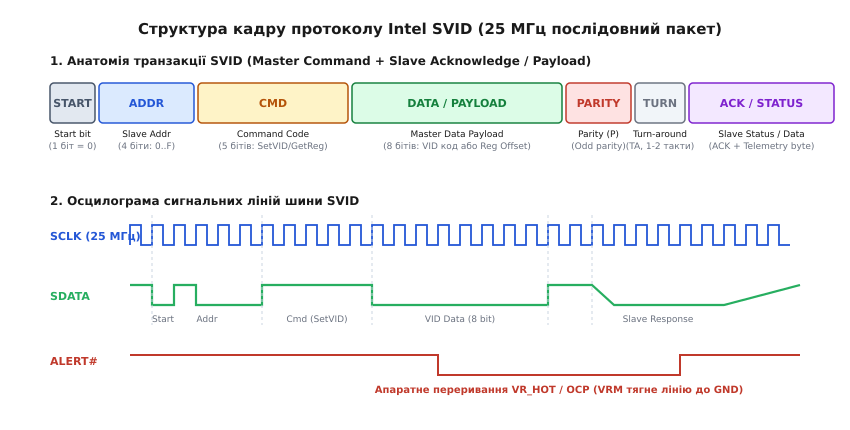

# VID: код напруги від процесора до регулятора

<preknowlist>
- [Buck-перетворювач](root:hw-power/buck) — імпульсне зниження напруги, дросель і комутація ключів.
- [Багатофазний buck-перетворювач](root:hw-power/multiphase-buck) — паралельні фази, зсув за фазою та розподіл струмів.
- [Адаптивне позиціонування напруги](root:hw-power/adaptive-voltage-positioning) — лінія навантаження (load-line), droop control і динамічний коридор напруг.
- [КМОН-логіка](root:hw-digital/cmos) — динамічна потужність, квадратична залежність від напруги та струми витоку.
</preknowlist>

Сучасний мікропроцесор, що об'єднує десятки мільярдів польових транзисторів на кремнієвому кристалі площею у два квадратні сантиметри, у стані спокою на частоті 800 МГц споживає менше десяти ватів при напрузі живлення близько 0.65 В. Проте коли операційна система скеровує на нього масивний потік векторних обчислень, тактова частота ядер за частки мікросекунди злітає до 5.5 ГГц. На такій екстремальній частоті транзистори логічних вентилів не здатні перезаряджати свої підзатворні ємності при низькому потенціалі: кремнієвій структурі стає критично необхідно підняти напругу живлення до 1.30–1.35 В, а струм споживання миттєво стрибає вище трьохсот амперів.

Якби перетворювач напруги на материнській платі постійно подавав максимальні 1.35 В, процесор навіть без обчислювального навантаження розсіював би десятки ватів у вигляді паразитного тепла через тунельні струми витоку крізь атомарно тонкий діелектрик затворів. Якщо ж зафіксувати напругу на рівні 0.65 В, процесор ніколи не зможе підняти частоту вище базового гігагерца, оскільки час затримки логічного перемикання вентиля обернено пропорційний до прикладеної напруги. Напруга живлення кремнієвого кристала мусить неперервно і динамічно адаптуватися до миттєвого робочого стану сотні разів на секунду.

Для такого динамічного керування процесор не може використовувати аналогові підлаштування чи зовнішні підрядні резистори. Він повинен самостійно, у цифровому вигляді, формувати точну інструкцію для імпульсного стабілізатора, визначаючи цільовий потенціал з дискретністю до кількох мілівольтів. Цей цифровий механізм узгодження напруги між обчислювальним кристалом та його стабілізатором отримав назву **ідентифікації напруги** (VID — Voltage Identification, від лат. *identificare* — ототожнювати).

---

### Фізичний фундамент динамічного масштабування напруги та частоти (DVFS)

Щоб зрозуміти, чому сигнал VID є найважливішим контуром керування в цифровій електроніці, розглянемо енергетичний баланс КМОН-транзистора. Сумарна споживана потужність мікропроцесора складається з двох фундаментальних компонентів: динамічної потужності комутації та статичної потужності втрат:

```
P_total = P_dyn + P_stat
P_dyn   = α · C_eff · V² · f
P_stat  = V · I_leak(V, T)
```

де `α` — коефіцієнт активності логіки (частка вентилів, що перемикаються за тактовий цикл), `C_eff` — ефективна еквівалентна ємність усіх комутованих затворів і паразитних мікропровідників кристала, `V` — напруга живлення ядра (`Vcore`), `f` — тактова частота перемикання, а `I_leak` — статичний струм витоку, що експоненційно зростає з підвищенням напруги та температури `T`.

Динамічна потужність залежить від напруги живлення строго квадратично: зниження напруги живлення лише на 20 % (наприклад, з 1.25 В до 1.00 В) зменшує енергію кожного тактового перемикання на 36 %:

```
(1.00 / 1.25)² = 0.64  (економія динамічної енергії становить 36 %)
```

Водночас гранична тактова частота `f_max`, на якій здатний надійно функціонувати цифровий синхронний конвеєр, жорстко обмежена часом поширення сигналу крізь найдовший критичний шлях комбінаційної логіки `t_delay`:

```
f_max ≤ 1 / t_delay
t_delay ∝ (C_load · V) / (k · (V - V_th)^α_sat)
```

де `V_th` — порогова напруга відкривання каналу польового транзистора (зазвичай 0.3–0.4 В для сучасних техпроцесів), а `α_sat` — коефіцієнт швидкісного насичення носіїв заряду (від 1.1 до 1.3).

Коли напруга `V` наближається до порогової напруги `V_th`, струм насичення транзистора стрімко падає, затримка заряду мікроємностей `t_delay` зростає в рази, і максимальна стабільна частота різко падає. Звідси виникає безальтернативна інженерна залежність: **кожному фіксованому значенню тактової частоти відповідає строго мінімальна стабільна напруга живлення**. Будь-який надлишок напруги понад цей поріг спалюється як непотрібне тепло; будь-який дефіцит напруги призводить до порушення таймінгів фіксації тригерів (setup time violations) і краху обчислень.

Ця оптимізаційна стратегія отримала назву **динамічного масштабування напруги та частоти** (DVFS — Dynamic Voltage and Frequency Scaling, від грец. *dynamikos* — сильний, рухливий). Програмний планувальник операційної системи або внутрішній апаратний контролер керування живленням процесора (PCU — Power Control Unit) безперервно аналізує глибину черги інструкцій, температуру та ліміти струму, миттєво змінюючи робочі точки (P-States). Підвищення частоти вимагає випереджального підйому напруги; зниження навантаження дозволяє скинути напругу на безпечний мінімум. Саме цифровий код VID є тією командою, якою процесор диктує стабілізатору материнської плати потрібну точку на кривій DVFS.

---

### Замкнений контур регулювання: від цифрового слова до напруги кристала

Регулятор напруги процесора (VRM — Voltage Regulator Module) являє собою багатофазний імпульсний перетворювач, вихідна напруга якого стабілізується аналоговим або цифровим контуром зворотного зв'язку.

У класичному стабілізаторі напруги вихідний потенціал задається фіксованим дільником напруги на прецизійних резисторах, що під'єднані до входу підсилювача помилки. Проте в процесорному живленні аналоговий дільник не може бути жорстко розпаяний на платі. Замість цього один зі входів підсилювача помилки під'єднується до виходу прецизійного внутрішнього цифро-аналогового перетворювача (ЦАП / DAC), інтегрованого безпосередньо в ШІМ-контролер.


*Замкнений контур керування між процесором та багатофазним регулятором VRM. Внутрішній блок керування живленням (PCU) обчислює цільову робочу точку, транслює код VID через послідовну шину в ЦАП контролера, контур ШІМ формує напругу живлення за диференційним кельвінівським відгуком, а зворотна телеметрія струму й температури забезпечує захист та балансування потужності.*

Робота замкненого контуру відбувається за строгою послідовністю:

1. **Генерація запиту на кристалі:** Внутрішній блок PCU ухвалює рішення перевести групу ядер на нову частоту. Він бере з внутрішньої заводської таблиці калібрування кремнію (Fuses / V-f curve) двійковий код VID, що відповідає обраному степу.
2. **Передача коду по шині:** Інтерфейс формує цифровий пакет і передає код у ШІМ-контролер стабілізатора.
3. **Оновлення опорного потенціалу ЦАП:** Цифровий автомат VRM завантажує прийнятий код у внутрішній регістр ЦАП. ЦАП генерує аналогову опорну напругу `V_ref(VID)` з типовим кроком 5 мВ, 6.25 мВ або 10 мВ.
4. **Порівняння в підсилювачі помилки:** Підсилювач помилки ШІМ-контролера безперервно порівнює опорну напругу `V_ref` з реальною напругою, знятою безпосередньо з контактних майданчиків кристала:
   ```
   V_error = V_ref(VID) - (VCC_SENSE - VSS_SENSE) - V_droop(I_load)
   ```
   де `VCC_SENSE` та `VSS_SENSE` — диференційні лінії кельвінівського підключення від процесора, а `V_droop` — навмисне просідання напруги лінії навантаження [адаптивного позиціонування напруги](root:hw-power/adaptive-voltage-positioning).
5. **Модуляція ключів:** Сигнал помилки `V_error` надходить на компаратори широтно-імпульсної модуляції (PWM), які коригують тривалість відкривання силових польових транзисторів (DrMOS), змінюючи струм у дроселях доти, доки напруга на процесорі не стане рівною замовленому коду VID.

#### Внутрішня мікроархітектура прецизійного ЦАП ШІМ-контролера

Точність утримання вихідної напруги процесора безпосередньо лімітується стабільністю внутрішнього ЦАП контролера VRM. Сучасні ШІМ-контролери містять 8–10-бітні ЦАП зі спеціалізованою архітектурою:

* **Джерело опорної напруги на ширині забороненої зони (Bandgap Reference):** Формує первинний еталонний потенціал `1.205 В` із температурним дрейфом менше 5 ppm/°C у діапазоні від -40 °C до +125 °C.
* **Сегментована резистивна матриця (R-2R + String DAC):** Старші біти коду VID декодуються термометричним перемикачем струмових джерел, що усуває диференційну нелінійність (DNL) і гарантує монотонність зміни напруги без небезпечних проміжних викидів.
* **Чоперна автокомпенсація зміщення нуля (Auto-Zero / Chopper Stabilization):** Аналоговий підсилювач помилки містить схему динамічної модульної компенсації зсуву нуля, що знижує власну напругу зміщення підсилювача до величини менше 0.2 мВ. Це гарантує абсолютну точність виставлення вольтажу `V_ref` у межах ±0.5 % за будь-яких теплових режимів материнської плати.

#### Кельвінівське зчитування та компенсація падіння напруги в сокеті (Remote Sense)

При струмах живлення 200–300 А паразитарний активний опір контактних ніжок сокета, кульок паяння BGA та мідних площин материнської плати (навіть на рівні всього `0.5–1.0 мОм`) створює падіння напруги:

```
V_loss = I_load · R_parasitic = 300 А · 0.0008 Ом = 0.240 В = 240 мВ
```

Втрата 240 мілівольтів на шляху від силових конденсаторів до ядер процесора є неприпустимою. Тому контролер VRM категорично не вимірює напругу на своїх вихідних клемах. Замість цього використовуються окремі сигнальні виводи `VCC_SENSE` та `VSS_SENSE`, які прокладаються як екранована диференційна пара безпосередньо від центральних контактних майданчиків кристала процесора (Kelvin Sensing). Контур регулювання контролера VRM автоматично піднімає напругу на виході фаз рівно на величину `V_loss`, гарантуючи, що на самому кремнії потенціал строго відповідає замовленому значенню VID.

---

### Паралельна шина VID: конструкція та межі масштабування

Історично перші системи ідентифікації напруги, що з'явилися в середині 1990-х років у специфікаціях Intel VRM 8.x для процесорів Pentium Pro і Pentium II, базувалися на чисто паралельному інтерфейсі.

На роз'ємі процесорного сокета виділялася група спеціальних сигнальних виводів: `VID0`, `VID1`, `VID2`, `VID3` (4 біти), згодом розширена до 5 бітів (`VRM 8.4`, `VRM 9.0`), 6 бітів (`VRM 10.0`) та 8 бітів (`VRM 11.0 / 11.1`). Кожен такий вивід усередині процесора являв собою або заземлений контакт (логічний нуль `0`), або відсутність з'єднання (стан високого імпедансу `High-Z`). На материнській платі біля ШІМ-контролера кожна лінія підтягувалася резистором до напруги логіки +3.3 В або +1.2 В (логічна одиниця `1`).

Детальний історичний шлях розвитку стандартів паралельного кодування від джамперів до багатобітних сокетів розглянуто в нарисі [📜 Еволюція специфікацій VRM та паралельного коду VID](root:hw-power/vid-voltage-identification/hist-vrm-evolution.md).

```
Таблиця еволюції паралельних стандартів кодування VID:
┌──────────────┬──────┬──────────────┬────────────┬────────────────────────┐
│ Специфікація │ Біти │ Крок напруги │ Діапазон   │ Типовий процесор       │
├──────────────┼──────┼──────────────┼────────────┼────────────────────────┤
│ VRM 8.1 / 8.2│ 4-bit│ 100 мВ       │ 2.1 – 3.5 В│ Pentium Pro (Socket 8) │
│ VRM 8.4      │ 5-bit│ 50 мВ        │ 1.3 – 3.5 В│ Pentium III (Slot 1)   │
│ VRM 9.0      │ 5-bit│ 25 мВ        │ 1.1 – 1.85В│ Pentium 4 (Socket 423) │
│ VRM 10.0     │ 6-bit│ 12.5 мВ      │ 0.83–1.60 В│ Pentium 4 Prescott     │
│ VRM 11.0/11.1│ 8-bit│ 6.25 мВ      │ 0.50–1.60 В│ Core 2 Duo / Quad      │
└──────────────┴──────┴──────────────┴────────────┴────────────────────────┘
```

Паралельний інтерфейс відзначався абсолютною простотою: логічні рівні з виводів процесора безпосередньо надходили на входи декодера матриці R-2R внутрішнього ЦАП контролера. Проте на зламі 2008–2010 років ця архітектура зазнала нищівної кризи з трьох фундаментальних причин:

1. **Фізичний дефіцит виводів сокета:** У процесорах з'явилися інтегровані графічні ядра (iGPU), системні агенти контролерів пам'яті (System Agent / Uncore), вбудовані шини PCI Express і пам'ять. Кожна з цих підсистем вимагає власної повністю незалежної шини живлення зі своїм динамічним вольтажем: `Vcore`, `Vgt`, `Vccsa`, `Vccio`. Для чотирьох незалежних шин живлення 8-бітний паралельний інтерфейс вимагав би виділення `4 × 8 = 32` окремих сигнальних ніжок процесора і трасування тридцяти двох прецизійних високоомних доріжок через перевантажені шари материнської плати.
2. **Небезпека хибних перехідних станів (Skew Hazard):** При динамічній зміні напруги процесор перемикав одночасно кілька бітів. Через різну паразитарну ємність доріжок та затримки логіки один біт міг перемкнутися на 2 наносекунди раніше за інший. Наприклад, при переході коду з `01111111` (0.800 В) у `10000000` (0.80625 В) на коротку мить на шині міг утворитися проміжний стан `11111111` (аварійне вимкнення або 0.500 В) чи `00000000` (максимальна напруга 1.600 В), провокуючи хибне спрацьовування апаратного захисту.
3. **Односпрямованість і повна сліпота процесора:** Паралельна шина була виключно передавачем «в один бік». Процесор не мав жодної можливості прочитати від стабілізатора реальний струм споживання, температуру силових ключів, статус готовності лінії живлення (`Power Good`) або факт перегріву.


*Архітектурне порівняння паралельного та послідовного інтерфейсів VID. Паралельна шина (ліворуч) вимагає 8 фізичних ліній на кожен окремий силовий домен і позбавлена зворотного зв'язку. Послідовна шина SVID (праворуч) використовує лише 3 сигнальні лінії на весь сокет, забезпечуючи цифрову адресацію множини доменів, контроль цілісності даних і повну двоспрямовану телеметрію струму та температури.*

---

### Швидкісні послідовні шини: Intel SVID, AMD SVI2/SVI3 та AVSBus

Виходом із кризи паралельних інтерфейсів став перехід на спеціалізовані високошвидкісні синхронні послідовні інтерфейси зв'язку між процесором та VRM.

#### Архітектура шини Intel SVID (Serial Voltage Identification)

Починаючи з мікроархітектури Nehalem/Sandy Bridge (специфікації VR12.0, VR12.5, VR13, VR14, VR14HC), компанія Intel стандартизувала 3-провідну швидкісну послідовну шину **SVID**:

* **`SCLK` (Serial Clock):** Тактовий сигнал, що генерується виключно ведучим пристроєм (Master — процесор) на фіксованій частоті до **25 МГц** (період такту 40 нс).
* **`SDATA` (Serial Data):** Двоспрямована лінія даних з логічним рівнем 1.05 В (або 1.2 В). Використовує каскади з відкритим стоком (open-drain) або комплементарні вихідні каскади push-pull з керованим перемиканням напрямку.
* **`ALERT#` (Asynchronous Alert):** Двоспрямована лінія асинхронного переривання з активним низьким рівнем. Стабілізатор напруги притискає цю лінію до землі (GND) у разі виникнення критичних подій: аварійного струму (OCP), перегріву (`VR_HOT`), просідання напруги або завершення стабілізації напруги після команди зміни вольтажу.

Шина SVID підтримує топологію «один Master — до 16 підпорядкованих пристроїв (Slaves)». Кожен логічний регулятор у системі має власну 4-бітну адресу:
* `0x0`: Vcore (основні обчислювальні ядра);
* `0x1`: Vgt / Vgfx (інтегрований графічний адаптер);
* `0x2`: Vsa / Vccsa (System Agent — системний агент, контролер пам'яті та PCIe);
* `0x3`: Vccio / Vddq (шина вводу-виводу або пам'ять);
* `0xF`: Швидкомовний широкомовний запит (Broadcast) до всіх підключених фаз одночасно.

Повний апаратний стек транзакцій, таймінги ліній, біти парності та реєстрову карту SVID наведено в довіднику [📋 Протокол та реєстрова карта шини Intel SVID](root:hw-power/vid-voltage-identification/api-svid-protocol.md).

#### Архітектура інтерфейсів AMD SVI2 та SVI3

Компанія AMD для процесорів сімейств Bulldozer, Zen (Socket AM4, AM5, SP3/SP5) розробила власні послідовні стандарти:
* **SVI2 (Serial Voltage Identification 2):** 2-провідний інтерфейс (`SVC` — тактування до 40 МГц, `SVD` — двоспрямовані дані). Протокол орієнтований на паралельне керування двома ключовими площинами живлення: `VDD` (ядра CPU) та `VDDNB` / `VDDCR_SOC` (контролери пам'яті й північний міст).
* **SVI3 (Serial Voltage Identification 3):** Сучасний 3-провідний стандарт для сокетів AM5 та серверних платформ EPYC Genoa/Bergamo. Частота тактування піднята до **50 МГц**, додана лінія апаратного переривання `ALERT#`, впроваджено 10-бітне кодування напруги з ультратонким кроком до **1.95 мВ** (512–1024 рівні напруги в діапазоні від 0.25 В до 1.55 В), а також циклічний надлишковий контроль (CRC-8) кожного інформаційного кадру для повного усунення ризику спотворення команд.

#### Відкритий стандарт PMBus / AVSBus

Для універсальних серверних систем, процесорів на архітектурах ARM64 (Ampere, AWS Graviton) та графічних прискорювачів консорціум SMIF розробив відкритий протокол **AVSBus** (Adaptive Voltage Scaling Bus), що є частиною специфікації **PMBus 1.3**:
* 3-провідний інтерфейс: `AVS_Clock` (до 50 МГц), `AVS_Mdata` (команди від процесора), `AVS_Sdata` (телеметрія від VRM).
* Пакет фіксованої довжини 32 біти з постійною відстанню між запитом і відповіддю (latency = 2 такти).
* Пряме апаратне сполучення з контуром внутрішнього моніторингу затримок критичного шляху кремнію (Ring Oscillators / CPM — Critical Path Monitors).

```
Порівняльна таблиця сучасних цифрових протоколів керування напругою:
┌──────────────┬──────────┬──────────────┬──────────────┬──────────────┬────────────────────────┐
│ Протокол     │ Тактування│ Розрядність  │ Крок напруги │ Лінії зв'язку│ Контроль цілісності    │
├──────────────┼──────────┼──────────────┼──────────────┼──────────────┼────────────────────────┤
│ Intel SVID   │ 25 МГц   │ 8 / 9 бітів  │ 5.0 / 10 мВ  │ 3 лінії      │ Odd Parity (непарність)│
│ AMD SVI2     │ 40 МГц   │ 8 бітів      │ 6.25 мВ      │ 2 лінії      │ Parity bit             │
│ AMD SVI3     │ 50 МГц   │ 9 / 10 бітів │ 1.95 / 5.0 мВ│ 3 лінії      │ CRC-8 чексума          │
│ AVSBus 1.3   │ 50 МГц   │ 8 / 16 бітів │ 1.0 / 5.0 мВ │ 3 лінії      │ 3-bit CRC              │
└──────────────┴──────────┴──────────────┴──────────────┴────────────────────────────────────────┘
```

---

### Процедура ініціалізації та початкового старту (Power-On Sequencing & Boot VID)

Перед тим як процесор зможе виконувати код операційної системи та динамічно керувати вольтажем через шину SVID, система живлення проходить детерміновану апаратну послідовність запуску (Power-On Sequence):

1. **Подача чергових напруг (Standby Rails):** Блок живлення та допоміжні перетворювачі материнської плати вмикають базові лінії живлення логіки сокета: `VCCIO`, `VCCST` (Sustained Rail, 1.05 В) та живлення пам'яті `VDDQ`.
2. **Апаратний стан скиду (Reset Hold):** Сигнал скиду `RESET#` утримується в низькому стані, блокуючи виконання інструкцій обчислювальними ядрами.
3. **Виставлення безпечної напруги старту (Boot VID):** ШІМ-контролер VRM зчитує стан апаратних конфігураційних виводів (Bootstrap Pins) на платі або встановлює стандартну фіксовану напругу безпечного старту `Boot VID` (зазвичай 1.00–1.05 В для Intel або 1.10 В для AMD). На цій фіксованій напрузі запускається внутрішній мікроконтролер керування живленням процесора (PCU).
4. **Первинне рукостискання (SVID Handshake):** Блок PCU починає тактувати лінію `SCLK` на базовій частоті та надсилає команду читання `GetReg(0x00)` (Vendor ID) до підпорядкованого каналу `0x0`. Якщо контролер повертає дійсний ідентифікатор мікросхеми та виставляє біт `Power_Good = 1` у регістрі `Status1`, процесор знімає сигнал `RESET#` і передає перші динамічні пакети `SetVID_Fast` для завантаження ядра BIOS/UEFI.

---

### Динаміка перехідного процесу: швидкість наростання (Slew Rate) і ємнісні струми

Зміна напруги на виході потужного імпульсного стабілізатора не може відбуватися стрибкоподібно за нульовий час. Швидкість зміни напруги в часі називається **швидкістю наростання** (Slew Rate):

```
SR = dV / dt  [В/мкс або мВ/мкс]
```


*Динаміка зміни напруги при кроці DVFS. Швидкий перехід (SetVID_Fast, червона лінія) забезпечує миттєвий вихід на частоту Turbo Boost за рахунок короткого піка струму заряду конденсаторів. Повільний перехід (SetVID_Slow, пунктир) знижує струмове навантаження. Знизу показано ємнісний струм зміщення I_cap = C_out · (dV/dt).*

Під час будь-якої зміни вихідної напруги вся батарея вихідних фільтрувальних конденсаторів стабілізатора (керамічні конденсатори MLCC під сокетом та танталово-полімерні ємності сумарним номіналом `C_out = 1000–3000 мкФ`) вимагає додаткового струму заряду або розряду:

```
I_cap = C_out · (dV / dt)
```

Порахуймо реальний фізичний приклад: перехід напруги ядра `ΔV = 0.5 В` (підйом з 0.75 В до 1.25 В при переході в режим Turbo Boost) для системи з ємністю фільтра `C_out = 2000 мкФ`.

```
Швидкий перехід (Fast Slew Rate, SR = 30 мВ/мкс = 30 000 В/с):
  Час наростання напруги:
    Δt = ΔV / SR = 0.5 В / 0.030 В/мкс = 16.67 мкс

  Додатковий струм заряду конденсаторів:
    I_cap = 2000·10⁻⁶ Ф · 30 000 В/с = +60.0 А
```

Шістдесят амперів — це струм, який багатофазний стабілізатор мусить віддати у вихідну ємність **понад** корисний робочий струм ядер процесора. Якщо ядра в цей момент уже починають споживати 150 А, сумарний піковий струм крізь дроселі досягне `150 + 60 = 210 А`.

Щоб розробник міг точно керувати компромісом між затримкою переходу на нову частоту та піковим навантаженням на елементи VRM, протокол VID передбачає три спеціалізовані команди зміни напруги:

1. **`SetVID_Fast`:** Агресивне наростання або спад напруги з максимальною допустимою швидкістю (типово 20–40 мВ/мкс). Використовується при екстреному підвищенні навантаження, коли обчислювальні конвеєри чекають підвищеної напруги для негайного розгону тактової частоти.
2. **`SetVID_Slow`:** Плавна зміна напруги зі швидкістю, зниженою у 4–8 разів (типово 2.5–5 мВ/мкс). Використовується при повільних теплових переходах і плановому виході на енергоощадні режими. Ємнісний струм `I_cap` при цьому падає до незначних 5–10 А, мінімізуючи теплові втрати та виключаючи ризик просідання вхідної шини 12 В.
3. **`SetVID_Decay`:** Спеціальний режим пасивного згасання напруги при скиданні навантаження. ШІМ-контролер не відкриває нижні транзистори силових каскадів для примусового закорочування ємностей на землю, а просто переводить силові ключі у високоомний стан (трифазний стан / Diode Emulation Mode). Напруга на вихідних конденсаторах повільно й плавно спадає природним шляхом за рахунок власного залишкового струму споживання сплячого кристала процесора. Це повністю усуває негативні струми індуктивностей та запобігає закиданню зворотної енергії у вхідні ланцюги живлення материнської плати.

Математичне моделювання обмежень швидкості за індуктивністю дроселів `di_L/dt = (V_in - V_out) / L`, енергетичні баланси перезаряду ємностей та розрахунок оптимального темпу наведено у вставці [🧮 Математика перехідних процесів та slew rate у DVFS](root:hw-power/vid-voltage-identification/math-slew-rate-dvfs.md).

---

### Двоспрямована телеметрія: струм (IMON), температура (TMON) та моніторинг потужності

Сучасна шина VID — це не просто лінія відправлення наказів вольтажу, а нервова система енергетичного менеджменту кристала. Кожні кілька мікросекунд процесор опитує стабілізатор або отримує від нього поточні фізичні параметри стану:

```
┌─────────────────────────┐                ┌─────────────────────────┐
│        ПРОЦЕСОР         │   SetVID_Fast  │   ШІМ-КОНТРОЛЕР VRM     │
│                         ├───────────────►│                         │
│  Внутрішній алгоритм    │                │  АЦП вимірювання струму │
│  балансування потужності│  IMON Telemetry│  (DCR Sense / DrMOS)    │
│  (Intel PL1/PL2/PL4     │◄───────────────┤                         │
│   AMD PPT/EDC/TDC)      │  TMON Telemetry│  Терморезистор NTC /    │
│                         │◄───────────────┤  Діодний датчик DrMOS   │
└─────────────────────────┘                └─────────────────────────┘
```

#### 1. Моніторинг сумарного вихідного струму (IMON / IOUT)
ШІМ-контролер VRM підсумовує струми всіх активних фаз, виміряні за допомогою DCR-сенсингу дроселів або внутрішніх дзеркал струму інтелектуальних силових збірок DrMOS. Цей сумарний аналоговий сигнал оцифровується вбудованим АЦП контролера з роздільною здатністю 8 бітів (де `0xFF` відповідає максимальному розрахунковому струму системи `I_max`, наприклад 255 А з кроком 1 А на біт).

Отримуючи значення коду `IMON`, процесор перемножує поточну напругу `V_VID` на струм `I_IMON` і визначає точну миттєву споживану електричну потужність кристала:

```
P_core = V_VID · I_IMON
```

На основі цього числа алгоритми терморегуляції керують тривалістю лімітів енергоспоживання (Intel Turbo Boost Power Limits PL1, PL2, PL4 або AMD PPT/TDC). Якщо струм наближається до небезпечного ліміту VRM (Electrical Design Current — EDC), процесор за кілька мікросекунд знижує множник тактової частоти ядра, запобігаючи перегоранню котушок і транзисторів.

#### 2. Моніторинг температури силових елементів (TMON / VR_HOT)
Біля найбільш навантажених силових транзисторів VRM або всередині кристала DrMOS інтегровано термодатчики. Цифровий код температури `TMON` передається в діапазоні від 0 °C до 255 °C з кроком 1 °C на біт (де значення `0x00` відповідає 0 °C, а `0xFF` — 255 °C).

Якщо температура VRM перетинає поріг критичного перегріву (зазвичай +105 °C або +115 °C), контролер стабілізатора не чекає чергового опитування шини, а **миттєво опускає лінію `ALERT#` до нуля** (сигнал `VR_HOT#` / Voltage Regulator Hot). Процесор, фіксуючи падіння `ALERT#`, негайно активує аварійний тротлінг (PROCHOT#), скидаючи робочу частоту до базових 800 МГц за лічені мікросекунди, даючи радіаторам змогу розсіяти надлишкове тепло.

---

### Апаратний захист та аварійні сценарії: OVP, UVP, OCP

Контур ідентифікації напруги безпосередньо взаємодіє з підсистемою захисту кристала від фатальних електричних пошкоджень:


*Структура транзакції та сигнальні осцилограми протоколу SVID. Угорі — анатомія пакета з полями адреси, команди, даних, парності та підтвердження. Унизу — часова діаграма тактування 25 МГц і спрацьовування асинхронного переривання ALERT# при аварії.*

```
Співвідношення порогів захисту щодо встановленого значення VID:
  ┌────────────────────────────────────────────────────────┐
  │  +200 мВ : Абсолютний захист від перенапруги (OVP)     │ -> Аварійний Crowbar (GND)
  │  +150 мВ : Верхній поріг толерантності перерегулювання │
  │                                                        │
  │  [ V_VID ] : Цільова встановлена напруга процесора     │
  │                                                        │
  │  -150 мВ : Нижній поріг толерантності просідання       │
  │  -300 мВ : Захист від заниженої напруги (UVP)          │ -> Системний скид (Reset)
  └────────────────────────────────────────────────────────┘
```

#### Захист від динамічної перенапруги (Dynamic Tracking OVP)
У класичних джерелах живлення захист від перенапруги (OVP — Over-Voltage Protection, від лат. *protegere* — прикривати, захищати) має фіксований статичний поріг (наприклад, відсікання при перевищенні 1.5 В). Проте в системі з динамічним вольтажем VID такий фіксований поріг є смертельним: коли процесор працює в режимі сну при `VID = 0.65 В`, аварійний стрибок напруги до 1.4 В пробив би підзатворний діелектрик задовго до спрацьовування порогу 1.5 В.

Тому контролери VRM реалізують **динамічний захист OVP, що стежить за VID** (Tracking OVP): поріг аварійного спрацьовування встановлюється відносно поточного коду VID, як правило:

```
V_OVP_threshold = V_VID(t) + ΔV_OVP  (де ΔV_OVP зазвичай становить +150..+200 мВ)
```

Коли код VID динамічно змінюється, вікно OVP плавно зміщується синхронно зі швидкістю наростання `Slew Rate`. Якщо напруга пробиває це вікно (наприклад, через коротке замикання верхнього силового транзистора на вхідну шину 12 В), контролер VRM за десятки наносекунд вмикає захист типу «тиристорної закоротки» (Crowbar): повністю й безповоротно відкриває всі нижні польові транзистори (Low-Side MOSFETs), закорочуючи вихід на землю. Це силоміць притискає напругу до нуля й перепалює вхідний запобіжник або спрацьовує захист блоку живлення, рятуючи процесор ціною модуля регулятора.

Практичну програмну реалізацію моніторингу та декодування пакетів SVID наведено у проєкті [⚙️ Програмний декодер протоколу SVID та монітор телеметрії VRM](root:hw-power/vid-voltage-identification/proj-svid-sniffer.md).

---

> 🔧 **Навіщо це.**
>
> У сучасній розробці обчислювальних модулів та материнських плат шина VID є найголовнішим діагностичним каналом при старті системи (Power-On Reset). Коли плата не вмикається або циклічно перезавантажується, інженер підключає логічний аналізатор чи цифровий осцилограф до ліній `SCLK`, `SDATA` та `ALERT#`. За формою та послідовністю пакетів SVID одразу видно діагноз:
>
> 1. Якщо на лінії `SCLK` взагалі немає генерації тактових імпульсів 25 МГц — процесор не отримує базового живлення системного агента (`VCCIO`/`VCCST`), перебуває в апаратному скиді (`RESET#`) або пошкоджено кристал.
> 2. Якщо процесор передає пакети `SetVID_Fast` з адресою `0x00`, але лінія `ALERT#` негайно падає в нуль або напруга не піднімається — ШІМ-контролер сигналізує про апаратну несправність силових каскадів DrMOS, обрив ланцюгів кельвінівського сенсингу або перевантаження за струмом.
> 3. Розуміння механіки Slew Rate та таблиць зміщення VID (Voltage Offset / Undervolting) дозволяє інженерам та ентузіастам оптимізувати енергоефективність: зниження напруги ядра на 50–70 мВ від заводського VID зменшує тепловиділення процесора на 15–25 Вт без втрати стабільності обчислень.
