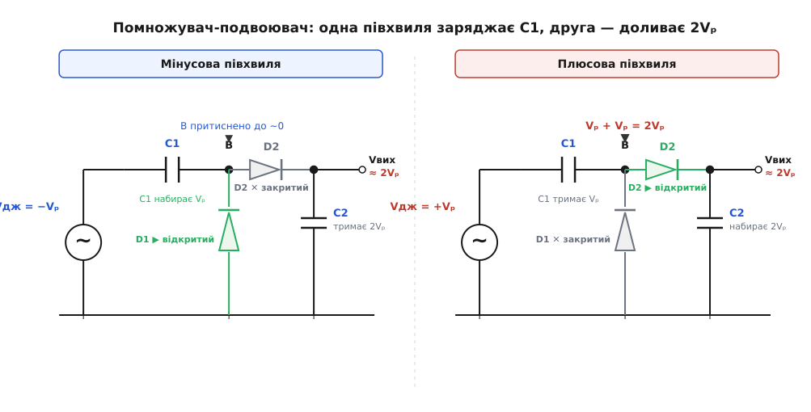
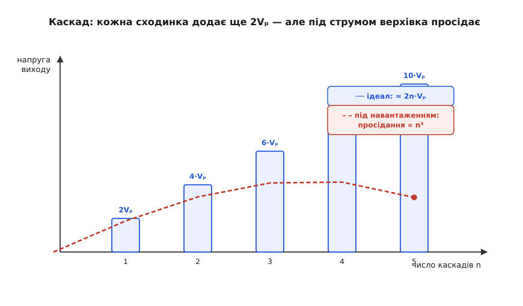

# Помножувач напруги: 2·Vₚ без більшого трансформатора

<preknowlist>
- [DC і AC](topic:ph-electromagnetism/dc-vs-ac) — змінна напруга гойдається туди-сюди й має пік Vₚ; постійна тече рівно в один бік.
- [Випрямлення](topic:hw-power/rectification) — діод із конденсатором заряджає той конденсатор до піку напруги й тримає його (піковий випрямляч).
- [Конденсатор](topic:hw-components/capacitor) — накопичує заряд і зберігає напругу між пластинами, навіть коли його виводи «возять» схемою.
- [ВАХ діода](topic:hw-components/diode-iv-curve) — пропускає струм лише в один бік і «з'їдає» на собі ≈0.7 В.
</preknowlist>

Піковий випрямляч робить із [змінної напруги](topic:hw-power/rectification) постійну десь на рівні піку обмотки — Vₚ. Та раз у раз потрібно **більше** за цей пік: вдвічі, втричі, а трансформатор дає що дає. Найгрубіший вихід — домотати вторинну обмотку: більше міді, більший осердя, дорожче, а часто й неможливо (трансформатор — той, що є під рукою, або взагалі сама мережа без жодного трансформатора). Звідси й питання, з якого народжується вся схема: чи можна кількома діодами й конденсаторами дістати **2·Vₚ** з тієї самої змінної напруги, не намотавши жодного зайвого витка? Можна — і робить це **помножувач напруги** (у найпростішому випадку — подвоювач).

### Як конденсатор «підсаджує» синусоїду

Уся хитрість тримається на одній властивості конденсатора: заряджений, він зберігає напругу між пластинами, навіть коли його виводи переносять у схемі — заряду нема куди подітися. Візьмімо обмотку з піком Vₚ, поставмо конденсатор C1 **послідовно** з нею, а два діоди почепімо так, як на схемі. Простежмо два півперіоди.

**Мінусова півхвиля.** Джерело тягне свій «гарячий» вивід донизу, до −Vₚ. Тоді відкривається діод D1 (той, що на землю) і пускає струм від землі крізь себе у вузол B, а далі крізь C1 назад до джерела. C1 наливається — заряджається до Vₚ, і його пластина з боку джерела стає негативною. Вузол B тим часом притиснено відкритим D1 майже до нуля.

**Плюсова півхвиля.** Тепер джерело штовхає гарячий вивід угору, до +Vₚ. Але C1 усе ще тримає свої Vₚ (заряд лишився), і він **у серії** — тому додається. Вузол B, який був біля нуля, підскакує до Vₚ (від джерела) + Vₚ (від C1) = **2·Vₚ**. D1 замикається (B тепер високо), відкривається D2 — і цей пік 2·Vₚ переливає заряд у вихідний конденсатор C2. C2 набирає 2·Vₚ і тримає їх для навантаження; кожен період доливає його назад.


*Ліворуч — мінусова півхвиля: відкритий D1 заряджає послідовний C1 до Vₚ. Праворуч — плюсова: заряджений C1 додається до джерела, вузол B злітає до 2·Vₚ, і крізь D2 це напирає у вихідний C2. За період C2 добирає до подвоєного піку.*

Погляньмо на те саме інакше — і механізм стане прозорим до кінця. За повний період C1 просто **додає сталий зсув +Vₚ** до гойдливого джерела: піднімає всю синусоїду так, що її низ сідає біля нуля, а пік дотягується до 2·Vₚ. А D2 з C2 — це вже звичайнісінький [піковий випрямляч](topic:hw-power/rectification), що ловить цей піднятий пік. Тобто подвоювач = «підсадка» синусоїди на Vₚ вгору плюс піковий випрямляч над нею. На виході, щоправда, не рівно 2·Vₚ, а 2·Vₚ мінус **два** [падіння на діодах](topic:hw-components/diode-iv-curve) (по ≈0.7 В), бо дорогою до виходу заряд перетинає два діоди.

**Умова.** Обмотка дає 12 В діючих (RMS). Що побачимо на виході подвоювача?

```
Vₚ   = 12 В · √2 ≈ 17 В        пік із діючих 12 В
Vвих ≈ 2·Vₚ − 2·0.7 В
     ≈ 34 − 1.4
     ≈ 32.6 В
```

**Висновок.** З 12-вольтової обмотки — понад 32 В постійних, удвічі більше за пік, і жодного зайвого витка мідi. Заплатили за це лише парою діодів, двома конденсаторами й падінням 1.4 В.

> 🔧 **Навіщо це.** Коли на платі вже є якась змінна напруга (вторинна обмотка, вихід перетворювача, обмотка драйвера), а десь треба вдвічі вища постійна на невеликий струм — подвоювач дає її «зі здачі», без окремого підвищувача й котушки. Класика — живлення драйвера верхнього ключа чи невеликого зміщення від наявної обмотки.

### Не спинятися на двох: каскад

Якщо один щабель «підсадь-і-випрями» приносить 2·Vₚ, навіщо спинятися на одному? Складімо ті самі діодно-конденсаторні щаблі один на один: кожен новий переносить заряд ще на сходинку вище, і вихід дереться вгору — 2·Vₚ, 4·Vₚ, 6·Vₚ — **n щаблів дають приблизно 2n·Vₚ**. Ця драбина і є помножувач у повному сенсі; її класична форма — [каскад Кокрофта–Волтона](topic:hw-power/voltage-doubler/hist-cockcroft-walton.md) (каскад — від фр. *cascade*, водоспад, спадання уступами). Заради цього все й затівалося: дістати дуже високу постійну напругу — десятки кіловольтів — там, де трансформатор, намотаний на таку напругу, був би монстром ізоляції та міді.


*Кожен каскад додає ще 2·Vₚ, тож ідеальний вихід росте лінійно (сині сходинки, ≈ 2n·Vₚ). Та під навантаженням верхівка просідає, і що більше каскадів, то глибше провал (штрихова крива) — просідання росте з числом щаблів різко, приблизно як n³.*

### Дарма нічого не буває

Ніякої дармової енергії тут немає — потужність зберігається. У скільки разів підняли напругу, у стільки ж поділили доступний струм, бо конденсатори переносять заряд лише **порціями**, такт за тактом. На практиці кусаються дві межі.

Перша — у виходу є справжній **внутрішній опір**: під навантаженням він просідає, і просідання росте з числом каскадів дуже круто (для класичної драбини — приблизно як n³) та при **нижчій частоті**. Тому помножувач — це джерело **високої напруги на малий струм**: потягнеш забагато — і верхівка сходинок обвалюється. Друга — на виході лишається **пульсація**, залишкова брижа, що більшає з навантаженням і числом щаблів, а меншає з ємністю та частотою.

Обидві межі вказують в один бік: **гнати драбину швидко**. Ось чому високовольтне живлення в телевізорі чи іонізаторі крутить помножувач на десятках кілогерц від невеликого генератора, а не на 50 Гц мережі — вища частота означає, що конденсатори доливаються частіше, тож і просідання, і пульсація за тієї самої ємності падають. Кількісно це видно з [виведення просідання та пульсації каскаду](topic:hw-power/voltage-doubler/math-multiplier-droop.md).

І ще одне на практиці: кожен діод і конденсатор у ланцюгу мусить витримувати десь **2·Vₚ** зворотної напруги, інакше [пробʼється](topic:hw-components/diode-breakdown); деталі дешеві лише тому, що струм малий. Саме такі каскади й досі роблять високу напругу для [кінескопів](topic:hw-motion/crt-tube), рентгенівських трубок, іонізаторів повітря та копіювальних апаратів.

> 🔧 **Навіщо це.** Побачивши на платі стовпчик однакових діодів і конденсаторів, що йде «драбинкою» до якогось високовольтного вузла (трубка, сітка, електрод), ви впізнаєте помножувач. Хочете підняти його вихід — не побільшуйте наосліп ємності, а спершу підніміть робочу частоту: це найдешевший спосіб і збити просідання, і втишити брижу.

Подвоювач не потребує власного такту: мережа й так змінна, а діоди лише **скеровують** кожну півхвилю на потрібну пластину. Подайте на нього постійну напругу — і він не робитиме нічого. Там, де множити треба саме постійну шину (скажімо, 3.3 В логіки до 5 В), ту саму ідею перекладання заряду доповнюють активним ключем і генератором, які самі створюють потрібне чергування, — це [заряд-помпа](topic:hw-power/charge-pump-conv). Фізика та сама — переливання заряду між конденсаторами; подвоювач лише дозволяє мережі перемикати за себе задарма.
