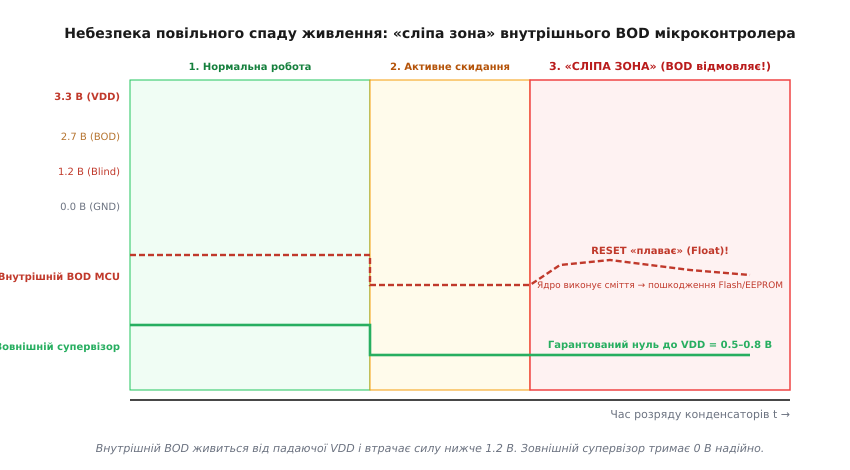
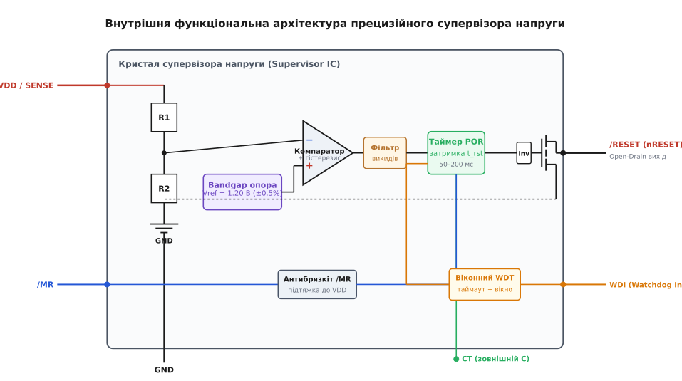
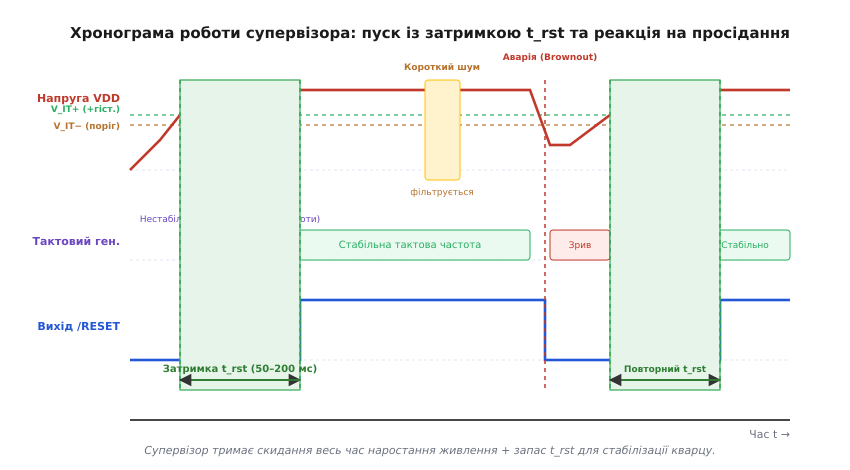
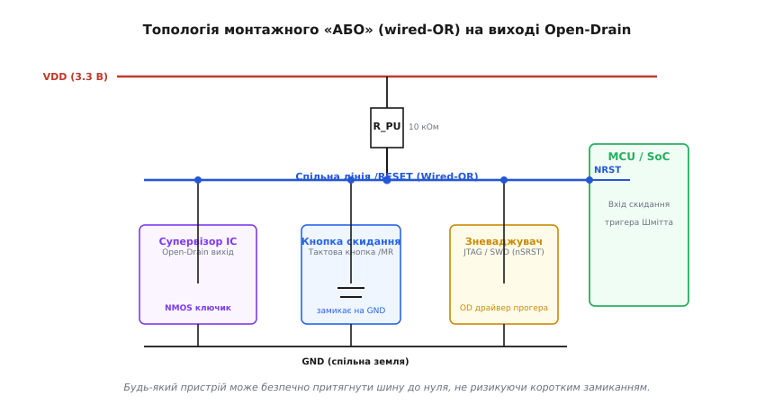
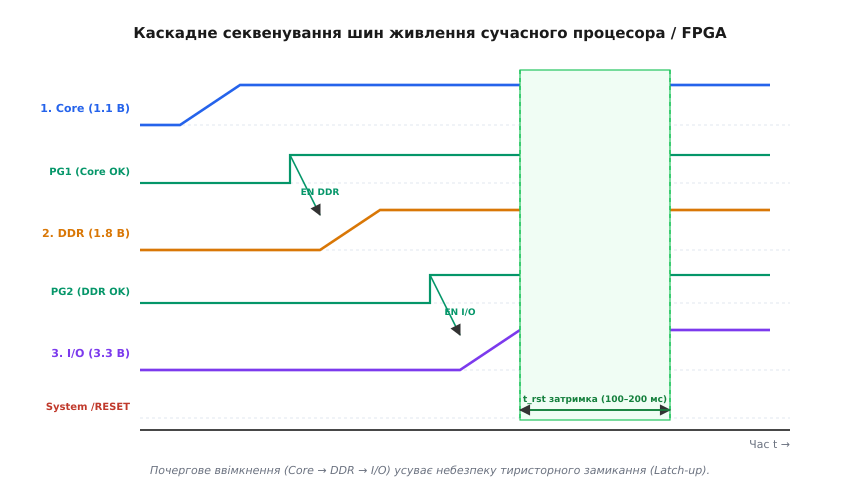
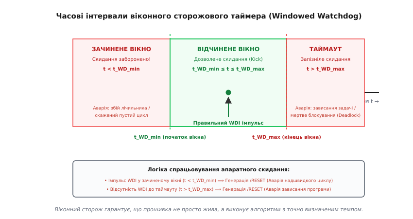

# Супервізор напруги (клас ІС)

<preknowlist>
- [Опорна напруга](root:hw-sensing/voltage-reference) — стабільний еталон напруги (bandgap), з яким порівнюється шина живлення.
- [Компаратор](root:hw-analog/comparator) — базовий аналоговий вузол порівняння двох напруг, що миттєво формує логічний рівень.
- [Тригер Шмітта](root:hw-analog/schmitt-trigger) — гістерезис між порогами спрацьовування й відпускання для захисту від брязкоту на межі стану.
- [Open-drain](root:hw-digital/open-drain-output) — вихідний каскад із відкритим стоком для монтажного «АБО» (wired-OR) та безпечного об'єднання ліній скидання.
- [Блокування за низькою напругою (UVLO)](root:hw-power/uvlo) — системний принцип утримання пристрою у вимкненому стані, поки живлення не досягне робочої норми.
</preknowlist>

Коли інженер проєктує цифрову схему, джерело живлення часто сприймається як ідеальний двійковий перемикач: напруги або немає зовсім (0 В, схема вимкнена), або вона присутня в повному обсязі (3.3 В чи 5.0 В, схема працює). Реальний фізичний світ влаштований інакше. Під час увімкнення напруга наростає поступово протягом мілісекунд, поки заряджаються вхідні та блокувальні конденсатори й виходить на стабільний режим імпульсний або лінійний регулятор. Під час вимкнення чи аварійного від'єднання батареї напруга повільно сповзає до нуля, розряджаючи накопичену ємність. Між нулем і номіналом лежить широка «сіра зона» невизначеності — режим, де живлення вже є, але його замало для коректного функціонування логічних вентилів.

У цій проміжній зоні цифрова електроніка поводиться непередбачувано: внутрішні тригери потрапляють у метастабільні стани, тактові кварцові генератори зривають генерацію або видають паразитні високочастотні пакети імпульсів, а арифметико-логічні пристрої процесорів починають хибно декодувати інструкції. Якщо процесор спробує виконати випадковий код при зниженій напрузі, він може мимовільно перезаписати калібрувальні константи або завантажувач у Flash-пам'яті, стерти налаштування в EEPROM або відкрити одночасно обидва ключі силового моста, спричинивши наскрізне коротке замикання. Супервізор напруги (англ. *Supply Voltage Supervisor, SVS*, або *Reset IC*) — це прецизійна аналого-цифрова мікросхема, єдине завдання якої полягає в тому, щоб тримати мікропроцесор у стані апаратного скидання (Reset), поки напруга не досягне гарантовано безпечного рівня, і миттєво зупинити ядро, щойно напруга просяде нижче критичного порогу.

### Фізика «сірої зони»: чому цифровий світ ламається при спаді живлення

Щоб зрозуміти необхідність спеціалізованої мікросхеми супервізора, погляньмо на процеси всередині КМОН-транзисторів (CMOS, англ. *Complementary Metal-Oxide-Semiconductor* — комплементарна структура метал-оксид-напівпровідник) при плавному падінні напруги `VDD`.

Логічний вентиль КМОН складається з пари транзисторів: верхнього PMOS, що підтягує вихід до `VDD`, та нижнього NMOS, що притягує вихід до `GND`. Кожен із цих транзисторів має свою порогову напругу відкривання каналу `Vth` (типово 0.5–0.8 В). Коли напруга живлення `VDD` падає нижче приблизно `2 · Vth`, транзистори втрачають здатність повністю відкриватися: їхній опір каналу зростає експоненційно, а струм насичення падає в сотні разів.

Наслідки цього процесу катастрофічні для швидкісної цифрової схеми:

1. **Експоненційне зростання затримки поширення (Propagation Delay):**
   Час перемикання логічного вентиля пропорційний заряду ємності навантаження, поділеному на струм транзистора:

```
t_pd ≈ (C_load · VDD) / I_ds
```

   Оскільки струм `I_ds` при зниженні живлення падає набагато швидше, ніж сама напруга `VDD`, затримка поширення сигналу `t_pd` зростає в 10–50 разів. Сигнал, який за нормальних 3.3 В доходив від регістра до входу АЛП за 2 нс, тепер повзе 40 нс.

2. **Порушення часових інтервалів (Setup / Hold Time Violations) та метастабільність:**
   Конвеєр процесора тактується сигналом фіксованої частоти. Якщо затримка комбінаційної логіки перевищує період тактового імпульсу, дані приходять на вхід D-тригера в момент тактового перепаду. Тригер опиняється в метастабільному стані — його вихід зависає на проміжному рівні напруги `VDD / 2` на невизначений час, породжуючи випадкові логічні стани в регістрах прапорців і лічильнику команд (Program Counter).

3. **Колапс вбудованих помпажних перетворювачів (Charge Pumps) Flash-пам'яті:**
   Для стирання та запису комірок пам'яті Flash і EEPROM потрібна локальна напруга 10–15 В, яку формує вбудований помножувач напруги (емітер Фаулера-Нордгейма або інжекція гарячих носіїв). При просіданні `VDD` ефективність помпи падає до нуля. Якщо процесор у стані збою починає цикл запису, комірки пам'яті заряджаються лише частково. В результаті пошкоджується контрольна сума секторів пам'яті, а пристрій перетворюється на «цеглину».

4. **Нестабільність кварцового генератора (Pierce Oscillator):**
   Кварцовий резонатор потребує достатнього коефіцієнта підсилення інвертора для збудження механічних коливань пластини. При зниженні напруги крутизна підсилювача падає, генерація зривається або генератор починає працювати на паразитних обертонах, видаючи пачки хаотичних імпульсів замість стабільного меандру.

5. **Вплив температурних екстремумів на поріг логіки:**
   При сильному охолодженні (холодний пуск при -40 °C) порогова напруга транзисторів `Vth` зростає, а еквівалентний послідовний опір (ESR) кварцового резонатора збільшується у 2–3 рази, що значно подовжує час виходу тактового генератора на стабільну амплітуду. При сильному нагріванні (+125 °C) зростають струми витоку p-n переходів, знижуючи завадостійкість внутрішніх статичних вузлів пам'яті (SRAM).

Наївна спроба захиститися від цього за допомогою простого RC-ланцюжка на виводі скидання (резистор підтяжки до `VDD` та конденсатор на землю) зазнає повної невдачі. Конденсатор відтягує наростання напруги на вході скидання при першому ввімкненні, але якщо живлення зазнає короткого просідання (brownout) або повільно розряджається, конденсатор розряджається разом із шиною, не створюючи жодної затримки для перезавантаження. Ба більше: якщо напруга впаде до 1.5 В і повернеться назад, RC-ланцюжок взагалі не згенерує імпульсу скидання, залишивши процесор у стані зависання.

---

### Чому внутрішнього BOD мікроконтролера недостатньо

Сучасні мікроконтролери мають вбудований блок виявлення просідання напруги — Brown-out Detector (BOD) або Brown-out Reset (BOR). Чому ж виробники високонадійної автомобільної, медичної, авіаційної та промислової апаратури категорично вимагають встановлення окремої зовнішньої мікросхеми супервізора?

Головна причина полягає в парадоксі саможивлення: **внутрішній BOD живиться від тієї самої шини, яку він намагається контролювати.**


*Спад напруги живлення та поведінка сигналів скидання. Внутрішній BOD мікроконтролера працює лише у зоні 2. Коли живлення опускається нижче 1.2 В у «сліпу зону» 3, внутрішній компаратор знеструмлюється, його вихід переходить у плаваючий стан (Float), і ядро процесора починає хаотично зчитувати сміття. Зовнішній супервізор гарантовано утримує вихідний транзистор відкритим аж до екстремально низьких напруг 0.5–0.8 В.*

Існує чотири фундаментальні обмеження внутрішнього BOD:

1. **«Сліпа зона» (Blind Zone) при напругах нижче 1.0–1.2 В:**
   Внутрішній компаратор і джерело опорної напруги мікроконтролера потребують для власної роботи мінімум 1.2–1.5 В. Якщо конденсатори шини живлення розряджаються повільно (наприклад, протягом кількох секунд), напруга проходить діапазон від 1.2 В до 0 В. У цьому інтервалі внутрішній компаратор повністю вимикається: вихідний NMOS-ключ внутрішнього скидання втрачає напругу на затворі й закривається. Сигнал скидання переходить у плаваючий стан (High-Z). Процесорне ядро, для якого поріг відкриття окремих логічних вентилів становить лише 0.6–0.7 В, раптово «оживає» при неприпустимо низькій напрузі й починає виконувати випадкові команди.

2. **Низька точність та температурний дрейф:**
   Внутрішній BOD виготовляється на стандартному цифровому техпроцесі кремнію без індивідуального лазерного підгону резисторів. Його похибка становить типово `±5%..±10%` у діапазоні температур. Для шини 3.3 В поріг 2.7 В з розкидом `±10%` означає, що один екземпляр контролера скинеться при 2.97 В (коли живлення ще цілком робоче), а інший — лише при 2.43 В (коли Flash-пам'ять уже давно збоїть).

3. **Відсутність повноцінної лінії затримки стабілізації (POR Delay):**
   Внутрішній BOD знімає сигнал скидання майже миттєво після повернення напруги вище порогу (з затримкою в кілька мікросекунд). Проте зовнішній кварцовий резонатор і схема фазового автопідстроювання частоти (PLL) потребують від 10 до 200 мс для встановлення амплітуди й стабілізації фази. Старт процесора за нестабільного тактування призводить до збою перших же інструкцій завантажувача.

4. **Кремнієві помилки (Errata):**
   У багатьох популярних серіях мікроконтролерів розділ Errata містить застереження щодо вбудованого BOD: підвищене енергоспоживання в режимі глибокого сну (Deep Sleep), чутливість до крутизни фронту наростання напруги живлення `dV/dt` або блокування скидання при повільному коливанні напруги біля порогу.

Зовнішній супервізор позбавлений цих вад: він виготовляється на спеціалізованому аналоговому техпроцесі, де застосовуються збіднені (depletion-mode) транзистори. Завдяки цьому його вихідний каскад гарантовано втримує нульовий рівень скидання навіть тоді, коли напруга живлення падає до неймовірних **0.5–0.8 В**.

---

### Внутрішня архітектура мікросхеми супервізора

Мікросхема супервізора напруги — це зразок аналогової прецизійності, де кожен вузол оптимізовано для забезпечення максимальної стабільності при мінімальному власному енергоспоживанні (від сотень наноампер до кількох мікроампер).


*Функціональна схема супервізора напруги. Вхідна напруга VDD масштабується лазерно підігнаним дільником R1/R2 і зіставляється з прецизійним джерелом Bandgap 1.2 В у компараторі з гістерезисом. Сигнал проходить через фільтр викидів на таймер затримки POR, який керує вихідним транзистором Open-Drain.*

Розгляньмо ключові функціональні блоки, з яких складається сучасний супервізор:

#### 1. Джерело опорної напруги на ширині забороненої зони (Bandgap Reference)
Серцем будь-якого вимірювання є еталон. У супервізорах використовують термокомпенсовані джерела опорної напруги на базі ширини забороненої зони кремнію (Bandgap Reference), вихідна напруга яких становить приблизно `Vref ≈ 1.20 В` (фізичний потенціал забороненої зони кремнію, екстрапольований до абсолютного нуля).
- Принцип термокомпенсації базується на взаємному скасуванні двох протилежних температурних коефіцієнтів: напруги емітер-база біполярного транзистора `Vbe`, що має негативний температурний коефіцієнт (CTAT, близько -2 мВ/°C), та різниці напруг `ΔVbe` двох транзисторів із різною густиною струму, що має позитивний коефіцієнт (PTAT, пропорційний абсолютній температурі `k·T/q`).
- Прецизійні супервізори проходять заводське підганяння лазером або за допомогою плавких перемичок (e-fuses), забезпечуючи початкову точність **±0.5–1.0%** у всьому промисловому температурному діапазоні від -40 °C до +125 °C.

#### 2. Лазерно підігнаний резистивний дільник (Resistor Divider)
Оскільки напруга живлення `VDD` (наприклад, 3.3 В або 5.0 В) вища за опору 1.2 В, вона масштабується високоомним дільником на тонкоплівкових резисторах `R1` і `R2`. Співвідношення резисторів визначає точний поріг спрацьовування `V_IT-`:

```
V_IT- = Vref · (1 + R1 / R2)
```

Резистори виготовляють із ніхрому або полікремнію з високим питомим опором (мегаоми), щоб мінімізувати власний струм спокою супервізора `I_Q`.

#### 3. Швидкодіючий компаратор із вбудованим гістерезисом
Компаратор порівнює вихід дільника з опорною напругою `Vref`. Найкритичніший елемент тут — **вбудований гістерезис** `V_hys` величиною від 20 до 100 мВ.

Без гістерезису супервізор страждав би від «брязкоту» (chatter): щойно живлення перетинає поріг і мікроконтролер скидається, його споживання струму миттєво падає від 100 мА до 1 мА. Внаслідок падіння струму на внутрішньому опорі джерела живлення та проводах напруга на шині стрибкоподібно підскакує вгору — вище порогу. Супервізор відпускає скидання, мікроконтролер вмикається, тягне струм, напруга знову просідає нижче порогу — і система переходить у високочастотну автогенерацію.

Гістерезис розносить поріг вимкнення при спаді `V_IT-` та поріг увімкнення при наростанні `V_IT+`:

```
V_IT+ = V_IT- + V_hys
```

Поки напруга після скидання не підніметься вище `V_IT+`, супервізор не почне процедуру запуску.

#### 4. Фільтр короткочасних викидів (Glitch Immunity Filter)
На реальних шинах живлення завжди присутній високочастотний комутаційний шум від перемикання MOSFET-ключів імпульсних стабілізаторів, радіомодулів або крокових двигунів. Короткий наносекундний імпульс просідання амплітудою навіть у кілька сотень мілівольт не встигає порушити роботу цифрових тригерів, оскільки енергія паразитної ємності кристала підтримує внутрішні шини.

Супервізор містить низькочастотний аналоговий або цифровий фільтр, який ігнорує просідання живлення, якщо їхня тривалість менша за визначений поріг (типово 2–20 мкс залежно від глибини просідання). Що глибше просідання нижче порогу, то швидше спрацьовує супервізор — це захищає від важких аварійних спадів напруги.

#### 5. Таймер затримки скидання (Power-On Reset Delay Timer, `t_rst`)
Це ключова відмінність супервізора від простого компаратора. Коли напруга живлення перетинає верхній поріг `V_IT+`, вихід скидання **не відпускається негайно**. Запускається внутрішній цифровий лічильник або схема заряду зовнішнього конденсатора `C_T`, яка утримує активний рівень скидання протягом фіксованого часу `t_rst` (типово 50–200 мс).


*Часова діаграма сигналів живлення та скидання. Після перетину порогу V_IT+ супервізор витримує паузу t_rst (зелена зона), даючи змогу тактовому кварцу повністю стабілізуватися. Короткі викиди (жовтий) відфільтровуються. При глибокому brownout сигнал скидання формується миттєво, а після відновлення запускається повний цикл t_rst.*

Затримка `t_rst` гарантує:
- Вихідні напруги всіх вторинних стабілізаторів (LDO, DC-DC) повністю встановилися та увійшли в межі регулювання.
- Перехідні пускові струми заряду конденсаторів плати завершилися.
- Кварцовий резонатор пройшов перехідний процес розгойдування, і тактовий сигнал мікроконтролера має стабільну амплітуду та частоту.

Детальні математичні виведення формул затримок та бюджетів похибок наведено у вставці [розрахунок порогів і часових інтервалів](root:hw-power/voltage-supervisor-ic/math-reset-timing.md).

---

### Типи вихідних каскадів: Open-Drain та Push-Pull

Вихідний каскад супервізора безпосередньо взаємодіє з виводом скидання мікроконтролера. За схемотехнічною реалізацією виходи поділяються на два класи:

#### 1. Відкритий стік (Open-Drain, активний низький `nRESET` / `/RESET`)
У цьому варіанті вихідний каскад містить лише один транзистор — нижній NMOS-ключ, виведений безпосередньо на ніжку мікросхеми.
- **Як це працює:** коли супервізор фіксує аварію, NMOS-транзистор відкривається і надійно закорочує вихідний вивід на землю `GND`. Коли напруга в нормі, транзистор закривається, і вихід переходить у стан високого імпедансу (High-Z). Логічна одиниця формується зовнішнім резистором підтяжки `R_pullup` (зазвичай 4.7–10 кОм) до шини живлення вводу-виводу процесора `VDD_IO`.
- **Головна перевага — монтажне «АБО» (Wired-OR):** це золотий стандарт для побудови ліній системного скидання.


*Схема об'єднання джерел скидання за принципом монтажного «АБО». Супервізор, кнопка ручного скидання та зневаджувач JTAG/SWD підключені до єдиного провідника /RESET. Будь-який вузол може безпечно замкнути лінію на землю, не створюючи струмового конфлікту.*

Завдяки схемі відкритого стоку:
- Тактова кнопка ручного скидання підключається паралельно виходу супервізора: натискання кнопки замикає лінію на землю, не пошкоджуючи супервізор.
- Апаратний зневаджувач (JTAG або SWD-програматор) через свій вивід `nSRST` може перезавантажити мікроконтролер у будь-який момент.
- Кілька супервізорів, що контролюють різні шини, можуть бути об'єднані на одну лінію скидання процесора.
- Забезпечується просте узгодження рівнів: супервізор із живленням 5.0 В може керувати лінією скидання низьковольтного процесора 1.8 В (підтяжка встановлюється на 1.8 В).

#### 2. Двотактний вихід (Push-Pull, активний низький або активний високий)
Містить повну комплементарну пару (PMOS до `VDD` та NMOS до `GND`).
- **Особливості:** самостійно видає як жорсткий нуль (0 В), так і жорстку одиницю (`VDD`). Не потребує зовнішнього резистора підтяжки, забезпечує круті фронти наростання та високу завадостійкість навіть при значній ємності траси.
- **Небезпека:** такий вихід **категорично заборонено** об'єднувати паралельно з кнопками скидання чи виходами програматорів. Якщо push-pull супервізор видає логічну 1 (3.3 В), а користувач натискає кнопку, що замикає лінію на землю, виникає пряме коротке замикання шини живлення через внутрішній PMOS-транзистор, що випалює кристал супервізора.

Практичні схеми підключення та вибір номіналів для різних конфігурацій вихідних каскадів розібрано у вставці [типові схемні підключення супервізорів](root:hw-power/voltage-supervisor-ic/comp-supervisor-circuits.md).

> 🔧 **Навіщо це.** Якщо на вашій платі є роз'єм зневадження (SWD/JTAG) або тактова кнопка перезавантаження, завжди обирайте супервізор із виходом **Open-Drain (Active-Low)**. Push-Pull версії придатні лише для прямого глухого керування виводом дозволу (Enable) вторинного стабілізатора або коли супервізор є єдиним джерелом сигналу скидання в герметичному приладі без кнопок і портів зневадження.

---

### Секвенування живлення у багатошинних системах (Power Sequencing)

Сучасні високопродуктивні мікросхеми — процесори застосунків (Application Processors), системи на кристалі (SoC), сигнальні процесори (DSP) та матриці FPGA — використовують кілька роздільних шин живлення:
- **Ядро (Core):** 0.8–1.1 В (високий струм споживання, критичні нанорозмірні транзистори з тонким підзатворним діелектриком).
- **Пам'ять (DDR3/DDR4/LPDDR):** 1.2–1.8 В.
- **Периферія вводу-виводу (I/O, GPIO):** 3.3 В або 2.5 В.
- **Аналогові блоки (PLL, ADC):** 1.8 В або 3.3 В з підвищеними вимогами до фільтрації.

Якщо всі ці напруги подати одночасно або в довільному порядку, кристал вийде з ладу в перші ж мілісекунди через фізичний ефект **тиристорного замикання (Latch-up)**.

```
       VDD_IO (3.3 В)
          │
        ┌─┴─┐
        │ P │ (Анод паразитного p-n-p)
        └─┬─┘
          ├──────────────┐
        ┌─┴─┐          ┌─┴─┐
        │ N │          │ P │ (База-колектор)
        └─┬─┘          └─┬─┘
          │              ├──────────────┐
          │            ┌─┴─┐          ┌─┴─┐
          │            │ N │          │ N │ (Катод n-p-n)
          │            └─┬─┘          └─┬─┘
          │              │              │
         GND            GND            GND
```

Усередині КМОН-структури між p-кишенями та n-підкладкою неминуче утворюються паразитні біполярні структури p-n-p та n-p-n, які разом формують еквівалентну схему чотиришарового тиристора (SCR). Якщо напруга периферії `VDD_IO = 3.3 В` з'явиться на кристалі раніше, ніж напруга підкладки ядра `VDD_Core = 1.0 В`, захисні діоди вхідних буферів відкриються у прямому напрямку. Цей струм відкриє паразитний тиристор, утворивши пряме коротке замикання між шиною 3.3 В і землею через кристал. Кристал миттєво локально розігрівається до сотень градусів і вигорає.

Щоб запобігти тиристорному ефекту, застосовують багатоканальні супервізори-секвенсери.


*Часова діаграма послідовного каскадного запуску трьох шин живлення. Вихід Power Good попередньої шини дозволяє запуск наступної. Системний сигнал скидання nRESET відпускається лише після стабілізації останньої шини I/O з фінальною затримкою t_rst.*

Секвенування виконується за чітким алгоритмом:
1. Запускається перший DC-DC перетворювач ядра `VDD_Core = 1.1 В`. Супервізор відстежує його напругу.
2. Коли `VDD_Core` досягає норми, супервізор формує сигнал `Power Good 1 (PG1)`.
3. Сигнал `PG1` активує вхід дозволу `EN` другого стабілізатора `VDD_DDR = 1.8 В`.
4. Після стабілізації DDR супервізор видає `PG2`, який вмикає стабілізатор периферії `VDD_IO = 3.3 В`.
5. Коли всі три шини перебувають у межах паспортних норм, супервізор відлічує фінальну затримку `t_rst` (100–200 мс) і лише після цього переводить лінію `nRESET` у високий стан, дозволяючи процесору розпочати завантаження.
6. При вимкненні живлення супервізор виконує зворотне секвенування (Power-Down Sequencing), знімаючи напруги у зворотному порядку (`IO → DDR → Core`), захищаючи підкладку кристала від переполюсовки.

---

### Інтегровані сторожові таймери: звичайний проти віконного (Windowed WDT)

Багато сучасних супервізорів містять інтегрований апаратний сторожовий таймер (Watchdog Timer, WDT). На відміну від внутрішнього таймера мікроконтролера, який може зависнути разом із тактуванням ядра або помилково вимкнутися через програмний збій у регістрах конфігурації, зовнішній апаратний сторож є абсолютно незалежним приладом із власним кремнієвим тактовим генератором.

Процесор зобов'язаний періодично надсилати логічний імпульс на вхід супервізора `WDI` (Watchdog Input). Якщо прошивка зависає через апаратне блокування, нескінченний цикл або збій стека і не надсилає імпульс протягом таймауту `t_WD` (наприклад, 1.6 с), супервізор примусово притягує лінію `nRESET` до нуля, виконуючи холодний апаратний рестарт системи.

Однак класичний сторожовий таймер має принципову вразливість: він контролює лише **максимальний** інтервал між імпульсами.

Уявімо типову ситуацію програмного збою: вказівник інструкцій через пошкодження пам'яті стрибає в порожній цикл, який містить виклик функції `WDT_Kick()`, або функція скидання сторожа помилково викликається всередині високопріоритетного переривання таймера, тоді як головний потік операційної системи (RTOS) давно намертво заблокований. Для звичайного сторожа все виглядає бездоганно: імпульси надходять, таймер скидається, а пристрій насправді не працює.

Для критичних систем (стандарти безпеки ISO 26262 для автоелектроніки та IEC 61508 для промислової автоматики) було розроблено **віконний сторожовий таймер (Windowed Watchdog Timer, WWDT)**.


*Логіка роботи віконного сторожа (WWDT). Час між скиданнями розбито на три зони. Скидання у зачиненому вікні (занадто рано) або після таймауту (занадто пізно) фіксується як тяжка системна аварія та негайно ініціює апаратний перезапуск процесора.*

Віконний сторож ділить часовий інтервал після попереднього скидання на дві фази:

1. **Зачинене вікно (Closed Window, `t < t_WD_min`):**
   Протягом перших 30–50% інтервалу вхід `WDI` заблоковано. Якщо мікроконтролер подасть імпульс скидання у цей проміжок часу, супервізор кваліфікує це як **аварію надшвидкого циклу** (програма збилася з ритму, виконує порожній цикл або лічильник тактової частоти PLL пішов у рознос) і **негайно перезавантажує мікроконтролер**.

2. **Відчинене вікно (Open Window, `t_WD_min ≤ t ≤ t_WD_max`):**
   Це єдиний легітимний проміжок часу, коли супервізор очікує імпульс підтвердження. Скидання у цьому вікні підтверджує, що програма виконує алгоритми з точно передбаченою швидкістю.

3. **Таймаут (Timeout, `t > t_WD_max`):**
   Якщо імпульс не надійшов до кінця відчиненого вікна, супервізор фіксує зависання програми й генерує імпульс `nRESET`.

Програмні шаблони надійного обслуговування віконного сторожа та обробку переривань раннього попередження про зникнення живлення наведено у вставці [програмне обслуговування супервізора та сторожового таймера](root:hw-power/voltage-supervisor-ic/proj-supervisor-firmware.md).

---

### Порівняльний аналіз архітектурних рішень захисту живлення

Обираючи апаратну стратегію моніторингу напруги для вбудованої системи, розробник обирає між чотирма підходами, кожен із яких має чітко окреслену межу застосування:

| Критерій порівняння | Пасивний RC-ланцюг | Внутрішній BOD мікроконтролера | Класичний 3-вивідний супервізор | Багатоканальний супервізор із WWDT |
| :--- | :--- | :--- | :--- | :--- |
| **Точність порогу спрацьовування** | Не нормується (залежить від Vth входу) | Низька (`±5..10%`) | Висока (`±1..1.5%`) | Прецизійна (`±0.5..1.0%`) |
| **Робота в «сліпій зоні» (< 1.0 В)** | Повна відсутність захисту | Вихід плаває (невизначеність) | Надійний нуль до 0.8 В | Надійний нуль до 0.5 В |
| **Затримка скидання після пуску (`t_rst`)** | Залежить від крутизни наростання живлення | Мінімальна (мікросекунди) | Фіксована (50–200 мс) | Програмована конденсатором `C_T` |
| **Захист від брязкоту на межі** | Відсутній | Слабкий гістерезис (10–30 мВ) | Чіткий гістерезис (20–100 мВ) | Прецизійний гістерезис + Glitch-фільтр |
| **Моніторинг кількох шин (Core/IO)** | Неможливо | Лише основна шина MCU | Потрібна окрема ІС на кожну шину | Комплексне секвенування на одному кристалі |
| **Апаратний сторожовий наглядач** | Відсутній | Програмно залежний | Відсутній або простий | Незалежний віконний сторож (Windowed WDT) |
| **Типове застосування** | Неприпустимо в надійних пристроях | Невимогливі іграшки, побутові гаджети | Комерційна електроніка, зв'язок | Автомобільна, медична, аерокосмічна техніка |

---

### Практичні рекомендації інженера з інтеграції супервізорів

1. **Місце розташування на платі:** розміщуйте мікросхему супервізора безпосередньо біля виводів живлення та скидання мікроконтролера. Довгі траси лінії `/RESET` працюють як антени, вловлюючи високочастотні електромагнітні завади від силових дроселів, що спричиняє спонтанні перезавантаження.
2. **Блокувальний конденсатор:** обов'язково встановлюйте високоякісний керамічний конденсатор ємністю 0.1 мкФ (діелектрик X7R або X5R) максимально близько до виводу `VDD` супервізора (не далі 2–3 мм).
3. **Вибір порогу спрацьовування:** обирайте поріг супервізора на 5–10% нижче номінальної напруги шини живлення, але строго вище мінімальної паспортної напруги роботи найвимогливішого компонента на цій шині (зазвичай мікросхеми Flash-пам'яті або самого процесора). Для шини 3.3 В ідеальним є поріг 2.93 В або 3.08 В.
4. **Захист входу ручного скидання (`/MR`):** якщо кнопка скидання виведена на корпус приладу довгими дротами, обов'язково встановіть біля виводу супервізора керамічний конденсатор ємністю 1–10 нФ на землю та захисний TVS-діод проти статичної електрики (ESD).
