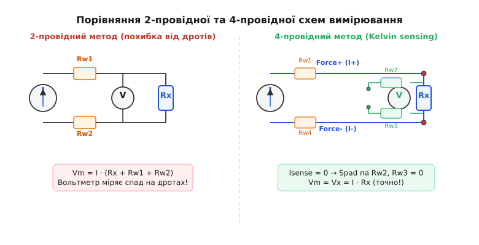
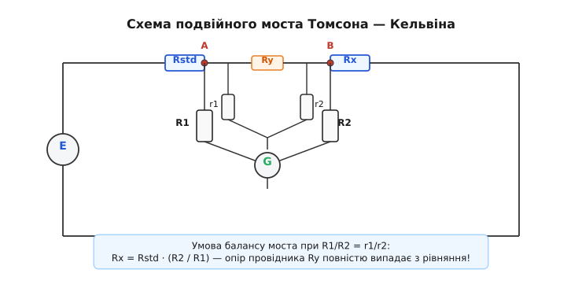
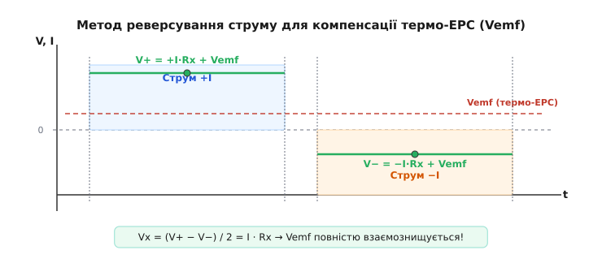
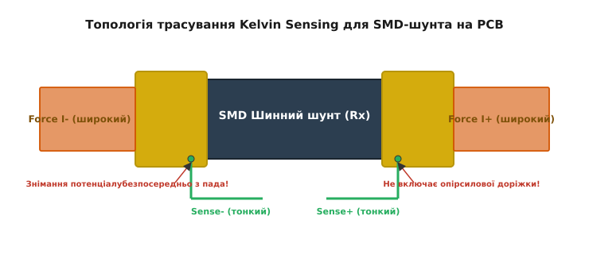

# Чотирипровідний метод вимірювання опору

<preknowlist>
- [Закон Ома](root:hw-analog/ohms-law) — зв'язок між напругою, струмом і опором у ділянці кола.
- [Електричний потенціал](root:ph-electromagnetism/electric-potential) — різниця потенціалів між двома точками як причинний спад напруги.
- [Вольтметр і амперметр](root:ph-electromagnetism/voltage) — принципи побудови вимірювачів напруги та струму, вхідний опір приладів.
</preknowlist>

Коли інженер намагається виміряти опір струмового шунта номіналом `0.01` Ом (10 мОм) звичайним цифровим мультиметром, прилад показує `0.21` Ом — значення, що у 21 раз перевищує реальне. Якщо за цими свідченнями налаштувати захист джерела живлення від перевантаження, система відключиться при струмі у двадцять разів меншому за розрахунковий. Джерело похибки криється не в несправності мультиметра чи розрядженій батарейці: стандартний омметр вимірює не лише опір самого шунта, а й опір двох мідних щупів (`0.15` Ом) та нещільних контактів у гніздах (`0.05` Ом). Опір з'єднувальних провідників повністю маскує параметр об'єкта. Для подолання цього бар'єра у вимірювальні кола впроваджують **чотирипровідний метод вимірювання опору** (*four-wire resistance measurement* або *Kelvin sensing*), який фізично розділяє шлях подачі струму та шлях знімання напруги.

### Фізична та схемотехнічна причина похибки 2-провідної схеми

Схема будь-якого класичного двопровідного омметра побудована на найпростішій ідеї: всередині приладу міститься каліброване джерело струму `I`, яке проганяє вимірювальний струм через досліджуваний резистор `R_x`, а паралельно підключений вольтметр фіксує спад напруги `V_m`. За [законом Ома](root:hw-analog/ohms-law) опір обчислюється як частка від ділення напруги на струм:

```
R = V_m / I
```

Проблема полягає у фізичному розташуванні точок підключення. Вольтметр розміщено всередині корпусу вимірювального приладу, а струм збудження прямує до об'єкта через два гнучкі вимірювальні провідники (щупи) довжиною близько метра кожен. Провідник — це не абстрактна лінія без опору з шкільного підручника, а реальний мідний дріт, який має власний опір `R_w1` та `R_w2`.

Крім того, у місці механічного дотику голки щупа до висновку деталі виникає опір контакту `R_c1` та `R_c2`. З фізичної точки зору поверхня будь-якого металу на мікроскопічному рівні є шорсткою та вкритою оксидною або жировою плівкою. Реальна площа електричного дотику становить менше 1% від геометричної площі контакту. Струм змушений стискатися у вузьких мікроскопічних точках контакту (а-плішинах), що створює додатковий опір стягування (*constriction resistance*). Також тонкі діелектричні оксидні плівки створюють тунельний опір. Величина цього сумарного переходного контакту залежить від сили притискання, стану окислення поверхні та забруднення флюсом чи пилом.

У результаті вимірювальний струм `I` проходить через послідовний ланцюг із п'яти елементів: перший дріт, перший контакт, досліджуваний резистор `R_x`, другий контакт і другий дріт. Вольтметр вимірює спад напруги на всьому цьому ланцюзі одразу:

```
V_m = I · (R_w1 + R_c1 + R_x + R_c2 + R_w2)
```

Обчисливши відношення `V_m / I`, прилад видає суму всіх опорів:

```
R_calc = R_x + R_parasitic
```

де `R_parasitic = R_w1 + R_c1 + R_c2 + R_w2`. Для типового лабораторного мультиметра опір `R_parasitic` становить від `0.1` Ом до `0.5` Ом.

Коли вимірюваний опір `R_x` дорівнює `10` кОм (`10000` Ом), паразитний опір `0.2` Ом дає відносну похибку лише `0.002%`, що є непомітною дрібницею для більшості застосувань. Проте при переході до низькоомних компонентів картина стає катастрофічною:

- При `R_x = 1` Ом похибка становить `20%`.
- При `R_x = 0.01` Ом (10 мОм) похибка сягає `2000%`.
- При `R_x = 0.0001` Ом (100 мкОм) прилад вимірює виключно власний дріт, а сигнал від резистора становить лише `0.05%` від сумарного відліку.

Розглянемо практичний приклад із силової електроніки. У промисловому інверторі потужністю `100` кВт вимірювальний шунт має опір `150` мкОм (`0.00015` Ом). При проходженні струму `500` А спад напруги на шунті становить:

```
V_shunt = 500 А · 0.00015 Ом = 0.075 В (75 мВ)
```

Якщо спробувати перевірити цей шунт у знеструмленому стані двопровідним мультиметром, опір щупів `0.2` Ом створить відлік `0.20015` Ом. Виміряне значення перевищить реальне у `1334` рази. Жоден алгоритм калібрування чи кнопка обнулення щупів (*Relative / NULL*) не здатні розв'язати цю проблему, оскільки опір контакту `R_c` є невідтворюваним і змінюється при кожному торканні на `0.01...0.05` Ом.

> 🔧 **Навіщо це.** Без чотирипровідної схеми неможливо перевірити цілісність заземлювальних шин літака, оцінити ступінь зносу контактів потужних контакторів підстанцій, виміряти внутрішній опір акумуляторних осередків або точно зняти показання з термометра опору `PT100`, де зміна опору на `0.385` Ом відповідає зміні температури на один градус Цельсія.

### Фундаментальний принцип Kelvin Sensing

Вихід із опиняного кута підказав видатний шотландський фізик Вільям Томсон (лорд Кельвін). Детальніше про історію створення цього методу можна прочитати у [історії винаходу містка Кельвіна](root:hw-sensing/4wire-resistance/hist-kelvin.md). Геніальна ідея Томсона полягає у тому, щоб **фізично розвести струмове та потенціальне кола на чотири окремі провідники**, що підключаються безпосередньо до об'єкта вимірювання.


*Порівняння двопровідної та чотирипровідної схем вимірювання. У 2-провідній схемі вольтметр вимірює напругу на послідовній сумі дротів і резистора. У 4-провідній схемі вимірювальний струм через сигнальні дроти Sense дорівнює нулю, тож вольтметр фіксує чистий спад напруги на R_x.*

У чотирипровідній схемі провідники чітко розділені за своїми функціональними ролями:

1. **Силова пара (Force / Current / I+ та I-):** Два провідники, по яких від джерела подається вимірювальний струм `I`. Цей струм створює спад напруги як на досліджуваному резисторі `R_x`, так і на паразитному опорі силових дротів `R_w1` та `R_w4`.
2. **Вимірювальна пара (Sense / Voltage / V+ та V-):** Два окремі провідники, які підключаються безпосередньо до контактних площадок або висновків резистора `R_x` і прямують до входів вольтметра.

Ключ до розуміння роботи схеми полягає у характеристиках сучасного цифрового вольтметра. Його вхідний опір `R_v` є надзвичайно високим — від `10` Мегаом у базових приладах до `10` Гігаом (`10¹⁰` Ом) у прецизійних лабораторних мультиметрах.

Згідно з правилом паралельного розгалуження струму у вузлах підключення `Sense`, струм `I_sense`, який відгалужується у сигнальну лінію `Sense`, обчислюється за формулою дільника:

```
I_sense = I · (R_x / (R_x + R_w2 + R_w3 + R_v))
```

Оскільки вхідний опір вольтметра `R_v = 10¹⁰` Ом, а опір сигнальних дротів `R_w2 + R_w3` не перевищує кількох ом, знаменник виразу виявляється гігантським. Струм у сигнальних провідниках дорівнює часточкам наноампера або пікоампера (`I_sense ≈ 0`).

А якщо струм через сигнальні дроти `Sense` не тече, то за [законом Ома](root:hw-analog/ohms-law) спад напруги на паразитному опорі цих дротів точно дорівнює нулю:

```
V_drop_Sense = I_sense · R_w2 = 0
```

Це означає, що електричний потенціал із точок контакту на резисторі `R_x` передається сигнальними провідниками на вхід вольтметра повністю без втрат. Вольтметр показує чистий спад напруги `V_x`, створений силовим струмом безпосередньо на тілі резистора:

```
V_m = V_x = I · R_x
```

Опір силових дротів `R_w1` та `R_w4` змінює лише загальний опір навантаження для джерела струму. Доки джерело струму здатне підтримувати заданий струм `I` (має достатній напруговий запас / *compliance voltage*), опір силових дротів **взагалі не впливає** на результат вимірювання.

Детальний алгебраїчний розрахунок із виведенням формул для довільних опорів вольтметра й дротів наведено у [математичному розрахунку похибок](root:hw-sensing/4wire-resistance/math-error-analysis.md).

### Подвійний місток Кельвіна — вимірювання в доцифрову епоху

До появи електронних підсилювачів і цифрових АЦП єдиним способом точного вимірювання опору були мостові схеми, де вимірювання зводилося до відсутності струму в індикаторі рівноваги (гальванометрі). Однак класичний місток Уітстона ламався на малих опорах через опір з'єднувальних перемичок.

Лорд Кельвів розробив **подвійний місток** (*Kelvin double bridge*), додавши в схему друге внутрішнє плече з двох допоміжних резисторів `r_1` та `r_2`.


*Схема подвійного моста Кельвіна. Додаткові плечі r1 та r2 усувають вплив опору з'єднувальної шини R_y між еталонним опором R_std та вимірюваним R_x.*

У мості Кельвіна вимірюваний опір `R_x` і калібрований стандартний опір `R_std` з'єднуються послідовно товстою шиною з опором `R_y`. Силовий струм проганяється через цей ланцюг. Потенціальні точки `A` та `B`, зняті безпосередньо з висновків `R_std` та `R_x`, підключаються до двох пар дільників: зовнішньої `R_1, R_2` та внутрішньої `r_1, r_2`.

Гальванометр `G` увімкнено між серединами цих двох дільників. За умови дотримання точного співвідношення плечей:

```
R_1 / R_2 = r_1 / r_2
```

струм через гальванометр обнуляється тоді й лише тоді, коли виконується рівність:

```
R_x = R_std · (R_2 / R_1)
```

При цьому опір сполучної шини `R_y` повністю випадає з рівняння рівноваги. Подвійний місток Кельвіна дозволяв з високою точністю вимірювати опори аж до `10⁻⁶` Ом (1 мкОм) ще в середині XIX століття.

### Конструкція затискачів та щупів Кельвіна

Практична реалізація чотирипровідного методу вимагає спеціального вимірювального оснащення. Головне правило: **чотири дроти повинні перетворюватися на два контакти безпосередньо на деталі, а не всередині кабелю чи приладу**.

1. **Затискачі Кельвіна (Kelvin Clips):** Зовні схожі на звичайні затискачі типу «крокодил», але кожна губка затискача розділена на дві половинки, ізольовані одна від одної фторопластовою або прополіпропіленовою вставкою. Одна губка є силовою (`Force`), друга — вимірювальною (`Sense`). Замикання ліній відбувається лише тоді, коли губки затискають висновок резистора або мідну шину.
2. **Коаксіальні пружинні щупи (Kelvin Probes):** Використовуються для автоконтролю на лінії SMD-монтажу. Щуп складається з центральної пружної голки (`Sense`) та зовнішньої підпружиненої трубчастої оболонки (`Force`), відокремлених шарнірним діелектриком. При доторканні до контактної площадки обидва контакти впираються в мідь на відстані часток міліметра один від одного.
3. **Паралельні пінцети Кельвіна:** Застосовуються для вимірювання SMD-компонентів розмірів `0402`, `0603`, `0805`. Кожна губка пінцета розділена на два ізольовані металеві шари.

Якщо об'єднати лінії `Force` та `Sense` хоча б за п'ять сантиметрів до деталі (наприклад, у банановому штекері кабелю), опір цих п'яти сантиметрів дрібного дроту додасться до результату вимірювання, знищивши точність.

### Паразитні фактори та боротьба з ними

Хоча чотирипровідна схема повністю усуває похибку від опору дротів, при вимірюванні мікроомних опорів на перший план виходять інші фізичні завади.

#### 1. Термоелектрорушійна сила (Термо-ЕРС)
При з'єднанні двох різнорідних металів (наприклад, мідного провідника щупа й олов'яно-свинцевого припою або нікельованого ніжки резистора) виникає термоелемент (термопара). Якщо між двома контактами є найменша різниця температур `ΔT` (наприклад, від тепла рук оператора чи нагріву сусідніх транзисторів), виникає паразитна напруга Зеебека `V_emf`:

```
V_emf = α_S · ΔT
```

Для пари «мідь — оксид міді» термо-ЕРС може сягати `1000` мкВ/°C. Якщо вимірювальний спад напруги на мікроомному шунті становить `10` мкВ, паразитна напруга `5` мкВ дасть похибку в `50%`.

Для компенсації термо-ЕРС застосовують **метод реверсування струму** (*Offset Compensated Ohms*).


*Метод реверсування струму (Offset Compensated Ohms). Почергове подавання струму +I та -I дозволяє розрахунково вилучити постійну термо-ЕРС V_emf.*

Джерело струму здійснює вимірювання у два кроки:
1. Подається прямий струм `+I`, прилад зчитує напругу `V_+ = +I · R_x + V_emf`.
2. Струм реверсується `−I`, прилад зчитує напругу `V_- = −I · R_x + V_emf`.

Шляхом віднімання двох результатів паразитне значення `V_emf` повністю вилучається:

```
V_x = (V_+ − V_-) / 2 = I · R_x
```

#### 2. Самонагрів вимірюваним струмом
За [законом Джоуля](root:ph-electromagnetism/joule-heating) струм `I`, проходячи через `R_x`, виділяє потужність `P = I² · R_x`. Якщо струм збудження надто великий, резистор нагрівається, і його опір змінюється відповідно до температурного коефіцієнта опору (ТКО). Для прецизійних вимірювань вибирають мінімально можливий струм, що забезпечує достатнє співвідношення сигнал/шум для АЦП.

#### 3. Струми витоку та екранування
При вимірюванні опорів понад `100` МОб (де чотирипровідна схема трансформується у захисне екранування) струми витоку через поверхневе забруднення плати можуть шунтувати вимірюваний об'єкт. Для захисту навколо сигнальних ліній розводять **охоронне кільце** (*Guard Ring*), на яке подається потенціал, що точно дорівнює потенціалу сигнальної лінії. Оскільки різниця потенціалів між сигналом та охороною дорівнює нулю, струм витоку фізично не може виникнути.

### Практичне застосування чотирипровідного методу

Метод Кельвіна є основою для багатьох галузей сучасної інженерії та науки:

1. **Термометрія опору (Датчики RTD PT100 / PT1000):** Платинові термометри змінюють опір від `100` Ом при `0` °C з чутливістю близько `0.385` Ом/°C. Двопровідне підключення кабелю довжиною `20` метрів додасть `1.5` Ом опору, що спотворить показання температури майже на `4` °C. Застосування 4-провідних сенсорів `PT100` дає змогу вимірювати температуру з точністю до `0.01` °C незалежно від довжини кабелю.
2. **Вимірювання струмових шунтів:** Прецизійні шунти номіналом `0.1...1` мОм у силових інверторах електромобілів та сонячних станціях вимагають трасування за правилами Кельвіна безпосередньо на друкованій платі.
3. **Діагностика акумуляторів (ESR / Со-опір):** Вимірювання еквівалентного послідовного опору `ESR` літій-іонних та свиноцово-кислотних батарей (значення в діапазоні `1...50` мОм) виконується змінним струмом частотою `1` кГц за 4-провідною схемою.
4. **Контроль якості зварювання та клепання:** Вимірювання опору перехідного контакту між листами обшивки літака чи силовими шинами підстанцій (межі `0.1...10` мкОм) дозволяє виявити приховані тріщини та корозію до виникнення аварії.
5. **Тестування короткозамкнених витків:** Перевірка опору обмоток електродвигунів та силових трансформаторів дає змогу виявити міжвиткові короткі замикання на ранніх стадіях, коли опір фази змінюється на частки відсотка.

### Правила топології трасування на PCB

При проективанні друкованих плат із струмовими шунтами помилка у розведенні доріжок може звести нанівець використання спеціалізованих мікросхем.


*Правильне трасування доріжок Sense від контактних площадок SMD-шунта.*

Головні топологічні вимоги:
- **Підключення зсередини площадок:** Сигнальні доріжки `Sense+` та `Sense-` повинні відходити від контактних площадок резистора **з внутрішнього краю**, де не тече силовий струм навантаження.
- **Диференційна пара:** Доріжки `Sense` трасують паралельно одна одній мінімальною шириною для мінімізації наводок від магнітних полів.
- **Ізоляція від силових полигонів:** Сигнальні лінії не повинні перетинатися з силовими імпульсними шинами на сусідніх шарах плати.

Детальні вимоги до розведення та специфікацію роз'ємів наведено у [специфікації підключення та трасування](root:hw-sensing/4wire-resistance/api-kelvin-sense.md), а приклад практичної програмно-апаратної реалізації вимірювального модуля — у [практичному проєкті мікроомметра](root:hw-sensing/4wire-resistance/proj-kelvin-adc.md).

Чотирипровідний метод вимірювання опору — це взірець того, як інженерна думка долає фізичні обмеження матеріалів: не намагаючись зробити опір дротів абсолютно нульовим, метод робить вимірювальну систему повністю **байдужою** до цього опору.
