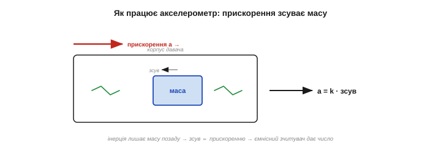
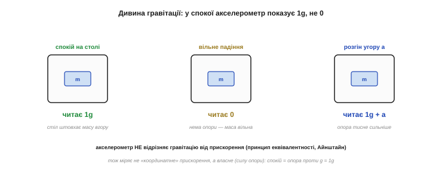
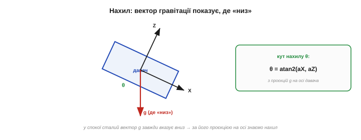
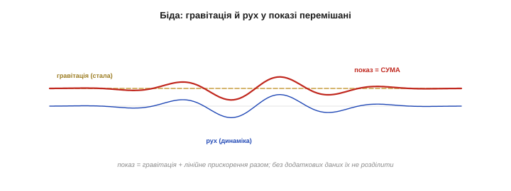
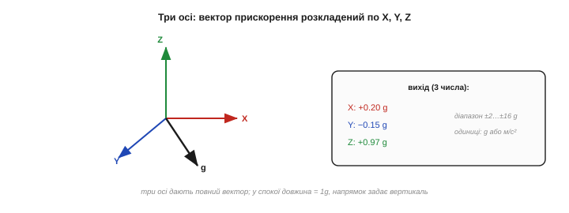
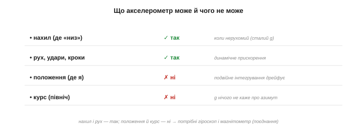

# Акселерометр: міряти прискорення

Акселерометр (від лат. *accelerare* — прискорювати) — найважливіший і найпростіший за ідеєю інерціальний давач: це той самий [вантаж на пружинках](root:hw-sensing/mems), збуджений **лінійним прискоренням**. Прискорення зсуває масу, ємнісні гребінці читають зсув — ось і весь прилад. Та в нього є одна знаменита дивина, об яку спотикається кожен новачок: акселерометр **міряє й гравітацію**, тож у спокої показує не нуль, а **1g**. Зрозумівши цю одну річ, ви опануєте акселерометр по-справжньому — і побачите, що він уміє (визначати нахил і рух) і чого не вміє (знати, де ви). Розберімо все по черзі.

Варто наперед налаштуватися на головний парадокс цього давача: він зветься «акселерометром», тобто «вимірювачем прискорення», але насправді міряє дещо тонше — **силу, з якою його утримують проти вільного падіння**. Звідси й уся його дивна, але напрочуд корисна поведінка. Тримаймо цю думку в голові — і все стане на місця.

### Прискорення зсуває масу

Принцип прямий. Коли корпус давача прискорюється, інерція **лишає масу позаду**: вона зсувається відносно корпусу в бік, протилежний прискоренню, рівно настільки, наскільки воно сильне. Цей зсув читають [ємнісно](root:hw-sensing/mems) — і дістають число, пропорційне прискоренню.

Дві речі задає тут **жорсткість пружин**. М'якша пружина дає більший зсув на те саме прискорення — отже, **чутливіший** давач, та з вужчим діапазоном (масу легше «вибити» за межі) і нижчою власною частотою. Жорсткіша — навпаки: грубіша, зате витриваліша й швидша. Тому акселерометр на ±2g (чутливий, для нахилу) і на ±16g (грубий, для ударів) — це, по суті, та сама механіка з різною жорсткістю підвісу. Вибір діапазону — це вибір цього компромісу.

Іще нюанс будови. Більшість дешевих MEMS-акселерометрів — **розімкнені**: маса просто зсувається, а зсув міряють. Точніші ж роблять **замкненими** (force-feedback): електроніка прикладає до маси силу, що **утримує** її на місці, і міряє цю силу — так лінійніше й стабільніше, але дорожче. Для аматорського рівня цей нюанс не критичний, та корисно знати, що дорожчий давач часто означає саме замкнену схему.


*Як працює акселерометр. Корпус прискорюється праворуч — інерція лишає підвішену масу позаду (вона зсувається ліворуч відносно корпусу). Зсув пропорційний прискоренню (пружина зрівноважує силу інерції), і ємнісні гребінці перетворюють його на електричний сигнал. Що сильніше прискорення — то більший зсув — то більше число на виході.*

Просто? Так — поки не врахувати, що **сила тяжіння теж є силою**, а отже, теж тисне на масу. І саме звідси починається найважливіше.

### Дивина гравітації: спокій = 1g

Ось ключ до розуміння акселерометра: він міряє **не те** прискорення, яке ви очікуєте. Здавалося б, нерухомий давач на столі мав би показувати **нуль** — він же не рухається. Та насправді він показує **1g, спрямоване вгору**. Чому?


*Дивина, об яку всі спотикаються. **Спокій на столі**: стіл штовхає масу вгору, опираючись гравітації, — давач читає 1g вгору. **Вільне падіння**: опори нема, маса й корпус падають разом — давач читає 0. **Розгін угору**: опора тисне ще сильніше — більш як 1g. Акселерометр не відрізняє гравітацію від прискорення (принцип еквівалентності Айнштайна), тож міряє не «координатне» прискорення, а **власне** — силу опори.*

Річ у тім, що акселерометр міряє **власне прискорення** (*proper acceleration*, специфічну силу) — те, з яким **опора діє на масу**, а не те, як давач рухається в просторі. На столі гравітація тягне масу вниз, а пружинки (через стіл) штовхають її вгору, утримуючи на місці, — і давач читає саме цей **поштовх угору**, тобто 1g. У вільному ж падінні опори немає: маса й корпус падають разом, пружинки розслаблені — і давач читає **нуль** (хоча прискорення падіння якраз 1g!).

Глибша причина — **принцип еквівалентності** Айнштайна: акселерометр **фізично не може** відрізнити гравітацію від прискорення. Стояти на Землі й розганятися в космосі з 1g — для нього одне й те саме. Це не вада, а фундамент; і саме він дає акселерометру його головну корисну здатність.

Допомагає думати ліфтами й космосом. У ліфті, що рвучко рушає вгору, ви на мить «важчаєте» — і акселерометр теж покаже більш як 1g, не відрізнивши розгін від додаткової гравітації. У вільному ж падінні (чи на орбіті, що є тим самим падінням навколо Землі) усе невагоме — і давач чесно покаже **нуль**, бо опори, яку він міряє, немає. Космонавти «плавають» не тому, що там нема гравітації, а тому, що падають разом зі станцією, — і акселерометр на борту це підтвердить нулем.

> 🔧 **Навіщо це.** Запам'ятайте раз і назавжди: **нерухомий акселерометр показує 1g, а не 0**. Довжина його вектора в спокої — рівно 1g, і вказує цей виміряний вектор **угору** — це реакція опори («низ» — це мінус виміряний вектор). Тому перша перевірка справності давача — покласти його рівно й переконатися, що по вертикальній осі ~1g (≈9.8 м/с²), а по горизонтальних ~0. Хто чекає нуля «бо ж не рухається» — даремно шукатиме неіснуючу несправність.

Та сама стала 1g — ще й безкоштовний **еталон** для [калібрування](root:hw-sensing/calibration). Гравітація завжди рівно 1g, тож, повертаючи давач різними боками до вертикалі, ви отримуєте відомі опорні точки (+1g, −1g, 0) на кожній осі — і за ними виправляєте і масштаб, і зсув нуля кожної осі. Природа дала акселерометру вбудований калібрувальний сигнал, яким гріх не скористатися.

### Перше застосування: де «низ» (нахил)

Та сама дивина гравітації — це й перша суперсила акселерометра. Бо якщо в спокої він **завжди** відчуває сталий вектор 1g уздовж вертикалі (реакцію опори, спрямовану від центру Землі), то за тим, **як цей вектор розкладається** на три осі давача, можна дізнатися, **як давач нахилений**.


*Акселерометр як рівень. У спокої вектор g завжди вказує вниз. Коли давач нахиляють, цей сталий вектор по-різному проєктується на його осі: на похилу вісь припадає більша частка, на вертикальнішу — менша. За цими проєкціями (через `atan2`) і рахують кути нахилу — крен і тангаж. Так копійчаний акселерометр стає електронним рівнем.*

Нахил рахують просто: кут між віссю давача й вертикаллю дістають із проєкцій гравітації через арктангенс:

```
кут нахилу (тангаж):  θ = atan2(aX, aZ)
            (крен):   φ = atan2(aY, aZ)
де aX, aY, aZ — покази трьох осей у спокої (проєкції g)
```

Саме так працює автоповорот екрана в телефоні, рівень-застосунок, визначення орієнтації корпусу робота в спокої. Копійчаний акселерометр — це ще й електронний **рівень**, що завжди знає, де «низ».

Та в нахилу за гравітацією є принципова сліпа пляма: **поворот навколо вертикалі** (азимут, курс — *yaw*). Якщо обертати давач навколо тієї самої осі, уздовж якої тягне g, вектор гравітації **не змінюється** — усі три проєкції лишаються ті самі. Тобто акселерометр бачить крен і тангаж, але **не бачить**, куди ви повернені відносно сторін світу. Цю діру закриває окремий давач — [магнітометр](root:hw-sensing/magnetometer), що відчуває поле Землі.

Зате нахил за акселерометром має безцінну рису — він **абсолютний і не дрейфує**. Гравітація — вічний, незмінний орієнтир, тож «де низ» давач знає **завжди** правильно, без накопичення похибки з часом. Це його головна перевага над [гіроскопом](root:hw-sensing/gyroscope), що дрейфує. Слабкість акселерометра — чутливість до руху; сила — відсутність дрейфу. У гіроскопа все навпаки — і саме тому їх вигідно [поєднувати](root:com-signal/sensor-fusion): сильний бік одного якраз закриває слабкий бік другого.

### Друге застосування: рух і вібрація

Друга роль акселерометра — ловити **рух**: динамічне прискорення від поштовхів, ударів, кроків, вібрації. Тут уже працює не стала гравітація, а її **зміни** в часі: крок ноги, стук по корпусу, тряска машини — усе це сплески прискорення поверх постійної 1g.


*Рух поверх гравітації. Що насправді читає давач — це **сума** сталої гравітації (золота лінія) і динамічного прискорення від руху (синя). Червона крива — їхня суміш, той самий сигнал на виході. На цьому стоять крокоміри, детектори падіння, виявлення ударів і вібродіагностика. Але гравітація й рух тут **злиті** — і саме це робить акселерометр складним давачем.*

Так працюють крокоміри (рахують поштовхи кроків), детектори падіння й ударів, аналіз вібрації ([спектр прискорення](root:embedded/why-frequency-domain)). Акселерометр чудово відчуває, що щось **рухається** чи **трясеться**.

Крокомір — добрий приклад того, як це використовують. Він рахує **довжину** вектора прискорення (щоб не залежати від орієнтації телефона в кишені) і шукає в ній **періодичні піки** — кожен крок дає характерний поштовх. Трохи згладжування (ФНЧ проти тремтіння) і поріг проти дрібних коливань — і копійчаний давач рахує кроки. Жодної складної фізики: лише пік прискорення на кожен удар ноги об землю.

### Біда: гравітація й рух перемішані

А тепер — головна складність, що пояснює добру половину клопотів із цим давачем. Акселерометр віддає **одну** величину — суму **гравітації** і **лінійного прискорення** руху. І розділити їх із одного давача **неможливо**: він фізично не розрізняє, де гравітація, а де розгін (принцип еквівалентності знову).

Це б'є по обох застосуваннях. Для **нахилу** перешкода — рух: щойно давач починає трястися чи прискорюватись, до сталої g домішується динаміка, і «де низ» уже не вгадати (рівень бреше, поки ви ним махаєте). Для **руху** перешкода — гравітація: вона сидить у показі постійним зміщенням, яке треба якось відняти. А найгірше — **позицію** (де я в просторі) акселерометр дати **не може**: щоб із прискорення дістати положення, його треба двічі проінтегрувати, а будь-яка похибка тоді **накопичується квадратично** й за секунди перетворює оцінку на безглуздя.

Щоб відчути, наскільки це швидко: стале зміщення лише в 0.01g (типова дрібниця для дешевого давача) за подвійного інтегрування дає хибне «переміщення», що росте як ½·a·t² — близько 0.05 м за першу секунду, 0.5 м за три, 5 м за десять. Помилка не просто накопичується, а **прискорюється**. Тому інерціальне числення положення лишається царством дорогих прецизійних давачів і коротких інтервалів — а копійчаний MEMS на нього не здатний у принципі.

Саме тому для **положення** беруть зовсім інші засоби — GPS, далекоміри, камери, — а акселерометр у навігації лише **доповнює** їх на коротких проміжках між оновленнями. Інерціальне числення добре згладжує прогалини між «стрибками» GPS, але саме по собі завжди «спливає», тож без зовнішньої прив'язки довго не протримається.

> 🔧 **Навіщо це.** Дві залізні застороги. Перша: **нахил за акселерометром вірний лише в спокої** — під час руху чи вібрації показ «де низ» спотворюється динамічним прискоренням, тож або фільтруйте повільно ([ФНЧ](root:com-signal/band-filters), бо гравітація стала, а рух швидкий), або [поєднуйте з гіроскопом](root:com-signal/sensor-fusion). Друга: **ніколи не інтегруйте акселерометр до положення** — подвійне інтегрування шуму й зсуву дрейфує так швидко, що за секунди оцінка стає марною. Акселерометр каже «куди тягне» й «що трясеться», а не «де я».

### Три осі, діапазон, одиниці

На практиці акселерометр **триосьовий**: міряє прискорення по X, Y і Z окремо, даючи **вектор** із трьох чисел. Його довжина й напрямок несуть усю інформацію: у спокої довжина = 1g, а напрямок задає вертикаль (виміряний вектор дивиться вгору, «низ» — це його мінус).


*Три осі — повний вектор. Давач розкладає прискорення на три взаємно-перпендикулярні осі (X, Y, Z) і віддає три числа. Разом вони — вектор: його довжина в спокої дорівнює 1g, а напрямок задає вертикаль («низ» — це мінус виміряного вектора). Діапазон обирають під задачу (±2g для нахилу, ±16g для ударів), а одиниці — частки g або м/с² (1g ≈ 9.8 м/с²).*

Дві практичні величини. **Діапазон** — наскільки сильне прискорення давач ще міряє, не зашкалюючи: ±2g вистачить для нахилу й спокійного руху, а для ловлі ударів беруть ±8…±16g. **Чутливість** і **одиниці** — сирий вихід (відліки АЦП) переводять у частки g чи в м/с² (1g ≈ 9.8 м/с²) за паспортним коефіцієнтом давача.

Сирий вихід акселерометра завжди **тремтить** — і це нормально: [тепловий шум механіки](root:hw-sensing/imu-noise-bias-drift) нікуди не дівся. Тому між давачем і рішенням майже завжди стоїть **фільтр**: легке [ФНЧ](root:com-signal/band-filters) проти тремтіння, [медіана](root:sf-algorithms/median-filter) проти поодиноких викидів. Скільки фільтрувати — [компроміс](root:com-signal/smoothing-vs-lag): сильніше згладиш — чистіше, але повільніше реагує. Сирий показ акселерометра «як є» придатний хіба для грубих рішень; для точних його спершу чистять.

І ще про осі: акселерометр міряє у **власній** системі координат (осі X, Y, Z прив'язані до корпусу давача, а не до світу). Тому, коли апарат повертається, та сама гравітація «перетікає» з осі на вісь — і саме це перетікання й несе інформацію про нахил. Щоб дістати орієнтацію відносно **світу** (де справжній низ, де північ), покази тіла треба перерахувати — а це вже окрема [задача орієнтації](root:math-geometry/euler-angles). Варто запам'ятати: давач говорить мовою власного тіла, а не світу, і переклад між ними — окрема робота.

**Приклад (нахил і перевірка 1g).** Давач лежить нерухомо, нахилений на бік:

```
читаємо осі:        aX = 0.50 g,  aZ = 0.87 g,  aY ≈ 0
довжина вектора:    √(0.50² + 0.87²) ≈ 1.00 g   ✓  (у спокої завжди ~1g — давач справний)
кут нахилу:         θ = atan2(aX, aZ) = atan2(0.50, 0.87) ≈ 30°
висновок: давач нахилений на 30° від горизонталі; рух відсутній (довжина рівно 1g)
```

Зверніть увагу на хитрий прийом перевірки: якщо **довжина** вектора прискорення помітно відрізняється від 1g — значить, до гравітації домішався рух, і «нахилу» зараз вірити не можна. Сама природа давача підказує, коли його показ чесний.

> 🔧 **Навіщо це.** Корисний практичний тест: рахуйте **довжину** вектора прискорення `√(aX²+aY²+aZ²)`. У спокої вона ~1g — і тоді нахилу можна вірити. Помітно більша чи менша за 1g — давач зараз рухається (є динамічне прискорення), і визначати «де низ» цієї миті не варто. Ця проста перевірка відсіює хибні виміри нахилу під час руху — без жодного додаткового давача.

Зведімо, що акселерометр уміє, а що ні, — бо саме з його **обмежень** і виросте потреба в інших давачах:


*Підсумок можливостей. **Може**: визначити нахил (де «низ») — у спокої; відчути рух, удари, кроки, вібрацію. **Не може**: дати положення (подвійне інтегрування дрейфує) і курс/азимут (гравітація про нього мовчить). Перші — його сила; другі — пряма причина додати гіроскоп і магнітометр та поєднати їх докупи.*

Отже, акселерометр — це вантаж на пружинках, що чує і гравітацію, і рух **разом**: звідси його сила (знати нахил у спокої, ловити рух і вібрацію) і його межа (не розділити їх без сторонньої допомоги, не дати положення). Особливо болить нахил під час руху: коли апарат трясеться чи прискорюється, гравітаційний орієнтир тоне в динаміці. Тут і виходить на сцену давач, що міряє обертання **незалежно** від гравітації й лінійного прискорення, — [гіроскоп](root:hw-sensing/gyroscope): він відчуває, як швидко апарат повертається, і прикриває головну сліпу пляму акселерометра. Ці два давачі-антиподи — точний у спокої, але «засліплений» рухом акселерометр і байдужий до гравітації, та дрейфливий гіроскоп — і складають разом у одну надійну оцінку орієнтації, де кожен закриває слабкість іншого ([поєднання давачів](root:com-signal/sensor-fusion)).

---
