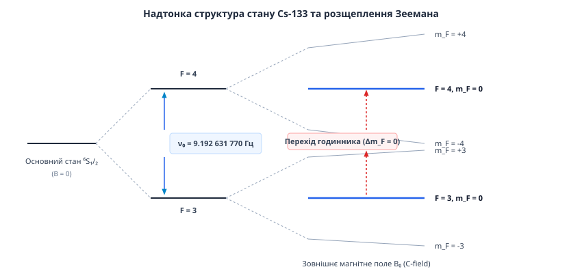
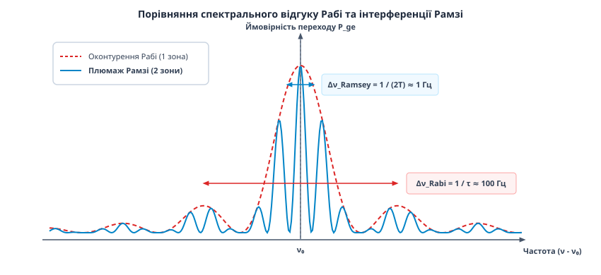
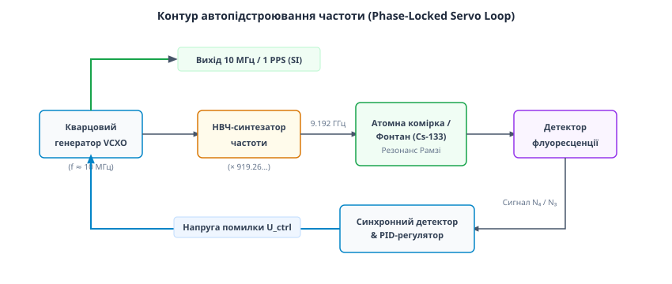

# Атомний годинник

<preknowlist>
- [Квантові стани та спектральні лінії](root:ph-quantum/hydrogen-spectrum) — дискретність енергетичних рівнів атома та квантові переходи з випромінюванням фотона.
- [Спін електрона](root:ph-quantum/electron-spin) — спіновий кутовий момент, внутрішні ступені вільності та взаємодія з магнітним полем.
- [Ефект Зеемана](root:ph-quantum/zeeman-effect) — розщеплення надтонких енергетичних рівнів у зовнішньому статичному магнітному полі.
- [Магнітний резонанс](root:ph-quantum/magnetic-resonance) — вимушені квантові переходи під дією змінного електромагнітного поля.
</preknowlist>

До середини XX століття фундаментальна одиниця часу — секунда — визначалася за допомогою обертання Землі навколо власної осі. У 1820 році Французька академія наук встановила, що секунда дорівнює `1 / 86 400` частині середньої сонячної доби. Проте з розвитком астрономії та появою перших кварцових осциляторів у 1930-х роках з'ясувалося, що астрономічна доба не є постійною величиною. Через припливне тертя Місяця та Сонця, сезонні переміщення атмосферних мас, зміну льодовикового покриву та тектонічні процеси у рідкому ядрі планети швидкість обертання Землі неперервно змінюється. Це спричиняє віковий дрейф тривалості доби на `2.3` мілісекунди на століття та сезонні девіації до `1` мілісекунди на рік. 

Кварцові осцилятори, які прийшли на зміну механічним маятникам, забезпечили високу короткочасну стабільність, але виявилися схильними до незворотного старіння: п'єзоелектричний кристал під дією внутрішніх механічних напружень та температурних коливань неперервно змінює резонансну частоту на `10⁻⁸` на рік. При виготовленні двох однакових кварцових кристалів їхні частоти неминуче відрізняються через мікроскопічні дефекти решітки, що робить створення абсолютного класичного еталона часу неможливим.

Вихід із цієї фундаментальної кризи надала квантова механіка: енергетичні рівні ізольованого атома визначаються виключно фундаментальними константами природи — масою та зарядом електрона, сталою Планка та постійною тонкої структури. Два атоми цезію-133 у будь-якій точці Всесвіту володіють фундаментально тотожною структурою енергетичних рівнів. Створений на їхній основі атомний годинник використовує частоту квантового переходу між надтонкими рівнями атома як незмінний часовий репер, до якого за допомогою замкненого сервоконтуру прив'язується частота локального електронного осцилятора.

> 🔧 **Навіщо це.** Без атомних годинників неможливе функціонування глобальних супутникових систем навігації (GPS, Galileo, BeiDou), де похибка відліку часу в `3` наносекунди призводить до помилки визначення координат на `1` метр. Атомні стандарти забезпечують високошвидкісну фазову синхронізацію 5G/6G телекомунікаційних мереж, координацію глобальних фінансових транзакцій, синхронізацію енергосистем змінного струму та перевірку фундаментальних ефектів загальної теорії відносності — зокрема вимірювання релятивістського уповільнення часу при зміні висоти всього на `1` сантиметр.

## 1. Квантовомеханічні основи: надтонка структура та годинниковий перехід

Фізичним фундаментом первинного атомного еталона часу є надтонка структура основного стану атома цезію-133 (`¹³³Cs`). Цезій є лужним металом із єдиним валентним електроном на зовнішній `6s`-орбіталі (`6²S₁/₂`). Всі внутрішні сорок шість електронів утворюють повністю заповнені сферично симетричні оболонки з нульовим підсумковим моментом імпульсу та нульовим спіном.

Надтонке розщеплення виникає внаслідок магнітного диполь-дипольного взаємозв'язку між спиновим магнітним моментом валентного електрона `S = 1/2` та магнітним моментом ядра `I = 7/2` (ядро цезію має `55` протонів та `78` нейтронів). Фізично ця взаємодія описується оператором контактної взаємодії Фермі, який виникає через скінченну ймовірність знаходження s-електрона всередині об'єму атомного ядра:

```
H_hfs = A_hfs · (I⃗ · J⃗)
```

де `A_hfs` — константа надтонкого зв'язку, що пропорційна густині електронної хмари на ядрі `|Ψ(0)|²`:

```
A_hfs = (8·π / 3) · g_e · μ_B · g_I · μ_N · |Ψ(0)|²
```

Оператор повного квантового моменту імпульсу атома `F⃗` визначається векторною сумою моменту електронної оболонки `J⃗` (для основного стану `J = S = 1/2`) та спину ядра `I⃗`:

```
F⃗ = I⃗ + J⃗
```

Згідно з правилами додавання квантових моментів, квантове число повного моменту `F` може набувати двох дискретних значень:

```
F = I + 1/2 = 7/2 + 1/2 = 4
F = I - 1/2 = 7/2 - 1/2 = 3
```

Енергетичний інтервал `ΔE_hfs` між підрівнями `F = 3` та `F = 4` за відсутності зовнішніх полів визначається з виразу:

```
ΔE_hfs = (A_hfs / 2) · [ F·(F + 1) - I·(I + 1) - J·(J + 1) ]
```

Відповідна квантова частота переходу `ν₀ = ΔE_hfs / h` дорівнює точно `9 192 631 770` Гц.


*Надтонка структура основного стану ⁶S₁/₂ атома цезію-133 у зовнішньому магнітному полі та годинниковий перехід між станами (F=3, m_F=0) і (F=4, m_F=0).*

У зовнішньому статичному магнітному полі `B₀` відбувається зняття виродження за магнітним квантовим числом `m_F ∈ {-F, ..., +F}` (ефект Зеемана). Рівень `F = 4` розщеплюється на `2F + 1 = 9` підрівнів, а рівень `F = 3` — на `7` підрівнів. 

Залежність енергії зееманівських підрівнів від напруженості магнітного поля `B₀` описується точним рівнянням Брейта — Рабі:

```
E(F, m_F) = - (ΔE_hfs / (2·(2I + 1))) + g_I·μ_N·B₀·m_F ± (ΔE_hfs / 2) · √( 1 + (4·m_F / (2I + 1))·x + x² )
```

де `x = (g_J·μ_B - g_I·μ_N) · B₀ / ΔE_hfs` — безрозмірний параметр поля, `μ_B` — магнітон Бора, `μ_N` — ядерний магнітон, а `g_J, g_I` — фактори Ланде.

Для підрівнів із `m_F ≠ 0` виникає лінійний ефект Зеемана з чутливістю близько `3.5` кГц на мікротесла (`3.5` Гц/мГс). Ці підрівні активно використовуються у приладі для прецизійної магнітометрії — вимірювання напруженості магнітного поля усередині вакуумної камери з точністю до нанотесла.

Для метрології відліку часу ключове значення мають підрівні з проекцією `m_F = 0`. Для квантового переходу між станами `|F=3, m_F=0⟩` та `|F=4, m_F=0⟩` (так званого **годинникового переходу**) розклад рівняння Брейта — Рабі у ряд за малою величиною поля `B₀` показує, що лінійний член Зеемана суворо дорівнює нулю:

```
∂E(F=4, m_F=0) / ∂B₀ = 0
∂E(F=3, m_F=0) / ∂B₀ = 0
```

Зміна частоти годинникового переходу під дією магнітного поля визначається лише квадратичним членом Зеемана:

```
ν(B₀) = ν₀ + K_Z · B₀²
```

де `K_Z = 427.45` Гц / мТл² (або `42.745` Гц / Гс²). Завдяки відсутності лінійної залежності від магнітного поля, перехід `(F=3, m_F=0) ↔ (F=4, m_F=0)` володіє винятковою стійкістю до зовнішніх магнітних завад.

У 1967 році 13-та Генеральна конференція з мір і ваг сформулювала класичне визначення одиниці часу SI: **1 секунда дорівнює тривалості 9 192 631 770 періодів випромінювання, що відповідає переходу між двома надтонкими рівнями основного стану атома цезію-133 при відсутності зовнішніх збурень.**

## 2. Метод розділених осцилюючих полів Рамзі

Щоб виміряти частоту квантового переходу з найвищою точністю, необхідно збудити перехід між рівнями за допомогою змінного НВЧ-поля й зареєструвати резонансний пік. У перших приладах Ісидора Рабі атоми пролітали крізь один НВЧ-резонатор. Проте ширина спектральної лінії `Δν` при цьому обмежувалася часом прольоту атома крізь зону поля `τ`:

```
Δν_Rabi ≈ 1 / τ = v / L
```

При тепловій швидкості атомів цезію `v ≈ 200` м/с та довжині резонатора `L = 10` см час взаємодії становив `τ ≈ 5 · 10⁻⁴` с, що розширювало лінію до `2000` Гц. Збільшити довжину резонатора до кількох метрів виявилося технічно неможливим через фазові неоднорідності стоячої НВЧ-хвилі.

Вирішення цієї проблеми знайшов Норман Рамзі, запропонувавши метод розділених осцилюючих полів. Докладну хронологію цього відкриття викладено у вставці [📜 Історія атомного годинника: від пучкових квантових резонансів до оптичних решіток](root:hw-sensing/atomic-clock/hist-atomic-clock.md).


*Спектральні профілі збудження: широка огинаюча лінія Рабі для однієї зони та вузький центральний інтерференційний плюс Рамзі для двох відокремлених зон.*

Механізм квантової інтерференції Рамзі відбувається у чотири етапи:

1. **Перший `π/2`-імпульс:** Атом у чистому основному стані `|g⟩ = |F=3, m_F=0⟩` входить у першу НВЧ-зону тривалості `τ`. Під дією резонансного поля амплітуда стану повертається на кут `π/2` на сфері Блоха. На виході з зони атом опиняється у когерентній рівній суперпозиції:
   ```
   |Ψ₁⟩ = (1 / √2) · [ |g⟩ - i · |e⟩ ]
   ```
2. **Вільний простір дрейфу:** Атом виходить із першої НВЧ-зони й рухається впродовж часу `T = L_drift / v` у зоні, де НВЧ-поле відсутнє, але підтримується однорідне статичне магнітне поле `B₀`. За час `T` квантові стани накопичують фазову різницю `ΔΦ = (ω - ω₀) · T`, де `ω` — частота НВЧ-генератора, а `ω₀` — точна квантова частота атома. Стан перед другою зоною дорівнює:
   ```
   |Ψ₂⟩ = (1 / √2) · [ |g⟩ - i · e^(-i·(ω - ω₀)·T) · |e⟩ ]
   ```
3. **Другий `π/2`-імпульс:** Атом входить у другу НВЧ-зону тієї ж тривалості `τ`. Друге НВЧ-поле інтерферує з накопиченою фазою атома.
4. **Реєстрація ймовірності:** Підсумкова ймовірність виявлення атома у збудженому стані `|e⟩ = |F=4, m_F=0⟩` становить:
   ```
   P_ge(ω) = cos²( (ω - ω₀) · T / 2 ) = (1 / 2) · [ 1 + cos((ω - ω₀) · T) ]
   ```

Повний математичний вивід квантового оператора еволюції матриць Рамзі та профілю лінії наведено у вставці [🧮 Квантовомеханічне виведення інтерференції Рамзі](root:hw-sensing/atomic-clock/math-ramsey-fringes.md).

Завдяки тому, що час вільного прольоту між зонами `T` значно перевищує тривалість проходження самої зони `τ` (`T ≫ τ`), спектральний відгук являє собою широке огинаюче контурування Рабі шириною `1/τ`, всередині якого виникають надзвичайно гострі інтерференційні смуги — «плюмаж Рамзі». Повна ширина центрального піку дорівнює:

```
Δν_Ramsey = 1 / (2 · T)
```

Збільшуючи час польоту `T` від мілісекунд до секунди, ширину спектральної лінії вдається звузити з кілогерц до `1` Гц.

## 3. Лазерне охолодження та атомні фонтани

У традиційних горизонтальних пучкових годинниках (таких як NIST-7) термальні атоми рухаються зі швидкістю понад `100` м/с, що обмежує час прольоту `T` частками мілісекунди і призводить до релятивістського зсуву Доплера другого порядку (`v²/2c²`). 

Для подолання цієї межі у 1990-х роках було створено атомні фонтани (NIST-F1 у США, SYRTE FO2 у Франції, PTB-CSF2 у Німеччині), які об'єднали метод Рамзі з технологією лазерного охолодження.

Фізика лазерного охолодження спирається на два послідовні квантові ефекти:

1. **Доплерівське охолодження:** Шість ортогональних лазерних променів із довжиною хвилі `852.3` нм (резонансна `D₂`-лінія цезію), зсунутих у червоний бік на `2...3` ширини лінії, створюють оптичну патоку. Сила світлового тиску гальмує зустрічні атоми, зменшуючи температуру до доплерівської межі `T_D = ℏ·γ / (2·k_B) ≈ 125` мкК.
2. **Субдоплерівське охолодження (Sisyphus cooling):** При вимкненні магнітного поля пастки градієнт поляризації лазерного поля створює просторову модуляцію зсуву Штарка для підрівнів Зеемана. Атом рухається вгору по потенціальному пагорбу, втрачаючи кінетичну енергію, а біля вершини перекачується лазером на дно сусіднього пагорба. Це знижує температуру до `1` мікрокельвіна (`10⁻⁶` К), а швидкість атомів — до `1` см/с.


*Схема будови цезієвого атомного фонтана: камера охолодження, НВЧ-резонатор Рамзі, магнітні екрани C-поля та оптичний детектор флуоресценції.*

Цикл роботи цезієвого атомного фонтана триває близько `1` секунди і складається з наступних фаз:

1. **Накопичення та охолодження:** У нижній кабіні за час `0.3` с накопичується та охолоджується хмара з `10⁸` атомів цезію.
2. **Вертикальний запуск (Moving Molasses):** Змінюючи частоту верхніх та нижніх лазерних променів на `δf`, оптична патока прискорює атоми вгору до швидкості `v_launch ≈ 4` м/с.
3. **Селекція стану:** Хмара піднімається вгору й проходить крізь допоміжний резонатор, який переводить атоми з підрівня `(F=4, m_F=0)` у стан `(F=3, m_F=0)`. Відразу після цього лазерний очищаючий промінь (Push Beam) виштовхує всі залипові атоми стану `F=4` убік.
4. **Перший прохід НВЧ-резонатора:** На швидкості близько `4` м/с атоми проходять крізь високодобротний циліндричний НВЧ-резонатор Рамзі (мода `TE₀₁₁`), де отримують перший `π/2`-імпульс.
5. **Апогей та вільне падіння:** Хмара піднімається на висоту близько `50` см над резонатором, досягає апогею траєкторії, де її швидкість знижується до нуля (`v = 0`), після чого починає вільно падати донизу під дією гравітації Землі.
6. **Другий прохід НВЧ-резонатора:** Падаючи вниз, хмара атомів проходить крізь той самий НВЧ-резонатор Рамзі вдруге, отримуючи другий `π/2`-імпульс. Загальний час між двома проходженнями становить `T ≈ 0.5...0.7` секунди, що забезпечує ширину центрального піку Рамзі `Δν ≈ 1` Гц.
7. **Оптичне детектування:** У нижній частині камери лазерні промені викликають флуоресценцію атомів. Фотодіоди вимірюють відношення кількості атомів у станах `F=4` та `F=3`, формуючи сигнал нормованої ймовірності `P_ge`.

Детальний опис кожної підсистеми, лазерних переходів та таблицю бюджету систематичних похибок наведено у вставці [🔌 Архітектура та підсистеми цезієвого атомного фонтана](root:hw-sensing/atomic-clock/comp-atomic-fountain.md).

## 4. Електронний контур автопідстроювання та девіація Аллана

Сам по собі атомний фонтан не випромінює потужного електромагнітного сигналу наружу. Він працює як надвисокоточний спектральний дискримінатор, який вимірює похибку частоти зовнішнього джерела.


*Структурна схема замкненого сервоконтуру автопідстроювання частоти опорного кварцового генератора за резонансною лінією атомного переходу.*

Принцип формування замкненого контуру автопідстроювання частоти (Phase-Locked Loop):

1. Опорний кварцовий генератор, керований напругою (VCXO), випромінює сигнал чистої частоти `f_vcxo = 10` МГц.
2. НВЧ-синтезатор помножує частоту VCXO до значення `f_rf ≈ 9 192 631 770` Гц.
3. Для визначення знаку та величини відхилення частоти застосовується квадратна модуляція. У першому циклі фонтана частоту НВЧ-сигналу зсувають на `f_rf - Δf_mod`, а у другому циклі — на `f_rf + Δf_mod` (де `Δf_mod = 1/(4T)` відповідає точкам максимальної крутизни піку Рамзі).
4. Детектор флуоресценції вимірює ймовірності переходу `P_left` та `P_right`. Сигнал похибки дорівнює різниці:
   ```
   S_error = P_right - P_left
   ```
5. Сигнал похибки надходить на цифровий PID-регулятор, який формує аналогову напругу керування `U_ctrl`. Ця напруга подається на варикап кварцового генератора VCXO, зміщуючи його частоту так, щоб `S_error` прямував до нуля.

Практичну програмну реалізацію моделі фізики Рамзі, сервоконтуру та алгоритму вимірювання наведено у вставці [⚙️ Симуляція інтерференції Рамзі, сервоконтуру та девіації Аллана](root:hw-sensing/atomic-clock/proj-ramsey-clock-sim.md).

### Оцінка стабільності: девіація Аллана

Для оцінки точності атомного годинника звичайна вибіркова дисперсія є незастосовною, оскільки низькочастотні дрейфи та флікер-шум кварцевого генератора й елементів схеми призводять до розбіжності класичної дисперсії при зростанні часу вимірювання.

У 1966 році Девід Аллан запропонував двовибіркову девіацію `σ_y(τ)`, яка обчислюється за часовим рядом відносних відхилень частоти `y(t) = (f(t) - f₀) / f₀`:

```
σ_y²(τ) = (1 / (2 · (K - 1))) · ∑_{i=1}^{K-1} ( ȳ_{i+1} - ȳ_i )²
```

де `ȳ_i` — середня відносна частота на `i`-му інтервалі тривалості `τ`, а `K` — кількість інтервалів.

Для атомного фонтана, де головним джерелом шуму є атомний дробовий шум (Atomic Shot Noise), девіація Аллана описується формулою:

```
σ_y(τ) = (1 / (Q · SNR)) · √(T_cycle / τ) = (1 / (2·π · f₀ · T)) · (1 / √N_atoms) · √(T_cycle / τ)
```

де `Q = f₀ / Δν` — якість (добротність) спектральної лінії (`Q ≈ 10¹⁰`), `SNR` — співвідношення сигнал/шум, `T_cycle` — тривалість одного циклу фонтана, а `τ` — час усереднення.

Для сучасних цезієвих фонтанів короткочасна нестабільність становить `σ_y(τ) ≈ 10⁻¹³ / √τ`. При часі усереднення `τ = 1` день (`86 400` с) нестабільність сягає `3 · 10⁻¹⁶`.

## 5. Оптичні атомні годинники, решітки та фемтосекундні гребінці

Незважаючи на високу точність цезієвих атомних фонтанів, мікрохвильовий діапазон частот (`f₀ ≈ 9.19` ГГц) досяг фундаментальної фізичної межі. Оскільки відносна девіація Аллана `σ_y(τ)` зворотно пропорційна частоті переходу `f₀`, підвищення опорної частоти у `50 000` разів за рахунок переходу з мікрохвильового НВЧ-діапазону в оптичний діапазон (`f₀ ≈ 500` ТГц) відкрило еру оптичних атомних годинників.

Головні напрямки розвитку оптичних стандартів:

1. **Годинники на поодиноких заплетених іонах (Single Trapped Ion Clocks):** Використовують квадрупольні радіочастотні пастки Пауля для утримання одного іона (наприклад, `²⁷Al⁺` або `¹⁷¹Yb⁺`). Поодинокий іон ізольований від зіткнень, а квадрупольний оптичний перехід володіє природною шириною лінії менше `1` мГц.
2. **Оптичні решітки (Optical Lattice Clocks):** Запропоновані Хідетоші Каторі у 2001 році. Тисячі нейтральних атомів Стронцію (`⁸⁷Sr`) або Іттербію (`¹⁷¹Yb`) утримуються у вузлах стоячої світлової хвилі, утвореної лазерними променями. Щоб лазерне поле решітки не зсувало енергетичні рівні за рахунок Штарк-ефекту, довжину хвилі лазера підбирають рівною «чарівній довжині хвилі» (Magic Wavelength, для стронцію `λ = 813.42` нм), при якій дипольні поляризовності основного й збудженого станів суворо однакові `α_g(ω) = α_e(ω)`. Це повністю анулює зсув Штарка між квантовими рівнями.
3. **Оптичні фемтосекундні гребінці частот (Optical Frequency Combs):** Винайдені Джоном Голлом та Теодором Геншем (Нобелівська премія 2005 року). Модово-синхронізований фемтосекундний лазер генерує еквідистантну сітку з сотень тисяч оптичних частот `f_n = n · f_rep + f_ceo`. Метод `self-referencing 1f-2f` дозволяє стабілізувати зсув `f_ceo`. Гребінець працює як безшумний квантовий редуктор, що когерентно переводить `500` ТГц оптичного випромінювання у вимірювальні ГГц-сигнали без втрати фазової стабільності.

Сучасні оптичні решіткові годинники досягли нестабільності `10⁻¹⁸` (похибка в 1 секунду за `30` мільярдів років). До 2030 року Міжнародне бюро мір і ваг (BIPM) планує прийняти нове визначення секунди SI на основі оптичного квантового переходу.

## 6. Систематичні похибки та релятивістська геодезія

Для забезпечення фундаментальної точності атомний годинник неперервно розраховує та компенсує систематичні зсуви частоти:

* **Квадратичний зсув Зеемана:** Викликуваний наявністю статичного поля `B₀`. Компенсується шляхом неперервного вимірювання напруженості `B₀` за допомогою вимірювання частот немонохроматичних сусідніх переходів `(F=3, m_F = ±1) ↔ (F=4, m_F = ±1)`.
* **Зсув випромінювання чорного тіла (BBR shift):** Електричне поле теплового випромінювання стінок вакуумної камери зсуває енергетичні рівні атома за рахунок квадратичного Штарк-ефекту:
  ```
  Δν_BBR / ν₀ = - 1.5737 · 10⁻¹⁴ · (T_kelvin / 300)⁴
  ```
  При `20` °C зсув становить `-1.654 · 10⁻¹⁴`. Температура камери контролюється масивом із десятків платинових датчиків `Pt100` з точністю `0.05` °C.
* **Зсув холодних зіткнень (Cold Collision Shift):** Квантове розсіювання атомів цезію у щільній хмарі викликає зсув фази хвильових функцій. Ефект компенсується шляхом почергового вимірювання частоти при повній та половинній густинах хмари з подальшою лінійною екстраполяцією до нульової густини.
* **Гравітаційне червоне зміщення (Земна відносність):** Згідно із загальною теорією відносності (ЗТВ) Ейнштейна, годинник у потенціалі тяжіння Землі змінює хід:
  ```
  Δν_grav / ν₀ = (g_grav · h_geo) / c²
  ```
  Зсув становить `1.09 · 10⁻¹⁶` на кожен метр висоти. Для атомних годинників, піднятих на `10` см, зміна ходу становить `1.09 · 10⁻¹⁷`, що дозволяє використовувати оптичні атомні годинники для релятивістської хронометричної геодезії — прямого вимірювання гравітаційного потенціалу та формації геоїда Землі.

## 7. Порівняльний аналіз стандартів часу на лужних металах та водні

Окрім цезію-133, у квантовій метрології використовують інші атомні елементи, кожен із яких володіє власною фізичною специфікою:

* **Рубідій-87 (`⁸⁷Rb`):** Використовується в компактних комерційних рубідієвих стандартах. Завдяки меншим розмірам і використанню скляної комірки з буферним газом (аргоном або азотом) рубідієвий годинник має маса-габаритні параметри модуля для установки на супутники GPS або в базові станції мобільного зв'язку. Проте через зсуви частоти при зіткненнях з молекулами буферного газу рубідієві годинники вимагають періодичного калібрування за цезієвим еталоном.
* **Водень-1 (`¹H`):** Використовується у водневих мазерах на переходу `1.420` ГГц (радіолінія водню `21` см). Забезпечує найвищу короткочасну стабільність, але має повільний зсув через взаємодію атомів із тефлоновим покриттям накопичувальної колби.
* **Стронцій-87 (`⁸⁷Sr`) та Іттербій-171 (`¹⁷¹Yb`):** Використовуються у найсучасніших оптичних решітках. Їхні квантові переходи мають природну ширину лінії порядка декількох мілігерц при частоті випромінювання понад `429` ТГц.

## 8. Перевірка варіації фундаментальних констант та астрофізична інтерферометрія

Сучасна атомна метрологія виходить далеко за межі чистого вимірювання часу. Порівняння відношення частот оптичних годинників на різних елементах (наприклад, порівняння оптичного переходу `⁸⁷Sr` та `²⁷Al⁺` протягом кількох років) дозволяє проводити унікальні випробування варіації фундаментальних констант у часі та просторі.

Частоти різних оптичних переходів володіють різною залежністю від сталої тонкої структури `α = e² / (4·π·ε₀·ℏ·c)` та відношення маси електрона до маси протона `m_e / m_p`. Завдяки винятково високій точності `10⁻¹⁸`, сучасною фізикою встановлено верхню межу можливої часової варіації сталої тонкої структури:

```
(dα / dt) / α < 10⁻¹⁷ на рік
```

Це доводить високий ступінь стабільності фундаментальних законів Всесвіту впродовж сучасного етапу космічної еволюції.

Крім того, квантові еталони часу відіграють вирішальну роль у радіоінтерферометрії з наддовгою базою (VLBI / Very Long Baseline Interferometry). Для об'єднання обсерваторій по всій Землі у єдину віртуальну радіоантену розміром із діаметр планети (наприклад, Телескоп горизонту подій EHT, який отримав перше зображення тіні чорної діри в галактиці `M87`), кожен радіотелескоп оснащується автономним водневим мазером. Синхронізація оцифрованих радіосигналів із точністю до пікосекунд дозволяє когерентно складати фази електромагнітних хвиль, забезпечуючи кутову роздільну здатність у десятки мікросекунд дуги.

## 9. Перспективні технології: квантове заплутування, ядерний годинник та космічна місія ACES

Подальший розвиток еталонів часу спирається на три фундаментальні новітні напрямки:

* **Спіновий стиск та заплутані стани (Spin Squeezed States):** При використанні `N` незаплутаних атомів точність обмежена класичною межею `1 / √N`. Створення квантово заплутаних атомних станів (наприклад, за допомогою оптичних резонаторів квантової електродинаміки) дозволяє перерозподілити квантові флуктуації фази та кількості атомів. Це дозволяє наблизитися до фундаментальної межі Гайзенберга `1 / N`, збільшуючи точність вимірювань у `100` разів при тій самій кількості атомів.
* **Ядерний оптичний годинник (Thorium-229 Nuclear Clock):** На відміну від усіх звичайних атомних годинників, де перехід відбувається в електронній оболонці, у ядерному годиннику використовується квантовий перехід між енергетичними рівнями ядра ізотопу Толію-229 (`²²⁹Th`). Ядро ²²⁹Th має унікально низький ядерний збуджений стан `8.36` еВ (довжина хвилі вакуумного ультрафіолету `148` нм). Оскільки атомне ядро в `100 000` разів менше за електронну оболонку й захищене навколишніми електронами, ядерний годинник володіє майже повною імунністю до зовнішніх чорнотільних випромінювань та магнітних завад, що дозволить досягти відносної нестабільності `10⁻¹⁹`.
* **Космічний еталон ACES (Atomic Clock Ensemble in Space):** Експеримент Європейського космічного агентства (ESA) з розміщення цезієвого атомного фонтана PHARAO та активного водневого мазера SHM на борту Міжнародної космічної станції (МКС). Умови невагомості дозволяють збільшити час вільного прольоту атомів до `T ≈ 5` секунд, звужуючи ширину лінії Рамзі до `0.1` Гц. Двотривалове двочастотне мікрохвильове та оптичне лазерне прийомопередавальне обладнання порівнює частоту космічного годинника з наземними еталонами, що забезпечує найточнішу в історії перевірку релятивістського спотворення часу ЗТВ у гравітаційному потенціалі Землі.

## 10. Квантова сенсорика, космічна навігація та релятивістська затримка Шапіро

Перенесення атомних годинників на космічні апарати глибокого космосу (наприклад, програма NASA Deep Space Atomic Clock, DSAC) знаменує перехід до нової парадигми автономної міжпланетної навігації та високоточного тестування загальної теорії відносності:

1. **Автономна навігація космічних зондів:** Традиційно космічний апарат приймає сигнал із Землі, передає його назад, і наземна станція Deep Space Network (DSN) вимірює затримку сигналу. При відстані до Марса або Юпітера радіосигнал долає шлях за десятки хвилин. Наявність бортового атомного годинника дозволяє зонду самостійно вимірювати час проходження радіосигналу від Землі за один прохід (One-way radiotracking) та обчислювати свій вектор траєкторії в режимі реального часу.
2. **Перевірка ефекту Шапіро у глибокому космосі:** Вимірювання затримки розповсюдження радіосигналів у гравітаційному полі Сонця (гравітаційна затримка Шапіро) за допомогою бортових ртутних іонних годинників дозволяє тестувати параметр PPN `γ` теорії гравітації з точністю `10⁻⁶`. Високостабільний бортовий квантовий еталон фіксує додатковий зсув фази сигнала з високим розділенням.

## 11. Метрологічний підсумок та міжнародні системи часу

Атомні годинники національних метрологічних лабораторій не працюють ізольовано. Більше ніж `450` атомних стандартів у `80` метрологічних інститутах світу (включаючи NIST у США, PTB у Німеччині, SYRTE у Франції та NPL у Великій Британії) неперервно передають свої вимірювання до Міжнародного бюро мір і ваг (BIPM) у Севрі поблизу Парижа.

Шляхом статистичного зважування даних та корекції на релятивістське спотворення часу формуються фундаментальні шкали часу:

* **TAI (International Atomic Time / Міжнародний атомний час):** Абсолютно неперервна шкала часу, отримана як статистично висереджений результат роботи сотен атомних годинників планети, зменшений до рівня моря (геоїда). TAI не містить виправлень на астрономічну нерівномірність обертання Землі.
* **UTC (Coordinated Universal Time / Всесвітній координований час):** Базова шкала цивільного часу. Тривалість секунди UTC суворо дорівнює секунді SI (тобто секунді TAI), але для узгодження з астрономічним сонячним часом UT1 до UTC періодично додаються високосні секунди (Leap seconds). Різниця `TAI - UTC` становить ціле число секунд (наприклад, `37` секунд у 2026 році).
* **GPS-Time / Galileo-Time:** Власні неперервні системні шкали навігаційних супутникових угрупувань. На кожному супутнику встановлено масив із `3...4` бортових атомних годинників (рубідієвих або водневих мазерів).

Завдяки квантовій інваріантності атомного переходу та суворому дотриманню вимірювальних процедур людство отримало єдину глобальну шкалу часу, стійкість якої забезпечує надійне функціонування сучасної цифровізованої цивілізації.
