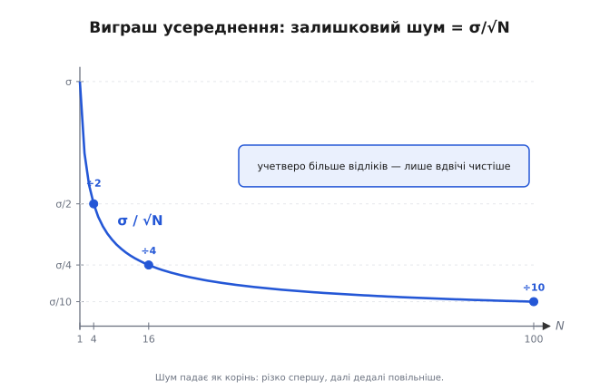
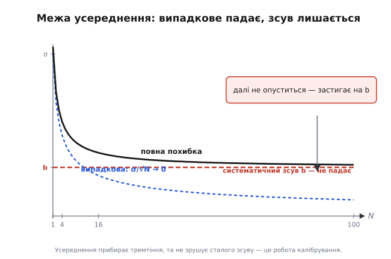

# Виграш усереднення

Давач температури мав би стояти на 25.0 °C, та кожен відлік пострибує: 25.3, потім 24.8, потім 25.1, потім 24.6. Стрибки дрібні й безладні — це шум поверх справжнього значення. Напрошується найпростіша річ: узяти кілька відліків і усереднити їх. І справді стає краще — але наскільки саме краще? Якщо усереднити 4 відліки, шум падає? А якщо 100? Удвічі, удесятеро, чи якось інакше?

Відповідь не «на скільки завгодно» і не «лінійно з кількістю». Усереднення N незалежних відліків зменшує випадковий шум рівно у **√N разів** — не в N. Сотня відліків прибирає шум удесятеро, а не в сто. Це число — √N — не підгін і не емпіричне правило: воно прямо випливає з того, як поводяться випадкові доданки, коли їх додаєш. Розберімо, **чому саме корінь**, де ця межа працює, а головне — де вона раптом перестає допомагати.

## Сигнал, шум і одне просте припущення

Розкладімо кожен відлік на дві частини. Є **справжнє значення** — те, що ми хочемо виміряти; назвімо його s. І є **шум** — випадкова добавка, що щоразу інша; назвімо її ε (грецька «епсилон», стандартна позначка для малої похибки). Кожен i-тий відлік — це їх сума:

```
xᵢ = s + εᵢ
```

Справжнє s у всіх відліках **однакове** — давач же міряє ту саму температуру. А шум εᵢ щоразу новий: то додатний, то від'ємний, без сталого нахилу в якийсь бік. Саме на цьому стоїть уся подальша вигода, тож сформулюймо припущення явно. По-перше, шум **центрований**: у середньому він нуль, його однаково тягне вгору й униз, тож сам по собі він не зміщує значення. По-друге — і це головне — шумові добавки в різних відліках **незалежні**: те, що ε₃ виявився великим додатним, нічого не каже про ε₄. Кожен відлік ловить свіжу, ні з чим не пов'язану реалізацію шуму.

Поки тримаються обидві умови, усереднення працюватиме передбачувано. Щойно одна з них ламається — а вони ламаються, і ми побачимо де, — виграш зникає. Поки що приймімо їх і подивімось, що дає просте середнє.

## Чому середнє взагалі допомагає

Візьмімо N відліків і усереднімо. Підставивши розклад, середнє розпадається на дві окремі суми — справжнього й шуму:

```
x̄ = (1/N)·Σ xᵢ = (1/N)·Σ (s + εᵢ) = s + (1/N)·Σ εᵢ
```

Перша частина — це просто s: ми N разів додали те саме s і поділили на N, тож воно лишилось недоторканим. Уся дія — у другій частині, у середньому шумів (1/N)·Σ εᵢ. От якби воно було нулем, ми б дістали чисте s. Нулем воно не буде — але стане **малим**, і саме тут криється вся вигода.

Інтуїція така. Шуми незалежні й різнознакові: у будь-якій пригорщі частина додатна, частина від'ємна. Коли їх додаєш, додатні й від'ємні **частково гасять одне одного** — не повністю (це ж не дзеркальні пари), а статистично. Що більше доданків, то повніше це взаємне погашення, і то ближче сума шумів тулиться до нуля. Розкид справжнього не зачіпає; розкид шуму притискається. Лишається зрозуміти головне — **як швидко** він притискається з ростом N. Тут інтуїції замало, потрібна арифметика розкиду.

## Як додаються розкиди: дисперсії, а не самі шуми

Міру розкиду випадкової величини задає **дисперсія** (англ. *variance*) — середній квадрат відхилення від середнього; її корінь, **σ** (сигма), зветься середньоквадратичним відхиленням і вимірюється в тих самих одиницях, що й сама величина (вольти, градуси). Саме σ ми відчуваємо як «силу» шуму.

> Дисперсія — це середній квадрат відхилення від середнього, а σ — її корінь, тобто типовий масштаб розкиду в природних одиницях. Незалежність двох величин означає, що значення однієї не несе жодної інформації про другу. Цих двох понять достатньо, щоб іти далі; глибше — окремо.
>
> Докладніше: [Середнє й дисперсія](topic:math-probability/mean-variance).

Уся розгадка √N в одному факті про додавання. Коли додаєш дві **незалежні** випадкові величини, складаються не їхні σ — складаються їхні **дисперсії**:

```
Var(A + B) = Var(A) + Var(B)        (лише якщо A і B незалежні)
```

Чому квадрати, а не самі розкиди? Бо незалежні відхилення не йдуть у ногу. Іноді обидва тягнуть в один бік і підсилюються, іноді — у протилежні й гасяться; у середньому ці випадки врівноважуються так, що сумарний квадрат розкиду дорівнює сумі квадратів — рівно як незалежні катети дають гіпотенузу за Піфагором, c² = a² + b², а не c = a + b. Якби величини були зчеплені (завжди разом угору-вниз), вони б додавались напряму, σ до σ; але **незалежність** змушує їх складатися квадратично. Ось чому припущення про незалежність — не дрібна формальність, а той самий стрижень, на якому тримається весь виграш.

Тепер просто застосуймо це правило N разів. Нехай кожен шум εᵢ має ту саму дисперсію σ². Спершу — дисперсія їхньої **суми**. Доданки незалежні, тож дисперсії додаються N разів:

```
Var( Σ εᵢ ) = N · σ²
```

Зверніть увагу, що вже тут видно нелінійність: розкид суми росте як N у дисперсії, тобто як √N у звичних одиницях σ. Сума N шумів має розкид не Nσ, а лише √N·σ — саме завдяки взаємному погашенню. Але нам потрібна не сума, а **середнє** — сума, поділена на N.

## Від суми до середнього: звідки виходить √N

Лишився один крок — поділити суму на N. Тут спрацьовує друга властивість дисперсії: коли множиш випадкову величину на сталу c, її σ теж множиться на c, а отже **дисперсія множиться на c²**. Ділення на N — це множення на 1/N, тож дисперсія множиться на 1/N²:

```
Var( x̄ ) = Var( (1/N)·Σ εᵢ ) = (1/N²) · Var( Σ εᵢ ) = (1/N²) · N·σ² = σ²/N
```

Ось воно. Дисперсія середнього дорівнює σ²/N — у N разів менша за дисперсію одного відліку. А нас цікавить розкид у звичних одиницях, тобто σ. Беремо корінь обох боків:

```
σ(x̄) = σ / √N
```

Це і є серце теми. Поділ на N мав би, здавалося, давити шум у N разів — але дисперсія в чисельнику теж росла, як N·σ², бо ми ж додали N доданків. Одне N (від додавання) частково з'їдає інше (від ділення), і в підсумку лишається не N, а тільки **√N**. Виграш у √N — це слід боротьби двох ефектів: ділення тягне вниз сильніше (як N²), та накопичена дисперсія суми тягне вгору (як N), і їхнє відношення дає N, а в одиницях σ — корінь.

```
1 відлік    →  σ
4 відліки   →  σ/2       (√4 = 2)
100 відліків →  σ/10     (√100 = 10)
10000        →  σ/100    (√10000 = 100)
```

Платня нелінійна, і це треба відчути нутром. Щоб **удвічі** чистіше — усереднюй 4 відліки. Щоб удесятеро — уже сотню. Щоб у сто разів — десять тисяч. Кожен наступний крок якості коштує вчетверо більше відліків за попередній: точність дорожчає квадратично.


*Залишковий шум як частка від початкового: σ/√N. Перші відліки прибирають шум різко — від 1 до 4 він падає вдвічі. Далі крива стелиться: щоб зрізати його ще вдвічі (до σ/4), потрібні вже 16 відліків, а до σ/10 — аж 100. Корінь робить кожне наступне поліпшення дедалі дорожчим.*

## Той самий результат як виграш у відношенні сигнал/шум

Те, що ми вивели, можна сказати ще однією, дуже звичною мовою — мовою **відношення сигнал/шум**, SNR (англ. *signal-to-noise ratio*). Це просто відношення сили корисного сигналу до сили шуму. Усереднення корисний сигнал s не чіпає (він однаковий у всіх відліках і виходить з усереднення цілим), а шум давить у √N разів. Отже відношення покращується рівно на той самий множник:

```
SNR після N усереднень = √N · SNR одного відліку
```

Усереднення — це найдешевший підсилювач якості, який не додає жодної деталі: він не вигадує сигналу, лише прибирає шум, що його затуляв. У децибелах, де відношення беруть як 10·log₁₀ від відношення **потужностей** (а потужність шуму ∝ σ², тобто ∝ N), виграш зручно лягає в круглі числа:

```
виграш SNR = 10·log₁₀(N) дБ
```

```
N = 10    →  +10 дБ
N = 100   →  +20 дБ
N = 1000  →  +30 дБ
```

Кожне десятикратне усереднення додає рівно 10 децибел — стале число, тому інженери часто й міркують десятками. Та хоч би якою мовою це казати — у разах σ чи в децибелах SNR — це **одна й та сама арифметика** √N, лише записана по-різному.

## Межа: систематична похибка не усереднюється

Досі шум був чесний — центрований і незалежний. А тепер найважливіше застереження теми, без якого можна наробити дорогих помилок. Розкладімо похибку відліку точніше, на **дві принципово різні** частини:

```
xᵢ = s + b + εᵢ
     │   │   └─ випадкова: щоразу інша, центрована, незалежна
     │   └──── систематична (зсув b): та сама в КОЖНОМУ відліку
     └──────── справжнє значення
```

ε — це випадкова частина, та сама, що ми вже приборкали. А b — **систематичний зсув** (англ. *bias*): стала похибка, однакова в усіх відліках. Давач, відкалібрований на 0.4 °C вище, ніж треба; АЦП із зміщенням нуля; терези, що завжди показують на 2 грами більше. Подивімось, що робить із цим зсувом усереднення:

```
x̄ = s + b + (1/N)·Σ εᵢ  →  s + b + σ/√N
                              │   │      └─ падає як √N
                              │   └──────── НЕ падає: b лишається b
                              └──────────── ціль
```

Випадковий доданок тане як √N, як і раніше. А зсув b просто виноситься за усереднення цілим — ми ж N разів додали те саме b і поділили на N, тож воно лишилось недоторканим, точнісінько як справжнє s. **Усереднення давить лише те, що щоразу різне; те, що однакове в кожному відліку, воно зберігає незмінним.** І це симетрично до того, чому виживав сигнал: і сигнал, і зсув переживають усереднення з тієї самої причини — вони сталі.

Звідси сувора межа. Усередни хоч мільйон відліків — випадкова частина впаде практично до нуля, але похибка застрягне на рівні b і далі не зрушить. Ти отримаєш дуже **повторюваний**, стабільний результат, який стабільно **неправильний** на ту саму величину b.

> 🔧 **Навіщо це.** Звідси практичний поділ праці: усереднення лікує **випадковий** шум (теплове тремтіння, дрож АЦП), а систематичний зсув лікує лише **калібрування** — вимір відомого еталона й віднімання різниці. Плутати їх дорого: інженер, що бачить «шумний» давач, накручує усереднення до тисяч відліків, виїдає весь час циклу — а похибка не падає, бо вона була зсувом, а не шумом. Перше питання завжди: ця похибка щоразу різна (тоді усереднюй) чи та сама (тоді калібруй)? Відповідь вирішує, що взагалі робити.


*Випадкова складова (спадна крива) тане як σ/√N і прямує до нуля. Систематичний зсув b (горизонтальна лінія) не реагує на усереднення зовсім. Сумарна похибка опускається лише до рівня b і там застигає: усереднення прибирає тремтіння, але не зрушує сталого зсуву — це робота калібрування, не усереднення.*

Є й тонший варіант тієї самої пастки. Незалежність — не дарована: якщо шум **корельований** між відліками (наприклад, наводка 50 Гц від мережі чи повільний дрейф давача від нагрівання), сусідні відліки тягне в один бік разом, взаємного погашення немає, і виграш просідає нижче за √N — інколи до нуля. Тому усереднюють здебільшого швидше, ніж міняється повільний дрейф, але так, щоб захопити цілу кількість періодів періодичної наводки. √N — це **стеля** для ідеально незалежного шуму; реальність буває гіршою, кращою — ніколи.

## Worked-приклад: скільки відліків купити точність

**Умова.** Давач дає окремий відлік із випадковим шумом σ = 0.40 °C (центрованим і незалежним). Треба, щоб похибка виміру температури впала до 0.05 °C. Скільки відліків усереднити — і що буде з виграшем, якщо в давачі ще й сталий зсув +0.30 °C?

Спершу — суто випадкова частина. Шукаємо N, при якому σ/√N дорівнює потрібним 0.05 °C; розв'язуємо відносно N:

```
σ / √N = 0.05
√N     = σ / 0.05 = 0.40 / 0.05 = 8
N      = 8² = 64  відліки
```

Шістдесят чотири відліки — і випадковий шум падає з 0.40 до 0.05 °C, увосьмеро (бо √64 = 8). Перевіримо в децибелах для відчуття масштабу: виграш 10·log₁₀(64) ≈ 18 дБ. А тепер увімкнімо зсув і подивімось на повну похибку:

```
випадкова частина:  σ/√N = 0.40/8 = 0.05 °C   ← впала, як замовляли
систематичний зсув: b    = 0.30 °C            ← не зрушив ані на йоту
повна похибка ≈ зсув:      0.30 °C             ← у 6 разів гірша за ціль
```

Висновок б'є прямо в суть теми. Ми чесно заробили свої 0.05 °C на випадковій частині — але повна похибка застрягла на 0.30 °C, бо її тепер визначає зсув, а не шум. Збільшувати N далі — марно: 256 відліків зріжуть випадкову частину до 0.025 °C, проте загальні 0.30 °C не здригнуться. Єдиний шлях далі — спершу **відкалібрувати** зсув (відняти ті 0.30 °C), і лише тоді усереднення-до-64 знову стане сенсом.

## Усереднення в прошивці: реальний C

**Умова.** Мікроконтролер може зчитати АЦП N разів поспіль. Треба повернути усереднений відлік — придушити випадковий шум перетворювача рівно у √N разів.

Рецепт прямий: накопичити суму N відліків і поділити на N. Єдина реальна пастка — **тип суми**: сума легко переростає той тип, у якому приходять окремі відліки.

:::tabs
```c
#include <stdint.h>

/* Усереднений відлік АЦП по n зчитуваннях.
   Шум падає у sqrt(n) разів; n — степінь двійки для дешевого ділення зсувом. */
uint16_t adc_read_averaged(int n)
{
    uint32_t acc = 0;                 /* широкий тип: 16-бітні відліки переповнили б uint16_t */
    for (int i = 0; i < n; i++) {
        acc += adc_read_raw();        /* кожне зчитування несе свіжий незалежний шум */
    }
    return (uint16_t)(acc / n);       /* середнє повертається в діапазон одного відліку */
}
```
```python
def adc_read_averaged(n):
    """Усереднений відлік АЦП по n зчитуваннях.
    Шум падає у sqrt(n) разів; цілі Python не переповнюються, тож
    накопичення суми безпечне без ширшого типу."""
    acc = 0
    for _ in range(n):
        acc += adc_read_raw()         # кожне зчитування несе свіжий незалежний шум
    return acc // n                   # середнє повертається в діапазон одного відліку
```
:::

**Розбір на числах.** Хай справжнє значення на вході АЦП — рівно 2000 одиниць, а перетворювач домішує випадковий шум. Чотири послідовні зчитування дали 2003, 1998, 2001, 1996 (розкид ±кілька одиниць — це й є шум). Усереднюємо:

```
сума:     2003 + 1998 + 2001 + 1996 = 7998
середнє:  7998 / 4                   = 1999.5  →  2000 (округлення)
```

Окремі відліки гуляли в межах кількох одиниць навколо 2000; середнє четвірки лягло на 1999.5 — майже точно в ціль, бо √4 = 2 уже вдвічі стиснуло розкид. Узяли б 64 відліки — стиснули б увосьмеро.

**Дві пастки.** Перша — **переповнення**, на яке й розрахований широкий `acc`: 12-бітний відлік сягає 4095, і вже 17 таких відліків дають 69615 — за стелю 16-бітного `uint16_t` (65535); тому суму копичимо в `uint32_t`, а не в типі відліку. Друга, підступніша, — **повільний дрейф під час набору**: якщо за час N зчитувань справжнє значення встигає змінитися (давач гріється, напруга пливе), відліки перестають бути незалежними вимірами одного й того самого, і усереднення мішає докупи різні значення замість тиснути шум. Тож набирай швидше, ніж міняється сам сигнал, — інакше «усереднення» лише розмиє те, що ти хотів виміряти.

## Де це працює щодня

Виграш √N тихо тримає на собі весь точний вимір — усюди, де є випадковий шум і змога повторити відлік.

В **АЦП і давачах** це найперший і найдешевший засіб точності: набрати кілька зчитувань і усереднити, перетворивши надлишок швидкості перетворення на додаткові біти роздільності. Звідси й поширене «передискретизація»: міряти швидше, ніж треба, а зайві відліки тратити на придушення шуму за законом √N.

В **осцилографі** є режим усереднення (англ. *averaging mode*): прилад накладає багато проходів періодичного сигналу й усереднює їх по точках. Випадковий шум, різний від проходу до проходу, гасне як √N і оголює чисту форму хвилі; але — рівно за нашою межею — це працює **лише** для повторюваного сигналу, бо одиничний нерегулярний імпульс усереднювати ні з чим, він щоразу інший.

Та сама √N-арифметика вигулькує всюди, де борються з випадковістю накопиченням: довша **витримка** в астрофото збирає більше фотонів і топить зернистість; повторені виміри в лабораторії звужують похибку середнього; цифрова фільтрація ковзним середнім гладшає шумний ряд. Скрізь діє один закон і одна його межа: накопичення тисне **випадкове** як корінь із кількості, але **систематичне** не зрушує ніколи — те лишається калібруванню.
