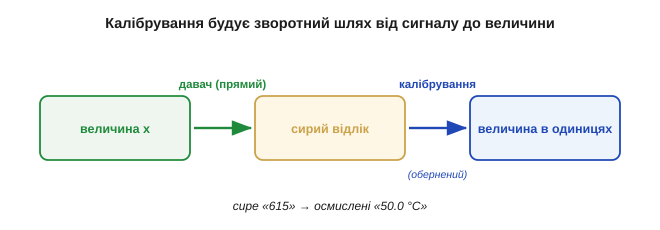
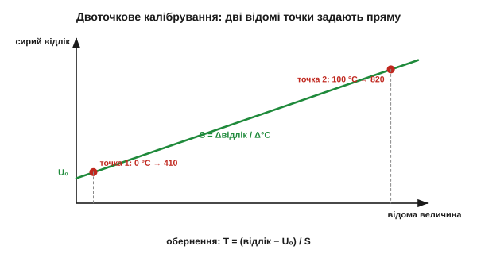
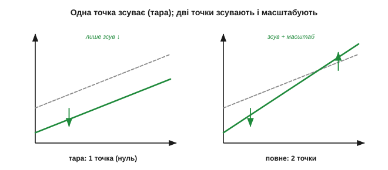
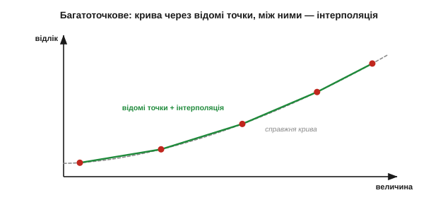
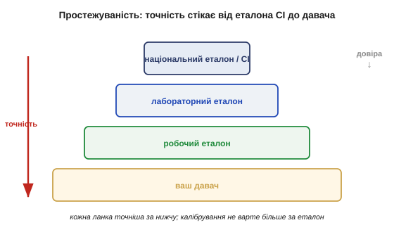
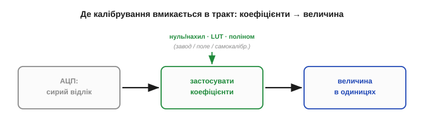
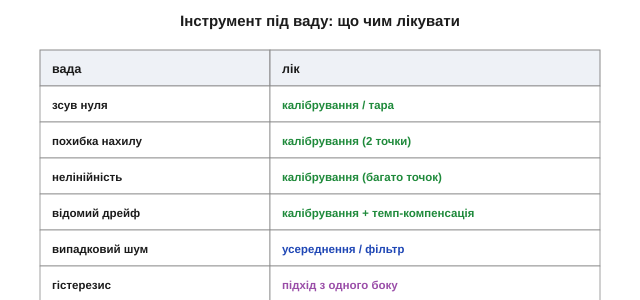

# Калібрування: від сирого сигналу до величини

Реальний давач завдає чимало клопоту: він [перекладає величину в сигнал неточно](topic:hw-sensing/sensor-characteristics), та ще й [повзе й тремтить](topic:hw-sensing/drift-hysteresis-noise). Калібрування — це той крок, де з усього цього безладу нарешті народжується **правдиве число**. Воно перетворює давач із шматка фізики на **прилад**, якому можна вірити. І саме тут практично розв'язується [обернена задача давача](topic:hw-sensing/what-is-a-sensor): як від сигналу повернутися до величини.

### Калібрування — це побудова зворотного шляху

[Давач робить **прямий** хід](topic:hw-sensing/what-is-a-sensor) — величина перетворюється на сигнал, x → U. А для вимірювання потрібен **зворотний** — від сигналу до величини, U → x. Сире число з АЦП — скажімо, «615» — само собою не означає **нічого**: ні градусів, ні кілограмів, ні паскалів. Воно стане осмисленим лише тоді, коли відома **відповідність** між сирими відліками й реальними одиницями. Калібрування — це і є вимірювання цієї відповідності: давач підносять до **відомих** входів і дивляться, що він видає, а тоді будують обернену карту «сигнал → величина».


*Калібрування будує зворотний шлях. Давач робить прямий хід (величина → сигнал); калібрування міряє його по відомих точках і прокладає назад дорогу (сигнал → величина). Без неї маємо безіменне «615», з нею — «50.0 °C».*

Іншими словами: фізика дає прямий бік перетворення, а калібрування — обернений, без якого жоден показ не має сенсу.

Варто оцінити, наскільки це глибоко. Поки давач не відкалібрований, його «615» — приватна валюта, зрозуміла лише цьому екземпляру: інший такий самий давач на ту саму температуру дасть «620» чи «600». Калібрування прив'язує приватні відліки до **спільних** одиниць — і раптом два різні прилади, два різні інженери, дві різні країни починають говорити про величину однаково. Саме калібрування робить вимір **об'єктивним і відтворюваним**, а не просто стрілкою, що кудись хитнулась. Без нього сенсорика лишилася б купою несумісних цяцьок, кожна зі своєю незрозумілою шкалою. Лишається показати, як цей обернений бік побудувати: від найпростішого до найповнішого.

### Дві точки задають пряму: нуль і нахил

Для [**лінійного** давача](topic:hw-sensing/sensor-characteristics) характеристика — пряма U = U₀ + S·x із двома невідомими. А пряму однозначно задають **дві точки**. Тому достатньо піднести давач до **двох відомих** величин, зміряти сирий вихід у кожній — і з цих двох пар обчислити нахил S («підсилення», *gain*) та зсув U₀ («нуль», *offset*). Далі обернення тривіальне: x = (U − U₀) / S.


*Двоточкове калібрування. Два відомі входи (наприклад, 0 °C і 100 °C) дають дві точки «відома величина — сирий відлік». Пряма через них задає нахил S і зсув U₀; усе інше читається з прямої. Це найуживаніший спосіб у світі давачів.*

**Приклад (двоточкове калібрування термодавача).** Давач занурили в тану́чий лід (0 °C) — АЦП показав 410 відліків; занурили в окріп (100 °C) — 820 відліків. Будуємо обернення:

```
нахил:  S = (820 − 410) / (100 − 0) = 410 / 100 = 4.1 відліка/°C
нуль:   U₀ = 410 відліків  (це показ при 0 °C)

обернення:  T = (відлік − 410) / 4.1
```

Тепер сирий показ оживає. Прийшло «615»? Тоді T = (615 − 410) / 4.1 = 205 / 4.1 = **50.0 °C**. Дві відомі точки — і безіменні відліки стали градусами. Цей прийом «нуль і нахил» (*zero & span*) — робоча конячка всієї сенсорики.

Одне практичне питання — **куди** ставити ці дві точки. Найкраще брати їх ближче до країв робочого діапазону: тоді пряма спирається на широку базу й найменше «гуляє» посередині. Якщо ж обидві точки туляться поруч, маленька похибка в кожній сильно повертає всю пряму — як стілець на двох близько поставлених ніжках. І ще: між двома точками (і трохи за ними) пряма точна, а далеко за межами — це вже **екстраполяція**, якій вірити не варто, бо там можуть початись і [нелінійність, і насичення](topic:hw-sensing/sensor-characteristics). Тому дві точки обирають так, щоб вони **охоплювали** реальний робочий проміжок, а не лежали в його куточку.

> 🔧 **Навіщо це.** Двоточкове калібрування — найкорисніший трюк у польовій сенсориці. Дві відомі точки, дві арифметичні дії — і будь-який лінійний давач говорить у ваших одиницях, без жодної лабораторії. Бережіть лише дві речі: щоб точки **охоплювали** робочий діапазон і щоб самі еталони були чесні (лід — справді 0 °C, гиря — справді відомої маси). Решту зробить формула «нуль і нахил».

### Одна точка: обнулення (tare)

Часто повзе тільки **нуль** ([дрейф зсуву](topic:hw-sensing/drift-hysteresis-noise) — найпоширеніший), а нахил тримається. Тоді й калібрувати щоразу заново обидва числа не треба — досить **однієї** відомої точки, зазвичай нуля: переобнулити. Це та сама кнопка **«тара»** на кухонних вагах: ставите порожню миску, тиснете тару — ваги запам'ятовують поточний показ як новий нуль і віднімають його з усіх наступних.


*Одна точка проти двох. Обнулення (тара) лише **зсуває** характеристику, прибиваючи її до відомого нуля, — лікує дрейф зсуву. Двоточкове калібрування ще й **масштабує** (править нахил) — лікує і зсув, і дрейф підсилення. Тара дешева й часта; повне калібрування рідше й точніше.*

Обнулення дешеве й швидке, тож його роблять часто — перед кожним зважуванням, на старті сеансу. Воно прибирає найчастішу біду (зсув нуля), але **не чіпає** нахилу: якщо попливло підсилення, тарою його не виправити, потрібна друга точка.

У тари є й зворотний бік, про який легко забути: вона **сліпо** прибиває нуль до поточного показу. Отже, якщо в момент обнулення на давачі вже була справжня величина, ви її мовчки **зануляєте** разом зі зсувом. Тому тарувати треба свідомо й у правильну мить: ваги — порожніми, гіроскоп — нерухомим, давач газу — на чистому повітрі. Інакше тара з ліки перетворюється на джерело сталої похибки, ще й непомітної, бо «нуль» виглядає правильним.

### Багато точок: коли крива не пряма

А якщо давач [**нелінійний**](topic:hw-sensing/sensor-characteristics) — як NTC із його крутою кривою? Двох точок замало: пряма через них збреше посередині. Тоді міряють вихід у **багатьох** відомих точках і будують уже не пряму, а **криву**. Обернути її можна двома способами: **таблицею відповідності** (*lookup table, LUT*) з лінійною інтерполяцією між вузлами, або **підгонкою формули** — полінома чи відомої функції (для NTC це рівняння Стейнгарта-Гарта, для термопар — стандартний поліном).


*Багатоточкове калібрування нелінійного давача. Вихід міряють у кількох відомих точках; між ними значення беруть інтерполяцією по таблиці (LUT) або з підігнаної формули. Більше точок — точніший зворотний шлях, але й більше праці на калібрування.*

Це і є **лінеаризація в програмі**: крива давача перестає бути вироком, щойно мікроконтролер уміє по ній ходити назад. Компроміс очевидний — більше калібрувальних точок дає точніше обернення, але кожна точка коштує окремого еталонного виміру.

Між таблицею й поліномом теж є вибір зі своїм смаком. **Таблиця** проста й передбачувана: між вузлами — пряма, ніяких сюрпризів, але точок треба багато, і вони їдять пам'ять. **Поліном** компактний і гладкий, та підступний: підігнаний по кількох точках, він між ними чи за ними може **вихилятися** хвилями, особливо високого степеня. На практиці часто беруть золоту середину — **кусково-лінійну** апроксимацію: та сама таблиця, але з розумно розставленими вузлами, густіше там, де крива крутіша. Добра новина: для типових давачів виробник зазвичай уже дає або таблицю, або готову формулу, тож винаходити велосипед не доводиться — досить акуратно її застосувати.

### Еталон мусить бути кращим: простежуваність

Тут постає питання, від якого все залежить: а **відносно чого** калібрувати? Калібрування лише **переносить** точність з еталона на давач — отже, еталон мусить бути **кращим** за давач, інакше ви переносите не точність, а власну ж невизначеність. Калібрувати проти чогось гіршого — самообман.

За еталони правлять **фізичні реперні точки** (тану́чий лід 0 °C, кипіння води 100 °C, потрійна точка — природа сама тримає їх сталими), **повірені міри** (сертифікована гиря, опорна напруга) або просто **кращий прилад**. Але й ці еталони хтось калібрував — за ще кращими, аж до національних і міжнародних еталонів СІ. Цей ланцюг «хто калібрував калібрувальника» зветься **простежуваністю** (*traceability*).

Дві речі роблять цю піраміду надійною. По-перше, **природні реперні точки**: тану́чий лід і потрійна точка води — це не чиясь домовленість, а сама фізика, що тримає ці температури сталими будь-де у світі **задарма**; тому вони й слугують безкоштовними точними еталонами. (З кипінням обережніше: воно «тримає» свої 100 °C лише за нормального тиску — на висоті чи в негоду точка кипіння помітно зсувається, тож для калібрування її беруть із поправкою на тиск.) По-друге, чесний облік невизначеності: на кожному щаблі додається трохи похибки, тож унизу піраміди давач **ніколи** не точніший за суму всіх ланок над ним. Саме тому акредитовані лабораторії видають **сертифікат** із числом невизначеності — не голе «відкалібровано», а «відкалібровано з точністю стільки-то, простежувано до СІ». Без цього додатка слово «калібрований» майже порожнє.


*Простежуваність — піраміда довіри. Ваш давач калібрують за робочим еталоном, той — за лабораторним, той — за національним, аж до означень СІ. Кожна ланка точніша за сусідню нижчу; точність «стікає» згори вниз. Калібрування не варте більше за свій еталон.*

> 🔧 **Навіщо це.** Калібрування ніколи не буває точнішим за свій еталон. Виставляти давач «на око» чи за таким самим дешевим приладом — означає отримати **точно виміряну неправду**. Перш ніж калібрувати, спитайте: моя опорна точка справді краща за давач? Тану́чий лід — чудовий і безкоштовний еталон 0 °C; сусідній такий самий термометр — ні.

### Де живе калібрування: завод, поле, сам давач

Калібрувати можна на різних етапах, і це теж вибір. **Заводське** калібрування: коефіцієнти зашивають у давач на виробництві — [«розумні» напівпровідникові давачі](topic:hw-sensing/piezo-optical-semiconductor) тому й віддають одразу реальні одиниці, що калібрувальну криву вже вкладено в кристал. **Польове** (користувацьке): ви самі переобнуляєте чи правите нахил у роботі — тара ваг, занурення pH-метра в буферні розчини. **Самокалібрування**: давач має внутрішній еталон і періодично звіряється сам (авто-нуль).

У вибору етапу є своя ціна. **Заводське** зручне — нічого не робиш, давач одразу в одиницях, — але воно припускає, що відтоді нічого не попливло; а [реальний давач пливе](topic:hw-sensing/drift-hysteresis-noise). **Польове** ловить свіжий дрейф і старіння, та потребує еталона під рукою (порожніх ваг, буферного розчину, реперної точки) і дисципліни його застосовувати. Тому на практиці їх часто **поєднують**: грубе заводське калібрування плюс легке польове переобнулення перед роботою. А «розумний» давач, що сам тримає коефіцієнти, лише ховає цю роботу всередину корпусу — але не скасовує її, і періодична повірка йому потрібна так само.


*Де калібрування вмикається в тракт. Сирий відлік АЦП проходить крізь застосування коефіцієнтів (нуль/нахил або LUT/поліном) і виходить уже величиною в реальних одиницях. Коефіцієнти беруться із заводу, з поля або з самокалібрування — але місце їх застосування одне.*

Хоч би звідки бралися коефіцієнти, **місце** їх застосування одне: між сирим відліком і осмисленою величиною, у коді. Тому калібрування — це не лише процедура з еталонами, а й маленький шматок прошивки, що щоразу перетворює відлік на градуси.

### Що калібрування лікує, а що ні

Лишилося окреслити межі методу. Калібрування лікує **систематичні** вади: зсув нуля, похибку нахилу, нелінійність (багатоточкове) і навіть **відомий дрейф** — якщо міряти окремо температуру й калібрувати залежність від неї (це і є [температурна компенсація](topic:hw-sensing/drift-hysteresis-noise)).

**Приклад (компенсація відомого дрейфу).** Нуль давача пливе на −0.5 °C на кожні +10 °C нагріву довкілля (відомий TC). Поряд стоїть давач температури плати: він показав +35 °C проти калібрувальних +25 °C — отже, прогрів на +10 °C. Виправлення:

```
зсув від прогріву = (35 − 25)/10 · (−0.5 °C) = −0.5 °C
виправлений показ = сирий показ − (−0.5 °C) = сирий + 0.5 °C
```

Знаючи TC і вимірявши температуру окремо, систематичний дрейф просто **віднімають числом** — давач ніби й не грівся. Ось як «непереборний» [дрейф](topic:hw-sensing/drift-hysteresis-noise) перетворюється на ще одну калібрувальну поправку: усе систематичне, що ви здатні **виміряти**, ви здатні й **відняти**.

Але двох речей калібрування **не може**. Воно не прибирає **випадковий шум** — бо припускає, що давач щоразу дає те саме; проти тремтіння працює [усереднення й фільтрація](topic:com-signal/moving-average). І воно не лікує **гістерезис** — бо припускає **однозначну** криву, а [гістерезис](topic:hw-sensing/drift-hysteresis-noise) дає дві гілки залежно від шляху; його приборкують, підходячи з одного боку. До того ж сама калібрувальна крива з часом **дрейфує**, тож будь-яке калібрування дійсне лише певний термін і за певних умов — звідси періодична повірка.


*Інструмент під ваду. Зсув, нахил, нелінійність, відомий дрейф — калібрування. Випадковий шум — усереднення й фільтр. Гістерезис — підхід з одного боку. Кожен дефект має свої ліки; жоден інструмент не лікує всі.*

> 🔧 **Навіщо це.** Найчастіша помилка — лікувати ваду не тим інструментом: довго фільтрувати зміщений давач (вийде точно виміряна неправда) або калібрувати шумний (крива «гулятиме» від калібрування до калібрування). Спершу назвіть ваду — [за характеристикою давача](topic:hw-sensing/sensor-characteristics) чи [за типом дрейфу й шуму](topic:hw-sensing/drift-hysteresis-noise), тоді беріть відповідні ліки: систематику — калібруванням, випадкове — фільтром, шлях — однобічним підходом. Разом вони й роблять із давача надійний прилад.

Лишається практичне «коли». Калібрування не вічне: воно дійсне лише доти, доки давач і умови близькі до тих, у яких його робили. Тому в реальних приладах закладають цілий **розклад повірки** — від «щоразу на старті» (швидка тара) до «раз на рік у лабораторії» (повний еталонний прогін), залежно від того, як хутко [цей давач пливе](topic:hw-sensing/drift-hysteresis-noise). Добрий тон — зберігати в пам'яті **дату й умови** останнього калібрування: прилад, що «не пам'ятає», коли його востаннє звіряли, довіри не заслуговує, бо його показ може бути правильним, а може бути піврічним дрейфом — і ви не відрізните. Так калібрування з разової дії перетворюється на частину **життєвого циклу** приладу, як заміна оливи в двигуні.

Ось і вся фізика давачів у дії: [давач перетворює](topic:hw-sensing/what-is-a-sensor) величину в сигнал, має [описувану характеристику](topic:hw-sensing/sensor-characteristics) з [відомими вадами](topic:hw-sensing/drift-hysteresis-noise), а калібрування прив'язує її до еталона й повертає правдиву величину. «615 відліків» нарешті стало «50.0 °C» — з чесно порахованою похибкою. І найприємніше: калібрування — це майже завжди **найдешевший** спосіб підняти точність. Не міняти давач на дорожчий, не перепроєктовувати тракт, а просто акуратно піднести наявний давач до двох-трьох відомих точок і записати коефіцієнти. Часто саме це й відрізняє аматорський вузол від приладу, якому вірять.

---
