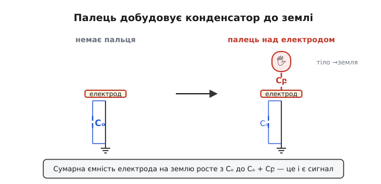
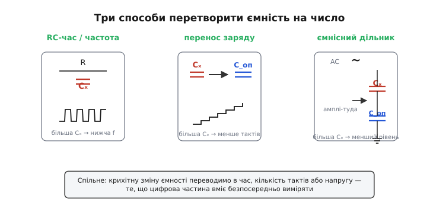
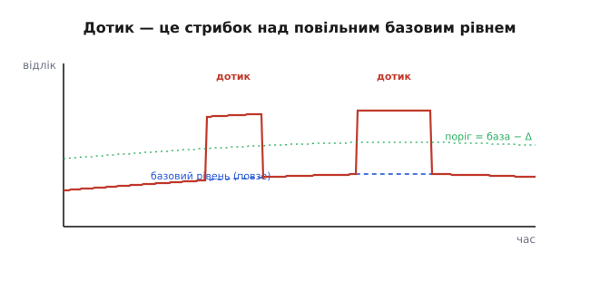

# Ємнісне зондування

Натисніть пальцем на скло смартфона — і під ним нічого не прогинається, не клацає жодна кнопка, ніяка плівка не змикається. Скло тверде й нерухоме. А екран усе одно точно знає, де ваш палець. Звідки? Адже палець нічого не торкнувся в електричному сенсі — між ним і схемою лежить суцільний шар скла. Розгадка ось у чому: палець не мусить нічого замикати. Сам факт, що він **наблизився**, змінює крихітну електричну величину — ємність, — і схема ловить саме цю зміну. Це і є **ємнісне зондування** (англ. *capacitive sensing*): спосіб помітити присутність чи рух предмета не за дотиком-контактом, а за тим, як предмет спотворює невидиме електричне поле навколо електрода.

Щоб побачити, чому це працює, треба спершу згадати, що таке ємність — і потім зрозуміти одну річ, яку легко проґавити: ємність виникає не лише в спеціально зробленому конденсаторі. Вона є **скрізь**, де поряд опиняються два провідники.

## Палець добудовує конденсатор

[Ємність](topic:ph-electromagnetism/capacitance) — це міра того, скільки заряду провідник набирає на кожен вольт прикладеної напруги. Чим більша ємність, тим більше заряду треба напхати, щоб підняти напругу на той самий вольт. Звична картинка ємності — дві металеві пластини одна навпроти одної: це конденсатор, спеціально зроблений, щоб ємність була великою й передбачуваною.

Але ось ключ до всього зондування: **будь-який провідник має ємність просто щодо всього навколишнього**. Шматок міді на платі, доріжка, металева площадка під склом — кожен з них тримає якесь невелике електричне поле між собою й найближчою «землею» (корпусом, проводом живлення, вашою рукою, що тримає прилад). Ця власна ємність електрода на землю мала — одиниці-десятки пікофарад (1 пФ = 10⁻¹² Ф), — але вона реальна й її можна виміряти.

Тепер піднесімо палець. Людське тіло — добрий провідник (усередині солона вода), та ще й заземлене через ноги, стілець, ємність на саму планету. Палець, що навис над електродом, стає **другою обкладкою конденсатора**, а тонкий шар скла чи лаку між ними — діелектриком. З'являється нова ємність — між електродом і пальцем, — і вона додається до тієї, що вже була.


*Палець добудовує конденсатор до землі. Без пальця електрод має тільки власну невелику ємність Cₒ на навколишню землю. Палець над ним стає другою обкладкою: додається ємність Cբ, а оскільки тіло заземлене, обидві ємності працюють паралельно. Сумарна ємність електрода на землю росте з Cₒ до Cₒ + Cբ — і саме цей приріст ми ловимо.*

Ось і вся фізика дотику: **наближення пальця збільшує сумарну ємність електрода на землю**. Зазвичай приріст дрібний — частки пікофарада до одиниць пікофарад, тобто десяток-другий відсотків від базової величини. Палець не торкається жодного контакту, не замикає кола; він лише добудовує конденсатор, якого доти бракувало. А далі вся справа — навчитися надійно помітити цю крихітну добавку. Бо помітити частку пікофарада на тлі шумів, температурного дрейфу й паразитних наводок — це і є справжня інженерна задача ємнісного зондування.

> 🔧 **Навіщо це.** Сенсор без рухомих частин — мрія для будь-якого пристрою, що має жити роками. Механічна кнопка стирається, бруд забивається під ковпачок, контакти окислюються. Ємнісна площадка — це гола мідь під суцільним лаком чи склом: нема чому зноситися, нема куди потрапити волозі. Тому ємнісне зондування стоїть скрізь, де треба герметичність і довговічність: сенсорні панелі, кнопки побутової техніки під суцільним склом, повзунки гучності, навіть давачі рівня рідини крізь стінку бака.

## Чому взагалі змінюється ємність

Перш ніж рахувати, корисно мати інтуїцію, **від чого** ємність залежить, — бо ємнісний давач можна побудувати не лише на дотику пальця. Ємність плоского конденсатора задає коротка формула, і кожна її буква — це окрема ручка, за яку природа (чи інженер) може смикнути:

```
C = ε₀ · εᵣ · A / d

ε₀ — електрична стала, 8.85·10⁻¹² Ф/м
εᵣ — відносна діелектрична проникність речовини між обкладками
A  — площа перекриття обкладок
d  — відстань між обкладками
```

Три способи змінити ємність — три типи ємнісних давачів. **Змінюй відстань d** — і маєш давач наближення або тиску: палець підходить ближче, мембрана прогинається — ємність росте, бо d у знаменнику. **Змінюй площу перекриття A** — і маєш давач положення: дві гребінки, що насуваються одна на одну, дають ємність, пропорційну тому, наскільки вони зайшли (так працюють точні давачі кута й мікрометри). **Змінюй діелектрик εᵣ між обкладками** — і маєш давач речовини: повітря має εᵣ ≈ 1, а вода — близько 80, тож якщо між обкладками замість повітря з'явиться вода, ємність підскочить у десятки разів. Саме на цьому стоять давачі вологості й безконтактні покажчики рівня рідини.

> 🔧 **Навіщо це.** Покажчик рівня в баку без жодного отвору й поплавка: дві смужки фольги наклеюють зовні на пластикову стінку. Поки за стінкою повітря — ємність між смужками мала; піднялася рідина з високим εᵣ — ємність зросла рівно настільки, наскільки рідина закрила смужки. Жодного контакту з вмістом, нічого не тоне й не застрягає. Той самий принцип — у давачах вологості ґрунту й зерна.

Дотик пальцем — окремий, найхитріший випадок: палець не просто наближається (зменшує d), він ще й **підключає велику ємність свого заземленого тіла паралельно**. Тому в техніці його часто описують не формулою плоского конденсатора, а просто як «додаткову ємність на землю», що вмикається поряд з електродом. Суть та сама: десь у системі ємність підскочила, і це треба зловити.

## Як перетворити пікофаради на число

Тут постає головна перешкода. Цифрова частина — мікроконтролер — уміє рахувати тільки час і рівні напруги. Вона не має входу «виміряй ємність». Отже, ємність треба спершу **перевести у щось, що мікроконтролер уже вміє читати**: у проміжок часу, у кількість тактів або в напругу. Є три класичні способи це зробити, і всі троє зводять незриму пікофараду до звичайного числа.


*Три способи перетворити ємність на число. Зліва — час заряду RC: більша Cₓ робить заряд повільнішим, тож знижує частоту коливань. Посередині — перенос заряду: невідома Cₓ порціями перекачує заряд у відомий опорний конденсатор, і чим вона більша, тим менше тактів треба до заповнення. Справа — ємнісний дільник: змінна напруга ділиться між Cₓ і опорним конденсатором, тож більша Cₓ дає менший рівень на виході. Спільне в усіх трьох: крихітну зміну ємності переводимо в час, кількість тактів або напругу — те, що цифрова частина вміє безпосередньо виміряти.*

**Спосіб перший — за часом заряду.** Підключіть невідому ємність Cₓ через відомий резистор R до живлення й рахуйте, скільки часу напруга на ній повзе від нуля до якогось порога. Цей час задає [стала RC](topic:hw-analog/rc-time-constant) — добуток τ = R·C, що показує, за скільки конденсатор помітно підзаряджається. Більша ємність повзе повільніше, тож час до порога довший. Поставте поріг і дайте схемі самоперезапускатися — і Cₓ почне керувати частотою [релаксаційного генератора](topic:hw-analog/relaxation-oscillator): чим більший палець добавив ємності, тим нижча частота. Мікроконтролеру лишається порахувати цю частоту — а рахувати імпульси він уміє чудово. Це найдешевший спосіб: потрібен один резистор і один цифровий вивід.

**Спосіб другий — перенос заряду (англ. charge transfer).** Він тонший і точніший, тому стоїть у більшості теперішніх мікросхем. Ідея така: зарядимо невідому Cₓ до напруги живлення, тоді перекинемо весь її заряд у великий **опорний конденсатор** C_оп — і повторюватимемо. Щоразу Cₓ приносить порцію заряду q = Cₓ · V, і опорний конденсатор потроху наповнюється. Рахуємо, **скільки таких порцій** треба, щоб напруга на опорному дійшла до порога. Чим більша Cₓ, тим жирніша кожна порція, тим менше тактів до заповнення. Це по суті цифрові ваги для заряду: невідому ємність ми зважуємо порціями проти відомої.

**Спосіб третій — ємнісний дільник.** Подайте на електрод змінну напругу й гляньте, яка її частка дійде до виходу через дільник з двох ємностей — невідомої Cₓ і опорної. Дві ємності ділять змінну напругу обернено до своїх величин (більша ємність — менший спад на ній), тож амплітуда на виході прямо каже, чому дорівнює Cₓ. Цей спосіб природний, коли в системі вже є генератор змінної напруги, і він добре дружить із синхронним детектуванням, що відсіює завади на чужих частотах.

Усі три — варіації однієї думки: **впустити в Cₓ відому дію (струм через резистор, порцію заряду, змінну напругу) і поміряти відгук**. Відгук залежить від ємності — отже, з відгуку ємність читається. Який спосіб обрати, диктує задача: за дешевизну й простоту платять способом за часом, за точність і завадостійкість — переносом заряду чи дільником.

## Сигнал крихітний — а світ навколо галасливий

Тепер найважче й найцікавіше. Приріст ємності від пальця — частки пікофарада. А база, від якої він відлічується, сама весь час пливе. Нагрівся прилад — мідь розширилась, лак змінив проникність, база поповзла. Підвищилась вологість — на поверхні осіла плівка води з високим εᵣ, база стрибнула. Поклали телефон на стіл — поряд опинилася велика заземлена поверхня, база зсунулася. Жоден з цих повільних зсувів не є дотиком, але кожен ворушить ту саму ємність, що й палець.

Якби ми просто поставили нерухомий поріг — «ємність вища за стільки-то, отже дотик», — давач брехав би безперервно: то «залипав» би від нагріву, то глухнув би на холоді. Тому ємнісний давач **ніколи не дивиться на абсолютну ємність**. Він стежить за **повільним базовим рівнем** і реагує лише на **швидкий стрибок над ним**.


*Дотик — це стрибок над повільним базовим рівнем. Сирий відлік (товста лінія) складається з повільного дрейфу плюс різкі плато від дотиків. Базовий рівень (штрихова крива) поволі повзе за дрейфом — від нагріву, вологості, сусідніх предметів. Поріг тримають не нерухомо, а на сталій відстані Δ нижче поточної бази, тож він іде слідом. Дотик ловиться як різке відхилення від бази, а не як перевищення якогось абсолютного числа.*

Хитрість у тому, **як саме розрізнити повільний дрейф і швидкий дотик**, адже обидва ворушать одну величину. Розрізняють їх за **швидкістю**. Дрейф триває секунди й хвилини; дотик настає за частки секунди. Тож програма веде ковзний усереднений базовий рівень, який «доганяє» сирий відлік **повільно** — настільки повільно, що встигає за нагрівом, але не встигає за пальцем. Коли відлік раптом відскакує від бази більше ніж на поріг Δ — це дотик. А поки палець тримається, базу **заморожують**, щоб вона не «з'їла» дотик, повільно підтягнувшись до нього.

> 🔧 **Навіщо це.** Без стеження за базою ємнісна кнопка непридатна для реального виробу: вона працювала б на столі в лабораторії й відмовляла б у спеку, під дощем чи в руці спітнілого користувача. Уся надійність побутового тачскрина чи кнопки на плиті тримається саме на цьому повільному автопідстроюванні бази. Тому в готових ємнісних мікросхемах і бібліотеках добра половина коду — не вимірювання ємності, а саме розумне ведення базового рівня й порогів.

## Своя ємність і взаємна ємність

Є два різні способи ввімкнути електроди — і вони визначають, чи буде у вас одна кнопка, чи цілий екран, що бачить кілька пальців нараз.

**Своя ємність (англ. self-capacitance).** Міряємо ємність **одного електрода на землю**. Палець, що додає ємність на землю, збільшує її — це той випадок, з якого ми почали. Просто, дешево, чутливо. Але цей спосіб погано рахує кілька дотиків одночасно: якщо натиснути два пальці на сітці рядків і стовпців, де кожен рядок і стовпець міряється окремо на землю, схема бачить два «гарячі» рядки й два «гарячі» стовпці — і не може сказати, котрий рядок з котрим стовпцем склали реальну точку. Виходить чотири можливі перетини на два справжні дотики — класична двозначність, яку звуть **примарними дотиками** (англ. ghosting).

**Взаємна ємність (англ. mutual capacitance).** Тут міряють ємність **між двома сусідніми електродами** — передавальним і приймальним, що йдуть поряд, але не торкаються. Між ними вже є невелика ємність через крайове поле, що вигинається дугою з одного на інший. Палець, наблизившись, **краде частину цього поля на себе** (тіло заземлене, поле охочіше тече в палець, ніж на сусідній електрод) — і взаємна ємність між парою **зменшується**. Головна перевага: міряти можна **кожен перетин рядка зі стовпцем окремо**, бо кожна пара рядок-стовпець має свою власну взаємну ємність. Тому взаємна ємність бачить **багато пальців одночасно** без двозначності — і саме на ній стоять усі сучасні мультитач-екрани.

Різниця в знаку відгуку варта того, щоб її запам'ятати: палець **збільшує** свою ємність на землю, але **зменшує** взаємну ємність між парою електродів. Та сама рука, той самий фізичний механізм — заземлене тіло перетягує поле на себе, — а знак протилежний, бо в першому випадку поле тече з електрода **в палець** (додаючи ємності на землю), а в другому палець **відбирає** поле, що мало б дійти до сусіднього електрода.

## Робочий приклад: ємнісна кнопка за часом заряду

Зберімо найпростішу ємнісну кнопку на голому мікроконтролері, без жодної спеціальної мікросхеми, — лише один резистор і один вивід. Це чудово показує всю ідею в дії: ми справді переведемо невидиму пікофараду в число тактів і піймаємо дотик як стрибок над базою.

Схема: сенсорна площадка з'єднана з виводом мікроконтролера через резистор R (типово сотні кілоом). Вимірювання йде у два такти. Спершу розряджаємо площадку — переводимо вивід у режим виходу й видаємо нуль, ємність розряджається до нуля. Тоді переводимо вивід у вхід і **рахуємо цикли**, поки напруга на площадці повзе вгору через R і не перетне поріг логічної одиниці. Більша ємність повзе повільніше — лік довший.

**Умова: оцінимо, наскільки подовжиться лік від дотику.** Площадка має власну ємність Cₒ = 15 пФ, підтяжка через R = 1 МОм. Поріг логічної одиниці — приблизно 0.5 живлення, тож конденсатор повзе до порога за час близько 0.7·τ (стандартний результат для заряду RC до половини живлення, бо ln 2 ≈ 0.69). Палець додає Cբ = 5 пФ.

```
Без пальця:
  τ₀ = R · Cₒ = 1·10⁶ · 15·10⁻¹² = 15 мкс
  t₀ ≈ 0.7 · τ₀ ≈ 10.5 мкс

З пальцем (ємність 15 + 5 = 20 пФ):
  τ₁ = R · (Cₒ + Cբ) = 1·10⁶ · 20·10⁻¹² = 20 мкс
  t₁ ≈ 0.7 · τ₁ ≈ 14 мкс

Приріст часу: Δt = t₁ − t₀ ≈ 3.5 мкс  (+33 %)
```

Третина — це багато, такий стрибок не сховається в шумі. Але в абсолютних одиницях це лише мікросекунди, тож ловити їх таймером, що цокає мегагерцами, треба акуратно. Ось вимірювальна частина на реальному C для мікроконтролера AVR (Arduino-сумісний), де площадка висить на одному виводі:

:::tabs
```cpp
#include <Arduino.h>

const uint8_t PAD = A0;       // вивід сенсорної площадки
const uint16_t TIMEOUT = 2000;// стеля циклів, щоб не зависнути

// Один замір: розрядити площадку, тоді порахувати цикли до порога "1".
uint16_t measure_pad(void) {
    // 1) розряд: вивід — вихід, рівень 0
    pinMode(PAD, OUTPUT);
    digitalWrite(PAD, LOW);
    delayMicroseconds(50);    // дати ємності повністю стектись

    // 2) відпускаємо: вивід — вхід без підтяжки; рахуємо, доки не стане "1"
    uint16_t n = 0;
    pinMode(PAD, INPUT);
    while (digitalRead(PAD) == LOW && n < TIMEOUT)
        n++;                  // кожен цикл — фіксований квант часу
    return n;                 // більша ємність → більше n
}
```
```python
from machine import Pin
import time

PAD = 26          # вивід сенсорної площадки
TIMEOUT = 2000    # стеля циклів, щоб не зависнути

# Один замір: розрядити площадку, тоді порахувати цикли до порога "1".
def measure_pad():
    # 1) розряд: вивід — вихід, рівень 0
    pad = Pin(PAD, Pin.OUT)
    pad.value(0)
    time.sleep_us(50)         # дати ємності повністю стектись

    # 2) відпускаємо: вивід — вхід без підтяжки; рахуємо, доки не стане "1"
    n = 0
    pad = Pin(PAD, Pin.IN)
    while pad.value() == 0 and n < TIMEOUT:
        n += 1                # кожен цикл — фіксований квант часу
    return n                  # більша ємність → більше n
```
:::

Сире число `n` саме по собі нічого не каже — воно пливе від температури й живлення. Тому поверх кладемо повільне стеження за базою й поріг над нею:

:::tabs
```cpp
// Повільна база (зсунута ліворуч на 6 — це ділення на 64 у цілих числах)
uint32_t baseline = 0;        // зберігаємо базу в 64× збільшеному масштабі
const uint16_t TOUCH_DELTA = 12;   // поріг стрибка над базою, у одиницях n

void setup() {
    Serial.begin(115200);
    baseline = (uint32_t)measure_pad() << 6;  // початкова база з першого заміру
}

void loop() {
    uint16_t raw = measure_pad();
    uint16_t base = baseline >> 6;            // поточна база у звичайних одиницях

    bool touched = (raw > base + TOUCH_DELTA); // дотик = стрибок над базою

    // База доганяє сире значення ПОВІЛЬНО — і лише коли пальця немає,
    // щоб дотик не "розчинився" у підтягнутій базі.
    if (!touched)
        baseline += ((int32_t)((uint32_t)raw << 6) - (int32_t)baseline) >> 6;

    Serial.println(touched ? "TOUCH" : "----");
    delay(20);                                // ~50 замірів за секунду
}
```
```python
import time

# Повільна база (зсунута ліворуч на 6 — це ділення на 64 у цілих числах)
baseline = measure_pad() << 6   # зберігаємо базу в 64× збільшеному масштабі;
                                # початкова база з першого заміру
TOUCH_DELTA = 12                # поріг стрибка над базою, у одиницях n

while True:
    raw = measure_pad()
    base = baseline >> 6                    # поточна база у звичайних одиницях

    touched = raw > base + TOUCH_DELTA      # дотик = стрибок над базою

    # База доганяє сире значення ПОВІЛЬНО — і лише коли пальця немає,
    # щоб дотик не "розчинився" у підтягнутій базі.
    if not touched:
        baseline += ((raw << 6) - baseline) >> 6

    print("TOUCH" if touched else "----")
    time.sleep_ms(20)                       # ~50 замірів за секунду
```
:::

Тут видно всю ідею ємнісного зондування в мініатюрі. Перетворення ємності на число — у `measure_pad`. Боротьба з дрейфом — у тому, як `baseline` повільно повзе (зсув на 6 робить її в шістдесят чотири рази інертнішою за сирий відлік) і **застигає, поки тримається дотик** (умова `if (!touched)`). А рішення про дотик — це не абсолютний поріг, а **перевищення бази на Δ**. Саме ці три речі й відрізняють робочу кнопку від лабораторної іграшки, що відмовляє від першого ж подиху теплого повітря.

## Що псує зондування і як це гасять

Дві біди підстерігають кожен ємнісний давач, і обидві варто знати наперед.

Перша — **паразитні наводки**. Електрод чутливий до всякого змінного поля поряд, не лише до пальця: мережа 50 Гц із розетки, екран із його розгорткою, імпульсний перетворювач живлення. Усе це наводить на електрод дрібний змінний сигнал, що видає себе за дотик. Боронить від цього [екранування](topic:hw-pcb/shielding) (землений провідник, що відгороджує електрод від чужих полів) і вимірювання на власній відомій частоті з синхронним детектуванням — так схема глуха до всього, крім свого.

Друга, тонша, — **паразитна ємність самих доріжок**. Довгий провід від мікросхеми до площадки сам має ємність на землю, і вона додається до корисної, **притлумлюючи** відносний внесок пальця: якщо доріжка тримає 40 пФ, а палець додає 1 пФ, то корисний сигнал — лише 2 % від цілого, і його легко втопити в шумі. Тут рятує хитрий прийом — **ведений екран** (англ. driven shield, або active guard): під сигнальною доріжкою кладуть другий провідник і **жене на ньому ту саму напругу**, що й на сигналі. Якщо обидва провідники завжди мають однаковий потенціал, різниці напруг між ними нема — отже, нема й електричного поля, отже, паразитна ємність між ними фактично зникає. Доріжка перестає «красти» сигнал, і вся чутливість дістається пальцеві.

> 🔧 **Навіщо це.** Без веденого екрана довгі гнучкі шлейфи до виносної сенсорної панелі були б непридатні — паразитна ємність шлейфа з'їла б увесь корисний сигнал. Саме ведений екран дозволяє розносити сенсорну площадку й мікросхему на десятки сантиметрів і вести сигнал тонким шлейфом, не втрачаючи чутливості. Це стандартний прийом у виносних панелях керування й великих тачскринах.

Обидва прийоми зводяться до однієї думки: **зробити так, щоб електрод бачив лише те, що треба бачити** — палець, — і був сліпий до всього іншого. Екран відгороджує від чужих полів; ведений екран знищує власну паразитну ємність. Разом вони перетворюють делікатний фокус «помітити частку пікофарада» на надійний промисловий давач.

## Звідки це пішло

Думка, що **рука людини сама стає обкладкою конденсатора**, старша за будь-який тачскрин майже на століття. Ще 1920 року її втілив у звук [перший музичний інструмент, яким керують, не торкаючись](topic:hw-sensing/capacitive-sensing/hist-theremin-to-touch.md) — терменвокс: рука виконавця, наближаючись до антени, змінювала ємність контуру й тим вела висоту тону. Той самий принцип — ємність змінюється від наближення тіла — через сорок із гаком років ліг в основу першого ємнісного тачскрина, а ще за півстоліття дійшов до скла у вашій кишені.

Ось і вся суть ємнісного зондування, від першопричини до робочого коду: будь-який провідник має ємність на навколишній світ; наближення заземленого тіла цю ємність ворушить; ворушіння можна перевести в час, такти чи напругу; а щоб відрізнити справжній дотик від повільного дрейфу світу, схема стежить не за абсолютною ємністю, а за стрибком над повільною базою. Жодних рухомих частин, жодного контакту — лише невидиме поле й уважність до його найменших змін.
