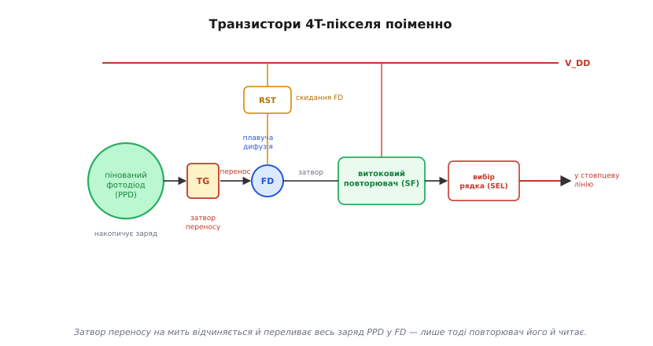
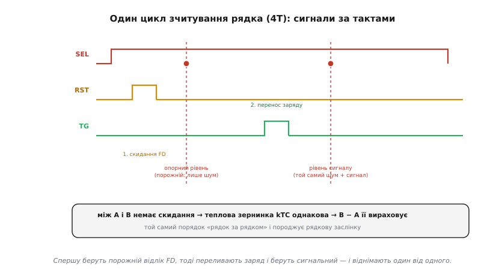
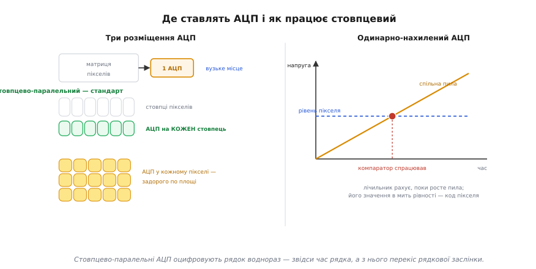
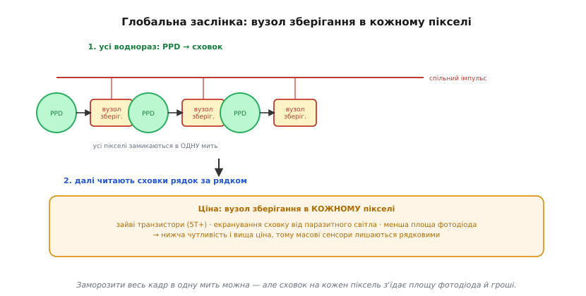

# CMOS-матриця: піксель, зчитування й шум зблизька

<preknowlist>
- [Сенсор зображення](topic:hw-sensing/image-sensor) — піксель як «відерце», що накопичує заряд, пропорційний світлу.
- [Транзистор](topic:hw-components/transistor-idea) — керований ключ і підсилювач: напруга на затворі керує струмом.
- [АЦП](topic:hw-analog/adc) — як напругу перетворюють на число.
</preknowlist>

Майже кожна риса CMOS-матриці виростає з одного незручного факту: заряд, що фотодіод збирає з пікселя, мізерний — лічені тисячі електронів, — і провести такий кволий сигнал крізь кристал, не втопивши його в шумі, годі. Звідси й підсилювач у кожному пікселі, і зчитування матриці «як у пам'яті», і хитрий четвертий транзистор, яким прибирають шум скидання. Розгляньмо піксель і цикл його зчитування зблизька — до окремих транзисторів і тактів, — щоб за кожним рядком даташита сенсора проступала фізика, яка його породжує.

## Чому активний піксель: арифметика слабкого заряду

Почнемо з числа, що пояснює всю архітектуру. Піксель сучасної камери збирає до насичення десь від кількох тисяч до кількох десятків тисяч електронів. Один електрон несе заряд 1.6·10⁻¹⁹ кулона; навіть 10 000 електронів — це заряд близько 1.6·10⁻¹⁵ кулона, тобто фемтокулони. Перетворити такий заряд на напругу можна тільки на дуже малій ємності (бо напруга U = Q/C), а мала ємність украй чутлива до будь-якого паразитного зв'язку.

Тепер уяви, що цей заряд треба провести довгою металевою лінією через половину кристала до одного підсилювача на краю — як робить [CCD](topic:hw-sensing/image-sensor). Лінія має власну ємність у пікофарадах — у тисячі разів більшу за ємність вузла пікселя. Заряд «розмажеться» по ній, напруга впаде до нечитабельних мікровольтів, а дорогою на лінію наведуться завади від сусідніх цифрових кіл. Слабкий сигнал програє шуму ще до того, як дійде до підсилювача.

Звідси й рішення CMOS: **перетворити заряд на напругу прямо в пікселі**, на його власній крихітній ємності, де співвідношення Q/C дає пристойні мілівольти, а тоді гнати назовні вже **напругу** через буфер, якому ємність лінії не страшна. Підсилювач у кожному пікселі — не розкіш, а єдиний спосіб не втратити фемтокулоновий сигнал. Те, що такий підсилювач узагалі вдається втиснути в піксель, — заслуга самої технології CMOS: ті самі транзистори, що й у логіці, на тій самій фабриці.

> 🔧 **Навіщо це.** Ця арифметика пояснює, чому крихітний сенсор телефона принципово шумніший за великий: дрібний піксель має меншу повну місткість (менше електронів до насичення), тож той самий шум зчитування з'їдає більшу частку сигналу. Жоден алгоритм не поверне інформацію, якої не зібрав фотодіод. Тому в специфікації варто дивитися не на мегапікселі, а на **розмір пікселя** (у мікрометрах) і **повну місткість** — вони задають стелю якості.

## Чотири транзистори 4T-пікселя поіменно

Розберімо, що кожен вузол 4T-пікселя фізично робить за цикл. Дійові вузли: **пінований фотодіод** (PPD), **затвор переносу** (TG), **плавуча дифузія** (FD) і три транзистори навколо неї — **скидання** (RST), **витоковий повторювач** (SF) і **вибір рядка** (SEL).

**Пінований фотодіод (PPD)** — це місце накопичення. Слово «пінований» (англ. *pinned* — «прип'ятий») означає, що над звичайним n-шаром фотодіода зроблено тонкий сильнолегований p⁺-шар, який «прип'ято» до потенціалу підкладки. Цей шар закриває поверхню кремнію — найбрудніше місце, де на межі поділу кремній-оксид сидять дефекти, що самі собою (без світла) народжують електрони. Сховавши накопичення під цей шар, PPD різко зменшує **темновий струм** і дає характерний для нього малий шум. Друга, тонша властивість: рівні легування підібрано так, що PPD має **скінченний потенціал повного спорожнення** — коли відчиняється TG, фотодіод віддає геть **усі** електрони, не лишаючи хвоста.

**Затвор переносу (TG)** — ключ між PPD і FD. Поки він зачинений, заряд накопичується у фотодіоді ізольовано. Коротким імпульсом на TG будують канал, по якому весь заряд PPD стікає у FD. Саме ця ізоляція накопичення від зчитування — те, чого не було в 3T-пікселі, — і робить можливою CDS.

**Плавуча дифузія (FD)** — крихітний n⁺-острівець, не з'єднаний ні з чим постійно (тому «плавучий»): його потенціал вільно йде вгору-вниз із зарядом на ньому. FD має дуже малу ємність C_FD, тож перенесений заряд дає на ній помітну зміну напруги ΔU = Q/C_FD. Це **вузол перетворення заряду на напругу**; його чутливість (мікровольти на електрон) — один із ключових параметрів пікселя, **коефіцієнт перетворення** (англ. *conversion gain*).

**Скидання (RST)** на мить з'єднує FD з живленням V_DD, зливаючи з неї весь заряд і встановлюючи відомий «порожній» рівень. Саме цей акт лишає на FD випадкову теплову зернинку — **kTC-шум** (про нього нижче).

**Витоковий повторювач (SF)** — підсилювач пікселя. Його затвор під'єднано до FD, тож напруга затвора дорівнює напрузі FD; сам транзистор у схемі спільного стоку віддає на витік ту саму напругу (з невеликим сталим зсувом), здатну прогнати струм. Він **не забирає** заряд із FD — лише «зчитує» її потенціал. Підсилення такого каскаду трохи менше за одиницю, його роль — буфер потужності, не множник.

**Вибір рядка (SEL)** — ключ, що під'єднує витік SF до стовпцевої лінії. Увімкнено лише в активного рядка; решта пікселів стовпця від лінії від'єднані.


*Транзистори 4T-пікселя поіменно. Пінований фотодіод (PPD) накопичує заряд за зачиненим затвором переносу (TG). Скидання (RST) очищає плавучу дифузію (FD) до V_DD; витоковий повторювач (SF) перетворює потенціал FD на напругу, не чіпаючи заряду; вибір рядка (SEL) під'єднує його до стовпцевої лінії. Затвор переносу на мить відчиняється й переливає весь заряд PPD у FD — лише тоді його й читають.*

> 🔧 **Навіщо це.** Коефіцієнт перетворення (мкВ/e⁻) — це чутливість FD; що менша її ємність, то більший сигнал з електрона й тим легше «перекричати» шум зчитування. Сучасні сенсори інколи мають **подвійний коефіцієнт перетворення** (англ. *dual conversion gain*): перемикають ємність FD — велику для яскравих сцен (більша місткість, менший ризик насичення FD), малу для темних (більший сигнал з електрона, менший шум). У даташиті це виглядає як два режими HDR/нічної зйомки — тепер видно, що під ними фізично.

## Один цикл зчитування рядка: сигнали за тактами

Тепер найважливіше для розуміння — **послідовність**, у якій ці транзистори спрацьовують за час, поки зчитується один рядок. Саме ця послідовність реалізує CDS і пояснює, звідки береться рядкова заслінка.

Розгляньмо 4T-піксель у режимі рядкової заслінки. Цикл одного рядка:

1. **Вибір рядка.** Логіка вмикає SEL для всього рядка — повторювачі під'єднано до стовпцевих ліній.
2. **Скидання FD.** Імпульс RST зливає FD до V_DD. На FD лишається порожній рівень із тепловою зернинкою kTC-шуму.
3. **Вибірка опорного рівня.** Стовпцеві схеми **запам'ятовують** напругу FD просто зараз — це «порожній» відлік (англ. *reset level*). У ньому є kTC-шум і сталий зсув SF, але сигналу нема.
4. **Перенос заряду.** Імпульс TG відчиняє затвор переносу; весь заряд PPD стікає у FD, її потенціал зсувається на ΔU = Q/C_FD.
5. **Вибірка рівня сигналу.** Стовпцеві схеми запам'ятовують нову напругу FD — «повний» відлік (англ. *signal level*): той самий kTC-шум і зсув SF **плюс** сигнал.
6. **Різниця.** Схема (чи цифра після АЦП) бере «повний − порожній». kTC-шум і зсув SF, присутні в обох відліках **однаковими**, скорочуються; лишається чистий сигнал ΔU.
7. **Вимкнення рядка**, перехід до наступного.


*Сигнали за один цикл зчитування рядка (4T, рядкова заслінка). Після вибору рядка скидають FD і одразу беруть опорний відлік (порожній рівень). Тоді імпульс переносу переливає заряд у FD і беруть сигнальний відлік. Між двома вибірками скидання немає — тому теплова зернинка kTC однакова в обох, і різниця її вираховує. Цей самий порядок «рядок за рядком» і породжує рядкову заслінку.*

Критично, що між кроками 3 і 5 **немає скидання**. Якби між опорним і сигнальним відліком FD скинули ще раз, теплова зернинка змінилася б, і віднімання нічого б не дало. Уся сила CDS — у тому, що обидва відліки несуть **ту саму** реалізацію випадкового шуму скидання.

А тепер видно й корінь рядкової заслінки: цей семикроковий цикл проганяється для **кожного рядка по черзі**. Поки логіка дійде до нижніх рядків, від миті, коли почали верхні, спливли мілісекунди — і нижні пікселі накопичували світло у **свій**, пізніший інтервал часу. Звідси зсув у часі між верхом і низом кадру, з усіма наслідками [рядкової заслінки](topic:hw-sensing/rolling-shutter).

### Чому в 3T-пікселі CDS неповна

Корисно зрозуміти, чому те саме не виходить у простішому 3T-пікселі. Там немає TG і FD: фотодіод сам є вузлом зчитування. Щоб почати новий кадр, фотодіод **скидають** — і саме цей скид лишає kTC-зернинку **на самому накопичувальному вузлі**. Далі фотодіод цілий кадр збирає світло, а наприкінці його читають. Проблема: щоб дізнатися «порожній» рівень із тією **самою** зернинкою, треба було б прочитати фотодіод **до** накопичення, тобто на початку кадру, запам'ятати — і тримати це число цілий кадр для кожного пікселя. Це непрактично. Тому 3T зазвичай робить лише «несправжню» CDS (англ. *double sampling*, без кореляції): читає рівень після скидання й рівень сигналу, але **з різними** реалізаціями шуму (бо між ними було скидання), тож kTC-шум не скорочується, а навіть трохи росте. 4T розриває це коло, відокремивши вузол скидання (FD) від накопичувача (PPD): FD можна скинути, виміряти порожньою, **а тоді** долити заряд — без повторного скидання між відліками.

## Стовпцевий тракт: вибірка-зберігання й паралельні АЦП

Куди потрапляють обидва відліки рядка? У **стовпцевий тракт** — смугу однакових схем на краю матриці, по одній на стовпець, з кроком (англ. *pitch*) точно під крок пікселів.

Найпростіший стовпцевий тракт містить вузли **вибірки-зберігання** (англ. *sample-and-hold*) — два конденсатори на стовпець: на один кладуть опорний рівень (крок 3), на другий — сигнальний (крок 5). Різницю беруть або тут (диференційним підсилювачем), або вже після оцифрування. Далі стоїть **аналого-цифровий перетворювач**.

Архітектур розміщення АЦП кілька, і вибір між ними — компроміс швидкості, площі й шуму:

- **Один АЦП на весь чіп** (рано в історії CMOS): уся матриця тече крізь єдиний швидкий перетворювач. Просто, але повільно — цей АЦП мусить устигати за всі пікселі, тож стає вузьким місцем.
- **Стовпцево-паралельний АЦП** (нині стандарт): **окремий АЦП на кожен стовпець**. Кожен повільний і тихий (має на відлік цілу рядкову пору), але працюють вони тисячами воднораз — за один рядковий цикл оцифровується весь рядок. Це найкращий баланс швидкості й шуму, тому так роблять майже всі.
- **АЦП у кожному пікселі** (англ. *digital pixel sensor*): межа паралелізму; коштує надто багато площі, тож трапляється лише в спеціальних сенсорах.

Найпоширеніший стовпцевий АЦП — **одинарно-нахилений** (англ. *single-slope*): на всі стовпці подають одну спільну пилоподібну напругу, що лінійно росте, і одночасно запускають лічильник. Компаратор кожного стовпця спрацьовує, коли пила зрівняється з напругою його пікселя; значення лічильника в цю мить і є код пікселя. Один генератор пили й лічильник — на весь рядок, а компаратор — крихітний, тож такий АЦП дешевий по площі й чудово вкладається в крок стовпця. Платить за це часом: щоб отримати N біт, пила мусить пройти 2^N кроків лічильника. Тому швидші сенсори переходять на складніші схеми — наприклад, **АЦП послідовного наближення** на стовпець або багатоступеневі.


*Де ставлять АЦП. Один на чіп — просто, та він вузьке місце. Стовпцево-паралельний — по одному на стовпець, тисячі повільних тихих перетворювачів воднораз: нинішній стандарт. У кожному пікселі — межа паралелізму, але задорого по площі. Праворуч — типовий стовпцевий одинарно-нахилений АЦП: спільна пила росте, лічильник рахує, компаратор стовпця ловить мить рівності — і її код стає значенням пікселя.*

> 🔧 **Навіщо це.** Звідси прямо випливає **час зчитування рядка** (англ. *line time*), а з нього — час кадру й перекіс рядкової заслінки. Одинарно-нахилений 12-бітний АЦП потребує до 4096 тактів на рядок — це довго, звідси помітний rolling shutter у дешевих сенсорів. Швидкий сенсор для машинного бачення має або хитріший стовпцевий АЦП, або кілька АЦП-банків зверху й знизу матриці. Шукаючи в даташиті `line time` чи `readout time`, тепер знаєш, що за ним стоїть саме архітектура стовпцевого АЦП.

## Глобальна заслінка: storage node і його ціна

Рядкова заслінка — наслідок того, що рядки накопичують і зчитуються в різні миті. Щоб усі пікселі належали **одній** миті, потрібна глобальна заслінка — і її ціна видна саме на рівні пікселя.

Ідея: усі пікселі **закінчують накопичення воднораз** — спільним глобальним імпульсом переносу заряд кожного PPD переливається в окремий **вузол зберігання** (англ. *storage node*). Далі матрицю спокійно зчитують рядок за рядком (бо стовпцеві АЦП однаково беруть лише рядок за раз), але читають уже **збережений** заряд, заморожений в одну мить, а не той, що далі змінюється. Так увесь кадр належить одному моменту.

Розплата — той самий вузол зберігання в **кожному** пікселі. Це додаткові транзистори (глобальний піксель типово 5T і більше) і, головне, **площа** під сам сховок — площа, яку в тісному пікселі забирають у фотодіода. Наслідки:

- **Менший коефіцієнт заповнення:** за того самого розміру пікселя глобальний ловить менше світла (фотодіод дрібніший). Частково лікують **мікролінзами** (фокусують світло на фотодіод) і **зворотним освітленням** (англ. *back-side illumination*, BSI — світло заходить із тилу, оминаючи шар металізації), але площа все одно поділена.
- **Паразитне засвічення сховку** (англ. *parasitic light sensitivity*): вузол зберігання теж трохи чутливий до світла, і поки заряд чекає черги, на нього може «натекти» паразитний сигнал. Сховок доводиться екранувати, що знов з'їдає площу.
- **Складніший піксель, дорожчий кристал:** більше транзисторів і вимог до екранування → вищий брак і ціна.


*Глобальна заслінка зблизька. Спільний імпульс переносить заряд кожного фотодіода у власний вузол зберігання — усі пікселі замикаються в одну мить. Далі заморожений заряд зчитують рядок за рядком звичайним трактом. Ціна — вузол зберігання в кожному пікселі: зайві транзистори, екранування від паразитного світла й менша площа фотодіода, тобто нижча чутливість і вища ціна.*

Тому масові сенсори лишаються рядковими, а глобальну заслінку ставлять там, де геометрія руху критична: [машинне бачення](topic:sf-visual/image-as-data) на конвеєрі, технічна, спортивна й наукова зйомка. Самі артефакти рядкової заслінки й цей вибір докладно — у [темі про рядкову заслінку](topic:hw-sensing/rolling-shutter).

## Звідки береться шум і що CDS не бере

CDS — потужний, але не всемогутній. Корисно розкласти шум CMOS-пікселя на складники й позначити, який з них віднімається, а який лишається.

**Шум скидання (kTC).** Коли RST скидає FD, тепловий рух заряду в каналі транзистора лишає на ємності FD випадкову зернинку із середньоквадратичним значенням √(kT·C_FD)/q електронів (звідси «kTC»). Для типової FD це десятки електронів — найбільший внесок, якби його не прибирали. **CDS його вираховує повністю** (бо однаковий в обох відліках). Це головна причина існування CDS.

**Сталий зсув повторювача.** Кожен SF трохи інший: пороги транзисторів розкидані по матриці. Без корекції це дало б фіксований візерунок (англ. *fixed-pattern noise*, FPN) — видиму «сітку» різниць між пікселями. **CDS вираховує і його**, бо зсув присутній в обох відліках стовпця однаково.

**Низькочастотний 1/f-шум.** Повільний дрейф у транзисторі SF. Оскільки два відліки CDS беруть **близько в часі**, повільний дрейф майже не встигає змінитися між ними — тож **CDS значно його послаблює** (тим краще, чим ближче відліки).

**Дробовий (фотонний) шум.** Світло прилітає випадковими порціями: число спійманих фотонів флуктуює як √N. Це не шум електроніки, а властивість самого світла — **CDS тут безсилий**. Єдиний лік — більше фотонів. Саме він задає стелю якості на яскравих сценах і докладно розібраний у [динамічному діапазоні й шумі](topic:hw-sensing/dynamic-range-noise).

**Темновий шум.** Паразитні електрони від нагріву (тим більше, чим гарячіше й довша витримка). PPD його сильно зменшує конструктивно, але **CDS його не бере** (це реальний заряд, не шум скидання). Лік — охолодження й коротші витримки.

**Шум квантування АЦП.** Округлення до найближчого коду, ±½ молодшого розряду. Зменшується більшою розрядністю — до межі, де решта шуму однаково більша.

Щоб відчути, чому kTC-шум вартий усієї мороки з 4T-пікселем, порахуймо його для типового вузла зчитування.

**Умова.** Ємність плавучої дифузії C_FD = 2 фФ (2·10⁻¹⁵ Ф), температура кімнатна T = 300 К. Скільки електронів випадкової зернинки лишає на FD одне скидання?

```c
// шум скидання (kTC): σ_q = sqrt(k·T·C), у електронах ділимо на заряд електрона
float k    = 1.38e-23f;   // стала Больцмана, Дж/К
float T    = 300.0f;      // К
float C_fd = 2.0e-15f;    // ємність FD, Ф
float q    = 1.6e-19f;    // заряд електрона, Кл

float sigma_q = sqrtf(k * T * C_fd);   // sqrt(1.38e-23 · 300 · 2e-15)
//            = sqrt(8.28e-36)  ≈  2.88e-18 Кл

float sigma_e = sigma_q / q;            // 2.88e-18 / 1.6e-19
//            ≈ 18 електронів
```

Вісімнадцять електронів випадкового шуму на **кожному** скиданні — це більше, ніж увесь корисний сигнал у глибокій тіні. Без CDS вони задавали б підлогу шуму, і темні деталі тонули б у ній. CDS вираховує цю зернинку дочиста, опускаючи шум зчитування до одиниць електронів — звідси й уся цінність 4T-пікселя.

| Джерело | Природа | CDS бере? | Чим лікувати |
|---|---|---|---|
| Скидання (kTC) | теплова зернинка від RST на FD | так, повністю | сам CDS |
| Зсув SF (FPN) | розкид порогів транзисторів | так | сам CDS |
| 1/f-дрейф | повільний дрейф SF | значно послаблює | близькі в часі відліки |
| Дробовий (фотонний) | випадковість самого світла | ні | більше фотонів |
| Темновий | нагрів, довга витримка | ні | охолодження, коротша витримка |
| Квантування | округлення АЦП | ні | більша розрядність |

> 🔧 **Навіщо це.** Параметр **шум зчитування** (англ. *read noise*) у даташиті — це решта **після** CDS: те, що вона не змогла прибрати (залишок 1/f, шум стовпцевого тракту й АЦП). Одиниці електронів означають дуже добру CDS і тихий тракт. Але навіть нульовий шум зчитування не врятує темний кадр: на малому світлі панує дробовий шум, проти якого допомагає лише більше фотонів. Тому «чутливість» сенсора — це передусім площа пікселя й оптика, а вже потім схемотехніка.

## Одна причина, з якої все випливає

Уся ця будова — не набір окремих трюків, а один ланцюг наслідків, натягнутий від єдиного факту: корисний сигнал пікселя вимірюється фемтокулонами, і їх не можна гнати крізь кристал, не втопивши в шумі. Локальний підсилювач, зчитування «як у пам'яті», розв'язка 4T із корельованою вибіркою, рядкова заслінка — кожна ланка тримається за попередню, а зрештою за цей кволий заряд.

Даташит сенсора після цього читається як зв'язна історія, а не частокіл абревіатур. Розмір пікселя й повна місткість (у електронах) задають стелю якості — скільки світла піксель узагалі здатен зібрати. Шум зчитування в одиницях електронів видає, наскільки чисто відпрацювала CDS. Час рядка (line time) віщує перекіс на швидкому русі, а два коефіцієнти перетворення ховаються за «нічним» чи HDR-режимом. За кожним із цих чисел стоїть та сама фізика слабкого заряду.

---
