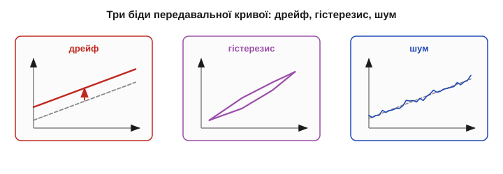
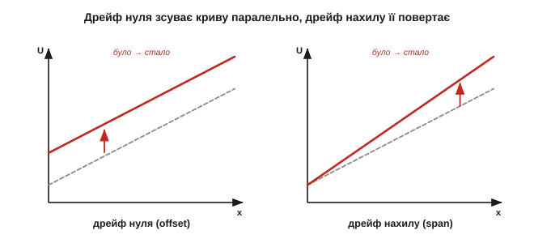
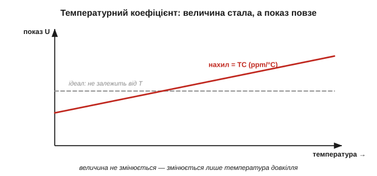
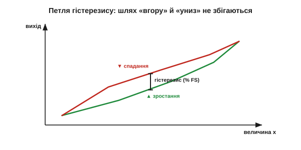
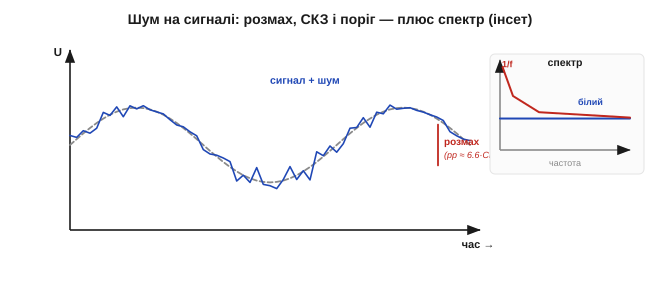
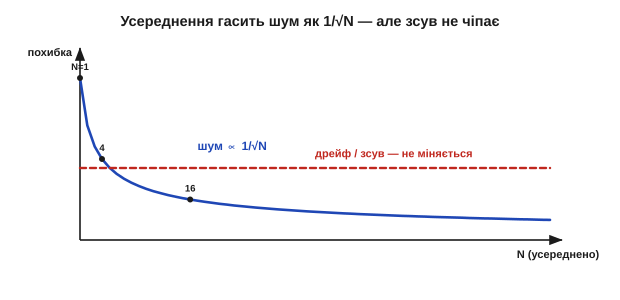

# Дрейф, гістерезис, шум

Зручно уявляти [передавальну криву давача](topic:hw-sensing/sensor-characteristics) як раз і назавжди застиглу лінію. Це зручна брехня. Насправді ту лінію **хитає** аж три різні біди: вона повільно **сповзає** (дрейф), **роздвоюється** залежно від того, звідки ви прийшли (гістерезис), і дрібно **тремтить** від випадкового шуму. Через них той самий давач на ту саму величину дає щоразу трохи інше число. У цьому й чесна суть [самого поняття давача](topic:hw-sensing/what-is-a-sensor): давач дає не істину, а підказку — а дрейф, гістерезис і шум якраз і є те, що робить підказку розмитою. Добра новина: у кожної з трьох бід — свій механізм і, головне, **свій окремий лік**. Сплутати їх — означає лікувати не те.

### Ідеальна крива не стоїть на місці

Ідеальна характеристика — U = U₀ + S·x, чиста пряма. Реальність ламає її трьома різними способами, і їх корисно бачити поряд.


*Як реальність псує характеристику. **Дрейф** — крива повільно сповзає вбік (зсув нуля чи нахилу). **Гістерезис** — «вгору» й «униз» ідуть різними шляхами, утворюючи петлю. **Шум** — крива розмита в тремтливу смугу. Три різні дефекти — три різні ліки.*

Ключ до всього — **класифікувати** біду, перш ніж із нею боротися. Дрейф і гістерезис зміщують криву **закономірно** (повторювано) — це різновид систематичної похибки, тобто проблема **[точності](topic:hw-sensing/sensor-characteristics)**. Шум зміщує її **випадково** — це проблема **прецизійності**. А оскільки точність і прецизійність лікують по-різному (калібрування проти усереднення), то й тут перший крок — правильно назвати дефект.

Корисно розкласти ці біди й **за часом**. Шум — найшвидший: міняється від виміру до виміру, частки секунди. Дрейф — повільний: хвилини, години, а старіння — місяці й роки. Гістерезис стоїть осторонь цієї осі часу зовсім: він залежить не від того, **коли** ви міряєте, а від того, **звідки прийшли**. Ця проста картинка вже дає діагностику: якщо безлад зникає, коли усереднити кілька швидких вимірів, — то був шум; якщо лишається, але повільно повзе, — дрейф; якщо ж залежить від напрямку руху величини — гістерезис. Назва дефекту майже завжди ховається в його **часовому масштабі**.

### Дрейф: повільне сповзання нуля й нахилу

**Дрейф** (*drift*) — повільна зміна характеристики з часом, температурою, старінням чи механічним напруженням. «Повільна» тут ключове слово: дрейф міняє показ за хвилини, години, місяці — на відміну від швидкого тремтіння шуму.

Дрейфувати можуть обидва числа кривої. **Дрейф нуля** (*offset / zero drift*) — повзе U₀, уся крива зміщується паралельно вгору чи вниз. **Дрейф нахилу** (*span / sensitivity drift*) — повзе S, крива повертається. Перший додає сталу похибку до всіх показів, другий псує сильніше на краю діапазону.


*Два різновиди дрейфу. Дрейф нуля (ліворуч) піднімає всю криву — однаковий зсув на всій шкалі. Дрейф нахилу (праворуч) повертає її навколо нуля — похибка росте до краю діапазону. Обидва повільні й повторювані, тож їх можна виміряти й виправити.*

Найбільший винуватець дрейфу — **температура**. Майже все на світі залежить від неї, зокрема й власний нуль та підсилення давача й тракту. Цю паразитну чутливість до температури описують **температурним коефіцієнтом** (*temperature coefficient*, TC) — зазвичай у частинах на мільйон на градус (ppm/°C). Це немовби «другий, небажаний давач температури», вшитий у ваш давач величини.


*Температурний коефіцієнт. Величину тримають **сталою**, а змінюють лише температуру довкілля — і показ усе одно повзе. Нахил цієї небажаної залежності й є TC (ppm/°C): чистий паразит, який треба або компенсувати, або калібрувати.*

**Приклад (скільки коштує температурний дрейф).** Опорна напруга 2.5 В із TC = 50 ppm/°C живить АЦП. Кімната прогрілася на 20 °C — наскільки «попливе» опора?

```
дрейф = 2.5 В · 50×10⁻⁶ /°C · 20 °C
дрейф = 2.5 · 50 · 20 × 10⁻⁶ В = 2500 × 10⁻⁶ В = 2.5 мВ
```

2.5 мВ — це близько чотирьох кроків 12-бітного АЦП (LSB = 2.5 В / 4096 ≈ 0.61 мВ за такої опори; крок [роздільності АЦП](topic:hw-analog/adc-resolution)). Тобто від самого лише прогріву кімнати останні біти стають брехнею — і це ще «хороша» опора; дешева має TC у рази гірший. Окремий повільний дрейф дає й **старіння**: за місяці-роки матеріали необоротно змінюються, тож точні прилади періодично відправляють на **повірку**. До речі, дуже повільний фліккер-шум на наддовгих часах від дрейфу не відрізнити — це той самий повзучий безлад.

Окремо підступний — **дрейф розігріву** (*warm-up drift*). Найдужче давач пливе в перші хвилини після ввімкнення, поки його власне тепло (і тепло сусідніх мікросхем) не вийде на усталений рівень. Тому точні прилади просять «прогрітися» перед роботою, а в проєкті закладають паузу або перше калібрування вже теплим. Розрізняють і **коротко-** та **довготривалу** стабільність: перша про хвилини-години (розігрів, температура довкілля), друга про місяці-роки (старіння). Виробники навіть навмисно «вистарюють» (*burn-in*) давачі заздалегідь, щоб найшвидша, найгірша частина дрейфу минула ще до того, як деталь потрапить до вас.

> 🔧 **Навіщо це.** Дрейф — це чому давач треба **час від часу перекалібровувати**, а не «налаштував і забув». Три типові ліки: виміряти температуру окремим давачем і **компенсувати** (відняти відомий TC); побудувати тракт **[раціометрично](topic:hw-sensing/what-is-a-sensor)**, щоб спільні дрейфи скоротились; періодично **переобнулювати** по відомій точці. Дрейф визначає, як часто це робити: швидкий — щохвилини, повільне старіння — раз на рік. А найдешевші ліки — просто **переобнулити давач перед кожним сеансом** по відомій точці (скажімо, по нулю ваги без вантажу): дрейф нахилу це не прибере, та найчастішу його частину — дрейф нуля — зніме майже задарма.

### Гістерезис: показ залежить від того, звідки прийшли

**Гістерезис** (гр. *hysterēsis* — відставання, запізнення) — підступніша річ: показ для тієї самої величини **різний** залежно від того, ви до неї зростали чи спадали. Крива «вгору» і крива «вниз» не збігаються, а утворюють **петлю**.


*Гістерезис. Збільшуючи величину, йдемо нижньою гілкою; зменшуючи — верхньою. Для того самого x вихід різний — на величину гістерезису (найбільший зазор між гілками, у % FS). Це не шум: повтори дають ту саму петлю.*

Причини бувають механічні (тертя, люфт, пружна «пам'ять» матеріалу, що не одразу повертає форму), магнітні ([петля B-H феромагнетика](topic:ph-condensed/saturation-hysteresis)), теплові (запізнення прогріву). Спільне в них — **пам'ять про попередній стан**: давач ніби трохи «застрягає» там, де був.

Гістерезис легко сплутати з [мертвою зоною](topic:hw-sensing/sensor-characteristics), та це різні речі: мертва зона — це **нечутливість** біля нуля, а гістерезис — **різні гілки** на всьому ходу. Класичний приклад — давач тиску з пружною мембраною: метал не повертає форму миттєво й точно, тож після високого тиску «нуль» виходить трохи завищений, а після низького — занижений. Те саме з феромагнітним осердям, що «пам'ятає» попереднє намагнічення (через що петлю B-H і звуть гістерезисною). Скрізь винна одна й та сама фізика — **недосконала оборотність** матеріалу, який неохоче вертається точно туди, звідки його зрушили.

Найважливіша властивість гістерезису — він **повторюваний, але залежний від шляху**. Це означає, що усередненням його **не прибрати**: скільки не міряй, петля та сама. Лікують інакше: або завжди підходити до точки **з одного боку** (тоді працюєте лише на одній гілці й похибка стала), або прийняти ширину петлі як межу й закласти її в бюджет, або змоделювати петлю програмно.

> 🔧 **Навіщо це.** Якщо давач прецизійний (повтори тісні), але показ помітно різниться, коли ви наближаєтесь до величини зверху чи знизу, — це майже напевно гістерезис, а не шум. Простий рятунок у керуванні: завжди підводьте механізм до уставки **з одного напрямку** (так роблять у точних столиках і фокусуваннях) — і гістерезис перестає вам брехати, бо ви ходите однією гілкою петлі.

### Шум: випадкове тремтіння поверх сигналу

**Шум** (*noise*) — випадкове тремтіння, що додається до кожного показу. На відміну від дрейфу й гістерезису, він **непередбачуваний** у дрібницях: щомиті інший.

Джерел кілька, і деякі фундаментальні, тобто непереборні в принципі. **Тепловий** шум (*Johnson-Nyquist*) є в **будь-якому** опорі: [хаотичний рух електронів від тепла](topic:ph-condensed/thermal-noise) сам собою створює крихітну тремтливу напругу — що тепліше й що більший опір, то дужче. **Дробовий** (*shot*) шум — від дискретності заряду, що порціями [долає перехід](topic:ph-condensed/pn-junction). **Фліккер**, або **1/f** — росте на низьких частотах і на дуже повільних часах зливається з дрейфом. **Шум квантування** — від [кроку АЦП](topic:hw-analog/sampling-quantization). І нарешті — **зовнішні наводки**: гул мережі 50 Гц, перешкоди від цифри й радіо (з ними воюють [екрануванням і заземленням](topic:hw-sensing/sensor-input-matching)).

Яке з джерел головне — залежить від ситуації, і це підказує, куди тиснути. У **високоомному** давачі (ємнісний, скляний електрод) панує тепловий шум — рятує менший опір чи вужча смуга. У **повільних**, майже сталих вимірах (температура, тиск) наперед виходять 1/f і дрейф — рятує модуляція сигналу подалі від нуля частот (хитрість, на якій стоять точні підсилювачі). А в **брудному** електромагнітному оточенні всю фізику перекриває зовнішня наводка — і тоді жодний тихий давач не зарадить без екрана й чесної землі. Тому, перш ніж міняти давач на дорожчий «малошумний», варто спитати: який шум тут насправді головний — бо проти чужого джерела дорогий давач безсилий.


*Шум кількісно. Чистий сигнал (штрих) тоне в тремтінні; його міряють середньоквадратичним значенням (СКЗ, RMS) або розмахом (peak-to-peak ≈ 6.6×СКЗ для гаусового). Відношення сигнал/шум (SNR) каже, наскільки сигнал «стирчить» над шумовим порогом. Урізка — спектр: рівний «білий» плюс підйом 1/f на низьких частотах.*

Шум описують середньоквадратичним значенням (СКЗ, *RMS*), розмахом (*peak-to-peak*), спектральною щільністю, а порівнюють із сигналом через **відношення сигнал/шум** (*SNR*). Саме шум ставить **[поріг роздільності](topic:hw-sensing/sensor-characteristics)**: дрібніші за нього зміни просто тонуть.

Звідси й поняття **шумового порога** (*noise floor*): рівень, нижче якого корисного сигналу просто не видно крізь власне тремтіння тракту. Зміряти величину, тихішу за поріг, неможливо — її затоплює шум; підняти сам сигнал ([більша чутливість](topic:hw-sensing/sensor-characteristics)) або опустити поріг (тихіший тракт) — два єдині виходи. І ще одне ключове правило: тракт впускає шуму рівно стільки, скільки **смуги частот** ви відкрили. Що ширша смуга тракту, то більше білого шуму в нього влізе; звузити смугу до справді потрібної — уже наполовину перемогти шум. На цьому й тримається фільтрація.

За спектром шум буває **білий** (рівний на всіх частотах, як тепловий) і **кольоровий** (1/f, що дужчає на низьких частотах) — і ця різниця підказує, чим його бити. Хоч окремий відлік шуму непередбачуваний, сукупно шум напрочуд **закономірний** статистично: відхилення лягають дзвоном Гауса навколо істинного значення, а ширину дзвона описують одним числом — стандартним відхиленням σ (воно ж СКЗ). Саме ця статистична правильність і робить можливим усереднення: непередбачуване поодинці стає передбачуваним гуртом. Тому шум — не просто «завада», а величина, яку міряють, закладають у [бюджет похибки](topic:hw-sensing/sensor-characteristics) і свідомо тиснуть, а не безпорадно терплять.

### Боротьба: усереднення лікує шум, але не зсув

Головна зброя проти **випадкового** шуму напрочуд проста — **[усереднення](topic:com-signal/moving-average)**. Якщо взяти N незалежних вимірів і усереднити, випадкові відхилення частково гасять одне одного, і шум спадає як **1/√N**:

```
шум(після) ≈ шум(до) / √N

N = 4   → шум удвічі менший
N = 16  → шум учетверо менший
N = 100 → шум у 10 разів менший
```


*Усереднення проти двох бід. Випадковий шум спадає як 1/√N (крива вниз): 16 вимірів — учетверо тихіше. Але систематичний зсув (дрейф, гістерезис) — рівна лінія: усереднення його **не зменшує нітрохи**. Можна згладити показ до дзеркала й лишитися так само зміщеним.*

І ось **найважливіше застереження**: усереднення (і взагалі фільтрація) лікує **тільки випадкове**. Дрейф і гістерезис — систематичні, тож скільки не усереднюй, вони лишаються на місці. Можна відполірувати шумний показ до дзеркальної гладі — і все одно стабільно брехати на величину дрейфу. Тут діє те саме розрізнення, що й для [точності проти прецизійності](topic:hw-sensing/sensor-characteristics): усереднення піднімає **прецизійність**, але до **точності** не додає ані крихти.

**Приклад (скільки вимірів варті чотирьох біт).** Хай шум дорівнює 8 крокам АЦП — це «з'їдає» 3 молодші біти (2³ = 8). Скільки усереднити, щоб повернути їх?

```
треба зменшити шум у 8 разів  →  √N = 8  →  N = 64
```

64 виміри усереднити — і випадковий шум упаде у 8 разів, повернувши близько трьох біт ефективної роздільності. Плата — час: 64 виміри замість одного, тобто в шістдесят чотири рази повільніше. Це компроміс «точність проти швидкодії», і саме тому докладні [способи цифрової фільтрації](topic:com-signal/signal-noise), що дають більше за ту саму ціну, варті окремого вивчення.

У формули 1/√N є дрібний шрифт: виміри мають бути **незалежними**. Якщо шум корельований (той самий повільний 1/f тягне сусідні відліки в один бік) — усереднення допомагає слабше, ніж обіцяє корінь. А якщо за час набору N вимірів сама величина чи дрейф **встигли змінитися**, то ви усереднюєте вже різні речі й лише розмиваєте подію, занижуючи її піки (тут дається взнаки [час відгуку давача](topic:hw-sensing/sensor-characteristics)). Тому вікно усереднення підбирають вдумливо: достатньо широке, щоб придушити шум, але вужче за час, на якому встигають змінитися і сигнал, і дрейф. Ця делікатна рівновага — серце цифрової фільтрації.

> 🔧 **Навіщо це.** Перед тим як «боротися з похибкою», назвіть її. Тремтить щоразу по-різному — **шум**: усереднюй або фільтруй. Повзе повільно в один бік — **дрейф**: калібруй чи компенсуй температуру. Різниться залежно від напрямку підходу — **гістерезис**: ходи з одного боку. Усереднити зміщений давач — означає отримати дуже **точно виміряну неправду**; це найчастіша й найприкріша помилка новачка в сенсориці.

### Три біди, три ліки

Словник нестабільності прямо доповнює [характеристики давача](topic:hw-sensing/sensor-characteristics).

| Біда | Природа | Головна причина | Як упізнати | Чим бити |
|---|---|---|---|---|
| **Дрейф** | повільний зсув | температура, старіння | показ повзе за сталої величини | калібрування, темп-компенсація, раціометрія |
| **Гістерезис** | залежність від шляху | тертя, магнетизм, пружність | різниця «вгору» vs «вниз» | підхід з одного боку, модель петлі |
| **Шум** | швидке випадкове | тепловий, дробовий, наводки | тремтить щоразу інакше | усереднення, цифрова фільтрація |

Усе разом це означає, що «сирий» показ давача — лише **початок** роботи, а не кінець. Дрейф і гістерезис кажуть, що крива не там, де ми думали; шум — що навколо неї туман. Разом із [характеристиками давача](topic:hw-sensing/sensor-characteristics) ці три біди й складають повний **бюджет невизначеності**: систематичну частину (нелінійність, дрейф, гістерезис) і випадкову (шум). Чесний інженер тримає в голові обидві — бо давач, бездоганний у каталозі, у теплій запиленій коробці поряд із радіопередавачем поводиться зовсім інакше, ніж на лабораторному столі. І тоді постає питання: як, знаючи про всі ці вади, **витягти з давача правдиве число**? Відповідь — прив'язати його до відомих еталонів і побудувати зворотний шлях від сигналу до величини. Це й називається **[калібрування](topic:hw-sensing/calibration)**.

---
