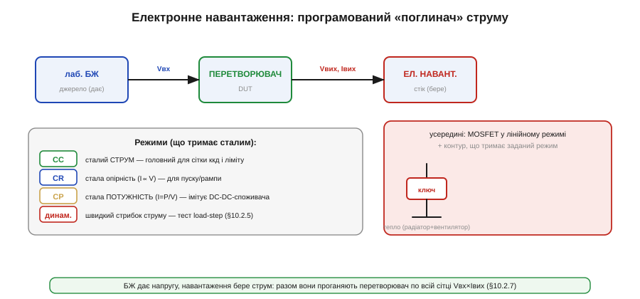

# 🔌 Електронне навантаження: режими CC/CR/CP

Прилад, без якого не зняти ні криву ккд, ні стрибок навантаження під час [вимірювання параметрів перетворювача](root:hw-power/converter-measure).

### Клас пристрою

**Електронне навантаження** (*electronic load*, DC load) — це програмований **поглинач** потужності. Замість резистора в ньому стоїть силовий MOSFET у **лінійному** режимі: контур тримає на ньому рівно такий струм (опір чи потужність), який ви задали, а всю поглинуту потужність прилад розсіює в тепло. Простіше кажучи, це «резистор, опір якого можна точно задати числом» — і навіть більше, бо вміє тримати не лише опір.

Чому взагалі потрібен окремий прилад, а не котушка дроту? Бо звичайний резистор має один-єдиний опір, і щоб «проїхати» перетворювач по всьому діапазону струмів, довелося б тримати ящик резисторів і перепаювати їх. Електронне навантаження робить те саме одним поворотом енкодера — і, що головне, тримає **задану величину сталою** навіть тоді, коли напруга на виході DUT просідає. Резистор так не вміє: у нього струм жорстко прив'язаний до напруги законом Ома, тож щойно напруга впала — впав і струм, і точка виміру «попливла».

### Фізика: чому MOSFET у лінійному режимі — це керований опір

Щоб зрозуміти прилад, треба зрозуміти, **чому** транзистор тут працює інакше, ніж у звичайній схемі-ключі. У прошивці ми ганяємо MOSFET між двома станами: повністю відкритий (Rds(on) — міліоми, падіння майже нуль) і повністю закритий (струму нема). У цих двох станах транзистор майже не гріється, бо добуток струму на напругу малий: або мала напруга, або малий струм.

Електронне навантаження працює рівно **між** цими станами — у так званій **активній** (вона ж лінійна, *linear / active region*) ділянці. Тут затвор підтримується на проміжній напрузі, такій, що транзистор пропускає **рівно заданий струм** незалежно від того, скільки вольт на ньому падає. Для MOSFET у насиченні (saturation, у термінах транзистора — це і є «активна» ділянка для біполярних аналогій) струм стоку задається напругою затвор-витік:

```
Id ≈ (k/2)·(Vgs − Vth)²     (поки Vds > Vgs − Vth, активна ділянка)
```

Ключове тут: **Id майже не залежить від Vds**. Тобто транзистор поводиться як джерело струму, кероване напругою на затворі. Саме цю властивість і використовує контур навантаження: підлаштовуючи Vgs, він тримає Id точно на заданому рівні, а напрузі Vds дозволяє бути будь-якою, яку «накине» зверху DUT.

А тепер головне, **чому** прилад так гріється і чому це принципово. У ключовому режимі вся потужність розсіюється на крихітному Rds(on). Тут — навпаки: транзистор спеціально тримають у точці, де одночасно великі **і** струм, **і** напруга. Розсіяна потужність — це їхній прямий добуток:

```
Pмосфет = Vds · Id
```

Якщо навантаження бере 5 A при 12 V на DUT, то на стоці транзистора падає (майже) всі ці 12 V (мінус мізерний шунт), і він **сам** перетворює на тепло 5 × 12 = 60 Вт. Ось чому всередині не резистор-кочерга, а силовий MOSFET на масивному радіаторі з вентилятором: лінійний режим — це режим максимальних втрат за конструкцією, на відміну від ключа, де втрат уникають. Звідси й усі обмеження приладу — вони ростуть саме з цього добутку Vds·Id.

> 🔧 **Навіщо це.** Розуміючи, що навантаження — це MOSFET у лінійному режимі, ви одразу пояснюєте собі його три межі (струм, напруга, **потужність**) і чому потужність часто впирається першою. Та сама фізика — у лінійних стабілізаторах (LDO) і в pass-транзисторах захисту: усюди, де елемент «з'їдає» різницю напруг, він гріється на добуток V·I.

### Блок-схема


*Усередині — силовий MOSFET-стік і контур, що тримає заданий режим; поглинуте йде в радіатор з вентилятором. У тракті виміру навантаження стоїть з одного боку перетворювача (бере струм), а лабораторний БЖ — з іншого (дає напругу). Разом вони проганяють вузол по всій сітці Vвх × Iвих.*

Усередині — контур зворотного зв'язку. Шунт (точний резистор у міліоми) міряє реальний струм; підсилювач похибки порівнює його із заданим і ворушить затвор MOSFET так, щоб похибка стала нулем. Це класична замкнена петля: задали 2.000 A — контур сам знайде потрібний Vgs, хоч би як «пручався» DUT. Саме тому навантаження тримає величину **сталою** там, де резистор лише пасивно підкорявся б закону Ома.

### Клеми й органи керування

```
+  /  −     силові клеми (під'єднати до виходу DUT, дотримуючись полярності)
sense+/−    клеми віддаленого відбору (Kelvin) — для точності на струмі
режим       CC / CR / CP / CV (що тримати сталим)
значення    задане число (струм, опір, потужність…)
ON/OFF      увімкнути поглинання
```

### Режими

Усі чотири режими — це той самий контур із тим самим MOSFET; різниця лише в тому, **яку величину** підсилювач похибки тримає сталою, порівнюючи її із заданою.

- **CC (сталий струм, *constant current*)** — головний режим: контур тримає заданий Id незалежно від напруги. Це пряме використання властивості «MOSFET = джерело струму» з фізики вище. Ним проходять **сітку ккд** і перевіряють ліміт струму, бо саме струм — незалежна змінна, яку ви хочете задавати точно.
- **CR (сталий опір, *constant resistance*)** — контур щомиті обчислює I = V/R для заданого R, тобто струм слідує за напругою (I ∝ V) так, ніби підключений резистор. Зручний для перевірки **пуску й рамп**: коли вихід DUT піднімається з нуля, опірне навантаження плавно нарощує струм разом із напругою — як справжнє споживацьке коло, а не різкий стрибок.
- **CP (стала потужність, *constant power*)** — контур тримає P сталою, тобто I = P/V: коли напруга падає, струм **зростає**, щоб добуток лишився тим самим. Це **імітує** реального споживача-перетворювач (наприклад, DC/DC далі по тракту), що бере однакову потужність незалежно від вхідної напруги. Така перевірка важлива, бо саме CP-навантаження найжорстокіше до джерела: при просіданні напруги воно ще й **підвищує** струм, заганяючи DUT у режим, де той може зірватися.
- **CV (стала напруга, *constant voltage*)** — рідший режим: навантаження бере стільки струму, скільки треба, щоб утримати на своїх клемах задану напругу; корисно для імітації заряджуваного акумулятора.
- **Динамічний** — швидко стрибає струмом між двома рівнями: саме ним роблять **тест load-step**, перевіряючи, чи не провалюється [вихід DUT при різкій зміні споживання](root:hw-power/feedback-stability).

### Worked example: знімаємо точку кривої ккд

**Умова.** Перевіряємо знижувальний (buck) DC/DC, що з 12 V має давати 5 V. Лабораторний БЖ задає вхід 12.0 V, навантаження в режимі CC тягне 2.000 A з виходу. Прилади показують: вхід 12.00 V / 0.93 A, вихід 5.00 V / 2.000 A. Який ккд і скільки тепла розсіює саме навантаження?

```
Pвих  = Vвих · Iвих = 5.00 V · 2.000 A = 10.00 Вт
Pвх   = Vвх  · Iвх  = 12.00 V · 0.93 A = 11.16 Вт
η     = Pвих / Pвх  = 10.00 / 11.16   = 0.896 → 89.6 %

Втрати в перетворювачі:
Pвтрат = Pвх − Pвих = 11.16 − 10.00 = 1.16 Вт

Тепло, яке палить САМЕ навантаження (на ньому падає весь Vвих виходу):
Pнавант = Vвих · Iвих = 5.00 V · 2.000 A = 10.00 Вт
```

**Висновок.** Перетворювач має ккд ≈ 89.6 % у цій точці, а навантаження мусить безпечно розсіяти 10 Вт тепла — це в межах навіть невеликого приладу. Тепер міняємо струм навантаження (0.5 → 1.0 → 1.5 → 2.0 A…) і вхідну напругу БЖ — і за кілька хвилин маємо всю **сітку ккд** η(Vвх, Iвих). Зверніть увагу: тепло на навантаженні (10 Вт) тут більше за самі втрати перетворювача (1.16 Вт) — навантаження завжди палить **повну вихідну потужність DUT**, бо саме воно стоїть «замість споживача».

Те саме в прошивці автоматизованого стенда виглядає так (навантаження керується по SCPI/UART, ESP32 рахує ккд):

:::tabs
```c
// один заміряний рядок сітки ккд
float p_out = v_out * i_out;     // потужність на виході DUT
float p_in  = v_in  * i_in;      // потужність на вході DUT
float eta   = p_out / p_in;      // ккд у цій точці (0..1)
printf("Iload=%.3f A  eta=%.1f %%  Pload=%.2f W\n",
       i_out, eta * 100.0f, v_out * i_out);
```
```python
# один заміряний рядок сітки ккд
p_out = v_out * i_out            # потужність на виході DUT
p_in  = v_in  * i_in             # потужність на вході DUT
eta   = p_out / p_in             # ккд у цій точці (0..1)
print(f"Iload={i_out:.3f} A  eta={eta * 100:.1f} %  Pload={v_out * i_out:.2f} W")
```
:::

### «Перший байт»

Під'єднати клеми до виходу перетворювача (+ до +, − до −), вибрати режим (зазвичай **CC**) і значення струму, натиснути ON — і навантаження почне брати рівно цей струм. Прилад тут же показує виміряні напругу й струм, які й ідуть у розрахунок ккд.

### Типові граблі

- **Це СТІК, а не джерело.** Переплутана полярність ушкоджує і прилад, і DUT — звіряйте + і −. Чому це фатально: вхідний MOSFET спроєктований проводити струм лише в одному напрямку; зворотна полярність відкриває його паразитний **тілесний діод** наглухо, і через нього йде неконтрольований струм, не обмежений контуром.
- **Поглинуте йде в тепло.** Сам прилад гріється й має вентилятор; не перевищуйте його межі за **потужністю** (часто саме вона, а не струм, обмежує), напругою та струмом. Чому потужність впирається першою: межа струму — це межа транзистора по току, а межа потужності — це межа **радіатора** відвести Vds·Id. На високій напрузі ви впираєтесь у Вати задовго до амперів: прилад на 150 Вт / 30 A при 60 V витягне лише 150/60 = 2.5 A, а не паспортні 30.
- **Мінімальна напруга.** MOSFET-стіку потрібен бодай невеликий Vds, щоб лишатися в активній ділянці (умова Vds > Vgs − Vth із фізики вище). Якщо Vds впаде надто низько, транзистор виходить у триодну (омічну) ділянку, де він уже звичайний малий опір і **не може** тримати заданий струм. Тому на дуже низьких напругах (часто <1–2 V) навантаження не витягне повний струм — це не дефект, а межа фізики приладу.
- **Точність — через sense.** На великому струмі падіння на дротах спотворює і вимір, і динаміку; щоб [зняти криву ккд](root:hw-power/converter-measure) без похибки, під'єднують **віддалений відбір** (Kelvin) окремою парою тонких дротів просто до клем DUT і тримають короткі силові дроти. Чому: при 10 A навіть 50 мОм дроту дають падіння 0.5 V — і ваш «вимір 5.0 V» насправді 4.5 V на клемах DUT, а ккд порахується з помилкою у відсотки.

### Навіщо воно поруч із лабораторним БЖ

Лабораторний блок живлення **дає** напругу, електронне навантаження **бере** струм — і лише разом вони дозволяють повністю «проїхати» перетворювач: змінюючи БЖ задаєте Vвх, змінюючи навантаження — Iвих, і так знімаєте всю [сітку ккд](root:hw-power/converter-measure) та стрибки навантаження. Простий резистор так не вміє: він дає лише одну точку й не стрибає.

### Варіації класу

Найпростіше — **банка резисторів** (вручну, грубо). DIY-варіант — **один MOSFET** із керуванням (досить для базового CC; це буквально транзистор у лінійному режимі плюс операційник, що тримає струм по шунту — та сама петля, що в «дорослому» приладі, лише без захистів і дисплея). Лабораторні прилади — **програмовані** з динамічним режимом і дистанційним керуванням (їх і автоматизують скриптом по SCPI/UART, як у worked-прикладі вище). А для великої потужності є **рекуперативні** навантаження, що віддають поглинуте назад у мережу, а не палять у тепло, — бо на кіловатах розсіювати все в радіатор уже надто марнотратно й гаряче.
