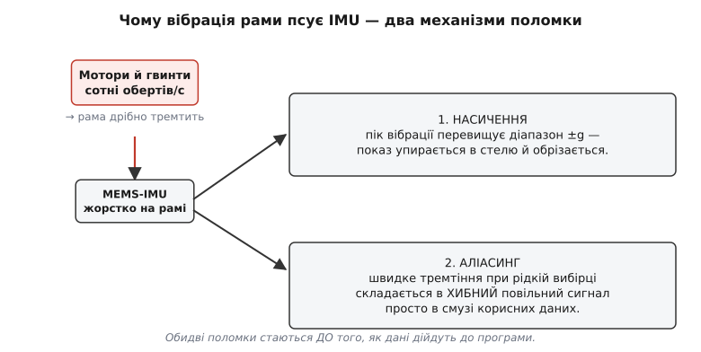
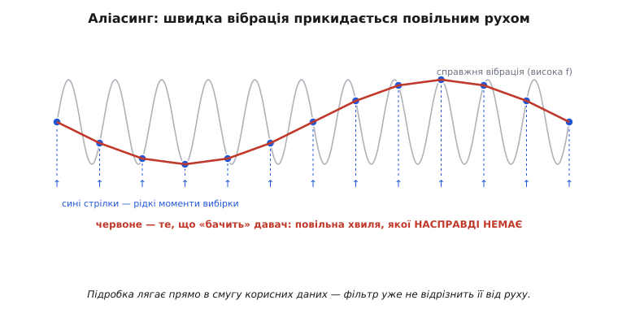
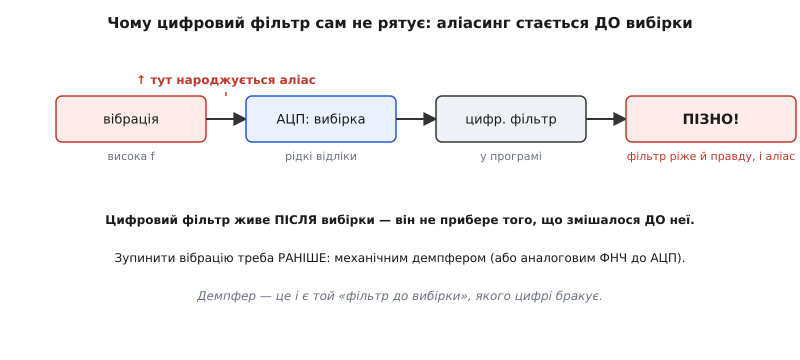
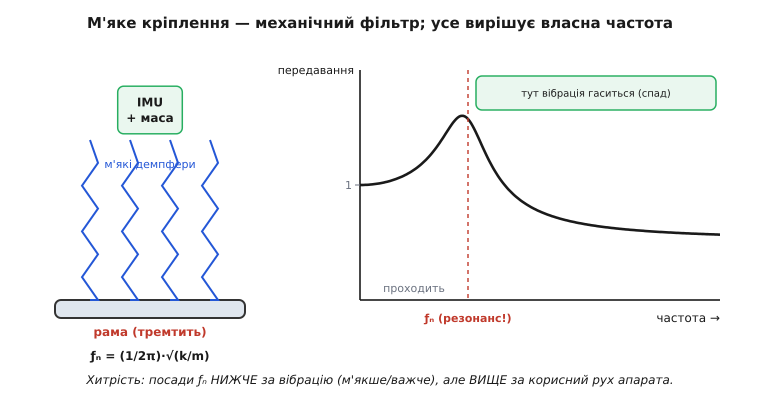

# Розв'язка IMU від вібрації

Поставте [інерціальний давач](topic:hw-sensing/imu) на раму, де крутяться мотори, — і він почне брехати. Не тому, що поганий, а тому, що рама **тремтить**, а MEMS чесно це тремтіння міряє. Лихо в тому, що дрібна, начебто нешкідлива вібрація рами не просто додає шуму — вона **псує дані в самому давачі ще до того, як вони дійдуть до програми**, і двома способами, проти яких звичайний фільтр безсилий. Розв'язка (англ. *isolation* — відокремлення) — це механічне відрізання давача від тремтіння рами м'яким підвісом. Розберімо від першопричини, **чому** вібрація така руйнівна саме для IMU, чому фільтр у коді її вже не дістане і як м'яке кріплення лагодить біду в корені.

### Чому вібрація рами — це біда, а не просто шум

Почнімо з очевидного питання: давач і так має [шум](topic:hw-sensing/imu-noise-bias-drift), його ж фільтрують — чим вібрація гірша? Тим, що вона **не схожа на звичайний шум**. Шум давача дрібний, випадковий і з нульовим середнім — його легко усереднити. Вібрація від моторів — навпаки: **велика за амплітудою**, **впорядкована** (на чітких частотах обертів) і **стала в часі**, поки мотори крутяться. Така сильна впорядкована тряска ламає вимірювання двома різними механізмами, і обидва стаються **всередині давача**.


*Звідки біда. Мотори й гвинти трясуть раму сотні разів на секунду; жорстко прикручений до неї MEMS-IMU дістає всю цю тряску. Звідси дві окремі поломки: **насичення** (пік вібрації виходить за діапазон ±g, показ обрізається) і **аліасинг** (швидке тремтіння при рідкій вибірці перетворюється на хибний повільний сигнал). Головне — обидві стаються **до** того, як числа потраплять у програму.*

**Перший механізм — насичення.** [Акселерометр](topic:hw-sensing/accelerometer) має скінченний діапазон, скажімо ±8g. Корисні прискорення апарата малі — частки g. Але вібрація додає короткі гострі піки, і якщо пік сягне ±8g, давач **упреться в стелю**: він фізично не може показати більше, тож обріже верхівку. А обрізаний сигнал — це вже не правда: справжній рух під час піку втрачено безповоротно, і жодна обробка його не відновить, бо в числах його просто немає. Що жорсткіша рама й сильніші мотори, то частіші ці зрізи.

**Другий механізм — аліасинг** (від англ. *alias* — псевдонім, чуже ім'я). Він підступніший і заслуговує окремого погляду, бо саме він робить вібрацію по-справжньому небезпечною.

### Аліасинг: швидке тремтіння прикидається повільним рухом

Давач не міряє безперервно — він бере **окремі відліки** через рівні проміжки: цей процес зветься [вибіркою](topic:hw-analog/sampling-quantization). Скажімо, контролер читає IMU тисячу разів на секунду. Здавалося б, тисяча — багато. Але мотори дрона можуть трясти раму на кількох сотнях герц, а лопаті гвинтів — ще швидше. І ось тут стається халепа: **коли сигнал коливається швидше, ніж устигаєш його зчитувати, рідкі відліки складаються в зовсім іншу, повільнішу хвилю — якої насправді немає**.


*Аліасинг наочно. Сіра хвиля — справжня швидка вібрація. Сині стрілки — рідкі моменти, коли давач устигає взяти відлік. З'єднавши лише ці точки (червоне), дістаємо повільну хвилю, якої в сигналі **немає** — це підробка, народжена самою рідкістю вибірки. Найгірше: підробка лягає просто в смугу повільних корисних рухів, тож відрізнити її від справжнього маневру вже **неможливо**.*

Це не дрібниця. Якби аліас лягав десь осторонь, на чужих частотах, його можна було б відрізати. Але він лягає **саме туди, де живуть корисні дані** — у смугу повільних рухів апарата. Контролер дрона бачить плавне «хитання», починає його компенсувати — і розгойдує апарат, ганяючись за привидом. Класичний симптом: дрон, що дрібно тремтить у польоті або раптом «стрибає», коли газ виходить на резонанс. Причина не в моторах і не в коді стабілізації, а в тому, що вібрація зааліасилась у дані IMU.

Чому аліас не прибрати? Бо він **уже** в числах — його не відрізнити від правди. Дві геть різні картини світу (справжній швидкий і фальшивий повільний рух) дали **однакові** відліки; маючи лише ці відліки, відновити, котра з картин була насправді, неможливо в принципі. Інформацію втрачено в момент вибірки.

> 🔧 **Навіщо це.** Перш ніж лізти в код стабілізації, спитайте: а чи не аліас це? Якщо дрон спокійний на малому газі й починає тремтіти/стрибати на певних обертах — майже напевно вібрація на цих обертах потрапляє в смугу IMU. Лікувати це треба **механічно** (розв'язка, балансування гвинтів), а не коефіцієнтами регулятора — інакше ганятимете привид нескінченно.

### Чому фільтр у програмі сам не рятує

Перша думка інженера: поставлю в коді [фільтр](topic:com-signal/signal-noise), він і прибере вібрацію. Для звичайного шуму це працює. Для вібрації — **ні**, і причина строго в **порядку дій**.


*Чому цифра запізнюється. Сигнал іде ланцюгом: вібрація → вибірка АЦП → цифровий фільтр у програмі. Аліас народжується **на вибірці** — коли швидке стає рідким. Цифровий фільтр стоїть **після** неї й бачить уже зіпсовані числа, де аліас невіддільний від правди: ріжучи «повільне» тремтіння, він зріже з ним і повільний корисний рух. Зупинити вібрацію треба **раніше за вибірку** — а це під силу лише чомусь механічному (демпфер) або аналоговому (ФНЧ до АЦП).*

Думка проста: **цифровий фільтр живе вже після вибірки**. Він обробляє числа, які давач устиг записати, — а аліас з'явився **під час** запису, раніше. Фільтр не може прибрати того, що змішалося до нього; усе, що він бачить, — це повільна хвиля, в якій правда й підробка вже злиті в одне. Спробуєш притлумити це «повільне» сильнішим фільтром — заразом приб'єш і повільний корисний рух (плавні нахили апарата) і ще й додаси затримки. Лік виходить гірший за хворобу.

Висновок різкий і важливий: **щоб не було аліасу, тремтіння треба прибрати ще до вибірки**. Усе, що стоїть у ланцюзі після АЦП, — безсиле. А значить, лік мусить бути або **аналоговим** (фільтр-ФНЧ між давачем і АЦП, що згладжує сигнал до оцифрування), або, у MEMS, де давач і АЦП злиті в один чип і всунутись між них нікуди, — **механічним**: не пускати тремтіння до давача взагалі. Саме тому головний інструмент проти вібрації IMU — не код, а **м'яке кріплення**.

### М'яке кріплення: давач на пружинах

Якщо тремтіння треба зупинити до того, як давач його зміряє, найпряміший шлях — **не передавати** його давачу. Прикрутимо IMU до рами не жорстко, а через щось м'яке: гумові вкладки, спінений поліуретан, силіконові стійки. Тоді рама тремтить, а давач на м'якому підвісі — майже ні. Це і є **soft-mount**, м'яке кріплення.

Чому м'яке гасить тряску? Бо м'який підвіс із масою давача утворює **механічний фільтр низьких частот**. Інтуїція тут фізична й точна. Уявіть тягарець на гумці. Смикніть руку **повільно** — тягарець слухняно піде за рукою (повільне передається). Смикніть **різко, швидко** — рука сіпнеться, а тягарець через інерцію майже лишиться на місці: гумка розтягнеться й погасить ривок (швидке не передається). Вібрація моторів — це і є дуже швидкі ривки, тож масивний давач на м'якій підвісці на них майже не відгукується. М'яке кріплення пропускає повільне (справжні рухи апарата) і глушить швидке (вібрацію) — рівно те, що нам треба.

> 🔧 **Навіщо це.** Три складові розв'язки роблять три різні справи, не плутайте їх. **М'якість** (податливий матеріал) — задає, з якої частоти починається гасіння. **Маса** (іноді давач навмисне обтяжують платівкою) — додає інерції, опускаючи цю частоту ще нижче. **Демпфування** (внутрішнє тертя гуми/піни) — гасить розгойдування на резонансі. Бракує демпфування — підвіс сам почне дзвеніти; забагато жорсткості — вібрація пройде наскрізь.

### Власна частота підвісу — головне число

У будь-якої системи «маса на пружині» є одна головна характеристика — **власна частота** ƒₙ (англ. *natural frequency*): частота, на якій вона охоче гойдається сама, якщо її штовхнути. Саме ƒₙ ділить світ частот для нашого підвісу на «проходить» і «гаситься», тож усе проєктування розв'язки крутиться навколо неї.


*Підвіс як механічний фільтр. Ліворуч: IMU (з додатковою масою) висить на м'яких демпферах над тремтячою рамою; власна частота ƒₙ = (1/2π)·√(k/m). Праворуч: скільки вібрації проходить до давача залежно від частоти. **Нижче ƒₙ** усе проходить (передавання ≈ 1) — повільні рухи апарата йдуть наскрізь, як і треба. **На ƒₙ — небезпечний пік**: підвіс підсилює тряску, тут вібрацію мати не можна. **Вище ƒₙ** — спад: тут вібрація гаситься, і що вона вища, то сильніше.*

Власна частота рахується через жорсткість підвісу k і масу давача m:

```text
ƒₙ = (1 / 2π) · √(k / m)
```

З формули прямо видно обидві ручки керування. **М'якший** підвіс — менша k — нижча ƒₙ. **Важчий** давач — більша m — теж нижча ƒₙ. Обидва шляхи опускають ƒₙ, і це саме те, чого ми хочемо. Чому хочемо саме нижче — видно з трьох зон передавання:

- **Частоти нижчі за ƒₙ** проходять майже без втрат (передавання ≈ 1). Тут живуть справжні рухи апарата — нахили, маневри. Їх давач **мусить** бачити, тож добре, що вони проходять.
- **На самій ƒₙ — резонанс**, і це небезпека: підвіс не гасить, а **підсилює** коливання (передавання більше за 1). Якщо частота вібрації збігається з ƒₙ, давач трястиме сильніше, ніж раму. Тому ƒₙ треба тримати **подалі** від робочих частот моторів.
- **Частоти вищі за ƒₙ** гасяться, і що вони вищі, то сильніше (передавання спадає). Сюди й треба загнати вібрацію.

Звідси проста й точна стратегія: посадити ƒₙ так, щоб уся вібрація моторів опинилася **вище** за неї (у зоні гасіння), а всі корисні рухи апарата — **нижче** (у зоні пропускання). Між ними мусить лягти ƒₙ, оминаючи й те, й те. Це і є вся таємниця добору м'якості й маси.

Покажемо на числах для типового дрона. Корисні рухи апарата повільні — одиниці герц. Вібрація моторів швидка — почнімо з її нижньої межі, скажімо 200 Гц. Ставимо ƒₙ між ними, наприклад 40 Гц, із добрим запасом від обох:

```text
корисні рухи апарата:   1…10 Гц     ← мають пройти (нижче ƒₙ)
власна частота підвісу:    ƒₙ ≈ 40 Гц   ← межа: де «пройде» переходить у «згасне»
вібрація моторів:        200…600 Гц   ← має згаснути (вище ƒₙ)
```

40 Гц вище за 10 Гц корисних рухів — отже, маневри проходять. І водночас сильно нижче за 200 Гц вібрації — отже, вібрація потрапляє в зону спаду й гаситься. Запас з обох боків означає, що ні корисний сигнал не зачепить різкий схил фільтра, ні вібрація не сяде на резонансний пік. Якби ми, навпаки, поставили ƒₙ = 200 Гц — рівно на нижню вібрацію, — підвіс на цих обертах **підсилив** би тряску. Тому запас не розкіш, а обов'язок.

**Приклад (добір монтажу під ƒₙ).** Маємо плату IMU масою m = 30 г і чотири силіконові стійки сумарною жорсткістю k = 1900 Н/м. Перевірмо в коді, чи лягає ƒₙ між корисним рухом і вібрацією:

:::tabs
```c
#include <math.h>
// k — сумарна жорсткість підвісу (Н/м), m — маса вузла (кг)
float mount_fn_hz(float k, float m) {
    return sqrtf(k / m) / (2.0f * (float)M_PI);   // ƒₙ = (1/2π)·√(k/m)
}

float fn = mount_fn_hz(1900.0f, 0.030f);   // → ≈ 40.1 Гц
// 40 Гц: вище за рухи (≤10 Гц) і нижче за вібрацію (≥200 Гц) — годиться.
// Заважке/м'якше: удвічі більша m опускає ƒₙ лише в √2 ≈ 1.41 раза (до ~28 Гц).
```
```python
import math
# k — сумарна жорсткість підвісу (Н/м), m — маса вузла (кг)
def mount_fn_hz(k, m):
    return math.sqrt(k / m) / (2.0 * math.pi)     # ƒₙ = (1/2π)·√(k/m)

fn = mount_fn_hz(1900.0, 0.030)            # → ≈ 40.1 Гц
# 40 Гц: вище за рухи (≤10 Гц) і нижче за вібрацію (≥200 Гц) — годиться.
# Заважке/м'якше: удвічі більша m опускає ƒₙ лише в √2 ≈ 1.41 раза (до ~28 Гц).
```
:::

Зверніть увагу на останній рядок: маса входить під коренем, тож щоб опустити ƒₙ **вдвічі**, масу довелося б збільшити **вчетверо**. Тому опускати ƒₙ масою дорого (зайва вага апарата), і на практиці головну роботу робить **м'якість** матеріалу, а маса лише допомагає.

> 🔧 **Навіщо це.** Перевіряйте розв'язку **на всьому діапазоні газу**, а не лише на висінні. Частота вібрації прямо залежить від обертів моторів, тож на розгоні вона прокочується вниз — і може на мить **накритися** з ƒₙ підвісу. Якщо на якихось обертах апарат раптом починає трястися сильніше, ніж на сусідніх, — це вібрація проходить через резонанс підвісу. Лік: опустити ƒₙ нижче (м'якший або важчий монтаж), щоб резонанс лежав під усім робочим діапазоном моторів.

### Чого розв'язка не вміє

М'яке кріплення прибирає **швидку** вібрацію — і тільки. Воно нічим не зарадить проти **повільних** бід давача: [зсуву нуля й дрейфу](topic:hw-sensing/imu-noise-bias-drift). Вони живуть на частотах нижче ƒₙ, у зоні пропускання, тож проходять до давача наскрізь, хоч як його підвішуй. Розв'язка й [поєднання давачів](topic:com-signal/sensor-fusion) — два різні інструменти проти двох різних бід: перший проти швидкої вібрації (механічно, до вибірки), друге проти повільного дрейфу (математично, після вибірки). Одне без одного не повне.

Є й плата за розв'язку. М'який підвіс додає крихітну **затримку** реакції (давач трохи «спізнюється» за рамою) і вносить власну динаміку, яку контролер мусить терпіти. Надто м'яке кріплення дає давачу теліпатися — і він почне ловити власні гойдання замість руху апарата. Тому розв'язку не роблять «якомога м'якшою»; її **налаштовують** на ту єдину ƒₙ, що лягає між корисним рухом і вібрацією. М'якше — погана динаміка; жорсткіше — вібрація проходить. Оптимум посередині, і він і є метою.

### Де це працює: дрони передусім

Найгостріше розв'язка потрібна там, де поряд із чутливим IMU крутяться мотори, — тобто на **дронах**. Тут вона буквально вирішує, полетить апарат чи розгойдається: політний контролер тримає рівновагу за показами IMU, і якщо в них сидить зааліасена вібрація, регулятор почне її «виправляти», розхитуючи дрон. Тому в кожному серйозному польотному контролері IMU стоїть на гумових вкладках, силіконових стійках або в окремому модулі на м'якій підвісці — часто з навмисною додатковою масою, щоб опустити ƒₙ.

Та сама фізика працює всюди, де чутливий інерціальний давач сусідить із джерелом тряски: камери на підвісах-стабілізаторах, інерціальні модулі на колісних роботах і машинах, прилади на верстатах. Усюди принцип той самий — **відрізати давач від швидкого тремтіння м'яким підвісом із власною частотою між корисним сигналом і вібрацією**, бо все інше (зокрема фільтр у коді) запізнюється до моменту, коли шкоду вже завдано.

Підсумуймо ланцюг від причини до ліку. Рама тремтить → жорстко прикручений [MEMS](topic:hw-sensing/mems) це тремтіння міряє → сильна вібрація або **насичує** давач, або **аліаситься** в смугу корисних даних → і те, й те стається **до вибірки**, тож [цифровий фільтр](topic:com-signal/signal-noise) уже безсилий → отже, тремтіння треба зупинити **раніше**, механічно → м'яке кріплення з масою утворює механічний ФНЧ → його **власна частота** ƒₙ, посаджена між корисним рухом і вібрацією, пропускає перше й гасить друге. Назвати причину правильно — півсправи: вібрація IMU лікується не кодом, а правильно дібраним шматком гуми під давачем.

---
