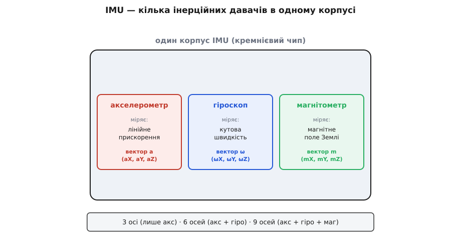
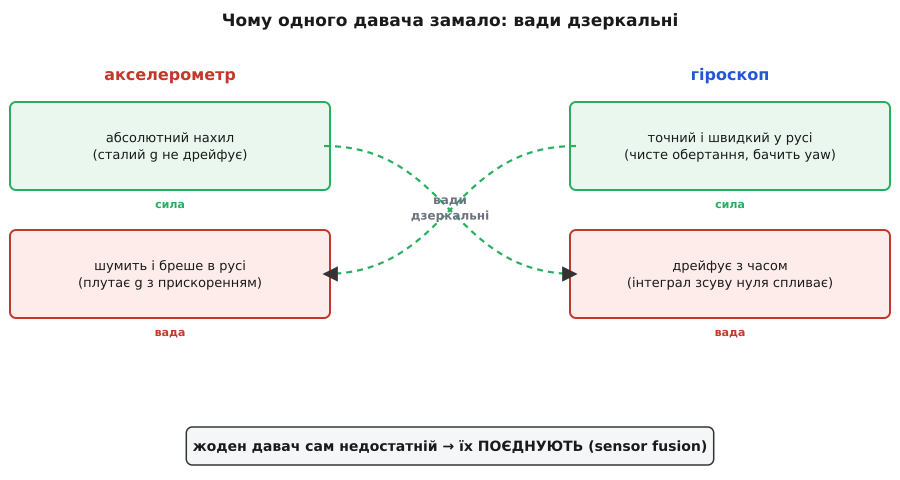
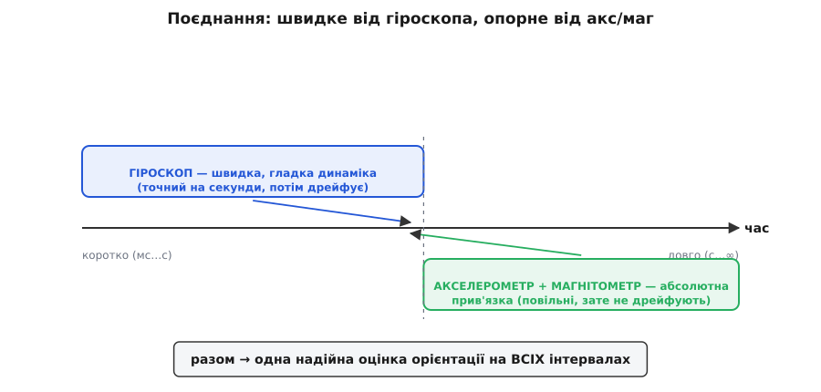
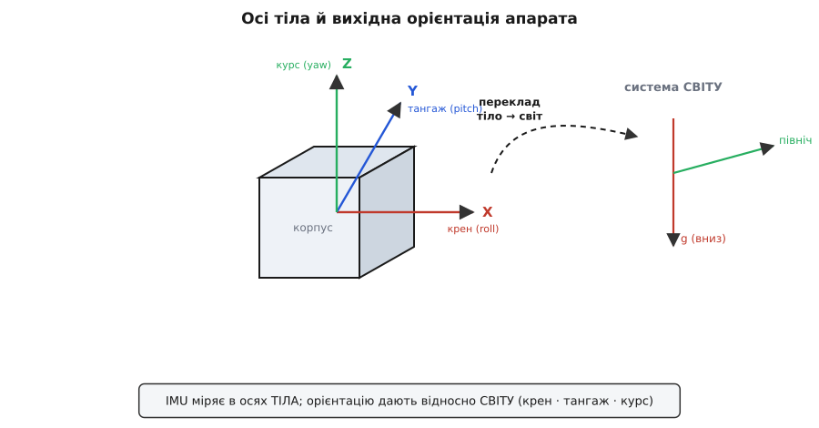

# Інерційний вимірювальний блок (IMU)

Спитайте дрон, телефон чи робот-пилосос, **як він повернений у просторі** — нахилений він, куди дивиться, чи стоїть рівно, — і відповідь дасть один копійчаний чип: IMU, інерційний вимірювальний блок (англ. *Inertial Measurement Unit*; від лат. *inertia* — бездіяльність, нездатність тіла самотужки змінити свій рух). Назва точна: блок міряє **інерційні** величини — те, як тіло прискорюється й обертається, спираючись лише на закони механіки всередині себе, без жодного погляду назовні. Та головне, що варто зрозуміти з самого початку: IMU — це **не один давач**, а **кілька різних давачів в одному корпусі**, зведених докупи саме тому, що поодинці кожен з них **бреше**. Уся суть IMU — не в окремому давачі, а в тому, чому їх мусить бути кілька й як їхні покази складають в одну надійну відповідь.

Налаштуймося на головну думку наперед. Існує спокуса шукати «той самий правильний давач орієнтації» — один чип, що чесно скаже, як апарат повернений. Такого чипа немає й бути не може: кожен інерційний давач відчуває лише **свою** грань руху і має при цьому **свою** невиліковну ваду. IMU — це визнання цього факту, втілене в кремнії: зібрати кілька недосконалих давачів так, щоб сильний бік одного закривав слабкий бік іншого. Тому розповідь про IMU — це розповідь про **команду** давачів, а не про солдата-одинака.

### Що таке IMU: давачі в одному корпусі

Почнімо з того, **що** саме сидить усередині. Серцевина будь-якого IMU — два давачі: [акселерометр](topic:hw-sensing/accelerometer) і [гіроскоп](topic:hw-sensing/gyroscope). Часто до них додають третій — [магнітометр](topic:hw-sensing/magnetometer). Кожен міряє свою фізичну величину, і кожен віддає **вектор** із трьох чисел — по одному на кожну з трьох взаємно перпендикулярних осей X, Y, Z.


*Що ховається в корпусі IMU. Три окремі давачі, зведені на один кремнієвий кристал: акселерометр міряє лінійне прискорення, гіроскоп — кутову швидкість, магнітометр — магнітне поле Землі. Кожен віддає по три числа (вектор по осях X, Y, Z), а разом вони дають 3, 6 чи 9 чисел — звідси й назви «3-осьовий», «6-осьовий», «9-осьовий» IMU.*

Звідси й уся арифметика назв, що спершу збиває з пантелику:
- **3-осьовий** IMU — лише акселерометр (три осі прискорення);
- **6-осьовий** — акселерометр + гіроскоп (три осі прискорення + три осі обертання);
- **9-осьовий** — акселерометр + гіроскоп + магнітометр (плюс три осі магнітного поля).

«Осі» тут — це не три напрямки простору, а **загальна кількість незалежних вимірів**, що віддає чип. Шість осей — це не шість напрямків, а два давачі по три осі кожен. Дев'ять — три давачі по три. Запам'ятати легко, якщо тримати в голові головну картину: IMU — це **коробка з кількох давачів**, і «осі» лічать, скільки чисел вона видає за один такт.

Що дає таке поєднання в одному корпусі? Передусім — спільні осі. Усі давачі на одному кристалі **вирівняні між собою** заводом: вісь X акселерометра дивиться туди ж, куди вісь X гіроскопа й магнітометра. Це не дрібниця: щоб складати їхні покази в одну орієнтацію, осі мусять збігатися, а зводити три окремі чипи в спільну систему координат вручну — морока й джерело похибок. IMU вирішує це **готовим**: один корпус, одна шина, одна система осей.

> 🔧 **Навіщо це.** Купуючи давач для орієнтації, дивіться передусім на **кількість осей**. Для самого лише нахилу (електронний рівень, автоповорот екрана) досить 3-осьового акселерометра. Для **динамічної** орієнтації в русі (дрон, стабілізатор камери, робот) потрібно щонайменше **6 осей** — акселерометр і гіроскоп разом. А якщо треба знати ще й **курс** (куди апарат повернений відносно півночі) — беріть **9 осей**, із магнітометром. Менше осей — дешевше й простіше, але й менше з нього вичавиш; зайві осі — даремна складність. Кількість осей — це перший і найважливіший вибір.

### Що міряє кожен давач

Тепер — **що** саме відчуває кожен із трьох, бо саме з їхніх вимірів і виростає вся подальша логіка.

[Акселерометр](topic:hw-sensing/accelerometer) міряє **лінійне прискорення** — точніше, специфічну силу, з якою опора діє на його внутрішню масу. Тонкість, об яку спотикається кожен новачок: він міряє й **гравітацію**, тож у спокої показує не нуль, а сталий вектор **1g**, спрямований угору. Саме цей вічний вектор g — головна користь акселерометра: за тим, як 1g розкладається на три осі, він визначає **нахил** (де «низ»). Гравітація — незмінний орієнтир, тож нахил за акселерометром **не дрейфує**: «де низ» давач знає завжди правильно.

[Гіроскоп](topic:hw-sensing/gyroscope) міряє **кутову швидкість** — наскільки **швидко** апарат обертається, у градусах за секунду (°/с). Не кут повороту, а саме **темп** його зміни: стоїть нерухомо — нуль, крутиться — показує швидкість обертання. Робить він це через ефект Коріоліса на крихітній коливній масі. Гіроскоп цілком **байдужий** до гравітації й лінійного руху: трясіть його, перевертайте — він реагує лише на власне обертання. Тому він точний саме там, де акселерометр сліпне: у русі й при повороті навколо вертикалі.

[Магнітометр](topic:hw-sensing/magnetometer) міряє **магнітне поле Землі** — його напрямок по трьох осях, як стрілка компаса. За горизонтальною складовою поля він визначає **курс** (азимут) — куди апарат повернений відносно сторін світу. Це єдиний із трьох, хто дає **абсолютний напрямок** у горизонтальній площині; і єдиний, хто **не** є механічним давачем — поле він міряє електрично.

Складімо це в одну картину, бо саме з трьох різних вимірів і складається повна орієнтація:

```text
давач           міряє                  дає орієнтир
─────────────   ────────────────────   ───────────────────────────
акселерометр    лінійне прискорення    нахил (де «низ») — зі сталого g
гіроскоп        кутову швидкість       швидкі зміни кута (миттєва ω)
магнітометр     магнітне поле Землі    курс (де північ) — з поля
```

Три давачі — три внески: акселерометр каже **де низ**, магнітометр — **де північ**, гіроскоп — **як швидко все міняється**. Два абсолютні орієнтири (низ і північ) задають орієнтацію без дрейфу, а гіроскоп робить її швидкою й гладкою між цими прив'язками. Систему, що так зводить давачі в орієнтацію, звуть **AHRS** (*Attitude and Heading Reference System* — система відліку положення й курсу).

### Чому одного давача замало

А тепер — головне питання, заради якого все й затівається. Якщо акселерометр уже дає нахил, навіщо городити кілька давачів? Чому не обійтися одним? Бо **кожен із них має невиліковну ваду** — і саме звідси росте вся ідея IMU.

Почнімо з акселерометра, бо саме на ньому спокуса зупинитися найбільша. Його біда — **рух**. Акселерометр віддає **суму** гравітації й лінійного прискорення, а розділити їх із одного давача фізично неможливо (він не розрізняє, де стала g, а де розгін). Поки апарат **нерухомий**, це не заважає: є лише g, і нахил читається чисто. Та щойно апарат починає трястися, прискорюватись чи повертатися, до сталої g домішується **динаміка** — і «де низ» уже не вгадати. Рівень бреше, поки ви ним махаєте. Гірше: сирий вихід акселерометра завжди ще й **шумить** від теплового [шуму механіки](topic:hw-sensing/imu-noise-bias-drift). Тож для спокою акселерометр чудовий, а для руху — ненадійний.

«Тоді візьмімо гіроскоп — він якраз точний у русі», — і тут чигає **його** вада. Гіроскоп дає **швидкість**, а нам зазвичай потрібен **кут**. Щоб дістати кут зі швидкості, її доводиться **інтегрувати** — накопичувати в часі. А будь-який давач має крихітний **зсув нуля**: нерухомий гіроскоп «думає», що ледь крутиться. Під час інтегрування цей зсув накопичується без кінця, і оцінка кута повільно **спливає** геть від правди — це й зветься **дрейфом**. Гіроскоп точний на секунди, та що довше на нього покладаєшся, то далі він бреше.

Подивіться, які це **дзеркальні** вади:


*Жоден давач сам недостатній. Акселерометр абсолютний і не дрейфує (сильний у спокої), але шумить і бреше в русі. Гіроскоп точний і швидкий у русі, але дрейфує з часом від інтегрування зсуву нуля. Сила одного — точно слабкість іншого: акселерометр чистий саме тоді, коли гіроскоп уже сповз, а гіроскоп точний саме тоді, коли акселерометр заглушений рухом. Тому їх поєднують — кожен латає ваду другого.*

Ось чому **жоден давач сам по собі недостатній**:
- **акселерометр** — абсолютний, не дрейфує, але **бреше в русі** й шумить;
- **гіроскоп** — точний у русі, бачить yaw, але **дрейфує** з часом;
- **магнітометр** — дає абсолютний курс, але його легко **обдурити** будь-яким залізом чи магнітом поряд, тож без калібрування він теж бреше.

Кожен сильний рівно там, де другий слабкий. Акселерометр абсолютний у спокої, але ненадійний у русі; гіроскоп — навпаки, точний у русі, та сповзає на довгих інтервалах. Якщо взяти **краще від обох** — швидку чисту динаміку гіроскопа на коротких відрізках **і** абсолютну бездрейфову прив'язку акселерометра на довгих, — дістанемо оцінку, кращу за будь-який давач окремо. Саме це й робить IMU своїм складом: збирає давачі-антиподи, щоб їхні вади гасили одна одну.

### Поєднання: кожен латає ваду іншого

Як саме поєднують? Механізм гарний своєю простотою — в основі його звичайна **фільтрація за частотою**. Швидку, динамічну частину орієнтації беруть від **гіроскопа** (він добрий на коротких часах), а повільну, опорну — від **акселерометра й магнітометра** (вони добрі на довгих). Складені разом, вони покривають **усі** часові масштаби.


*Поєднання як поділ за часом. Швидку, гладку динаміку (від мілісекунд до секунд) дає гіроскоп — він точний накоротко, але далі дрейфує. Повільну, абсолютну прив'язку (від секунд і назавжди) дають акселерометр і магнітометр — вони неквапні, зате не сповзають. Складені, вони закривають увесь діапазон часів: гіроскоп веде кут миттєво й гладко, а акселерометр із магнітометром повільно тягнуть його назад до істинних «низу» й «півночі», не даючи спливти.*

Інтуїція проста: гіроскоп веде кут **миттєво й гладко** від такту до такту, а акселерометр **повільно** підправляє його, тягнучи назад до справжнього «низу» щоразу, коли той починає сповзати. Так само магнітометр повільно тягне **курс** назад до справжньої півночі, не даючи дрейфу гіроскопа по yaw накопичитися. Два недосконалі давачі дають разом одну надійну оцінку.

Це поєднання показів кількох давачів в одну оцінку звуть [**поєднанням давачів**](topic:com-signal/sensor-fusion) (англ. *sensor fusion*). Найпростіший його варіант — [**комплементарний фільтр**](topic:com-signal/complementary-filter): він буквально бере **високі частоти** (швидкі зміни) від гіроскопа й **низькі** (повільну опору) від акселерометра та складає їх. Складніший і точніший — [**фільтр Калмана**](topic:com-signal/kalman-filter), що зважує внески давачів за їхньою довірою. Та принцип в обох один: довіряти кожному давачу там, де він сильний, і не довіряти там, де слабкий.

Результат вражає простотою наслідку. Маючи два **посередні** копійчані давачі, ви отримуєте оцінку орієнтації, гідну приладу в рази дорожчого: гіроскоп дає **гладкість і швидкість**, акселерометр — **довготривалу правду**, а разом — і те, і те. Саме тому жоден серйозний проєкт із орієнтацією не покладається на один чип: сила тут не в окремому давачі, а в **поєднанні**.

> 🔧 **Навіщо це.** Ніколи не визначайте орієнтацію за **одним** давачем, якщо апарат рухається. Голий акселерометр збреше про нахил, щойно почнеться тряска; голий інтегрований гіроскоп за хвилини «накрутить» десятки градусів неіснуючого повороту. Беріть **6-осьовий** IMU (а для курсу — 9-осьовий) і одразу плануйте [поєднати](topic:com-signal/sensor-fusion) його давачі — хоч би простим комплементарним фільтром. Це різниця між іграшкою, що плутається в трьох соснах, і апаратом, що тримає орієнтацію надійно.

### Осі, одиниці, системи координат

Перейдімо до практики — до чисел, які IMU реально видає. Кожен давач **триосьовий** і віддає вектор по осях X, Y, Z, тож сирий вихід 9-осьового IMU — це дев'ять чисел за такт:

```text
акселерометр:  aX, aY, aZ   у частках g або м/с²   (1g ≈ 9.8 м/с²)
гіроскоп:      ωX, ωY, ωZ   у градусах за секунду  (°/с)
магнітометр:   mX, mY, mZ   у мікротеслах (мкТл) чи умовних одиницях
```

Самі давачі віддають **сирі відліки** [АЦП](topic:hw-analog/adc) — цілі числа, які за паспортним коефіцієнтом (чутливістю) переводять у фізичні одиниці. Це перший крок будь-якого коду роботи з IMU: помножити сирий відлік на коефіцієнт і дістати g, °/с чи мкТл.

Обертання навколо трьох осей мають усталені імена, які варто запам'ятати: поворот навколо поздовжньої осі — **крен** (*roll*), навколо поперечної — **тангаж** (*pitch*), навколо вертикальної — **курс** або рискання (*yaw*). Гіроскоп міряє швидкість кожного з цих обертань окремо.

Та найважливіше для розуміння — це **дві різні системи координат**, які тут весь час співіснують:


*Дві системи координат. IMU міряє у **власних** осях, жорстко прив'язаних до корпусу апарата (тіла): крен навколо X, тангаж навколо Y, курс навколо Z. Та орієнтацію апарата визначають відносно **світу** — нерухомих зовнішніх орієнтирів: гравітації (де «вниз») і магнітної півночі (де «північ»). Покази з осей тіла треба перерахувати в систему світу — і саме цей переклад дає кут нахилу й курс апарата в реальному просторі.*

IMU завжди міряє у **власній** системі — осі X, Y, Z прив'язані до корпусу давача, а не до світу. Коли апарат повертається, та сама гравітація «перетікає» з осі на вісь — і саме це перетікання несе інформацію про нахил. Та орієнтація нам потрібна відносно **світу**: де справжній «низ», куди дивиться ніс апарата відносно півночі. Тож покази тіла доводиться **перераховувати** в систему світу — а це вже задача математики обертань.

Цей переклад між системами координат роблять [**матрицями повороту**](topic:math-algebra/rotation-matrices): орієнтацію апарата описують матрицею 3×3 (її звуть DCM — матриця напрямних косинусів), а щоб перевести вектор із осей тіла у світ чи назад, на неї множать. Стовпці цієї матриці — це образи осей корпусу у світовій системі. Та сама математика веде й кути нахилу, і курс, і перерахунок будь-якого вектора з однієї системи в іншу.

> 🔧 **Навіщо це.** Завжди тримайте в голові, у **якій** системі координат ви зараз працюєте. Сирий показ IMU — у системі **тіла** (осі корпусу); бажаний результат — зазвичай у системі **світу** (вниз, північ). Більшість ранніх багів у коді орієнтації — це сплутані системи координат: знак осі переплутано, переклад тіло→світ пропущено або зроблено двічі. Перш ніж множити вектори, спитайте себе: це число в осях тіла чи світу? Чітка відповідь рятує від найпоширенішого класу помилок.

### Де працює: орієнтація апарата

Навіщо все це в реальному житті? Головна робота IMU — **знати орієнтацію апарата в просторі**, і саме на ній стоїть купа знайомих речей.

**Дрон** не втримався б у повітрі без IMU ні секунди. Квадрокоптер за своєю природою **нестійкий** — він постійно норовить завалитися набік, і тримає його рівним лише [контур керування](root:embedded/derivative-control), що сотні разів на секунду читає з IMU крен, тангаж і кутові швидкості й підкручує мотори, гасячи нахил. Гіроскоп тут дає миттєву кутову швидкість для швидкого гасіння розгойдування, акселерометр — абсолютний «низ», магнітометр — курс. Без поєднаного IMU політ неможливий.

**Стабілізатор камери** (гімбал) тримає кадр рівним, поки рама хитається в руках: IMU на платформі камери міряє її нахил, а мотори підвісу повертають камеру так, щоб горизонт лишався рівним. **Телефон** автоповоротом екрана, кроковим лічильником, іграми з нахилом — усе це IMU. **Робот-пилосос** і будь-який мобільний робот числять свій поворот за гіроскопом, доповнюючи одометрію коліс. **VR-окуляри** відстежують поворот голови саме IMU — і мусять робити це з мізерною затримкою, бо інакше картинка «відстає» й заколисує.

Спільне в усіх цих застосуваннях одне: апаратові треба знати **як він повернений** — або щоб **утриматися** рівно (дрон, гімбал), або щоб **показати** свій поворот (телефон, VR), або щоб **числити рух** (робот). І скрізь працює та сама зв'язка: гіроскоп дає швидку динаміку, акселерометр і магнітометр — абсолютні орієнтири, а [поєднання](topic:com-signal/sensor-fusion) зводить їх в одну надійну оцінку.

Окремо варто сказати, чого IMU **не** вміє, щоб не плекати марних надій. Дати **положення** в просторі (де я є) інерційний блок сам по собі **не може**: щоб із прискорення дістати координату, його треба двічі проінтегрувати, а будь-яка похибка тоді накопичується **квадратично** й за секунди перетворює оцінку на безглуздя. Тому для **положення** беруть зовсім інші засоби — GPS, далекоміри, камери, — а IMU лише **доповнює** їх на коротких проміжках між оновленнями. IMU — це давач **орієнтації** («як я повернений»), а не **навігації** («де я»). Плутати ці дві задачі — типова й дорога помилка.

**Приклад (від сирих відліків до нахилу).** 6-осьовий IMU лежить нерухомо, нахилений на бік. Читаємо акселерометр і перевіряємо орієнтацію:

:::tabs
```c
#include <math.h>

/* Чутливість акселерометра з паспорта: ±2g на 16-бітному АЦП
   → 16384 відліки на 1g. */
const float ACCEL_SCALE = 1.0f / 16384.0f;   /* відлік → частки g */

void tilt_from_accel(int16_t rawX, int16_t rawY, int16_t rawZ) {
    /* крок 1: сирі відліки АЦП → частки g */
    float aX = rawX * ACCEL_SCALE;
    float aY = rawY * ACCEL_SCALE;
    float aZ = rawZ * ACCEL_SCALE;

    /* крок 2: довжина вектора — перевірка, чи давач у спокої */
    float mag = sqrtf(aX*aX + aY*aY + aZ*aZ);   /* у спокої має бути ~1.0 g */

    /* крок 3: кути нахилу з проєкцій гравітації (радіани → градуси) */
    float pitch = atan2f(aX, aZ) * 57.2958f;    /* тангаж */
    float roll  = atan2f(aY, aZ) * 57.2958f;    /* крен   */
    /* якщо mag помітно відрізняється від 1g — є рух, нахилу зараз вірити не можна */
}
```
```python
import math

# Чутливість акселерометра з паспорта: ±2g на 16-бітному АЦП
# → 16384 відліки на 1g.
ACCEL_SCALE = 1.0 / 16384.0   # відлік → частки g

def tilt_from_accel(raw_x, raw_y, raw_z):
    # крок 1: сирі відліки АЦП → частки g
    ax = raw_x * ACCEL_SCALE
    ay = raw_y * ACCEL_SCALE
    az = raw_z * ACCEL_SCALE

    # крок 2: довжина вектора — перевірка, чи давач у спокої
    mag = math.sqrt(ax*ax + ay*ay + az*az)   # у спокої має бути ~1.0 g

    # крок 3: кути нахилу з проєкцій гравітації (радіани → градуси)
    pitch = math.degrees(math.atan2(ax, az))   # тангаж
    roll  = math.degrees(math.atan2(ay, az))   # крен
    # якщо mag помітно відрізняється від 1g — є рух, нахилу зараз вірити не можна
    return pitch, roll, mag
```
:::

Проженемо числа для конкретного нахилу:

```text
сирі відліки:     rawX = 8192,  rawZ = 14189,  rawY ≈ 0
у частках g:      aX = 0.50 g,  aZ = 0.87 g,   aY ≈ 0
довжина вектора:  √(0.50² + 0.87²) ≈ 1.00 g    ✓  (у спокої ~1g — давач справний, руху нема)
тангаж:           atan2(0.50, 0.87) ≈ 30°
висновок: апарат нахилений на 30°; рух відсутній (довжина рівно 1g), нахилу можна вірити
```

Зверніть увагу на хитрий прийом: **довжина** вектора прискорення в спокої завжди ~1g; якщо вона помітно відхилилась — до гравітації домішався рух, і нахилу цієї миті вірити не можна. Сама природа давача підказує, коли його показ чесний — а коли треба покластися на гіроскоп і [поєднання](topic:com-signal/sensor-fusion).

> 🔧 **Навіщо це.** Перша перевірка справного IMU — покласти його рівно й переконатися, що акселерометр показує ~1g по вертикальній осі й ~0 по горизонтальних, а гіроскоп у спокої — близько нуля по всіх осях (а лишок його зсуву нуля варто **виміряти й відняти**, потримавши апарат нерухомо кілька секунд). Це відсіює і несправність, і грубі помилки масштабування ще до того, як ви довіритесь показу. А під час роботи рахуйте **довжину** вектора прискорення: ~1g — нахилу можна вірити; помітно інше — апарат рухається, перемикайтесь на гіроскоп.

Отже, IMU — це **кілька інерційних давачів в одному корпусі**: акселерометр чує лінійне прискорення (і нахил зі сталого g), гіроскоп — кутову швидкість, магнітометр — поле Землі (і курс). Зведені докупи вони дають апарату повне чуття свого положення в просторі — і роблять це саме тому, що **жоден з них сам по собі недостатній**: акселерометр бреше в русі, гіроскоп дрейфує, магнітометр піддається завадам. Уся сила IMU — у [поєднанні](topic:com-signal/sensor-fusion): сильний бік кожного давача закриває слабкий бік іншого, і з кількох посередніх вимірів народжується одна надійна орієнтація. Зрозумівши цю одну ідею — навіщо давачів **кілька** і як їх **складають**, — ви розумієте IMU по суті, а не лише за списком чипів усередині.

---
