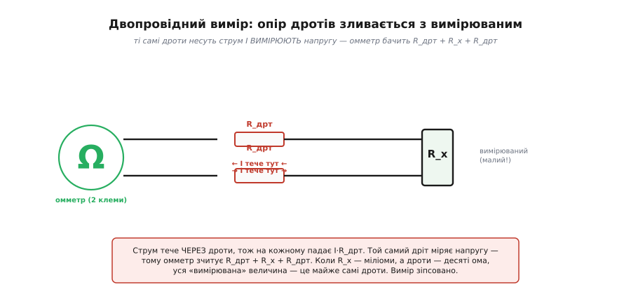
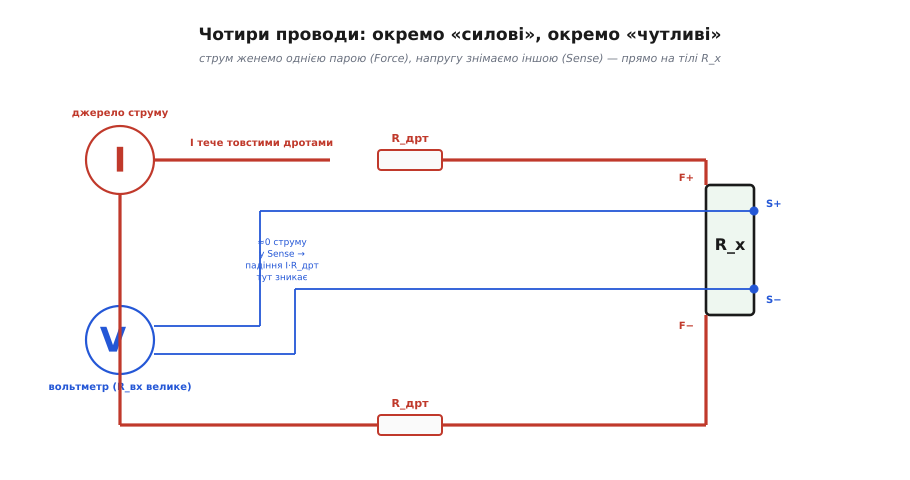
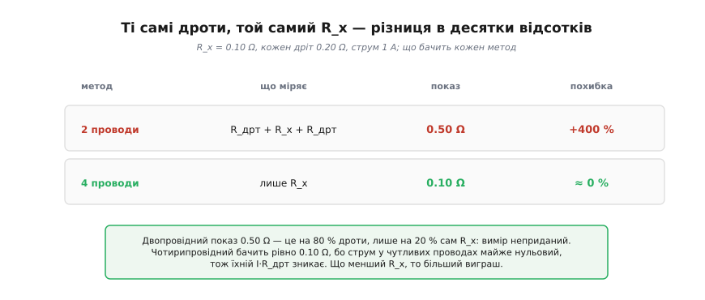
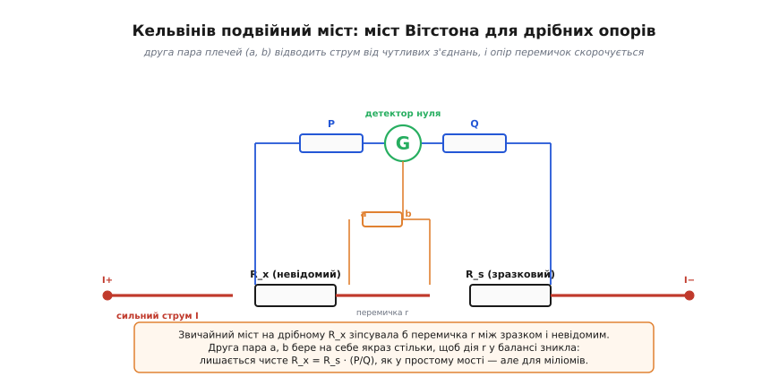

# Чотирипровідне (Кельвінове) підключення

Спробуйте зміряти омметром опір товстого мідного дроту чи ніжки запобіжника — і прилад покаже якісь 0.3 Ω, хоча сам дріт має від сили кілька міліомів. Дивно? Ні: ви зміряли не дріт, а власні щупи й контакти. Це не вада конкретного приладу, а пастка самого способу під'єднання у два проводи. І щойно опір, який ви хочете знати, стає **малим** — мілі- чи мікроомним шунтом, обмоткою, доріжкою плати, перехідним опором роз'єму, — двопровідний вимір просто розвалюється. Чотирипровідне (Кельвінове) підключення — це напрочуд просте інженерне рішення, яке прибирає цю пастку повністю: воно розводить струм і вимір по **різних** парах проводів, і опір дротів та контактів зникає з результату, ніби його не було.

> 🔧 **Навіщо це.** Скрізь, де треба точно знати малий опір: вимір струму через мілі-омний шунт у блоці живлення, термометрія на платиновому RTD, перевірка зварного чи паяного з'єднання, опір обмотки двигуна, ESR конденсатора, опір контакту реле. У всіх цих задачах дроти й контакти співмірні з вимірюваним або й більші за нього — і без Кельвінового під'єднання цифри будуть просто неправдою.

## Чому два проводи брешуть на малому опорі

Щоб зміряти опір, прилад робить дві речі: **проганяє** крізь нього відомий струм і **міряє** напругу, що на ньому впала. За [законом Ома](root:hw-analog/ohms-law) тоді R = U/I. У простому омметрі обидві дії покладено на **одну й ту саму** пару проводів — ті, що несуть струм до зразка, ними ж і вимірюють напругу. Ось тут і ховається біда.

Дроти й контакти — не ідеальні. Кожен щуп, кожна клема, кожен метр дроту має свій маленький [опір R_дрт](root:hw-components/resistor): метр тонкого мідного дроту — це десь 0.05 Ω, перехідний опір підпружиненого контакту чи затиснутого «крокодила» — легко 0.01…0.1 Ω, а часом і більше. Поки ви міряєте кілоом, ці частки ома непомітні. Та коли вимірюваний R_x сам лежить у міліомах, картина перевертається.


*Один і той самий провід несе струм І ВИМІРЮЄ напругу. Струм І тече крізь обидва дроти, на кожному падає І·R_дрт — і це падіння сидить точно між клемами приладу, у тому самому контурі, що й R_x. Тому омметр чесно складає все, що між його щупами: R_дрт + R_x + R_дрт. Коли R_x — міліоми, а дроти — десяті ома, показ — це майже самі дроти.*

Простежмо ланцюжок. Струм І, який жене прилад, тече по верхньому дроту, крізь R_x, повертається нижнім дротом. На кожному дроті він спричиняє падіння напруги І·R_дрт — це просто [закон Ома](root:hw-analog/ohms-law) для дроту. А тепер ключова думка: прилад міряє напругу **на своїх клемах**, тобто на всьому, що опинилося між щупами. А між щупами послідовно сидять три речі: верхній дріт, зразок, нижній дріт. Їхні падіння додаються за [законом напруг Кірхгофа](root:hw-analog/kvl):

```
U_показ = І·R_дрт + І·R_x + І·R_дрт = І·(R_x + 2·R_дрт).
```

Поділивши на І, прилад покаже не R_x, а R_x + 2·R_дрт. Дроти **послідовні** з зразком, тож їхній опір неминуче входить у відповідь. Доки R_дрт ≪ R_x — нічого страшного; та коли вони співмірні, вимір втрачає сенс. Жодне калібрування приладу тут не врятує: похибка не в приладі, а в тому, що ми попросили **одні** проводи водночас і живити, і вимірювати.

## Хитрість: розвести струм і вимір

Корінь біди — суміщення двох ролей в одній парі проводів. Тож рішення напрошується саме собою: **дати кожній ролі свою пару**. Одна пара проводів («силова», англ. *force*) хай тільки несе струм. Друга пара («чутлива», англ. *sense*) хай тільки знімає напругу — і знімає її **не на клемах приладу, а прямо на тілі зразка**, якомога ближче до самого R_x, поза дротами, що несуть струм. Разом виходить **чотири** проводи на двокінцевий зразок — звідси й назва.


*Силова пара (товсті червоні дроти F+, F−) несе весь струм. Чутлива пара (тонкі сині S+, S−) під'єднана до тіла R_x ближче, ніж силова, і йде до вольтметра з дуже великим вхідним опором. Через чутливі проводи струм майже не тече — отже, падіння І·R_дрт на них дорівнює майже нулю, і вольтметр бачить чисту напругу на самому R_x.*

Чому цей фокус працює — варто зрозуміти до кінця, бо все тримається на одній тонкощі. Напругу знімає **вольтметр**, а добрий вольтметр має дуже великий вхідний опір — мегаоми, а в АЦП мікроконтролера й більше. Тому крізь чутливі проводи тече **мізерний** струм — наносампери. А раз струм у них майже нульовий, то й падіння напруги на їхньому власному опорі за тим самим законом Ома майже нульове: І_крихітний·R_дрт ≈ 0. Опір чутливих проводів **є**, але він ні на що не впливає, бо по ньому нічого не тече. Вольтметр через них «дотягується» до самих точок на тілі R_x і міряє напругу точно між ними:

```
U_sense = І·R_x      (бо падіння на чутливих проводах ≈ 0).
```

А що ж сталося з опором **силових** проводів, який нас губив? Він нікуди не подівся — на них так само падає І·R_дрт. Але тепер це падіння опинилося **поза** ділянкою, яку міряє вольтметр: чутливі щупи під'єднані **ближче до R_x**, ніж силові, тож падіння на силових дротах лишається ззовні й у вимір не входить. Ми не прибрали опір дротів — ми **винесли** його туди, де він уже не заважає. Опір R_x тоді — просто:

```
R_x = U_sense / І.
```

Ось і вся ідея. Знаючи струм І, який жене силова пара, і напругу U_sense, яку зняла чутлива пара прямо з тіла зразка, дістаємо чистий R_x без жодної домішки дротів і контактів. Чотири проводи замість двох — і похибка від з'єднань зникає.

## Подивимось на числа

Абстрактно «опір дротів зникає» звучить добре, але масштаб виграшу варто відчути на конкретних цифрах.


*R_x = 0.10 Ω, кожен дріт 0.20 Ω, струм 1 А. Двопровідний метод складає все між щупами — 0.50 Ω, тобто похибка +400 %. Чотирипровідний бачить рівно 0.10 Ω, бо чутливі проводи струму майже не несуть. Що менший R_x проти дротів — то нищівніший програш двопровідного й то цінніший чотирипровідний.*

**Умова: вимірюємо R_x = 0.10 Ω; кожен з'єднувальний дріт має R_дрт = 0.20 Ω; вимірювальний струм І = 1 А.**

```
Двопровідний метод:
  U_показ = І·(R_x + 2·R_дрт) = 1 · (0.10 + 0.40) = 0.50 В
  R_показ = U_показ / І = 0.50 / 1 = 0.50 Ω
  похибка = (0.50 − 0.10) / 0.10 = +400 %     ← бачимо вчетверо більше!

Чотирипровідний метод:
  U_sense = І·R_x = 1 · 0.10 = 0.10 В   (падіння на чутливих дротах ≈ 0)
  R_x     = U_sense / І = 0.10 / 1 = 0.10 Ω
  похибка ≈ 0 %
```

Двопровідний прилад показав 0.50 Ω замість 0.10 Ω — учетверо більше, і лише п'ята частина показу справді належить зразкові. Решта — дроти. Чотирипровідний дав точну десяту ома. І зверніть увагу: виграш тим більший, чим **менший** R_x проти дротів. Для кілоомного резистора 0.4 Ω дротів — це похибка в соту частку відсотка, і морочитися з чотирма проводами немає сенсу. А для мікроомного шунта ті самі дроти — це похибка в тисячі відсотків, і Кельвінове під'єднання стає єдиним способом узагалі щось зміряти.

> 🔧 **Навіщо це.** У блоках живлення струм часто міряють, ставлячи в його шлях крихітний **шунт** на кілька міліомів і знімаючи з нього напругу. Якби напругу знімали з тих самих доріжок, що несуть десятки ампер, падіння на міді доріжок зіпсувало б усе. Тому точні шунти роблять **чотирививідними**: дві широкі лапи під струм і дві тонкі — під вимір прямо з тіла резистивного елемента. Те саме — у вимірювальних резисторах (*current sense*) і прецизійних еталонах опору.

## Де це справді потрібно

Чотирипровідне під'єднання — не лабораторна екзотика, а буденний прийом усюди, де опір малий або де треба висока точність.

**Вимір струму через шунт.** Найпоширеніший випадок у силовій електроніці: щоб дізнатися струм, ставлять відомий малий опір і міряють напругу на ньому. Шунт на 1 мΩ під струмом 10 А дає лише 10 мВ — і будь-яка домішка опору доріжок чи паяння спотворила б це вщент. Кельвінові виводи знімають саме ці 10 мВ із тіла шунта.

**Платинові термометри (RTD).** Опір платинового чутливого елемента [пливе з температурою](root:ph-condensed/resistivity) — типовий Pt100 має 100 Ω при 0 °C і змінює опір на якісь 0.385 Ω на кожен градус. До давача нерідко йдуть метри дроту, чий опір (та ще й сам залежний від температури вздовж траси) додав би до тих 100 Ω кілька зайвих омів — тобто десятки градусів брехні. Тому точні RTD під'єднують **чотирипровідно** (а в дешевших вузлах — трипровідно, що частково компенсує дроти симетрією). Спорідненою симетрією, до речі, бореться з опором дротів і [міст Вітстона](root:hw-sensing/wheatstone-bridge): у точних мостових схемах опір ліній уводять у сусідні плечі так, щоб він скоротився.

**Перевірка з'єднань і провідників.** Опір зварного шва, обтиснутого наконечника, контакту реле, паяного з'єднання, доріжки чи перемички на платі — усе це міліоми, які можна зміряти лише чотирипровідно. Прилад, що так працює, звуть **мікроомметром**; його щупи часто мають по два контакти кожен — окремо силовий і чутливий, притиснуті в одній точці. Такі здвоєні затискачі так і звуть — **кельвінові кліпси**.

**Еталони й калібрування.** Зразкові резистори в метрології роблять чотирививідними принципово: лише так їхнє номінальне значення визначене **без** невизначеного внеску виводів. Два виводи задають струм, два — точку відліку напруги, і опір самого резистивного тіла стає однозначним.

## Кельвінів подвійний міст: той самий принцип у мості

[Міст Вітстона](root:hw-sensing/wheatstone-bridge) — чудовий спосіб точно зміряти опір через порівняння, але на **дрібних** опорах він спотикається об ту саму перешкоду: коротка перемичка між зразковим і невідомим опором та опір самих з'єднань стають співмірними з вимірюваним і псують баланс. Саме цю біду й розв'язав **Вільям Томсон (лорд Кельвін)**, додавши до звичайного мосту **другу пару плечей**. Так народився **Кельвінів подвійний міст** (*Kelvin double bridge*) — мостова схема для опорів **менших за ом**, аж до мікроомів.


*Невідомий R_x і зразковий R_s стоять у потужній струмовій гілці (товсті червоні дроти). Звичайні плечі відношення P, Q (сині) знімають напругу та живлять детектор нуля G — як у мості Вітстона. Уся новизна — друга пара плечей a, b (помаранчева) навколо перемички між R_x і R_s: вона відводить рівно стільки струму, щоб опір перемички й з'єднань у балансі скоротився. У рівновазі лишається чисте R_x = R_s·(P/Q), як у простому мості, але вже придатне для міліомів.*

Думка та сама, що й у чотирьох проводах: треба **відокремити** ділянки, які несуть великий струм, від ділянок, де знімають напругу для порівняння. Звичайні плечі відношення P і Q знімають потенціали так само, як у [мості Вітстона](root:hw-sensing/wheatstone-bridge), а додаткова пара a, b бере на себе струм перемички так, що в умові балансу її опір зникає. Підбираючи R_s до нуля на детекторі, дістаємо

```
R_x = R_s · (P/Q),
```

— ту саму формулу, що й у простому мості, але тепер чесну й для опорів у тисячні частки ома, де звичайний міст давно б збився. Десятиліттями такі мости були головним знаряддям для еталонних шунтів і калібрування малих опорів у метрологічних лабораторіях, поки їх не потіснила цифрова техніка — яка, втім, усередині робить те саме чотирививідне порівняння.

> 📜 Чому Кельвін узагалі взявся за цю задачу, як він підступився до похибки звичайного мосту й чому під'єднання у чотири проводи назвали його іменем — у вставці [Кельвін і вимір дрібних опорів](root:hw-sensing/kelvin-connection/hist-kelvin-four-wire.md).

## Що тут легко зробити не так

Сила методу — у тому, **де** саме чутливі проводи торкаються зразка, і пара дрібниць може все звести нанівець.

Чутливі контакти мусять бути **ближче до тіла** R_x, ніж силові, — **всередині** від них. Якщо переплутати й під'єднати чутливий щуп **поза** силовим, то ділянка дроту між ними знову опиниться у вимірюваному контурі, і ви повернете собі ту саму похибку, від якої тікали. Правило просте: струм заходить **зовні**, напругу знімають **зсередини**, на самому зразку.

Через чутливі проводи має текти **якомога менший** струм — інакше їхній І·R_дрт перестане бути нехтовно малим. Тому на чутливому вході потрібен вольтметр (чи вхід АЦП) із дійсно великим вхідним опором; навантажувати чутливу пару чимось низькоомним не можна.

Чотири проводи прибирають опір **дротів і контактів**, але не роблять самі по собі диво з шумом і дрейфом. На дрібних напругах (ті самі 10 мВ із шунта) починають даватися взнаки **термо-ЕРС** у місцях стику різнорідних металів і власний шум підсилювача. Тому точний чотирипровідний вимір нерідко роблять, **перевертаючи** напрям струму й усереднюючи два покази, — так стала термо-ЕРС віднімається. Це вже тонкощі прецизійної схемотехніки, але знати про них варто: Кельвінове під'єднання прибирає одне велике джерело похибки, проте не звільняє від решти.

## Підсумок

Двопровідний вимір опору хибить тим, що **одні** проводи водночас несуть струм і вимірюють напругу, тож опір дротів і контактів неминуче додається до вимірюваного — і на малому R_x ця домішка з'їдає весь результат. Чотирипровідне (Кельвінове) під'єднання розводить ці дві ролі: **силова** пара жене струм, **чутлива** пара знімає напругу прямо з тіла зразка, а оскільки крізь неї струм майже не тече, її власний опір у вимір не входить. Лишається чистий R_x = U_sense / І — без дротів і контактів. Та сама думка, перенесена в мостову схему, дає **Кельвінів подвійний міст** для опорів менших за ом. Запам'ятайте суть — «струм і вимір по різних проводах, напругу знімаємо зсередини, на самому зразку» — і вам стане прозорим усе сімейство точних вимірів малого опору: від шунтів і термометрів до еталонів і перевірки зварних швів.
