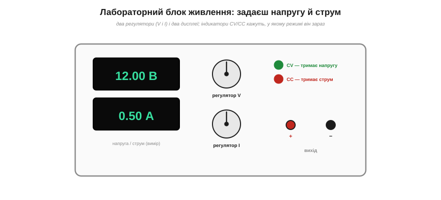
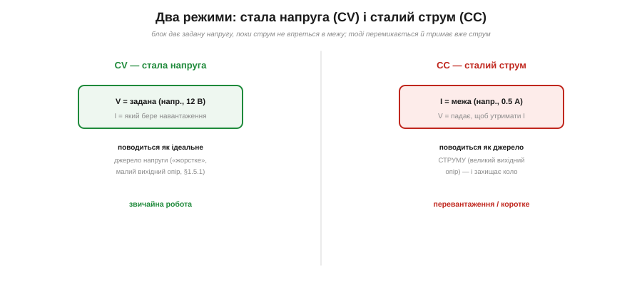
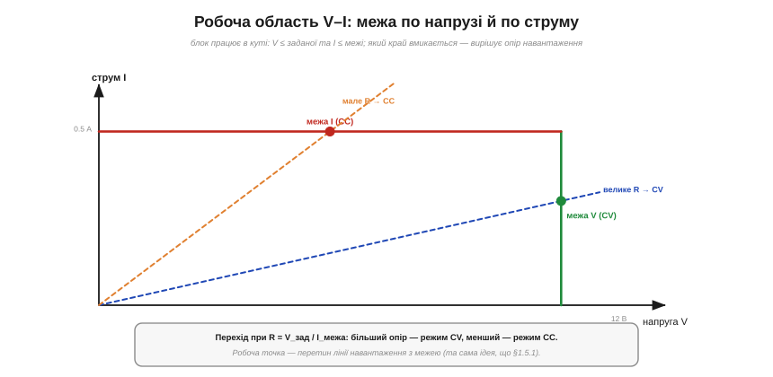
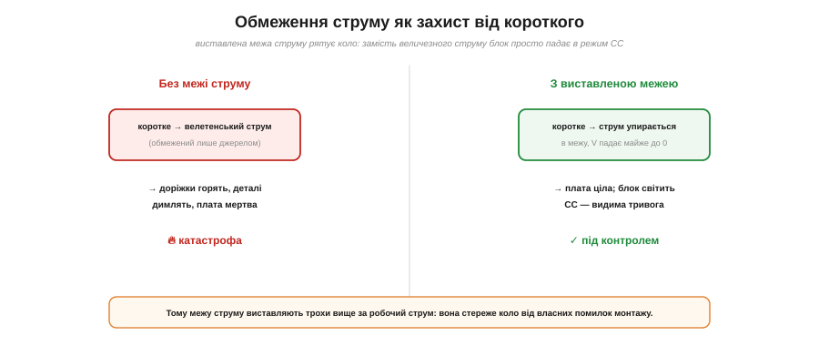
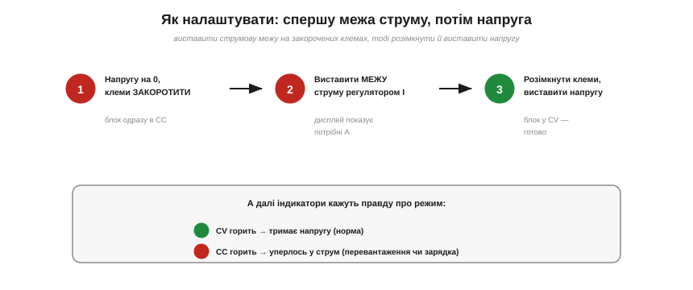
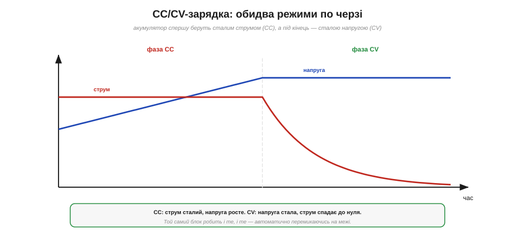

# Лабораторний блок живлення: режими CC/CV

Більшість приладів на столі — [мультиметр](root:hw-sensing/multimeter), [осцилограф](root:hw-sensing/oscilloscope), [логічний аналізатор](root:hw-sensing/logic-analyzer) — лише **міряють**. Та потрібен і той, хто **живить**: дає схемі струм для роботи. Найгірший варіант — батарейка: напруга фіксована, під навантаженням [просідає](root:hw-analog/internal-resistance), а коротке замикання вона зустрічає велетенським струмом. Куди кращий — **лабораторний блок живлення**: регульоване, стабільне й **захищене** джерело, яке дає рівно ту напругу, що ви задали, і не дасть схемі спалити себе. Його визначальна риса — **два режими**, CV і CC, між якими він перемикається **сам**.

### Що це і навіщо

*Лабораторний блок живлення: два дисплеї показують **виміряні** напругу й струм на виході, два регулятори задають їхні **межі**, а індикатори **CV/CC** кажуть, у якому режимі прилад зараз. Знизу — вихідні клеми «+» і «−».*

Блок живлення — це джерело, у якого ви крутите **дві ручки**: одну для напруги, другу для струму. Два дисплеї весь час показують, що **насправді** виходить на клемах. На відміну від батареї з її фіксованою ЕРС і [внутрішнім опором](root:hw-analog/internal-resistance), лабораторний блок **регульований** (став будь-яку напругу від нуля до максимуму), **стабільний** (тримає її незалежно від навантаження — це «жорстке» джерело з малим вихідним опором) і, найважливіше, **захищений**: ви можете обмежити струм, який він віддасть, і це рятує і вашу схему, і сам прилад. Саме поєднання регульованості, стабільності й захисту й робить його серцем будь-якого робочого столу.

Тут варто одразу засвоїти головне непорозуміння новачка: дві ручки задають **межі**, а не «силу». Типовий настільний блок має діапазон, скажімо, 0–30 В і 0–5 А; та коли ви виставили «12 В і 1 А», це не означає, що в схему попливе ампер. Це означає «дай **до** 12 вольтів і **до** одного ампера». Скільки струму візьметься насправді — вирішить **навантаження** за законом Ома, а блок лише не дасть перевищити жодну з двох стель. Зрозумівши це «до», ви вже на півдорозі до правильного користування приладом: одна стеля захищає схему від завеликої напруги, друга — від завеликого струму, а між ними блок сам знаходить чесну робочу точку під ваше навантаження.

### Дві межі, два режими: CV і CC

Ключ до розуміння блока — думка, що ви задаєте не одне число, а **дві межі** одразу: межу **напруги** й межу **струму**. Прилад чесно намагається віддати задану напругу, але **не перевищуючи** заданого струму. Залежно від того, яка межа спрацьовує першою, він і опиняється в одному з двох режимів.

*Два режими. CV (стала напруга): блок тримає задану напругу, а струм — який візьме навантаження (до межі). CC (сталий струм): якщо навантаження хоче більше струму за межу, блок не може втримати напругу й **падає** в режим, де тримає вже струм, а напругу знижує. Перший — звичайна робота, другий — захист при перевантаженні чи коротко.*

У режимі **CV** (*constant voltage*, стала напруга) блок поводиться як [ідеальне джерело напруги](root:hw-analog/internal-resistance): тримає на клемах рівно задану напругу, а струм бере таким, який потрібен навантаженню. Підключили опір — потече струм за законом Ома, і блок його спокійно віддасть, не змінюючи напруги. Це **звичайний** режим роботи: ви задали 5 В — на схемі рівно 5 В, скільки б помірного струму вона не споживала.

А тепер уявіть, що навантаження хоче **забагато** струму — більше за виставлену межу. Скажімо, ви виставили межу 0.5 А, а підключили опір, що за заданої напруги тягнув би цілий ампер. Блок опиняється перед суперечністю: утримати напругу він може лише ціною струму понад межу, а цього йому **заборонено**. І він робить розумне: **жертвує напругою**. Він **знижує** її рівно настільки, щоб струм усівся точно на межі 0.5 А, — і переходить у режим **CC** (*constant current*, сталий струм). Тепер це вже не джерело напруги, а джерело **струму**: воно тримає сталим струм, а напруга — яка вийде. Перехід цей **автоматичний**: блок сам стежить за обома межами й перемикається тієї ж миті, щойно струм упреться в стелю.

Підставмо числа, щоб відчути обидва режими. Хай ви виставили 5 В і межу 0.5 А. Підключаєте резистор 100 Ω: за законом Ома струм був би 5/100 = 0.05 А — це менше за межу, тож блок спокійно тримає **5 В**, дисплей струму показує 50 мА, світиться **CV**. Тепер підключаєте 5 Ω: за повних 5 В струм мав би бути цілий ампер — а це вдвічі понад межу! Блок не пускає стільки: він знижує напругу до 0.5 А × 5 Ω = **2.5 В**, дисплей струму завмирає рівно на 0.5 А, спалахує **CC**. Та сама пара ручок, те саме джерело — а поведінка протилежна, бо опір навантаження перетнув критичну межу.

### Робоча область V–I і де проходить межа

Обидва режими гарно вкладаються в одну картинку — **робочу область** блока на площині «напруга–струм».

*Блок працює всередині прямокутного кута: напруга не вища за задану (вертикальний край — режим CV), струм не вищий за межу (горизонтальний край — режим CC). Робоча точка — там, де лінія навантаження (нахил 1/R) перетинає цей кут. Велике R виводить на край CV, мале — на край CC; перехід точно в куті, при R = V_зад/I_межа.*

Дві ваші межі окреслюють на площині V–I **прямокутний кут**: вертикальна стінка при заданій напрузі (вище неї блок не підніме напругу — це межа CV) і горизонтальна стеля при межі струму (вище неї не пустить струм — це межа CC). А де саме опиниться робоча точка, вирішує **навантаження**: пряма [лінія навантаження](root:hw-analog/internal-resistance) V = I·R виходить із початку координат із нахилом, що залежить від опору, і впирається в один із країв кута.

Велике R дає пологу лінію, що впирається у **вертикальний** край — блок у CV, віддає задану напругу. Мале R дає круту лінію, що впирається у **горизонтальну** стелю — блок у CC, тримає межу струму. А точно на **зламі** двох режимів — там, де лінія проходить просто через **кут**, — опір дорівнює R = V_зад / I_межа. Це і є та межа, що відділяє «нормальне» навантаження від «завеликого»: опір більший за неї — CV, менший — CC. Уся поведінка блока — це той самий **перетин лінії навантаження з [характеристикою джерела](root:hw-analog/internal-resistance)**, тільки характеристика тут має форму кута, а не похилої прямої.

Для нашого прикладу (5 В, 0.5 А) злам припадає на R = 5/0.5 = **10 Ω**. Будь-який опір **понад** 10 Ω кладе робочу точку на вертикальний край — блок у CV; будь-який **менший** — на горизонтальну стелю, блок у CC. Резистор 100 Ω (≫10 Ω) — звісно, CV; резистор 5 Ω (<10 Ω) — звісно, CC. Один погляд на цей кут — і ви наперед знаєте, в якому режимі опиниться блок під будь-яким навантаженням.

### Межа струму як захист від короткого

Найкорисніша риса всього блока — саме **межа струму**, бо вона перетворює його на захисника вашої схеми.

*Без виставленої межі струму коротке замикання тягне велетенський струм — доріжки горять, деталі димлять. З виставленою межею струм упирається в стелю, напруга падає майже до нуля, блок іде в CC — і плата ціла, а індикатор CC світить як видима тривога.*

Уявіть найгірше: ви припаялися не туди, і десь у схемі **коротке замикання**. Звичайне джерело (чи батарея) зустріло б його велетенським струмом — доріжки спалахнули б, деталі задиміли, плата загинула б за мить (це той самий [руйнівний струм короткого](root:hw-analog/internal-resistance)). А лабораторний блок із виставленою межею струму реагує інакше: струм упирається в стелю, блок **падає в CC**, знижуючи напругу мало не до нуля, — і більше за виставлену межу в схему не піде **жодного** зайвого ампера. Плата ціла, а ви бачите засвічений індикатор **CC** — наочний сигнал «щось не так, струм уперся в межу».

Звідси найважливіша звичка роботи з блоком: **завжди виставляйте межу струму** трохи вище за очікуваний робочий струм схеми. Тоді будь-яка ваша помилка монтажу — закоротка, переплутаний вивід, несправна деталь — упреться в цю межу, а не спалить плату. Межа струму — це, по суті, миттєвий регульований [запобіжник](root:embedded/fuses-ptc), тільки без перегоряння: спрацював — зменшив струм, прибрав причину — і працюй далі.

Особливо ця звичка рятує при **першому ввімкненні** нової плати. Ви не знаєте напевне, чи нема в монтажі помилки, тож виставляєте межу струму **низькою** — лише трохи вище за очікуване споживання. Вмикаєте: якщо все добре, блок у CV, струм у нормі, плата живе. Якщо ж десь закоротка чи переплутаний вивід — блок одразу падає в CC, струм не злітає, нічого не димить, а ви спокійно вимикаєте й шукаєте помилку. Без блока з межею струму перша ж груба похибка коштувала б спаленої плати; з ним вона коштує лише засвіченої лампочки CC.

### Як налаштувати

З цього випливає й правильний **порядок** налаштування — спершу струм, потім напруга.

*Налаштування у три кроки: 1) напругу на нуль і клеми закоротити (блок одразу в CC); 2) виставити потрібну межу струму регулятором I; 3) розімкнути клеми й виставити робочу напругу — блок переходить у CV. Далі індикатори чесно кажуть режим.*

Послідовність така. Спершу опустіть напругу до нуля й **закоротіть** вихідні клеми перемичкою — блок одразу опиниться в CC (струм упреться в нуль-щось). Тепер регулятором струму виставте **межу**, яку хочете, — дисплей струму покаже саме її. Тоді приберіть перемичку (клеми розімкнені, струм нуль) і регулятором напруги виставте робочу **напругу** — блок перейде в CV. Готово: ви задали і стелю струму, і робочу напругу, і прилад захищений.

А під час роботи правду про режим кажуть **індикатори**. Світиться **CV** — блок тримає напругу, усе нормально. Світиться **CC** — струм уперся в межу: або ви свідомо так хотіли (зарядка, світлодіод), або десь перевантаження чи закоротка, і час перевіряти схему. Привчіться кидати оком на ці лампочки — вони безкоштовно попереджають про біду.

Є й обережніший прийом для зовсім незнайомої схеми — **повільний підйом напруги**. Замість одразу виставити робочі 12 В, ви піднімаєте напругу від нуля **поступово**, не зводячи очей із дисплея струму. Поки струм росте плавно й розумно — усе гаразд, ведіть напругу далі. А якщо на якійсь напрузі струм раптом **стрибнув** чи вперся в межу — стоп: десь проблема, далі піднімати не варто. Так ви ловите біду на малій напрузі, де вона ще не встигла нічого спалити, — і це чи не найбезпечніший спосіб «оживляти» нову плату.

### CC/CV у житті: зарядка й світлодіоди

Може здатися, що CC — лише аварійний режим. Та насправді сталий струм — повноцінний робочий інструмент, і обидва режими часто працюють **по черзі**.

*Класична CC/CV-зарядка акумулятора: спершу фаза CC — блок жене сталий струм, а напруга на батареї поволі росте; коли вона сягне заданої межі, блок переходить у фазу CV — тримає напругу, а струм сам спадає до нуля в міру заряджання. Один блок робить обидві фази, автоматично перемикаючись.*

Найкласичніше застосування — **зарядка акумулятора** за профілем «CC, потім CV». Спершу блок у режимі CC жене в батарею **сталий** струм, і її напруга поволі росте. Щойно вона дотягнеться до заданої межі напруги, блок перемикається в CV: тепер він тримає **сталу** напругу, а струм сам поступово спадає до нуля, поки батарея доповнюється. Один прилад робить обидві фази — і саме так заряджають літієві акумулятори (тому й мікросхеми-зарядники звуть «CC/CV»).

Сталий струм потрібен і для **світлодіодів**. Світлодіод [нелінійний](root:hw-analog/ohms-law): його яскравість визначає **струм**, а вольт-амперна крива така крута, що мізерна зміна напруги дає величезну зміну струму. Живити його сталою напругою небезпечно — трохи завелика, і струм злетить, LED згорить. А режим CC задає рівно потрібний струм, і яскравість стабільна. Тому блок живлення в режимі CC — зручний спосіб і запалити світлодіод, і виміряти його характеристику.

Та й узагалі режим CC — це готова лабораторна «крапельниця струму». Хочете зняти [вольт-амперну криву](root:hw-components/diode-iv-curve) діода — задавайте струм і читайте напругу, точка за точкою. Хочете перевірити, як просідає батарея під відомим навантаженням, чи прогріти деталь сталою потужністю на витривалість — знову CC. А CV-режим тим часом живить ваші щоденні досліди: мікроконтролер, датчик, макетну плату. Один прилад покриває обидві потреби — «дай рівно стільки вольтів» і «жени рівно стільки ампер», — і саме тому він такий універсальний.

### Тонкощі робочого столу

Кілька деталей, що відрізняють упевнене користування від наївного. По-перше, **виносні щупи напруги** (*sense*): у точних блоках є окрема пара клем, що міряє напругу просто **на навантаженні**, а не на виході блока, — і прилад автоматично компенсує спад на довгих дротах живлення. Це рідня [«кельвінівському» 4-провідному підключенню](root:hw-components/resistor): силові дроти несуть струм, сенсорні — міряють напругу там, де треба. По-друге, **вихідний опір** блока різний у двох режимах: у CV він дуже малий (джерело «жорстке», майже не просідає), у CC — навпаки, дуже великий (поводиться як джерело струму). По-третє, **тепло**: простий («лінійний») блок розсіює всередині потужність (V_вх − V_вих)·I у [тепло](root:ph-electromagnetism/joule-heating) — звідси його радіатори й вентилятори; «імпульсні» блоки ефективніші, зате трохи «брудніші» за шумом. Блоки можна й **з'єднувати**: послідовно — для більшої напруги, паралельно — для більшого струму, а «трекінгові» дають симетричну пару ± для аналогових схем. І нарешті, корисні дві кнопки, що є на кращих приладах: **«вихід увімк./вимк.»** — щоб виставити напругу й струм наперед, а вже потім **подати** їх на схему одним натиском (а не «крутити наживо» під підключеним навантаженням); і **захист від перенапруги** (*OVP*) — стеля, перевищивши яку, блок миттю вимикає вихід, рятуючи схему, якщо ви ненароком крутнули напругу надто високо. Дрібні зручності, та саме вони бережуть деталі від випадкових помилок руки.

> 🔧 **Навіщо це.** Лабораторний блок живлення — серце робочого столу, бо це **чисте, регульоване й захищене** джерело замість випадкової батарейки. Уся його хитрість — у двох режимах: CV робить його джерелом **напруги**, CC — джерелом **струму**, а перемикається він між ними сам, щойно струм упреться в задану межу. Тому головна звичка — **виставляти межу струму**: вона стереже вашу схему (і прилад) від коротких замикань і помилок монтажу, як миттєвий запобіжник. І завжди дивіться на лампочки CV/CC: вони безкоштовно й миттєво кажуть, нормально все (CV) чи щось тягне забагато (CC). Маючи такий блок і вміючи його налаштувати, ви живите будь-який дослід безпечно — це чи не найважливіший прилад на столі інженера-початківця.
