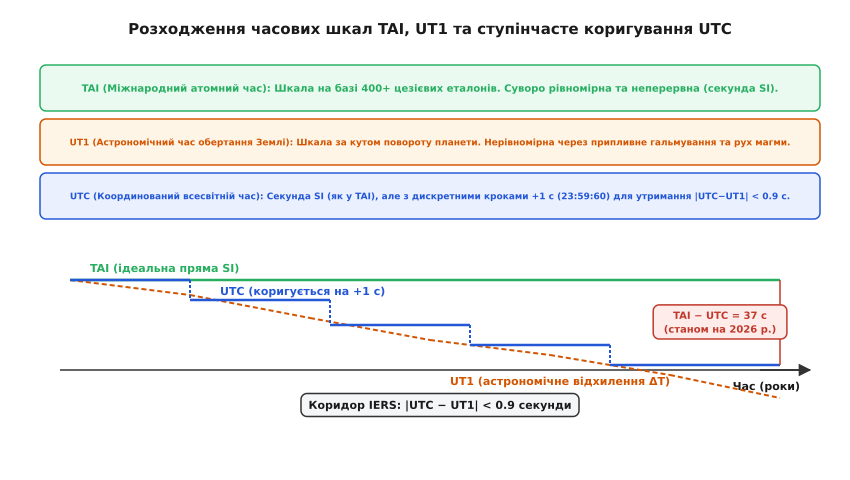
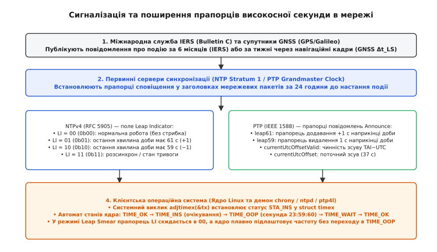
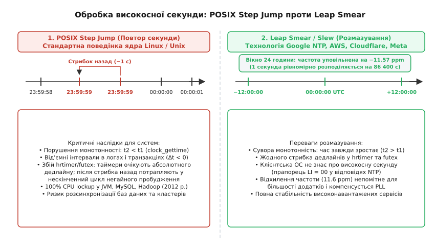

# Високосна секунда

<preknowlist>
- [Мітки часу](root:sf-distributed/timestamps) — формати подання часу, розрізнення монотонного та календарного годинників.
- [NTP: мережева синхронізація часу](root:com-protocol/ntp-sync) — ієрархія шарів Stratum, синхронізація через пакети та алгоритм Марзулло.
- [PPS-імпульс](root:hw-sensing/pps-pulse) — формування секундних міток апаратними генераторами та супутниковими приймачами.
</preknowlist>

Обертання Землі навколо власної осі не є строго рівномірним процесом: гравітаційна взаємодія з Місяцем і Сонцем породжує океанські припливи, чиє тертя об морське дно невпинно гальмує обертання планети, подовжуючи тривалість астрономічної доби приблизно на `1.7–2.3 мілісекунди` за кожне століття. До цього вікового тренду додаються непередбачувані сезонні збурення, викликані перерозподілом мас в атмосфері, таненням полярних льодовиків та конвекцією рідкого металевого ядра Землі.

Коли у 1967 році 13-та Генеральна конференція мір і ваг зафіксувала секунду Міжнародної системи одиниць (SI) як рівно `9 192 631 770` періодів випромінювання атома цезію-133, тривалість доби виявилася жорстко прив'язаною до квантового стандарту. Оскільки реальна доба нашої планети на той момент уже тривала приблизно `86 400.002` цезієвих секунд, щоденне накопичення крихітного запізнення обертання призводило до того, що астрономічний полудень (момент найвищого стояння Сонця) щороку зміщувався відносно показів атомних годинників майже на одну повну секунду.

Для подолання цього розриву у 1972 році було створено шкалу координованого всесвітнього часу (UTC), яка запровадила механізм періодичної дискретної вставки додаткової **високосної секунди** (англ. *leap second*), що позначається як `23:59:60 UTC`. Проте рішення, покликане синхронізувати людські годинники з рухом світил, стало джерелом масштабних аварій у розподілених обчислювальних мережах, реляційних базах даних та операційних системах.

---

### Геофізичні фактори нерівномірності обертання Землі

Обертання планети Земля як твердого тіла підпорядковується фундаментальному закону збереження моменту імпульсу, проте Земля не є абсолютно жорсткою сферою. Її динаміка визначається складною взаємодією літосфери, гідросфери, атмосфери та рідкого залізо-нікелевого ядра. Відхилення швидкості обертання формуються чотирма основними фізичними механізмами:

По-перше, припливне гальмування (англ. *tidal friction*). Гравітаційне поле Місяця створює припливні горби в океанах. Через добове обертання Землі ці горби зміщуються вперед відносно лінії, що з'єднує гравітаційні центри Землі та Місяця. Гравітаційне тяжіння зміщеної водної маси створює постійний гальмівний момент, який сповільнює обертання планети та водночас передає кутовий момент орбітальному руху Місяця, змушуючи його повільно віддалятися від Землі зі швидкістю близько `3.8 см` на рік. Потужність припливної дисипації енергії в мілководних шельфових морях (Беринговому, Охотському, Північному) сягає приблизно `3.7 теравата`.

По-друге, сезонна атмосферна циркуляція та зональні вітри. Земна атмосфера постійно обмінюється кутовим моментом із літосферою через турбулентне тертя вітру об океанську поверхню та динамічний тиск повітряних мас на гірські системи (зокрема Скелясті гори та Анди). Сезонний перерозподіл повітряних мас між північною та південною півкулями, коливання потужності субтропічних струменевих течій (Jet Streams) та глобальні кліматичні аномалії (такі як фази Ель-Ніньйо та Ла-Нінья, ENSO) здатні змінювати миттєву тривалість доби (Length of Day, LOD) на величину до `±1 мілісекунди` протягом кількох тижнів.

По-третє, гляціоізостазія та кліматичний перерозподіл гідросфери. Постгляціальне підняття земної кори після танення льодовикових щитів останнього зледеніння супроводжується сучасним таненням полярних шапок Гренландії та Антарктиди. Переміщення трильйонів тонн води від полюсів до екваторіальних широт змінює полярний момент інерції Землі `I_zz`. Зменшення полярного стиснення відповідно до закону збереження імпульсу викликає сповільнення або прискорення обертання.

По-четверте, магнітогідродинамічні процеси в рідкому ядрі планети. Конвективні вихори розплавленого заліза та нікелю у зовнішньому ядрі Землі, а також торсійні коливання на межі ядро–мантія (Core-Mantle Boundary) створюють декадні коливання швидкості обертання на масштабах від 10 до 50 років. Саме ці глибинні геодинамічні процеси призвели до того, що в період з 2016 по 2024 рік вікове сповільнення Землі тимчасово компенсувалося внутрішнім прискоренням, через що IERS не оголосила жодної високосної секунди за вісім років поспіль.

---

### Розкол часових шкал: TAI, UT1 та компроміс UTC

У сучасній метрології та телекомунікаціях співіснують кілька принципово різних шкал часу, кожна з яких оптимізована під власне коло фізичних або інженерних задач.

```
                    ┌────────────────────────────────────────┐
                    │  TAI (Міжнародний атомний час)         │
                    │  • Суворо неперервна фізична шкала     │
                    │  • Еталонна частота цезію-133          │
                    │  • Без розривів і стрибків             │
                    └──────────────────┬─────────────────────┘
                                       │
                                       │  TAI − UTC = 37 с (дискретні кроки)
                                       ▼
┌───────────────────────────┐      ┌────────────────────────────────────────┐
│  UT1 (Астрономічний час)   │ <──> │  UTC (Цивільний координований час)     │
│  • Орієнтація Землі в     │ DUT1 │  • Секунда SI (як у TAI)               │
│    просторі (кут повороту)│ <0.9с│  • Стрибки +1 с (23:59:60) за IERS     │
│  • Нерівномірний рух      │      │  • Шкала операційних систем і мереж    │
└───────────────────────────┘      └────────────────────────────────────────┘
```

1. **TAI (Міжнародний атомний час, фр. *Temps Atomique International*):**
   Шкала часу, яка формується Міжнародним бюро мір і ваг (BIPM) на основі зваженого усереднення показів понад 400 первинних цезієвих та водневих стандартів частоти, розташованих у десятках метрологічних лабораторій світу. TAI є абсолютно неперервною, монотонною фізичною шкалою: вона ніколи не зупиняється, не прискорюється штучно і не містить жодних стрибків чи пропусків.

2. **UT1 (Всесвітній астрономічний час):**
   Шкала часу, безпосередньо прив'язана до кута обертання Землі відносно позагалактичних радіоджерел (квазарів) методом радіоінтерферометрії з наддовгою базою (VLBI — англ. *Very Long Baseline Interferometry*). За визначенням, полудень за шкалою UT1 настає в момент перетину Сонцем Гринвіцького меридіана. Через нестабільність обертання Землі швидкість ходу шкали UT1 постійно коливається.

3. **UTC (Координований всесвітній час, англ. *Coordinated Universal Time*):**
   Глобальний цивільний стандарт часу, затверджений Рекомендацією ITU-R TF.460-1. UTC поєднує стабільність секунди SI шкали TAI з прив'язкою до астрономічного положення Сонця шкали UT1.

Різниця між астрономічним часом та координованим часом позначається як `DUT1`:

```
DUT1 = UT1 − UTC      [похибка між астрономічним та цивільним часом]
```

Міжнародний стандарт вимагає, щоб абсолютна величина цієї похибки не перевищувала встановленого допуску:

```
|DUT1| < 0.9 секунди      [критерій введення високосної секунди за регламентом IERS]
```

Якщо за даними астрономічних спостережень значення `DUT1` наближається до межі `-0.9 с` (Земля відстає від атомного часу), Міжнародна служба обертання Землі та систем відліку (IERS, Париж) видає офіційний бюлетень *Bulletin C*, який призначає введення додатної високосної секунди.


*Порівняння неперервного атомного часу TAI, геофізичного часу UT1 та ступінчастої шкали цивільного часу UTC з коридором допуску IERS.*

Докладніше про становлення цезієвого стандарту, відмову від ефемеридного часу та півстолітню історію метрологічних дебатів викладено у вставці [Історія появи високосної секунди та суперечки довкола її скасування](root:hw-sensing/leap-second/hist-leap-second-origins.md).

---

### Протокол додавання секунди: незвичайна хвилина `23:59:60`

Коригування шкали UTC призначається на кінець останньої доби півріччя — переважно на **30 червня** або **31 грудня** о 23:59:59 UTC (теоретично стандарт дозволяє корекцію наприкінці березня або вересня, проте на практиці IERS жодного разу цим не скористалася).

У разі додатної корекції остання хвилина доби подовжується на одну секунду і налічує рівно 61 секунду:

```
23:59:58 UTC
23:59:59 UTC
23:59:60 UTC  <── Високосна секунда (Leap Second)
00:00:00 UTC  <── Початок наступної доби
```

Якщо швидкість обертання Землі раптово зросте (як це спостерігалося в окремі місяці 2020–2022 років через внутрішні геодинамічні процеси), може знадобитися від'ємна високосна секунда. У такому разі секунда `23:59:59` просто видаляється, і після `23:59:58` відразу настає `00:00:00` наступного дня (хвилина довжиною 59 секунд). За всю історію застосування UTC з 1972 року від'ємна секунда не вводилася жодного разу.

#### Шкали часу глобальних супутникових систем (GNSS)
Щоб уникнути збоїв у розрахунку орбіт та навігаційних рівнянь, більшість супутникових систем використовують власні безперервні атомні шкали часу, які не містять високосних секунд:
* **GPS Time:** стартував 6 січня 1980 року. На той момент різниця `TAI - UTC` становила 19 секунд. GPS-час іде паралельно з TAI із постійним зсувом: `TAI - GPS = 19 секунд`. Відносно UTC шкала GPS випереджає цивільний час рівно на різницю високосних секунд, введених після 1980 року (станом на 2026 рік: `GPS - UTC = 18 секунд`).
* **Galileo System Time (GST):** європейська система, повністю синхронізована з GPS-часом на рівні наносекунд (`GST - UTC = 18 с`).
* **BeiDou Time (BDT):** китайська система, стартувала 1 січня 2006 року (`BDT - UTC = 4 с`).
* **ГЛОНАСС (GLONASS Time):** російська система, єдина у світі, чий системний час жорстко прив'язаний до шкали UTC(SU) і безпосередньо містить стрибки високосних секунд, що неодноразово спричиняло збої бортових приймачів під час корекцій.

Параметри поправки між внутрішнім часом сузір'я та UTC (величина `Δt_LS` та час запланованого введення) постійно передаються в навігаційному кадрі супутників, дозволяючи GNSS-приймачам коректно транслювати цивільний час для споживачів.

---

### Сигналізація в мережевих протоколах: прапорці NTP та PTP

Щоб клієнтські пристрої, сервери та базові станції могли завчасно підготуватися до нестандартної 61-секундної хвилини, протоколи мережевої синхронізації передбачають механізми попереднього сповіщення.


*Ланцюг сповіщення про високосну секунду: від астрономічного бюлетеня IERS через заголовки NTP/PTP до автомата станів ядра операційної системи.*

#### 1. Network Time Protocol (NTPv4, RFC 5905)
Заголовок кожного NTP-пакета містить 2-бітне поле **Leap Indicator (LI)**:
* `00` (`0b00`, `LI_NONE`): нормальний режим роботи, корекція наприкінці доби відсутня.
* `01` (`0b01`, `LI_PLUSSEC`): попередження про те, що остання хвилина доби міститиме **61 секунду** (+1 с).
* `10` (`0b10`, `LI_MINUSSEC`): попередження про те, що остання хвилина доби міститиме **59 секунд** (−1 с).
* `11` (`0b11`, `LI_ALARM`): аварійний стан — сервер розсинхронізований із первинним еталоном.

Первинні NTP-сервери (Stratum 1), підключені до атомних годинників або GNSS-приймачів, виставляють прапорець `LI = 01` у вихідних пакетах за **24 години** до настання події (опівночі UTC перед початком коригувальної доби). Клієнти, отримуючи цей прапорець, сповіщають ядро операційної системи.

#### 2. Precision Time Protocol (PTP, IEEE 1588-2019)
У протоколі мікросекундної синхронізації IEEE 1588 повідомлення типу `Announce` від генератора Grandmaster Clock передають службове поле прапорців `flagField` та параметри шкали часу:
* `leap61`: бітовий прапорець, що сигналізує про вставку +1 секунди наприкінці доби UTC.
* `leap59`: бітовий прапорець вилучення однієї секунди.
* `currentUtcOffsetValid`: підтвердження чинності значення зсуву між неперервною шкалою TAI та цивільною UTC.
* `currentUtcOffset`: знакове ціле число, що вказує поточну різницю в секундах (наприклад, `37`).

Повний опис структур ядра, системних викликів та масок прапорців протоколів наведено у вставці [Системні прапорці та структури керування високосною секундою в POSIX та ядрі Linux](root:hw-sensing/leap-second/api-posix-leap-flags.md).

---

### Анатомія системного збою: колізія POSIX та колапс таймерів ядра

Незважаючи на наявність протокольних прапорців, обробка високосної секунди операційними системами виявилася вразливою на фундаментальному архітектурному рівні.

#### Колізія стандарту POSIX (Unix Timestamp)
Стандарт POSIX (IEEE Std 1003.1) визначає системний час Unix (`time_t`) як кількість цілих секунд, що минули з 00:00:00 UTC 1 січня 1970 року (Unix Epoch). При цьому стандарт встановлює жорстке правило: **кожен день у поданні часу POSIX налічує рівно 86 400 секунд**:

```
SecondsSinceEpoch = DayNumber · 86400 + Hour · 3600 + Minute · 60 + Second
```

Стандарт POSIX принципово не має синтаксису чи числового значення для секунди `23:59:60`. Значення `Second` може приймати лише діапазон від `0` до `59`.

Щоб узгодити реальність із математикою стандарту, творці Unix реалізували обробку секунди через повторення таймштампу:

```
Реальний час UTC      Unix Timestamp (time_t)     Поведінка годинника CLOCK_REALTIME
23:59:58 UTC    ──>   1341100798             ──>  Звичайний хід часу
23:59:59 UTC    ──>   1341100799             ──>  Звичайний хід часу
23:59:60 UTC    ──>   1341100799 (повтор!)   ──>  Стрибок на 1 с назад (Time Step)
00:00:00 UTC    ──>   1341100800             ──>  Поновлення відліку нової доби
```

Такий дискретний стрибок (`POSIX Step Jump`) породжує дві катастрофічні проблеми:

#### 1. Порушення монотонності часу (`t₂ < t₁`)
Для будь-якої програми, що використовує системний годинник календарного часу `clock_gettime(CLOCK_REALTIME)` або функцію `gettimeofday()`, два послідовні виклики повертають значення, де час наступної події виявляється меншим за час попередньої:

:::tabs
```c
struct timespec t1, t2;
clock_gettime(CLOCK_REALTIME, &t1);
// ... настання високосної секунди 23:59:60 ...
clock_gettime(CLOCK_REALTIME, &t2);

double delta = (double)(t2.tv_sec - t1.tv_sec) + (double)(t2.tv_nsec - t1.tv_nsec) * 1e-9;
// delta стає ВІД'ЄМНОЮ (наприклад, -0.995 секунди)!
```
```cpp
const auto t1 = std::chrono::system_clock::now();
// ... настання високосної секунди 23:59:60 ...
const auto t2 = std::chrono::system_clock::now();

const std::chrono::duration<double> delta = t2 - t1;
// delta.count() стає ВІД'ЄМНИМ (наприклад, -0.995 секунди)!
```
:::

Якщо програмне забезпечення розраховує тривалість операції, таймаут блокування, порядок транзакцій у журналі баз даних (WAL) або послідовність повідомлень у розподіленому консенсусі Raft/Paxos, від'ємне значення `Δt < 0` викликає аварійне завершення процесу (`assertion failure`), зациклення або розсинхронізацію реплік.

#### 2. Зависання futex та колапс ядра Linux (Баг 2012 року)
Найбільш руйнівна аварія сталася 30 червня 2012 року через помилку взаємодії підсистеми високоточних таймерів ядра Linux (`hrtimer`) та механізму швидких користувацьких блокувань `futex` (Fast Userspace Mutex).

Механізм роботи `futex` при виклику з таймаутом (наприклад, `pthread_cond_timedwait` у C/C++ або `LockSupport.parkNanos` у Java JVM) передає ядру абсолютний час дедлайну на основі `CLOCK_REALTIME`. Ядро створює структуру таймера `hrtimer` і розміщує її в червоно-чорному дереві запланованих подій:

```
[Черга hrtimer ядра]
   Поточний час: 23:59:59.990
   Дедлайн потоку: 23:59:59.995 (таймаут через 5 мс)
   
───> НАСТАННЯ ВИСОКОСНОЇ СЕКУНДИ: ядро викликає timekeeping_leap_insert()
     Системний час CLOCK_REALTIME раптово скидається назад на 1.000 с:
     Поточний час стає: 23:59:59.000
```

У версіях ядра Linux до 3.4 функція обробки високосної секунди скидала системний час, але не викликала оновлення внутрішнього зсуву базового таймера `hrtimer_get_softirq_time()`. 

Внаслідок цього:
1. Ядро вважало, що час очікування таймера минув, і надсилало сигнал пробудження потоку.
2. Потік процесу (наприклад, пул потоків Java JVM або сервер MySQL) прокидався, перевіряв умову блокування, бачив, що дедлайн ще не досягнуто, і знову викликав `futex()`.
3. Ядро негайно знову повертало керування через розсинхронізовані внутрішні лічильники.
4. Процеси входили в нескінченний цикл негайного виклику та повернення `futex` без пауз на сон, миттєво завантажуючи всі доступні ядра процесора на **100% CPU**.

Через цей баг у ніч на 1 липня 2012 року одночасно вийшли з ладу тисячі серверів по всьому світу.

---

### Наслідки для розподілених систем, фінансових ринків та авіації

Руйнівний вплив стрибка високосної секунди поширюється далеко за межі окремих серверів і зачіпає критичні галузі світової цифрової економіки.

#### 1. Розподілені бази даних та моделі консистентності
Сучасні розподілені сховища даних вимагають строгого впорядкування подій у просторі та часі (Linearizability):

* **Google Spanner та TrueTime API:** Архітектура глобально розподіленої СУБД Google Spanner спирається на програмно-апаратний комплекс TrueTime, який надає інтервал невизначеності часу `[t_earliest, t_latest]`. Для забезпечення серіалізованості транзакцій без блокування віддалених реплік Spanner використовує протокол Commit Wait: транзакція чекає час `2 · ε` (де `ε` — максимальна похибка часу в датацентрі). Стрибок часу назад під час високосної секунди миттєво порушує інваріанти TrueTime, що змусило Google першою у світі відмовитися від крокових коригувань на користь технології розмазування.
* **Гібридні логічні годинники (Hybrid Logical Clocks, HLC):** СУБД CockroachDB, MongoDB та Cassandra використовують комбінацію фізичного часу та логічного лічильника подій `(physical_time, logical_counter)`. Коли системний фізичний час стрибає на 1 секунду назад, логічний лічильник змушений безперервно інкрементуватися для кожної нової транзакції протягом усієї секунди, щоб зберегти причинно-наслідковий порядок (Causality). Це призводить до переповнення лічильників та штучного завищення затримок реплікації.
* **Генерація унікальних ключів (UUID v1, Snowflake, ULID):** Популярні генератори унікальних ідентифікаторів кодують поточний таймштамп у старших бітах первинного ключа. Повторення секунди призводить до генерації дублікатів ідентифікаторів у високонавантажених сервісах або викликає аварійне завершення процесу з помилкою відкату годинника.

#### 2. Фінансові біржі та регуляторні норми MiFID II
У сфері високочастотного алгоритмічного трейдингу (High-Frequency Trading, HFT) мікросекунди визначають черговість виконання угод у біржовому стакані (Order Book).

Директива Європейського Союзу **MiFID II (RTS 25)** встановлює суворі юридичні вимоги до синхронізації торговельних систем:
* Для шлюзів прямого доступу до ринку (DMA) максимальне відхилення міток часу від еталона UTC не повинно перевищувати `100 мікросекунд` із роздільною здатністю міток `1 мікросекунда`.
* Для високочастотних алгоритмів генерації заявок похибка синхронізації не повинна перевищувати `100 наносекунд`.
* **Сувора монотонність є обов'язковою вимогою закону.** Якщо через стрибок високосної секунди підтвердження виконання заявки (Execution Report) отримає раніший таймштамп, ніж момент надходження самої заявки (Order Placement), біржа вважається технічно недієздатною, а її ліцензія підлягає перегляду регулятором. Через це провідні світові біржі (CME, NASDAQ, ICE, LSE) призупиняють торги під час настання високосних секунд.

#### 3. Авіаційні системи та управління повітряним рухом
Системи автоматичного залежного спостереження ADS-B (Automatic Dependent Surveillance-Broadcast) транслюють просторові координати повітряних суден, прив'язані до атомного часу GNSS. Наземні радари та бортові системи попередження зіткнень TCAS розраховують вектор швидкості літака за формулою похідної координат за часом:

```
v = Δr / Δt      [розрахунок просторової швидкості літака]
```

Якщо бортовий комп'ютер інтерпретує час через шкалу зі стрибком назад (`Δt < 0` або `Δt ≈ 0`), розрахована швидкість зближення літаків миттєво прямує до нескінченності, що викликає хибне спрацьовування сигналізації небезпечного зближення та аварійні команди пілотам на екстрене маневрування.

---

### Технологія розмазування: Leap Smearing / Slew

Щоб назавжди захистити користувацькі програми від стрибків часу та порушення монотонності, інженери Google у 2011 році розробили альтернативний підхід, який згодом став стандартом для світових хмарних платформ — **розмазування високосної секунди** (англ. *Leap Smear* або *Leap Slew*).


*Дискретний повтор секунди за стандартом POSIX проти плавного 24-годинного розмазування частоти генератора в сучасних хмарних платформах.*

#### Фізичний принцип розмазування
Замість того, щоб чекати опівночі та стрибком скидати секунду назад, сервер часу штучно змінює частоту свого тактового генератора на крихітну величину протягом тривалого вікна (зазвичай 24 години: 12 годин до опівночі і 12 годин після опівночі).

Якщо розподілити 1 секунду похибки на інтервал тривалістю `T = 86 400 с` (доба), необхідне відносне відхилення частоти `Δf / f` становитиме:

```
y = − (1.0 с / 86400 с) ≈ −1.1574 · 10⁻⁵ = −11.574 ppm
```

Величина `11.57 ppm` (мільйонних часток) є абсолютно мізерною: для порівняння, звичайний кварцовий резонатор комп'ютерної материнської плати має власний температурний дрейф у межах `±20...50 ppm`.

#### Переваги технології розмазування:
1. **Сувора монотонність:** похідна системного часу завжди строго додатна (`dt / dt_real > 0`). Годинник ніколи не повертається назад.
2. **Прозорість для клієнтів:** NTP-сервер розмазування навмисно встановлює прапорець **`LI = 00`** у своїх пакетах. Клієнтська операційна система вважає, що отримує абсолютно точний звичайний час, і не намагається виконувати власні стрибки ядра.
3. **Стабільність таймерів:** механізми `hrtimer`, `futex`, таймери баз даних та планувальники задач працюють у штатному режимі без ризику зациклення.

#### Порівняння лінійного та косинусного розмазування:
* **Лінійний дрейф (Linear Smear):** частота годинника миттєво знижується на `-11.574 ppm` на початку вікна і повертається назад наприкінці. Недоліком є різкий стрибок прискорення на межах вікна.
* **Гладкий піднесений косинус (Google Smooth Slew):** частота змінюється плавно за тригонометричним законом `y(t) = -(ΔΦ / T)(1 - cos(2π t / T))`. Пікове уповільнення в середині доби досягає `-23.15 ppm`, проте перша похідна частоти залишається неперервною, що запобігає перехідним коливанням у контурах фазового автопідстроювання (PLL).

#### Практика провідних хмарних платформ:
* **Google Public NTP (`time.google.com`):** використовує 24-годинне вікно від полудня до полудня (`12:00 UTC -> 12:00 UTC`) з піднесеним косинусним профілем розмазування.
* **Amazon Time Sync Service (`169.254.169.123`):** здійснює 24-годинне лінійне розмазування безпосередньо через апаратні контролери AWS Nitro/SmartNIC у кожному інстансі EC2.
* **Cloudflare NTP (`time.cloudflare.com`):** надає розмазаний час у межах 24-годинного вікна для глобальної мережі доставки вмісту (CDN).
* **Meta NTP:** використовує скорочене 17-годинне вікно розмазування (від 00:00 до 17:00 UTC), оптимізоване під внутрішній цикл синхронізації серверів баз даних.

> 🔧 **Навіщо це.**
> У виробничих інфраструктурах високої доступності (High Availability clusters, Kubernetes, Cassandra, PostgreSQL) використання NTP-серверів зі смірингом (наприклад, Google Public NTP `time.google.com`, AWS Time Sync Service `169.254.169.123` або Cloudflare `time.cloudflare.com`) повністю усуває загрозу падіння сервісів під час високосних секунд.
> 
> Проте категорично **заборонено змішувати** сервери зі смірингом та сервери зі стандартним стрибком (наприклад, класичний `pool.ntp.org`) в одній конфігурації `chrony.conf`: у середині вікна розмазування різниця між ними досягає `0.5 секунди`, через що фільтр NTP визнає одне з джерел хибним (*falseticker*) і відкине його з контуру синхронізації.

Повний математичний апарат, розрахунок похідних дрейфу частоти та інтегралів фази наведено у вставці [Математика розмазування секунди: лінійні та тригонометричні профілі частоти](root:hw-sensing/leap-second/math-leap-smear.md), а приклад робочого демона керування частотою ядра Linux — у вставці [Програмне коригування годинника та емуляція розмазування секунди в Linux](root:hw-sensing/leap-second/proj-leap-smear-slew.md).

#### Профілі PTP у телекомунікаціях (ITU-T G.8275.1 та G.8275.2)
У стільникових мережах 4G LTE-TDD та 5G NR синхронізація базових станцій (gNodeB) вимагає фазової точності кращої за `±1.5 мікросекунди`. Для цього застосовуються спеціалізовані телекомунікаційні профілі PTP:
* **Профіль ITU-T G.8275.1:** працює на канальному рівні Ethernet (Layer 2 multicast) з повною апаратною підтримкою на кожному проміжному комутаторі (Boundary Clock). Генератор Grandmaster передає шкалу PTP/TAI, а базові станції локально перераховують час у UTC за допомогою параметра `currentUtcOffset`. Під час високосної секунди лінія зв'язку залишається абсолютно монотонною, а зміна зсуву відбувається строго за розкладом.
* **Профіль ITU-T G.8275.2:** працює поверх маршрутизованих мереж IP/UDP (Layer 3 unicast) з частковою апаратною підтримкою. У цьому профілі джитер мережевих черг може спотворювати момент застосування прапорця `leap61`, через що сучасні базові станції використовують буферизацію оновлень на базі локальних рубідієвих або термостатованих (OCXO) генераторів.

#### Специфіка та загрози від'ємної високосної секунди (Negative Leap Second)
Хоча всі 27 високосних секунд з 1972 року були додатними, теоретична можливість введення від'ємної секунди (`23:59:58 -> 00:00:00`) становить ще більшу загрозу для програмного забезпечення.

Якщо додавання секунди перевірялося на практиці багаторазово, то від'ємна секунда ніколи не тестувалася в реальних глобальних умовах:
1. **Пропуск інтервалів у планувальниках:** Під час видалення секунди `23:59:59` будь-які періодичні задачі в демонах `cron`, таймерах `systemd.timer` або чергах повідомлень, заплановані рівно на цю секунду, будуть мовчки пропущені ядром і не виконаються ніколи.
2. **Розрив монотонності в інший бік:** Програми, що очікують строго неперервного потоку секунд `...58, 59, 00...`, фіксують пропуск кванту часу, що викликає збої в алгоритмах екстраполяції траєкторій, цифрових фільтрах Калмана та підсистемах моніторингу затримок (Round-Trip Time).

#### Апаратні мережеві карти та PTP Hardware Clock (PHC)
У високопродуктивних мережах фіксація міток часу здійснюється безпосередньо на фізичному рівні (PHY або MAC) мережевого адаптера з точністю до одиниць наносекунд (Hardware Timestamping). Вбудований апаратний годинник мережевої карти (PTP Hardware Clock, пристрій `/dev/ptp0`) функціонує за неперервною шкалою TAI.

Коли операційна система отримує системний час від PHC, драйвер виконує апаратне перехресне стробування (Cross-timestamping). Під час високосної секунди апаратний лічильник мережевої карти продовжує монотонний відлік без зупинок, а корекція UTC транслюється виключно на рівні математичного перетворення зміщення в ядрі.

---

### Фінал епохи: скасування високосних секунд до 2035 року

Півстоліття експлуатації механізму високосних секунд переконливо довели: спроба узгодити дискретні цифрові системи з геофізичною нестабільністю планети створює невиправдані ризики для глобальної інфраструктури. Збитки від системних аварій у фінансовому секторі, авіації та зв'язку багаторазово перевищили витрати на коригування телескопів.

У листопаді 2022 року 27-ма Генеральна конференція мір і ваг (CGPM) ухвалила історичну **Резолюцію 4**, до якої у 2023 році приєднався Міжнародний союз електрозв'язку (ITU-R Резолюція 655). 

Основні положення реформи:
1. **Збільшення допуску:** чинний ліміт різниці між астрономічним та атомним часом (`|DUT1| < 0.9 с`) скасовується. Нову межу буде встановлено на рівні орієнтовно від 1 хвилини до 1 години.
2. **Мораторій на 100 років:** починаючи не пізніше **2035 року**, регулярне додавання поодиноких високосних секунд призупиняється щонайменше на одне століття.
3. **Пакетні коригування:** розглядається можливість одноразового коригування шкали UTC на одну високосну хвилину або годину раз на 50–100 років за спеціальним узгодженим регламентом.

Це рішення знаменує остаточну перемогу неперервного, суворо монотонного цифрового часу над географічною прив'язкою до обертання Землі, перетворюючи шкалу UTC на єдиний стабільний метрологічний фундамент для технологій майбутнього.
