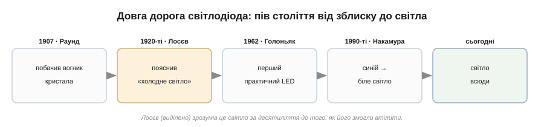
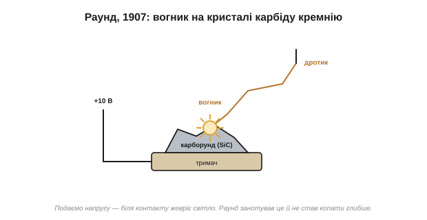
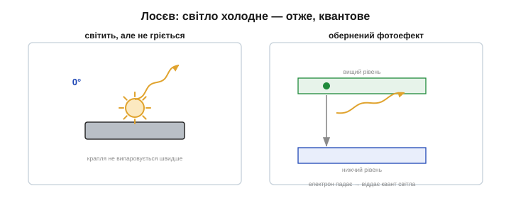
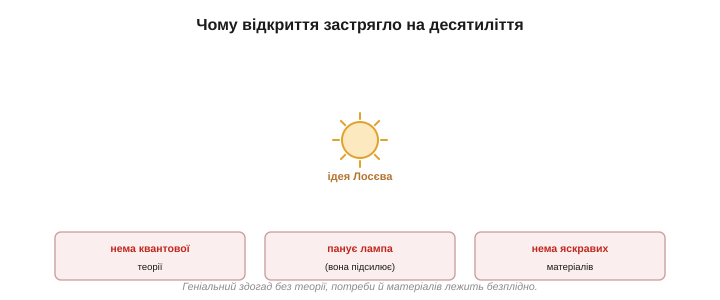
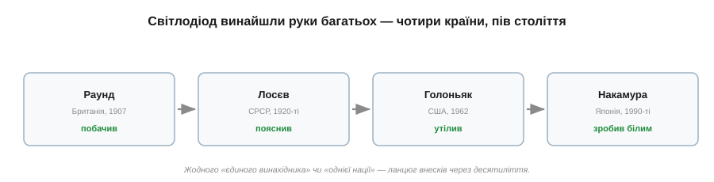

# 📜 Олег Лосєв і забутий світлодіод

> [Світлодіод](topic:hw-sensing/led-photodiode) здається винаходом нашої епохи — він на кожному екрані, у кожній лампі. Та насправді світіння кристала під струмом побачили **майже сто років тому**, а найглибше зрозумів його молодий радянський технік-самоук, чиє ім'я потім на десятиліття забули. Це історія про відкриття, що випередило свій час, і про людину, яка згоріла разом зі своєю епохою.

Клацніть вимикач — і світлодіод спалахує, тонкий і яскравий, наче втілення сучасних технологій. Але якби ви сказали радіоаматорові 1920-х, що кристал може світитися від струму, він би відповів: «Знаю, бачив». Бо світло холодного кристала вже тоді тримали в руках — і навіть зрозуміли, **чому** воно виникає, задовго до того, як світ навчився цим користуватися. Пройдімо цей довгий, із гіркою прогалиною посередині, шлях.

*Світлодіод винайшли не за раз. 1907-го світіння кристала випадково помітили; у 1920-х його глибоко вивчив і пояснив Олег Лосєв; та аж 1962 року з'явився перший практичний видимий світлодіод, а яскравий синій — лише в 1990-х. Між першим зблиском і всюдисущим світлом — пів століття.*

---

## Випадковий зблиск: Раунд, 1907

Усе почалося як дрібний курйоз. **1907 року** британський інженер **Генрі Джозеф Раунд** (*Henry Joseph Round*), що працював у компанії Марконі, бавився з кристалами карборунду (карбіду кремнію, SiC) — тими самими, що правили за [детектори в ранньому радіо](topic:ph-condensed/semiconductor/hist-diode.md). Притиснувши до кристала дротик і подавши напругу, він помітив дивне: біля контакту жеврів **жовтуватий вогник**. На 10 вольтах — ледь помітний, на 110 — яскравіший і в кількох кристалах.

Раунд описав це в коротенькій — на два абзаци — замітці в журналі *Electrical World* і... на тому облишив. Він був зайнятий радіо, а світіння каменю здавалося дивиною без застосування. Так сталося перше задокументоване **електролюмінесцентне** світло напівпровідника — і майже одразу про нього забули.

Тоді саме розгорталася доба раннього радіо, і кристалічні детектори були буденним інструментом — їх крутили тисячі радіоаматорів. На тлі гонитви за далеким радіозв'язком зеленкуватий вогник нікого не зачепив: він нічого не «ловив» і нічого не підсилював, тож здавався безкорисною дивиною. Раунд був практик і рушив далі — до своїх радіоламп та антен.

*Перше спостереження: тонкий дріт на кристалі карбіду кремнію під напругою — і біля точки контакту жевріє вогник. Раунд занотував це 1907 року як цікавинку й не став досліджувати далі.*

> 🔧 **Навіщо це.** Замітка Раунда — нагадування, що **побачити** явище й **зрозуміти** його — різні речі. Світло кристала бачили, але не знали ні чому воно, ні навіщо. Перший крок науки — помітити; та без другого кроку — пояснити й застосувати — відкриття лежить мертвим. Саме другий крок зробив зовсім інший чоловік, за тисячі кілометрів і півтора десятиліття потому.

---

## Лосєв розгадує «холодне світло»

**Олег Володимирович Лосєв** (*Oleg Losev*, 1903–1942) не мав ні університетського диплома, ні впливових покровителів — лише гострий розум і одержимість кристалами. Юнаком він улаштувався техніком до **Нижньогородської радіолабораторії** — першої радянської радіонаукової установи, — де під орудою Володимира Лебединського вивчав ті самі кристалічні детектори. І там, придивляючись до карборундових контактів, він помітив той самий зеленкуватий вогник, що й Раунд.

А ще раніше, близько 1922 року, юний Лосєв зробив інше диво. Він виявив, що деякі кристали (цинкіт) на певному режимі поводяться як **підсилювач** — здатні підсилювати й навіть генерувати радіосигнали без жодної лампи. Свій прилад він назвав **кристадином**. Це сколихнуло радіосвіт: про «принцип кристадина» писали навіть за океаном — адже кристал, що підсилює, був майже неймовірним, бо цю роль вважали виключно лампиною. По суті, Лосєв намацав крихту того, що через двадцять п'ять років дасть транзистор. Та й кристадин невдовзі забули: він був примхливий у налаштуванні, а лампа — надійніша.

Але, на відміну від Раунда, Лосєв **не відмахнувся**. Із **1923 по 1930 рік** він прискіпливо досліджував це світіння й опублікував близько півтора десятка статей. Найперше він довів головне: це світло **холодне** — не від розжарення. Лосєв навіть виміряв, чи швидше випаровується крапля бензину з поверхні кристала, коли той світиться, — і переконався, що ні: кристал **не гріється**. Отже, світло народжує не тепло, а щось інше. Дослід був простий і дотепний: якби світіння йшло від нагрівання, тепло пришвидшило б випаровування краплі — а швидкість не мінялася. Виходить, енергія йшла прямо у світло, **оминаючи** стадію тепла. Для лампи розжарення (де світло — побічний продукт жару) це було нечуване.

А що саме? Тут Лосєв зробив справжній стрибок думки. Він припустив, що пояснення — у новій тоді **квантовій** фізиці: світіння є, по суті, **оберненням фотоефекту**, що його 1905 року пояснив Альберт Ейнштейн. У фотоефекті світло вибиває з речовини електрон; а тут, навпаки, електрон, втрачаючи енергію, **народжує** квант світла. Це майже точна сучасна картина [світлодіода](topic:hw-sensing/led-photodiode) — за десятиліття до того, як з'явилися і теорія напівпровідників, і саме слово «світлодіод».

Лосєв навіть помітив, що світіння йде саме з тієї цятки контакту, яка **випрямляє** струм, — тобто пов'язав світло з тим самим однобічним переходом, що й детектування. Інтуїтивно він намацав зв'язок «перехід → світло», який тепер пояснюють через рекомбінацію на [PN-переході](topic:ph-condensed/pn-junction).

*Прозріння Лосєва: кристал світиться, але не гріється — отже, це не розжарення. Електрон, втрачаючи енергію, віддає її квантом світла — «навпаки до фотоефекту Ейнштейна». Це і є фізика світлодіода, вгадана в 1920-х.*

Лосєв пішов і далі: він будував із цих кристалів діючі прилади — джерела світла, керовані струмом, — і навіть передбачав, що такими «світловими реле» можна швидко передавати сигнали. По суті, він тримав у руках перший світлодіод і правильно розумів, як той працює. Він навіть запатентував «світлове реле» й передбачав, що такими приладами можна буде швидко передавати сигнали **світлом** — те, що сьогодні робить [оптоволокно](topic:com-medium/optical-fiber). Інженерна уява випереджала епоху на ціле покоління. Світ просто ще не був готовий це почути.

> 🔧 **Навіщо це.** Варто наголосити на справедливості: Лосєв — реальний, недооцінений першопрохідець. Він не просто «бачив вогник» (це до нього зробив Раунд), а **виміряв, пояснив і застосував** явище, причому пояснив правильно, спираючись на найсвіжішу фізику свого часу. Те, що він був самоуком-техніком із радянської провінції, не применшує внеску — навпаки, робить його ще разючим. Історія науки любить приписувати відкриття одному «генієві з нації-переможниці»; насправді ж світло кристала йшло до нас руками британця, росіянина й американців — про що далі.

---

## Чому світ не помітив

Як могло статися, що настільки глибоке відкриття пролежало під сукном десятиліттями? Збіглося відразу кілька причин — і це повчально саме по собі.

По-перше, **не було теорії**. Квантова теорія твердого тіла — [зонна модель](topic:ph-condensed/semiconductor), поняття щілини й [рекомбінації](topic:ph-condensed/pn-junction) — склалася лише у 1930-х. Лосєв геніально вгадав суть, але строго пояснити й, головне, **покращити** прилад без цієї теорії було неможливо.

По-друге, **не було потреби й суперника-переможця**: панувала **електронна лампа**. Вона вміла головне — **підсилювати** сигнал, [чого кристалічний детектор не міг](topic:ph-condensed/semiconductor/hist-diode.md). Навіщо світ мав би вкладатися в тьмяний зеленкуватий вогник, коли лампа робила все, що треба?

По-третє, **не було матеріалів**. Щоб світіння стало яскравим і корисним, потрібні чисті прямозонні напівпровідники, [придатні для світлодіода](topic:hw-sensing/led-photodiode), — а їх навчилися робити лише через десятиліття. Карборунд Лосєва світив ледь-ледь.

І нарешті — **ізоляція й мова**: праці Лосєва виходили російською (дещо перекладали німецькою), у відрізаній від світу країні, напередодні війни. Ідея впала в неготовий ґрунт.

*Три стіни, об які розбилося раннє відкриття: ще не було квантової теорії напівпровідників (нічим пояснити й покращити); панувала лампа, що вміла підсилювати; не було яскравих матеріалів. Геніальний здогад випередив свій час.*

---

## Блокада: обірване життя

Доля Лосєва — гірка. Коли 1928 року Нижньогородську лабораторію закрили, він перебрався до Центральної радіолабораторії в **Ленінграді**, а згодом, на запрошення видатного фізика **Абрама Йоффе**, працював у його Фізико-технічному інституті. Визнання все не приходило: ступінь кандидата наук йому присудили аж 1938 року, без формальної дисертації, — запізно, щоб змінити кар'єру. Інститут Йоффе був тоді колискою радянської фізики, серед його вихованців — майбутні світила; та Лосєв так і лишився в тіні, технічним співробітником без належного визнання й кафедри.

А потім настала війна. Восени 1941-го німці взяли Ленінград у **блокаду**, що забрала життя сотень тисяч людей, переважно від голоду. Лосєв відмовився покинути місто й своє обладнання — і **22 січня 1942 року помер від голоду** у віці 38 років. Де його поховано — невідомо. Подейкують, що в ті останні місяці він працював над приладом із трьома електродами на кристалі — тобто, по суті, наближався до **транзистора**, який винайдуть у США аж 1947-го. Той рукопис загубився в блокадному місті разом з автором.

Так обірвалися і життя, і ціла лінія відкриттів, що могла б змінити хід електроніки на роки. Це не привід для гасел — це привід пам'ятати: за сухими датами підручника стоять живі люди й трагедії їхнього часу.

---

## Світло повертається: Голоньяк, 1962

Минули десятиліття. Дозріла квантова теорія, навчилися вирощувати чисті сполуки галію, настала доба транзисторів — і ґрунт нарешті став готовий. **1962 року** американський інженер **Нік Голоньяк** (*Nick Holonyak*) у компанії General Electric створив **перший практичний видимий світлодіод** — червоний, на арсеніді-фосфіді галію (GaAsP). Ось тепер світлодіод по-справжньому «народився»: яскравий, надійний, придатний до масового виробництва. Голоньяка й називають батьком видимого світлодіода.

Чому саме тоді, а не за Лосєва? Бо нарешті зійшлося все, чого бракувало в 1920-х: зонна теорія підказувала, як підібрати щілину під потрібний колір; навчилися вирощувати чисті прямозонні кристали; а транзисторна промисловість дала і знання, і обладнання, і попит. Той самий здогад, що колись був безґрунтовним, тепер упав у родючу землю — і миттю проріс.

Далі все пришвидшилося: різні матеріали дали жовтий і зелений, а в 1990-х **Сюдзі Накамура** з колегами приборкав нітрид галію й дав [яскравий **синій**](topic:hw-sensing/led-photodiode/hist-blue-led.md), з якого вийшло біле світло — і почалася революція освітлення (Нобелівська премія 2014 року).

*Винахід світлодіода — колективний і міжнародний. Раунд (Британія) перший побачив; Лосєв (СРСР) перший пояснив і застосував; Голоньяк (США) перший зробив практичний видимий; Накамура (Японія) дав синій і біле світло. Жодного «єдиного винахідника» — ланцюг внесків через пів століття й чотири країни.*

А пріоритет Лосєва відкрили **заново** значно пізніше: історики науки розшукали його статті 1920-х і визнали, що цей забутий технік першим і виготовив, і правильно пояснив електролюмінесцентний прилад. Ім'я, стерте часом і обставинами, повернули в історію — туди, де воно й мало бути.

---

## Що з цього лишилось

Озирнімося на цю історію — і не лише на фізику, а й на її урок.

- **Світіння напівпровідника** (електролюмінесценція) — те, що побачив Раунд і зрозумів Лосєв, — це і є [робота світлодіода](topic:hw-sensing/led-photodiode): електрон віддає енергію квантом світла при [рекомбінації](topic:ph-condensed/pn-junction).
- **«Холодне світло»** — ключове спостереження Лосєва: світло не від тепла, а від кванта. Саме тому світлодіод такий ощадний проти лампи розжарення.
- **Відкриття — колективне й міжнародне.** Ніхто «один» не винайшов світлодіод: британець побачив, росіянин пояснив, американець утілив, японець зробив білим. Остерігайтеся розповідей про «єдиного генія» чи «винахід однієї нації» — наука майже завжди йде ланцюгом рук.
- **Ідея випереджає час.** Геніальний здогад без теорії, матеріалів і потреби лежить безплідно. Лосєв мав рацію — просто на пів століття зарано.
- **Визнання приходить пізно — але приходить.** Ім'я Лосєва повернули в історію через десятиліття після його смерті, коли історики науки розшукали ті статті 1920-х; сьогодні його згадують поряд із Раундом і Голоньяком як одного з першопрохідців світлодіода.

І останнє — людське. За кожним значком на схемі стоїть чиясь праця, а інколи й доля. Запалюючи світлодіод, варто інколи згадати молодого техніка, що першим зрозумів це світло й загинув від голоду в обложеному місті, не дочекавшись, поки світ оцінить його правоту. Його зеленкуватий вогник 1920-х і яскраве світло вашого екрана — одне й те саме явище, лише доведене до пуття іншими руками й іншою епохою.
