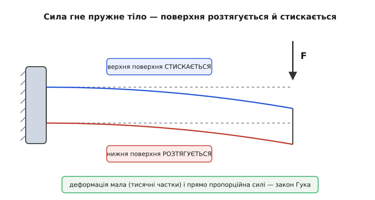
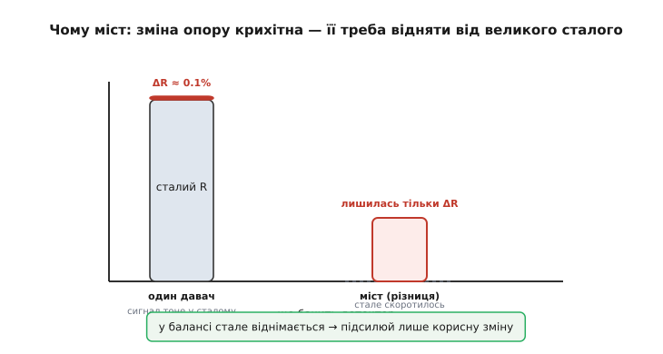
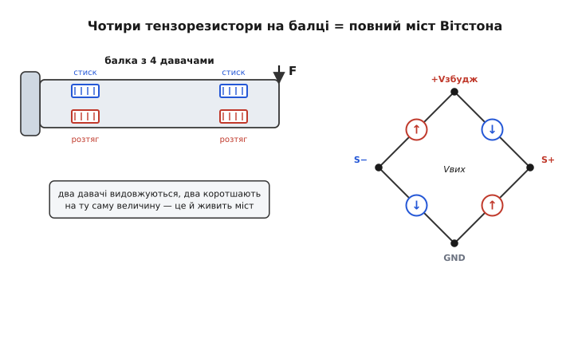
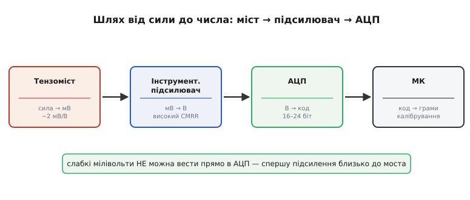
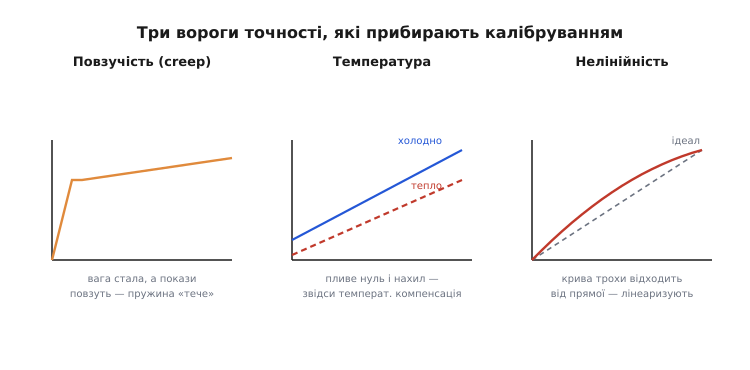

# Тензодавач сили (load cell)

Як зважити мішок цукру або зміряти, з якою силою тягне двигун? Силу не видно й не помацати приладом напряму — на відміну від напруги чи струму, для неї немає «вольтметра». Тож доводиться йти в обхід: спрямувати силу так, щоб вона **щось зробила** з матеріалом, а тоді зміряти вже наслідок. Саме на цьому стоїть **тензодавач сили** (англ. *load cell*, від *load* — навантаження і *cell* — комірка) — деталь, що перетворює силу або вагу на електричний сигнал. Він живе всередині кожної електронної ваги, у кранових динамометрах, у випробувальних стендах і в роботах, що мусять відчувати, з якою силою тиснуть. Назва «комірка навантаження» прижилася, бо це справді невеликий завершений вузол, у який «заходить» сила, а «виходить» напруга.

Розберемо його від самої першопричини: чому, щоб зміряти силу, спершу треба дати тілу **трохи прогнутися**.

### Перший крок: силу робимо деформацією

Пряме вимірювання сили неможливе, але є обхід через фізику пружного тіла. Будь-яке тверде тіло під навантаженням **деформується** — стискається, розтягується чи гнеться. Поки сила невелика, ця деформація **пружна**: тіло змінює форму рівно настільки, наскільки тисне сила, і повертається назад, щойно її прибрати. І найголовніше — деформація **прямо пропорційна** силі. Це закон Гука, і саме він робить вимірювання можливим: якщо я надійно зміряю, **наскільки** прогнулося тіло, то знатиму, **яка** сила його прогнула.

Тіло, спеціально зроблене, щоб передбачувано прогинатися під силою, називають **пружним елементом** (англ. *spring element*) — це серце давача. Зазвичай це шматок металу (алюмінієвого сплаву чи легованої сталі) хитрої форми: балка, кільце або стовпчик. Форму добирають так, щоб під робочою силою тіло гнулося на сталу, повторювану величину — і при цьому й близько не доходило до межі пружності, за якою метал лишився б погнутим назавжди.


*Класична балка, затиснута з одного боку. Сила на вільному кінці згинає її; від цього верхнє волокно коротшає (стиск), а нижнє видовжується (розтяг). Деформація мала — тисячні частки початкової довжини — і прямо пропорційна силі. Зміряти треба саме її.*

Деформація ця **крихітна**. Метал жорсткий, тож під робочим навантаженням поверхня видовжується чи коротшає на якісь тисячні частки своєї довжини. Цю відносну зміну довжини позначають буквою ε (epsilon) і називають **відносною деформацією**:

```text
ε = ΔL / L          (зміна довжини, поділена на довжину)
```

Типове робоче ε тензодавача — близько 0.001, тобто **0.1 %**. Балка довжиною 100 мм видовжується десь на 0.1 мм — оком не побачиш. Питання, отже, переходить у нову площину: як виміряти настільки малесеньке видовження металу й перетворити його на напругу?

### Від деформації до опору: тензорезистор

Деформацію вловлює окрема деталь — **тензорезистор** (англ. *strain gauge*, від *strain* — деформація і *gauge* — вимірювач). Це тонесенька зміїста доріжка з фольги на гнучкій підкладці, яку наклеюють просто на поверхню пружного елемента. Коли поверхня під силою видовжується, разом із нею розтягується й доріжка: вона стає трохи довшою й тоншою, а отже, її електричний опір зростає. Стиск — навпаки, опір трохи зменшує. Так механічне видовження перетворюється на зміну опору.

> Тензорезистор перетворює механічну деформацію поверхні на зміну електричного опору. Тонка зміїста доріжка з фольги наклеєна на пружне тіло; коли тіло видовжується, доріжка теж розтягується — стає довшою й тоншою, тож опір зростає. Чутливість описує коефіцієнт тензочутливості (gauge factor), зазвичай близько 2: відносна зміна опору приблизно вдвічі більша за відносну деформацію. Сама зміна опору крихітна — частки відсотка. Докладніше — [тензорезистори](topic:hw-sensing/strain-gauges).

Наскільки сильно міняється опір? Це задає **коефіцієнт тензочутливості** (англ. *gauge factor*, GF) — у скільки разів відносна зміна опору більша за відносну деформацію:

```text
ΔR / R = GF · ε        (GF ≈ 2 для звичайної металевої фольги)
```

Підставмо робочі числа. Хай ε = 0.001 (тобто 0.1 %), а GF = 2:

```text
ΔR / R = 2 · 0.001 = 0.002 = 0.2 %
```

Ось де корінь усієї дальшої схемотехніки. Опір змінюється лише на **0.2 %**. Якщо тензорезистор має 350 Ω, то під повним навантаженням він стає 350.7 Ω — зміна на сім десятих ома на тлі трьохсот п'ятдесяти. Виміряти таку дрібну надбавку напряму омметром безнадійно: похибка самого приладу, нагрів дротів, дрейф — усе це більше за корисні 0.7 Ω. Потрібен спосіб, що бачить **тільки зміну** й відкидає великий сталий опір, на тлі якого вона тоне.

### Чому міст Вітстона, а не просто омметр

Саме цю задачу — вихопити крихітну зміну з-під великого сталого рівня — ідеально розв'язує **міст Вітстона**. Чотири резистори з'єднують ромбом: до однієї діагоналі підводять живлення (його називають **напругою збудження**, англ. *excitation*), а з іншої знімають вихідний сигнал. Поки всі чотири плечі однакові, міст **збалансований** і на виході рівно нуль. Щойно одне плече змінить опір — баланс порушується, і на виході з'являється напруга, пропорційна саме цій зміні.

> Міст Вітстона — ромб із чотирьох резисторів: по одній діагоналі підводять живлення, з іншої знімають вихід. Поки відношення плечей рівні, міст збалансований і вихід нульовий; будь-яка зміна опору плеча виводить його з балансу й дає напругу, пропорційну зміні. Цінність у тому, що велика стала складова опору взаємно віднімається й на виході лишається тільки корисна зміна. Напруга збудження теж скорочується з відношення, тож вихід зручно виражати в частках від неї. Докладніше — [міст Вітстона](topic:hw-sensing/wheatstone-bridge).

Чому це працює, видно з простого спостереження: міст — це два дільники напруги поряд, і детектор міряє **різницю** їхніх середніх точок. Великий сталий опір сидить в обох дільниках однаково, тож у різниці він **скорочується**, а лишається тільки те, чим плечі відрізняються — корисна зміна.


*Ліворуч — одиночний тензорезистор: корисна надбавка ΔR (частки відсотка) тоне у великому сталому опорі, і виокремити її важко. Праворуч — міст: у балансі стала складова взаємно віднімається, тож на виході лишається лише зміна. Підсилювати тоді треба тільки корисний сигнал, а не великий сталий п'єдестал.*

Але справжня сила тензодавача в тому, що в нього ставлять **усі чотири** плечі активними — чотири тензорезистори на тому самому пружному тілі. Їх клеять так, щоб під навантаженням два **розтягувалися**, а два **стискалися**. У зігнутій балці верхня поверхня коротшає, а нижня видовжується. Наклеївши два давачі зверху й два знизу, дістаємо чотири плечі, що міняються парами в **протилежні** боки.


*Чотири тензорезистори на пружній балці підключені як чотири плечі моста. Два давачі на розтягуваній поверхні збільшують опір, два на стискуваній — зменшують. У ромбі вони стоять так, що всі чотири зміни складаються в один бік: вихід виходить учетверо більшим, ніж від одного давача, а спільні впливи (як-от нагрів) на всі чотири однакові й самі собою компенсуються.*

Це дає одразу дві переваги. По-перше, **сигнал учетверо більший**: усі чотири зміни опору складаються, замість того щоб три плечі сиділи мертвим вантажем. По-друге — і це не менш важливо — **самокомпенсація спільних впливів**. Нагрівання, наприклад, змінює опір усіх чотирьох давачів **однаково**; а оскільки в мості важать лише відношення плечей, однакова на всіх зміна опору з результату **випадає**. Так конструкція з чотирьох однакових давачів сама по собі прибирає величезну частину температурної похибки ще до будь-якої електроніки.

### Вихід у мілівольтах на вольт

Тепер найважливіша характеристика тензодавача — його **чутливість**, яку завжди подають у дивній на перший погляд одиниці: **мілівольт на вольт** (мВ/В). Що це означає й звідки береться?

У мості напруга збудження скорочується з відношень плечей, тому його вихід — не стале число вольтів, а **частка** від того, чим його живлять: подвоїш збудження — вдвічі більшим стане й вихід. Через це чутливість і виражають як відношення «скільки мілівольтів виходу на кожен вольт збудження при повному навантаженні». Типове значення — **2 мВ/В**: давач, живлений 5 вольтами, при максимальній зважуваній силі віддасть на виході

```text
Vвих = 2 мВ/В · 5 В = 10 мВ
```

Лише **десять мілівольтів** на повну шкалу. А якщо вантаж лежить наполовину — то й усього 5 мВ. Сигнал крихітний за абсолютною величиною, та ще й диференційний — це різниця напруг між двома середніми точками моста, причому обидві ці точки «сидять» десь на половині напруги збудження, тобто близько 2.5 В над землею. Тобто корисні 10 мВ плавають на спільному рівні в кілька вольтів.

Чому вихід виражають саме часткою від збудження, а не в готових мілівольтах? Бо так чутливість стає властивістю **самого давача**, незалежною від блока живлення. Один давач на 2 мВ/В поводитиметься однаково, живи його хоч 3.3 В, хоч 10 В, — зміниться лише абсолютний вихід, а паспортне число лишиться. Це й зручно: щоб дізнатися сигнал у вольтах, просто множать паспортні мВ/В на ту напругу, якою реально живлять міст.

### Чому без інструментального підсилювача не обійтися

Десять мілівольтів напряму до аналого-цифрового перетворювача (АЦП) вести не можна — точніше, можна, але користі з того буде мало. Звичайний АЦП із входом 0…5 В розбиває весь свій діапазон на кроки; якщо корисний сигнал займає лише 10 мВ із цих 5 В, то на нього припаде мізерна частка роздільності, а молодші біти потонуть у шумі. Та й сигнал диференційний, висить на спільному рівні 2.5 В — однополюсний АЦП його просто не зрозуміє. Сигнал спершу треба **підсилити** й перевести в зручний діапазон.

Робить це **інструментальний підсилювач** — особливий підсилювач, створений саме для слабких диференційних сигналів давачів.

> Інструментальний підсилювач — це підсилювач для точного вимірювання слабкої різниці двох напруг на тлі великого спільного рівня. Він підсилює тільки різницю входів і відкидає те, що на обох входах однакове (синфазну заваду), а якість цього відкидання описує параметр CMRR — що він вищий, то чистіше прибирається завада. Має дуже високий вхідний опір, тож не навантажує давач, а підсилення задається одним резистором. Це стандартний перший каскад на шляху від моста до числа. Докладніше — [інструментальний підсилювач](topic:hw-analog/instrumentation-amp).

Чому саме він, а не звичайний підсилювач? Бо корисні 10 мВ — це **різниця** двох напруг, що обидві плавають на 2.5 В, та ще й несуть наведену з мережі й сусідніх кіл заваду, однакову на обох виводах. Звичайний підсилювач підсилив би все підряд — і п'єдестал, і заваду — і вперся б у рейку живлення. Інструментальний натомість бачить **тільки різницю**, а спільне (той самий п'єдестал і синфазну заваду) рішуче відкидає. Здатність відкидати спільне і є його головна чеснота. До того ж він майже не бере струму з моста, тож не порушує його баланс. Підсилення задають одним резистором — підібрав так, щоб повне навантаження давало на виході майже весь діапазон АЦП.


*Повний ланцюг від сили до числа. Міст дає кілька мілівольтів; інструментальний підсилювач (близько до моста, щоб не назбирати завад дорогою) піднімає їх до вольтів і відкидає синфазне; АЦП оцифровує; мікроконтролер за калібрувальними коефіцієнтами перераховує код у грами чи ньютони. Слабкий сигнал моста не можна вести в АЦП напряму.*

На практиці підсилювач і АЦП часто живуть в одній мікросхемі, спеціально зробленій під тензомости: вона містить і малошумний підсилювач, і АЦП високої роздільності (16–24 біти), і навіть генератор напруги збудження. Найвідоміший представник такого класу — мікросхема HX711, дешевий 24-бітний міст-АЦП, навколо якого зібрано безліч саморобних і промислових ваг.

> 🔧 **Навіщо це.** Тензодавач — це готовий «вхід для сили» у будь-якому приладі, що важить чи міряє тягу: електронні ваги, кранові динамометри, силові стенди, тактильні пальці роботів. Розробнику треба пам'ятати ланцюг: давач дає лічені мілівольти диференційно (паспорт у мВ/В), тож одразу за ним ставлять інструментальний підсилювач або готову мікросхему-міст-АЦП, і ставлять **близько** до давача — щоб слабкий сигнал не назбирав завад на довгих дротах. Решта (перерахунок у грами, віднімання тари, фільтрація) — уже в мікроконтролері. Помилишся з підсиленням чи розташуванням — і втратиш точність, на яку давач здатний.

### Калібрування: від коду до грамів

Навіть бездоганний ланцюг видає на виході просто **число АЦП** — голий код, а не грами. Зв'язок між силою й кодом для кожного конкретного давача свій (різні пружні елементи, дрібний розкид давачів, неточність наклеювання), тож його треба **виміряти** — це й називають **калібруванням**.

Робиться воно двома точками. Спершу знімають код порожнього давача — це **нуль** (його ще звуть зсувом, англ. *offset*, або тарою): навіть без вантажу міст рідко дає ідеальний нуль через дрібну нерівність плечей. Потім кладуть **відому** еталонну масу й знімають код під нею. Дві точки задають пряму, і далі будь-який код перераховують у масу лінійно:

```text
вага = (код − код_нуля) · масштаб

де масштаб = відома_маса / (код_еталона − код_нуля)
```

Саме «обнулення» порожньої ваги перед зважуванням, яке ви щодня робите кнопкою «Тара», — це повторне зняття код_нуля. Воно ж прибирає вагу самої тари (тарілки, контейнера): натиснули — теперішній код став новим нулем, і далі прилад показує лише те, що додали зверху.

**Приклад (перерахунок коду АЦП у грами).** Калібруємо ваги. Порожні дають код 8 200. Кладемо еталонну гирю 1 000 г — код стає 412 600. Знайдемо масштаб і напишемо перерахунок прошивкою:

:::tabs
```cpp
// Дві точки калібрування, зняті один раз і збережені:
const int32_t zero_code  = 8200L;     // код порожніх ваг (тара)
const int32_t ref_code   = 412600L;   // код під еталоном
const float   ref_grams  = 1000.0f;   // маса еталона, г

// Масштаб: скільки грамів на один крок коду
//   (412600 − 8200) кроків  ↔  1000 г
const float scale = ref_grams / (float)(ref_code - zero_code);
//   scale = 1000 / 404400 ≈ 0.002473 г/крок

// Перерахунок будь-якого свіжого коду в грами:
float code_to_grams(int32_t raw_code) {
    return (float)(raw_code - zero_code) * scale;
}

// Перевірка: хай прийшов код 210 400
//   (210400 − 8200) · 0.002473 ≈ 202200 · 0.002473 ≈ 500.0 г
```
```python
# Дві точки калібрування, зняті один раз і збережені:
ZERO_CODE = 8200      # код порожніх ваг (тара)
REF_CODE  = 412600    # код під еталоном
REF_GRAMS = 1000.0    # маса еталона, г

# Масштаб: скільки грамів на один крок коду
#   (412600 − 8200) кроків  ↔  1000 г
SCALE = REF_GRAMS / (REF_CODE - ZERO_CODE)
#   SCALE = 1000 / 404400 ≈ 0.002473 г/крок

# Перерахунок будь-якого свіжого коду в грами:
def code_to_grams(raw_code):
    return (raw_code - ZERO_CODE) * SCALE

# Перевірка: хай прийшов код 210 400
#   (210400 − 8200) · 0.002473 ≈ 202200 · 0.002473 ≈ 500.0 г
```
:::

Дві точки досить, поки давач **лінійний** — тобто його вихід чесно пропорційний силі по всій шкалі. Реальні давачі трохи відходять від прямої, і за вищої точності беруть більше точок або вводять поправку на кривину. Але для більшості завдань двоточкове калібрування дає цілком пристойний результат.

### Три вороги точності: повзучість, температура, нелінійність

Чому тензодавач не ідеальний і над чим б'ються виробники? Є три головні джерела похибки, і розуміти їх варто, бо саме вони визначають, наскільки можна довіряти показам.


*Три типові вороги точності. Повзучість: під сталим вантажем покази повільно сповзають, бо метал і клей трохи «течуть» у часі. Температура: нагрів зсуває і нуль, і нахил характеристики. Нелінійність: реальна крива «сила → сигнал» трохи відходить від ідеальної прямої. Перші два прибирають конструкцією й компенсацією, третій — калібруванням у кількох точках.*

**Повзучість** (англ. *creep*) — це повільна зміна показів під **сталим** навантаженням. Поклали вантаж — давач одразу показав вагу, але далі за хвилини покази трохи «попливли», хоч вантаж не чіпали. Причина в тому, що і метал пружного тіла, і клей, яким приклеєно давачі, під тривалою напругою ледь-ледь **течуть** (це в'язкопружність матеріалу). Борються з нею добором сплаву, формою тіла й спеціальним клеєм; хороші давачі тримають повзучість у сотих частках відсотка.

**Температура** діє двояко. По-перше, вона зсуває **нуль** — навіть порожній давач за іншої температури дасть інший код (тепловий зсув нуля). По-друге, змінює **нахил** характеристики — той самий вантаж за іншої температури дає трохи інший сигнал, бо з нагрівом міняються і модуль пружності металу, і коефіцієнт тензочутливості. Повний міст із чотирьох давачів сам прибирає більшу частину цього (бо нагрів діє на всі плечі однаково), а решту гасять додатковими компенсаційними резисторами в мості. Тому й важливо не міряти точну вагу одразу після того, як давач переніс із морозу в тепло, — дайте йому зрівнятися з температурою.

**Нелінійність** — це відхилення реальної кривої «сила → сигнал» від ідеальної прямої. Закон Гука лінійний лише наближено; на краях шкали справжня характеристика трохи вигинається. Для звичайних ваг це частки відсотка й двоточкове калібрування з ними мириться; для точних вимірювань характеристику знімають у багатьох точках і лінеаризують у прошивці.

Окремо варто знати про **перевантаження**. Якщо прикласти силу понад межу, на яку розрахований пружний елемент, метал перейде межу пружності й лишиться погнутим назавжди — давач **зіпсується безповоротно**: його нуль зсунеться, і калібрування більше не відновити. Тому промислові давачі мають механічні упори, що не дають тілу прогнутися далі безпечного, і запас міцності понад номінал.

### Де працює тензодавач

Тепер видно всю картину, тож варто окинути оком, де ця деталь живе. Найочевидніше — **зважування**: від кухонних і поштових ваг до товарних платформ і вагонних. Усюди вантаж лягає на пружний елемент, а електроніка перераховує сигнал у масу. У великій платформі ставлять кілька давачів по кутах і додають їхні покази — так вага не залежить від того, де саме лежить вантаж.

Друга велика галузь — **вимірювання тяги й сили**: динамометри, що міряють силу натягу троса чи тиск преса; стенди, де перевіряють тягу двигуна чи міцність деталі на розрив; крани, що зважують вантаж просто на гаку. Той самий принцип, лише пружний елемент розрахований не на стиск вантажем згори, а на розтяг чи інший характер навантаження.

І окремо — **робототехніка й точна механіка**, де давач дає машині відчуття сили: захват, що регулює, з якою силою стиснути крихкий предмет; хірургічний інструмент, що відчуває опір тканини; випробувальна машина, що тягне зразок із заданою силою й будує криву «сила — видовження». Скрізь, де треба не просто рухатися, а **відчувати, з якою силою** ти дієш, у глибині стоїть та сама комірка: пружне тіло, чотири тензорезистори в мості й підсилювач, що витягує з них мілівольти.
