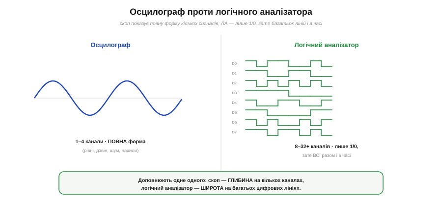
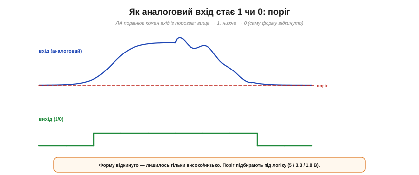
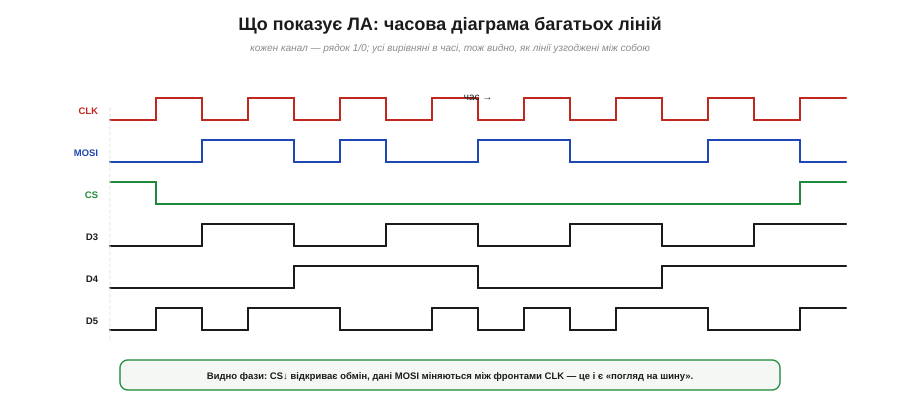
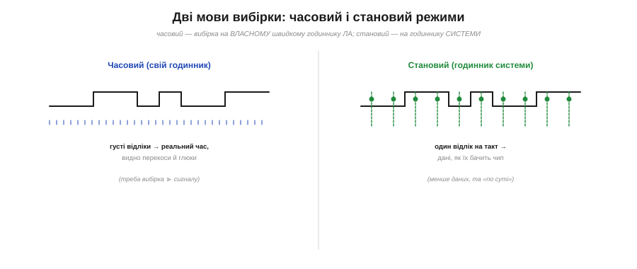
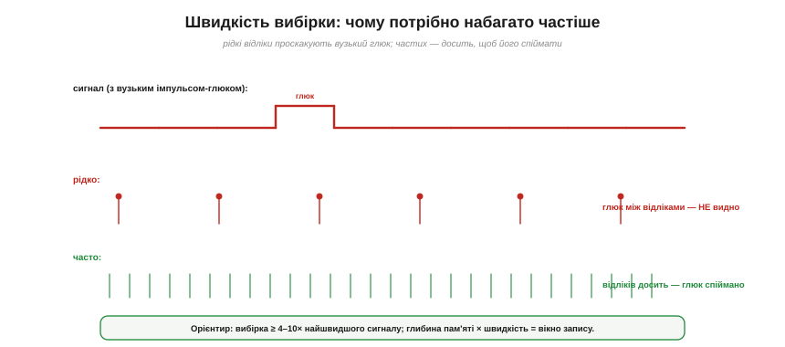
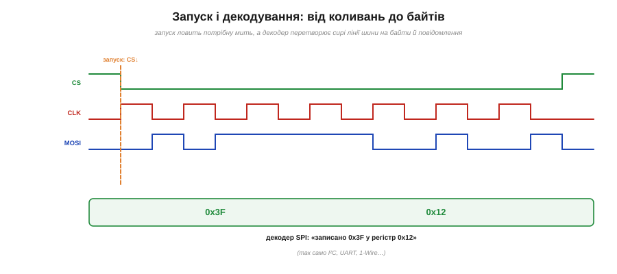

# Логічний аналізатор: побачити багато цифрових ліній

[Осцилограф](root:hw-sensing/oscilloscope) чудово відповідає на питання «**яка форма** сигналу?» — але він дивиться на один-два, рідко чотири канали. А цифровий пристрій — це **юрба** ліній: восьмирозрядна шина даних, тактовий сигнал, лінії вибору, керування… Десятки доріжок, що перемикаються мільйони разів на секунду, і важливо не стільки точна форма кожної, скільки те, **як вони поводяться разом у часі**: хто перемикається першим, чи встигають дані до фронту такту, що саме біжить шиною. На це питання осцилографа замало — тут потрібен **логічний аналізатор**, ширококанальний родич скопа для цифрового світу.

Уявіть типову халепу: ви під'єднали датчик до мікроконтролера по цифровій шині, а він **мовчить**. Де біда? Може, контролер не шле такт; може, шле, та датчик не відповідає; може, відповідь є, але приходить покрученою; а може, дані й такт розминаються в часі на якісь наносекунди. Осцилографом, що бачить два канали, ви тут довго блукатимете наосліп. А логічний аналізатор покаже **всі** лінії шини одночасно, вирівняні в часі, — і часто причина впадає в око з першого погляду.

### Осцилограф проти логічного аналізатора

Щоб зрозуміти логічний аналізатор, найкраще порівняти його з уже знайомим осцилографом — бо вони відповідають на **різні** питання.

*Осцилограф показує **повну форму** одного-чотирьох сигналів — з рівнями, нахилами, дзвоном і шумом. Логічний аналізатор показує **багато** ліній (8, 16, 32 і більше), але лише як **1 чи 0**. Скоп дає глибину на кількох каналах; ЛА — широту на багатьох. Вони доповнюють одне одного.*

**Осцилограф** бачить **мало** каналів, зате в усій аналоговій повноті: точну висоту рівня, нахил фронту, дзвін після перемикання, шум, найдрібніший «вус» на вершині. Він відповідає на питання «**яка форма цього сигналу**?».

**Логічний аналізатор** натомість бачить **багато** ліній — вісім, шістнадцять, тридцять дві й більше, — але кожну лише як **високо чи низько**, 1 чи 0. Він жертвує деталлю форми заради **кількості** й **часового вирівнювання**: показує всі лінії на одному екрані, вишикувані вздовж спільної осі часу. Його питання інше — «**як поводяться разом усі ці лінії**?».

Це два різні інструменти під два різні завдання, і вони не конкурують, а доповнюють одне одного. Аналоговий сигнал, підозрілий рівень, дзвін на фронті — кличте осцилограф. Багато цифрових ліній, шина, питання «хто кого випереджає» — кличте логічний аналізатор.

Різницю зручно тримати в голові як «**глибина проти широти**». Осцилограф дає **глибину**: про кожен зі своїх небагатьох каналів він знає геть усе — до мілівольта й до наносекунди форми. Логічний аналізатор дає **широту**: про кожну зі своїх численних ліній він знає лише одне (високо чи низько), зате стежить за десятками ліній разом. Жодне знання не «краще» — вони про різне, і завдання диктує вибір. До речі, є й прилади-гібриди — **змішані осцилографи** (*mixed-signal*, MSO): кілька повноцінних аналогових каналів плюс десяток-другий цифрових, щоб поєднати обидва погляди в одному корпусі. Але навіть тоді в голові лишаються ті самі два питання: про **форму** дбає аналогова частина, про **взаємини багатьох ліній** — цифрова.

### Як аналоговий вхід стає 1 чи 0: поріг

Звідки логічний аналізатор бере свої «1» і «0»? Адже реальна напруга на лінії — величина аналогова, що плавно росте й падає. Відповідь проста: кожен вхід ЛА порівнює напругу з **порогом**.

*Кожен вхід логічного аналізатора порівнюється з пороговою напругою: поки сигнал вищий за поріг — це «1», нижчий — «0». Точну форму (нахил фронту, дзвін, шум) при цьому **відкинуто** — лишається тільки високо/низько. Поріг підбирають під логіку: 5, 3.3 чи 1.8 В.*

Поки напруга на вході **вища** за поріг, аналізатор записує **1**; нижча — **0**. Усе, що між цими двома станами — точна висота, нахил фронту, дрібний дзвін, — **відкидається**. Лишається сама суть цифрового сигналу: він зараз високо чи низько.

У цьому й сила, і слабкість методу. **Сила** — у простоті й кількості: щоб сказати «1 чи 0», досить одного компаратора на канал, тож таких каналів легко зробити багато й дешево. **Слабкість** — у втраченій деталі: якщо рівень на лінії «маргінальний» (ледь дотягує до порога), якщо фронт дзвенить чи захлинається шумом — ЛА цього **не покаже**, бо для нього є лише високо й низько. Саме тут і потрібен осцилограф.

Звідси й практична тонкість: **поріг треба виставити правильно**, під свою логіку. У 5-вольтовій схемі поріг беруть десь посередині (≈2.5 В), у 3.3-вольтовій — нижче, у сучасній 1.8-вольтовій — ще нижче. Виставите поріг невлад — і аналізатор читатиме сигнал хибно, бачачи «1» там, де чип бачить «0».

Усередині кожного входу для цього стоїть [**компаратор**](root:hw-analog/comparator) — схема, що порівнює дві напруги й видає «більше/менше». Простіші аналізатори мають один спільний поріг на всі канали; кращі дозволяють задавати його окремо для груп, щоб одночасно слухати лінії різних логік. І ще важлива дрібниця: вхід аналізатора має витримувати **робочу напругу** вашої схеми — подати на 3-вольтовий вхід 5 чи 12 В означає його спалити, тож рівні треба узгоджувати, а за потреби ставити дільник чи перетворювач рівнів. Простота «лише 1 чи 0» не звільняє від поваги до напруги.

### Що показує: часова діаграма багатьох ліній

Зібравши свої одиниці й нулі з усіх каналів, логічний аналізатор малює їх **часовою діаграмою** — і це його головний екран.

*Часова діаграма: кожен канал — окремий рядок, що стрибає між 0 і 1, а всі рядки **вирівняні** вздовж спільної осі часу. Так одразу видно фази обміну: CS↓ відкриває сеанс, дані на MOSI міняються між фронтами тактового CLK. Це і є «погляд на шину» зсередини.*

Кожному каналу — свій **рядок**, у якому видно, коли він був високо, а коли низько. А оскільки всі рядки вишикувані вздовж **спільної** осі часу, одразу впадає в око найцінніше — **взаємини** ліній. Видно, що тактовий сигнал цокає рівномірно, а дані на сусідній лінії міняються рівно між його фронтами; видно, що лінія вибору впала **перед** початком обміну й піднялася **після**; видно, чи встигла лінія даних усталитись до моменту, коли її «защіпнув» такт. Усе те, на що осцилограф із його кількома каналами не здатен, тут — як на долоні.

Саме на часовій діаграмі найлегше впіймати цілий клас цифрових бід. Якщо дані не встигли усталитись до фронту такту (порушено **час встановлення**), це видно як зсув краю стосовно цокання. Якщо два сигнали мали перемкнутися разом, а розійшлися (**перекіс**), діаграма покаже зазор між їхніми фронтами. Якщо лінія, що мала мовчати, раптом сіпнулась, — ось вона, зайва зміна на рядку. Око, призвичаєне читати такі діаграми, часто бачить причину збою швидше, ніж будь-яка теорія.

Групу ліній (наприклад, вісім ліній даних) аналізатор уміє показати разом як **шину** — одним числом, що міняється з часом, замість восьми окремих рядків. Замість того щоб подумки складати вісім окремих «нулів» і «одиниць» у байт, ви одразу читаєте «0x5A», «0x5B», «0x5C» — і потік даних стає зрозумілим із першого погляду. Так велика картина стає ще читабельнішою.

### Дві мови вибірки: часовий і становий режими

Логічний аналізатор уміє «знімати» сигнали двома різними способами — і вибір між ними принциповий.

*Часовий режим: ЛА робить вибірку на **власному** швидкому годиннику, густо — і ловить реальний час, перекоси й глюки. Становий режим: вибірка прив'язана до годинника **самої системи** (наприклад, до тактової лінії шини) — один відлік на такт, тож видно дані такими, якими їх «бачить» чип.*

У **часовому** режимі (*timing*, асинхронному) аналізатор знімає всі канали на **власному** внутрішньому годиннику, дуже швидкому й незалежному від досліджуваної схеми. Цей режим ловить **реальний час**: точне положення фронтів, перекоси між лініями (коли одна ледь випереджає іншу), короткі **глюки**. Це режим «як воно є насправді в часі».

У **становому** режимі (*state*, синхронному) аналізатор знімає сигнали не на своєму годиннику, а на годиннику **самої системи** — скажімо, по фронту тактової лінії шини. Тоді на кожен такт припадає рівно **один** відлік, і ЛА бачить дані такими, якими їх **защіпує сам чип**. Відліків значно менше, зате кожен — «по суті»: це режим «як воно бачиться системі».

Грубо кажучи: часовий режим питає «**коли** саме що сталося?», а становий — «**які дані** пройшли?». Перший потрібен, коли ловите проблему **тайнінгу** (хтось не встигає, фронти розповзлися); другий — коли стежите за **змістом** обміну.

Є між ними й технічна різниця в під'єднанні. Часовий режим самодостатній — аналізатор цокає сам собою, тож достатньо причепити щупи до ліній. А для станового режиму аналізаторові треба **дати годинник системи**: підвести до нього ту саму тактову лінію, по якій працює досліджувана шина, бо саме її фронтами він знімає відліки. Тому в простих USB-аналізаторах частіше живе **часовий** режим (знімай швидко й розбирайся потім), а становий — прерогатива серйозніших приладів, що глибоко занурюються в конкретну шину. На щастя, для більшості задач аматора часового режиму з декодером цілком досить.

### Швидкість вибірки: чому потрібно набагато частіше

У часовому режимі постає важливе питання: **як часто** робити вибірку? І відповідь однозначна — **набагато частіше**, ніж міняється сам сигнал.

*Вузький імпульс-глюк на сигналі. Якщо відліки рідкі, глюк проскакує **між** ними — і його просто не видно. Часта вибірка ловить його. Орієнтир: знімати ≥ 4–10× швидше за найшвидший сигнал.*

Причина та сама, що й із цифруванням будь-якого сигналу: аналізатор бачить лінію лише в **моменти** вибірки, а між ними — нічого. Якщо вибірка рідка, **вузький глюк**, що промайнув між двома відліками, лишиться **невидимим**, а фронти «приклеяться» не до тих моментів. Тому діє практичне правило: частота вибірки має бути **в кілька разів** (а краще на порядок) вища за найшвидший сигнал, який ви хочете чесно побачити. Хочете ловити короткі збої — беріть вибірку ще густішу.

Але густа вибірка має ціну — **пам'ять**. Аналізатор записує відліки в буфер скінченної глибини, і тут діє проста рівність: **глибина пам'яті × швидкість вибірки = вікно запису** в часі. Знімаєте дуже часто — буфер заповнюється швидко, і ви бачите лише короткий проміжок; знімаєте рідше — охоплюєте довший час, але ризикуєте проґавити дрібниці. Між роздільністю в часі й тривалістю запису доводиться щоразу шукати баланс.

Підставмо числа, щоб відчути порядки. Хай ваша шина працює на 1 МГц, а аналізатор знімає на 100 МГц — це стократне «передискретизування», тож кожен біт ловиться сотнею відліків, фронти стоять точно, а вузькі глюки видно. Якби ж сигнал був 50 МГц, той самий 100-мегагерцовий аналізатор давав би лише два відліки на період — на межі, де про глюки годі й мріяти, та й фронти «гуляли» б. Звідси й перше питання при виборі приладу: чи його швидкість **із добрим запасом** перекриває ваш найшвидший сигнал.

### Запуск і декодування протоколів

Записати все підряд — мало; треба ще впіймати **потрібну мить** і **зрозуміти** записане. Для цього в логічного аналізатора є два потужні засоби.

***Запуск** (тригер) починає запис за умовою — тут «коли лінія CS впала». А **декодер** перетворює сирі коливання трьох ліній (CLK, MOSI, CS) на осмислені байти: «записано 0x3F у регістр 0x12». Так само ЛА декодує I²C, UART, 1-Wire та інші протоколи.*

Перший засіб — **запуск** (*trigger*), рідня осцилографічному, але на цифрових умовах. Аналізатор може почати запис не «коли завгодно», а лише тоді, коли на лініях складеться **задана картина**: певний фронт, певний візерунок бітів, певна подія на шині («запустись, коли адреса дорівнює 0x42»). Так ловлять **рідкісну** подію, що трапляється раз на мільйон тактів, — без запуску вона потонула б у морі звичайних.

Другий засіб — і це справжня **родзинка** логічного аналізатора — **декодування протоколів**. Сирі лінії шини самі по собі — лише ліс прямокутних коливань; розбирати їх оком виснажливо. Але аналізатор (точніше, його програма) **знає** правила поширених протоколів — SPI, I²C, UART, 1-Wire та інших — і вміє перетворити ці коливання на **зміст**: на байти, адреси, команди, повідомлення. Замість «ось фронт, ось іще вісім фронтів» ви читаєте «**записано 0x3F у регістр 0x12**». Саме декодування й робить ЛА незамінним при налагодженні цифрового зв'язку: він перекладає мову дротів на мову даних.

Обидва засоби бувають напрочуд гнучкими. Запуск розрізняє не лише поодинокий фронт, а й **візерунок** (певна комбінація рівнів на кількох лініях), **тривалість** імпульсу (спіймати саме той, що «надто короткий») чи цілу **послідовність** подій («спершу адреса, потім запис, потім помилка»). А декодери часто **складають**: знизу декодер бачить сирі фронти, над ним — байти SPI, а ще вище — уже зміст команди для конкретного чипа, з підсвіченими **помилками** протоколу (не та контрольна сума, обірваний кадр). Так аналізатор веде вас від коливань напруги аж до людської фрази «датчик повернув температуру 23.5 °C» — і саме за цей шлях його так цінують.

### Як обрати логічний аналізатор

Коли доходить до купівлі чи позички приладу, дивляться на чотири числа. Перше — **кількість каналів**: їх має бути не менше, ніж ліній, які ви хочете бачити разом (для восьмирозрядної шини з тактом і вибором — щонайменше десяток). Друге — **швидкість вибірки**: з добрим запасом (у кілька-десяток разів) понад найшвидший ваш сигнал, інакше фронти й глюки сховаються. Третє — **глибина пам'яті**: від неї залежить, наскільки довге вікно ви запишете на обраній швидкості. Четверте — **підтримувані напруги й пороги**: чи прийме прилад вашу логіку (5, 3.3, 1.8 В) і чи не згорить від неї. А вже потім — приємні дрібниці: які **протоколи** вміє декодувати програма, які **типи запуску** підтримує, чи зручний інтерфейс. Для більшості аматорських задач вистачає недорогого восьмиканального USB-аналізатора на десятки мегагерц — він уже відкриває цілий світ цифрового налагодження.

### Де й коли його брати

Звідки логічний аналізатор узявся на столі звичайного аматора? Колись це був дорогий лабораторний прилад, та сьогодні крихітні **USB-аналізатори** коштують копійки, а безкоштовні програми (як-от sigrok/PulseView) перетворюють їх на повноцінний інструмент із декодерами протоколів. Цифрове налагодження стало доступним кожному.

> 🔧 **Навіщо це.** Логічний аналізатор — головний інструмент, коли ви налагоджуєте **цифрову** систему й щось «не сходиться»: чип не відповідає, шина мовчить, дані приходять покручені, два сигнали розминаються в часі. Осцилограф тут безсилий — він не дивиться на шістнадцять ліній одразу; а логічний аналізатор не лише дивиться, а ще й **декодує** обмін, показуючи готові байти. Та не забувайте про межу: ЛА бачить **тільки 1 і 0**. Маргінальний рівень, дзвін на фронті, шум, аналогова деталь — усе це від нього сховане, і тут знову потрібен осцилограф. Тому досвідчений інженер тримає на столі **обидва** прилади й обирає за питанням: «**яка форма?**» — осцилограф; «**як поводяться багато ліній і що біжить шиною?**» — логічний аналізатор. Разом вони покривають увесь спектр — від тонкої аналогової форми до широкої цифрової картини.

---

Коротко: **логічний аналізатор** показує **багато** цифрових ліній одночасно, але лише як **1 чи 0**, вирівняними в часі, — на відміну від осцилографа, що дає повну форму кількох каналів. Кожен вхід зводить напругу до високо/низько за **порогом**; результат малюється **часовою діаграмою**. Знімати можна на власному швидкому годиннику (**часовий** режим — реальний час і глюки) або на годиннику системи (**становий** — дані, як їх бачить чип), причому в часовому режимі вибірка має бути в кілька разів швидша за сигнал. **Запуск** ловить потрібну мить, а **декодер** перетворює сирі лінії шини на байти й повідомлення (SPI, I²C, UART…). Осцилограф і логічний аналізатор разом покривають увесь стіл: форма — до скопа, багато ліній і протоколи — до аналізатора. А коли треба не слухати схему, а живити її стабільною напругою із заданим обмеженням струму, у пригоді стає [лабораторний блок живлення](root:hw-sensing/lab-power-supply).

---
