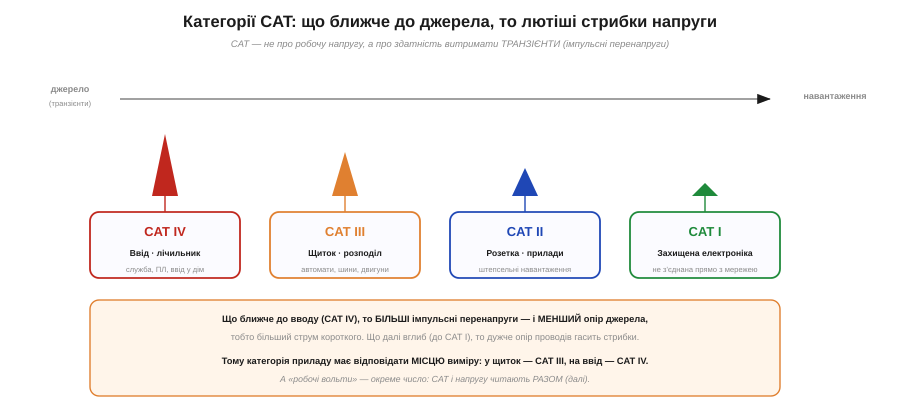
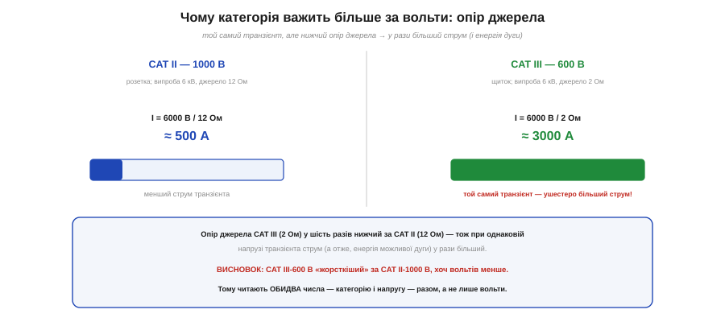
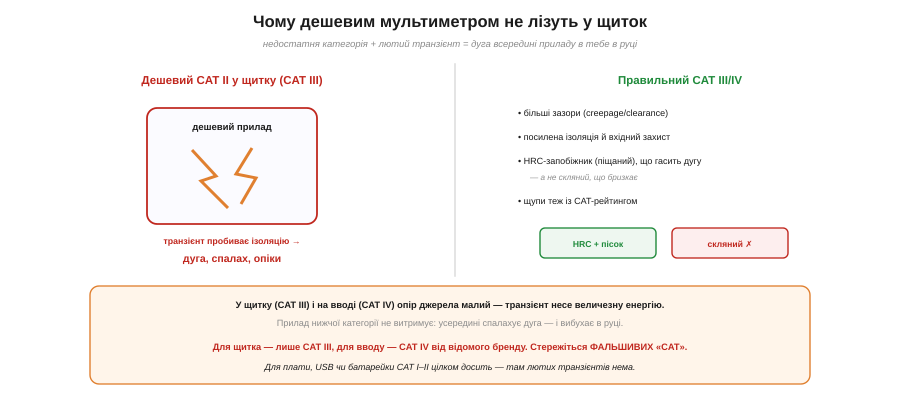

# 🔌 Категорії CAT I–IV: чому дешевим мультиметром не лізуть у щиток

> 🔌 Працювати з електрикою треба з повагою, а мережу лишати фахівцям. Тут — про конкретне число в паспорті приладу, що вирішує, **де** ним узагалі можна працювати: категорію вимірювань **CAT**. Зрозуміти її варто, бо помилка тут карається не зіпсованим приладом, а **дугою в руці**.

## Що таке CAT і навіщо

На щупах і мультиметрі ви бачите напис на кшталт «**CAT III 600 V**». Перша частина — **категорія вимірювань** за стандартом IEC 61010. І ось головне, що дивує початківців: CAT — це **не** про робочу напругу, яку прилад міряє. Це про здатність витримати **транзієнт** (від лат. *transiens* — «той, що проминає») — короткий потужний **імпульс перенапруги**, що стрибає в мережі.

Звідки ті транзієнти й чому вони страшніші за робочі вольти? Велике індуктивне навантаження, що вимикається (двигун, зварювальний апарат), або близький удар блискавки кидають у мережу **піковий стрибок** у кілька кіловольтів, який триває лічені мікросекунди. Робочі 230 В прилад тримає завиграшки; а от такий мікросекундний кіловольтний сплеск мусить **поглинути** його вхідний захист, не давши іскрі перескочити всередині. Тому рейтинг і міряють не робочою напругою, а саме здатністю пережити цей удар. І такі сплески — **не екзотика**: дрібні стрибки біжать мережею раз у раз від кожної комутації, а більші — від грози чи аварії — приходять регулярно, тож прилад мусить бути готовий до них завжди, а не як до рідкісного дива.

Сама ідея не з порожнього місця. Електрики давно ділять мережу на **категорії перенапруги** (англ. *overvoltage category*) за стандартом ізоляційної координації IEC 60664 — від найзахищеніших кіл до вводу, куди приходять найбільші стрибки. IEC 61010 просто переніс цю драбину на **прилади**: категорія вимірювань CAT III — це, по суті, та сама категорія перенапруги III, лиш приміряна до того, куди ви тицяєте щуп.


*Категорію задає відстань від джерела: CAT IV (ввід, лічильник) → CAT III (щиток, розподіл) → CAT II (розетка, прилади) → CAT I (захищена електроніка). Що ближче до джерела, то більші транзієнти й менший опір джерела; що глибше — то дужче їх гасить опір проводів.*

Категорію визначає **відстань від джерела** живлення — бо що далі вглиб мережі, то дужче опір проводів **гасить** стрибки:

- **CAT I** — захищена електроніка, не з'єднана прямо з мережею (вторинні низьковольтні кола, USB-гаджет).
- **CAT II** — штепсельні навантаження: розетка, побутові прилади, ваша макетка від адаптера.
- **CAT III** — стаціонарний розподіл: **щиток**, автомати, шини, стаціонарні двигуни, трифазне.
- **CAT IV** — **ввід** у будівлю: лічильник, кабель від стовпа, повітряні лінії — там, де б'є блискавка.

Що ближче до вводу (CAT IV), то **лютіші** транзієнти — і, що важливо, то **менший опір джерела**.

## Три числа, а не одне

Тут і ховається пастка. IEC 61010 оцінює прилад за **трьома** критеріями разом: робоча напруга (стала напруга мережі до землі, яку ізоляція тримає **постійно**), пікова напруга **транзієнта** (короткий удар, який треба **пережити**) і — найголовніше — **опір джерела** того транзієнта. Стандарт задає для кожної пари «категорія + робоча напруга» свій випробний імпульс; для приладів на 600 В картина така:

```
Випробний транзієнт за IEC 61010 (робоча напруга 600 В):
  CAT II  600 В →  4000 В   при опорі джерела 12 Ом
  CAT III 600 В →  6000 В   при опорі джерела  2 Ом
  CAT IV  600 В →  8000 В   при опорі джерела  2 Ом
```

Підіймаючись на категорію за тих самих 600 В, прилад мусить витримати і **вищий** імпульс, і — що головніше — імпульс від **меншого опору джерела**.


*Той самий випробний транзієнт 6 кВ, але опір джерела різний: CAT II — 12 Ом (≈500 А), CAT III — 2 Ом (≈3000 А). Ушестеро більший струм означає, що CAT III-600 В витримує куди енергійніший удар, ніж CAT II-1000 В.*

Чому опір джерела взагалі різний на різних категоріях? Бо він **моделює, скільки мережі лежить між вами й трансформатором**. Біля вводу проводів обмаль, опір їхній дрібний — джерело «жорстке», і транзієнт може вкинути велетенський струм. Що глибше в дім, то довші дроти стоять на шляху, то більший їхній опір — він і гасить стрибок. Тому випробний опір для CAT III/IV — лише **2 Ом** (жорстке близьке джерело), для CAT II — аж **12 Ом** (м'якше, далеке), а для найзахищенішої CAT I — і зовсім близько **30 Ом**.

Саме це робить вищу категорію **жорсткішою**. Візьмімо для чесного порівняння той самий імпульс 6000 В: на CAT III це 6000 В при 2 Ом, а CAT II дотягує до 6000 В лише у варіанті на 1000 В — і то при 12 Ом. За законом Ома 6000 В на 2 Ом дають ≈ **3000 А**, а на 12 Ом — лише ≈ 500 А: **ушестеро** більший струм, а отже, і енергія можливої дуги. Звідси контрінтуїтивний, але **критичний** висновок: **CAT III-600 В безпечніший за CAT II-1000 В**, хоч вольтів у нього менше. Тому категорію й напругу читають **разом** — самих вольтів не досить. (А в межах однієї категорії більші вольти — таки тугіший прилад: CAT III-1000 В витримує 8000 В проти 6000 В у CAT III-600 В.)

## Чому дешевим — не в щиток


*Недостатня категорія в щитку: транзієнт пробиває ізоляцію приладу, спалахує дуга — вибух у руці. Правильний CAT III/IV має більші зазори, посилену ізоляцію й HRC-запобіжник (піщаний), що гасить дугу; щупи теж мусять мати CAT.*

Тепер зрозуміло, чим небезпечний дешевий мультиметр (зазвичай CAT II — або й зовсім без чесного рейтингу) у **щитку** (CAT III) чи на **вводі** (CAT IV). Там опір джерела малий, транзієнт несе **величезну** енергію — і прилад нижчої категорії її **не витримує**: усередині, попри ізоляцію, **пробиває дугу**. А дуга в приладі, який ви тримаєте в руці, — це спалах, розплавлений метал і важкі опіки.

Правильний CAT III/IV прилад зроблено інакше — і відмінності не косметичні. По-перше, **більші ізоляційні проміжки**, причому двох різних ґатунків: **зазор** (англ. *clearance*) — найкоротша відстань **повітрям** між провідниками, він боронить від прямого пробою іскрою; **шлях витоку** (англ. *creepage*) — найкоротша відстань **поверхнею** ізолятора, він боронить від повзучого розряду по запорошеній, вологій платі (через це в стандарті є ще «ступінь забруднення», що каже, на яке середовище прилад розрахований). По-друге, посилена внутрішня ізоляція й вхідний захист, який клампить піковий сплеск. І по-третє — **запобіжник високої вимикальної здатності** (HRC, англ. *high rupturing capacity*): не скляна трубочка, а керамічна гільза, напхана **піском**, що миттю гасить дугу. Типовий такий розриває коротке з вимикальною здатністю близько **17 кА** — тобто чесно обриває навіть аварію на тисячі ампер, не вибухнувши. Скляний запобіжник із дешевого приладу при такому струмі сам стає дугою: гільза лускає, а розплавлений метал усередині далі проводить, наче запобіжника й не було. Окремо боронять і гніздо для струму мА (там опір малий, струм міг би рвонути ще більший) — туди ставлять свій піщаний запобіжник, теж високої вимикальної здатності.

І ще одне, про що часто забувають: категорія всього **тракту** дорівнює його **найслабшій ланці**. Добрий CAT III прилад із CAT II щупами — це система CAT II; те саме псують дешеві перехідники, затискачі-«крокодили» чи подовжувачі. Тому й **щупи мають нести свій рейтинг**, не нижчий за прилад, а не бути випадковим комплектом «що було під рукою». І стережіться **фальшивих** «CAT IV», надрукованих на безіменних приладах без реальної сертифікації, — намальована літера дуги не гасить. А прилад **зовсім без** чесної CAT-позначки варто вважати щонайбільше настільним (CAT I): йому місце на платі й батарейках, а не біля мережі.

## Підсумок: де яким міряти

Правило просте. Для **плати, USB, батарейки** — там лютих транзієнтів немає, вистачить **CAT I–II**. Для роботи з **розеткою** — щонайменше **CAT II**. А в **щиток** лізьте лише з **CAT III**, на **ввід** — лише з **CAT IV**, і тільки від відомого виробника. Дивіться на **обидва** числа (категорію й вольти), бережіть щупи й пам'ятайте золоте правило [безпеки вимірювань](root:hw-sensing/measurement-errors): за найменшого сумніву — **вимкніть живлення**.
