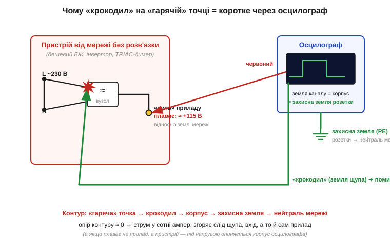
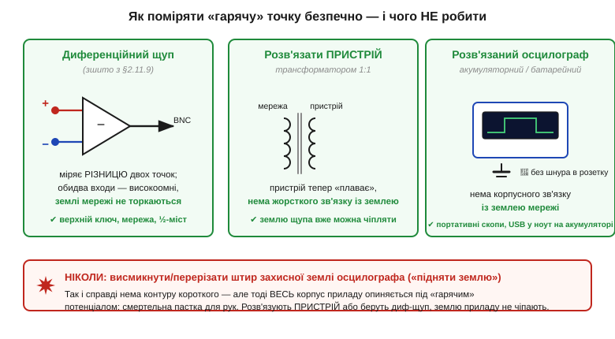

# 🔌 Земля щупа — це земля розетки: як не спалити осцилограф

> 🔌 Одна конкретна пастка вимірювань, на яку наступають навіть бувалі: чорний «крокодил» осцилографа — це **не нейтральний нуль**, а **земля розетки**. Зрозуміти це варто до того, як ви вперше тицьнете щуп у щось, живлене від мережі, бо ціна помилки — згорілий прилад, а часом і удар струмом.

## Чорний «крокодил» — продовження земляної шини будинку

У будь-якого [осцилографа](topic:hw-sensing/oscilloscope) **земля всіх каналів спільна** й сидить на металевому корпусі приладу: металеві обідки (екрани) всіх BNC-роз'ємів зсередини з'єднані між собою та з шасі. А корпус, заради безпеки, з'єднаний третім штирем вилки із **захисною землею** (англ. *protective earth*, PE) розетки — щоб у разі пробою ізоляції струм пішов у землю, а не крізь руку інженера. Висновок із цього лагідного факту суворий: чорний **«крокодил»** будь-якого щупа — це **не просто опорна точка вашого кола**, а фізичне продовження земляної шини всього будинку.

З того, що земля каналів **спільна**, випливає ще одна пастка, на яку ловляться частіше: крокодили CH1 і CH2 з'єднані між собою **всередині приладу**. Тож не вийде причепити землю одного каналу до однієї точки кола, а землю другого — до іншої: ви просто **закоротите** ці дві точки крізь корпус осцилографа. Два канали міряють **відносно однієї спільної землі**, а не дві незалежні різниці, — і це обмеження доведеться обходити, щойно знадобиться глянути на напругу між двома точками, де жодна не лежить на землі.

Поки ви міряєте звичайну плату від адаптера, це непомітно. Адаптер усередині **гальванічно розв'язаний** (його трансформатор не пускає мережу на вихід), тож «нуль» плати вільно «плаває» і спокійно стає на потенціал PE, щойно ви чіпляєте крокодил. Жодного струму — усе гаразд.

## Що горить, коли крокодил не на землі

Біда починається, коли пристрій, який ви міряєте, **сам зв'язаний із мережею без розв'язки**: дешевий блок живлення без трансформатора, інвертор, симісторний (англ. *TRIAC*) димер, верхнє плече напівмоста. У такому пристрої внутрішній «нуль» — **не нуль мережі**: він може стояти на сотні вольтів відносно PE (для випрямленої мережі 230 В — десь близько половини напруги мережі, ≈115 В). Причепите крокодил до такої «гарячої» точки — і ви **з'єднаєте** її з земляною шиною розетки **крізь корпус осцилографа**.

*Пристрій без розв'язки: його «нуль» плаває на ≈115 В відносно землі мережі. Чорний крокодил з'єднаний із корпусом осцилографа, а той — із захисною землею розетки. Чіпляємо крокодил на «гарячу» точку — і замикаємо її на землю мережі **крізь прилад**: контур майже без опору, струм у сотні ампер, згоряє слід щупа й вхід.*

Цей контур — «гаряча» точка → крокодил → корпус приладу → захисний провід → нейтраль мережі — має **майже нульовий опір**, тож струм у ньому злітає до сотень ампер. Згоряє тонкий земляний дріт у щупі, вибиває вхідний каскад, інколи гине сам прилад; летять іскри. А якщо в розетці немає справної землі, усе ще підступніше: тоді не «нуль» приладу падає на PE, а **навпаки** — увесь металевий корпус осцилографа підскакує до «гарячого» потенціалу, і прилад стає смертельною пасткою для рук.

А чи не врятує запобіжний автомат? На жаль, ні. Струм короткого справді тече з фази на захисну землю, і **пристрій захисного вимкнення** (ПЗВ, англ. *RCD* — *residual current device*) такий витік помічає — але спрацьовує він за десятки мілісекунд, а волосина земляного дроту в щупі вигоряє за **одну-дві** мілісекунди при сотнях ампер. Прилад уже мертвий, поки автомат лише замахнувся. До того ж на багатьох робочих столах ПЗВ узагалі немає. Тож надія тут не на захист мережі, а на те, **щоб контур не виник зовсім**.

## Як поміряти «гарячу» точку безпечно

Перше правило просте: **звичайним щупом крокодил чіпляють лише на землю свого кола** — і тільки якщо саме коло гальванічно розв'язане від мережі. А коли треба зазирнути у вузол, що не лежить на землі (верхній ключ напівмоста, точка просто на випрямленій мережі), беруть один із правильних шляхів.

*Безпечно: (1) **диференційний щуп** міряє різницю двох точок двома високоомними входами, землі мережі не торкаючись; (2) **розв'язати пристрій** трансформатором 1:1, щоб він «плавав»; (3) **розв'язаний осцилограф** на акумуляторі без зв'язку з PE. Анти-рішення — висмикнути штир землі приладу: контуру короткого нема, зате весь корпус стає «гарячим». Так не роблять.*

Головний інструмент тут — **диференційний щуп** (англ. *differential probe*). Замість «гарячий вивід + крокодил на землю» він має **два рівноправні високоомні входи** (+ і −) і вбудований віднімач: на осцилограф іде сама **різниця** напруг між цими точками, а самих входів земля мережі взагалі не стосується. Так він міряє напругу на верхньому ключі чи просто на фазі, не створюючи фатального контуру. Має він і свою межу — **максимальну синфазну напругу** (скільки вольтів обидва входи разом можуть «висіти» над землею); за неї виходити не можна. Це той самий принцип «зважати не на абсолют, а на різницю», що й у диференційних сигналів; докладно про роботу з мережею й гальванічну розв'язку — у темі [безпека робіт із мережею](topic:hw-power/mains-safety).

Решта шляхів прибирають небезпечний зв'язок інакше. **Розв'язувальний трансформатор 1:1** живить сам пристрій через окрему обмотку, тож той більше не зв'язаний із PE й вільно «плаває» — тепер його «нуль» уже можна чіпляти крокодилом. Але два застереження, без яких трансформатор оманливий: розв'язувати треба **сам пристрій, а не осцилограф** (так лишається ціла захисна земля приладу), і розв'язка **не робить пристрій безпечним на дотик** — між його вузлами й справжньою землею напруга мережі нікуди не діла́ся, просто тепер вона не тече крізь прилад. Третій шлях — **розв'язаний осцилограф**: портативний на акумуляторі чи USB-приставка в ноутбук на батареї; він сам не має зв'язку з PE, тож і контуру нема (тільки не перевищте його паспортну напругу ізоляції).

Є й четвертий, «бідняцький» прийом, коли диференційного щупа під рукою нема, — **віднімання каналів**. Обидва крокодили лишають на безпечній спільній землі осцилографа, двома звичайними щупами торкаються двох «гарячих» точок і вмикають режим **A − B**: прилад сам віднімає канали й показує різницю. Жоден крокодил не йде на «гарячу» точку — отже, фатального контуру не виникає. Та цей прийом куди гірший за справжній диференційний щуп, і ось чому: різницю двох великих сигналів він знаходить як **малу різницю двох великих чисел**, а два звичайні щупи ×10 ніколи не збалансовані ідеально. Ця незбалансованість і є кепське **придушення синфазного сигналу** (англ. *common-mode rejection ratio*, CMRR): у пари пасивних щупів воно ледь сягає 40 дБ, тоді як у доброго диференційного щупа — 80 дБ і вище на мережевій частоті. На практиці це означає, що частина величезного синфазного розгойду «протече» у показ хибним сигналом; до того ж кожен вхід мусить **сам** витримувати повну «гарячу» напругу відносно землі. Тож A − B годиться на грубий погляд на мережевій частоті, але точно зміряти швидкий ключ напівмоста ним не вийде — там виграє справжній диференційний щуп із його високим CMRR і широким діапазоном синфазної напруги.

А ось чого робити **категорично не можна** — це «піднімати землю», тобто висмикувати чи перерізати штир захисної землі осцилографа. Так контуру короткого справді не буде, але весь металевий корпус приладу опиниться під «гарячим» потенціалом — це пряма дорога до удару струмом. Прибирають зв'язок **з боку пристрою**, а захисну землю приладу не чіпають ніколи.

> 🔧 **Навіщо це.** Саме на таких вузлах — імпульсних блоках живлення, драйверах двигунів, інверторах, симісторних димерах — інженер опиняється чи не щодня, і саме там «нуль» не лежить на землі. Перш ніж чіпляти крокодил, спитайте себе: **чи розв'язаний цей пристрій від мережі?** Якщо ні (або ви не певні) — звичайний щуп зась, лише диференційний, розв'язувальний трансформатор чи розв'язаний осцилограф. Ця одна звичка береже і вхідний каскад за сотні доларів, і ваші пальці.
