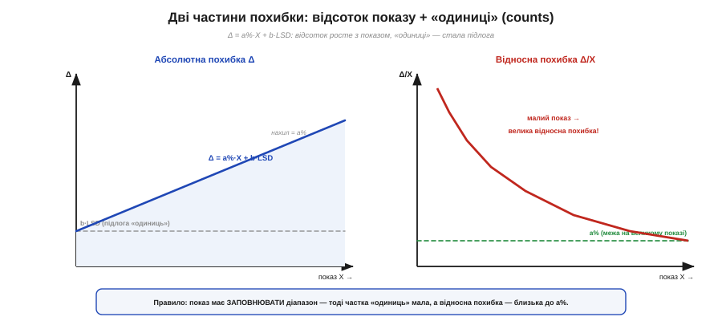
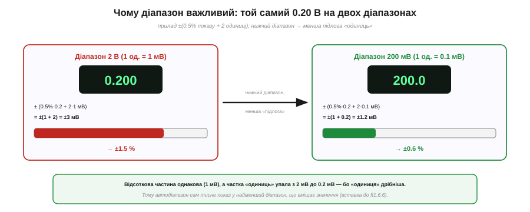
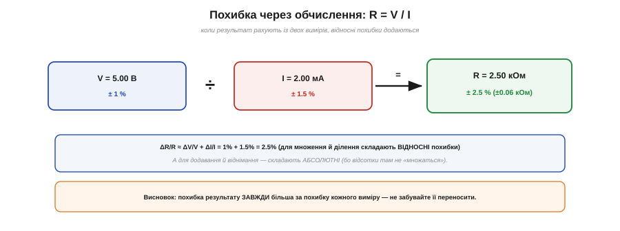

# 🧮 ±(% + одиниці молодшого розряду): арифметика похибок мультиметра

> 🧮 Математична вставка про **загальний апарат** паспортної точності цифрового мультиметра: чому її пишуть саме як «±(відсоток + одиниці)», як із цього дістати справжню межу похибки — і чому той самий прилад на малому показі бреше **дужче**.

## Означення: чому дві частини

Паспорт цифрового мультиметра майже завжди має вигляд **±(a % показу + b одиниць)**. Частин дві, бо й джерел похибки два:

- **a % показу** — **пропорційна** (множинна) частина: похибка підсилення, що **росте разом** із показом. На великому показі вона головна. Коріння її — недосконалість **опорної напруги** та вхідних дільників: відхилився внутрішній еталон на чверть відсотка — і кожен показ зсунувся на ту саму частку, тим більше що більший сам показ.
- **b одиниць** (англ. *counts*, або *digits*) — **стала** (адитивна) частина: «підлога» завширшки в b молодших розрядів табло, **незалежна** від показу. На малому показі головна вже вона. Її коріння — **зсув нуля, шум і квантування**: навіть бездоганний прилад не покаже дрібніше за свій останній розряд, тож щонайменше ±1 одиниця сидить там завжди.

«Одиниця» (count) — це **вага молодшого розряду** на поточному діапазоні [цифрового мультиметра](root:hw-sensing/multimeter). На діапазоні 2.000 В одна одиниця = 1 мВ; на 200.0 мВ — уже 0.1 мВ.

## Скільки тих одиниць уміщає табло

Тут варто розділити дві числові характеристики, які раз у раз плутають. **Рахунок** (англ. *count*) — це найбільше число, яке табло взагалі здатне показати на діапазоні, перш ніж перемкнутися вище. Дешевий прилад має **2000 одиниць** (показ від 0 до 1999), середній — **6000**, добрий — **20000** і вище. Старіше позначення описувало те саме через «цифри з половинкою»: **3½ цифри** — це три повні розряди (кожен 0–9) плюс старший, що вміє лише 0 або 1, звідси максимум 1999, тобто ті самі 2000 одиниць; **4½ цифри** — це 19999, тобто 20000.

І ось чому це **не** про точність: рахунок задає лише **роздільність** — наскільки дрібну сходинку видно. Прилад на 20000 одиниць показує тонше, але якщо клас точності в нього кепський, то зайві розряди просто докладно малюють брехню. Тому й кажуть: більше одиниць — дрібніша поділка, а не правдивіший показ. Саме тут одиниця-count і стала «підлога» з паспорта змикаються: та сама роздільність, що дозволяє побачити дрібну сходинку, ставить і нижню межу — точніше за ±1 одиницю прилад не знає нічого.

## Формальний апарат

Абсолютна похибка — просто сума двох частин:

```
Абсолютна похибка показу X:
  Δ = (a/100)·X + b·LSD
      └ пропорційна ┘  └ стала «підлога» ┘
  LSD — вага молодшого розряду (значення однієї «одиниці») на цьому діапазоні
```


*Похибка приладу = пропорційна частина (a%·X, росте з показом) плюс стала «підлога» з b одиниць (ліворуч). Тому **відносна** похибка (праворуч) велика на малому показі (панує підлога) і спадає до a% лише на великому.*

А тепер **відносна** похибка — поділимо на показ:

```
Відносна похибка:
  Δ/X = a/100 + b·LSD / X
        └ стала ┘  └ росте, коли X → 0 ┘
```

І ось ключове прозріння: другий доданок **роздувається**, коли показ X **малий**. На дрібному показі (скажімо, кілька одиниць від нуля) частка «одиниць» стає велетенською — і прилад може брехати на десятки відсотків, хоч паспорт у нього «±0.5 %». Відсоткова межа a % — це межа лише **на великому** показі, що заповнює діапазон.

Покажемо, наскільки це боляче. Той самий прилад «±(0.5 % + 2 одиниці)» на діапазоні 2 В читає **0.020 В** (20 мВ): пропорційна частина дає 0.5 %·20 мВ = 0.1 мВ, а «підлога» — ті самі 2·1 мВ = 2 мВ. Разом ≈ 2.1 мВ, тобто аж **10.5 %** від показу! «Підлога одиниць» не змінилась, а показ дрібний — і відносна похибка вистрелила в десятки разів проти паспортних 0.5 %. Висновок прямий: дрібний показ на завеликому діапазоні — це майже навмання.

## Звідси — вибір діапазону


*Той самий 0.20 В приладом ±(0.5%+2 одиниці): на діапазоні 2 В одиниця = 1 мВ → ±3 мВ (1.5%); на 200 мВ одиниця = 0.1 мВ → ±1.2 мВ (0.6%). Дрібніша одиниця — менша підлога; тому автодіапазон тисне показ донизу.*

Звідси й практичний наслідок. Поміряймо **0.20 В** приладом «±(0.5 % + 2 одиниці)» на двох діапазонах:

```
0.20 В на діапазоні 2 В    (1 одиниця = 1 мВ):
  Δ = 0.5%·200мВ + 2·1мВ   = 1 + 2   = 3 мВ   →  1.5 %
0.20 В на діапазоні 200 мВ (1 одиниця = 0.1 мВ):
  Δ = 0.5%·200мВ + 2·0.1мВ = 1 + 0.2 = 1.2 мВ →  0.6 %
```

Відсоткова частина однакова (1 мВ), а от «підлога одиниць» **упала вдесятеро** (з 2 мВ до 0.2 мВ), бо на нижчому діапазоні дрібніша й сама одиниця. Тому точність **покращилась**, хоч прилад той самий. Це й є причина, чому **автодіапазон** завжди тисне показ у **найменший** діапазон, що його вміщає.

У прошивці, яка сама знімає АЦП і має чесно повідомити межу похибки, цей самий рахунок лягає в кілька рядків. Дамо приладу формулу — хай рахує сам.

**Умова.** Прилад із класом ±(0.5 % + 2 одиниці); знаємо поточний показ у мілівольтах і вагу одиниці (LSD) на вибраному діапазоні. Повертаємо абсолютну межу похибки в мілівольтах.

```c
// Паспортний клас приладу: a% показу + b одиниць молодшого розряду.
#define ACC_PERCENT   0.5f    // a, % показу (пропорційна частина)
#define ACC_COUNTS    2       // b, одиниць   (стала «підлога»)

// reading_mV — поточний показ, мВ;  lsd_mV — вага однієї одиниці на діапазоні, мВ
float meas_error_mV(float reading_mV, float lsd_mV) {
    float prop  = (ACC_PERCENT / 100.0f) * reading_mV;  // росте з показом
    float fl    = ACC_COUNTS * lsd_mV;                  // стала, від діапазону
    return prop + fl;                                   // повна межа похибки
}
```

Два доданки — дві різні природи: `prop` повзе вгору разом із показом, а `fl` стоїть на місці й залежить лише від діапазону (через `lsd_mV`). Той самий показ на дрібнішому діапазоні дає менший `lsd_mV` — і функція чесно поверне меншу похибку, кількісно підтверджуючи, чому автодіапазон не дарма тисне показ донизу.

## Паспорт дійсний не завжди

Легко прийняти «±(0.5 % + 2)» за вічний закон приладу, та насправді це **обіцянка за певних умов**, дрібним шрифтом виписаних поруч. Передусім — **температура**: клас точності гарантують лише у вузькому вікні близько **23 ± 5 °C**. Винесіть прилад на мороз чи в спеку — і додається **температурний коефіцієнт** (зазвичай ще близько 0.1 паспортної межі на кожен градус поза вікном), тож десь на +40 °C реальна похибка помітно ширша за табличну. Так само паспорт прив'язаний до **строку від останнього калібрування** (часто «протягом року»): з часом еталон **дрейфує**, і вчорашні 0.5 % поволі стають гіршими. І ще дрібниця, що рятує точні виміри: після різкої зміни температури приладу дають **прогрітися** хвилин з півгодини, бо доти його внутрішній еталон ще «пливе». Тож паспортне число — це **найкращий** випадок: кімната, свіже калібрування, прогрітий прилад. У полі чи під сонцем чесну межу беруть із запасом.

## Де ще це працює: похибка через обчислення


*Коли R рахують як V/I, відносні похибки **додаються**: ±1% і ±1.5% дають ±2.5%. При множенні/діленні складають відносні похибки, при додаванні/відніманні — абсолютні; результат завжди менш точний за виміри.*

Часто результат не міряють прямо, а **рахують** із кількох вимірів — і похибки треба [**переносити**](root:math-probability/error-budget). Правило просте:

```
Перенесення похибок (груба, безпечна оцінка — «найгірший випадок»):
  множення / ділення     →  складають ВІДНОСНІ:  Δ(X·Y)/(X·Y) ≈ ΔX/X + ΔY/Y
  додавання / віднімання →  складають АБСОЛЮТНІ: Δ(X ± Y) ≈ ΔX + ΔY
```

Скажімо, опір рахуємо як R = V / I. Виміряли V = 5.00 В (±1 %) та I = 2.00 мА (±1.5 %); тоді R = 2.50 кОм, а його відносна похибка ≈ 1 % + 1.5 % = **2.5 %**, тобто R = 2.50 ± 0.06 кОм. Зверніть увагу: похибка результату **завжди більша** за похибку кожного окремого виміру. Особливо підступне **віднімання близьких чисел** (два майже однакові покази): абсолютні похибки додаються, а сам результат дрібний — і відносна похибка може вибухнути.

Це додавання відносних похибок — навмисно **песимістична** межа: вона припускає, що обидва виміри схибили на повну й в один бік. Насправді похибки незалежних вимірів випадкові й не змовляються, тож статистично вони складаються **в корені з суми квадратів** (англ. *root-sum-square*, з кореня суми квадратів):

```
Реалістичніша оцінка для НЕЗАЛЕЖНИХ похибок:
  ΔR/R ≈ √((ΔV/V)² + (ΔI/I)²) = √(1%² + 1.5%²) = √3.25 ≈ 1.8 %
```

Замість 2.5 % найгіршого випадку виходить ≈ 1.8 % — менше, бо малоймовірно, щоб обидві похибки збіглися на максимумі та ще й в один бік. Інженер бере **найгірший випадок** там, де понад усе важить гарантія (запас міцності, безпека), і **корінь із квадратів** — коли потрібна чесна *типова* межа.

І ще одне, що випливає з цієї формули: **більше цифр на табло — не означає точніше**. Роздільність (скільки знаків видно [на табло мультиметра](root:hw-sensing/multimeter)) і точність (a % + одиниці) — різні речі: прилад на 6½ цифри з кепським класом точності збреше так само, лише з більш переконливим виглядом. Дивляться не на кількість розрядів, а на паспортну формулу.

Підсумок: паспортна «точність» — це **формула**, а не одне число. Дві частини, ±(% + одиниці); на малому показі панує «підлога», тому показ тримають ближче до верху діапазону; саме число дійсне лише в паспортних умовах (температура, свіже калібрування, прогрітий прилад); а коли результат рахують із вимірів — похибки переносять (відносні множаться, абсолютні додаються), беручи найгірший випадок для гарантії чи корінь із квадратів для типової оцінки. Саме це відрізняє свідоме вимірювання від сліпого переписування цифр.
