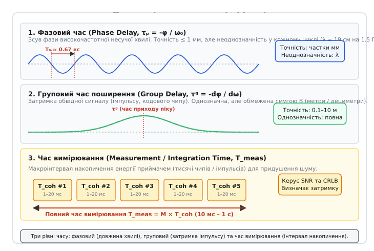
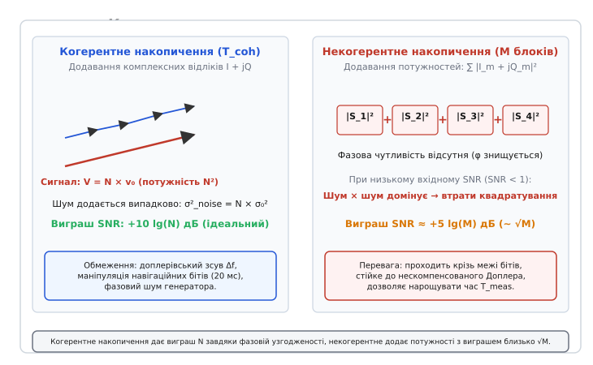
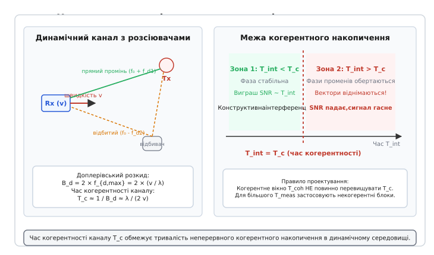
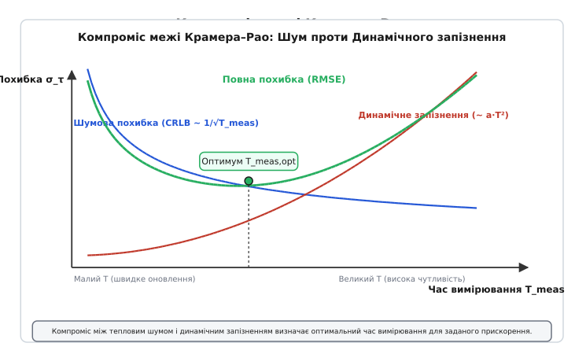

# Час вимірювання

<preknowlist>
- [Супутникова навігація (GNSS)](topic:hw-sensing/gnss) — принципи псевдодальностей, вимірювання затримки поширення сигналу.
- [Канал AWGN](topic:math-information/awgn-channel) — адитивний білий гаусів шум, спектральна густина потужності N₀.
- [PPS-імпульс](topic:hw-sensing/pps-pulse) — мітки точного секундного часу та апаратне захоплення фронтів.
- [Багатопроменевість](topic:com-medium/multipath-fading) — інтерференція відбитих променів та релеївські завмирання.
</preknowlist>

Коли радіоприймач супутникової навігації або станція радіотехнічного моніторингу ловить сигнал від віддаленого передавача на рівні потужності −130 дБм (що на 19 дБ нижче за потужність теплового шуму вхідного тракту −111 дБм у смузі 2 МГц), жоден окремий вхідний відлік не містить інформації, придатної для безпосереднього вимірювання. Миттєве значення амплітуди — це чистий шум; похибка визначення часу приходу за одним відліком сягає десятків мікросекунд, що еквівалентно кілометрам невизначеності дальності. Єдиний спосіб виділити корисний радіосигнал і точно визначити часові координати — накопичувати коливання протягом скінченного часового вікна.

Вибір тривалості цього вікна породжує жорстку фізичну суперечність. Якщо накопичувати сигнал занадто короткий час (наприклад, 100 мікросекунд), енергії недостатньо: автокореляційний пік потоне у випадкових шумах, і приймач не зафіксує сигнал взагалі. Якщо ж збільшити час накопичення до 2 секунд, щоб отримати максимальну чутливість, радіоканал зміниться: рух об'єкта зі швидкістю 15 м/с створить доплерівський зсув частоти, фаза несучої хвилі за 2 секунди зробить десятки повних обертів, і замість підсилення корисного сигналу пряме когерентне додавання призведе до взаємного віднімання векторів та повного зникнення енергії. 

Інтервал часу, протягом якого радіотехнічна система збирає, оцифровує, фазово узгоджує та інтегрує енергію електромагнітної хвилі для формування одного неподільного відліку затримки чи просторової координати, називається **часом вимірювання** (*measurement time*, або *observation interval*, від латинського *mensura* — міра). Ця величина є фундаментальним параметром, що зв'язує фізику поширення хвиль, статистичну теорію оцінювання та динамічну стійкість систем зв'язку, радіолокації й радіонавігації.

## Три виміри часу в радіофізиці: фазовий, груповий і вимірювальний

У радіосистемах поняття «час» вживається одночасно в трьох принципово різних фізичних контекстах, змішування яких призводить до грубих метрологічних помилок.


*Три рівні часу в радіофізиці: фазовий час пов'язаний із періодом високочастотної несучої хвилі й дає субміліметрову точність за умови розкриття циклічної неоднозначності; груповий час визначає затримку обвідної імпульсу чи коду; час вимірювання є макроінтервалом накопичення енергії приймачем.*

Перший вимір — це **фазовий час**, або фазова затримка (*phase delay*) `τ_p`. Він визначається зсувом фази `φ` високочастотного гармонічного коливання несучої частоти `ω₀ = 2π·f₀`:

```
τ_p = - φ / ω₀
```

Для сигналу діапазону L1 GNSS із частотою `f₀ = 1575.42 МГц` період одного коливання несучої становить лише `T₀ = 1 / f₀ ≈ 0.635 нс`, що у просторі відповідає довжині хвилі `λ = c / f₀ ≈ 19.03 см`. Фазовий детектор здатен виміряти зсув фази з точністю до 1% періоду, тобто до 6 пікосекунд (близько 2 міліметрів дальності). 

Однак фазовий час має фундаментальну ваду — циклічну неоднозначність (*integer ambiguity*): фазовий набіг `φ` та `φ + 2π·k` (де `k` — довільне ціле число) генерують абсолютно ідентичні покази приймача. Вимірявши лише фазу несучої, неможливо дізнатися, скільки сотень тисяч повних хвиль уклалося на шляху від супутника чи базової станції до антени.

Другий вимір — це **груповий час поширення**, або групова затримка (*group delay*) `τ_g`. Він визначає швидкість поширення обвідної сигналу — тобто імпульсу, перепаду фронту або кодового чипу псевдовипадкової послідовності (PRN):

```
τ_g = - dφ(ω) / dω |_{ω=ω₀}
```

Групова затримка вимірює реальний час проходження енергії та інформації крізь середовище поширення (іоносферу, тропосферу) та апаратні смугові фільтри приймача. На відміну від фазового часу, вимірювання затримки кодової огинальної є однозначним у межах усього періоду кодової послідовності (наприклад, 1 мілісекунда для коду C/A, що відповідає однозначній дальності 300 км). Проте точність групового вимірювання обмежена шириною спектра сигналу `B`: для коду з чиповою швидкістю 1.023 МГц тривалість одного чипу становить 977.5 нс (близько 293 метрів), і навіть при точності визначення вершини кореляційного піка в 1% чипу похибка дальності становить близько 3 метрів.

### Дисперсія середовища та розщеплення фазового й групового часу

При проходженні електромагнітної хвилі крізь дисперсійне середовище (зокрема іонізовану плазму іоносфери) фазова швидкість хвилі `v_p = ω / k(ω)` відрізняється від групової швидкості перенесення енергії `v_g = dω / dk`. Для іоносфери з електронною концентрацією `N_e` показник заломлення становить:

```
n(f) ≈ 1 - [ 40.3 · TEC / (2 · f² · d) ]
```

де `TEC` (*Total Electron Content*) — повний електронний вміст уздовж траси променя. Оскільки `n(f) < 1`, фазова швидкість перевищує швидкість світла у вакуумі (`v_p = c / n > c`), а групова швидкість стає меншою за швидкість світла (`v_g = c · n < c`).

Це призводить до протилежного за знаком впливу іоносфери на фазовий і груповий час:
- **Фазове випередження (Phase Advance):** Фазова затримка зменшується на `Δτ_p = - 40.3 · TEC / (c · f²)`.
- **Групове запізнення (Group Delay):** Групова затримка коду збільшується на ту саму величину `Δτ_g = + 40.3 · TEC / (c · f²)`.

У двочастотних приймачах зв'язку та GNSS (наприклад, L1 1575.42 МГц та L2 1227.60 МГц) ця різниця дозволяє аналітично розрахувати та повністю вилучити іоносферну похибку (Ionosphere-Free Combination). Проте для цього приймач повинен одночасно виконувати когерентне та некогерентне накопичення на обох несних частотах протягом узгодженого часу вимірювання `T_meas`.

Третій вимір — це **час вимірювання** `T_meas` (*measurement time* або *integration time*). Це не властивість самої електромагнітної хвилі, а параметр процесу спостереження та цифрової фільтрації в приймачі. Це інтервал фізичного часу, протягом якого апаратний корелятор або алгоритм цифрової обробки сигналів інтегрує тисячі чи мільйони відліків коливань для того, щоб підняти відношення сигнал/шум вище порогу виявлення й отримати оцінки `τ_g` та `τ_p`. 

Саме час вимірювання `T_meas` встановлює міст між мікрофізикою окремого радіоімпульсу (тривалістю частки наносекунди) та макродинамікою руху об'єкта (швидкістю, прискоренням, частотою оновлення навігаційного фільтра).

## Накопичення енергії: когерентне та некогерентне інтегрування

Потреба у тривалому часі вимірювання виникає через адитивний тепловий шум, присутній у будь-якому радіотракті. Відповідно до формули Найквіста, спектральна густина потужності теплового шуму дорівнює `N₀ = k_B · T_sys`, де `k_B = 1.38 × 10^{-23} Дж/К` — стала Больцмана, а `T_sys` — еквівалентна шумова температура приймальної системи. За кімнатної температури `T_sys = 290 К` густина шуму становить `N₀ ≈ -174 дБм/Гц`. У смузі пропускання приймача `B = 2.046 МГц` інтегральна потужність шуму сягає:

```
P_noise = N₀ + 10·lg(B) = -174 + 10·lg(2.046 × 10⁶) = -174 + 63.1 = -110.9 дБм
```

Якщо корисний навігаційний або зв'язковий сигнал надходить із рівнем `P_sig = -130 дБм`, вхідне відношення сигнал/шум (SNR) дорівнює:

```
SNR_in = P_sig - P_noise = -130 - (-110.9) = -19.1 дБ
```

За такого негативного співвідношення сигнал повністю прихований під шумовою доріжкою. Щоб забезпечити надійне виявлення та замикання петель стеження (потрібне вихідне співвідношення `SNR_out ≥ +12...15 дБ`), приймач повинен збільшити відношення сигнал/шум щонайменше на 32–35 дБ. Це досягається завдяки двом принципово різним механізмам накопичення.


*Когерентне накопичення додає комплексні відліки векторно, даючи лінійний виграш за потужністю N завдяки фазовій узгодженості. Некогерентне накопичення додає потужності після детектування модуля, даючи виграш близько кореня з M через домінування шум-помножити-на-шум при слабкому вхідному сигналі.*

### Когерентне інтегрування (Coherent Integration, T_coh)

Когерентне інтегрування полягає у векторному підсумовуванні комплексних оцифрованих відліків `I[k] + j·Q[k]` базової смуги після зняття відомої псевдовипадкової кодової послідовності та компенсації поточної оцінки фази несучої:

```
S_coh = ∑_{k=0}^{N-1} ( I[k] + j·Q[k] ) · c[k] · e^{-j·φ[k]}
```

де `c[k] ∈ {-1, +1}` — опорний кодовий чип, `φ[k]` — фаза опорного числового генератора (NCO), а `N = f_s · T_coh` — кількість відліків, накопичених за час когерентного вікна `T_coh`.

Фізичний механізм виграшу полягає у різниці фазової узгодженості корисного сигналу та шуму:
1. Корисний сигнал у кожному відліку додається **синфазно** (в одному напрямку в комплексній площині). Амплітуда сигналу зростає пропорційно числу відліків: `V_sig = N · A₀`. Оскільки потужність пропорційна квадрату амплітуди, потужність накопиченого корисного сигналу зростає як `P_sig,coh ∝ N² · A₀²`.
2. Тепловий шум є статистично незалежним випадковим процесом із випадковою рівномірною фазою. Комплексні шумові вектори утворюють двовимірне випадкове блукання (Random Walk). Їхні потужності (дисперсії) додаються лінійно: `P_noise,coh = N · σ₀²`.

Вихідне відношення сигнал/шум після когерентного накопичення:

```
SNR_coh
= P_sig,coh / P_noise,coh                                  [означення SNR після накопичення]
= (N² · A₀²) / (N · σ₀²)                                   [підстановка квадратичного сигналу та лінійного шуму]
= N · (A₀² / σ₀²)                                          [скорочення на N]
= N · SNR_in                                               [лінійне масштабування на число відліків]
= (B · T_coh) · SNR_in                                     [оскільки число відліків N = B · T_coh]
```

Виграш когерентного накопичення (Processing Gain) є строго лінійним:

```
G_coh = 10 · lg(N) = 10 · lg(B · T_coh)  дБ
```

**Розрахунок для GPS L1 C/A:** При ширині смуги `B = 2.046 МГц` і когерентному вікні `T_coh = 1 мс` кількість відліків становить `N = 2046`. Виграш дорівнює `G_coh = 10 · lg(2046) ≈ +33.1 дБ`. Вхідне відношення `SNR_in = -19.1 дБ` після одного когерентного мілісекундного інтервалу перетворюється на `SNR_coh = -19.1 + 33.1 = +14.0 дБ`, що робить сигнал чітко виділеним над рівнем шумів.

### Межі когерентного накопичення

Здавалося б, для виявлення сигналу будь-якої слабкості достатньо необмежено збільшувати `T_coh` (наприклад, до 10 секунд, отримавши виграш +73 дБ). Проте існують три непереборні фізичні межі:

1. **Залишковий доплерівський зсув частоти (`Δf`):** Якщо частота корисного сигналу відрізняється від опорної частоти гетеродина на `Δf`, вектор корисного сигналу в комплексній площині обертається з кутовою швидкістю `2π·Δf`. На інтервалі `T_coh` сумарний поворот фази складає `Δφ = 2π·Δf·T_coh`. Інтеграл від вектора, що обертається, зазнає амплітудного спаду за законом функції sinc:
   ```
   Втрати = | sinc(π · Δf · T_coh) | = | sin(π · Δf · T_coh) / (π · Δf · T_coh) |
   ```
   Якщо добуток `Δf · T_coh = 0.5` (набіг фази `180°`), втрати потужності складають `-3.92 дБ`. Якщо `Δf · T_coh = 1.0` (набіг фази `360°`), інтеграл тотожно дорівнює нулю: корисний сигнал повністю знищує сам себе. Це накладає жорстке правило: когерентний час вимагає, щоб крок сітки частотного пошуку задовольняв умову `Δf_step ≤ 1 / (2 · T_coh)`.
2. **Маніпуляція навігаційних бітів даних:** Більшість радіонавігаційних та зв'язкових сигналів модульовані двійковими даними (BPSK). У системі GPS біти навігаційного повідомлення передаються зі швидкістю 50 біт/с (тривалість одного біта — рівно 20 мс). Кожна зміна біта змінює фазу несучої на 180° (інвертує знак коливання). Якщо когерентне вікно тривалістю 20 мс накладається на момент перепаду біта (наприклад, 10 мс зі знаком «+» і 10 мс зі знаком «−»), когерентна сума стає рівною нулю. Без попереднього знання передаваних даних когерентний час не може перевищувати тривалість одного символу даних: `T_coh ≤ T_bit`.
3. **Фазовий шум та короткочасна нестабільність опорного генератора:** Фазові флуктуації опорного кварцового резонатора (TCXO/OCXO) приймача розмивають фазову когерентність на інтервалах, що перевищують час стабільності генератора.

### Некогерентне накопичення (Non-Coherent Accumulation, M блоків)

Коли когерентне вікно `T_coh` досягло своєї фізичної межі (наприклад, 20 мс), подальше нарощування повного часу вимірювання `T_meas = M · T_coh` здійснюється шляхом **некогерентного накопичення**.

Приймач обчислює потужність (квадрат модуля) сигналу на виході кожного когерентного блоку, знищуючи фазову інформацію, і підсумовує дійсні числа за `M` послідовних блоків:

```
Z = ∑_{m=1}^{M} |S_coh[m]|² = ∑_{m=1}^{M} ( I_m² + Q_m² )
```

Оскільки обчислення потужності усуває фазовий кут, некогерентне накопичення абсолютно нечутливе до нескомпенсованого залишку доплерівської частоти між блоками та не руйнується при зміні знака навігаційних бітів.

Проте за це доводиться платити **втратами квадратування** (*squaring loss*, `L_sq`). При піднесенні до квадрата виразу `(Сигнал + Шум)²` утворюються три складові:
```
(Сигнал + Шум)² = Сигнал² + 2·Сигнал·Шум + Шум²
```
При слабкому вхідному сигналі (`SNR_block ≪ 1`) домінуючим стає перехресний член взаємодії шумів `Шум² = Шум × Шум`. Шум починає детектувати сам себе, створюючи додатковий рівень постійного зміщення та флуктуацій.

Ефективний виграш некогерентного накопичення становить:

```
SNR_out = (M · SNR_block) / L_sq
L_sq = 1 + [ 1 / (2 · SNR_block) ]
```

При слабкому сигналі (`SNR_block ≪ 1`) коефіцієнт втрат дорівнює `L_sq ≈ 1 / (2 · SNR_block)`, і вихідне відношення сигнал/шум стає пропорційним кореню з числа блоків:

```
SNR_out ∝ √M  (приріст чутливості близько +5·lg(M) дБ замість +10·lg(M) дБ)
```

Строге математичне виведення енергетичного виграшу та коефіцієнта втрат квадратування наведено у вставці [Математичне виведення межі Крамера–Рао та виграшу накопичення](topic:hw-sensing/measurement-time/math-crlb-time-delay.md), а алгоритмічну реалізацію подвійного когерентно-некогерентного корелятора — у вставці [Реалізація двоетапного когерентно-некогерентного інтегратора](topic:hw-sensing/measurement-time/proj-coherent-integrator.md).

## Двовимірний простір пошуку затримки та доплерівської частоти

Час накопичення безпосередньо формує розмірність простору первинного пошуку та захоплення радіосигналу (Signal Acquisition). Оскільки приймач наперед не знає ані точної затримки коду `τ`, ані поточної доплерівської частоти `f_d`, він зобов'язаний перевірити сітку гіпотез у двовимірному просторі `(τ, f_d)`.

Кількість комірок пошуку визначається роздільною здатністю когерентного інтервалу `T_coh`:
1. **Крок за частотою Доплера:** Щоб амплітудні sinc-втрати не перевищували 3 дБ, крок сітки частот повинен складати `Δf_{bin} = 1 / (2 · T_coh)`. Для повного доплерівського діапазону супутників GPS `[-5 кГц, +5 кГц]` кількість частотних каналів дорівнює:
   ```
   N_{dopp} = (2 · f_{d,max}) / Δf_{bin} = 10 000 · 2 · T_coh
   ```
   При `T_coh = 1 мс` маємо `N_{dopp} = 20` частотних смуг. Якщо збільшити когерентний час до `T_coh = 10 мс`, сітка звужується до 50 Гц, і кількість каналів зростає в 10 разів (`N_{dopp} = 200`).
2. **Крок за затримкою коду:** З дискретизацією 0.5 чипу для коду довжиною 1023 чипи кількість часових комірок становить `N_{code} = 2046`.
3. **Загальна кількість комірок:** `N_{cells} = N_{dopp} · N_{code}`. Для `T_coh = 10 мс` загальна кількість елементарних комірок кореляції перевищує `400 000`.

Послідовний перебір усіх комірок із часом спостереження `T_meas` у кожній комірці зайняв би хвилини (Time-To-First-Fix, TTFF). Тому сучасні приймачі застосовують паралельний частотно-часовий пошук на основі швидкого перетворення Фур'є (FFT-based Parallel Code Phase Search, PCPS), де один блок FFT обчислює взаємну кореляцію за всіма 2046 часовими зсувами одночасно за час `O(N · log N)`.

## Час когерентності каналу (T_c) та доплерівське розширення (f_d)

У мобільних системах радіозв'язку та супутникової навігації взаємний рух антени приймача, передавача та навколишніх розсіювачів (будівель, рельєфу, поверхні землі) накладає жорстке фізичне обмеження на час когерентного інтегрування з боку самого середовища поширення.


*Час когерентності каналу T_c встановлює фізичну межу: якщо час когерентного накопичення T_int менший за T_c, фази променів стабільні й накопичуються конструктивно; якщо T_int перевищує T_c, просторовий рух повертає фази відбитих променів, викликаючи деструктивну інтерференцію та глибокі завмирання сигналу.*

Нехай приймач рухається зі швидкістю `v` відносно джерела або розсіювачів. Сигнал, що надходить під кутом `θ` до вектора швидкості, зазнає доплерівського зміщення частоти:

```
f_d = (v / λ) · cos(θ) = (v · f₀ / c) · cos(θ)
```

Максимальний доплерівський зсув досягається при русі прямо на джерело (`θ = 0`): `f_{d,max} = v / λ`. 

У реальному середовищі радіохвиля поширюється багатьма променями через відбиття від перешкод. Хвилі надходять до приймача з усіх можливих азимутів `θ ∈ [0, 2π]`, створюючи розширення спектра — **доплерівський розкид** (*Doppler spread*) `B_d`:

```
B_d = 2 · f_{d,max} = 2 · (v / λ)
```

Через різницю доплерівських частот фази окремих променів безперервно зміщуються одна відносно одної. Інтерференція променів перетворюється з конструктивної на деструктивну, формуючи швидкі просторово-часові завмирання (релеївські або райсівські завмирання амплітуди).

Інтервал часу, протягом якого фазові співвідношення між променями в радіоканалі залишаються стабільними (автокореляція комплексного коефіцієнта передачі каналу перевищує 0.5), називається **часом когерентності каналу** (*channel coherence time*, `T_c`).

За класичною моделлю Кларка (Clarke) та Джейкса (Jakes) час когерентності каналу зв'язку оцінюється як:

```
T_c ≈ √[ 9 / (16π · f_{d,max}²) ] ≈ 0.423 / f_{d,max} ≈ λ / (2.36 · v)
```

На практиці інженери часто використовують спрощене емпіричне правило першого наближення: `T_c ≈ 1 / (2 · f_{d,max}) = λ / (2v)`.

### Двовимірний прямокутник когерентності каналу (T_c, B_c)

У теорії нестаціонарних випадкових радіоканалів (WSSUS — Wide-Sense Stationary Uncorrelated Scattering) канал поширення характеризується двома дуальними масштабами:
1. **Часовий масштаб (Час когерентності `T_c`):** Визначається доплерівським розкидом `B_d` і задає максимальний час, протягом якого канал можна вважати незмінним: `T_c ≈ 1 / B_d`.
2. **Частотний масштаб (Смуга когерентності `B_c`):** Визначається затримкою розсіювання променів `σ_τ` (Delay Spread) і задає смугу частот, у межах якої всі спектральні складові зазнають однакових завмирань: `B_c ≈ 1 / (5 · σ_τ)`.

Добуток `T_c · B_c` утворює площу елементарної комірки когерентності. Якщо тривалість когерентного вікна `T_coh` виходить за межі `T_c`, або смуга сигналу `B` перевищує `B_c`, канал стає частотно-селективним та швидкозмінним у часі, що вимагає розбиття накопичення на субсмуги та короткі некогерентні інтервали.

### Розрахунок часу когерентності для практичних сценаріїв:
1. **Автомобільний зв'язок / БПЛА на швидкості 100 км/год (v = 27.8 м/с) на частоті 5.8 ГГц (λ = 5.17 см):**
   ```
   f_{d,max} = 27.8 / 0.0517 ≈ 538 Гц
   T_c ≈ 0.423 / 538 ≈ 0.00079 с = 0.79 мс
   ```
   У цьому каналі час когерентності становить менше 1 мілісекунди! Будь-яка спроба виконати когерентне накопичення тривалістю `T_coh = 10 мс` призведе до катастрофічного руйнування корисного сигналу, оскільки за цей час фаза каналу повністю зміниться більше десяти разів.
2. **Низькоорбітальний супутник LEO (Starlink / кубсат) на швидкості 7.5 км/с відносно наземного термінала на частоті 12 ГГц (Ku-діапазон, λ = 2.5 см):**
   ```
   f_{d,max} = 7500 / 0.025 = 300 000 Гц = 300 кГц
   T_c ≈ 0.423 / 300000 ≈ 1.41 мкс
   ```

Звідси випливає фундаментальний закон проектування систем синхронізації та вимірювання часу: **тривалість когерентного вікна `T_coh` ніколи не повинна перевищувати час когерентності каналу `T_c`**:

```
T_coh ≤ T_c
```

Якщо для накопичення енергії потрібен більший повний час вимірювання `T_meas > T_c`, система зобов'язана розбивати інтервал на блоки `T_coh ≤ T_c` та об'єднувати їх некогерентно за потужністю або застосовувати адаптивні багатоканальні еквалайзери чи RAKE-приймачі.

## Час вимірювання затримки TDOA та TOA у GNSS та системах радіолокації

Отримавши накопичений сигнал, приймач обчислює часові затримки, які є основою просторової локалізації.

У системах абсолютної часової прив'язки **TOA (Time of Arrival)** вимірюється момент приходу фронту або кодового чипу `t_{rx}` відносно системної часової шкали випромінювання `t_{tx}`:

```
τ = t_{rx} - t_{tx} = R / c + Δt_{clock}
```

де `R` — геометрична відстань між передавачем та приймачем, `c` — швидкість світла у вакуумі, а `Δt_{clock}` — похибка несинхронізованості годинника приймача. Для усунення невідомого зміщення `Δt_{clock}` приймач формує систему щонайменше з чотирьох рівнянь псевдодальностей до різних супутників.

У системах пасивного моніторингу та радіолокації **TDOA (Time Difference of Arrival)** сигнал випромінюється невідомим джерелом (наприклад, терміналом зв'язку, радіолокатором чи дроном) і приймається парою просторово рознесених синхронізованих базових постів 1 та 2. Кожен пост оцифровує вхідний сигнал `r₁(t)` та `r₂(t)` із прив'язкою до спільної часової шкали (забезпеченої високостабільними атомними годинниками або спільним PPS-імпульсом GNSS).

Взаємна різниця часів приходу `Δτ₁₂ = τ₁ - τ₂` обчислюється через пік узагальненої функції взаємної кореляції (Generalized Cross-Correlation, GCC):

```
R₁₂(τ) = ∫₀^{T_meas} r₁(t) · r₂*(t - τ) dt
```

Для усунення впливу забарвленості спектра та підвищення гостроти кореляційного піка застосовують зважування фазовим перетворенням (GCC-PHAT — Phase Transform):

```
R_{PHAT}(τ) = ∫_{-∞}^{∞} [ G₁₂(f) / |G₁₂(f)| ] · e^{j 2π f τ} df
```

де `G₁₂(f)` — взаємна спектральна густина потужності між двома приймачами на інтервалі `T_meas`. Зважування PHAT вибілює взаємний спектр, перетворюючи кореляційний пік на дельта-подібний сплеск і звужуючи зону невизначеності затримки.

Геометричним місцем точок із постійною різницею відстаней `ΔR₁₂ = c · Δτ₁₂` на площині є гіпербола (у тривимірному просторі — двопорожнинний гіперболоїд обертання). Перетин кількох таких гіперболоїдів від трьох або чотирьох пар станцій однозначно фіксує координати джерела в просторі.

Час вимірювання `T_meas` у системах TDOA відіграє визначальну роль: оскільки обидва прийняті сигнали `r₁(t)` та `r₂(t)` зашумлені незалежними некорельованими шумами `n₁(t)` та `n₂(t)`, обчислення інтеграла взаємної кореляції на інтервалі `T_meas` придушує некорельований шум пропорційно `√T_meas`, дозволяючи виявляти різниці затримок з наносекундною роздільністю навіть за відсутності прямої видимості.

## Компроміс межі Крамера–Рао: швидкість оновлення проти похибки

Гранична точність вимірювання будь-якого часового параметра визначається не алгоритмом чи маркою процесора, а фундаментальною **нижньою межею Крамера–Рао** (Cramér–Rao Lower Bound, CRLB).


*Компроміс між тепловим шумом і динамічним запізненням: зі збільшенням часу вимірювання T_meas шумова похибка спадає як 1/sqrt(T_meas), але динамічне запізнення петлі зростає пропорційно T_meas^2. Точка мінімуму сумарної середньоквадратичної похибки (RMSE) визначає оптимальний час вимірювання.*

Для оцінки затримки часу приходу `τ` у каналі з адитивним гаусовим шумом межа Крамера–Рао для середньоквадратичного відхилення (похибки) вимірювання має вигляд:

```
σ_τ ≥ √3 / [ 2π · B · √(2 · SNR_in · B · T_meas) ]
```

де `B` — ефективна смуга частот сигналу, `SNR_in` — вхідне відношення сигнал/шум у смузі `B`, а `T_meas` — повний час вимірювання (накопичення).

Множення на швидкість світла `c` переводить часову похибку в похибку вимірювання дальності:

```
σ_R = c · σ_τ ≥ [ c · √3 ] ÷ [ 2π · B · √(2 · SNR_in · B · T_meas) ]
```

З формули випливають два інженерні закони:
1. Похибка вимірювання часу обернено пропорційна квадратному кореню з часу вимірювання: `σ_τ ∝ 1 / √T_meas`. Щоб зменшити похибку визначення координат у 2 рази, час вимірювання необхідно збільшити в 4 рази; щоб виграти порядок точності (у 10 разів) — час вимірювання слід наростити у 100 разів.
2. Похибка вимірювання часу обернено пропорційна смузі частот у степені 1.5: `σ_τ ∝ 1 / B^{1.5}`. Збільшення смуги частот у 10 разів зменшує похибку часу у `10^{1.5} ≈ 31.6` раза при незмінному часі вимірювання.

### Шумова дисперсія петлі стеження за затримкою (DLL Jitter)

У реальному цифровому приймачі вимірювання затримки здійснюється замкненою петлею кодового супроводу (Delay-Locked Loop, DLL). Середньоквадратичне відхилення шумової похибки петлі DLL для дискримінатора Early-Minus-Late описується розширеною формулою Бетца (Betz):

```
σ_{DLL} = c · √[ (B_L · d) / (2 · C/N₀) · ( 1 + 1 / (T_coh · C/N₀) ) ]
```

де `B_L` — еквівалентна шумова смуга петльового фільтра, `d` — відстань між плечима корелятора у чипах (`d = 0.5`), `C/N₀` — лінійне співвідношення потужності несучої до густини шуму (`C/N₀ = 10^{(C/N₀)_{dB} / 10}`), а `T_coh` — час когерентного інтегрування.

Ця формула безпосередньо розкриває взаємодію параметрів:
- Член `1 / (T_coh · C/N₀)` відповідає за некогерентні втрати квадратування всередині петлі. Що більший когерентний час `T_coh`, то меншим є цей доданок, і то ближче шумова похибка підходить до теоретичної межі Крамера–Рао.
- Шумова смуга петлі `B_L` діє як еквівалентний низькочастотний фільтр із часом усереднення `T_meas,eff ≈ 1 / (2 · B_L)`. Звуження смуги `B_L` (наприклад, з 2 Гц до 0.1 Гц) зменшує шумові стрибки псевдодальності у `√20 ≈ 4.47` раза.

### Інженерний компроміс: Точність проти Динамічного запізнення

Здавалося б, для отримання міліметрової точності в навігації достатньо обрати великий час вимірювання `T_meas = 1...5 с` (звузивши смугу петлі до `B_L = 0.1 Гц`). Але тут вступає в дію зворотний бік фізичного компромісу:

1. **Швидкість оновлення координат (Update Rate):** Частота видачі нових навігаційних рішень дорівнює `f_upd = 1 / T_meas`. Для автопілота швидкісного FPV-дрона або крилатої ракети, що маневрує з прискоренням 5g, оновлення з частотою 1 Гц (`T_meas = 1 с`) призведе до катастрофи: за 1 секунду дрон пролетить 30–50 метрів і змінить вектор швидкості, а автопілот отримає координати із запізненням на секунду. Для стабілізації контуру польоту потрібна частота оновлення `f_upd = 50...100 Гц` (`T_meas = 10...20 мс`).
2. **Динамічна похибка стеження (Dynamic Stress Error / Lag):** При русі з прискоренням `a` затримка сигналу зазнає квадратичного набігу: `Δτ(t) = a · t² / (2c)`. Петльовий фільтр другого порядку реагує на прискорення зі стаціонарною динамічною похибкою відставання:
   ```
   ε_dyn = a / (ω_n² · c) ∝ a · T_meas² / c
   ```
   Шумова похибка теплового шуму спадає зі зростанням `T_meas`, а динамічна похибка запізнення зростає пропорційно `T_meas²`.

Повна похибка визначення координат рухомого об'єкта є сумою двох протилежних компонент:

```
RMSE_total = √[ σ_{noise}²(T_meas) + ε_{dyn}²(T_meas) ]
RMSE_total ≈ √[ ( A / T_meas ) + ( K · a² · T_meas⁴ ) ]
```

Мінімум цієї кривої визначає **оптимальний час вимірювання** `T_meas,opt` для заданого рівня динаміки. У сучасних цифрових приймачах цей компроміс реалізується через адаптивні петлі стеження: у стаціонарному режимі приймач автоматично звужує смугу та збільшує час інтегрування `T_meas` до 100–1000 мс (забезпечуючи субсантиметрову точність RTK), а при виявленні маневру з високим ривком (*jerk*) миттєво скорочує `T_meas` до 5–10 мс, жертвуючи шумом заради виключення зриву супроводу.

## Практичний інженерний приклад: динамічна адаптація часу вимірювання

Нижче наведено фрагмент програмного модуля адаптивного вибору часу вимірювання `T_meas` для інтегрованого навігаційного приймача БПЛА залежно від виміряного відношення сигнал/шум `C/N₀`, поточної оцінки динамічного прискорення та часу когерентності каналу `T_c`.

:::tabs
```c
#include <stdio.h>
#include <stdbool.h>
#include <math.h>

/* Структура конфігурації часових параметрів інтегрування */
typedef struct {
    float t_coh_sec;          /* Когерентне вікно, с */
    int   m_noncoh_blocks;    /* Кількість некогерентних блоків */
    float t_total_meas_sec;   /* Повний час вимірювання T_meas, с */
    float expected_sigma_m;   /* Очікувана похибка дальності за CRLB, м */
} timing_config_t;

/* Обчислення оптимального часу вимірювання */
timing_config_t calculate_optimal_measurement_time(
    float cn0_db_hz,          /* Співвідношення сигнал/шум C/N0 */
    float bandwidth_hz,       /* Смуга коду, Гц */
    float vehicle_accel_mps2, /* Поточне прискорення БПЛА, м/с^2 */
    float channel_tc_sec)     /* Час когерентності радіоканалу, с */
{
    timing_config_t cfg;
    const float C_LIGHT = 299792458.0f;
    
    /* 1. Обмеження когерентного вікна часом когерентності та бітовою межею */
    float max_allowed_t_coh = 0.020f; /* 20 мс — тривалість біта GPS */
    if (channel_tc_sec < max_allowed_t_coh) {
        max_allowed_t_coh = channel_tc_sec;
    }
    
    /* При високій динаміці (a > 20 м/с^2) скорочуємо когерентний час до 1-5 мс */
    if (vehicle_accel_mps2 > 20.0f) {
        cfg.t_coh_sec = 0.001f; /* 1 мс */
    } else if (vehicle_accel_mps2 > 5.0f) {
        cfg.t_coh_sec = 0.005f; /* 5 мс */
    } else {
        cfg.t_coh_sec = (max_allowed_t_coh > 0.010f) ? 0.010f : max_allowed_t_coh;
    }
    
    /* 2. Вибір числа некогерентних блоків M за рівнем C/N0 */
    if (cn0_db_hz < 30.0f) {
        /* Слабкий сигнал (приміщення, завади): збільшуємо M для чутливості */
        cfg.m_noncoh_blocks = (vehicle_accel_mps2 > 10.0f) ? 10 : 50;
    } else if (cn0_db_hz < 40.0f) {
        cfg.m_noncoh_blocks = (vehicle_accel_mps2 > 10.0f) ? 5 : 20;
    } else {
        /* Сильний сигнал: мінімальне M для максимальної швидкості оновлення */
        cfg.m_noncoh_blocks = (vehicle_accel_mps2 > 10.0f) ? 1 : 5;
    }
    
    cfg.t_total_meas_sec = cfg.t_coh_sec * (float)cfg.m_noncoh_blocks;
    
    /* 3. Теоретична похибка дальності за межею Крамера-Рао */
    float snr_linear = powf(10.0f, (cn0_db_hz - 10.0f * log10f(bandwidth_hz)) / 10.0f);
    float denom = 2.0f * 3.14159265f * bandwidth_hz * 
                  sqrtf(2.0f * snr_linear * bandwidth_hz * cfg.t_total_meas_sec);
    float sigma_tau = sqrtf(3.0f) / denom;
    cfg.expected_sigma_m = sigma_tau * C_LIGHT;
    
    return cfg;
}
```
```cpp
#include <iostream>
#include <cmath>
#include <numbers>
#include <algorithm>

struct TimingConfig {
    float t_coh_sec{0.001f};        // Когерентне вікно, с
    int   m_noncoh_blocks{1};       // Кількість некогерентних блоків
    float t_total_meas_sec{0.001f}; // Повний час вимірювання T_meas, с
    float expected_sigma_m{0.0f};   // Очікувана похибка дальності за CRLB, м
};

class MeasurementTimePlanner {
public:
    static constexpr float C_LIGHT = 299792458.0f;

    [[nodiscard]] static TimingConfig plan(
        float cn0_db_hz,
        float bandwidth_hz,
        float vehicle_accel_mps2,
        float channel_tc_sec) noexcept {
        
        TimingConfig cfg{};

        // 1. Обмеження когерентного вікна часом когерентності та бітовою межею
        const float max_allowed_t_coh = std::min(0.020f, channel_tc_sec);

        if (vehicle_accel_mps2 > 20.0f) {
            cfg.t_coh_sec = 0.001f; // 1 мс для екстремального маневру
        } else if (vehicle_accel_mps2 > 5.0f) {
            cfg.t_coh_sec = 0.005f; // 5 мс
        } else {
            cfg.t_coh_sec = std::min(0.010f, max_allowed_t_coh);
        }

        // 2. Вибір числа некогерентних блоків M за рівнем C/N0
        if (cn0_db_hz < 30.0f) {
            cfg.m_noncoh_blocks = (vehicle_accel_mps2 > 10.0f) ? 10 : 50;
        } else if (cn0_db_hz < 40.0f) {
            cfg.m_noncoh_blocks = (vehicle_accel_mps2 > 10.0f) ? 5 : 20;
        } else {
            cfg.m_noncoh_blocks = (vehicle_accel_mps2 > 10.0f) ? 1 : 5;
        }

        cfg.t_total_meas_sec = cfg.t_coh_sec * static_cast<float>(cfg.m_noncoh_blocks);

        // 3. Теоретична похибка дальності за межею Крамера-Рао
        const float snr_linear = std::pow(10.0f, (cn0_db_hz - 10.0f * std::log10(bandwidth_hz)) / 10.0f);
        const float denom = 2.0f * std::numbers::pi_v<float> * bandwidth_hz * 
                            std::sqrt(2.0f * snr_linear * bandwidth_hz * cfg.t_total_meas_sec);
        const float sigma_tau = std::sqrt(3.0f) / denom;
        cfg.expected_sigma_m = sigma_tau * C_LIGHT;

        return cfg;
    }
};
```
:::

> 🔧 **Навіщо це.** У розробці радіонавігаційних приймачів, радарів та SDR-комплексів час вимірювання ніколи не встановлюється як «одна універсальна константа». Він проектується як дворівнева ієрархія: коротке апаратне когерентне вікно `T_coh` (1–20 мс) захищає сигнал від доплерівського фазового обертання та багатопроменевих завмирань, а регульоване некогерентне накопичення `M` блоків адаптує повний час вимірювання `T_meas` до поточної динаміки платформи. Це дозволяє в одному й тому самому чипі поєднувати сантиметрову точність геодезичного приймача в стаціонарному режимі та надійне утримання супроводу під час швидкісних маневрів дрона.
