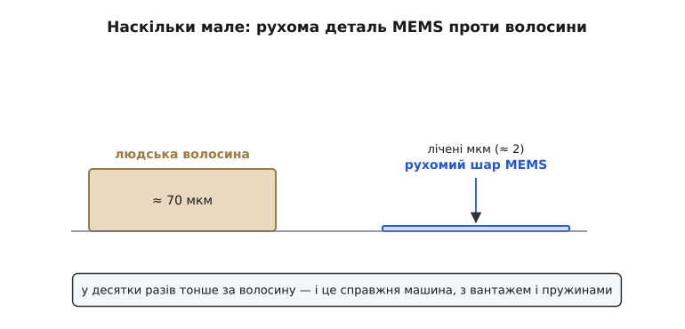
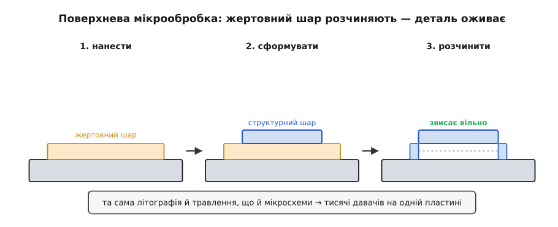
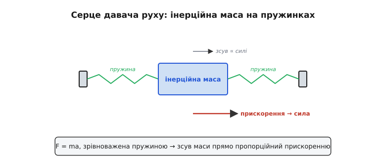
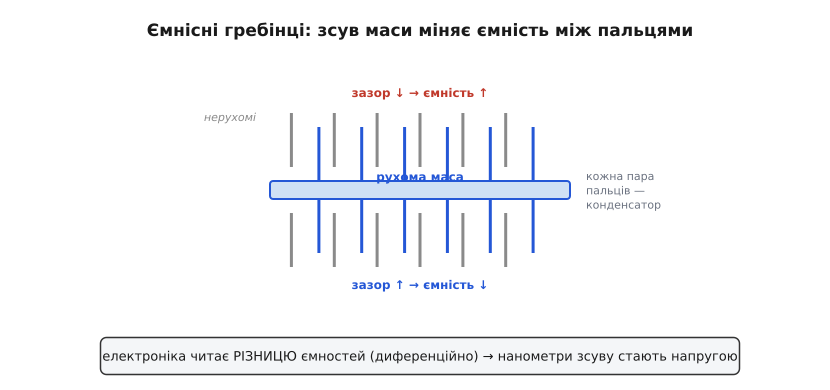
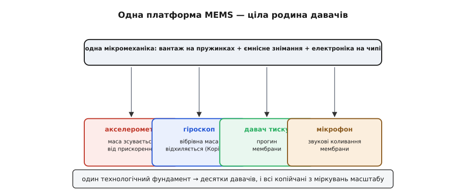
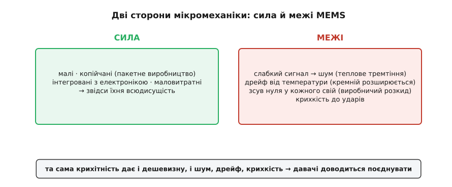

# MEMS: машини розміром із порошинку

**MEMS** (*Micro-Electro-Mechanical Systems*, мікроелектромеханічні системи) сьогодні всюди — у телефоні, дроні, фітнес-браслеті, — і варто розібрати, **що** воно таке й **як** працює. Адже всередині того копійчаного чипа справді захована **машина** — підвішений вантажик, пружинки, рухомі гребінці, — тільки розміром із порошинку, виточена в кремнії тими самими методами, що й мікросхеми. Уся ця крихітна механіка визначає головне: і як давач [міряє прискорення](root:hw-sensing/accelerometer) чи [обертання](root:hw-sensing/gyroscope), і чому він [шумить та дрейфує](root:hw-sensing/imu-noise-bias-drift). Тож варто познайомитися з MEMS як із реальним, хай і мікроскопічним, механізмом.

### Машина розміром із порошинку

Перше, що треба усвідомити: MEMS — це **справжня механіка**, лише неймовірно маленька. Її деталі — балки, пружини, вантажі — мають розміри в **мікрометри**, тобто тисячні частки міліметра. Рухомий шар акселерометра в десятки разів тонший за **людську волосину**, а вся структура — менша за макове зернятко.


*Рухомі деталі MEMS-давача — мікрометрового масштабу: товщина рухомого шару — лічені мікрометри, у десятки разів тонша за людську волосину (≈70 мкм), а вся структура — менша за макове зернятко. Це не метафора «маленький», а буквальна машина — з вантажем, пружинами й рухомими частинами, — тільки в тисячі разів дрібніша за все, що ви звикли бачити механічним.*

Ця крихітність — не лише дивина, а й джерело і сили, і слабкості MEMS. **Сила**: таку машину можна штампувати мільйонами на одній пластині, тож вона копійчана. **Слабкість**: що менша деталь, то слабші сигнали вона дає й то сильніше їх псує тепловий шум — звідси й вічна боротьба MEMS-давачів із [шумом та дрейфом](root:hw-sensing/imu-noise-bias-drift). Маленьке — дешево, але й тихо.

Варто на мить спинитися на самій можливості такої механіки. Те, що ми вміємо виточувати рухомі деталі в мікрометри завбільшки, — побічний дар напівпровідникової революції: та сама фотолітографія, що малює мільярди транзисторів із нанометровою точністю, легко вирізає й механічні балки в кремнії. MEMS, по суті, **позичив** усю інфраструктуру виробництва мікросхем — і саме тому народився дешевим і точним, не потребуючи будувати власну індустрію з нуля.

А чому саме мала маса означає шум? Бо на крихітний вантаж тиснуть не лише корисні сили, а й безладні удари молекул газу довкола — **тепловий** (броунівський) рух. Що менша маса, то відчутніше ці удари її совають, додаючи до показу випадкове тремтіння. Це не дефект конкретного чипа, а фундаментальна фізика: мікроскопічна механіка **неминуче** чує тепловий шум, і єдина рада — [усереднювати його обробкою](root:com-signal/moving-average). Дешевизна крихітності оплачується цим вічним шумовим фоном.

### Як виточують механізм у кремнії

Як же зробити рухому деталь у твердій кремнієвій пластині? Прийомом, що зветься **поверхневою мікрообробкою** (*surface micromachining*). Ідея — у **жертовному шарі**: на пластину наносять проміжний шар (наприклад, оксид), згори — структурний шар (полікремній), якому надають форми вантажа з пружинками, а тоді **розчиняють** проміжний шар. Структура, що трималася на ньому, раптом **звисає вільно** — і може рухатися.


*Як народжується рухома деталь. (1) На підкладку наносять **жертовний** шар. (2) Згори — **структурний** шар, якому травленням надають форми (вантаж, пружини). (3) Жертовний шар **розчиняють** — і структура, що була приклеєна, звисає вільно над підкладкою, готова рухатися. Усе — тими ж літографією й травленням, що й мікросхеми, тож одразу мільйонами на пластині.*

Найважливіше тут — **пакетність**: усе робиться тими самими фотолітографією й травленням, що й чипи, тож на одній кремнієвій пластині одночасно постають **тисячі** однакових давачів. Звідси і дешевизна, і повторюваність: кожен давач — точна копія сусіда. А ще поряд із механікою на тому самому кристалі вирощують і **електроніку**, що читатиме її рух (саме ця інтеграція й зробила свого часу проривним перший масовий MEMS-акселерометр ADXL50). Машина й мозок народжуються разом, на одній пластині.

Така тонка механіка дається непросто. Головний ворог — **злипання** (*stiction*): щойно звільнена структура така легка, а сили на мікромасштабі (поверхневий натяг, статика) такі відносно великі, що вантаж може просто **прилипнути** до підкладки й не відліпитися. Боротьба зі злипанням, із залишковими напругами в шарах, із точністю зазорів — і є ті «технічні бої», що роками стояли на шляху до дешевого MEMS. MEMS-виробництво — це не просто «зробити менше», а опанувати фізику, яка на такому масштабі поводиться інакше, ніж ми звикли.

### Серце MEMS: вантаж на пружинках

Хоч би який давач руху ви взяли, у його серці — той самий елемент: **інерційна маса** (*proof mass*, «вантаж-проба») на **пружинках**. Це крихітний шматочок кремнію, підвішений на тонких кремнієвих балках-пружинах так, що може трохи зсуватися. Уся фізика проста й знайома: за **другим законом Ньютона** сила зсуває масу, а пружинки опираються — отже, **зсув маси пропорційний прикладеній силі** (а сила — прискоренню).

Слово **інерціальний** тут ключове: давач відчуває рух **зсередини**, спираючись лише на **інерцію** власного вантажа, без жодного зовнішнього орієнтира — ні супутника, ні маяка, ні погляду назовні. Це і дар (працює будь-де, навіть під землею чи в космосі), і прокляття (без зовнішньої прив'язки [похибки накопичуються](root:hw-sensing/imu-noise-bias-drift), і їх доводиться [поєднувати з іншими давачами](root:com-signal/sensor-fusion)). Уся інерціальна навігація — від ракети до телефону — стоїть на цьому простому вантажику, що чує рух власною масою.


*Серце будь-якого MEMS-давача руху. Інерційна маса (вантаж) висить на кремнієвих пружинках. Прискорення штовхає масу, пружинки опираються — і маса зсувається рівно настільки, наскільки сильне прискорення (F = ma, зрівноважене пружиною). Виміряй цей мікрозсув — і знатимеш прискорення. Усе інше (акселерометр, гіроскоп) — варіації цього вантажа на пружинках.*

Цей **вантаж на пружинках** — головний образ усієї мікромеханіки руху. [Акселерометр](root:hw-sensing/accelerometer) міряє, як прискорення зсуває цю масу прямо; [гіроскоп](root:hw-sensing/gyroscope) — як обертання зсуває її вбік через ефект Коріоліса. Різні давачі — той самий підвішений вантажик, тільки збуджений по-різному.

У цього вантажа на пружинках є й своя **динаміка**, важлива на практиці. Як будь-яка система маса-пружина, він має власну **частоту резонансу**: на ній він гойдається найохочіше, тож зовнішні коливання поблизу неї спотворять показ. Щоб приборкати дзвін на резонансі, порожнину з вантажем заповнюють газом під тиском — він **демпфує** коливання (як олива в амортизаторі). Цей баланс жорсткості, маси й демпфування й задає **смугу частот**, у якій давач чесно міряє, — і вона завжди скінченна.

Лишається питання: як виміряти зсув **настільки** малий?

### Як читають мікрозсув: ємнісні гребінці

Зсув маси — це нанометри, мільярдні частки метра. Прямо його не побачиш — але можна виміряти **ємнісно**. До рухомої маси прикріплюють «гребінець» із багатьох тонких пальців, що заходять між нерухомими пальцями, як зчеплені зубці двох гребінок. Кожна пара сусідніх пальців — це маленький **конденсатор**, чия ємність залежить від відстані між ними. Зсунулась маса — змінилися зазори — змінилася **ємність**, і це вже легко зчитати електронікою.


*Як міряють нанометровий зсув. До рухомої маси кріплять «гребінець» рухомих пальців, що входять між нерухомими. Кожна пара пальців — крихітний конденсатор. Зсув маси зближує пальці з одного боку й віддаляє з другого — ємність з одного боку росте, з другого падає. Цю **різницю** (диференційне вимірювання) електроніка читає дуже чутливо, перетворюючи нанометри зсуву на напругу.*

Чому **багато** пальців і чому **диференційно**? Бо сигнал крихітний, і його треба підсилити всіма способами. Сотні паралельних пальців складають свої ємності в більшу, помітнішу; а **диференційна** схема (ємність росте з одного боку, падає з другого) подвоює сигнал і гасить спільні завади й температурний дрейф. Так нанометровий механічний зсув перетворюється на електричний сигнал, який уже можна [оцифрувати](root:hw-analog/adc) й [відфільтрувати](root:com-signal/moving-average).

Як саме електроніка «бачить» ємність? Вона подає на гребінці змінну напругу й міряє, скільки заряду на них поміщається, — а заряд за сталої напруги прямо пропорційний ємності. Зміна ємності на **фемтофаради** (тисячні частки пікофарада!) дає мізерну зміну заряду, тож схема має бути надчутливою — і саме тому її садять **поряд** із гребінцями, на тому самому чипі, щоб слабкий сигнал не встиг зашуміти на довгих доріжках. Це та сама інтеграція механіки й електроніки на одному кристалі, що від самого ADXL50 і робить MEMS придатними.

> 🔧 **Навіщо це.** Тримайте в голові, що ваш акселерометр — **механічний** прилад, а не чиста електроніка. Звідси практичні наслідки: він боїться **сильних ударів** (тонкі пружинки можна зламати — даташити вказують межу удару, часто тисячі g); він має власну **механічну** частоту резонансу (різкі поштовхи на ній спотворять показ); і він чутливий до **монтажу** (механічна напруга від паяння чи згину плати «тисне» на давач і дає похибку). Поводьтеся з ним як із крихітним механізмом, бо він ним і є.

### Одна платформа — багато давачів

Найкрасивіше в MEMS — що **той самий** набір прийомів (вантаж на пружинках + ємнісне зчитування + електроніка на чипі) породжує **цілу родину** давачів. Змінюючи форму маси та спосіб її збудження, на одній технології роблять усе сімейство.


*Одна платформа — багато органів чуття. Та сама мікромеханіка дає: **акселерометр** (маса зсувається від прискорення), **гіроскоп** (вібрівна маса відхиляється від обертання, ефект Коріоліса), **давач тиску** (прогин мембрани), **мікрофон** (звукові коливання мембрани) і ще багато. Один технологічний фундамент — десятки різних давачів, і всі копійчані з тих самих міркувань масштабу.*

Акселерометр, гіроскоп, давач тиску, MEMS-мікрофон, навіть мікродзеркала проєкторів — усе це нащадки тієї самої кремнієвої мікромеханіки. Для нас важливі перші три «органи руху»: [**акселерометр**](root:hw-sensing/accelerometer), [**гіроскоп**](root:hw-sensing/gyroscope) і споріднений із ними [**магнітометр**](root:hw-sensing/magnetometer), що разом і складають **IMU** (*Inertial Measurement Unit*, інерціальний вимірювальний блок) — той самий чип у вашому дроні чи телефоні.

Тенденція тут — дедалі тісніша **інтеграція**. Спершу акселерометр і гіроскоп жили окремо; тоді їх поєднали в один корпус — **шестиосьовий** IMU (3 осі прискорення + 3 осі обертання); додали магнітометр — вийшов **дев'ятиосьовий**. А в новіших чипах поряд садять ще й маленький процесор, що **сам** [поєднує давачі](root:com-signal/sensor-fusion) і віддає вже готову орієнтацію. Тобто межа між «давачем» і «обчислювачем» розмивається — і вам дедалі частіше дають не сирі осі, а вже опрацьований результат.

Одна обмовка: [магнітометр](root:hw-sensing/magnetometer), хоч і живе в тому самому корпусі IMU, насправді **не** MEMS-механіка — він міряє магнітне поле зовсім іншим принципом (часто ефектом Холла чи магнітоопором). Його просто зручно поселили поряд; а мікромеханіка вантажа на пружинках — це про акселерометр і гіроскоп.

На рівні коду спілкування з IMU просте й однакове для всіх: чип під'єднують шиною **I²C** чи **SPI**, а осі читають із його **регістрів** — кілька байтів на кожну вісь. Там само налаштовують **діапазон** (наприклад, акселерометр на ±2 чи ±16 g) і частоту видачі. Тобто фізика всередині складна, а інтерфейс назовні — банальний обмін байтами; уся хитрість лишається в тому, як ці сирі числа **осмислити**.

А «осмислити» означає одне: перевести сире ціле число з регістра у фізичну величину. Чип віддає не грами-вантажі й не нанометри зсуву, а вже **оцифровану** ємнісним перетворювачем кількість — ціле число, чию вагу задає вибраний діапазон. Розберімо це перетворення на конкретному й найпоширенішому давачі.

**Приклад. Акселерометр MPU-6050 у режимі ±2 g віддав по осі Z сире число 16384. Яке це прискорення в g і в м/с²?** Чип дає 16-бітне знакове число; у режимі ±2 g уся шкала ±32768 відповідає ±2 g, тобто **16384 одиниці на 1 g** (це число прямо вказане в даташиті як чутливість). Звідси:

```c
// MPU-6050, діапазон ±2 g: чутливість із даташита
#define LSB_PER_G   16384.0f      // одиниць на 1 g (режим ±2 g)
#define G_TO_MS2    9.80665f      // 1 g у м/с²

int16_t raw_z = 16384;            // сире знакове число з регістрів ACCEL_ZOUT

float g    = (float)raw_z / LSB_PER_G;   // = 16384 / 16384 = 1.000 g
float ms2  = g * G_TO_MS2;               // = 1.000 × 9.80665 = 9.807 м/с²
```

Крок за кроком: `16384 / 16384 = 1.000`, далі `1.000 × 9.80665 = 9.807`. Отже, давач лежить нерухомо віссю Z догори — він читає рівно **1 g** (≈ 9.807 м/с²), і це не рух, а земне тяжіння, яке акселерометр відчуває завжди. Поміняй діапазон на ±16 g — у даташиті стане 2048 одиниць на g, і той самий регістр уже доведеться ділити на 2048; усе перетворення зводиться до однієї константи чутливості.

> 🔧 **Навіщо це.** Найперша помилка з будь-яким IMU — забути перевести сире число в g правильною константою діапазону: поставив код на ±2 g, а чип налаштував на ±8 g — і всі прискорення вийдуть учетверо меншими, хоч давач справний. Завжди беріть `LSB_PER_G` саме для того діапазону, який реально записали в регістр конфігурації, і перевіряйте себе на нерухомому давачі: одна вісь має показувати ≈1 g, дві інші ≈0.

### Сила й межі MEMS

Чим MEMS гарні й чим обмежені — саме ці межі й диктують усю подальшу роботу з MEMS-давачем. **Сильні** боки очевидні: крихітні розміри, копійчана ціна (пакетне виробництво), інтеграція з електронікою, низьке енергоспоживання. **Слабкі** боки — зворотний бік крихітності.


*Дві сторони мікромеханіки. **Сила**: малі, копійчані, інтегровані, маловитратні — звідси їхня всюдисущість. **Межі**: крихітна маса дає **слабкий сигнал** (отже, шум); механіка чутлива до **температури** (розширення міняє пружини); виробничий розкид дає **зсув нуля** в кожного давача свій; і фізична **крихкість** до ударів. Кожна з цих вад докладно розбирається там, де йдеться про шум, зсув і дрейф; кожна ж і пояснює, чому давачам потрібне поєднання.*

- **Слабкий сигнал → шум.** Крихітна маса дає крихітну силу й нанометрові зсуви; на тлі теплового шуму це робить MEMS принципово [«шумними»](root:hw-sensing/imu-noise-bias-drift).
- **Чутливість до температури.** Кремній розширюється від нагріву, міняючи жорсткість пружин і зазори, — звідси температурний дрейф показів.
- **Зсув нуля.** Виробничий розкид означає, що кожен давач має свій невеликий зсув («нуль не на нулі»), який треба [калібрувати](root:hw-sensing/calibration).
- **Крихкість.** Тонка механіка боїться сильних ударів.

Саме ці чотири межі й роблять необхідними і [фільтрацію](root:com-signal/moving-average), і [калібрування](root:hw-sensing/calibration), і — головне — [**поєднання давачів**](root:com-signal/sensor-fusion): жоден MEMS-давач сам по собі не дає надійної картини, тож їх доводиться поєднувати докупи, щоб сильні боки одного прикривали вади іншого.

Для вашого проєкту ці межі означають конкретне. Сирий показ MEMS **тремтить** (шум), **повзе** з нагрівом (температурний дрейф) і **зміщений** від нуля (виробничий розкид) — і все це **нормально**, а не ознака браку. Завдання інженера — не дивуватися цьому, а **передбачити**: відфільтрувати тремтіння, відкалібрувати зсув, компенсувати чи прийняти дрейф і поєднати давачі. MEMS дає лише сировину, з якої гарну, придатну величину ще треба зробити обробкою.

> 🔧 **Навіщо це.** Не чекайте від MEMS-давача лабораторної точності — він копійчаний саме тому, що крихітний, а крихітний — значить шумний і дрейфливий. Реалістичні очікування рятують від розчарування: сирий показ акселерометра чи гіроскопа **завжди** треба фільтрувати, калібрувати й поєднувати з іншими давачами. Той, хто бере сирий вихід MEMS «як є», незмінно отримує тремтливу, повзучу й ненадійну величину — і дарма звинувачує «поганий давач».

Щоб відчути масштаб чисел, із якими працює мікромеханіка:

```
розмір рухомої структури:  ~ десятки-сотні мкм   (товщина шару — лічені мкм)
маса вантажа:              ~ мікрограми          (мільйонні частки грама)
зсув від 1 g прискорення:  ~ нанометри           (≈14 нм/g у типового давача)
зміна ємності:             ~ фемтофаради         (≈80 фФ/g; фФ — тисячна пФ)
```

Нанометри зсуву й фемтофаради ємності — ось чому MEMS-давач це водночас і диво інженерії, і вічна боротьба зі шумом: корисний сигнал тут мізерний за будь-якими мірками, і лише розумна електроніка та обробка роблять його придатним.

> 🔧 **Навіщо це.** Один чип IMU містить **кілька** давачів (акселерометр + гіроскоп, часто + магнітометр) — це не випадковість, а задум: окремо кожен ненадійний, а разом вони [доповнюють одне одного](root:com-signal/sensor-fusion). Тому, обираючи давач, дивіться не лише на акселерометр, а на **весь** набір у корпусі й на те, як виробник пропонує їх поєднувати; готові [IMU-плати](root:hw-sensing/imu) вміщають потрібний набір одразу: MPU-6050 — акселерометр + гіроскоп (6 осей, без магнітометра), ICM-20948 чи LSM9DS1 — повні 9 осей.

Отже, MEMS — це реальна, хоч і мікроскопічна, машина: вантаж на пружинках, чий нанометровий зсув читають ємнісними гребінцями, а поряд на чипі сидить електроніка. Ця проста серцевина породжує цілу родину давачів і несе в собі і всю їхню силу (дешевизна, всюдисущість), і всі їхні вади (шум, дрейф, крихкість). Найважливіший із її нащадків — [акселерометр](root:hw-sensing/accelerometer): той самий вантаж на пружинках перетворює прискорення — а заразом, що особливо цікаво, і незмінну силу тяжіння — на сигнал, придатний і щоб виявити рух, і щоб визначити, де «низ».

---
