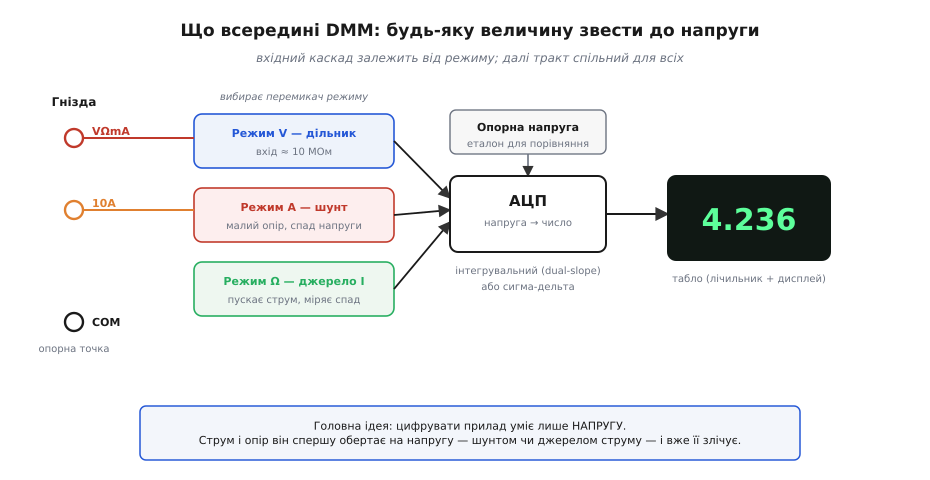
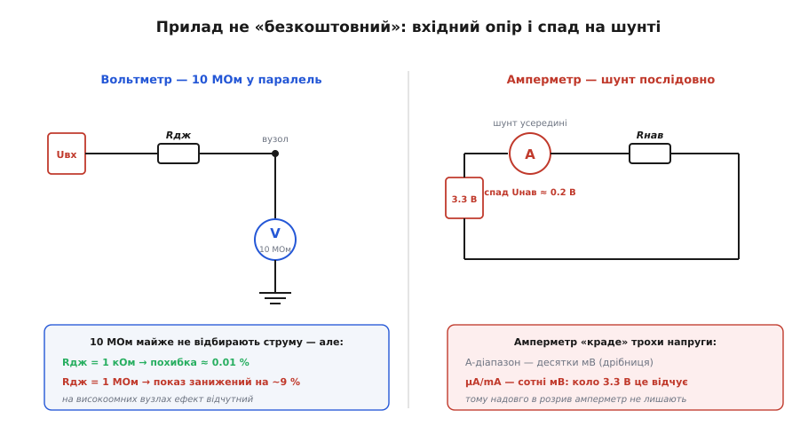
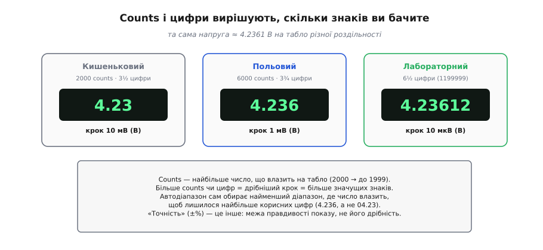

# 🔌 Мультиметр як компонент лабораторії: діапазони, вхідні опори, режими

Мультиметр зручно розуміти двічі: один раз — як інструмент, яким міряють напругу, струм і опір, і другий раз — як **прилад зі своїм паспортом**, у якого є вхідний опір, роздільність, тип перетворювача й власні похибки. Перший погляд каже, **куди тицяти щупами**; другий — **наскільки можна вірити числу на табло** і **який прилад брати** під конкретну задачу. Саме другий погляд і розбираємо тут: що в мультиметра всередині, звідки в характеристиках беруться «10 МОм», «counts» та «6½ цифри» і коли ці цифри починають псувати вам вимір.

## Клас: цифровий мультиметр

Сучасний мультиметр — це **цифровий** прилад (англ. *digital multimeter*, DMM): серце в нього — **аналого-цифровий перетворювач** (АЦП), а табло показує число. Старі **стрілкові** ще трапляються в шафах, та правлять бал цифрові, і саме на них тут орієнтуємося.

Розрізняють цифрові мультиметри насамперед за **роздільністю** — скільки знаків поміщається на табло: кишенькові «2000-count», польові «6000-count», точні настільні «6½ цифри». Другий поділ — як прилад читає **змінне**. Дешеві **середньовипрямні** усереднюють випрямлений сигнал і калібруються так, щоб для чистої синусоїди показати правильне діюче значення; на будь-якій іншій формі (імпульси, фаза під керуванням, спотворена мережа) вони вже брешуть. Точні **true-RMS** чесно обчислюють діюче значення з квадрата сигналу, тож показують правду для довільної форми. Це не дрібниця маркетингу: на виході імпульсного блока живлення чи диммера середньовипрямний прилад може помилитися на десятки відсотків.

## Блок-схема: усе зводиться до напруги

Головний секрет приладу: цифрувати він уміє **лише напругу**. Тому будь-яку іншу величину вхідний каскад спершу **обертає на напругу**, а вже її зчитує АЦП. Це й пояснює, чому величин «головних» лише три, а способів підключення — теж три, і всі різні.


*Вхідний каскад залежить від режиму — дільник для напруги, шунт для струму, джерело струму для опору, — і зводить величину до напруги; спільний АЦП порівнює її з опорною й видає число на табло.*

- **Напруга** — через **дільник** (атенюатор), що задає діапазон: він ділить вхідну напругу так, щоб вона влізла у вікно АЦП. Вхідний опір при цьому ≈ **10 МОм**.
- **Струм** — через **шунт** (малий точний опір): струм створює на ньому спад напруги, і вже цей спад міряє АЦП.
- **Опір** — прилад **сам** пускає крізь деталь відомий **струм** від внутрішнього джерела й міряє спад напруги; за законом Ома з відомого струму й виміряного спаду виходить опір. Звідси й правило знеструмлювати коло: чужа напруга додасться до власного струму приладу й зіб'є вимір.

Далі — спільний тракт: АЦП порівнює напругу з внутрішньою **опорною** (стабільним еталоном) і виставляє число. Найчастіше це **інтегрувальний** перетворювач (англ. *dual-slope* — двосхиловий) або **сигма-дельта**. Вибір не випадковий. Інтегрувальний АЦП накопичує вхідну напругу за фіксований проміжок часу, тож фактично усереднює її — а будь-яка завада, період якої вкладається в цей проміжок ціле число разів, в усередненні гаситься. Якщо взяти час інтегрування кратним періоду мережі (20 мс для 50 Гц, 16.7 мс для 60 Гц, а 100 мс накриває обидві), прилад **відсіює мережеву наводку 50/60 Гц** — ту саму, що псує делікатні виміри. Ось чому настільний мультиметр читає повільно (кілька разів на секунду), зате стабільно: він свідомо «дивиться» рівно один мережевий період, щоб наводка сама себе скоротила.

## Гнізда приладу

Гнізд зазвичай три-чотири, і сплутати їх — найдорожча з помилок:

- **COM** — спільне (чорний щуп); ваша опорна точка кола, від якої ведеться відлік.
- **VΩmA** — червоний щуп для напруги, опору й **малих** струмів.
- **10A** — для великих струмів, часто окремо й зі своїм потужним запобіжником (а буває, що **без** нього — і тоді надлишковий струм нищить сам прилад).
- іноді ще окреме **µA·mA** для зовсім малих струмів.

Червоний щуп, забутий у струмовому гнізді й потім прикладений до напруги, — це коротке замикання крізь шунт: між точками з напругою опиняється крихітний опір, і струм рине лавиною. Звідси проста звичка: виміряв струм — одразу поверни червоний щуп у «VΩmA».

## Два числа з паспорта, які реально впливають на вимір

Більшість рядків у паспорті можна проминути, але два визначають, чи довіряти показу. Обидва ростуть з того самого кореня: прилад, увімкнений у коло, неминуче **бере на себе частину** того, що міряє.


*Ліворуч — вольтметр як 10 МОм у паралель: на низькоомному вузлі непомітний, на високоомному занижує показ. Праворуч — амперметр як шунт у розриві: на ньому падає «напруга навантаження», яку прилад крадькома відбирає в кола.*

- **Вхідний опір ~10 МОм** (режим V). Вольтметр стає в **паралель** і трохи відбирає струму. На звичайному низькоомному вузлі це непомітно, та на **високоомному** (дільники в десятки МОм, ємнісні входи давачів) ці 10 МОм стають співмірними з опором кола й помітно **занижують** показ. Сюди ж — «фантомні» напруги: високий вхід ловить наводку на відключеному, але довгому дроті, і табло показує «привид» у кілька вольт, якого насправді немає; досвідчений діагност цьому не вірить і навантажує вузол, щоб привид зник.
- **Напруга навантаження** (англ. *burden voltage* — спад на приладі) у режимі струму. Шунт має малий, але **ненульовий** опір, тож амперметр «з'їдає» частину напруги кола. На амперних діапазонах це десятки мВ — дрібниця, та на **µA/mA** спад сягає сотень мВ, і низьковольтне коло (3.3 В!) це відчуває: ввімкнули амперметр у живлення мікроконтролера — і просадили йому живлення так, що він міг і перезапуститися. Саме тому крихітне споживання так нелегко виміряти «в лоб», і для цього беруть або прилад із малим спадом, або зовсім інший метод.

### Маленький приклад: чи спотворить вольтметр показ?

Вхідний опір легко перетворити з абстрактного числа на конкретну похибку. Прилад на вході — це резистор `R_in` у паралель до вузла з власним (вихідним) опором `R_s`; разом вони утворюють дільник, тож показана напруга трохи нижча за справжню:

```
U_показ = U_справж × R_in / (R_in + R_s)
похибка ≈ R_s / (R_in + R_s)
```

**Що покаже вольтметр (R_in = 10 МОм) на виході дільника з R_s = 1 МОм проти R_s = 1 кОм?**

```c
// Похибка навантаження вольтметра на двох вузлах: високоомному й звичайному.
// Усе у вольтах та омах; float цілком вистачає для оцінки.
float R_in   = 10.0e6f;   // вхідний опір вольтметра, 10 МОм
float U_true = 5.000f;    // справжня напруга на вузлі, В

float R_hi = 1.0e6f;      // високоомний вузол: 1 МОм
float R_lo = 1.0e3f;      // звичайний вузол:   1 кОм

float U_hi  = U_true * R_in / (R_in + R_hi);   // 5.000 × 10/11 = 4.545 В
float U_lo  = U_true * R_in / (R_in + R_lo);   // 5.000 × 10000/10001 ≈ 4.9995 В

float e_hi = (U_true - U_hi) / U_true * 100.0f;  // ≈ 9.1 %
float e_lo = (U_true - U_lo) / U_true * 100.0f;  // ≈ 0.01 %
```

Висновок наочний: на вузлі 1 МОм прилад занизить «5.00 В» до «4.55 В» — майже 9 %, і це не несправність, а сама фізика вимірювання. На звичайному вузлі 1 кОм похибка падає до сотих відсотка, тож нею спокійно нехтують. Практичне правило з цього одне: похибка від навантаження стає помітною (вище ~1 %), коли `R_s` доходить приблизно до сотої частки `R_in`, тобто до ~100 кОм. На високоомних вузлах або беруть прилад із входом 10 ГОм, або свідомо роблять поправку.

## Перший вимір: як «заговорити» з приладом

Увімкнули → обрали режим (або лишили **автодіапазон**) → приклали щупи → читаєте число. **Автодіапазон** сам бере найменший діапазон, де значення влазить, — щоб на табло лишилося найбільше значущих цифр. Зручно, але повільніше: на кожен новий вимір прилад «обмацує» діапазони, тож для серії однотипних вимірів діапазон фіксують вручну.


*Та сама напруга на приладах різної роздільності. «Counts» — найбільше число, що влазить на табло; більше counts і цифр означає дрібніший крок. Роздільність (скільки знаків видно) — не те саме, що точність (наскільки вони правдиві).*

Тут і криється сенс «**counts**»: це найбільше число, яке влазить на табло. Назва «3½ цифри» означає, що три розряди показують повні 0–9, а старший, «половинний», тягне лише 0 або 1 — тож межа 1999, і прилад заведено звати «2000-count». Так само 6000-count покаже «4.236», а настільний 6½-цифровий дотягне до 1199999 і покаже «4.23612». **Більше counts — дрібніший крок.**

Тільки не плутайте роздільність із **точністю** (±%): перше — скільки знаків видно, друге — наскільки вони правдиві, а це вже [окрема історія похибок виміру](topic:hw-sensing/measurement-errors). Прилад може бадьоро показувати «4.23612 В» і при цьому помилятися в третьому знаку: зайві цифри тоді — лише красивий шум. Тому роздільність обирають **під задачу**, а точність — **під потрібну довіру**, і це різні рядки паспорта.

## Варіації класу

Кишеньковий 2000-count — для побуту: перевірити батарейку, знайти обрив. Польовий 6000-count **true-RMS** — робочий кінь для мережі й силової електроніки, де форма сигналу далека від ідеальної синусоїди. Настільний 6½-цифровий — лабораторний еталон, яким калібрують інші прилади; його повільний інтегрувальний АЦП дає і дрібний крок, і пригнічення мережевої наводки.

Окремий рід — **струмові кліщі**: вони охоплюють дріт кільцем і міряють струм **навколо** нього за магнітним полем, не розриваючи кола. Це знімає одразу дві мороки звичайного амперметра — не треба різати коло й немає спаду на шунті, тож великі струми (десятки й сотні ампер) міряють просто й безпечно. Розплата — гірша роздільність на малих струмах, тож для міліамперів кліщі не помічники.
