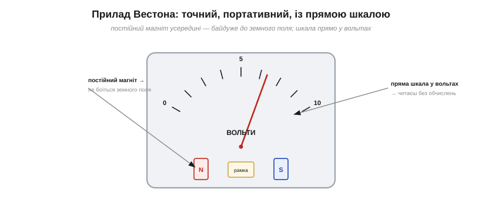
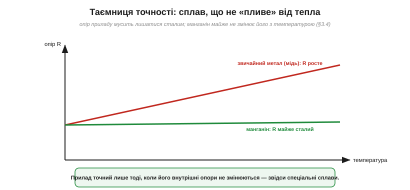
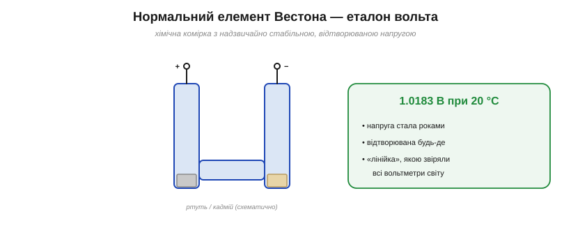
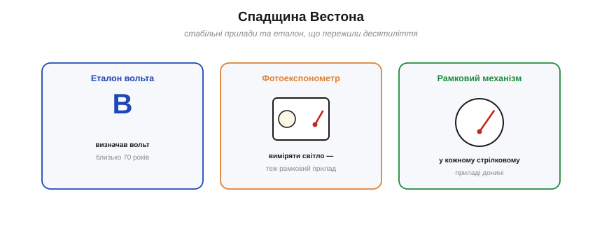

# 📜 Едвард Вестон: точність, якій можна вірити

> Беремо до рук [мультиметр](root:hw-sensing/multimeter) і приймаємо його числа на віру. Та чому, власне, йому можна **вірити**? Звідки береться точність? Адже точність не дається задарма — вона стоїть на двох стовпах: **стабільному приладі** й **стабільному еталоні**. Обидва значною мірою утвердив один чоловік — **Едвард Вестон**: він винайшов сплави, що не «пливуть» від температури, і нормальний елемент, який майже сторіччя визначав, скільки ж насправді у вольті вольтів (а сам рамковий механізм, що його Вестон удосконалив, ще до нього створили д'Арсонваль і Депре).

---

## Чому мультиметру можна вірити

Мультиметр показує «5.00 В» — і ми приймаємо це як істину. Але звідки прилад «знає», що таке вольт? І чому завтра, у спеку чи на морозі, він покаже те саме? Серцем стрілкового приладу є гальванометр — механізм, що перетворює струм на кут стрілки. Та грубий лабораторний гальванометр — це ще не **точний** прилад. Між «бачити струм» і «**довіряти** числу» лежить велика інженерна прірва, яку треба було перейти. І перейшов її Едвард Вестон.

---

## Проблема: ранні прилади «пливли»

Перші вимірювальні прилади мали три біди. По-перше, вони були **лабораторні** й **крихкі** — дзеркальні гальванометри з тонкими нитками не винесеш у поле чи цех. По-друге, багато з них спиралися на **земне магнітне поле** як опору, тож показ залежав від орієнтації приладу й сторонніх магнітів. А по-третє — і це найпідступніше — вони **«пливли» від температури**: внутрішні деталі нагрівалися, їхній [опір змінювався з нагрівом](root:ph-condensed/resistance-temperature), і прилад потроху брехав. Виміряти щось грубо — одне; виміряти **точно й однаково щоразу** — зовсім інша, набагато важча річ.

---

## Вестон: портативний точний прилад

**Едвард Вестон** (*Edward Weston*, 1850–1936) — народжений в Англії хімік, що емігрував до США й став одним із найплідніших винахідників своєї доби. Близько 1888 року він заснував фірму вимірювальних приладів і зробив те, що змінило галузь: створив **портативний, точний прилад прямого відліку**.

*Прилад Вестона: усередині — **постійний магніт**, тож показ не залежить від земного поля; а шкалу проградуйовано **прямо у вольтах** (чи амперах), тож значення читають без жодних обчислень. Це і є основа всіх стрілкових приладів дотепер.*

Сам принцип — **рухома рамка в полі постійного магніту** — за кілька років до Вестона запропонували французи **Жак-Арсен д'Арсонваль** (*d'Arsonval*) і **Марсель Депре** (*Deprez*), близько 1882-го. Вестонова заслуга — зробити цей прилад **придатним до життя**. По-перше, він замінив крихкий **підвіс** рамки на **вісь зі спіральними пружинками** (як у годинниковому балансі) і **стабілізував магніт**, щоб точність трималася роками, — звідси міцний, переносний прилад, **байдужий** до слабкого земного поля. По-друге, **пряма шкала**: її розмітили одразу у вольтах та амперах, тож більше не треба було нічого **обчислювати** — глянув на стрілку й прочитав відповідь. Прилад із наукової «цяцьки» перетворився на **робочий інструмент**, яким міг користуватися кожен інженер і майстер.

---

## Таємниця стабільності: сплав без дрейфу

Та портативність — то півсправи. Лишалася та сама підступна біда: **температурний дрейф**. Адже точність приладу залежить від його внутрішніх **опорів**: амперметр має шунт, вольтметр — додатковий опір. А опір звичайного металу помітно **росте** з температурою. Нагрівся прилад — «попливли» його опори — і показ бреше.

*Опір звичайного металу (міді) відчутно росте з температурою — і прилад, нагріваючись, починає брехати. Вестонів **манганін** майже не змінює опору з нагрівом, тож прилад тримає точність.*

Вестонове розв'язання було хімічним: він розробив спеціальні **сплави з майже нульовим температурним коефіцієнтом** — насамперед **манганін** (мідь-манган-нікель). Його опір майже **не змінюється** з температурою, тож зроблені з нього внутрішні резистори тримають своє значення хоч у спеку, хоч на холоді — а отже, прилад **тримає калібрування**. Ось де хімік у Вестоні переміг: не нова стрілка чи магніт, а **матеріал**, що не зраджує з нагрівом, дав приладам ту сталість, без якої немає точності. (Цей самий манганін і досі стоїть у точних шунтах та еталонних резисторах.)

Поряд із манганіном у вимірах прижився й **константан** (мідь-нікель) — теж сплав зі сталим опором. Ці «нудні» матеріали — справжні герої точності: коли від резистора вимагають, щоб його опір не змінювався ні від тепла, ні з роками, беруть саме такі спеціальні сплави, а не звичайну мідь.

---

## Чим міряти вольт: еталон Вестона

Лишалося найглибше питання. Хай прилад стабільний — але стабільний **відносно чого**? Щоб сказати «це рівно 1 вольт», потрібна **лінійка** для напруги, незмінний зразок, із яким звіряються. І Вестон дав світові й цю лінійку.

*Нормальний елемент Вестона — хімічна комірка, що дає надзвичайно стабільну й відтворювану напругу 1.0183 В (при 20 °C). Нею десятиліттями звіряли вольтметри по всьому світу — це була «лінійка» для напруги.*

1893 року Вестон винайшов **нормальний елемент** (*Weston standard cell*) — спеціальну гальванічну комірку, чия напруга **дивовижно стала й відтворювана**: близько **1.0183 В** при 20 °C, незмінна роками, і та сама в будь-якій лабораторії світу. Це був не «джерело живлення» (струму він майже не давав), а **еталон** — зразкова напруга, з якою звіряли всі вольтметри. Настільки добрий, що ним **офіційно визначали вольт** від 1911 року аж до 1990-го, коли його заступив квантовий (джозефсонівський) еталон. Майже **вісімдесят років** світ міряв напругу від Вестонової комірки.

> 🔧 **Навіщо це.** Тут — глибокий урок про сам **вимір**. Точність стоїть на двох речах: прилад має бути **стабільним** (не пливти від тепла — звідси манганін), і має бути **еталон** — незмінний зразок, із яким звіряються (звідси нормальний елемент). Будь-який прилад точний лише настільки, наскільки точний його **опорний зразок**: мультиметр усередині має стабільне джерело опорної напруги, відкаліброване зрештою від державних еталонів — нащадків Вестонової комірки. Тому, довіряючи числу на табло, ви насправді довіряєте довжелезному ланцюжку звірянь, що тягнеться до незмінних фізичних еталонів. Вимір без еталона — це лінійка без поділок.

---

## Хто був Вестон

*Спадщина Вестона: його нормальний елемент визначав вольт майже 80 років; його фірма зробила знамениті фотоекспонометри (теж рамкові прилади); а сам рамковий механізм живе в кожному стрілковому приладі донині.*

Вестон був винахідником рідкісної плідності — по ньому лишилося понад **300 патентів**. До приладів він устиг попрацювати над гальванічним покриттям металів, динамо-машинами й навіть нитками для **ламп розжарення** (у ту саму епоху, що й Едісон). А вже славу принесли прилади: його фірма стала **золотим стандартом** точності, і марку «Weston» знали всюди. Окрема гілка — **фотоекспонометри** «Weston»: ті самі рамкові прилади, тільки замість струму вони міряли **світло**, і ними користувалися найкращі фотографи (зокрема легендарний Ансел Адамс). Той самий принцип — обернути фізичну величину на кут стрілки — Вестон довів до досконалості й розніс по найрізніших застосуваннях.

Прикметна й сама постать. Бідний емігрант з Англії, який приїхав до Америки майже без грошей, став одним із титанів електротехніки своєї доби — і його ім'я на приладі означало «точно». Його шлях — нагадування, що в новій тоді галузі електрики дорогу прокладали не лише титуловані вчені, а й затяті практики-самоуки.

---

## Чим це відгукнулося

Зведімо. Едвард Вестон зробив вимір **надійним**, давши світові обидві опори точності:

- **Стабільний прилад** — портативний рамковий механізм (принцип «рамка в полі магніту» — д'Арсонваля й Депре; Вестон зробив його міцним, переносним і з прямою шкалою), а головне — **сплав манганін** без температурного дрейфу.
- **Стабільний еталон** — нормальний елемент, що визначав **вольт** майже 80 років.
- І сам **принцип** — обертати величину (струм, світло) на кут стрілки — у незліченних приладах, від вольтметра до фотоекспонометра.

Головна думка лишається з нами: **точність — це не про дорожчий прилад, а про незмінні речі**, на які він спирається. Кожен [мультиметр](root:hw-sensing/multimeter) у вашій руці вірить своїм числам лише тому, що в нього всередині є стабільне опорне джерело, відкаліброване зрештою від еталонів — далеких нащадків Вестонової комірки. Тож, читаючи «5.00 В», згадайте: за цими цифрами стоїть півтораста років боротьби за сталість — і хімік, що навчив метал не зраджувати з нагрівом.
