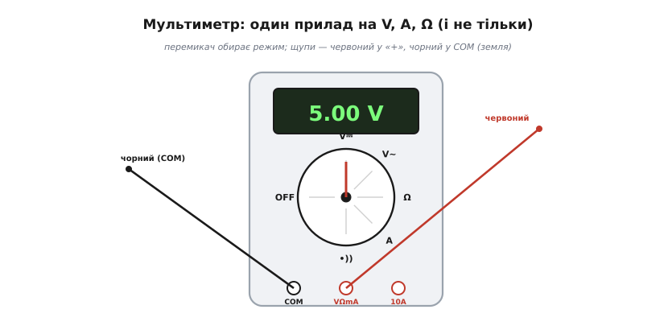
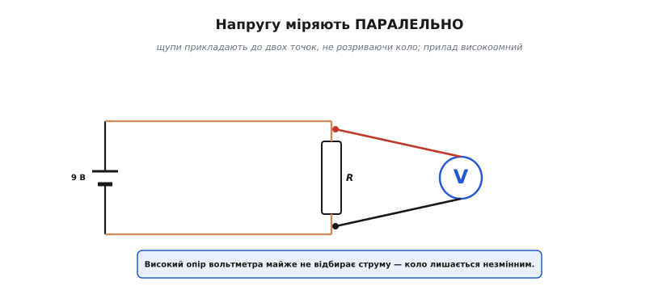
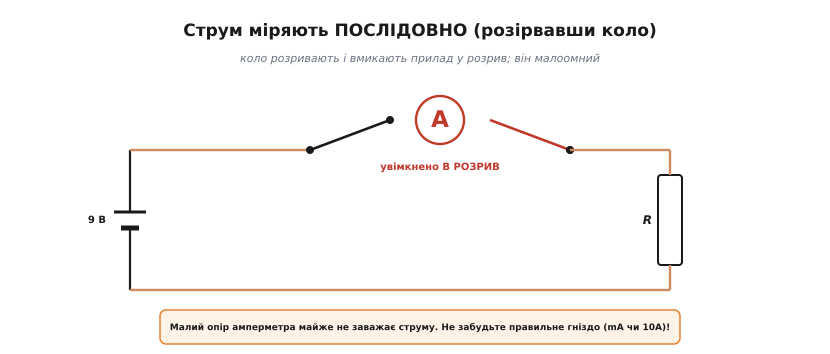
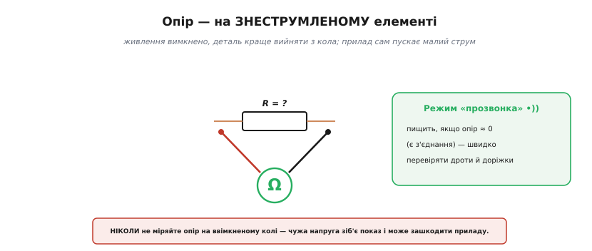
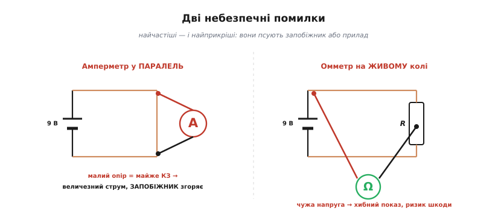

# Мультиметр: що і як він міряє

**Мультиметр** (лат. *multus* — багато + гр. *metréō* — міряю) — головний інструмент кожного, хто працює з електронікою: один прилад міряє напругу, струм і опір, а часто ще й перевіряє з'єднання, діоди, ємність, частоту. Назва каже все: «той, що міряє багато». Та вся ця універсальність тримається на трьох базових вимірах — напрузі, струмі, опорі, — і кожен із них робиться **по-різному**. Уся хитрість мультиметра не в тому, що він уміє багато, а в тому, що **за різні величини беруться різні способи**. Хто це зрозумів, той більше не нашкодить ні приладу, ні платі; хто не зрозумів — рано чи пізно спалить запобіжник. Тож розберімо не лише, на що тицяти, а **чому** саме так.

### Що вміє мультиметр


*Мультиметр: перемикач обирає режим (V⎓ постійна напруга, V~ змінна, A струм, Ω опір, •)) прозвонка), цифрове табло показує значення. Щупи: червоний — у гніздо «VΩmA» (або «10A»), чорний — у «COM», спільне гніздо приладу.*

Спереду в мультиметра — **табло** (у цифрового — з числом) і великий **перемикач режимів**: постійна напруга (V⎓), змінна (V~), струм (A), опір (Ω), «прозвонка» (•)) ) та інші. Знизу — **гнізда** для щупів. Чорний щуп завжди стоїть у «COM» (англ. *common* — спільне): це опорне, зворотне гніздо приладу, від якого ведеться відлік. Його ставлять на вашу **опорну точку** кола — найчастіше [землю кола](root:hw-pcb/ground-power-rails), хоча це не конче «земля» мережі, а просто та точка, відносно якої ви хочете виміряти. Червоний щуп іде в «VΩmA» для більшості вимірів або в окреме «10A» для великих струмів. Перемкнули режим, вставили щупи — і прилад готовий.

Одразу засвоймо нюанс, на якому спотикаються першого ж дня: для напруги (і струму) є **два** режими — **постійний** (позначка ⎓, для батарей, плат, USB) і **змінний** (~, для мережі 230 В). Усередині це майже різні прилади: змінне коло вимагає випрямлення й усереднення, постійне читається напряму. Сплутаєте — дістанете або нуль, або безглуздя: ввімкнете «постійний» режим на розетці й побачите близько нуля, бо середнє значення синусоїди за період і справді нуль. Тож завжди звіряйте першим ділом: постійне у вас живлення чи змінне.

Чому таких режимів узагалі багато, а величин — лише три «головні»? Бо цифрова частина приладу вміє по-справжньому лише **одне** — виміряти напругу на своєму вході. Усе інше вхідний каскад спершу **обертає на напругу**, а вже її зчитує. Струм пускають крізь точний опір і міряють спад напруги на ньому; опір — пускають крізь деталь відомий струм і знов-таки міряють спад. Звідси й ростуть три різні способи підключення — для напруги, струму й опору вони відмінні.

> 🔌 А що в мультиметра **всередині** — і звідки в його характеристиках беруться «10 МОм», «counts» і «6½ цифри»? Прилад зблизька, як компонент лабораторії з власним паспортом, — у вставці [Мультиметр як компонент лабораторії](root:hw-sensing/multimeter/comp-multimeter.md).

### Напругу — паралельно


*Напругу міряють паралельно: щупи прикладають до двох точок, не розриваючи кола. Високий опір вольтметра майже не відбирає струму, тож коло лишається незмінним.*

Напругу міряють **паралельно** — просто прикладають щупи до двох точок, **не розриваючи** кола. Червоний — туди, де очікують вищий потенціал («плюс»), чорний — до опорної точки. Це найбезпечніший і найчастіший вимір, і він добре відображає саму суть напруги: напруга — це **різниця потенціалів між двома точками**, тож і міряти її треба, торкнувшись обох.

Чому це не псує коло? Бо вольтметр зроблено **високоомним** — його вхідний опір зазвичай близько 10 МОм. Уявіть, що ви підключили паралельно ще один резистор на 10 мегаомів: на тлі звичайних кілоомних кіл він майже не відбирає струму, а отже, майже не змінює того, що відбувається. Саме тому напругу можна міряти «на живому», нічого не від'єднуючи. Але «майже» — не «зовсім»: коли коло саме **високоомне** (дільники в десятки мегаомів, входи датчиків), ці 10 МОм стають співмірними з опором кола й помітно **занижують** показ. Цю пастку точності легко прорахувати наперед звичайним правилом дільника — з числами вона стає очевидною.

Працює вимір лише **за умови**, що прилад і щупи розраховані на цю напругу та її категорію перенапруг (CAT), обрано правильний режим (постійне/змінне), а сама робота безпечна. Надто це стосується мережі 230 В, де через високий потенціал і неправильне поводження легко спіткнутися не лише на [похибках і пастках вимірювання](root:hw-sensing/measurement-errors), а й на ураженні струмом.

### Струм — послідовно (і обережно)


*Струм міряють послідовно: коло розривають і вмикають прилад у розрив, щоб увесь струм ішов крізь нього. Амперметр малоомний. Уважно з гніздом — для великого струму є окреме «10A».*

А ось струм — інша річ, і саме тут роблять найдорожчі помилки. Струм — це **потік заряду крізь переріз**, тож, щоб його виміряти, прилад мусить **стати на шляху цього потоку**. Звідси й правило: струм міряють **послідовно** — коло доводиться **розірвати** й увімкнути прилад у розрив, щоб увесь струм пройшов **крізь** нього. Це менш зручно (треба розмикати коло) і вимагає уваги.

По-перше, амперметр зроблено **малоомним** — у нього всередині крихітний точний опір (шунт), на якому струм лишає невеликий спад напруги. Це правильно: прилад майже не заважає струму, який міряє. Але саме через цей мізерний опір амперметр **категорично не можна** вмикати паралельно: для джерела це майже коротке замикання — найдорожча з усіх помилок із мультиметром.

По-друге, на мультиметрі зазвичай **окреме гніздо** для великих струмів — часто «10A», із власним потужним запобіжником. Звичайне «mA»-гніздо захищене слабшим запобіжником і розраховане на сотні міліамперів. Переплутаєте їх — і при великому струмі згорить запобіжник «mA»-входу (а буває, що великострумове гніздо взагалі без запобіжника, і тоді ризикує сам прилад). Тому перед вимірюванням струму звіряйте двічі: і режим, і гніздо.

> 🔧 **Навіщо це.** На щодень струм найчастіше міряють, щоб дізнатися **скільки споживає пристрій** — чи влізе він у бюджет батареї, чи не гріється понад норму. Розриваєте живлення між блоком і платою, вмикаєте амперметр у розрив — і читаєте струм спокою та струм під навантаженням. Саме тут згоряє найбільше запобіжників: лишили щупи в струмовому гнізді, перемкнулися «виміряти напругу» й тицьнули в живлення — а прилад досі малоомний, тож виходить майже коротке замикання. Звичка проста: виміряв струм — одразу поверни червоний щуп у «VΩmA».

### Опір і прозвонка — на знеструмленому


*Опір міряють на знеструмленому елементі (а краще — вийнятому з кола): прилад сам пускає крізь нього малий струм і за ним судить про опір. Режим прозвонки пищить при дуже малому опорі — швидко перевіряти з'єднання.*

Опір міряють **тільки на знеструмленому** колі — мало того, деталь краще зовсім **вийняти** хоча б одним виводом. Чому? Бо омметр працює так: він **сам** пускає крізь деталь свій маленький струм від внутрішнього джерела й міряє, який спад напруги на ній виходить; за законом Ома з цих двох величин і обчислюється опір. Звідси два наслідки. Перший: **чужа** напруга в живому колі повністю зіб'є цей делікатний вимір — додасться до власного струму омметра й дасть безглуздий показ, а то й зашкодить приладу. Другий: якщо деталь лишилася впаяною, **паралельні їй** елементи теж пропустять частину струму омметра, і ви виміряєте опір не самої деталі, а всього вузла — майже завжди занижений. Тому для чесного виміру резистор виймають із кола бодай однією ногою.

Поруч живе надзвичайно корисний родич — режим **прозвонки** (англ. *continuity* — неперервність). Це той самий вимір опору, тільки прилад не показує число, а **пищить**, коли опір малий — нижчий за поріг у кілька десятків ом (зазвичай близько 30–50 Ω, залежно від приладу). Тобто писк означає не строго «нуль опору», а «опір достатньо малий, щоб вважати це з'єднанням». Це найшвидший спосіб перевірити, чи цілий дріт, чи не відпаялася доріжка, чи справді дві точки сполучені — не дивлячись на табло, на слух.

Поряд часто є й режим **перевірки діода** (значок ▷|): він теж пускає малий струм, але показує **пряме падіння напруги** на p-n переході. У кремнієвого діода це зазвичай **0.5–0.8 В**, у германієвого — 0.2–0.3 В; у світлодіода помітно більше — від ~1.6 В до понад 3 В залежно від кольору (тож не кожен мультиметр «розгойдає» синій чи білий світлодіод і покаже його напругу). Робиться це теж на знеструмленому колі; ним зручно перевіряти, чи цілий діод і де в нього який вивід — у прямому напрямку прилад покаже падіння, у зворотному «OL» (обрив).

### Маленький приклад: чи можна довіряти показу?

Високий вхідний опір вольтметра рятує нас майже завжди — але корисно вміти **прикинути, коли саме «майже» закінчується**. Прилад на вході — це резистор `R_in ≈ 10 МОм`, увімкнений паралельно тій ділянці кола, що його ви міряєте. Якщо ділянка має власний (вихідний) опір `R_s`, то прилад і ця ділянка утворюють дільник, і показана напруга виходить трохи нижчою за справжню:

```
U_показ = U_справж × R_in / (R_in + R_s)
відносна похибка ≈ R_s / (R_in + R_s)
```

Звідси просте практичне правило: похибка від навантаження стає помітною (вище ~1 %), коли `R_s` доходить приблизно до сотої частки `R_in`, тобто до ~100 кОм. На звичайному низькоомному вузлі (одиниці кілоом) ефект мізерний; на виході дільника з мегаомних резисторів — уже відчутний.

Це легко перевірити просто в прошивці, коли ви, скажімо, звіряєте свій АЦП із показом мультиметра:

**Чи спотворить вольтметр (R_in = 10 МОм) показ на вузлі з вихідним опором R_s = 470 кОм?**

```c
// Оцінка похибки навантаження вольтметра на високоомному вузлі.
// Усе у вольтах та омах; float цілком вистачає для оцінки.
float R_in = 10.0e6f;     // вхідний опір вольтметра, 10 МОм
float R_s  = 470.0e3f;    // вихідний опір вузла, 470 кОм
float U_true = 3.300f;    // справжня напруга на вузлі, В

float U_meas = U_true * R_in / (R_in + R_s);   // що покаже прилад
float err_pct = (U_true - U_meas) / U_true * 100.0f;

// U_meas = 3.300 × 10e6 / (10.47e6) = 3.152 В
// err_pct = 4.49 %
```

Майже 4.5 % — це вже не дрібниця: прилад занизить «3.30 В» до «3.15 В» не через несправність, а через саму фізику вимірювання. Висновок практичний: на високоомних вузлах або беруть прилад із входом 10 ГОм, або свідомо роблять поправку. На звичайних низькоомних колах цією поправкою спокійно нехтують — підставте `R_s = 1 кОм` і похибка впаде до ~0.01 %.

### Дві небезпечні помилки


*Дві небезпечні помилки: амперметр у паралель до джерела — це майже коротке замикання, запобіжник згоряє; омметр на живому колі — чужа напруга дає хибний показ і може зашкодити приладу.*

Двох помилок бояться найбільше — їх роблять усі початківці хоч раз, і обидві ростуть з одного кореня: нерозуміння, **який** опір має прилад у кожному режимі й **як** його через це вмикати.

**Перша**: ввімкнути прилад у режимі **струму** (а він малоомний!) **паралельно** до джерела чи навантаження. Для джерела це майже **коротке замикання**: між його виводами опиняється крихітний опір шунта, крізь прилад рине величезний струм, і в кращому разі миттю згоряє **запобіжник** мультиметра, у гіршому — гинуть і прилад, і джерело. Якраз тому амперметр вмикають **лише в розрив**, ніколи впоперек.

**Друга**: міряти **опір на живому колі**. Омметр чекає, що крізь деталь піде лише його власний крихітний струм, — а тут на щупи приходить чужа напруга. Показ стає безглуздим, а делікатний вхід омметра може постраждати. Тому опір — завжди на **знеструмленому**.

> 🔧 **Навіщо це.** Три золоті правила, які варто закарбувати раз і назавжди: **напругу — паралельно** (вольтметр високоомний, можна на живому); **струм — послідовно**, розірвавши коло (амперметр малоомний, і ніколи не в паралель!); **опір — на знеструмленому**, а краще вийнятому елементі. Найчастіший «вбивця запобіжників» — лишити щупи в струмовому гнізді й тицьнути ними в напругу: це коротке замикання крізь шунт. Чорний щуп — це завжди ваш COM, від нього й відлік; найчастіше його кладуть на [землю кола](root:hw-pcb/ground-power-rails). А найкорисніша кнопка на щодень — прозвонка: нею за секунди знаходять обрив чи перевіряють, що з'єднання справді є. Поводьтеся з мультиметром свідомо — і він стане найвірнішим помічником у налагодженні.

---

Коротко: **мультиметр** міряє напругу, струм і опір (плюс прозвонку та перевірку діодів), і кожну величину — своїм способом. **Напругу** — паралельно (прилад високоомний, можна на живому). **Струм** — послідовно, розірвавши коло (прилад малоомний, окреме гніздо для великих струмів). **Опір** — на знеструмленому, краще вийнятому елементі (прилад сам пускає пробний струм). Чорний щуп — у COM (опорна точка, зазвичай земля), червоний — у VΩmA. Дві небезпечні помилки: амперметр у паралель (коротке → запобіжник) і омметр на живому колі (хибний показ, ризик шкоди).

> 📜 **Історична вставка:** [Едвард Вестон і точні прилади](root:hw-sensing/multimeter/hist-weston.md) — як стабільні сплави й еталон вольта зробили точний вимір буденним.

---
