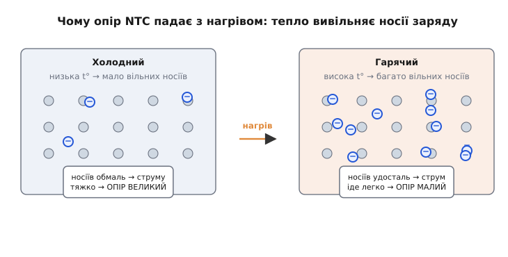
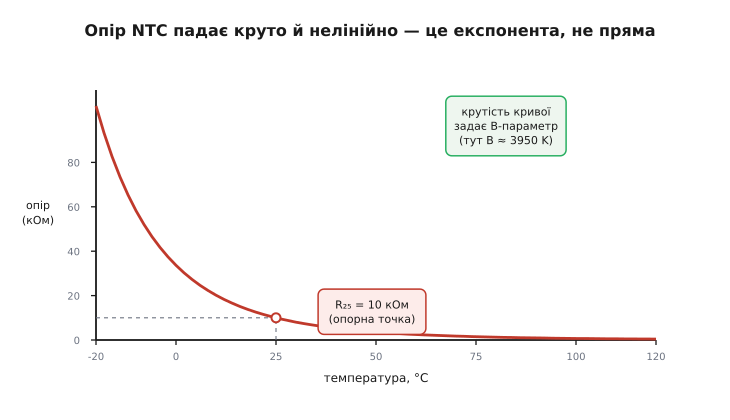
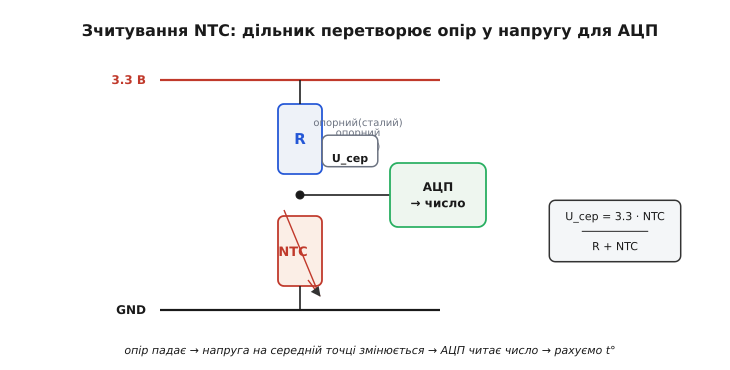
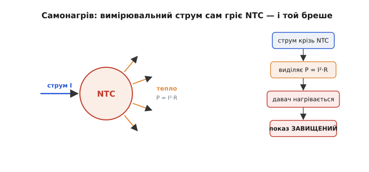
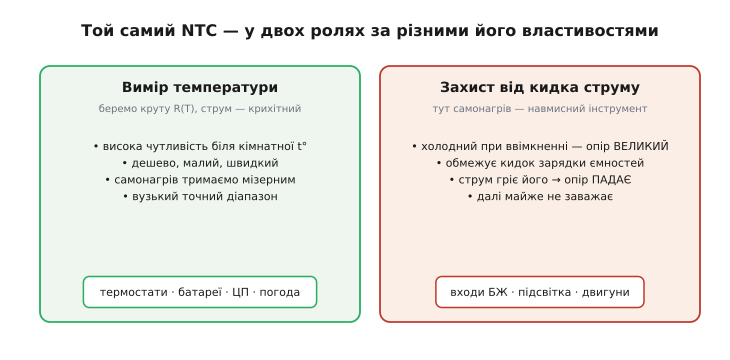

# NTC-термістор

Виміряти температуру електронікою — означає знайти **щось у схемі, що від тепла помітно й передбачувано міняється**. Найдешевший і найпоширеніший такий «щось» — це маленька намистинка чи крапля, опір якої сильно падає, коли її гріють. Це **термістор** (від англ. *thermal resistor* — «тепловий резистор»), а в найпопулярнішому різновиді — **NTC** (англ. *Negative Temperature Coefficient* — «від'ємний температурний коефіцієнт»): нагрів **зменшує** опір. Один копійчаний компонент, два дроти — і мікроконтролер може знати, скільки градусів навколо.

Розберемо його чесно, від першопричини: **чому** взагалі опір падає з нагрівом, чому ця залежність крута й крива, як перетворити опір у число, де ховається підступ самонагріву і в яких двох зовсім різних ролях цей давач працює.

### Чому опір падає з нагрівом

Спершу варто здивуватися самому факту. У звичайного металевого резистора опір із нагрівом **зростає** — нагрітий дріт чинить струму більший спротив. А термістор поводиться навпаки. Звідки протилежний знак?

Відповідь — у тому, з чого зроблено серцевину термістора. Це не метал, а **напівпровідникова кераміка** (спечені оксиди мангану, нікелю, кобальту). А в напівпровіднику струм несуть не «готові» вільні електрони, як у металі, а носії, яких треба **звільнити** — відірвати від атомів, давши їм енергію. За холоду вільних носіїв обмаль, тож речовина майже не проводить — опір великий. Грієш — теплові коливання ґратки **вибивають** дедалі більше носіїв, є кому нести струм, і опір **падає**. Це той самий [механізм, що пов'язує опір речовини з температурою](root:ph-condensed/resistance-temperature), тільки в напівпровіднику він діє в **протилежний** бік і набагато сильніше, ніж у металі.


*Першопричина від'ємного коефіцієнта. У холодній напівпровідниковій кераміці вільних носіїв заряду обмаль — струму важко, опір великий. Тепло вибиває носіїв дедалі більше, нести струм є кому — опір малий. У металі вільні електрони є завжди, тож там працює інша, протилежна за знаком залежність.*

Ось чому це **NTC**: більше тепла → більше носіїв → менший опір. Існує й дзеркальний прилад — **PTC** (англ. *Positive*), де опір з нагрівом різко **зростає**; його роблять інакше і застосовують здебільшого для захисту й самообмеження, а не для точного вимірювання. Коли кажуть просто «термістор для температури», майже завжди мають на увазі саме NTC — бо його залежність крута, гладка й зручна для вимірювання.

> 🔧 **Навіщо це.** Знак коефіцієнта — це не дрібниця для довідника, а перше, що визначає всю логіку схеми й коду. У NTC **гаряче = малий опір**, тож, побачивши на середній точці дільника низьку напругу, прошивка має розуміти «жарко», а не «холодно». Переплутати знак — і термостат вмикатиме нагрів саме тоді, коли треба охолоджувати.

### Залежність крута — і дуже нелінійна

Тепер придивімося, **як саме** опір залежить від температури. Якби він спадав рівно — на стільки-то ом на кожен градус, — життя було б простим. Але механізм «теплового вибивання носіїв» дає не пряму, а **експоненту**: на однакову зміну температури опір міняється не на однакову кількість ом, а **кратно — у стільки-то разів**.


*Крива опір–температура. Біля кімнатної температури опір падає дуже круто, а на краях діапазону крива «лягає». Це не пряма: на кожні +25 °C опір зменшується приблизно втричі. Один паспортний номінал R₂₅ (опір за 25 °C) задає висоту кривої, а її крутість — окремий параметр.*

Подивимось на типову намистинку «10 кОм»: за 25 °C її опір рівно 10 кОм, але вже за 0 °C — близько 34 кОм, а за 50 °C — лише ~3.6 кОм. Та сама зміна на 25 градусів — і опір щоразу міняється приблизно **втричі**, а не на сталу кількість ом. Саме ця крутість робить NTC чудовим давачем біля кімнатних температур: крихітна зміна тепла дає велику, легко вимірну зміну опору. Та сама крутість його й обмежує: далеко від робочої точки крива стає то надто стрімкою, то надто пологою, тож один NTC точний лише у **вузькому** діапазоні, а не «від −200 до +1000», як термопара.

Щоб порахувати температуру з виміряного опору, цю криву треба **описати формулою**. Тут є дві сходинки точності.

Простіша — **B-параметр** (інколи його звуть β). Вона прив'язує криву до однієї опорної точки (зазвичай 25 °C, опір R₂₅) і одного числа крутості B (в кельвінах), яке виробник пише в паспорті:

```
          ⎛     ⎛  1     1  ⎞⎞
R(T) = R₂₅ · exp⎜ B · ⎜ ─── − ─── ⎟⎟        T у кельвінах (°C + 273.15)
          ⎝     ⎝  T    T₂₅ ⎠⎠
```

Більше B — крутіша крива, чутливіший давач. Для типової намистинки B ≈ 3950 K. Формулу легко **обернути** й дістати температуру з відомого опору:

```
  1     1      1       ⎛ R ⎞
 ─── = ─── + ─── · ln ⎜ ─── ⎟        далі  T = 1/(…) − 273.15
  T    T₂₅     B       ⎝ R₂₅⎠
```

B-параметр дуже зручний, але він **точний лише поблизу** опорної точки — на широкому діапазоні похибка наростає до кількох градусів. Коли треба точніше, беруть **рівняння Стейнгарта–Гарта** (англ. *Steinhart–Hart*, на честь океанографів Джона Стейнгарта і Стенлі Гарта, які підібрали його 1968 року для давачів у морській воді). Воно описує ту саму криву трьома підібраними коефіцієнтами A, B, C і дає точність до сотих градуса в широкому вікні:

```
 1
─── = A + B·ln(R) + C·(ln R)³        A, B, C — з паспорта або з калібрування
 T
```

Це найточніший практичний спосіб перейти від опору до температури; ціна — три коефіцієнти замість одного й трохи більше обчислень. На дрібному мікроконтролері часто беруть простіший B-параметр у вузькому діапазоні, а Стейнгарта–Гарта залишають там, де борються за десяті частки градуса.

> 🔧 **Навіщо це.** Нелінійність означає, що **не можна** перерахувати опір у температуру множенням на сталий коефіцієнт — потрібна або формула (B чи Стейнгарт–Гарт), або таблиця з інтерполяцією в прошивці. На восьмибітному мікроконтролері без апаратного `exp()` часто дешевше зберегти невелику **таблицю** «опір → температура» й інтерполювати між точками, ніж рахувати логарифми наживо.

### Як перетворити опір у число: дільник плюс АЦП

Мікроконтролер не вміє читати опір напряму — його [АЦП міряє лише напругу](root:hw-analog/adc). Тож опір спершу треба перетворити на напругу, і найпростіший спосіб — **[дільник напруги](root:hw-analog/voltage-divider)**: послідовно з'єднати NTC і звичайний сталий резистор, подати на них живлення, а напругу зняти із **середньої точки** між ними. Опір NTC гуляє з температурою — і напруга на середній точці гуляє разом із ним.


*Зчитування NTC дільником. Сталий опорний резистор і NTC утворюють дільник між живленням і землею; напругу із середньої точки читає АЦП. Опір NTC падає з нагрівом — напруга на середній точці змінюється — мікроконтролер дістає число й рахує з нього температуру.*

**Приклад (від опору до напруги і назад до градусів).** Візьмемо живлення 3.3 В, угорі — опорний резистор 10 кОм, унизу — NTC «10 кОм / B = 3950». Що прочитає АЦП за різних температур і як із цього дістати температуру:

```
U_сер = Vcc · NTC / (R + NTC)          дільник, NTC унизу

t =  0 °C → NTC ≈ 33.6 кОм → U_сер = 3.3 · 33.6/(10+33.6) ≈ 2.543 В
t = 25 °C → NTC = 10.0 кОм → U_сер = 3.3 · 10.0/(10+10.0)  = 1.650 В
t = 50 °C → NTC ≈  3.59 кОм → U_сер = 3.3 ·  3.59/(10+3.59) ≈ 0.871 В
```

Видно одразу дві речі. По-перше, гарячіше — **нижча** напруга (опір NTC малий), і прошивка має це врахувати. По-друге, напруга змінюється добре помітно — майже два вольти на 50 градусів, тобто десятки кроків АЦП на градус: роздільності з головою. Зворотний шлях у коді — поділити, дістати опір NTC, тоді через B-формулу — температуру:

```c
// 12-бітний АЦП (0..4095), опорний резистор зверху, NTC знизу
// Vcc скорочується, тож працюємо прямо з відліком raw
float ntc_temperature_c(int raw) {
    const float R_REF = 10000.0f;   // опорний резистор, Ом
    const float R25   = 10000.0f;   // опір NTC за 25 °C
    const float BETA  = 3950.0f;    // B-параметр, K
    const float T25   = 298.15f;    // 25 °C у кельвінах

    float ratio = raw / 4095.0f;            // частка від повної шкали = U_сер/Vcc
    float r_ntc = R_REF * ratio / (1.0f - ratio);   // опір NTC з дільника
    float invT  = 1.0f / T25 + logf(r_ntc / R25) / BETA;
    return 1.0f / invT - 273.15f;           // назад у °C
}
```

Залишається вибір опорного резистора. Зручне правило — взяти його **рівним опору NTC у середині цікавого діапазону** (часто це й є R₂₅). Тоді саме там дільник найчутливіший, а робоче вікно лягає на середину шкали АЦП, не впираючись у краї. Зміщуючи опорний резистор, ви зсуваєте «солодку точку» чутливості туди, де вам найважливіше міряти.

Один практичний підступ: дільник чутливий до **точного значення живлення**, бо напруга середньої точки пропорційна Vcc. Якщо живити дільник від **тієї ж** напруги, що править АЦП за опорну (ratiometric-схема), Vcc у формулі скорочується — і дрейф чи шум живлення майже не псують вимір. Це маленьке рішення безкоштовно прибирає цілий клас похибок, тому так і роблять у грамотних схемах.

### Самонагрів: давач, що сам себе обманює

Тепер — найтонша пастка, через яку точні виміри найчастіше й пливуть. Щоб **виміряти** опір NTC, крізь нього доводиться пустити **струм**. Але будь-який струм у будь-якому опорі виділяє тепло — потужність P = I²·R. А наш давач реагує саме на тепло. Виходить замкнене коло: вимірювальний струм **підігріває** давач, той показує температуру **вищу** за справжню, причому стабільно й непомітно.


*Петля самонагріву. Струм, потрібний для вимірювання, виділяє в самому NTC потужність P = I²·R; вона підігріває давач понад навколишню температуру, і показ виходить завищеним. Що більший струм — то грубіша похибка. Лікують її, тримаючи струм (а отже й потужність) малим.*

Наскільки це страшно, каже один паспортний параметр — **коефіцієнт розсіяння** (англ. *dissipation constant*), у міліватах на градус: скільки потужності треба вкинути, щоб давач нагрівся на 1 °C над оточенням. Для дрібної намистинки на повітрі це порядку 2 мВт/°C. Порахуймо.

**Приклад (коли самонагрів не страшний, а коли вже бреше).** NTC 10 кОм, коефіцієнт розсіяння 2 мВт/°C:

```
P = I²·R,   перегрів  Δt = P / (коеф. розсіяння)

I = 100 мкА → P = (1e-4)² · 10000 = 0.0001 Вт = 0.1 мВт
            → Δt = 0.1 / 2 = 0.05 °C    ← нехтовно, чудово

I = 1 мА    → P = (1e-3)² · 10000 = 0.01 Вт = 10 мВт
            → Δt = 10 / 2 = 5 °C       ← груба, неприйнятна похибка
```

Різниця між «чудово» і «зіпсовано» — лише в десять разів за струмом. Звідси прості ліки: тримати вимірювальний струм **малим** (десятки–сотні мікроампер) — тобто не ставити надто малий опорний резистор; вимірювати **коротким імпульсом** і вимикати живлення дільника між відліками, щоб давач не встигав грітися; і не забувати, що в **нерухомому повітрі** перегрів куди більший, ніж у воді чи в притиснутому до металу корпусі, бо тепло гірше відводиться. На щастя, цей самий струм легко обмежити, бо живлення дільника часто подають не від постійної шини, а з керованої цифрової ніжки — і вмикають лише на коротку мить виміру.

> 🔧 **Навіщо це.** Самонагрів — улюблене пояснення «давач показує на пів градуса більше, ніж термометр поруч». Перш ніж лаяти давач, порахуйте P = I²·R у вашій робочій точці й поділіть на коефіцієнт розсіяння: часто виявляється, що ви самі його й підігріли надто жадібним струмом. Менший струм або імпульсне живлення — і похибка зникає без жодної зміни деталей.

### Де працює: два зовсім різні застосунки

Найцікавіше, що той самий компонент живе у двох протилежних ролях — і в кожній «головною» стає інша його властивість.


*Дві ролі одного давача. Ліворуч — вимір температури: цінуємо круту криву R(T) і навмисно тримаємо струм крихітним, щоб самонагрів не заважав. Праворуч — захист від кидка струму: тут самонагрів навмисний — холодний NTC має великий опір і гасить кидок, а нагрівшись струмом, опір скидає й майже не заважає.*

**Перша роль — вимір температури**, і вона очевидна: крута крива R(T) дає високу чутливість, а малий розмір — швидку реакцію. Цим давачем міряють температуру в термостатах і термометрах, стежать за нагрівом акумулятора під час [заряджання](root:hw-power/li-ion-charger) (де перегрів небезпечний), за температурою процесора чи плати, за погодою. Дешево, мало, точно у своєму вікні — звідси й величезна поширеність. Тут самонагрів — **ворог**, якого тримають мізерним.

**Друга роль — захист, де самонагрів навмисний.** Уявіть момент увімкнення блока живлення: розряджені вхідні конденсатори в перші миті виглядають для мережі майже як коротке замикання, і крізь них б'є величезний **кидок струму** (англ. *inrush current*), здатний приварити контакти чи вибити запобіжник. Поставте на вході **силовий NTC** — і поки він холодний, його опір **великий** і гасить кидок. А далі робочий струм поступово **нагріває** цей самий NTC, його опір **падає**, і він майже перестає заважати. Один пасивний компонент, без жодної електроніки, бере на себе найнебезпечнішу мить — і саме «вада» самонагріву тут стає корисним інструментом. Та сама ідея захищає лампи, двигуни й підсвітку від удару струмом у момент пуску.

Ось чому варто розуміти NTC **від першопричини**, а не запам'ятовувати рецептом: одна й та сама фізика — «тепло вивільняє носії, опір падає» — в одному застосунку дає точний термометр, а в іншому — пасивний запобіжник від кидка струму. Знаючи механізм, ви відразу бачите, **яку** його властивість тягне ваша задача й де чатує підступ.

### Що лишається в руках

Складімо все докупи. NTC-термістор — це напівпровідникова намистинка, опір якої **падає** з нагрівом, бо тепло вивільняє носії заряду; падає **круто й нелінійно**, як експонента, тож температуру дістають із опору формулою (простіший B-параметр чи точніше рівняння Стейнгарта–Гарта) або таблицею. Читають його **[дільником](root:hw-analog/voltage-divider)**, перетворюючи опір на напругу для **[АЦП](root:hw-analog/adc)**, і обережно з **самонагрівом** — бо вимірювальний струм підігріває давач і завищує показ. А живе він у двох світах: як дешевий точний термометр у вузькому діапазоні й як пасивний обмежувач кидка струму, де самонагрів навмисно ставлять собі на службу.

Короткий чек-лист на кожен NTC у схемі: який його R₂₅ і B — і в якому **вузькому** діапазоні він точний; який опорний резистор кладе робоче вікно на середину шкали АЦП; який вимірювальний струм — і чи не гріє він давач понад припустиме; чи живиться дільник від тієї ж напруги, що править АЦП за опорну (щоб дрейф живлення скоротився); і **яку** з двох ролей — вимір чи захист — насправді відіграє цей давач. Відповіси на ці п'ять питань — і копійчана намистинка чесно перетвориться на надійне число градусів у мікроконтролері.
