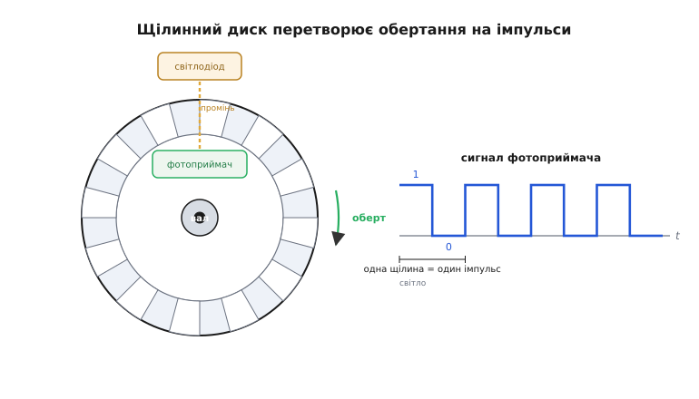
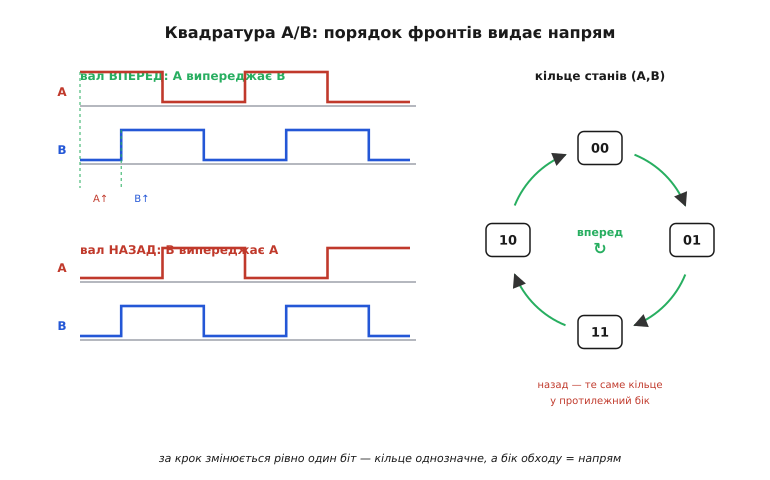

# Оптичний інкрементний енкодер

Мотор крутиться — а скільки він уже накрутив? Це питання здається дрібним, поки не спробуєш ним керувати. Колесо робота проїхало пів метра чи метр? Вал верстата став точно на потрібний кут чи проскочив? Сам мотор цього не знає: подав напругу — він обертається, зняв — спинився, але **на скільки** обернувся, напруга не каже. Потрібен окремий прилад, який рахує оберти й повертає число. Найдешевший і найпоширеніший такий прилад — **оптичний інкрементний енкодер** (від лат. *incrementum* — приріст, бо він видає не кут сам по собі, а його **приріст**: на скільки крокнуло від попереднього разу).

Ідея в основі майже наївна: насадити на вал диск із дірочками й рахувати, скільки їх пробігло повз нерухоме око. Уся хитрість починається там, де цього виявляється замало — коли треба знати не лише **скільки**, а ще й **куди** крутиться вал. Саме звідти народжуються дві доріжки, квадратура й учетверена роздільність — і кожна з них випливає з простого браку в попередньому, наївному варіанті.

## Щілинний диск і оптичне око

Почнімо з найпростішого, що взагалі можна зробити. Беремо тонкий диск, насаджуємо його на вал мотора й прорізаємо по краю рівномірні **щілини** — наскрізні прорізи, що чергуються з непрозорими перемичками. По один бік диска ставимо світлодіод, по другий, точно навпроти, — фотоприймач. Виходить **оптопереривач** (англ. *optical interrupter*): світло від діода або проходить крізь щілину й засвічує приймач, або впирається в перемичку й гасне.

Тепер крутимо вал. Край диска біжить між діодом і приймачем, і щілини з перемичками по черзі то відкривають, то перекривають промінь. Фотоприймач на виході дає рівно те, що бачить: світло — темрява — світло — темрява. Підсилювач-формувач перетворює цей плавний оптичний відгук на чистий **прямокутний сигнал**: одиниця, коли світло пройшло, нуль, коли його перекрито. Один повний цикл «світло-темрява» — це одна щілина, що пробігла повз око, тобто **один імпульс**.

> 🔧 **Навіщо це.** Уся складність енкодера зведена до одного: перетворити обертання на потік однакових імпульсів, які мікроконтролер уміє рахувати. Далі вже не механіка, а арифметика — а її процесор робить дешево й точно.

Оптичне око тут не випадкове. Можна було б рахувати щілини механічним контактом — але контакт зношується, брязкає (дає хибні подвійні спрацювання) і не встигає за швидким валом. Світло ж нічого не торкається: воно не зношується, перемикається за частки мікросекунди й байдуже до пилу, поки той не залив щілину геть. Як саме фотон у приймачі обертається на струм, а той — на чисту логічну сходинку, розбирає окрема тема.

> Світло крізь щілину ловить **фотоприймач** — фотодіод або фототранзистор: фотон народжує в напівпровіднику пару носіїв, з них тече струм, а компаратор робить із нього чисту логічну одиницю. Для енкодера на високих обертах беруть швидкий приймач (фотодіод), щоб фронти імпульсів не розпливалися.
>
> 🔗 [Фотоприймачі: як світло стає електричним сигналом](root:hw-sensing/photo-sensors)


*Серце енкодера. Диск зі щілинами насаджено на вал; нерухомий світлодіод світить крізь край диска на фотоприймач навпроти. Щілина пропускає промінь — на виході одиниця; перемичка гасить — нуль. Поки вал крутиться, на виході біжить потік однакових прямокутних імпульсів, і кожен імпульс відповідає одній щілині, що пробігла повз око.*

## Полічити імпульси — ще не знати напрям

Маємо потік імпульсів. Здавалося б, лічи їх — і знатимеш, на скільки повернувся вал. Якщо диск має, скажімо, 360 щілин, то 90 імпульсів — це чверть оберту, рівно 90°. Просто й заманливо.

Та одразу постає діра, і вона серйозна. Уяви, що вал на мить крутнувся вперед, спинився й крутнувся назад — повернувся точнісінько туди, де був. **Один** фотоприймач бачить в обох випадках те саме: світло-темрява-світло, що вперед, що назад, бо щілини проходять повз нього однаково в обидва боки. Лічильник додасть імпульси і **там, і там** — і вирішить, що вал просунувся вперед, хоча той вернувся на місце. Колесо робота крутнулося назад, а одометрія впевнено додала пройдений шлях уперед.

Корінь біди в тому, що **один** сигнал несе замало. Прямокутник «світло-темрява» симетричний у часі: розвернувши обертання, ти отримаєш ту саму послідовність, лише прогорнуту назад, а сходинки в ній на вигляд однакові. З однієї доріжки напрям обертання просто **не виводиться** — інформації про нього там фізично немає. Потрібен другий сигнал, який порушить цю симетрію.

## Дві доріжки A і B: квадратура дає напрям

Рішення елегантне. Ставимо не одне око, а **два** — два фотоприймачі поряд над тією самою доріжкою щілин, але **зсунуті** один від одного так, щоб другий «бачив» щілину трохи пізніше за перший. Точніше — на **чверть періоду** щілини (на чверть кроку «щілина + перемичка»). Перший канал назвемо **A**, другий — **B**.

Що це дає? Тепер на виході два прямокутні сигнали, однакові за формою, але **зсунуті по фазі на чверть періоду** — на 90° електричних. Саме цей зсув на чверть і зветься **квадратурою** (від лат. *quadratus* — четвертний: чверть періоду). І ось ключове: **порядок**, у якому канали перемикаються, залежить від напряму обертання.

Простежмо. Вал крутиться **вперед** — щілина доходить спершу до ока A, тоді до ока B. Отже A перемикається першим, B — за ним: фронт A випереджає фронт B. Розвернімо вал — щілина тепер доходить спершу до B, а до A пізніше: тепер **B** перемикається першим. Та сама пара сигналів, але хто кого випереджає — перевернулося. Симетрія, що губила напрям, зламана: одного погляду на те, який канал іде попереду, досить, щоб сказати, куди крутиться вал.

```
вал ВПЕРЕД:   A випереджає B  (фронт A приходить раніше)
вал НАЗАД:    B випереджає A  (фронт B приходить раніше)
```


*Квадратура. Канали A і B зсунуті на чверть періоду щілини (90° електричних). Угорі — обертання вперед: фронт A приходить раніше за фронт B. Унизу — назад: тепер B випереджає A. Сама послідовність станів пари (A,B) обходить чотири клітинки по колу в один бік уперед і в протилежний назад — звідси й береться знак напряму.*

Є й точніший спосіб це побачити — через **стани пари**. Двобітна комбінація (A, B) має чотири значення: 00, 01, 11, 10. Коли вал крутиться рівномірно, ця пара не стрибає абияк, а обходить чотири стани **строго по колу**: 00 → 01 → 11 → 10 → 00 — і так без кінця. А назад вона йде тим самим колом, але в **протилежний** бік: 00 → 10 → 11 → 01 → 00. Тобто напрям — це просто **бік обходу** цього кільця станів. Цим і користається код зчитування: запам'ятай попередню пару, поглянь на нову — і з переходу між ними дізнаєшся не лише що крок стався, а й куди.

Чому неможливі «діагональні» стрибки 00 → 11? Бо канали зсунуті на чверть: щоб обидва біти змінилися воднораз, щілина мусила б одночасно перетнути обидва ока, а вони рознесені. За один крок змінюється **рівно один** біт — і саме це робить кільце станів однозначним.

## ×4: чотири події з однієї щілини

Розгляд через стани дарує ще один, уже безкоштовний виграш — **учетверену роздільність**.

У дусі «полічи імпульси» одна щілина давала одну подію: пройшла — плюс один. Але гляньмо, що насправді відбувається, поки одна щілина пробігає повз пару ока. Пара станів за цей шлях змінюється **чотири рази**: спершу відкривається A (00 → 10), потім відкривається B (10 → 11), потім закривається A (11 → 01), потім закривається B (01 → 00). Чотири фронти — два на каналі A (передній і задній) і два на каналі B — і всі вони припадають на **різні** моменти, бо канали зсунуті на чверть.

А якщо подія — це **будь-який фронт будь-якого каналу**, то з однієї щілини ми ловимо не одну подію, а **чотири**. Лічильник, що реагує на кожен фронт обох каналів, за один оберт диска з N щілинами нарахує не N, а **4N** кроків. Роздільність учетверилася — без жодної зміни механіки, лише розумнішим читанням.

```
N щілин на диску
рахуєш імпульси одного каналу:        N кроків/оберт   (×1)
рахуєш фронти обох каналів (квадратура): 4·N кроків/оберт (×4)

приклад: N = 360
×1 → 360 кроків/оберт  → крок 1.000°
×4 → 1440 кроків/оберт → крок 0.250°
```

> 🔧 **Навіщо це.** ×4 — це безкоштовна точність. Диск із 500 щілин коштує як диск із 500 щілин, але з квадратурним читанням він дає 2000 кроків на оберт. Тому в реальних системах майже завжди читають саме квадратуру, а не один канал: та сама механіка, вчетверо дрібніший крок.

Заплатити за це доведеться лише пильністю в коді: рахувати треба **кожен** фронт і щоразу з пари станів визначати знак (+1 уперед, −1 назад), інакше дрейф і брязкіт на фронтах зіпсують лік.

## Індексний канал Z: нуль на оберт

A і B кажуть, **на скільки** і **куди** крутнувся вал, але вони рахують лише **прирости**. У них немає поняття «початок»: увімкнув живлення — лічильник нуль, та вал міг стояти в будь-якому положенні. Інкрементний енкодер за самою природою не знає **абсолютного** кута — лише зміну від моменту ввімкнення. Це його межа: пропустив крок (шум, надто швидкий вал) — і лік тихо поповз, а звіритися нема з чим.

Лікують це третім каналом — **індексним**, його звуть **Z** (іноді **I**, від *index*). Це окрема, **єдина** щілина на власній доріжці ближче до центру диска, з власним оком. За кожен повний оберт вона дає рівно **один** імпульс — мітку «диск пройшов відому точку». Тепер є за чим звірятися: спіймав імпульс Z — отже, вал у тому самому фіксованому положенні, що й торік на цій мітці, і лічильник можна **скинути в нуль** або підрівняти. Один оберт — одна точка істини.

```
A, B — прирости (на скільки, куди), але без початку відліку
Z    — один імпульс на оберт: «диск у відомій точці» → обнулити лічильник
```

> 🔧 **Навіщо це.** Канал Z робить **гомінг** (англ. *homing*) — пошук нуля. 3D-принтер чи верстат після ввімкнення женуть вісь, доки не спіймають Z (часто разом із кінцевим вимикачем): аж тоді машина знає, де її «нуль», і може відраховувати абсолютні координати. Без Z інкрементний енкодер пам'ятає лише «наскільки зрушив від старту», а де той старт у світі — невідомо.

## Роздільність і де проходять межі

**Роздільність** інкрементного енкодера — це скільки кроків він видає за один оберт вала. Її задають дві речі разом: число щілин на диску N і спосіб читання (×1 чи ×4). У документації число щілин часто пишуть як **PPR** (англ. *pulses per revolution* — імпульсів на оберт, тобто період одного каналу), а підсумкові кроки після квадратури — як **CPR** (англ. *counts per revolution* — відліків на оберт). Між ними рівно той множник чотири:

```
CPR = 4 · PPR        (за квадратурного ×4 читання)

PPR = 500  →  CPR = 2000  →  крок = 360° / 2000 = 0.18°
PPR = 1024 →  CPR = 4096  →  крок ≈ 0.088°
```

Здавалося б, тисни щілин більше — матимеш дрібніший крок. Але тут діє **фізична** межа: щілини мусять бути ширші за діаметр світлового променя, інакше сусідні щілини «зливаються» для ока й сигнал перестає бути чистим прямокутником. Хочеш більше щілин на тому самому диску — звужуй промінь (дорожча оптика, точніша зборка) або збільшуй диск (більше місця по краю). Тому дешеві енкодери дають десятки-сотні щілин, а тисячі-десятки тисяч — це вже точна механіка й ціна.

Друга межа — **швидкість**. На високих обертах щілини пробігають повз око так часто, що частота імпульсів злітає до сотень кілогерц і вище. Її задає проста арифметика:

```
f = PPR · (об/с) = PPR · об_за_хв / 60

PPR = 1024, вал 3000 об/хв:
f = 1024 · 3000 / 60 = 51 200 імп/с ≈ 51.2 кГц на канал
(а фронтів за квадратури — вчетверо: ≈ 205 тисяч за секунду)
```

Якщо приймач чи схема формувача не встигають за такою частотою, фронти розпливаються й кроки **губляться** — лік починає брехати тим більше, чим швидше крутиш. Звідси два протилежні компроміси: багато щілин дає точність на малих швидкостях, але першим упирається в стелю частоти; мало щілин терпить шалені оберти, та крок грубий. Який бік важливіший — диктує задача.

**Приклад (чи витримає лічильник обрані енкодер і швидкість).** Беремо енкодер на 1024 щілини й мотор до 4000 об/хв; лічити плануємо в перериванні на кожен фронт. Порахуймо найвищу частоту фронтів і звірмо її зі стелею переривання:

:::tabs
```cpp
// Чи встигне лічильник за обраним енкодером на максимальних обертах?
#define PPR        1024      // щілин на диску
#define RPM_MAX    4000      // найвищі робочі оберти, об/хв
#define ISR_CEIL   100000.0f // практична стеля ліку в перериванні, фронтів/с

float f_chan = (float)PPR * RPM_MAX / 60.0f;  // = 1024*4000/60 ≈ 68267 імп/с на канал
float f_edge = 4.0f * f_chan;                 // фронтів за квадратури = 4× ≈ 273067 /с

// f_edge ≈ 273 тис/с  >  ISR_CEIL = 100 тис/с  → переривання НЕ встигне.
// Висновок: на таких обертах лік треба перекласти на апаратний таймер
// у режимі енкодера, а не рахувати фронти у програмному перериванні.
```
```python
# Чи встигне лічильник за обраним енкодером на максимальних обертах?
PPR      = 1024       # щілин на диску
RPM_MAX  = 4000       # найвищі робочі оберти, об/хв
ISR_CEIL = 100_000.0  # практична стеля ліку в перериванні, фронтів/с

f_chan = PPR * RPM_MAX / 60.0   # = 1024*4000/60 ≈ 68267 імп/с на канал
f_edge = 4.0 * f_chan           # фронтів за квадратури = 4× ≈ 273067 /с

# f_edge ≈ 273 тис/с  >  ISR_CEIL = 100 тис/с  → переривання НЕ встигне.
# Висновок: на таких обертах лік треба перекласти на апаратний таймер
# у режимі енкодера, а не рахувати фронти у програмному перериванні.
```
:::

Число одразу вирішує конструкцію: 273 тисячі фронтів за секунду переривання не перетравить, тож для цієї пари «енкодер + оберти» лік веде апаратний таймер. Зменшили б PPR до 256 — частота впала б учетверо (≈ 68 тис/с) і влізла б, але крок став би грубішим. Саме так стеля частоти, а не бажана точність, часто й диктує вибір.

> 🔧 **Навіщо це.** Перш ніж брати енкодер, прикинь **найвищу** робочу частоту (PPR × максимальні об/с) і звір її з тим, що тягне твій лічильник: апаратний таймер мікроконтролера в режимі енкодера ловить сотні кілогерц легко, а от лік у перериванні на кожен фронт захлинеться вже на десятках кілогерц. Стеля частоти — частіше реальна межа, ніж число щілин.

## Де він працює

Інкрементний енкодер живе всюди, де крутиться вал, а керуванню треба знати кут чи швидкість.

**Сервокерування моторами.** Регулятор обертів і положення мусить **щомиті** знати, де вал і як швидко він іде. Енкодер дає це майже задарма: похідна лічильника за часом — це швидкість, сам лічильник — положення. На цьому стоять серводвигуни верстатів, роботів-маніпуляторів, приводи подачі 3D-принтерів. Без зворотного зв'язку від енкодера мотор крутиться «наосліп», і точно поставити вал на кут неможливо.

**Одометрія коліс.** Насадиш енкодер на вісь колеса — і кожен крок це відома частка оберту, тобто відомий шматочок пройденого шляху. Підсумуй кроки обох коліс — і дізнаєшся, скільки робот проїхав і як повернув. Це найдешевший спосіб мобільному роботові оцінити власне переміщення; тонкощі — як із кроків енкодера зібрати траєкторію й чому помилки накопичуються — окрема велика тема.

> Підрахунок кроків енкодера обертають на пройдений шлях і кут повороту робота через **одометрію**: ліве й праве колесо дають свої прирости, з них рахується зміщення й розворот, які додаються до поточної пози. Слабке місце — помилки **накопичуються** з кожним кроком (проковзування коліс, неточний діаметр), тож саму лише одометрію згодом підпирають іншими давачами.
>
> 🔗 [Одометрія: з кроків коліс у траєкторію робота](root:com-signal/odometry)

**Ручки й маховички.** Той самий принцип — у крутілці гучності без упорів, у коліщатку миші, у маховичку приладу: крутиш у будь-який бік без кінця, а пристрій ловить кожен клац і його напрям. Тут цінують саме інкрементність — нескінченне обертання й знак кроку, а абсолютний кут не потрібен зовсім.

Спільне в усіх трьох — потрібен **приріст і напрям**, а не абсолютне положення «з коробки». Там, де треба знати точний кут одразу після ввімкнення, без гомінгу, беруть інший прилад — абсолютний енкодер, що видає готовий код кута; але він складніший і дорожчий, і це вже інша історія.

## Як читати квадратуру: робочий C

Перейдімо від ідеї до коду. Завдання: на кожну зміну каналів A/B оновити лічильник кроків — додати при русі вперед, відняти при русі назад. Маємо два цифрові входи A і B (вже сформовані в чисту логіку) і хочемо вести знаковий лічильник `position`.

Найнадійніший підхід прямо втілює **кільце станів** пари (A,B). Зберігаємо попередню пару як двобітне число, на кожній зміні читаємо нову пару й по переходу вирішуємо знак. Зручний трюк — **таблиця переходів**: склеюємо стару пару й нову в чотирибітний індекс і дивимося в готовий масив, що цей перехід означає (+1, −1 чи 0 для забороненого).

:::tabs
```cpp
// Квадратурний декодер на таблиці переходів.
// Викликати з переривання по зміні будь-якого з входів A/B
// (або періодично, частіше за найшвидший фронт).

#include <stdint.h>

// Стан пари кодуємо як 2 біти: (A << 1) | B  →  00,01,10,11.
// Індекс таблиці = (стара_пара << 2) | нова_пара  →  4 біти, 16 варіантів.
// Значення: +1 крок уперед, -1 назад, 0 — нема руху або заборонений стрибок.
static const int8_t QTAB[16] = {
//          нова: 00  01  10  11
/* стара 00 */     0, +1, -1,  0,
/* стара 01 */    -1,  0,  0, +1,
/* стара 10 */    +1,  0,  0, -1,
/* стара 11 */     0, -1, +1,  0,
};

static volatile int32_t position = 0;   // знаковий лічильник кроків (×4)
static uint8_t prev = 0;                 // попередня пара (A,B)

void encoder_isr(int a_level, int b_level) {
    uint8_t cur = (uint8_t)((a_level << 1) | b_level);   // нова пара 0..3
    uint8_t idx = (uint8_t)((prev << 2) | cur);          // 4-бітний індекс
    position += QTAB[idx];                                // +1 / -1 / 0
    prev = cur;                                           // запам'ятати на наступний раз
}
```
```python
# Квадратурний декодер на таблиці переходів.
# Викликати на кожну зміну будь-якого з входів A/B
# (або періодично, частіше за найшвидший фронт).

# Стан пари кодуємо як 2 біти: (A << 1) | B  →  00,01,10,11.
# Індекс таблиці = (стара_пара << 2) | нова_пара  →  4 біти, 16 варіантів.
# Значення: +1 крок уперед, -1 назад, 0 — нема руху або заборонений стрибок.
QTAB = (
    #      нова: 00  01  10  11
    #  стара 00
    0, +1, -1,  0,
    #  стара 01
    -1,  0,  0, +1,
    #  стара 10
    +1,  0,  0, -1,
    #  стара 11
    0, -1, +1,  0,
)

class QuadratureDecoder:
    def __init__(self):
        self.position = 0    # знаковий лічильник кроків (×4)
        self.prev = 0        # попередня пара (A,B)

    def on_edge(self, a_level, b_level):
        cur = (a_level << 1) | b_level       # нова пара 0..3
        idx = (self.prev << 2) | cur         # 4-бітний індекс
        self.position += QTAB[idx]           # +1 / -1 / 0
        self.prev = cur                      # запам'ятати на наступний раз
```
:::

Чому таблиця, а не купа `if`? Вона зразу робить дві потрібні речі. По-перше, на діагональних переходах (00↔11, 01↔10) у таблиці стоїть **0** — тобто заборонений «подвійний» стрибок (його дає брязкіт або пропущений крок) просто **ігнорується**, а не псує лік випадковим знаком. По-друге, вона коротка й однакова за часом виконання — важливо, бо це переривання, і воно мусить бути швидким.

Тепер обнулення по індексному каналу Z. Його ловимо окремо — на фронті Z скидаємо лічильник, прив'язуючи лік до фізичної мітки на диску:

:::tabs
```cpp
// Переривання по передньому фронту каналу Z (раз на оберт).
void index_isr(void) {
    position = 0;     // диск у відомій точці — обнуляємо відлік
}
```
```python
# Виклик на передньому фронті каналу Z (раз на оберт).
def on_index(self):
    self.position = 0   # диск у відомій точці — обнуляємо відлік
```
:::

А ось як із сирого лічильника дістати те, заради чого все робилося, — **кут** і **швидкість**. Кут — це частка від повного числа кроків на оберт; швидкість — приріст лічильника за відомий проміжок часу:

:::tabs
```cpp
#define PPR  1024                 // щілин на диску (з паспорта енкодера)
#define CPR  (4 * PPR)            // кроків на оберт після квадратури = 4096

// Поточний кут вала в градусах (0..360), із прив'язкою до мітки Z.
float encoder_angle_deg(void) {
    int32_t c = position % CPR;            // лишок у межах одного оберту
    if (c < 0) c += CPR;                   // тримаємо в [0, CPR)
    return (360.0f * c) / CPR;             // частка оберту → градуси
}

// Швидкість в обертах за хвилину за період dt_ms між двома вимірами.
// Викликати періодично; pos_now — знімок position на цей момент.
float encoder_rpm(int32_t pos_now, int32_t pos_prev, float dt_ms) {
    int32_t dcounts = pos_now - pos_prev;          // скільки кроків за dt
    float rev = (float)dcounts / CPR;              // у обертах
    return rev * (60000.0f / dt_ms);               // об/хв (60000 мс = 1 хв)
}
```
```python
PPR = 1024              # щілин на диску (з паспорта енкодера)
CPR = 4 * PPR           # кроків на оберт після квадратури = 4096

# Поточний кут вала в градусах (0..360), із прив'язкою до мітки Z.
def encoder_angle_deg(position):
    c = position % CPR                  # лишок у межах одного оберту (у Python завжди ≥ 0)
    return (360.0 * c) / CPR            # частка оберту → градуси

# Швидкість в обертах за хвилину за період dt_ms між двома вимірами.
# Викликати періодично; pos_now — знімок position на цей момент.
def encoder_rpm(pos_now, pos_prev, dt_ms):
    dcounts = pos_now - pos_prev        # скільки кроків за dt
    rev = dcounts / CPR                 # у обертах
    return rev * (60000.0 / dt_ms)      # об/хв (60000 мс = 1 хв)
```
:::

Усе зведено до трьох дій: таблиця веде знаковий лік на кожному фронті, канал Z раз на оберт прив'язує лік до фізичної точки, а проста арифметика переводить кроки в кут і швидкість. Дрібний крок (×4), знак напряму й нуль раз на оберт — три речі, заради яких і городили дві з половиною доріжки на диску, лягають у три коротенькі функції.

Пастки, які варто тримати в голові. На дуже високих частотах лік у перериванні **не встигне** — тоді квадратуру читає апаратний таймер мікроконтролера (в багатьох є готовий «режим енкодера», що рахує фронти сам, без участі процесора). Якщо входи A/B не пройшли формувача й брязкають, перед декодером ставлять простий фільтр (вимагати кілька однакових відліків поспіль). І пам'ятай межу самого приладу: лічильник `int32_t` теж колись переповниться — для нескінченного обертання це нормально (різниця рахується коректно й через перехід), а от для абсолютного відліку треба прив'язка до Z.
