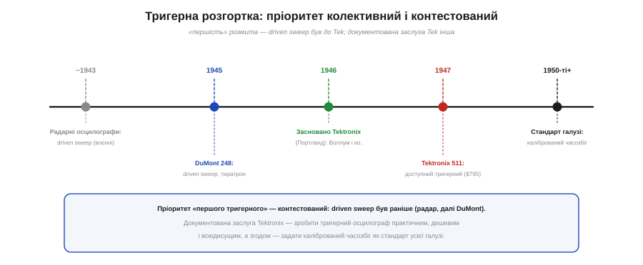
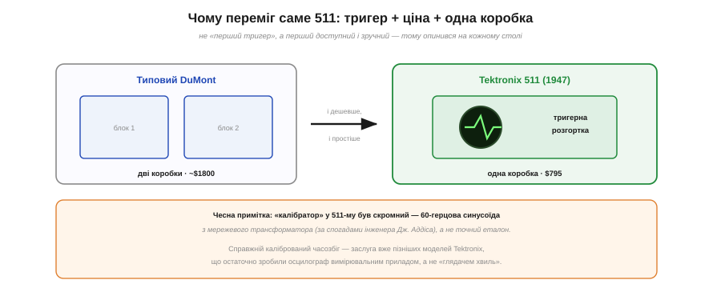

# 📜 Tektronix і Говард Воллум: тригерна розгортка, що зробила осцилограф інструментом

На осцилографі **тригер** робить хвилю нерухомою. Та чому це така велика річ, що з неї виросла ціла легендарна компанія? Історія тригерної розгортки — гарний приклад того, як «винахід» насправді буває **колективним**, а слава дістається тому, хто зробив його **практичним**.

## Осцилограф, що «втікав»

Електронно-променева трубка існувала ще від Брауна, і малювати нею сигнал навчилися давно. Та був ґандж: горизонтальна **розгортка** йшла сама собою — вільно або абияк синхронізована з сигналом. Для простої синусоїди ще нічого, а от складніший чи неперіодичний сигнал на екрані **повз і розмивався**. Осцилограф був радше «глядачем хвиль»: показував, що **щось коливається**, але точно **виміряти** те щось було марудно. Бракувало способу **прив'язати** початок кожного проходу до самого сигналу.

## Driven sweep: спадок війни

Розв'язок визрівав у **радарах** Другої світової. Радарному екрану треба було починати розгортку **точно** від випромінутого імпульсу — так народилася **запущена розгортка** (driven sweep), яку «вмикала» зовнішня подія. Це була праця **багатьох** інженерів воєнних лабораторій, без єдиного «винахідника». Саме там, на радарах, із цією технікою познайомився молодий **Говард Воллум** — випускник-фізик Рідського коледжу (1936), що під час війни служив у Корпусі зв'язку армії США. (За деякими переказами, подібну техніку він уперше бачив ще в довоєнній Європі; деталь непевна, тож подаю її обережно.)

Запущена розгортка швидко перейшла й у цивільні прилади. Тут варто чесно віддати належне **Аллену Дюмону**: його фірма була серед **піонерів** тригерної та синхронізованої розгортки на газовому **тиратроні**, а модель **DuMont 248** (1945) уже мала цю можливість. Тобто на час, коли на сцену вийшов Tektronix, тригерна розгортка **вже існувала** — і це важливо пам'ятати.

## 1946: четверо в Портланді

*Тригерну розгортку не винайшов хтось один. Driven sweep застосовували у воєнних радарних осцилографах, а в комерції її раніше за Tektronix мав DuMont (модель 248, 1945). Документована заслуга Tektronix — зробити тригерний осцилограф практичним і дешевим, а згодом задати калібрований часозбіг як галузевий стандарт.*

1946 року в Портланді (штат Орегон) **четверо** партнерів — Говард Воллум, Джек Мердок, Майлз Тіпері й бухгалтер Гленн Макдавелл — заснували **Tektronix**, уклавши по 2600 доларів кожен. Воллум був інженерним мозком, Мердок — діловим (Воллум до війни працював радіотехніком у його крамниці). Першим продуктом фірми став скромний відеокалібратор Type 101, а вже другим — осцилограф, який уписав її в історію.

## 1947: Model 511

**У червні 1947-го** з'явився **Tektronix 511** — перший осцилограф фірми, над яким Воллум працював разом із Френком Гудом і Логаном Беллевілем. Він мав **тригерну розгортку**: повторюваний сигнал нарешті **завмирав** на екрані, і його можна було спокійно роздивлятися. Та головна перевага була навіть не суто технічна.

*Не «перший тригер», а перший зручний: 511 умістив тригерну розгортку в одну коробку за $795 проти ~$1800 за двоблочний DuMont — і опинився на кожному столі. Чесно: каліброваність самого 511-го була скромна (60-герцовий синус), справжній калібрований часозбіг прийшов із пізнішими моделями Tek.*

**511 коштував $795** — проти приблизно **$1800** за двоблочний осцилограф DuMont. Одна коробка, удвічі дешевше, із тригером «із коробки» — і несподівано потужний прилад опинився **по кишені** звичайній лабораторії. Перший серійний 511 (заводський №101) Tektronix відвантажив **Військово-морському флоту США** в липні 1947-го.

## Хто ж «винайшов»? Чесна відповідь

Тут і криється повчальність історії. Популярна версія каже: «Воллум винайшов перший тригерний осцилограф 1946 року». Це **спрощення**. Запущена розгортка була **раніше** — у воєнних радарах і в комерційних приладах DuMont. Тож **пріоритет «першого тригерного» — контестований**, і чесніше сказати інакше: заслуга Tektronix і Воллума не в **першості**, а в тому, що вони зробили тригерний осцилограф **практичним, доступним і всюдисущим** — а з цього вже виросла компанія, яка на десятиліття стала **еталоном** галузі.

Варто бути точним і щодо «вимірювального». Сам 511-й ще не був взірцем точності: за спогадами інженера Tektronix **Джона Аддіса**, його «калібратор» був усього лише **60-герцовою синусоїдою** з мережевого трансформатора — не точний еталон. **Справжній калібрований часозбіг** — той, що дає читати час і частоту просто з екрана як числа, — дозрів уже в **пізніших** моделях Tektronix. Тобто й тут «винахід» був не одномоментним стрибком, а поступовим доведенням.

## Що лишилось

І все ж саме Tektronix перетворив осцилограф із примітивної «лампи, що показує хвильки» на **серйозний вимірювальний прилад** на кожному інженерному столі — і задав шаблон, який копіювали всі. Коли ви сьогодні крутите ручку «час/поділка», ловите сигнал [тригером на осцилографі](topic:hw-sensing/oscilloscope) і читаєте з екрана частоту — ви користуєтеся спадком, що його збирали докупи **багато** рук: воєнні радарники, Аллен Дюмон, Говард Воллум із колегами та інженери Tektronix, які роками доводили прилад до пуття. Гарне нагадування: за більшістю «винаходів однієї людини» стоїть **довгий ланцюг** людей.
