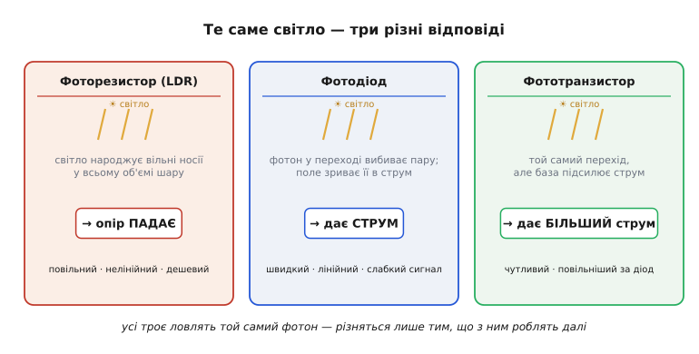
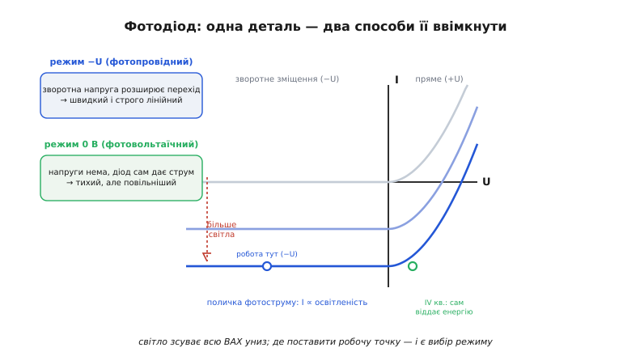
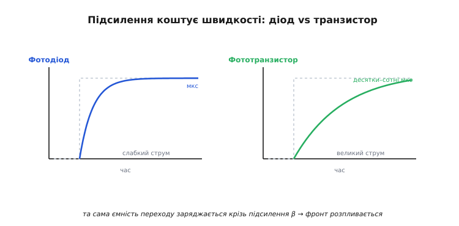
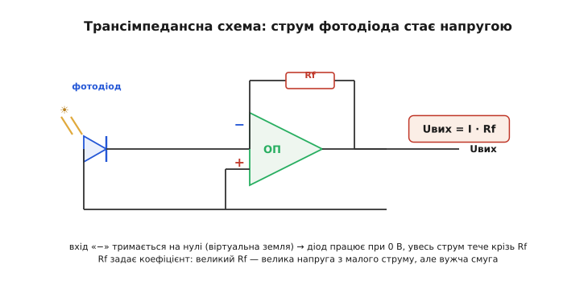
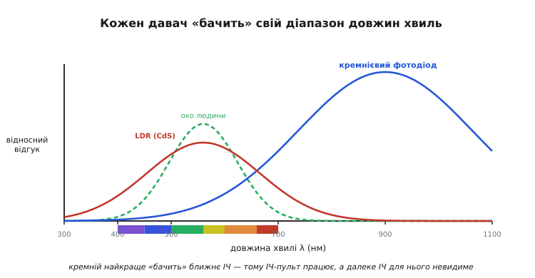

# Фотодавачі

Світло несе інформацію щедро: яскравість, колір, рух тіні, відбиток від перешкоди, моргання інфрачервоного пульта. Та електронна схема живиться не світлом, а струмом і напругою. Тож щоб машина «побачила» бодай щось, потрібен перекладач — деталь, яка перетворює потік фотонів на електричний сигнал. Це і є **фотодавач** (від грец. *phōs, phōtos* — світло).

Інженер на практиці тримає під рукою три такі перекладачі: **фоторезистор** (його ще звуть LDR, від англ. *light-dependent resistor*), **фотодіод** і **фототранзистор**. Усі троє ловлять той самий фотон і всі троє спираються на одну й ту саму подію в речовині. Але далі вони розходяться: один лише міняє опір, другий народжує струм, третій той струм одразу й підсилює. Звідси їхня геть різна вдача — швидкість, чутливість, лінійність, ціна. Зрозуміти ці три деталі — означає бачити одну фізику й три інженерні компроміси над нею.


*Те саме світло — три відповіді. Фоторезистор: фотони народжують вільні носії в усьому об'ємі шару, і опір падає. Фотодіод: фотон у переході вибиває пару, поле зриває її в струм. Фототранзистор: той самий перехід, але вбудоване підсилення робить струм у сотні разів більшим. Спільний фотон — різне, що з ним роблять.*

## Спільне коріння: фотон віддає енергію носієві

Перш ніж розрізняти три деталі, варто побачити, що їх єднає, — одну подію, що повторюється в кожній. Світло — це потік **фотонів**, порцій енергії. Енергія однієї порції залежить тільки від частоти (тобто кольору) світла:

```
E = h · f = h · c / λ
h ≈ 6.63 × 10⁻³⁴ Дж·с   (стала Планка)
c ≈ 3.0 × 10⁸ м/с       (швидкість світла)
λ — довжина хвилі
```

Коротша хвиля (синє, ультрафіолет) → вища частота → енергійніший фотон; довша хвиля (червоне, інфрачервоне) → фотон млявіший. Це не дрібниця формули, а ключ до всього подальшого: чи спрацює давач, вирішує саме енергія окремого фотона.

А спрацьовує він так. У напівпровіднику (зазвичай кремнії) електрони сидять, зв'язані в кристалічній ґратці, і щоб один із них став **вільним** носієм заряду, його треба перекинути через енергетичну щілину — **заборонену зону**. Фотон, влучивши в кристал, віддає електронові свою енергію. Якщо її **досить**, щоб подолати щілину, електрон зривається з місця, лишаючи по собі **дірку** — вільне місце, яке поводиться як додатний носій. Так із одного фотона народжується **пара електрон-дірка**, тобто пара вільних носіїв заряду. Сама ця гра носіїв і заборонених зон — предмет фізики [напівпровідників](root:ph-condensed/semiconductor): фотодавач лише користається нею в один бік.

```
енергія фотона ≥ ширина забороненої зони  →  народжується пара носіїв
енергія фотона <  ширини забороненої зони  →  фотон проходить даремно
```

Ось чому в кожного давача є **межа за кольором**: фотони задовгої хвилі просто не доносять енергії, щоб когось звільнити, — і давач до них сліпий. Ця межа й визначає спектральну чутливість, про яку — наприкінці; поки що головне одне — **фотон народжує вільні носії, якщо вистачить його енергії**. Усі три деталі будуються на цій події. Різниця лише в тому, що кожна робить із новонародженими носіями.

## Фоторезистор: світло змінює опір

Найпростіший спосіб скористатися народженими носіями — навіть не виводити їх кудись, а просто **порахувати їх усередині**. Що більше вільних носіїв у шматку напівпровідника, то легше крізь нього тече струм, тобто то менший його опір. На цьому й стоїть **фоторезистор**: пластинка світлочутливого матеріалу (класично — сульфід кадмію, CdS), опір якої залежить від освітленості.

У темряві вільних носіїв мало, опір величезний — сотні кілоом, ба й мегаоми. Під яскравим світлом фотони штампують носіїв тисячами, опір провалюється до сотень ом, а то й менше. Тобто прилад не дає ні струму, ні напруги сам — він лише **пасивний змінний опір**, яким керує світло. А щоб прочитати опір, його, як і будь-який інший, треба ввімкнути в коло з живленням — найчастіше в [дільник напруги](root:hw-analog/voltage-divider) з постійним резистором.

```
LDR угорі, постійний R унизу — напруга з середини дільника:
яскраво:  R_ldr ≈ 1 кОм   → напруга висока
темно:    R_ldr ≈ 1 МОм   → напруга низька
```

Зворотний бік цієї простоти — **повільність і нелінійність**. Носії в CdS народжуються легко, але й зникають (рекомбінують) ліниво, тож після зміни світла опір повзе до нового значення десятки, а то й сотні мілісекунд. До того ж залежність опору від освітленості геть не пряма (грубо — опір падає десь як обернений степінь яскравості), та ще й помітно «пам'ятає» попередню засвітку. Тому фоторезистор не годиться там, де треба **виміряти** яскравість точно або зловити **швидку** подію. Зате він дешевий, не боїться полярності й дає величезний розмах опору — ідеальний там, де питання стоїть грубо: «світло чи темрява?».

> 🔧 **Навіщо це.** Фоторезистор — це деталь для порогових задач, не для вимірювань. Нічник, що вмикає лампу присмерком; вуличний ліхтар; підсвітка, що гасне вдень, — скрізь, де треба лише відрізнити день від ночі, LDR із дільником і [компаратором](root:hw-analog/comparator) розв'язує задачу копійками. А ось ловити мерехтіння екрана чи рахувати оберти ним марно — не встигне.

## Фотодіод: світло народжує струм

Фотодіод іде далі за просте рахування носіїв усередині: він не чекає, поки народжена пара зникне, а **одразу розриває її й виводить у коло** як струм. Секрет — у тому, де саме народжуються носії. Це звичайний **p-n перехід** (та сама структура, що в будь-якому діоді), а в ньому є особлива зона — **збіднена область**, де вже існує вбудоване електричне поле.

Коли фотон народжує пару саме в цій зоні, поле миттєво **розтягує** електрон і дірку в різні боки — електрон в один бік, дірку в інший. У зовнішньому колі це і є **фотострум**: потік заряду, який тече, поки світить світло. І найголовніше — цей струм **прямо пропорційний** числу влучних фотонів за секунду, тобто освітленості. Подвоїли світло — рівно подвоїли струм. Звідси два головні козирі фотодіода проти LDR: він **строго лінійний** і він **швидкий**, бо не покладається на ліниву рекомбінацію — поле зриває носіїв одразу.

Фотострум, щоправда, **малий**: типово від нано- до мікроампер за помірного світла. Це не вада конструкції, а плата за чесність — фотодіод віддає рівно стільки заряду, скільки народило світло, ані краплі понад. Тому майже завжди його струм треба підсилити, перш ніж із ним щось робити, — і робить це окрема схема зчитування, до якої ще дійдемо.


*Дві сторони однієї деталі. Темнова крива (сіра) — звичайний діод, проходить через нуль. Світло зсуває всю ВАХ униз на величину фотоструму: ліворуч під зворотною напругою (−U) утворюється рівна «поличка», де струм пропорційний освітленості — це фотопровідний режим, швидкий і лінійний. Робоча точка праворуч, де діод сам віддає енергію (U>0, I<0), — фотовольтаїчний режим: тихий, але повільніший. Один прилад — два способи ввімкнути.*

### Два режими: 0 В і зворотне зміщення

Той самий фотодіод можна ввімкнути двома способами, і вони дають різну вдачу.

**Фотовольтаїчний режим (0 В).** Якщо не прикладати до діода жодної зовнішньої напруги, накопичені світлом носії самі створюють на ньому напругу — діод стає крихітним джерелом. Це режим, у якому працює сонячна батарея (фотоелемент — це і є великий фотодіод, у якого площу збільшили заради енергії, а не виміру). Перевага режиму — **майже нульовий темновий струм** (струм, що тече навіть у повній темряві через теплові носії), тож він найтихіший і найточніший для дуже слабкого світла. Платня — **повільність**: без зовнішнього поля збіднена область вузька, а її власна ємність велика, і вона гальмує відгук.

**Фотопровідний режим (зворотне зміщення).** Якщо прикласти до діода **зворотну** напругу (плюс на катод, як для замкненого діода), збіднена область **розширюється**, а її ємність падає. Тепер поле сильніше й зона збору ширша — фотодіод стає **швидким** (відгук за наносекунди в добрих приладах) і дає **бездоганно лінійний** струм у широкому діапазоні. Платня тут інша: зворотна напруга трохи піднімає темновий струм і його шум. Саме цей режим беруть скрізь, де важить швидкодія: оптичний зв'язок, лазерні далекоміри, швидкі лічильники імпульсів.

> 🔧 **Навіщо це.** Вибір режиму — це вибір «тихо й точно» проти «швидко й лінійно». Міряєте дуже слабке стале світло (люксметр, фотометр) — беріть фотовольтаїчний режим: менше шуму. Ловите швидкі імпульси світла (зв'язок, [лазерний далекомір](root:hw-sensing/tof-laser), оптичний енкодер на високих обертах) — беріть зворотне зміщення: інакше фронти розпливуться. Та сама деталь, два світи застосувань.

## Фототранзистор: вбудоване підсилення

Малий струм фотодіода — морока: його доводиться підсилювати окремою схемою. А що, як підсилити його **прямо в деталі**? Саме це робить **фототранзистор**. Усередині це звичайний біполярний транзистор, у якого світло падає на перехід база-колектор. Фотони народжують там пари — як у фотодіоді, — і цей крихітний фотострум стає **струмом бази**. А транзистор, як йому й належить, підсилює струм бази у свій коефіцієнт β (часто 100–1000 разів). Тобто фотодіод і підсилювач злилися в одному корпусі.

Виграш очевидний: з того самого світла фототранзистор віддає в сотні разів **більший** струм — уже міліампери, які легко зчитати простим резистором, без жодного зовнішнього підсилювача. Це робить його найдешевшим способом надійно зловити присутність світла.

Та підсилення задарма не буває, і ціна тут — **швидкість**. Той самий механізм, що підсилює корисний струм, гальмує відгук: внутрішня ємність переходу тепер заряджається й розряджається крізь усе підсилення, і фронт сигналу розпливається. Тому фототранзистор помітно **повільніший** за голий фотодіод — десятки чи сотні мікросекунд проти діодних мікро- й наносекунд. Та ще й його підсилення β гуляє від примірника до примірника й від температури, тож фототранзистор — давач **якісний** («є світло / нема»), а не точний вимірювач яскравості.


*Підсилення коштує швидкості. На стрибок освітлення (сіра пунктирна сходинка) фотодіод відповідає майже миттєво — фронт за мікросекунди, але струм слабкий. Фототранзистор дає набагато більший струм, та фронт розпливається на десятки-сотні мікросекунд: та сама ємність переходу тепер заряджається крізь коефіцієнт підсилення. Звідси правило вибору — швидкість чи сила.*

> 🔧 **Навіщо це.** Беріть фототранзистор, коли важить надійне спрацювання, а не точність і не швидкодія: давач кінця стрічки, лічильник предметів на конвеєрі, приймач у простому ІЧ-каналі, давач відкритої кришки. Потрібна швидкість (швидкий зв'язок, енкодер на тисячах обертів) або точний вимір — повертайтеся до фотодіода з підсилювачем.

## Як зчитати фотострум: трансімпедансна схема

Фотодіод віддає **струм**, а вся подальша електроніка — мікроконтролер, [АЦП](root:hw-analog/adc), осцилограф — розуміє **напругу**. Хтось має перекласти одне в інше, і зробити це треба так, щоб не зіпсувати ні лінійності, ні швидкодії фотодіода.

Найгрубіший спосіб — просто пустити фотострум крізь резистор: за законом Ома впаде напруга U = I·R, її й читай. Та цей шлях зрадливий. Щоб дістати помітну напругу з нанострумів, резистор треба брати велетенський (мегаоми), а на такому опорі власна ємність фотодіода утворює повільний фільтр — швидкодія гине. Гірше того: напруга, що нарóстає на діоді, сама **зміщує** його робочу точку й ламає ту саму лінійність, заради якої фотодіод і брали.

Правильна відповідь — **трансімпедансний підсилювач** (англ. *transimpedance amplifier*, бо він перетворює струм на напругу, тобто має розмірність опору). Це [операційний підсилювач](root:hw-analog/opamp) із резистором зворотного зв'язку Rf, увімкнений так, що його вхід тримає фотодіод **під нульовою напругою** й водночас збирає весь його струм.


*Трансімпедансна схема. Фотодіод увімкнено між інвертувальним входом операційного підсилювача та землею. Завдяки зворотному зв'язку вхід «−» тримається рівно на нулі (віртуальна земля), тож діод увесь час «бачить» 0 В — лінійність ідеальна. Весь фотострум тече крізь резистор Rf, і на виході постає напруга Uвих = I·Rf. Сам Rf задає коефіцієнт перетворення: більший Rf — більша напруга з того ж струму, але вужча смуга.*

Працює це елегантно. Операційний підсилювач так керує своїм виходом, щоб напруги на двох його входах зрівнялися. Незмінний вхід «+» сидить на землі (0 В), тож вихід підтягує і вхід «−» теж до нуля — виникає **віртуальна земля**. Для фотодіода це означає, що він завжди під 0 В: його робоча точка не пливе, лінійність бездоганна. Увесь фотострум, якому нема куди дітися на віртуальній землі, тече крізь резистор зворотного зв'язку Rf, і саме на ньому народжується вихідна напруга:

```
Uвих = I_фото · Rf
```

Тепер коефіцієнт перетворення задає один резистор. Хочемо з 1 мкА дістати 1 В — ставимо Rf = 1 МОм. Хочемо більшої чутливості — більший Rf, але тоді вужча смуга частот (швидкодія) і чутливіша схема до шуму. Це і є головний інженерний компроміс трансімпедансної схеми — обмін **підсилення на швидкість**, який щоразу налаштовують під задачу.

**Приклад (порахувати резистор зворотного зв'язку).** Фотодіод під робочим світлом дає 2 мкА, а ми хочемо на вході 12-розрядного АЦП із діапазоном 0…3.3 В отримати близько 2 В. Знаходимо Rf:

```c
// Трансімпедансна схема: добір Rf під бажану вихідну напругу.
// Uвих = I_фото * Rf  →  Rf = Uвих / I_фото
float i_photo = 2e-6f;       // фотострум, А (2 мкА під робочим світлом)
float u_target = 2.0f;       // бажана напруга на виході, В
float rf = u_target / i_photo;   // = 2.0 / 2e-6 = 1.0e6 Ом = 1 МОм

// Перевірка: чи влізе сигнал у діапазон АЦП 3.3 В при найяскравішому світлі?
float i_max = 3.0e-6f;       // найбільший очікуваний фотострум, А
float u_max = i_max * rf;    // = 3e-6 * 1e6 = 3.0 В  → влазить у 3.3 В, є запас
```

Один резистор переводить струм у зручну напругу, ще й лишає запас до стелі АЦП — далі мікроконтролер просто читає число. Якби світла було більше й 3 В не влазили, ми б зменшили Rf; було б замало — збільшили б, пожертвувавши швидкодією.

## Спектральна чутливість: який колір давач справді бачить

Лишилася та сама межа за кольором, що випливає зі спільної фізики. Давач відгукується на фотон, лише коли той доносить досить енергії, щоб перекинути носій через заборонену зону. А енергія фотона задана довжиною хвилі — отже, кожен давач має власний **діапазон чутливості**: вікно довжин хвиль, у якому він добре «бачить», і поза яким сліпне.

Для **кремнію** це вікно охоплює видиме світло й сягає в **ближнє інфрачервоне** — приблизно до 1100 нм, де енергія фотона падає до ширини забороненої зони кремнію. Цікаво, що пік чутливості голого кремнієвого фотодіода лежить не у видимому, а **в ближньому ІЧ** (близько 800–950 нм). Це й добре, і підступно. Добре — бо завдяки цьому той самий дешевий кремнієвий приймач чудово ловить інфрачервоні пульти й ІЧ-підсвітку, невидимі оку. Підступно — бо людина бачить світ інакше, ніж кремній, і давач легко «обдурити» інфрачервоним, якого ми не помічаємо.


*Кожен давач «бачить» своє вікно. По горизонталі — довжина хвилі від ультрафіолету через видиме (кольорова смужка) до ближнього інфрачервоного. Кремнієвий фотодіод відгукується широко, з піком аж у ближньому ІЧ (≈ 900 нм) — тому й ловить ІЧ-пульти. Око людини чутливе лише у вузькому видимому вікні з піком на зеленому (≈ 555 нм). Фоторезистор на CdS вдало лягає близько до ока. Збіг чи розбіг цих кривих і вирішує, чи годиться давач під задачу.*

Звідси два щоденні наслідки для інженера. По-перше, якщо давач має реагувати **як людське око** (наприклад, автоматично пригасати підсвітку екрана за навколишнім світлом), голий кремнієвий приймач не годиться — він перебільшує внесок інфрачервоного. Тоді на нього кладуть **світлофільтр**, що відрізає ІЧ і підганяє чутливість під око; такі приймачі так і звуть — «з відгуком, як в ока». По-друге, якщо давач має ловити **певний колір** і не зважати на решту (приймач конкретного лазера, оптичний бар'єр на заданій хвилі), знову ставлять фільтр — цього разу вузький, що пропускає лише потрібну смугу й глушить фонове світло.

> 🔧 **Навіщо це.** Спектр — це причина, чому «давач світла» не один, а багато. Хочете ІЧ-приймач для пульта — кремній сам тяжіє до ближнього ІЧ, фільтр лише відсіче зайве видиме. Хочете виміряти яскравість так, як її відчуває людина, — потрібен приймач із фільтром «під око», інакше прилад брехатиме на сонці та під лампами розжарювання, багатими на ІЧ. А ультрафіолет кремній ловить кепсько — для нього беруть інші матеріали.

## Звідки це пішло

Усе почалося з прикрості. 1873 року англійський інженер-електрик **Віллобі Сміт** (*Willoughby Smith*) налагоджував перевірку підводних телеграфних кабелів і взяв для дільників селенові стрижні через їхній високий опір. Прилади вперто давали різні покази без причини — аж поки не з'ясувалося, що опір селену **падає, коли на нього світить світло**. Так випадково відкрили **фотопровідність**, на якій згодом постав фоторезистор. (Сам фотоелектричний ефект — народження струму світлом — ще раніше, 1839 року, помітив француз **Едмон Беккерель**, *Edmond Becquerel*.)

Фотодіод і фототранзистор прийшли разом із напівпровідниковою революцією XX століття. У **Bell Labs** у 1948 році **Джон Шайв** (*John N. Shive*), бавлячись із новими транзисторами, замінив дротяний емітер на промінь світла — і дістав прилад, керований світлом замість струму; фототранзистор оприлюднили 1950 року. Прикметно, що сама фізика всіх цих ефектів була давно знана — практичними давачами вони стали лише тоді, коли з'явилися чисті напівпровідники й дешеві підсилювачі, було **чим** прочитати їхній слабкий сигнал. Давач завжди вартий рівно стільки, скільки варта здатність прочитати його відповідь.

## Який фотодавач під яку задачу

Збираючи все докупи: три деталі стоять на одній фізиці — фотон народжує носіїв, — але дають три різні інженерні характери.

**Фоторезистор (LDR)** — пасивний змінний опір. Дешевий, простий, із величезним розмахом опору, але повільний, нелінійний і неточний. Його стихія — грубі порогові задачі «світло чи темрява»: нічники, присмеркові вимикачі, проста підсвітка.

**Фотодіод** — джерело струму, пропорційного світлу. Швидкий і строго лінійний, але сигнал малий і просить підсилення. Його стихія — точність і швидкодія: фотометри, оптичний зв'язок, лазерні далекоміри, енкодери на високих обертах, [оптопари](root:hw-components/optocoupler) для гальванічної розв'язки.

**Фототранзистор** — фотодіод із вбудованим підсиленням. Дає великий струм просто з резистором, але повільніший і неточний. Його стихія — надійне спрацювання без зовнішньої електроніки: давачі присутності, лічильники предметів, приймачі простих ІЧ-каналів, давачі кінця стрічки.

Поверх вибору самої деталі стоїть **схема зчитування**: фоторезистору — дільник напруги, фототранзистору — простий резистор навантаження, фотодіоду — трансімпедансний підсилювач, що тримає його під 0 В і чесно переводить струм у напругу. І над усім — **спектр**: чи бачить давач саме той колір, що несе вашу інформацію, чи його варто підрізати фільтром під око або під вузьку смугу. Світло щедре на сигнали — а ці три деталі з їхніми схемами і є набір ключів, якими інженер ці сигнали відмикає.

---
