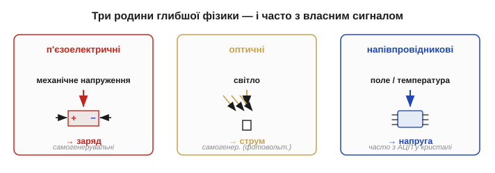
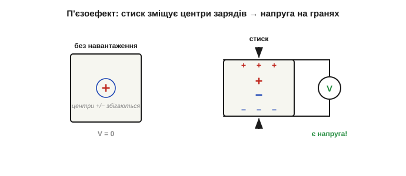
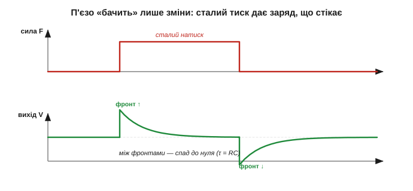
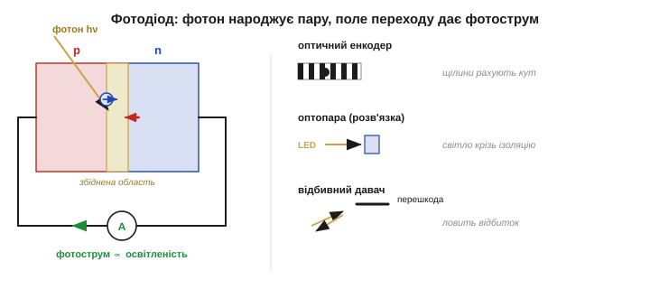
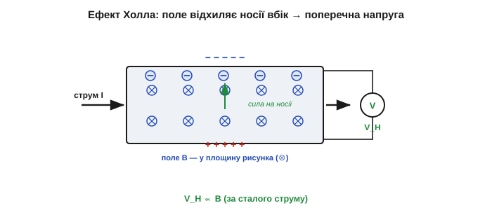
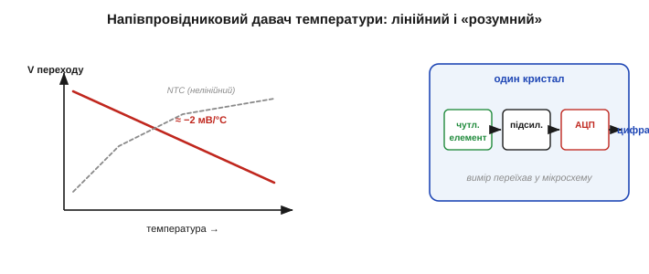
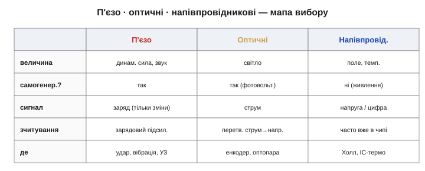

# П'єзо-, оптичні, напівпровідникові

Резистивні, ємнісні й індуктивні давачі брали готові [пасивні компоненти](root:hw-sensing/transducer-classes) й змінювали їхню геометрію чи матеріал. Інша річ — три родини, що сягають **глибшої фізики**: будови кристала, p-n переходу, поведінки носіїв у кремнії. Зате винагорода за глибину чудова: багато з цих давачів **самі генерують сигнал**, а напівпровідникові ще й вміщують увесь вимірювальний тракт в одну мікросхему. Саме сюди належать одні з найкорисніших давачів інженера: удару й ультразвуку (п'єзо), світла й положення (оптичні), магнітного поля й точної температури (напівпровідникові).

### Спільна риса: глибша фізика, часто власний сигнал

Варто побачити, що єднає ці три родини. Резистивний чи ємнісний давач — **пасивний параметр**, який треба живити, щоб «прочитати». П'єзо й фотоелемент натомість **самі стають джерелом**: натиск чи світло безпосередньо народжують заряд або струм. А напівпровідникові давачі експлуатують тонкі ефекти в кристалі — від поведінки носіїв у магнітному полі до температурної залежності переходу — і часто продають уже з підсилювачем та АЦП «на борту».

Цікаво, що всі ці ефекти — **старі**. П'єзоелектрику Кюрі знайшли 1880-го, ефект Холла — 1879-го, фотоелектричні явища досліджували ще в XIX столітті. Та десятиліттями вони лишалися лабораторними дивами: сигнали були мізерні, а підсилити їх не було чим. Практичними давачами вони стали аж у XX столітті — коли з'явилися добрі п'єзокераміки, чисті напівпровідники й дешеві підсилювачі. Тобто річ не тільки у фізиці ефекту, а й у тому, чи є **чим його прочитати**, — давач завжди працює лише як ланка [вимірювального ланцюга](root:hw-sensing/what-is-a-sensor).


*Огляд трьох родин. П'єзо: механічне напруження → заряд. Оптичні: світло → струм (фотоперехід). Напівпровідникові: магнітне поле чи температура → напруга, часто з усім трактом у кристалі. Перші дві — переважно самогенерувальні.*

### П'єзоелектрика: натиск стає зарядом

**П'єзоелектричний ефект** (*piezoelectric effect*, від грец. *piezein* — тиснути) відкрили брати **П'єр і Жак Кюрі** (*Pierre & Jacques Curie*) ще 1880 року: деякі кристали (кварц) і кераміки (PZT — цирконат-титанат свинцю) за механічного стиску чи розтягу **самі дають напругу**.

Механізм елегантний. У кристалі без навантаження центри додатних і від'ємних зарядів збігаються, і ґратка електрично симетрична. Стиск **зміщує** ці центри один відносно одного — у кристалі виникає сумарна поляризація, а на протилежних гранях — заряд різного знака. По суті, деформація прямо перекачує заряд на електроди.


*Механізм п'єзоефекту. Без навантаження центри «+» і «−» у комірці збігаються — граней не заряджено. Під стиском вони розходяться, ґратка поляризується, і на верхній та нижній гранях з'являється заряд протилежних знаків — готова напруга.*

Ефект **оборотний** (та сама [двоїстість перетворювача](root:hw-sensing/what-is-a-sensor)): подайте на кристал напругу — він **деформується**. Це не дрібниця, а ціла індустрія: оборотний п'єзо — серце кварцових генераторів, ультразвукових випромінювачів, п'єзопищалок, голівок струменевих принтерів і п'єзозапальничок (різкий удар по кристалу дає тисячі вольтів — аж до іскри).

Матеріали п'єзо різняться вдачею. **Кварц** дає слабкий, зате надзвичайно стабільний ефект — тому з нього роблять еталонні резонатори годинників і [тактових генераторів](root:hw-analog/reference-frequency). **Кераміка PZT** навпаки: ефект у рази сильніший, але менш стабільний, тож її беруть там, де цінніша чутливість або потужна віддача — давачі удару, акселерометри, ультразвукові випромінювачі, актуатори. І два напрями ефекту мають дві назви: **прямий** (деформація → заряд, режим давача) та **зворотний** (напруга → деформація, режим виконавчого пристрою) — дві сторони однієї монети. Те, що прямий п'єзоефект можна обернути, передбачив теоретично Габрієль Ліппман, а Кюрі одразу підтвердили дослідом.

Сигнал п'єзо великий за напругою, але джерело **високоомне** (фактично крихітний заряд на ємності кристала), тож його не можна навантажувати низьким опором — потрібен **зарядовий підсилювач** або високоомний [буфер на операційному підсилювачі](root:hw-analog/ideal-opamp).

І найважливіша пастка, яку треба засвоїти раз і назавжди: **п'єзо реагує лише на ЗМІНУ**. Прикладений сталий тиск дає заряд, але той заряд **стікає** через будь-який скінченний опір (вхід підсилювача, ізоляцію), і вихід спадає до нуля. Тому п'єзодавач відчуває вібрацію, удар, динамічний тиск, звук — але **не статичне навантаження**.


*Чому п'єзо — давач змін. Ступінчастий натиск (угорі) дає сплеск напруги, що спадає за сталою часу витоку (внизу): заряд стікає крізь опір навантаження. Відпускання дає сплеск протилежного знака. Постійну складову п'єзо не передає — лише динаміку.*

> 🔧 **Навіщо це.** Це правило врятує від класичної помилки. Хочете зважити статичний вантаж — п'єзо не годиться (візьміть [тензоміст](root:hw-sensing/strain-gauges)). Хочете впіймати удар, стук у двигуні, вібрацію підшипника, звукову хвилю — п'єзо ідеальний, бо саме на зміни він і відповідає. Той самий ефект лежить в основі ультразвукових випромінювачів, якими [міряють відстань](root:hw-sensing/ultrasonic-tof-method).

**Приклад (за скільки п'єзо «забуває» сталий натиск).** Заряд стікає через вхідний опір R навантаження та власну ємність давача C — це фактично [високочастотний RC-фільтр](root:hw-analog/rc-high-pass) зі сталою часу τ = R·C. Хай ємність кристала C = 1 нФ, а вхідний опір підсилювача R = 1 МОм:

```
τ = R · C = 10⁶ Ом · 10⁻⁹ Ф = 10⁻³ с = 1 мс
```

Лише мілісекунда — і вже через кілька τ сигнал від сталого натиску майже зник. Щоб ловити повільніші зміни, опір навантаження штучно піднімають аж до гігаомів (високоомний буфер) — або ставлять зарядовий підсилювач, у якого вхід навпаки низькоомний (віртуальна земля), а нижню межу частоти задає його власне коло зворотного зв'язку. Так чи так, п'єзо приречений бути давачем динаміки, а не статики.

### Оптичні: світло стає струмом

Давач світла на **p-n переході** — інша річ, ніж [фоторезистор](root:hw-sensing/transducer-classes). Фоторезистор просто міняє опір; тут перехід **сам генерує струм** зі світла. Це **фотодіод** (*photodiode*), фототранзистор, фотоелемент.

Механізм складено з простих частин. Фотон достатньої енергії, влучивши в збіднену область [p-n переходу](root:ph-condensed/pn-junction), **вибиває пару електрон-дірку**. Вбудоване поле переходу миттєво **розтягує** пару в різні боки — і в колі тече **фотострум**, пропорційний освітленості.


*Фотодіод і його застосування. Фотон вибиває пару електрон-дірку в збідненій області; поле переходу розводить їх — тече фотострум. Праворуч — три типові вжитки: оптичний енкодер (щілини рахують положення), оптопара (світло переносить сигнал через гальванічну розв'язку), відбивний давач наближення.*

Фотодіод працює у двох режимах: **фотовольтаїчному** (без зміщення — сам дає напругу, це режим сонячної батареї, самогенерувальний) і **фотопровідному** (зі зворотним зміщенням — швидший і строго лінійний за струмом). На відміну від млявого LDR, фотодіод **швидкий і лінійний**, тож саме він стоїть там, де треба точність і швидкодія.

Є тонкість, спільна всім фотопереходам: фотон спрацьовує, лише коли його енергії досить, щоб перекинути носій через заборонену зону. А енергія фотона задана довжиною хвилі — тож кожен давач має власний **діапазон чутливості**: кремній добре «бачить» видиме й ближнє інфрачервоне, але сліпне до далекого ІЧ. Через це під різні задачі (видиме світло, інфрачервоний пульт, ультрафіолет) беруть давачі з різних матеріалів і зі світлофільтрами. А коли струму голого фотодіода замало, його заступає **фототранзистор** — той самий перехід, але з вбудованим підсиленням: сигнал більший ціною нижчої швидкодії.

Застосувань безліч, і всі зводяться до однієї ідеї — перетворити подію у **світловий потік**, а потік у струм. **Оптичний енкодер**: диск зі щілинами обертається між світлодіодом і фотодіодом, перериваючи промінь, — мікроконтролер рахує імпульси й знає кут та оберти (а двома доріжками зі зсувом — ще й напрямок обертання). **Відбивний давач наближення**: світлодіод світить інфрачервоним, фотодіод ловить відбите від перешкоди світло — чим ближче й світліше тіло, тим більший струм; так роблять давачі лінії, краю столу, наявності аркуша. **Оптопара**: світлодіод і фотоприймач замкнено в одному корпусі без електричного зв'язку — сигнал переходить лише світлом. **Пульсоксиметр** просвічує палець і за поглинанням світла судить про кисень у крові. Скрізь фотодіод лишається тим самим — змінюється тільки те, що несе світло.

> 🔧 **Навіщо це.** Вибір між фотодіодом і фоторезистором — це вибір швидкість+лінійність проти дешевизни. Для плавного виміру навколишнього світла згодиться й копійчаний LDR; а для енкодера, що ловить тисячі щілин за секунду, чи для зв'язку через оптопару потрібен **фотодіод/фототранзистор** — LDR просто не встигне.

Два застосування варті окремого слова. Великий фотодіод без зміщення — це **сонячний елемент**: те саме народження пар світлом, лише площу збільшено заради енергії, а не виміру. А **оптопара** розв'язує задачу, яку голим дротом не вирішити, — **гальванічну розв'язку**: світло переносить сигнал через ізоляційний проміжок, тож дві частини схеми спілкуються, не маючи спільної землі. Це захищає і від завад, і від небезпечних напруг — давач світла тут працює не для виміру світла, а як «місток» сигналу.

### Напівпровідникові: давач, вбудований у кремній

Третя родина живе **в самому кремнії**: давач формують прямо в кристалі, користуючись тонкими ефектами переходу та носіїв, і часто додають на той самий чип підсилювач і АЦП. Звідси «розумні» давачі, що віддають уже готове число — [давач](root:hw-sensing/what-is-a-sensor) з усім трактом усередині.

**Давач Холла** (*Hall sensor*) міряє **магнітне поле**. Крізь тонку напівпровідникову пластинку пропускають струм; якщо впоперек прикласти магнітне поле, воно **штовхає рухомі носії вбік** ([сила на рухомий заряд у полі](root:ph-condensed/hall-effect)), і вони збираються на одному краї — між краями виникає поперечна **напруга Холла**, пропорційна полю. Відкрив ефект **Едвін Голл** (*Edwin Hall*) 1879 року — за рік до п'єзо Кюрі.


*Давач Холла. Уздовж пластинки тече струм I; перпендикулярне поле B відхиляє носії до одного краю, де накопичується заряд. Між бічними гранями з'являється напруга Холла V_H, пропорційна B. Так магнітне поле стає напругою.*

Давачем Холла міряють магнітне поле напряму, а через нього — багато іншого: **струм безконтактно** (струм робить навколо себе поле — його й ловлять), положення й оберти (магніт на валу + Холл поряд), наявність магніту. 

**Приклад (яка мала напруга Холла).** Напруга Холла V_H = I·B/(n·q·t), де n — концентрація носіїв, q — заряд електрона, t — товщина пластинки. Для тонкого кремнієвого елемента (типово n·q·t дає чутливість близько кількох мВ на мілітеслу за робочого струму):

```
типова чутливість ≈ 5 мВ / мТл  (при заданому струмі живлення)
поле невеликого магніту впритул ≈ 50 мТл
V_H ≈ 5 мВ/мТл · 50 мТл = 250 мВ
```

Чверть вольта від магніту — зручно; а от поле Землі (≈ 0.05 мТл) дало б лише чверть мілівольта, тож слабкі поля знову потребують підсилення. Тому давачі Холла майже завжди йдуть із вбудованим підсилювачем у тому ж корпусі.

Цей ефект Едвін Голл відкрив 1879 року ще аспірантом — за вісімнадцять років до відкриття електрона, тобто навіть не знаючи, який саме носій відхиляє поле. Сьогодні давач Холла особливо цінують за **безконтактний вимір струму**: великий струм створює навколо провідника магнітне поле, і давач Холла поряд міряє це поле, ніяк не торкаючись самого кола й не додаючи в нього опору (на відміну від шунта). Так само з магнітом на валу він стає безконтактним давачем кута чи обертів — без тертя й зносу. Безконтактність тут не дрібниця, а головна перевага.

**Напівпровідниковий давач температури.** [Пряме падіння напруги на p-n переході](root:hw-components/diode-iv-curve) дуже **передбачувано** спадає з нагрівом — близько −2 мВ на градус. Кремнієві мікросхеми використовують цю залежність (точніше — різницю напруг двох переходів, «забороненозонний» принцип), щоб робити **лінійні, відкалібровані** давачі температури.


*Напівпровідниковий давач температури. Ліворуч — пряма напруга переходу майже лінійно спадає з нагрівом (≈ −2 мВ/°C), на відміну від кривої NTC. Праворуч — «розумний» давач: чутливий елемент, підсилювач і АЦП в одному кристалі віддають готове число.*

Тут добре видно компроміси трьох температурних давачів: **термопара** (величезний діапазон, але мікровольти й опорний спай), **терморезистор** (чутливий і дешевий, але дуже нелінійний), **напівпровідниковий IC** (лінійний і відкалібрований, але обмежений приблизно −55…+150 °C, бо вище кремній не виживає). Жоден не «найкращий» — кожен під свою задачу: розпечена піч просить термопари, дешевий побутовий термостат — терморезистора, а точний електронний вузол поряд із процесором — інтегрального IC-давача, що віддає вже готові градуси. Вибір температурного давача, від термопари до кремнію, зрештою зводиться до цього спокійного інженерного питання «що під що».

> 🔧 **Навіщо це.** «Розумний» напівпровідниковий давач — це втілена мрія [ідеального давача](root:hw-sensing/what-is-a-sensor): увесь вимірювальний ланцюг переїхав усередину деталі, і назовні виходить чисте число. За зручність платиш вужчим діапазоном і довірою до чужого калібрування — але для більшості задач «під кімнатні умови» це найшвидший шлях від величини до даних.

Холл і термодавач — лише двоє з великої родини «давачів у кремнії». Тим самим способом роблять давачі тиску (тонка мембрана з вбудованими в кристал тензорезисторами), магнітні давачі на магнітоопорі, давачі світла. Спільний напрям очевидний: **дедалі більше виміру переїжджає в саму мікросхему** — разом із підсиленням, оцифруванням і навіть калібруванням. Найяскравіший прояв цього — мікромеханічні [(MEMS) давачі](root:hw-sensing/mems), де в кремнії вирізьблюють уже **рухомі** деталі: крихітні балки й гребінки, що згинаються від прискорення чи обертання.

### Як вони лягають у загальну картину


*Три родини поряд: яку величину ловлять, чи самогенерувальні, яка форма сигналу, чим зчитувати, типове застосування — повна мапа фізичних принципів цих давачів.*

Грубий орієнтир: динамічна механіка (удар, вібрація, звук, ультразвук) — **п'єзо**; світло, положення крізь світло, оптична розв'язка — **оптичні**; магнітне поле, безконтактний струм, точна температура й інтеграція всього тракту — **напівпровідникові**. Разом із [резистивними, ємнісними та індуктивними](root:hw-sensing/transducer-classes) ці родини покривають майже все, що інженер зустріне на практиці. Варто завважити й спільну принаду цієї трійки: п'єзо та фотоелемент **не просять живлення**, а напівпровідникові натомість дарують **інтеграцію** всього тракту — тож вибір тут часто диктує не лише фізика величини, а й те, чи є в системі енергія та місце на зовнішню обв'язку.

Отже, є повний зоопарк перетворювачів і розуміння, на чому кожен стоїть. Але «який давач» — лише півсправи. Друга половина — **наскільки він добрий**: як описати числами його [чутливість, лінійність і межі](root:hw-sensing/sensor-characteristics), щоб порівнювати давачі й передбачати їхню поведінку.

---
