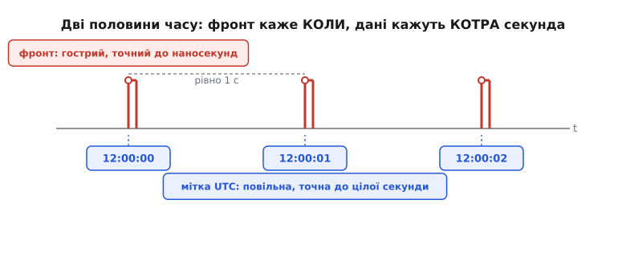
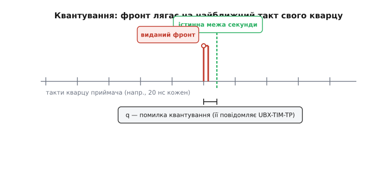
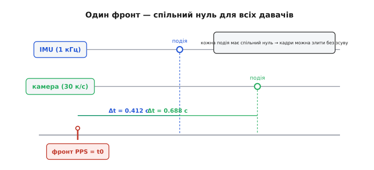

# PPS-імпульс

Уяви два прилади в різних кутках дрона: інерційний давач стукає тисячу разів на секунду, камера знімає тридцять кадрів. Кожен веде власний лічильник часу від свого дешевого кварцу. Питання, від якого все залежить: коли камера зробила ось цей кадр — під час якого саме поштовху IMU? Якщо відповісти з похибкою в кілька мілісекунд, дрон на швидкості вже пролетів метр, і накладені дані брешуть. Обидва прилади бачать час, але **кожен свій**, і ці два «свій» ніде не зустрічаються.

**PPS** (англ. *pulse per second* — імпульс на секунду; часто пишуть **1PPS**) — це найдешевший і найточніший спосіб змусити всі годинники в системі домовитися про один момент. Це не дані, не число, не повідомлення. Це один короткий електричний фронт на окремому дроті, який стрибає вгору **рівно на межі кожної секунди** — і робить це з точністю до наносекунд. Один провід, один різкий край, раз на секунду. У цій простоті — вся сила.

## Чому просто «прочитати час» не працює

Найпростіша думка: хай кожен прилад запитає в GNSS-приймача «котра година?» і запише відповідь. Але час у навігаційний приймач приходить **повідомленням** — рядком тексту по послідовному дроту (напр., NMEA чи UBX), десятки байтів. Повідомлення треба скласти в буфері, відправити на швидкості порту, прийняти, розібрати. Усе це займає **мілісекунди**, і — головне — займає їх **щоразу трохи інакше**: то буфер зайнятий, то переривання спізнилося, то знак у рядку інший. Момент, коли твоя програма нарешті прочитала «12:00:00», відстоїть від справжньої полудневої секунди на плаваючу, невідому величину.

Ось у чому корінь: **дані повільні й тремтливі, а нам потрібен момент — гострий і повторюваний**. Розв'язок — розділити ці дві речі. Число («котра секунда») хай приходить повільним повідомленням, як і приходило. А от **момент** («ось зараз почалася нова секунда») хай приходить окремим шляхом — простим фронтом на власному дроті, який ніщо не гальмує й не розмиває.

*Час розкладено на дві половини. Червоний фронт PPS каже КОЛИ настала межа секунди — гостро, до наносекунд. Синя мітка UTC приїжджає повільним повідомленням і каже, КОТРА це секунда, — з неї досить і точності до цілого. Разом вони дають повний, точний час; порізно — ні.*

Це і є вся ідея PPS: **фаза окремо, мітка окремо**. Фронт несе фазу — точне «коли». Повідомлення несе мітку — «яка саме то секунда за календарем». Мітці не треба бути швидкою: вона однакова цілу секунду, тож навіть якщо рядок «12:00:00» доповз до програми через 200 мілісекунд після фронту — байдуже, він однаково стосується того фронту, що вже клацнув. Фронтові не треба нести жодних даних: він мусить лише **бути в правильну мить**.

> 🔧 **Навіщо це.** Коли в описі GNSS-модуля бачиш окремий вивід із підписом *TIMEPULSE* або *PPS* — тепер ясно, нащо він поряд із дротами даних. Дані дадуть тобі число, але з розмитим часом; цей один пін дає точний час без числа. Заведеш його на ногу-переривання мікроконтролера — і твоя прошивка отримає спільний, надточний нуль, до якого можна прив'язати будь-яку іншу подію в системі.

## Що таке цей фронт фізично

PPS — звичайний цифровий сигнал: лінія спокійно лежить у нулі, і раз на секунду підскакує до логічної одиниці, тримається коротку мить (типово від мікросекунд до сотні мілісекунд — це налаштовується), тоді падає назад. Рівні — як у решти цифрової логіки: TTL-сумісні, здебільшого 3.3 В чи 5 В. Ніякого спеціального «часового» дроту не існує — це проста лінія, яку ти заводиш на вхід переривання чи на апаратний захоплювач мікроконтролера.

Важлива лише **одна** його риса — **фронт**. Точний час несе не «висока» частина імпульсу і не «низька», а сам **перехід**, різкий край. За домовленістю це зазвичай **наростаючий** фронт (перехід 0 → 1): саме його миттю визначено межу секунди. Ширина імпульсу, форма спаду, шпаруватість — усе це для точності неважливе; можна навіть зробити зі скважністю 50 %, тоді сигнал схожий на рівний меандр 1 Гц, але значуща лишається тільки одна його грань.

Чому саме фронт, а не рівень? Бо рівень наростає не миттєво — напруга повзе від нуля до одиниці за скінченний час, і «де тут секунда» було б розмито. А **момент перетину порогу** — це одна точка в часі, гостра. Тому і в приймачі, і в мікроконтролері беруть саме перетин: коли лінія проходить рівень перемикання, тоді й є та сама секунда.

Частота може бути й не одна на секунду. Той самий вивід у навігаційних модулях часто вміє видавати 10 Гц, 100 Гц, будь-що аж до мегагерців — тоді це вже не «pulse per second», а просто дисциплінований опорний генератор. Але класика й найточніший режим — саме **1 Гц**: раз на секунду, на межі секунди. І це не випадково: чим рідший імпульс, тим точніша межа, бо між фронтами приймачеві лишається більше часу на звірку з супутниками — механізм цього розкрито нижче.

## Звідки береться наносекундна точність

Постає природне запитання: приймач сам сидить на такому ж дешевому кварці, як усі. Звідки ж у нього право роздавати наносекунди?

Секрет у тому, що приймач **не покладається на свій кварц як на еталон** — він **дисциплінує** його супутниками. Атомні годинники на супутниках такі рівні, що все сузір'я, по суті, транслює з неба єдину надточну шкалу часу. Приймач безперервно порівнює власний кварц із цією небесною шкалою й бачить, наскільки той відстає чи біжить уперед. Він не може змусити кварц цокати рівніше — фізика кристала не міняється, — але може **обчислити**, у яку саме мить настане справжня межа секунди, і саме тоді видати фронт. Кварц тут — лише робочий генератор; правду про час дають супутники. Тому PPS навіть від дешевенького GNSS-модуля тримає межу секунди на десятки наносекунд — не тому, що кварц гарний, а тому, що його весь час звіряють із небом.

Ось де окупається рідкість імпульсу. Між двома фронтами — ціла секунда, і за цю секунду приймач устигає зібрати багато вимірів і дуже точно спрогнозувати, коли настане наступна межа. Якби фронти йшли часто, на кожен лишалося б менше даних для звірки, і кожен був би менш певний. Тому **1 Гц — найточніший режим**: рідше означає впевненіше.

## Квантування: чому фронт злегка «мимо» — і як це виправляють

Тепер найтонше місце, без якого картина неповна. Приймач вирахував, що справжня межа секунди настане ось у цю мить. Але **видати** фронт він може не будь-коли — лише на такті власного кварцу. Між тактами вивід перемкнути нічим: цифрова схема живе тактами, і фронт народжується тільки на краю чергового такту. Тож приймач ставить фронт на **найближчий такт** до справжньої межі — а справжня межа майже завжди лежить **між** тактами.

Ця неминуча дірка між «де мало бути» і «де реально клацнуло» зветься **помилкою квантування** (від лат. *quantum* — скільки, порція): час порційний тактами, і фронт округлено до найближчої порції. Її величина — до половини періоду такту. Якщо приймач усередині цокає, скажімо, на 48 МГц, один такт триває близько 21 наносекунди, і фронт може промахнутися на ±10 наносекунд суто через це округлення.

*Внутрішній кварц дає рідку сітку тактів. Істинна межа секунди (зелена) падає між ними, а фактичний фронт (червоний) змушено лягає на найближчий такт. Проміжок q — і є помилка квантування; вона до половини періоду такту, і саме її модуль може повідомити числом, щоб її відняли.*

Здавалося б, глухий кут: точніше кварц не змусиш. Але вихід елегантний — приймач же **знає**, наскільки промахнувся. Він вирахував справжню межу, він знає, на який такт поставив фронт, отже знає й різницю. І він **каже** її окремим повідомленням. У модулів u-blox це повідомлення **UBX-TIM-TP**: воно приходить на кожен імпульс і містить, зокрема, поле помилки квантування в наносекундах. Твоя прошивка бере грубий час фронту й **віднімає** цю поправку — і отримує момент межі точніше за власний такт приймача. Фронт спрацював фізично «мимо», але число сказало, наскільки саме мимо, тож на папері (у твоєму розрахунку) ти повертаєшся до істинної межі.

> 🔧 **Навіщо це.** Якщо тобі досить мілісекунд — бери фронт як є, поправка ні до чого. Але коли ганяєшся за одиницями наносекунд (стемпінг швидких давачів, звірка годинників, вимір затримок), читай помилку квантування з `UBX-TIM-TP` і віднімай її від часу фронту. Без цього твоя точність упреться в такт приймача (десятки наносекунд), а з нею — опуститься на одиниці.

## Один незмінний зсув: кабель і затримка приймача

Є ще одна похибка, зовсім іншої природи. Сигнал від антени біжить кабелем, тоді проходить нутрощами приймача, і аж потім з'являється на виводі PPS. Усе це — **час**, і фронт виходить трохи **пізніше**, ніж настала справжня межа секунди. Кабель довжиною метри додає одиниці наносекунд, тракт приймача — ще трохи.

Але глянь на характер цієї похибки: вона **однакова щоразу**. Кабель не міняє довжини від секунди до секунди, схема приймача теж стала. Тому це не тремтіння, а **сталий зсув** — систематичний, передбачуваний. А зі сталим зсувом розправитися легко: зміряй його раз (або візьми з паспорта кабелю: типово близько 5 наносекунд на метр) і **введи в приймач від'ємну поправку** тієї ж величини. Приймач тоді видасть фронт трохи **раніше**, рівно компенсуючи прийдешню затримку, — і на дроті межа секунди стане на своє місце.

Ось чому дві похибки PPS лікують **по-різному**, і плутати їх не можна. Квантування **тремтить** від імпульсу до імпульсу (щоразу інша дірка до такту) — його не «занулиш» наперед, лише повідомляють числом і віднімають постфактум. Зсув кабелю й тракту **сталий** — його, навпаки, зручно занулити наперед калібрувальною поправкою, і більше про нього не думати. Перше псує **повторюваність**, друге — лише **абсолютний зсув**.

## Мітка часу: яку саме секунду позначив цей фронт

Фронт сказав «настала межа якоїсь секунди» — але **котрої**? Голий імпульс цього не знає; він тотожний для полудня й для півночі. Число секунди приносить те саме повільне повідомлення даних (NMEA/UBX), і зв'язати їх — робота твоєї прошивки: фронт дав точний момент, наступний рядок даних дав його ім'я.

Тут ховається пастка, про яку варто знати. Час GNSS (шкала GPS) — **безперервний**: він біжить рівно від 1980 року й **не знає високосних секунд**, якими час від часу підправляють цивільний UTC під оберт Землі. Тому шкала GPS уже **випереджає UTC на цілу кількість секунд** (станом на 2026 рік — на 18 секунд). Це впливає лише на **мітку** — на те, яке число ти чіпляєш до фронту, — а не на **фазу**: сам фронт однаково точно стоїть на межі секунди, хоч рахуй її в UTC, хоч у GPS. Побутові модулі зазвичай уміють вирівнювати фронт саме на секунду **UTC** (застосувавши той зсув самі), але це буває **налаштуванням**. Тож коли зшиваєш чужі журнали чи звіряєш два джерела — спершу переконайся, що обидва мітять секунди **однією** шкалою; інакше отримаєш стабільний, підступний зсув рівно на кільканадцять секунд. Докладніше про роботу з самими мітками — у сусідній темі [мітки часу](root:sf-distributed/timestamps): як зберігати момент цілим числом, зшивати кілька джерел і не втратити точність на переведеннях.

## Навіщо це на практиці: спільний нуль для всіх давачів

Повернімося до дрона з початку. IMU і камера ведуть кожен свій час, і прив'язати їх один до одного напряму годі. Але заведи **той самий** фронт PPS на переривання обох (або на спільний мікроконтролер, що обслуговує обидва) — і в кожного з'явиться однаковий, точний **нуль**. Тепер IMU каже «мій поштовх стався через 0.412 секунди після фронту», камера — «мій кадр знято через 0.688 секунди після фронту», і обидва Δt відлічені **від однієї мітки**. Різниця часів між подіями стає точною, хоч самі прилади нікуди свої кварци не синхронізували — їм досить спільної точки відліку раз на секунду, а всередині секунди кожен домірює власним таймером.

*Той самий фронт заведено на всі давачі, тож у кожного один нуль t0. Поштовх IMU і кадр камери відлічують свій зсув від цього спільного нуля — і лягають на одну шкалу без здогадів. Спільна точка раз на секунду важить більше, ніж синхронність самих кварців.*

Це і робить PPS так широко вживаним. Сервери точного часу (NTP) заводять фронт на комп'ютер і стають еталоном для цілої мережі. Осцилографи й вимірювальні стенди беруть PPS як зовнішній запуск, щоб їхня шкала збіглася зі світовим часом. У техніці з кількома давачами — від знімального дрона до геодезичного приймача — PPS роздає спільний нуль, до якого прив'язують кадри, поштовхи, вибірки. Скрізь та сама логіка: **окремі годинники домовляються не про хід, а про одну спільну мить**.

Практична дрібниця, що вирішує все: заводь фронт на **апаратний** вхід — переривання або, ще краще, апаратний захоплювач (input capture) мікроконтролера. Захоплювач сам записує показ таймера в мить фронту, **без участі програми**, тож затримка на переривання (яка сама по собі гуляє на мікросекунди) не псує момент. Прочитаєш число трохи згодом — не біда, бо зафіксовано його вже точно. Заведеш ту саму лінію через повільний опитувальний цикл — і вся наносекундна точність фронту втратиться на твоєму ж софті. Як це зробити в прошивці як слід — від налаштування таймера до звірки з міткою й відніманням поправки квантування — розібрано окремо в [прикладі захоплення PPS у коді](root:hw-sensing/pps-pulse/proj-pps-input-capture.md).

Ідея PPS не нова: роздавати точний час одним гострим імпульсом по окремій лінії почали задовго до GNSS — радіосигнали точного часу й лабораторні еталони частоти вже так робили, а супутникова навігація лише дала цьому дешеве й повсюдне джерело. Коротку історію того, як [народилася ідея PPS](root:hw-sensing/pps-pulse/hist-pps-origins.md) — від сигналів точного часу до кожного дешевого GNSS-модуля, — винесено окремо.
