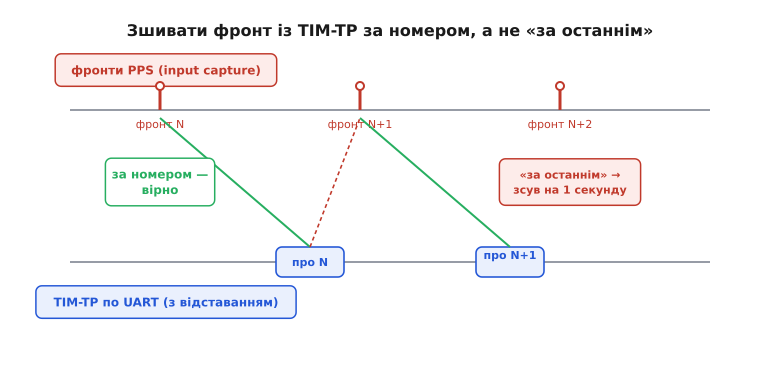

# ⚙️ Захоплення PPS у прошивці: від фронту на таймері до наносекунд

**Задача.** З GNSS-модуля виходять дві речі, і обидві треба завести в мікроконтролер. Перша — тонкий провід *TIMEPULSE*, на якому раз на секунду підскакує фронт; він несе **точну мить** межі секунди. Друга — послідовний потік (UART) із повідомленнями `UBX-TIM-TP`, які кажуть, **котру** секунду позначив той фронт і **наскільки** він промахнувся через квантування. Треба: спіймати фронт апаратурою так, щоб зафіксувати його момент з роздільністю такту мікроконтролера; розібрати бінарне повідомлення; звести фронт із його повідомленням у пару; і відняти поправку квантування, щоб дістати межу секунди точніше за такт самого модуля. Усе — на реальному C для прошивки, з роботою прямо по регістрах таймера.

**Ідея.** Стрижень усього — **не чіпати фронт програмою**. Момент фронту записує апаратний захоплювач (input capture) таймера: коли на вході з'являється потрібний край, залізо **саме** копіює поточний показ лічильника в окремий регістр `CCR`, миттєво й без участі коду. Програма приходить по це число вже опісля, у перерванні, — і хай приходить хоч на кілька мікросекунд пізніше: зафіксовано момент уже точно, у ту наносекунду, коли клацнув фронт. А повідомлення `UBX-TIM-TP` тим часом повзе по UART власним, повільним шляхом. Дві половини — гострий момент і його опис — зустрічаються вже в пам'яті, коли ми зшиваємо їх у пару. Уся стаття — про те, як не загубити точність на кожному з цих стиків.

Чому це взагалі окрема робота, а не рядок `if (gpio_read(PPS)) ...`? Бо опитувальний цикл ставить між справжнім фронтом і його поміченням **власну затримку** — і затримку не сталу. Розберімо це до кінця, бо тут корінь усього.

---

## Крок 0. Чому опитування вбиває точність

Найпростіша спокуса — крутити цикл і питати ногу:

```c
// ЯК НЕ ТРЕБА. Опитування ноги PPS у циклі.
uint8_t prev = 0;
for (;;) {
    uint8_t now = (GPIOA->IDR >> PPS_PIN) & 1u;   // прочитати рівень ноги
    if (now && !prev) {                            // побачили наростання 0→1
        uint32_t t = TIM2->CNT;                    // "оце момент фронту"
        handle_pps(t);
    }
    prev = now;
    do_other_work();                               // і ще купа справ у тому ж циклі
}
```

Проблема не в тому, що код поганий, а в тому, що `t = TIM2->CNT` читається **не тоді, коли клацнув фронт**, а тоді, коли до цього рядка дійшла черга. Між справжнім фронтом і цим читанням стоїть усе, що робить `do_other_work()`: інші гілки циклу, оброблення UART, обчислення. Якщо цикл раз на оберт відлучається на 200 мікросекунд — момент фронту ти зафіксуєш із запізненням **до тих самих 200 мікросекунд**, і щоразу іншим. Фронт, точний до наносекунд, ти сам розмив на сотні мікросекунд власним софтом. Уся перевага PPS — коту під хвіст.

Перевести це на переривання по нозі (`EXTI`) вже набагато краще, але й тут лишається дірка: від фізичного фронту до рядка, де ти читаєш `TIM2->CNT`, минає **латентність переривання** — час на дотікання поточної інструкції, збереження контексту, вхід у вектор. Це вже не сотні мікросекунд, а десятки-сотні **наносекунд**, та все одно гуляє від разу до разу (то кеш, то вища за пріоритетом перерва встигла влізти). Для мілісекундної точності байдуже; для наносекундної — ні.

Апаратний захоплювач прибирає цю дірку **повністю**. Момент фіксує залізо в ту саму мить, коли край перетнув поріг; показ лічильника осідає в `CCR` **до** того, як процесор узагалі довідався про подію. Обробник читає `CCR` пізніше — але читає вже **застиглий, точний** знімок. Латентність переривання перестає впливати на *значення*; вона впливає лише на те, як скоро ти по нього прийдеш. Ось ця різниця — «коли зафіксовано» проти «коли прочитано» — і є вся суть.

> 🔧 **Навіщо це.** Правило, яке варто закарбувати: усе, що вимірює час зовнішньої події точніше за мілісекунду, заводь на **input capture**, ніколи на опитування й по змозі не на голий `EXTI` з читанням лічильника в обробнику. Таймер із захоплювачем є майже в кожному мікроконтролері й коштує один канал. Це той випадок, коли правильна периферія дає точність задарма, а неправильний підхід її втрачає, хоч би як старанно ти писав код.

---

## Крок 1. Налаштувати таймер на вільний хід

Захоплювачу потрібна лінійка, чиї поділки він фіксуватиме, — вільно біжний лічильник таймера. Дві речі про нього треба вирішити наперед: **як швидко** він цокає (це роздільність міток) і **як довго** рахує до переповнення (це діапазон, у межах якого мітки не плутаються).

Роздільність. Хай ядро таймера живиться від 84 МГц. Якщо пустити лічильник без дільника, один тік — це 1/84000000 секунди ≈ 11.9 наносекунди. Це і є крок нашої лінійки: точніше за ~12 нс цей таймер мить фронту не розрізнить. Хочеш дрібніше — бери таймер на вищій частоті; але ~12 нс уже сумірне з квантуванням самого модуля, тож для більшості задач годиться.

Діапазон. Лічильник — це число скінченної ширини, і воно переповнюється. Тут критично взяти **32-бітний** таймер (на STM32 сімейств F4/F7/H7 це `TIM2` і `TIM5`), а не 16-бітний. Порахуймо, чому:

```
16-бітний на 84 МГц:  2¹⁶ тіків × 11.9 нс ≈ 65536 × 11.9 нс ≈ 780 мкс до переповнення
32-бітний на 84 МГц:  2³² тіків × 11.9 нс ≈ 4.29e9 × 11.9 нс ≈ 51.1 с до переповнення
```

16-бітний переповнюється кожні ~0.78 мілісекунди — між двома фронтами PPS (ціла секунда!) він обернеться понад тисячу разів. Стежити за такою кількістю обертів марудно й крихко. 32-бітний обертається раз на ~51 секунду — між фронтами вкладається щонайбільше **один** перехід через нуль, і його легко облічити. Тому для PPS беруть саме 32-бітний таймер; це не примха, а те, що робить решту коду простою.

```c
#include <stdint.h>

// Реєстрова модель таймера (спрощено, у стилі STM32).
// У реальному проєкті це структури з CMSIS-заголовка вендора.
void tim2_init_freerun(void) {
    RCC->APB1ENR |= RCC_APB1ENR_TIM2EN;   // подати такт на TIM2

    TIM2->PSC = 0;              // без дільника: один тік = 1/84 МГц ≈ 11.9 нс
    TIM2->ARR = 0xFFFFFFFFu;    // рахувати на всю 32-бітну ширину (макс. період)
    TIM2->CNT = 0;              // старт з нуля

    TIM2->EGR  = TIM_EGR_UG;    // згенерувати update, щоб PSC/ARR перезавантажились
    TIM2->CR1 |= TIM_CR1_CEN;   // запустити лічильник — далі він біжить сам
}
```

Після цього `TIM2->CNT` безперервно росте від 0 до 0xFFFFFFFF і знову через нуль, ні на мить не спиняючись. Це наша спільна лінійка часу; захоплювач фіксуватиме на ній положення фронту.

---

## Крок 2. Завести PPS на канал захоплення

Тепер найважливіше — сказати одному каналу таймера: «стеж за такою-то ногою, і коли на ній буде наростаючий фронт, копіюй `CNT` у свій `CCR`». Хай PPS заведено на ногу, що мультиплексується на канал 1 `TIM2`.

```c
void tim2_ch1_capture_init(void) {
    // Нога вже має бути переведена в альтернативну функцію TIM2_CH1
    // (налаштування GPIO опускаємо — воно специфічне для плати).

    // CC1 як ВХІД, підключений до входу TI1 (біти CC1S = 01).
    TIM2->CCMR1 &= ~TIM_CCMR1_CC1S;
    TIM2->CCMR1 |=  (0x1u << 0);       // CC1S = 01: канал 1 — вхід, джерело TI1

    // Легкий вхідний фільтр: подія визнається, лише якщо рівень
    // протримався кілька тактів. Гасить брязкіт/наводку на лінії.
    TIM2->CCMR1 &= ~TIM_CCMR1_IC1F;
    TIM2->CCMR1 |=  (0x3u << 4);       // IC1F = 0011: фільтр на N вибірок

    // Полярність: фіксувати НАРОСТАЮЧИЙ фронт (CC1P=0, CC1NP=0).
    TIM2->CCER &= ~(TIM_CCER_CC1P | TIM_CCER_CC1NP);

    TIM2->CCER |= TIM_CCER_CC1E;       // увімкнути захоплення на каналі 1

    // Дозволити переривання: захоплення (CC1) і переповнення (UPDATE).
    TIM2->DIER |= TIM_DIER_CC1IE | TIM_DIER_UIE;

    NVIC_EnableIRQ(TIM2_IRQn);
}
```

Розберімо, що тут насправді ввімкнулося. `CC1S = 01` перемикає канал із виходу на **вхід** і чіпляє його до сигналу з ноги. Полярність нулем каже фіксувати наростання (перехід 0→1) — саме той край, що за домовленістю позначає межу секунди. Фільтр `IC1F` — маленька, але корисна деталь: він вимагає, щоб рівень протримався кілька тактів, перш ніж подія зарахується, і тим відсікає голки-наводки, які інакше дали б фальшивий «фронт». Ширину фільтра бери помірну: завеликий загубить справжній край, замалий пропустить брязкіт.

А `DIER` вмикає **два** джерела переривання, і це принципово. `CC1IE` — власне захоплення: спрацює, коли фронт зафіксовано. `UIE` — переповнення лічильника: спрацює щоразу, коли `CNT` перевалює через нуль. Друге нам потрібне, щоб не загубити оберти таймера, — до цього дійдемо зараз.

---

## Крок 3. Розширити лічильник до 64 біт

Навіть 32-бітний таймер колись переповниться (раз на ~51 с), а нам треба вести **безперервний** лік — щоб мітка фронту, знята зараз, і мітка події, знята через хвилину, лежали на одній шкалі без розривів. Розв'язок класичний: тримати старші біти часу **в програмі**. Заводимо 32-бітний лічильник переповнень; разом із 32 бітами `CNT` він дає **64-бітну** мітку, якої вистачить на тисячі років.

```c
// Старші 32 біти часу: скільки разів TIM2 перевалив через нуль.
static volatile uint32_t tim2_overflows = 0;

// Суть обробки переповнення — одна дія: облічити оберт.
// (У кроці 4 ми вкладемо цей інкремент у той самий обробник, що ловить фронт,
//  бо TIM2 подає обидві події — захоплення й переповнення — в одну перерву.)
// tim2_overflows++;
```

Здавалося б, зібрати повну мітку легко: `(overflows << 32) | CNT`. Але тут чигає підступна гонка. Уяви, що фронт клацнув **рівно** біля переповнення. Може статися так: `CNT` уже перескочив через нуль (тобто молодші біти малесенькі), а обробник переповнення, що мав збільшити `overflows`, **ще не відпрацював** (він у черзі за поточним). Склеїш нове маленьке `CNT` зі старим, ще не збільшеним `overflows` — і дістанеш мітку, що «стрибнула назад» на цілі 51 секунду. Один зіпсований відлік раз на переповнення — рівно там, де фронт трапився поряд із межею.

Рятунок — дивитися на **прапорець переповнення** в момент склеювання. Якщо захоплене значення мале, а прапорець переповнення ще висить необробленим — значить, перекид уже стався, але ще не облічений, і до старших бітів треба додати одиницю вручну. Прапорець `UIF` беремо не з живого регістра, а **знімком**, який передає обробник (чому саме так — у кроці 4):

```c
// Зібрати повну 64-бітну мітку із захопленого 32-бітного значення,
// коректно врахувавши переповнення, що могло статися "поряд".
// sr_snapshot — знімок TIM2->SR, зроблений обробником на вході.
static uint64_t make_stamp64(uint32_t captured, uint32_t sr_snapshot) {
    uint32_t ovf = tim2_overflows;
    uint32_t uif = (sr_snapshot & TIM_SR_UIF) ? 1u : 0u;  // висить неопрацьоване переповнення?

    // Якщо переповнення чекає в черзі І захоплення сталося ВЖЕ після перекиду
    // (мале значення лічильника) — цей оберт іще не врахований, додаємо його.
    if (uif && captured < 0x80000000u) {
        ovf++;
    }
    return ((uint64_t)ovf << 32) | captured;
}
```

Поріг `0x80000000` (половина діапазону) розрізняє два випадки одного прапорця: захоплення **перед** самим перекидом (велике `CNT`, оберт іще не треба додавати) від захоплення **одразу після** (мале `CNT`, оберт додати). Це стандартний прийом; без нього мітки фронтів біля межі переповнення час від часу брехатимуть на цілий період таймера, і ловити такий баг — справжня морока, бо він вилазить раз на ~51 секунду й лише коли фронт майже збігся з перекидом.

---

## Крок 4. Обробник захоплення: зняти мітку й нічого не рахувати

Тепер сам обробник фронту. Золоте правило переривання: **коротко**. Знімаємо `CCR`, будуємо мітку, кладемо у спільну змінну, підіймаємо прапорець «є свіжий фронт» — і виходимо. Жодних обчислень, жодного розбору повідомлень: усе важке робить головний цикл, а перерва лише ловить момент.

```c
// Спільний "поштовий" стан між ISR і головним циклом.
static volatile uint64_t pps_stamp     = 0;   // 64-бітна мітка останнього фронту
static volatile uint32_t pps_count     = 0;   // лічильник фронтів (зростає з кожним)

// Диспетчер переривань TIM2: одне джерело на два прапорці.
void TIM2_IRQHandler(void) {
    uint32_t sr = TIM2->SR;            // ОДИН знімок обох прапорців на вході

    // 1) Захоплення на каналі 1 — прийшов фронт PPS.
    //    Складаємо мітку, ПОКИ UIF ще не знято, і передаємо знімок sr усередину:
    //    так make_stamp64 бачить той самий стан прапорця, що й ми тут.
    if (sr & TIM_SR_CC1IF) {
        uint32_t cap = TIM2->CCR1;         // читання CCR1 САМЕ знімає прапорець CC1IF
        pps_stamp = make_stamp64(cap, sr); // повна мітка з урахуванням перекиду
        pps_count++;                        // цей фронт відбувся
    }

    // 2) Переповнення? Облічити оберт і аж ТЕПЕР зняти прапорець.
    if (sr & TIM_SR_UIF) {
        tim2_overflows++;
        TIM2->SR = ~TIM_SR_UIF;    // зняти прапорець (запис 0 у біт)
    }
}
```

Тут працює та сама `make_stamp64` із кроку 3 — саме тому вона й бере знімок `sr` другим параметром. Три тонкощі, які легко проґавити. Перша: `make_stamp64` мусить бачити **той самий** стан прапорця `UIF`, що й обробник, тож ми складаємо мітку **до** гасіння `UIF` і передаємо всередину знімок `sr` — а не читаємо живий `TIM2->SR` удруге (він міг би вже змінитися). Друга: `CC1IF` знімається **самим читанням `CCR1`** — окремо гасити його не треба, і навіть шкідливо (можна проґавити нове захоплення). А от `UIF` гаситься явним записом, і робимо це **останнім**, коли оберт уже облічено й мітку вже складено. Третя: різні прапорці — різні правила скидання; сплутаєш — дістанеш або подвійне оброблення, або втрачені події.

Головний цикл тепер працює з готовою міткою, не боячись, що вона зміниться під руками:

```c
// У головному циклі: чи прийшов новий фронт від останньої перевірки?
static uint32_t last_seen = 0;

int pps_take(uint64_t *stamp_out, uint32_t *index_out) {
    uint32_t cnt = pps_count;              // знімок лічильника фронтів
    if (cnt == last_seen) {
        return 0;                           // нового фронту не було
    }
    // Прочитати мітку АТОМАРНО щодо ISR: коротко закрити переривання таймера.
    NVIC_DisableIRQ(TIM2_IRQn);
    *stamp_out = pps_stamp;
    *index_out = cnt;
    NVIC_EnableIRQ(TIM2_IRQn);

    last_seen = cnt;
    return 1;                               // є свіжий фронт
}
```

Чому тут глушимо переривання на два рядки? Бо `pps_stamp` — 64-бітне, а мікроконтролер читає його **двома** 32-бітними доступами. Якби рівно між цими доступами влетів новий фронт і переписав `pps_stamp`, ти б склеїв молодшу половину від старої мітки зі старшою від нової — покруч. Коротке закриття переривання робить читання неподільним. Це не марна обережність: гонки на багатобайтових спільних змінних — один із найпідступніших класів помилок у прошивці, бо вони рідкі й невідтворні.

---

## Крок 5. Розібрати `UBX-TIM-TP` із потоку UART

Фронт спіймано, мітка є. Тепер зустрічна половина — повідомлення, що каже, **котру** секунду позначив фронт і **наскільки** він схибив. У модулів u-blox це `UBX-TIM-TP`. Кожен UBX-кадр має сталу обгортку: два байти-синхро `0xB5 0x62`, потім клас і номер повідомлення, довжина, корисне навантаження й два байти контрольної суми.

Спершу — точна структура корисного навантаження `TIM-TP`. Її звірено з інтерфейсним описом u-blox: клас/номер **0x0D 0x01**, навантаження **16 байтів**.

```
Зсув  Поле       Тип   Одиниця   Що це
────  ─────────  ────  ────────  ─────────────────────────────────────────
 0    towMS      U4    мс        час тижня фронту, ціла частина (мілісекунди)
 4    towSubMS   U4    пс·2⁻³²   субмілісекундна частина (дробові пікосекунди)
 8    qErr       I4    пс        помилка квантування (ЗНАКОВА!)
12    week       U2    —         номер тижня
14    flags      X1    —         прапорці (база часу: GPS чи UTC тощо)
15    refInfo    X1    —         джерело/опис бази
```

Три поля, що нам потрібні: `towMS` дає, на яку **секунду** тижня став фронт (звідси й календарна мітка); `week` доповнює його до повного моменту; `qErr` несе поправку квантування в **пікосекундах**, і вона **знакова**. Ось код, що витягує кадр із байтового потоку й дістає ці поля. UBX іде **молодшим байтом уперед** (little-endian), тож збираємо числа вручну, зсувами, — не покладаючись на розкладку структур у пам'яті.

:::tabs
```cpp
// Мала машина станів, що виловлює один кадр UBX-TIM-TP з потоку байтів.
// Викликається на кожен прийнятий по UART байт (напр., із його ISR/черги).
#include <array>
#include <cstdint>

class UbxTimTpParser {
public:
    struct TimTp {
        std::uint32_t towMS;      // ціла частина часу тижня, мс
        std::uint32_t towSubMS;   // дробова частина, пс × 2⁻³²
        std::int32_t  qErr;       // помилка квантування, пс (знакова)
        std::uint16_t week;       // номер тижня
        std::uint8_t  flags;
        std::uint8_t  refInfo;
    };

    // Згодувати один байт; true — щойно зібрано валідний кадр (у msg()).
    bool feed(std::uint8_t b) {
        switch (st_) {
        case St::Sync1: if (b == kSync1) st_ = St::Sync2;          break;  // чекаємо 0xB5
        case St::Sync2: st_ = (b == kSync2) ? St::Cls : St::Sync1; break;  // потім 0x62
        case St::Cls:   cls_ = b; ckA_ = b; ckB_ = ckA_; st_ = St::Id;  break; // клас (старт CK)
        case St::Id:    id_ = b;  addCk(b); st_ = St::LenLo;            break; // номер
        case St::LenLo: len_ = b; addCk(b); st_ = St::LenHi;           break; // довжина LSB
        case St::LenHi:                                                        // довжина MSB
            len_ |= static_cast<std::uint16_t>(b) << 8; addCk(b);
            idx_ = 0;
            // Беремо лише TIM-TP потрібної довжини; решту кадрів пропускаємо.
            st_ = (cls_ == kCls && id_ == kId && len_ == kLen) ? St::Body : St::Sync1;
            break;
        case St::Body:  buf_[idx_++] = b; addCk(b);                    // тіло навантаження
            if (idx_ >= len_) st_ = St::CkA;
            break;
        case St::CkA:   st_ = (b == ckA_) ? St::CkB : St::Sync1;       break; // звірити CK_A
        case St::CkB:                                                          // звірити CK_B
            if (b == ckB_) {                                            // кадр цілий
                msg_ = TimTp{ rdU32(0), rdU32(4),
                              static_cast<std::int32_t>(rdU32(8)),      // знакова!
                              static_cast<std::uint16_t>(buf_[12] | (buf_[13] << 8)),
                              buf_[14], buf_[15] };
                ++count_;                                              // свіже повідомлення
                st_ = St::Sync1;
                return true;
            }
            st_ = St::Sync1;
            break;
        }
        return false;
    }

    const TimTp&  msg()   const { return msg_; }
    std::uint32_t count() const { return count_; }

private:
    static constexpr std::uint8_t  kSync1 = 0xB5, kSync2 = 0x62;
    static constexpr std::uint8_t  kCls = 0x0D, kId = 0x01;
    static constexpr std::uint16_t kLen = 16;

    enum class St { Sync1, Sync2, Cls, Id, LenLo, LenHi, Body, CkA, CkB };

    void addCk(std::uint8_t b) { ckA_ += b; ckB_ += ckA_; }

    std::uint32_t rdU32(std::size_t off) const {   // little-endian → uint32
        return  static_cast<std::uint32_t>(buf_[off])
             | (static_cast<std::uint32_t>(buf_[off + 1]) << 8)
             | (static_cast<std::uint32_t>(buf_[off + 2]) << 16)
             | (static_cast<std::uint32_t>(buf_[off + 3]) << 24);
    }

    St st_ = St::Sync1;
    std::uint8_t  cls_ = 0, id_ = 0, ckA_ = 0, ckB_ = 0;
    std::uint16_t len_ = 0, idx_ = 0;
    std::array<std::uint8_t, kLen> buf_{};
    TimTp msg_{};
    std::uint32_t count_ = 0;   // лічильник валідних кадрів (для головного циклу)
};
```
```python
# Виловлює кадри UBX-TIM-TP із серійного потоку (pyserial), поля дістає struct.
# UBX іде little-endian; формат "<IIiHBB": towMS, towSubMS, qErr(знакова!),
# week, flags, refInfo — саме те, що C-версія збирає зсувами вручну.
import struct
from collections import namedtuple

SYNC = b"\xB5\x62"
CLS, MID, PAYLEN = 0x0D, 0x01, 16
TimTp = namedtuple("TimTp", "towMS towSubMS qErr week flags refInfo")

def _fletcher(data: bytes) -> tuple[int, int]:
    """8-бітна сума Флетчера UBX над діапазоном клас..кінець навантаження."""
    ck_a = ck_b = 0
    for byte in data:
        ck_a = (ck_a + byte) & 0xFF
        ck_b = (ck_b + ck_a) & 0xFF
    return ck_a, ck_b

def read_timtp(ser):
    """Читати з порту, віддаючи кожен валідний кадр TIM-TP (генератор)."""
    while True:
        # Синхронізуватися на 0xB5 0x62.
        if ser.read(1) != SYNC[:1] or ser.read(1) != SYNC[1:]:
            continue
        header = ser.read(4)                      # cls, id, len(LE u16)
        cls, mid, length = header[0], header[1], header[2] | (header[3] << 8)
        payload = ser.read(length)
        ck_a, ck_b = ser.read(2)
        # Звірити суму ПЕРЕД тим, як довіритись кадру; збитий байт → відкинути.
        if (ck_a, ck_b) != _fletcher(header + payload):
            continue
        # Пропускаємо все, крім TIM-TP потрібної довжини.
        if (cls, mid, length) != (CLS, MID, PAYLEN):
            continue
        yield TimTp._make(struct.unpack("<IIiHBB", payload))
```
:::

Головне тут — три речі. По-перше, **контрольна сума**: UBX рахує 8-бітну суму Флетчера (два байти `CK_A`/`CK_B`) над діапазоном від класу до кінця навантаження, і ми звіряємо її перед тим, як довіритись кадру, — бо один збитий байт на UART інакше дав би тобі хибну мітку часу, гіршу за жодну. По-друге, `qErr` читаємо **як знакове** (`int32_t`): забудеш каст — і від'ємна поправка обернеться на величезне додатне число, а точність замість покращитись розлетиться. По-третє, ми свідомо **пропускаємо** всі кадри, крім `TIM-TP` потрібної довжини: у потоці йдуть десятки інших UBX-повідомлень, і машина має ковзати повз них, не спотикаючись.

---

## Крок 6. Звести фронт із повідомленням і відняти квантування

Обидві половини є: мітка фронту (`pps_take`) і повідомлення (`timtp_msg`). Лишилось **зшити** їх правильно — і тут ховається найтонша пастка всієї задачі.

`UBX-TIM-TP` описує **той фронт, що вже стався**: модуль спочатку видає фронт, а тоді, трохи згодом, відправляє повідомлення про нього. Тобто природний порядок такий: **спершу input-capture ловить фронт N, потім по UART доповзає TIM-TP, що описує фронт N**. Наївно було б на кожне нове повідомлення хапати останню мітку фронту — але що, як UART відстав і повідомлення про фронт N прийшло вже **після** того, як клацнув фронт N+1? Тоді ти припасуєш опис секунди N до мітки секунди N+1 — і дістанеш стабільний зсув рівно на одну секунду, який жоден розрахунок сам не викриє.


*Верхня доріжка — гострі фронти, зловлені захоплювачем; нижня — повідомлення TIM-TP, кожне про свій фронт, але зі спізненням. Зелене зшивання за номером кладе «про N» на фронт N. Червоний пунктир — спокуса взяти «останній» фронт: повідомлення «про N» схопило б уже фронт N+1 і дало б стабільний зсув рівно на секунду.*

Тому пару зводимо не «за останнім», а **лічильниками**: скільки фронтів спіймано (`pps_count`) і скільки повідомлень розібрано (`timtp_count`). У сталому режимі, коли все встигає, кожному фронту відповідає рівно одне повідомлення, і різниця лічильників стала. Правильний зшивач тримає **чергу** останніх міток фронтів і бере з неї ту, що відповідає щойно прийшлому повідомленню, а не просто найсвіжішу:

```c
// Невелика кільцева черга останніх міток фронтів — щоб зіставляти
// повідомлення з ПРАВИЛЬНИМ фронтом, навіть коли UART трохи відстав.
#define PPS_Q  4
static uint64_t edge_q[PPS_Q];
static uint32_t edge_q_idx[PPS_Q];      // індекс (pps_count) кожної збереженої мітки

// Викликати з головного циклу: перекласти нові фронти з ISR у чергу.
void pps_drain(void) {
    uint64_t st; uint32_t ix;
    while (pps_take(&st, &ix)) {
        uint32_t slot = ix % PPS_Q;
        edge_q[slot]     = st;
        edge_q_idx[slot] = ix;
    }
}

// Знайти в черзі мітку фронту з потрібним індексом; -1, якщо вже витиснена.
static int edge_lookup(uint32_t want_index, uint64_t *out) {
    uint32_t slot = want_index % PPS_Q;
    if (edge_q_idx[slot] == want_index) {
        *out = edge_q[slot];
        return 0;
    }
    return -1;                           // фронт "виїхав" з черги — розрив
}
```

Тепер — власне поєднання. Домовимося, що фронт із індексом `k` описується `k`-тим повідомленням `TIM-TP` (лічильники стартують разом і йдуть в ногу). На кожне нове повідомлення беремо **той** фронт, чий номер збігається з номером повідомлення, і аж тоді застосовуємо поправку квантування:

```c
// Тік точного часу: пробуємо видати одну повну, скориговану позначку
// межі секунди. Повертає 1, якщо цього разу вийшла свіжа пара.
static uint32_t timtp_seen = 0;

int pps_solve(uint64_t *edge_ticks_out, int32_t *qErr_out, uint32_t *tow_ms_out) {
    pps_drain();                          // забрати свіжі фронти в чергу

    uint32_t mc = timtp_count;            // скільки повідомлень уже є
    if (mc == timtp_seen) {
        return 0;                          // нового повідомлення нема
    }

    // Свіже повідомлення з індексом (mc-1) описує фронт із тим самим індексом.
    uint32_t idx = mc - 1;
    uint64_t edge;
    if (edge_lookup(idx, &edge) != 0) {
        // Мітки цього фронту в черзі вже нема (UART відстав > PPS_Q секунд,
        // або фронт випав) — цю пару чесно ПРОПУСКАЄМО, а не зшиваємо навмання.
        timtp_seen = mc;
        return -1;
    }

    // Прочитати поля повідомлення атомарно щодо UART-ISR.
    __disable_irq();
    int32_t  q  = timtp_msg.qErr;         // пікосекунди, знакова
    uint32_t tw = timtp_msg.towMS;        // мс тижня
    __enable_irq();

    *edge_ticks_out = edge;
    *qErr_out       = q;
    *tow_ms_out     = tw;
    timtp_seen      = mc;
    return 1;
}
```

І фінальний крок — **відняти квантування**. Фронт фізично клацнув не точно на межі секунди, а на найближчому такті кварцу модуля; `qErr` каже, наскільки цей виданий фронт **розійшовся** з ідеальною позицією. Тож істинна межа секунди — це момент захопленого фронту, зсунутий назад на цю поправку. Перекладемо все в спільну одиницю. Один тік нашого `TIM2` на 84 МГц — це відома кількість пікосекунд:

```
1 тік = 1 / 84_000_000 с = 1e12 / 84_000_000 пс ≈ 11905 пс
```

```c
// Перевести мітку фронту (тіки TIM2) у пікосекунди й прибрати квантування.
// Результат — оцінка ІСТИННОЇ межі секунди у пікосекундах на нашій шкалі.
int64_t pps_true_edge_ps(uint64_t edge_ticks, int32_t qErr_ps) {
    // Пікосекунд на тік для 84 МГц: 1e12 / 84e6. Дробову частину лишаємо цілою
    // арифметикою, щоб не тягти float у гарячий шлях.
    const int64_t PS_NUM = 1000000000000LL;   // 1e12 пс/с
    const int64_t F_HZ   = 84000000LL;         // частота таймера

    int64_t edge_ps = (int64_t)edge_ticks * PS_NUM / F_HZ;

    // Виданий фронт стоїть у (істинна межа + qErr). Отже істинну межу
    // дістаємо, ВІДНявши поправку. Знак qErr уже несе напрям.
    return edge_ps - (int64_t)qErr_ps;
}
```

Один важливий застереж про знак, поданий чесно: інтерфейсний опис u-blox трактує `qErr` як «на скільки виданий фронт випереджає (від'ємне) чи запізнюється (додатне) щодо номінальної позиції». За цією угодою істинна межа = захоплений момент − `qErr`, і саме так у коді. Але напрям поправки варто **перевірити на своєму залізі** одним виміром — завести відомий еталон і глянути, зменшується розкид після відняття чи росте: якщо після поправки джитер від секунди до секунди **падає** — знак правильний; якщо **більшає** — переверни. Практики GPSDO звіряють це саме дослідом, бо тонкощі полярності залежать і від того, як саме ти відлічуєш свій інтервал. Величина ж `qErr` мала — одиниці-десятки наносекунд, — але це рівно та драбина, що спускає точність із такту модуля (десятки нс) на одиниці нс.

Тепер повний момент готовий: `towMS` (з `week`) дає **число** секунди в шкалі GNSS, а `pps_true_edge_ps` дає точний **момент** тієї секунди на власній лінійці мікроконтролера. Число й момент, кожне своїм шляхом, зійшлися в одну точну мітку — те, заради чого все й будувалося. Число секунди зазвичай іще переводять у зручний формат і стежать за високосними секундами шкали GPS проти UTC; тонкощі зберігання самого моменту цілим числом — окрема тема [мітки часу](root:sf-distributed/timestamps).

---

## Складність і пастки

- **Опитування замість захоплення.** Найгрубша й найпоширеніша помилка. Читати ногу PPS у циклі (чи навіть у `EXTI`-обробнику через `CNT`) означає домішати до моменту фронту власну, плавну затримку софту — від сотень наносекунд до сотень мікросекунд. Уся точність PPS на цьому й гине. Тільки input capture фіксує момент апаратно, до втручання коду.

- **16-бітний таймер під PPS.** Обертається щось раз на ~0.8 мс — понад тисячу разів між фронтами. Стежити за такою навалою переповнень крихко й марудно. Бери 32-бітний (`TIM2`/`TIM5` на STM32 F4/F7/H7): між фронтами максимум один перекид, і його легко облічити.

- **Переповнення поряд із фронтом.** Якщо фронт клацнув майже на межі перекиду лічильника, склеювання «малого `CNT`» зі «старим `overflows`» дає стрибок назад на цілий період таймача (~51 с). Лік раз на ~51 секунду, лише коли фронт майже збігся з перекидом, — його диявольськи важко спіймати. Лікування — дивитись на прапорець `UIF` при складанні мітки й додавати необлічений оберт (крок 3).

- **Порядок прапорців в обробнику.** Коли захоплення й переповнення прийшли в один вхід у перерву, переповнення треба обробити **першим**, аби облік обертів був свіжий, коли за ним складається мітка. Переплутаєш порядок — і повернеш ту саму помилку на цілий період.

- **Плутанина зі скиданням прапорців.** `CC1IF` гаситься **читанням `CCR1`** (окремо чистити не треба й шкідливо); `UIF` — явним записом. Сплутаєш правила — дістанеш або втрачені захоплення, або нескінченне повторне входження в перерву.

- **Розрив послідовності фронт↔повідомлення.** Найтонша логічна пастка. `TIM-TP` описує вже здійснений фронт і повзе по UART повільніше за сам фронт. Хапати «останню мітку» на кожне повідомлення — значить рано чи пізно припасувати опис секунди N до мітки секунди N+1 і отримати **стабільний зсув рівно на секунду**, невидимий у самих числах. Зшивати треба лічильниками через чергу міток (крок 6), а безнадійно розсинхронені пари — чесно пропускати, а не зшивати навмання.

- **Багатобайтова гонка на спільній мітці.** 64-бітну `pps_stamp` мікроконтролер читає двома доступами; влетить фронт між ними — і склеїш половини від різних міток. Читання спільних >32-бітних змінних щодо ISR роби атомарним (коротко глушачи відповідну перерву), інакше зрідка ловитимеш дику мітку.

- **`qErr` як беззнакове.** Забудеш каст в `int32_t` — від'ємна поправка перетвориться на мільярди пікосекунд, і замість наносекундного уточнення дістанеш абсурд. Поле знакове; читай його знаковим і перевір **напрям** поправки одним дослідом на еталоні.

- **Довіра до кадру без контрольної суми.** Один збитий байт на UART — і `towMS` бреше на секунди, а `qErr` на кілометри. Звіряй `CK_A`/`CK_B` UBX **перед** тим, як узяти поля; хибна мітка гірша за пропущену.

Зібравши це докупи — вільний хід 32-бітного таймача, канал на захоплення наростання, коротка ISR лише зі зняттям мітки, розширення до 64 біт із захистом від перекиду, стійкий UBX-парсер із перевіркою суми й зшивання лічильниками з відніманням `qErr` — дістаєш прошивку, що тримає межу секунди на одиницях наносекунд і не збивається ні на переповненні, ні на затримці UART. Далі змінюється лише конкретний таймер і формат повідомлення модуля, а кістяк лишається тим самим.
