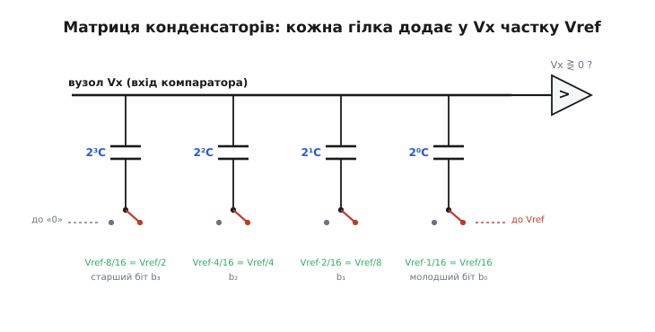

# 🧮 Звідки Vref у знаменнику: виведення передавальної функції АЦП

Формула АЦП виглядає оманливо просто:

```
код = 2ᴺ · Vвх / Vref
```

Двійка в степені N — зрозуміло: це повна шкала, кількість щаблів у N-розрядного перетворювача. Vвх зверху — теж зрозуміло: більший вхід — більший код. А от Vref **у знаменнику** ставить чесне запитання, на яке мало хто може відповісти без задумування. Чому опорна напруга **ділить**? Чому зростання Vref **зменшує** код за того самого входу? Це не випадкова умовність і не зручне нормування, яке хтось придумав, щоб числа гарно лягли. Vref стоїть знизу **структурно** — тому що перетворювач фізично не вміє робити нічого, крім як будувати **частки від Vref** і питати, скільки таких часток уклалося у вхід.

Розберімо це до самого дна. Спершу — інтуїція, чому АЦП взагалі мусить мати щось у знаменнику. Тоді — формальне виведення формули з фізики одного конкретного, дуже поширеного перетворювача (порозрядне зрівноваження на матриці конденсаторів), де видно на очах, як кожна частка Vref народжується з відношення ємностей. І нарешті — як саме ця структура «Vref знизу» дозволяє спільному множнику скоротитися у дільнику напруги й у послідовному колі, та коротко й точно: що при цьому скорочується, а що ні.

## АЦП не знає, що таке вольт

Найперше, що треба зруйнувати, — уявлення, ніби всередині АЦП сидить якийсь еталонний вольт, із яким він звіряє вхід. Його там немає. У перетворювача взагалі нема доступу до абсолютної одиниці напруги — так само, як у лінійки без поділок немає доступу до абсолютного метра. Усе, що має АЦП, — це **одна напруга, яку йому подали ззовні й назвали опорною** (Vref, від англ. *reference* — опора, взірець), і **компаратор** — пристрій, що вміє лише сказати «оце більше за те» чи «менше».

З цих двох речей не можна виміряти вольти. З них можна виміряти **відношення**. Перетворювач здатен поставити лише одне питання й варіювати його: «чи більший вхід за таку-то частку Vref?» — за половину, за чверть, за три чверті. Складаючи відповіді, він зрештою називає, **яку частку Vref становить вхід**. Не «скільки вольтів», а «скільки шістнадцятих, скільки тисячних від тієї напруги, що мені дали за опору».

Ось чому в результаті неминуче з'являється ділення. Код — це **частка**, число без розмірності: скільки разів якась мірка вклалася у вхід. А мірка тут одна-єдина — Vref. Тож вхід завжди фігурує **поділеним на Vref**, бо саме Vref є тією мірою, якою його лічать. Поставте більшу опору — і той самий вхід становитиме **меншу** її частку, тож код **упаде**. Звідси Vref у знаменнику: не з примхи, а тому що це **одиниця вимірювання**, а вимірюване число завжди є вимірюваною величиною, поділеною на одиницю.

> 🔧 **Навіщо це.** Поки тримаєш у голові, що АЦП повертає **частку Vref**, а не вольти, перестаєш дивуватися найпоширенішим несподіванкам: чому той самий давач дає інший код, коли поряд змінили Vref; чому подвоєння опорної вдвічі стискає всю шкалу; чому «3.3 В на вході» — безглузда фраза, поки не сказано, відносно якої опори. Уся передавальна функція АЦП — це одне відношення, і бачити його так заздалегідь рятує від годин налагодження.

Лишається перетворити цю інтуїцію на формулу й показати **механізм** — як саме залізо будує ті частки Vref. Бо сказати «АЦП лічить частки» — це ще опис ззовні. Усередину варто зазирнути, щоб побачити, що частки Vref — не метафора, а буквально напруги, які перетворювач створює сам, ділячи Vref відношеннями деталей.

## Як перетворювач фізично будує частки Vref

Візьмемо найпоширенішу сьогодні архітектуру — **порозрядне зрівноваження** (англ. *successive approximation* — послідовне наближення), той самий двійковий пошук «гирями». Усередині сучасного такого АЦП пробні частки Vref народжує не резисторний дільник, а **матриця конденсаторів** із перерозподілом заряду (англ. *charge redistribution*). Цей спосіб запропонували Джеймс Мак-Крірі та Пол Ґрей у грудні 1975 року в роботі «All-MOS Charge Redistribution Analog-to-Digital Conversion Techniques» (*IEEE Journal of Solid-State Circuits*, SC-10, № 6) — це **усталений**, добре задокументований першоджерельний результат, і відтоді саме така матриця стала панівною в КМОН-перетворювачах через малу площу й низьке споживання. Розберімо її, бо ніде структурне походження дробів від Vref не видно так чисто. [Сам перерозподіл заряду між ємностями](topic:hw-analog/charge-redistribution) — окрема тема; тут нам треба з нього рівно одне: коли ємності з'єднані спільною верхньою пластиною, перемикання нижньої пластини зміщує спільний вузол **пропорційно до частки цієї ємності в загальній**.

Уявімо для наочності 4-розрядний перетворювач (N = 4, повна шкала 2⁴ = 16). У ньому набір конденсаторів із **двійково-зваженими** ємностями: 8C, 4C, 2C, C — і ще один «кінцевий» C, щоб сума вийшла рівно 16C. «C» тут — ємність одного однакового елемента (англ. *unit capacitor*), а всі інші складені з таких самих елементів: 2C — це два паралельні C, 4C — чотири, 8C — вісім. Це принципово: відношення ємностей задані **не точністю якогось номіналу, а лічбою однакових елементів**, тож вони — чисті числа, відомі з геометрії, а не з абсолютних значень.

Верхні пластини всіх конденсаторів з'єднані в один вузол — назвемо його Vx, це вхід компаратора. Нижні пластини кожен свій перемикач може під'єднати або до «нуля» (землі), або до Vref. У цьому вся гра: перемикаючи нижню пластину одного конденсатора з нуля на Vref, ми штовхаємо вузол Vx угору рівно на ту частку Vref, яку ця ємність становить у загальній. Порахуймо цей поштовх для старшого конденсатора 8C.

Уся ємність матриці — сума:

```
C_заг = 8C + 4C + 2C + C + C = 16C = 2⁴·C
```

Коли всі нижні пластини на нулі, а ми перекидаємо нижню пластину **8C** на Vref, заряд перерозподіляється так, що спільний вузол зміщується на:

```
ΔVx = Vref · (8C / C_заг) = Vref · 8C/16C = Vref/2
```

Ось воно — **перша половина Vref народилася з відношення ємностей 8C до 16C**, тобто з чистого числа 8/16. Не з номіналу конденсатора (він скоротився — стоїть і зверху, і знизу), а з того, **скільки однакових елементів** у цій гілці проти загального числа. Наступний конденсатор дасть:

```
4C на Vref:  ΔVx = Vref · 4C/16C = Vref/4
2C на Vref:  ΔVx = Vref · 2C/16C = Vref/8
C  на Vref:  ΔVx = Vref · 1C/16C = Vref/16
```



*Кожна гілка матриці вносить у вузол компаратора Vx свою частку Vref — і ця частка дорівнює відношенню ємності гілки до повної ємності 16C. Старший біт важить Vref/2, наступний Vref/4, і так далі: половинки Vref будуються структурно, відношенням однакових елементів, а не точністю номіналів.*

Кожна гілка матриці — це **готова частка Vref**, і всі ці частки — двійкові: Vref/2, Vref/4, Vref/8, Vref/16. Перетворювач більше нічого вміти й не мусить: вмикаючи комбінацію конденсаторів, він складає з цих половинок будь-яку напругу виду

```
(b₃·8 + b₂·4 + b₁·2 + b₀·1) · Vref/16
```

де кожне b — нуль або одиниця (гілка вимкнена чи ввімкнена). А (b₃·8 + b₂·4 + b₁·2 + b₀·1) — це і є **двійкове число, записане бітами b₃b₂b₁b₀**, тобто сам код. Тож пробна напруга, яку матриця прикладає до порівняння, дорівнює рівно:

```
Vпроба = код · Vref / 2ᴺ
```

Тут уже видно майбутню формулу, просто переставлену. Перетворювач уміє створювати **тільки** напруги, кратні Vref/2ᴺ — частки Vref, і жодних інших; абсолютний вольт йому недоступний у принципі. Лишилося згадати, що з цим робить двійковий пошук.

## Зрівноваження: вхід дорівнює сумі ввімкнених часток

Тепер — сам акт вимірювання. Спочатку перетворювач **запам'ятовує** вхід: під час вибірки нижні пластини під'єднані до Vвх, і на матриці осідає заряд, пропорційний Vвх. Це і є вбудована вибірка-зберігання, яку матриця конденсаторів дає сама собою. Після цього починається пошук: логіка перебирає біти від старшого до молодшого, на кожному кроці пробуючи ввімкнути чергову частку Vref і питаючи компаратор, чи не перебрали. Якщо ввімкнена комбінація **перевищила** запам'ятований вхід — біт скидають, ні — лишають. Через N кроків на матриці виставлена та комбінація часток Vref, що **найточніше зрівноважила** вхід.

«Зрівноважила» означає буквальне: напруга на вузлі компаратора зведена до нуля (з точністю до одного молодшого щабля). А вузол Vx несе різницю між тим, що поклали ваги, і тим, що внесла запам'ятована Vвх. Умова рівноваги, яку шукає пошук:

```
Vвх  ≈  (сума ввімкнених часток Vref)  =  код · Vref / 2ᴺ
```

Це рівняння — серце всього. Зліва — вхід; справа — найближча двійкова частка Vref, яку перетворювач зумів скласти. Двійковий пошук є просто **ефективним способом** знайти той код, що робить праву частину якнайближчою до лівої — не за 2ᴺ проб, а за N кроків, бо кожен крок ділить навпіл невизначеність. Розв'яжімо цю рівність відносно коду — і дістанемо передавальну функцію:

```
код = 2ᴺ · Vвх / Vref
```

Ось чому Vref у знаменнику, **доведено від заліза**. Перетворювач прирівнює вхід до суми двійкових **часток Vref**; щоб виразити, скільки таких часток уклалося, доводиться поділити вхід на «розмір» однієї повної шкали — на Vref. Vref ділить не тому, що так зручно записати, а тому що вона буквально є мірою, відношеннями якої збудована вся внутрішня лінійка перетворювача. Поставте більшу Vref — кожна частка стане «грубшою», тих самих вольтів входу вкладеться менше, код упаде. Усе сходиться з інтуїцією, але тепер це не аналогія, а наслідок перерозподілу заряду між полічених однакових конденсаторів.

> 🔧 **Навіщо це.** З цього виведення випливає геть практична річ: **точність АЦП — це точність відношень усередині матриці, а не точність якогось абсолютного номіналу.** Тому виробники й роблять матрицю з однакових елементів, які лягають на кристал майже ідентично: важить не те, скільки фарад у «C», а те, що 8C справді у вісім разів більше за C. І та сама думка пояснює, чому весь перетворювач **рейтіометричний за конструкцією**: він не міряє вольтів, він видає відношення Vвх/Vref — тож якщо зробити Vвх теж відношенням до Vref, опора скоротиться, і про неї можна забути. Саме це й робить рейтіометрична схема.

Зауважмо ще: ми розібрали порозрядне зрівноваження, бо в ньому походження часток Vref видно фізично, пластина за пластиною. Але правило `код = 2ᴺ·Vвх/Vref` від архітектури **не залежить**. У [сигма-дельта перетворювачі](topic:hw-analog/adc-types) механізм усередині інший — грубий компаратор на шаленій частоті й цифрове усереднення, — проте він теж порівнює вхід зі своєю Vref і видає частку від неї; зовнішнє правило виходить те саме. Архітектура задає, **як** будуються частки Vref; те, що результат є **часткою Vref**, спільне для всіх, бо випливає з самої постановки «порівнюй із опорою».

## Скорочення спільного множника: формально

Тепер, коли передавальна функція виведена, поглянемо строго на те, заради чого затівається рейтіометрія. Формула коду містить ділення на Vref. Якщо домогтися, щоб і Vвх було **пропорційне** до тієї самої фізичної величини, що визначає Vref, ця величина опиниться і в чисельнику, і в знаменнику — і скоротиться алгебраїчно, ще до будь-яких бітів. Розгляньмо два канонічні випадки строго.

**Дільник напруги.** Давач R_дав і постійний резистор R з'єднані послідовно, на них подано напругу Vж; середню точку читає АЦП. Вибираємо опорою **ту саму** Vж (вхід Vref АЦП під'єднано до тієї самої шини, що живить дільник). Тоді:

```
Vвх  = Vж · R_дав / (R_дав + R)
Vref = Vж
```

Підставляємо обидва в передавальну функцію й виносимо Vж:

```
код = 2ᴺ · Vвх / Vref
    = 2ᴺ · [Vж · R_дав/(R_дав + R)] / Vж
    = 2ᴺ · R_дав/(R_дав + R) · (Vж/Vж)
    = 2ᴺ · R_дав/(R_дав + R)
```

Множник Vж/Vж = 1 — і Vж зникає **тотожно**, не наближено. Формально це працює тому, що Vж входить у чисельник і знаменник дробу Vвх/Vref **у першому степені й однаково**, тож скорочується як спільний множник. Результат залежить **лише від відношення опорів** — від тієї величини, що несе фізичний сенс, бо саме опір давача змінюється від вимірюваного.

**Послідовне коло з одним струмом.** Інша форма: давач — просто опір (терморезистор, платиновий давач), і його міряють, пускаючи відомий струм та знімаючи напругу за законом Ома U = I·R. Ставимо послідовно точний опорний R_оп і давач R_дав, пускаємо крізь обидва **один струм** I (бо коло послідовне, струм через них однаковий до останнього мікроампера — інакше бути не може). Знімаємо:

```
Vref = I · R_оп      (з опорного резистора → на вхід Vref АЦП)
Vвх  = I · R_дав     (з давача → на вхідний канал АЦП)
```

Підставляємо:

```
код = 2ᴺ · Vвх / Vref
    = 2ᴺ · (I · R_дав)/(I · R_оп)
    = 2ᴺ · R_дав/R_оп · (I/I)
    = 2ᴺ · R_дав/R_оп
```

I/I = 1, струм зникає тотожно — і код є чистим відношенням опорів R_дав/R_оп. Тут скорочення ще наочніше: I — буквально **один і той самий** струм у послідовному колі, фізично тотожний у обох резисторах, тож у відношенні напруг його скорочення неминуче.

Спільне в обох викладках одне. Скорочується той множник, який стоїть у Vвх і у Vref **у першому степені й тотожно однаковий у ту саму мить** — спільне джерело Vж або спільний струм I. Це і є строге означення «спільного множника»: величина, що множить чисельник і знаменник на однакове число, тож виходить із дробу як одиниця. Усе, що так не входить, не скоротиться. Саме тут і починається межа — і її варто провести гостро, бо плутанина коштує точності.

## Бюджет похибок: що скорочується, а що ні

Скорочення спокусливо вважати чарівною паличкою, що прибирає всі похибки опори й живлення. Це не так. Скорочується **рівно те, що справді спільне для чисельника й знаменника в одну й ту саму мить** — ні краплею більше. Пройдімося по статтях бюджету строго.


*Лінія розділу проходить через точку розгалуження. Усе, що спільне до неї, входить у Vвх і Vref однаково й скорочується. Усе, що додається після — окремо на кожній гілці, — для відношення вже різне й лишається похибкою.*

**Дрейф самої шини Vж — скорочується ідеально.** Це буквально один вузол: та сама напруга в ту саму мить живить дільник і слугує опорою. Хай Vж повзе від нагріву стабілізатора, просідає під навантаженням чи смикається від зварювального апарата — у Vвх і Vref вона змінюється **синхронно й однаково**, тож виходить із відношення тотожно. Заради цього все й затівалося, і тут рейтіометрія працює без жодного «але».

**Шум, доданий після розгалуження, — не скорочується.** Щойно спільна шина розгалузилася на гілку сигналу й гілку опори, це **дві різні фізичні лінії**. Наводка, що сіла на провід опори, але не на провід сигналу (чи навпаки), для відношення Vвх/Vref — два **різні** збурення, і вони не скоротяться: одне ворушить чисельник, друге не чіпає знаменник. Формально умова скорочення (однаковий множник зверху й знизу) тут порушена — величини вже не тотожні. Звідси тверде інженерне правило: будь-яке [розходження між шумом опори й шумом сигналу](topic:hw-sensing/adc-vref-noise) перетворюється прямо на похибку, тож вхід Vref фільтрують і розводять не менш дбайливо, ніж сигнальний, від тієї самої точки живлення.

**Часове розузгодження вибірки — не скорочується.** Скорочення спирається на слівце «**в ту саму мить**». Якщо перетворювач бере зразок входу й зразок опори **не одночасно**, а Vж за проміжок між ними встигла смикнутися, то в чисельник піде Vж(t₁), а в знаменник Vж(t₂) — **два різні значення**, і їхнє відношення вже не одиниця. Тонкість у тому, що порозрядний АЦП на матриці конденсаторів запам'ятовує вхід один раз на початку, а далі весь пошук звіряється з **поточною** Vref на кожному кроці: якщо опора пливе **під час** перетворення, ваги стають несумісними із замороженим входом. Тому добрі рейтіометричні перетворювачі вимірюють вхід і опору **одним механізмом в одному циклі**, а не двома роздільними актами, рознесеними в часі.

**Точність опорного резистора (чи R у дільнику) — не скорочується, і не повинна.** Це найважливіший пункт, бо тут — суть обміну, на який іде рейтіометрія. Гляньмо на результат R_дав/R_оп і спитаймо строго: що буде, якщо R_оп має похибку? Нехай справжній опорний опір є R_оп·(1 + δ), де δ — мала відносна похибка. Тоді:

```
код = 2ᴺ · R_дав / [R_оп·(1 + δ)]
    ≈ 2ᴺ · (R_дав/R_оп) · (1 − δ)        для малого δ
```

Похибка δ переходить у результат **прямо, у повний зріст** — жодного скорочення. І це не вада, а ціна угоди: ми **свідомо** зробили R_оп новим еталоном системи. Раніше точність трималася на джерелі струму (або на стабільності живлення); тепер уся вона переїхала на один резистор. Чому це чудовий обмін — бо точний, стабільний, малотемпературний резистор купити незрівнянно легше й дешевше, ніж точне джерело струму чи прецизійне опорне джерело: це найпередбачуваніший прецизійний компонент, який лиш існує. Рейтіометрія не **знищує** вимогу до точності — вона **переносить** її з дорогого, важко-стабільного вузла на дешевий і стабільний. Один еталон лишається завжди; питання тільки, який саме.

> 🔧 **Навіщо це.** Бюджет читається як проєктна порада. Перше: веди вхід Vref тим самим стилем, що й сигнальний, — поруч, з тим самим фільтром, від тієї самої точки. Друге: бери перетворювач, що міряє вхід і опору в одному циклі, а не два окремі канали з різним часом вибірки. Третє, головне: усю свою прецизійну увагу вклади в **один** опорний резистор — це тепер єдиний еталон, і кожен його відсоток прямо лягає в результат. Зекономиш на розведенні Vref або на якості R_оп — і власноруч уведеш ту похибку, яку схема щойно прибрала з живлення.

## Що варто винести

Vref стоїть у знаменнику передавальної функції `код = 2ᴺ·Vвх/Vref` **структурно**, а не за домовленістю: АЦП не має доступу до абсолютного вольта й уміє лише будувати **частки Vref** та лічити, скільки їх уклалося у вхід — а лічене число завжди є величиною, поділеною на одиницю лічби. У порозрядному перетворювачі на матриці конденсаторів це видно фізично: кожна гілка з полічених однакових елементів вносить у вузол компаратора точну частку Vref (Vref/2, Vref/4, …), задану **відношенням ємностей**, а не номіналом; двійковий пошук прирівнює вхід до суми ввімкнених часток, і з цієї рівності код = 2ᴺ·Vвх/Vref випливає прямо. Саме тому, що результат є відношенням Vвх до Vref, він стає рейтіометричним, щойно Vвх теж зробити пропорційним до Vref: спільний множник — живлення Vж у дільнику чи струм I у послідовному колі — входить у чисельник і знаменник у першому степені й однаково, тож скорочується тотожно (Vж/Vж = 1, I/I = 1), лишаючи чисте відношення опорів. Але скорочується **лише** справді спільне в ту саму мить: дрейф самої шини — так; а шум, доданий після розгалуження, часове розузгодження вибірки й похибка опорного резистора — ні, бо для відношення це вже різні величини. Рейтіометрія не прибирає вимогу точності, а **переносить** її з дорогого джерела на один дешевий і передбачуваний еталон — опорний резистор; саме його відсоток відтепер прямо й визначає, наскільки можна вірити числу на виході.
