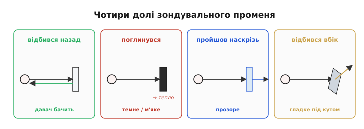
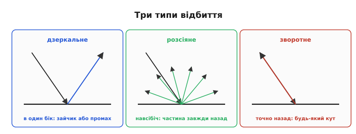
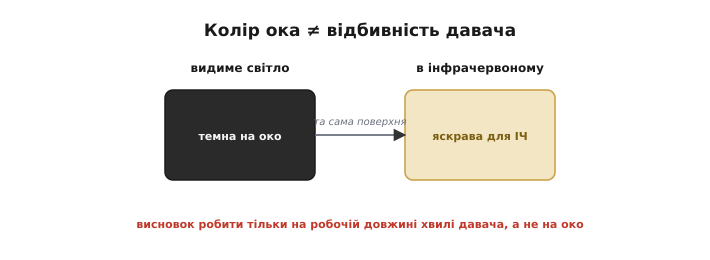
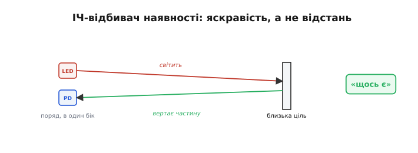
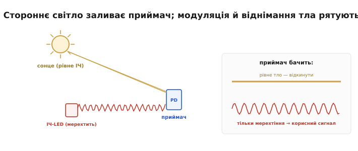
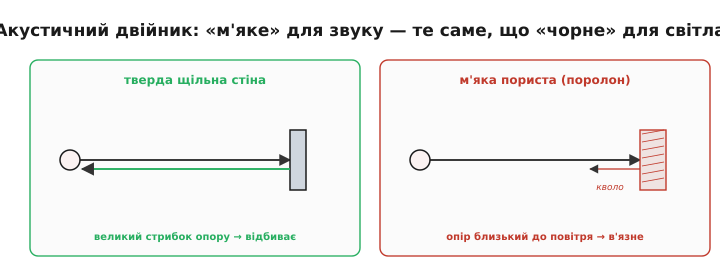
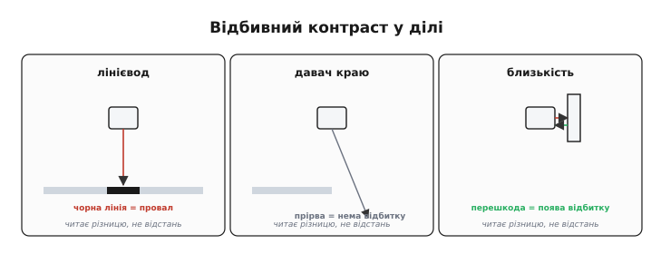

# Відбиття й поглинання IR

Усі способи [безконтактного виміру відстані](root:embedded/contactless-distance) мовчки спираються на одну умову: що зондувальна хвиля чи промінь **повернеться** до давача. Та повертається вона не завжди. Уся ця тема — про фізику, яка це вирішує: про відбиття, поглинання й пропускання, через які той самий далекомір блискуче бачить стіну й сліпне на склі, котові чи чорній тканині. А заразом — про найпростіший із оптичних давачів, інфрачервоний відбивач «є перешкода / нема», і про його заклятого ворога — стороннє світло. Знаючи цю фізику, ви наперед скажете, де будь-який далекомір збреше, ще до того, як його ввімкнете.

### Чотири долі зондувального променя

Коли зондувальний промінь (звук чи світло) досягає поверхні, з ним може статися чотири різні речі — і лише одна годує давач. Він може **відбитися назад** (частина енергії вертається до приймача — це й потрібно); **поглинутися** (енергія перетворюється на тепло в матеріалі — назад нічого); **пройти наскрізь** (прозора ціль пропускає промінь далі); або **відбитися вбік** (гладка поверхня під кутом шле промінь геть, повз приймач). Реальна ціль робить усе потроху — питання лише в тому, **скільки** повернулося саме до давача.


*Що стається із зондувальним променем. Відбився назад — давач бачить; поглинувся (темне, м'яке) — енергія втрачена; пройшов наскрізь (прозоре) — ціль невидима; відбився вбік (гладке під кутом) — промінь полетів повз приймач. Лише перший випадок дає вимір.*

Уся подальша тема — це розбір, **від чого** залежить, котра з чотирьох доль переважить: від гладкості поверхні, її матеріалу, кольору на потрібній довжині хвилі й кута нахилу.

За цим стоїть проста бухгалтерія енергії: усе, що прилетіло, **дорівнює** сумі відбитого, поглинутого й пропущеного — інших шляхів нема. Та для давача важлива не загальна частка відбитого, а лише та крихта, що вернулася **саме в його приймач**, у його малесенький тілесний кут. Тому навіть добре відбивна, але розсіювальна ціль шле назад лічені відсотки — решта розлітається в інші боки. А далекомір ще й мусить почути цю крихту на тлі шуму, тож «відбилося» й «давач побачив» — далеко не одне й те саме.

### Дзеркальне проти розсіяного відбиття

Найважливіше розрізнення — **як** саме поверхня відбиває. **Дзеркальне** (*specular*) відбиття дає гладка поверхня: промінь відбивається в один бік за правилом «кут падіння дорівнює куту відбивання». Якщо цей бік випадково дивиться назад на давач — буде яскравий зайчик; якщо ціль бодай трохи нахилена — увесь промінь летить **повз**, і давач не бачить нічого. **Розсіяне** (*diffuse*, ламбертове) відбиття дає шорстка матова поверхня: вона розкидає світло **навсібіч**, тож частина **завжди** вертається до давача, під яким би кутом ціль не стояла. Це найдружніший до давачів випадок. Є й третій, особливий — **зворотне** (*retro*) відбиття: спеціальні поверхні (кутові призми, «котяче око», дорожні знаки) вертають промінь точно туди, звідки він прийшов, за будь-якого кута.


*Три типи відбиття. Дзеркальне (гладке) — в один бік: або яскравий зайчик, або повний промах. Розсіяне (матове) — навсібіч, тож частина завжди вертається: найкраще для давачів. Зворотне (ретрорефлектор) — точно назад до джерела за будь-якого кута: ідеальна «кооперативна» ціль.*

> 🔧 **Навіщо це.** Давач любить **матові розсіювальні** поверхні й боїться дзеркал та полірованого металу. Гладка похила поверхня — найпідступніша: вона не поглинає й не пропускає, а просто відбиває промінь убік, і давач упевнено рапортує «нічого попереду», хоч стіна за півметра. Якщо ціль під вашим контролем — наклейте ретрорефлектор, і проблема зникне; якщо ні — закладайте, що блискуче й похиле буде невидимим.

Чисте дзеркало й чиста матовість — це крайнощі; реальні поверхні десь **між** ними. Глянсова фарба, лакована деревина, пластик дають і дзеркальний відблиск, і слабке розсіяння водночас: під «правильним» кутом — сліпучий зайчик, трохи повернув — лишається кволий розсіяний відгук. Для розсіяної складової діє правило косинуса: яскравість назад спадає, коли поверхня відхиляється від перпендикуляра до променя. Тому навіть матова стіна, поставлена **дуже косо**, повертає помітно менше, і далекомір бачить її гірше, ніж ту саму стіну в лоб, — а під надто гострим кутом може й зовсім проґавити.

### Поглинання й пропускання: коли ціль «зникає»

Дві інші долі променя роблять ціль **невидимою**. **Поглинання**: темні, чорні поверхні «з'їдають» світло й інфрачервоне, м'які пористі матеріали — звук; енергія йде в тепло, назад вертається крихта або нічого, і дальність падає в рази чи вимір зривається. **Пропускання**: прозора ціль пускає промінь наскрізь — скло для інфрачервоного, тонка плівка для ультразвуку — і давач «дивиться крізь неї», міряючи відстань до чогось **за** нею. Звідси класичні «привиди»: робот в'їжджає у скляні двері, бо для його ІЧ-давача їх просто немає, або проґавлює чорну сумку на підлозі, бо вона поглинула весь промінь.

Прозорі цілі підкидають і хитрішу пастку — **подвійне** відлуння. Тонке скло більшу частину променя пропускає, але дрібку **таки** відбиває від своєї поверхні; виходить слабкий ранній відгук від скла **і** сильніший пізній — від того, що за ним. Далекомір, налаштований брати «перше досить сильне» відлуння, легко вхопить не те: то «бачить» скло, то дивиться крізь нього — залежно від порога й кута. Тому прозорі й напівпрозорі перешкоди не просто невидимі, а ще й **непостійно** видимі, що для керування гірше за чесне «нічого».

### Колір для ока — не колір для давача

І найпідступніше непорозуміння: **відбивність для давача — не те саме, що колір для ока**. Інфрачервоне світло поводиться на матеріалах інакше за видиме, тож річ, **чорна на око**, може чудово відбивати ІЧ (багато чорних пластиків і фарб «світлі» в інфрачервоному), а біла на вигляд — навпаки, ІЧ поглинати. Тому міркування «вона чорна, давач її не побачить» **ненадійне**: судити треба на **тій довжині хвилі**, якою працює давач, а не на око.


*Колір ока ≠ відбивність давача. Та сама поверхня, темна у видимому світлі, буває яскравою в інфрачервоному (і навпаки). Тому передбачати, побачить її ІЧ-давач чи ні, можна лише дослідом на робочій довжині хвилі, а не за виглядом.*

Звідси проста, але незамінна порада: перш ніж покладатися на ІЧ-давач із новою ціллю, **перевірте її дослідом** — піднесіть і гляньте на сире число. Багато гірких сюрпризів (чорний матовий пластик, що чудово відбиває ІЧ, або «біла» поверхня, що його глитає) виявляються за секунди такої перевірки — і за години марних здогадів, якщо її пропустити. Камера телефону, до речі, часто бачить ближнє ІЧ як бліде фіолетове світіння, тож нею можна навіть **побачити очима**, чи світить ваш невидимий світлодіод і куди він дивиться.

### Найпростіший давач: інфрачервоний відбивач

З цієї фізики виростає найдешевший із оптичних давачів — **ІЧ-відбивач** наявності. Це інфрачервоний світлодіод і фотоприймач **поряд**, дивляться в один бік. Світлодіод світить; якщо попереду близька й відбивна перешкода, частина світла вертається на фотоприймач — і той каже «щось є». Це вимір не відстані, а **наявності/близькості** за **яскравістю** відбитого (той самий грубий [принцип яскравості](root:embedded/contactless-distance)): чим ближче й світліша ціль, тим сильніший відгук.


*Інфрачервоний відбивач наявності. Світлодіод і фотоприймач поряд; близька відбивна перешкода вертає частину світла — давач спрацьовує. Дешево й крихітно, але це «є/нема», а не відстань: яскравість плутає близьке темне з далеким світлим.*

Такий давач копійчаний і всюдисущий — у роботах-лінієводах, давачах краю столу, простих об'їзниках перешкод. Та його корінна вада прямо випливає з яскравості: він **плутає відстань із відбивністю**. Близька чорна перешкода й далека біла стіна можуть дати **однаковий** відгук, тож надійно сказати «як далеко» він не може — лише «щось близько є». Це давач присутності, а не далекомір, і користуватися ним треба саме так.

Виходів у нього два. **Цифровий**: компаратор порівнює відбиток із порогом і дає чисте «є/нема» — зручно для спрацювань (край, лінія). **Аналоговий**: сирий рівень відбитого, який читають АЦП як грубу «близькість» — більший сигнал, ближче. Сама геометрія «світлодіод і приймач поряд» теж обмежує дальність: щоб відбиток потрапив у приймач під боком, ціль має бути **близько** (сантиметри-десятки) — здалеку розсіяний промінь майже не вертається в його вузеньке поле зору. Тому ІЧ-відбивач — інструмент **упритул**, і це не недолік, а його чесна ніша.

### Заклятий ворог: стороннє світло

У всіх оптичних давачів спільний ворог — **стороннє інфрачервоне світло**. Сонце й лампи розжарювання **самі** сиплють ближнім інфрачервоним, заливаючи фотоприймач чужими фотонами: давач «бачить перешкоду» там, де її нема, або взагалі засліплюється. Боротьба з цим — пряме застосування фізики [шуму давача](topic:hw-sensing/drift-hysteresis-noise) і [синхронного детектування](topic:hw-sensing/triangulation):

- **Модуляція + синхронне детектування**: світлодіод не світить рівно, а **мерехтить** на відомій частоті; приймач зараховує лише ту частину сигналу, що мерехтить **у такт**, а рівне сонячне тло відкидає.
- **Світлофільтр**: пропускає лише вузьку смугу довжин хвиль навколо світлодіодової, гасячи решту.
- **Віднімання тла**: зміряти приймачем з вимкненим світлодіодом (саме тло), тоді з увімкненим (тло + сигнал) і **відняти** — лишиться чистий сигнал.


*Боротьба зі стороннім світлом. Рівне сонячне ІЧ-тло топить корисний сигнал. Мерехтливий світлодіод і синхронний приймач бачать лише власне «блимання»; віднімання виміру з вимкненим світлодіодом прибирає тло остаточно.*

**Приклад (віднімання тла).** Приймач з вимкненим світлодіодом показав 700 (це сонячне тло), а з увімкненим — 760. Чистий корисний сигнал:

```
сигнал = (тло + відбиток) − тло = 760 − 700 = 60
```

Шістдесят одиниць — це і є відбите **власне** світло, очищене від сонця. Без віднімання давач бачив би 760 і вирішив би, що перешкода близько, хоч насправді то світило сонце. Два виміри замість одного — і фантомна перешкода зникає. Як зібрати це в прошивці — і просте віднімання тла, і стійкіше синхронне детектування мерехтливим світлодіодом — з готовим C/C++ для мікроконтролера показано в [практичній вставці](topic:hw-sensing/reflection-absorption/proj-ambient-rejection.md).

> 🔧 **Навіщо це.** Ніколи не вірте сирому ІЧ-давачу за денного світла. Модуляція, фільтр і віднімання тла — не «покращення для точності», а **умова працездатності** надворі: без них перший же сонячний промінь зробить давач некерованим. Це той самий бій із [шумом і смугою](topic:hw-sensing/drift-hysteresis-noise), тільки шум тут — саме сонце.

Варто оцінити масштаб цього ворога: сонце сипле інфрачервоним так щедро, що його потік на приймачі буває **в рази більший** за власний світлодіод давача. Тому навіть модуляція має межу: якщо тло засвітило приймач **до насичення**, виділяти з нього кволе мерехтіння вже нема з чого — насичений приймач не бачить нічого понад стелю. Звідси й світлофільтр, і козирок-бленда, і [вибір довжини хвилі](topic:hw-sensing/tof-laser) в сонячному «провалі»: усе, щоб сонця на приймач потрапляло якомога менше **до** того, як почнеться розумне віднімання тла.

### Звук теж відбивається — за акустичним опором

У звуку та сама історія, лише інша фізика. Ультразвук відбивається там, де різко змінюється **акустичний опір** середовища. Тверда щільна поверхня (стіна, метал, скло) має акустичний опір, що сильно відрізняється від повітря, — тож відбиває звук добре. М'яка пориста (поролон, тканина, штори) ближча за опором до повітря й **поглинає** звук, як темне поглинає світло. Тому «м'яка ціль», невидима для [ультразвукового далекоміра](topic:hw-sensing/ultrasonic-tof-method), — це акустичний двійник «чорної цілі», невидимої для світла: різні явища, та сама роль.

Числа акустичного опору пояснюють і дивовижу медичного УЗД. Опір м'яких тканин тіла близький до опору води, тож на межах усередині тіла відбивається лише частка звуку — саме та, що малює зображення органів. Зате межа повітря–тіло — це **величезний** стрибок опору, на якому звук відбивається майже повністю; тому між давачем і шкірою мажуть гель — щоб **прибрати** прошарок повітря, інакше ультразвук просто не зайшов би в тіло. У повітряному далекомірі та сама фізика працює навпаки: він **користається** великим стрибком опору на твердій стіні, щоб дістати сильне відлуння, — і програє там, де опір цілі надто близький до повітряного.


*Акустичний двійник відбивності. Тверда щільна поверхня різко відрізняється акустичним опором від повітря — добре відбиває звук; м'яка пориста близька до повітря — поглинає його. «М'яке» для звуку — те саме, що «чорне» для світла.*

### Застосування: лінія, край, прірва

Найгарніше те, що з цієї фізики виростають дешеві й надійні **давачі контрасту**. **Лінієвод**: чорна лінія на світлій підлозі **поглинає** ІЧ, а підлога **відбиває**, тож робот тримається лінії, ведучи її за провалом відбиття під відповідним давачем. **Давач краю (прірви)**: ІЧ-відбивач дивиться **вниз**; є підлога — є відбиток, нема підлоги (край столу, сходинка) — **нема відбитку**, і робот спиняється перед прірвою. **Близькість**: є відбиток — щось поряд.


*Відбивний контраст у ділі. Лінієвод бачить чорну лінію як провал відбиття на світлій підлозі; давач краю — прірву як зникнення відбитку вниз; давач близькості — перешкоду як появу відбитку. Усі троє читають не відстань, а **різницю** у відбивності.*

> 🔧 **Навіщо це.** Ці давачі надійні саме тому, що читають **контраст**, а не абсолют: важлива не точна яскравість, а різниця «лінія проти підлоги» чи «підлога проти прірви». Тому їх легко **відкалібрувати під конкретну поверхню** — заміряти «світле» й «темне» на старті й узяти поріг посередині (пряме [калібрування](topic:hw-sensing/calibration)). Змінилося покриття — переобнулив, і працює далі.

Той самий відбивний принцип годує ще двох робочих конячок. [Оптичний енкодер](topic:hw-sensing/piezo-optical-semiconductor) читає чорно-білі (чи прорізані) смуги диска, що крутиться: відбиток то є, то нема — і за частотою імпульсів давач знає швидкість та кут. А **лінійка** з кількох ІЧ-відбивачів поперек траси робить лінієвода розумнішим: вона бачить не лише «лінія під мною / нема», а й **куди** лінія зсунулась, дозволяючи плавно тримати курс, а не сіпатись із боку в бік. Дешевий контраст відбиття, помножений на кілька давачів, дає напрочуд багато.

Отже, уся далекометрія стоїть на відбитті: знай відбивність своєї цілі **на робочій довжині хвилі**, бійся дзеркал, скла, чорного й м'якого, а зі стороннім світлом воюй модуляцією. Запам'ятавши лише ці чотири долі променя й кілька винятків, ви наперед передбачите більшість «дивних» провалів далекоміра, ще не вмикаючи його. А разом фізика повернення й способи виміру складають повний [бюджет похибок далекоміра](topic:hw-sensing/distance-errors) — перелік того, **як саме** показ відстані може збрехати, від м'яких цілей до температури й багатопроменевості.

---
