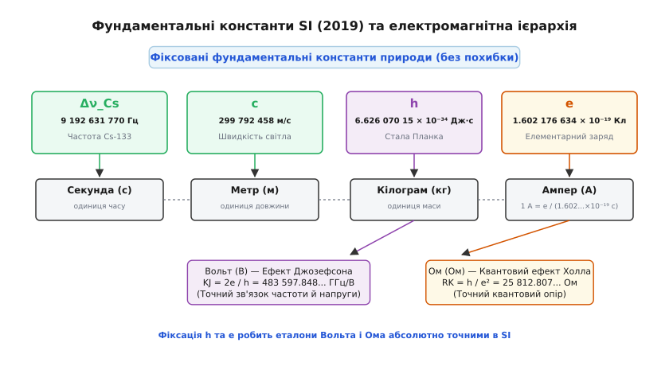
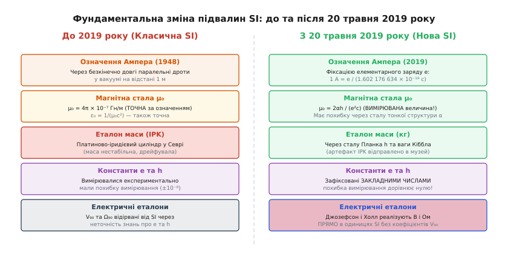
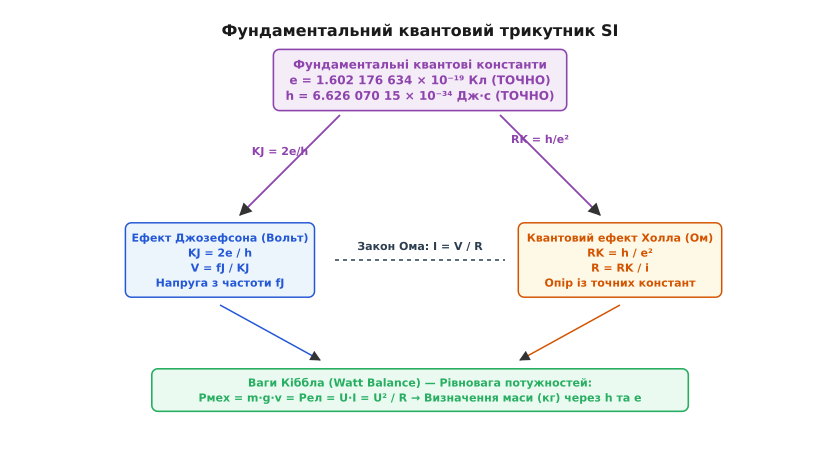

# Редефініція SI 2019

<preknowlist>
- [Елементарний заряд](root:ph-electromagnetism/elementary-charge) — найменша порція електричного заряду e.
- [Вольт](root:hw-sensing/volt) — одиниця електричного потенціалу та напруги.
- [Закон Ампера для двох провідників](root:ph-electromagnetism/ampere-force) — взаємодія паралельних струмів і старе означення ампера.
- [Квантовий ефект Холла](root:ph-condensed/quantum-hall-effect) — квантування опору RK = h/e².
</preknowlist>

До 20 травня 2019 року головна одиниця електричного струму — ампер — спиралася на гіпотетичний дослід із двома нескінченно довгими дротами у порожнечі, який фізично неможливо побудувати у жодній лабораторії світу. На практиці провідні метрологічні інститути світу (такі як NPL у Великій Британії чи NBS у США) змушені були будувати так звані струмові ваги Кельвіна або Рейлі. У цих приладах вимірювалася сила магнітної взаємодії між двома реальними співвісними мідними котушками. Сила взаємодії визначалася похідною взаємної індуктивності по вертикальному зміщенню котушки `F_z = I₁ · I₂ · (dM/dz)`. Обчислення `dM/dz` вимагало використання складних комбінацій еліптичних інтегралів першого й другого роду `K(k)` та `E(k)`. Щоб виміряти струм з точністю до мільйонної частки, потрібно було з найвищою точністю вимірювати радіуси котушок, крок витків, діаметри проводів, нерівномірність намотки, температурне розширення міді та місцеве прискорення вільного падіння `g`. Через такі макроскопічні обмеження точність вимірювання струмів і напруг у мікроелектроніці впиралася в механічні похибки виготовлення котушок, а еталон маси — платиновий циліндр у Севрі — втрачав атоми й дрейфував на десятки мікрограмів. Промисловість виготовляла транзистори розміром у кілька нанометрів із струмами витоку в пікоампери, але сама Міжнародна система одиниць (SI, від фр. *Système international d'unités*) залишалася прив'язаною до металевих артефактів XIX століття.

20 травня 2019 року набрав чинності найбільший перегляд світової системи мір з часів Французької революції. Сім базових одиниць SI переосмислили через зафіксовані точні значення фундаментальних констант природи. В електромагнетизмі ця реформа ліквідувала розрив між теоретичними одиницями та квантовими еталонами, перетворивши ампер, вольт і ом на абсолютно точні математичні вирази.

### Від металевих артефактів до закладених чисел Всесвіту

Щоб зрозуміти глибоку суть реформи 2019 року, треба розрізнити два протилежні шляхи побудови метрології (грец. *métron* — «міра» + *lógos* — «вчення»).

За класичного підходу метрологи спочатку обирають **матеріальний об'єкт** або **фізичний дослід**, оголошують його одиницею вимірювання, а вже потім вимірюють константи природи через цю одиницю. Наприклад, оголосивши масу платиново-іридієвого циліндра в Севрі «рівно 1 кілограмом», фізики змушені були експериментально вимірювати сталу Планка `h` чи елементарний заряд `e`. Щоразу, коли змінювалася техніка вимірювань, числове значення констант уточнювалося, а самі константи мали похибку вимірювання.

Матеріальні артефакти мають фундаментальну ваду: вони невічні й нестабільні. Поверхня металу адсорбує атоми газів з повітря, піддається мікроскопічному зношуванню під час очищення, а кристалічна ґратка сплаву зазнає релаксації внутрішніх напружень. Протягом століття Міжнародний прототип кілограма (IPK, виготовлений 1879 року компанією Johnson Matthey зі сплаву 90% платини й 10% іридію) та його шість офіційних копій дрейфували відносно один одного майже на `50 мікрограмів` (відносна зміна порядка `5 × 10⁻⁸`). Причиною цього була фізико-хімія поверхні: платино-іридієвий сплав навіть під трьома скляними ковпаками адсорбував вуглеводні, ртуть та пароподібну воду. Офіційна процедура очищення розчинниками (етером та етанолом) та обробка чистою парою за методикою Міжнародного бюро мір і ваг (BIPM) змивала з поверхні атоми платини, а механічне маніпулювання дерев'яними щипцями залишало мікроскопічні подряпини. Оскільки IPK за законом вважався ідеально точним, будь-яке забруднення або втрата атомів з його поверхні автоматично змінювали значення кілограма та маси електрона для всього Всесвіту.

За нового підходу порядок міркування розвертають на 180 градусів. **Фундаментальні константи природи оголошують точними закладеними числами без жодної похибки**, а одиниці вимірювання будують як похідні від цих констант. Фундаментальні константи Всесвіту — такі як швидкість світла `c`, стала Планка `h` чи заряд електрона `e` — володіють властивістю інваріантності: вони однакові в будь-якій точці простору, у будь-який момент часу й не залежать від інерціальної системи відліку чи гравітаційного потенціалу згідно з принципом еквівалентності Ейнштейна.

Прийняттю реформи передувала багаторічна робота робочої групи CODATA з фундаментальних констант (CODATA Task Group on Fundamental Constants). Метрологічні лабораторії світу провели серію узгоджувальних вимірювань методом найменших квадратів (LSA). Головною вимогою Генеральної конференції з мір і ваг (CGPM) була наявність щонайменше трьох незалежних експериментів із відносною похибкою вимірювання менше `5 × 10⁻⁸`, причому принаймні два з них повинні були спиратися на фундаментально різні фізичні принципи (ваги Кіббла та рентгенівська кристалографія кремнієвої сфери «Авогадро») і збігатися з відносною похибкою не гірше `2 × 10⁻⁸`. Тільки після виконання цієї жорсткої умови 16 листопада 2018 року Версальська конференція прийняла Резолюцію 1.

```
Класичний підхід:  Артефакт (IPK, дроти)  →  Одиниця SI  →  Виміряна константа (з похибкою)
Новий підхід:      Константа (h, e, c)    →  Одиниця SI  →  Практичний квантовий еталон
```

У новій SI сім фундаментальних констант зафіксовано набором точних раціональних чисел:
1. **Частота надтонкого розщеплення цезію-133** `Δν_Cs = 9 192 631 770 Гц` (задає секунду).
2. **Швидкість світла у вакуумі** `c = 299 792 458 м/с` (разом із секундою задає метр).
3. **Стала Планка** `h = 6.626 070 15 × 10⁻³⁴ Дж·с` (задає кілограм).
4. **Елементарний заряд** `e = 1.602 176 634 × 10⁻¹⁹ Кл` (задає ампер).
5. **Стала Больцмана** `k = 1.380 649 × 10⁻²³ Дж/К` (задає кельвін).
6. **Число Авогадро** `NA = 6.022 140 76 × 10²³ моль⁻¹` (задає моль).
7. **Світлова віддача монометричного випромінювання** `K_cd = 683 лм/Вт` (задає канделу).

[Історія Ампера та артефакти SI](root:hw-sensing/si-2019-redefinition/hist-ipk-and-ampere.md) показує, який складний шлях пройшла фізика від макроскопічних струмових ваг до підписання Версальської резолюції.

Завдяки зафіксованим константам будь-яка лабораторія на Землі (або на іншій планеті) може відтворити одиницю вимірювання самостійно, побудувавши квантовий прилад відповідного класу. Більше немає потреби везти вторинні еталони у Францію для звіряння з «головним гирею Всесвіту». Прилади квантової метрології не старіють, не іржавіють і не дрейфують з часом.

### Квантова хронометрія: Цезієва секунда як підмурок усіх мір

Усі сім базових одиниць SI-2019 так чи інакше спираються на секунду. Секунда є найбільш точно відтворюваною одиницею у сучасній фізиці.

Означення секунди спирається на квантовий перехід між електронними рівнями основного стану атома цезію-133 (`¹³³Cs`). Атом цезію має один валентний електрон на зовнішній оболонці `6S`. Внаслідок взаємодії між магнітним моментом ядра (`I = 7/2`) та орбітально-спіновим моментом валентного електрона (`S = 1/2`) основний стан `6S_{1/2}` розщеплюється на два подуровні надтонкої структури з повним кутовим моментом `F = 3` та `F = 4`.

Коли електрон переходить між цими подурівнями `(F=3, m_F=0) ↔ (F=4, m_F=0)`, він випромінює або поглинає фотон із суворо фіксованою резонансною частотою.

У цезієвому фонтанному годиннику (такому як NIST-F1 у США або SYRTE FO2 у Франції) хмару атомів цезію охолоджують у тривимірній магнітно-оптичній пастці (MOT) шістьма лазерними променями до мікрокельвінових температур за допомогою методів доплерівського та сизифового охолодження. Потім лазерним імпульсом атоми підкидають вгору на висоту близько одного метра. Хмара атомів піднімається крізь мікрохвильовий резонатор Рамсі, повертає під дією сили тяжіння й проходить резонатор удруге. Для усунення зовнішніх магнітних завад резонатор та дрейфову трубу захищають кількома шарами пермалоєвих магнітних екранів і створюють слабке однорідне поле напрямку `C-field`. На виході виникає інтерференційна картина Рамсі, що дозволяє настроїти частоту мікрохвильового генератора на вершину квантового резонансу з відносною похибкою `10⁻¹⁶`.

Під час обробки вимірювань метрологи вводять серію ретельних систематичних поправок:
1. **Зсув Зеемана другого порядку.** Зовнішнє магнітне поле `C-field` створює поправку частоти `Δν_Z = C_Z · B²`.
2. **Зсув чорнотільного випромінювання (BBR).** Електричне поле теплового випромінювання стінок вакуумної камери при температурі `T` деформує атомні орбіталі: `Δν_BBR ∝ T⁴`.
3. **Гравітаційне червоне зміщення Ейнштейна.** Відповідно до загальної теорії відносності, хід часу залежить від гравітаційного потенціалу. Зміна висоти на 1 сантиметр зміщує частоту годинника на `1.1 × 10⁻¹⁸`.

```
1 секунда = 9 192 631 770 періодів випромінювання цезію-133
```

Зв'язок між надтонкими мікрохвильовими частотами та оптичним діапазоном забезпечується оптичними гребінками частот (optical frequency comb), розробленими Теодором Геншем та Джоном Холлом. Оптична гребінка ділить частоту оптичного лазера на точну цілочисельну кількість кроків мікрохвильового цезієвого годинника, перетворюючи світлові коливання на зручні для вимірювання радіочастоти.

Сучасні атомні фонтани досягають відносної стабільності `10⁻¹⁶`. Сучасні оптичні ґратчасті годинники на атомах стронцію-87 (`⁸⁷Sr`) та ітербію-171 (`¹⁷¹Yb`), що працюють на оптичних частотах близько `500 ТГц`, досягають відносної точності `10⁻¹⁸` (одна секунда похибки за 30 мільярдів років). У таких приладах атоми утримуються у вузлах стоячої світлової хвилі (оптичній ґратці) на так званій «магічній довжині хвилі», де світловий зсув енергетичних рівнів основного й збудженого стану тотожно компенсується. Висока частота оптичного випромінювання забезпечує у сотні тисяч разів вищу добротність квантового резонансу `Q = ν / Δν`. Це готує ґрунт для майбутньої редефініції секунди на основі оптичних переходів близько 2030 року.

### Квантова перебудова електромагнетизму: Ампер, Вольт і Ом

Електромагнітна секція SI зазнала найглибшої трансформації. До 2019 року одиницею струму був ампер, а вольт і ом виводилися з нього через механічну роботу й закон Джоуля.


*Схема 7 фундаментальних констант SI (2019) та їхній прямоточний зв'язок з базовими й похідними електромагнітними одиницями.*

З 20 травня 2019 року **ампер означено безпосередньо через зафіксоване значення елементарного заряду e**:

```
1 А = e / (1.602 176 634 × 10⁻¹⁹ s)
```

Один ампер — це буквально потік, що відповідає рівно `1 / (1.602 176 634 × 10⁻¹⁹)` елементарним зарядам, які проходять через переріз провідника за одну секунду:

```
N_e ≈ 6.241 509 074 460 762 ... × 10¹⁸  електронів за секунду
```

Це число тепер є **абсолютно точним**. У ньому немає жодного знака похибки, бо саме воно за визначенням формує кулон і ампер.

#### Фізичний механізм квантування напруги та опору

До 2019 року високоточні вимірювання напруги та опору виконували за допомогою двох ефектів квантової фізики твердого тіла:

1. **Нестаціонарний ефект Джозефсона.** Коли на надпровідний переміжок (два надпровідники з ніобію або ніобій-нітриду, розділені диелектричним чи нормальним металевим бар'єром завтовшки в кілька нанометрів) діє мікрохвильове випромінювання частотою `f_J`, куперівські пари електронів тунелюють крізь бар'єр. Динаміка різниці фаз надпровідного конденсату описується рівнянням `dθ/dt = (2e/ħ)·V`. При синхронізації фази з зовнішньою мікрохвильовою частотою на вольт-амперній характеристиці виникають дискретні квантовані сходинки напруги (сходинки Шапіро):
   ```
   V_n = n · (f_J / K_J)
   ```
   де `K_J = 2e / h` — стала Джозефсона, а `n` — ціле число сходинки. Для створення промислових еталонів напруги 10 Вольт на одному кремнієвому чіпі інтегрують послідовну матрицю з понад `300 000` переходів Джозефсона (PJVS, *Programmable Josephson Voltage Standard*). На відміну від гістерезисних переходів типу SIS (надпровідник-ізолятор-надпровідник), у сучасних матрицях PJVS застосовують безгістерезисні переходи типу SINIS або SNS (із проміжним провідним прошарком). Це дозволяє програмувати сегменти переходів за допомогою цифрових ЦАП та синтезувати не лише постійну напругу, а й прецизійний змінний синусоїдальний сигнал для метрології змінного струму.

2. **Квантовий ефект Холла.** У двовимірному електронному газі (2DEG) на гетеропереході арсеніду ґалію `GaAs/AlGaAs` або у графіновому моношарі при низьких температурах (`T < 1.5 K`) і в сильних магнітних полях (`B > 10 T`) енергетичний спектр електронів квантується на рівні Ландау. Коли фермієвський рівень потрапляє в зазор між рівнями Ландау, розсіювання електронів назад стає забороненим завдяки формуванню одновимірних топологічно захищених крайових каналів Ландауера-Бюттікера. При цьому поздовжній опір прямує до нуля `R_xx → 0`, а хорлівський опір набуває квантованих плато:
   ```
   R_H = R_K / i
   ```
   де `R_K = h / e²` — стала фон Клітцинга, а `i` — ціле число плато. Для масштабування квантованого опору `R_K / 2 ≈ 12 906 Ом` до десяткових значень `1 Ом`, `100 Ом` чи `10 кОм` використовують кріогенні компаратори струму (CCC, *Cryogenic Current Comparator*), які порівнюють відношення витків за допомогою СКВІД-датчиків із похибкою менше `10⁻⁹`. Завдяки унікальній електронній структурі з конусами Дірака, графен дозволяє спостерігати квантовий ефект Холла навіть при температурі рідкого гелію (`4.2 K`) та слабших магнітних полях (`5 T`), що значно здешевлює первинні еталони опору.

Оскільки у класичній SI значення `e` та `h` визначалися з похибкою, у 1990 році метрологи змушені були ввести умовні значення `K_{J-90} = 483 597.9 ГГц/В` та `R_{K-90} = 25 812.807 Ом`. Лабораторії вимірювали напругу в «умовних вольтах 1990 року» (`V₉₀`) та опір в «умовних омах 1990 року» (`Ω₉₀`), які відрізнялися від офіційного вольта й ома SI на величину порядку `10⁻⁷`.

Завдяки одночасній фіксації `e` та `h` у реформі 2019 року обом квантовим сталим надано точні раціональні значення:

```
K_J = 2e / h ≈ 483 597.848 416 ... ГГц/В     [стала Джозефсона, ТОЧНО]
R_K = h / e² ≈ 25 812.807 459 ... Ом         [стала фон Клітцинга, ТОЧНО]
```

Тим самым умовні одиниці `V₉₀` та `Ω₉₀` було остаточно скасовано. Тепер будь-яка надпровідна матриця Джозефсона або холлівський графеновий місток генерують **офіційні вольти та оми SI безпосередньо**, без жодних переводних коефіцієнтів.

### Парадокс вакуумної проникності: чому μ₀ перестала бути точною

Більшість інженерів і студентів, які навчалися фізиці до 2019 року, твердо запам'ятали формулу:

```
μ₀ = 4π × 10⁻⁷ Гн/м ≈ 1.256 637 061 4... × 10⁻⁶ Гн/м
```

У старій SI це число було **точнісіньким за означенням**, бо саме через нього задавався ампер 1948 року (через силу взаємодії двох дротів). Відповідно, електрична стала `ε₀ = 1 / (μ₀ · c²)` і хвильовий опір вакууму `Z₀ = √(μ₀ / ε₀) = μ₀ · c` також були точними числами.

У реформі 2019 року виник цікавий фізичний парадокс: оскільки ампер зафіксували через `e`, магнітна стала `μ₀` **втратила статус точного числа й стала експериментально вимірюваною величиною**.


*Зсув парадигми: у класичній SI магнітна стала μ₀ була точним числом за означенням, а фундаментальні константи e та h мали похибку вимірювання; у новій SI константи e та h зафіксовано точно, а μ₀ стала вимірюваною величиною.*

Як показано в [математичному аналізі констант](root:hw-sensing/si-2019-redefinition/math-constants-relations.md), магнітна стала пов'язана зі сталою тонкої структури `α` (латинсько-грецьким безрозмірним коефіцієнтом зв'язку в квантовій електродинаміці):

```
μ₀ = (2 · α · h) / (e² · c) = 2 · α · R_K / c
```

Оскільки `h`, `e` та `c` — це зафіксовані точні числа, похибка вимірювання `μ₀` тепер повністю визначається похибкою експериментального вимірювання `α`:

```
u_r(μ₀) = u_r(α) ≈ 1.5 × 10⁻¹⁰
```

Хвильовий опір вакууму `Z₀ = √(μ₀ / ε₀) = 2 · α · R_K ≈ 376.730 313 668 Ом` тепер також залежить від експериментально вимірюваної сталої тонкої структури `α`. Це означає, що хвилеводні розрахунки радіочастотних антен та надвисокочастотних резонаторів прив'язані до квантових властивостей вакууму.

Експериментальне визначення `α` здійснюється двома незалежними високоточними методами:
1. **Вимірювання аномального магнітного моменту електрона `g-2`** у гармонійних пастках Пеннінга (група Джеральда Ґабріелсе в Гарварді). Науковці вимірюють циклотронну частоту руху електрона `ν_c` та частоту прецесії його спіну `ν_s`. Різниця цих частот визначає аномальний магнітний момент `a_e = (g-2)/2`. Зіставляючи виміряне значення `a_e` з теоретичними розрахунками фейнманівських діаграм 5-го порядку квантової електродинаміки (QED), обчислюють `α` з похибкою `2.1 × 10⁻¹⁰`.
2. **Атомна інтерферометрія віддача фотонів** на атомах рубідію-87 (`⁸⁷Rb`) або цезію-133 (`¹³³Cs`) у лабораторії LKB в Парижі та Берклі. Коли атом поглинає фотон лазера, він отримує імпульс віддачі `p = ħ · k`. Вимірювання швидкості віддачі за допомогою інтерферометрів Рамсі-Борде дозволяє визначити відношення `h / m_atom`, що через сталу Рідберга дає `α` з похибкою `1.5 × 10⁻¹⁰`.

Значення `μ₀` як і раніше дорівнює `4π × 10⁻⁷ Гн/м` з величезною точністю (різниця проявляється лише в дев'ятому знаку після коми: `μ₀ = 4π × 1.000 000 000 15 × 10⁻⁷ Гн/м`), але фундаментально це більше не константа за визначенням. Це властивість квантового вакууму, яку вимірюють в експериментах.

### Електромагнітний міст до маси: ваги Кіббла та проєкт «Авогадро»

Найдивовижнішим наслідком електромагнітної реформи стала ліквідація металевого еталона маси — кілограма.

Протягом 130 років кілограм визначався масою платиново-іридієвого циліндра IPK. Щоб замінити його, метрологи сконструювали **ваги Кіббла** (Watt balance), які порівнюють механічну потужність із електричною.


*Фундаментальний квантовий трикутник електромагнетизму: Джозефсон (напруга) та Холл (опір) у поєднанні з вагами Кіббла зв'язують механічну масу (кілограм) із точними квантовими числами e та h.*

Принцип роботи ваг Кіббла складається з двох послідовних фаз:

1. **Статична фаза (зважування):** Досліджувану масу `m` у полі тяжіння `g` урівноважують силою Лоренца, що діє на котушку зі струмом `I` у магнітному полі `B`:
   ```
   m · g = I · B · L
   ```
   де `L` — довжина дроту котушки. Виміряти векторний добуток `B · L` безпосередньо з високою точністю неможливо через геометричні нестабільності та просторову неоднорідність магнітного поля. Для юстування лазерних пучків використовують позиційно-чутливі фотодіоди (PSD), які усувають кутові похибки Аббе та паразитичні горизонтальні сили `F_x = m · g · sin(θ)`. Механічна підвіска виготовляється у вигляді пружних стрічкових шарнірів зі сплавів берилієвої бронзи для мінімізації термопружного гістерезису та зсуву точки качання. Контроль профілю магнітного поля в зазорі здійснюється серією вимірювань за допомогою датчиків ЯМР.

2. **Динамічний етап (калібрування):** Масу знімають, а котушку переміщують у тому самому магнітному полі `B` з постійною швидкістю `v`. За [законом електромагнітної індукції Фарадея](root:ph-electromagnetism/faraday-law-differential) на кінцях котушки виникає наведена ЕРС `V`:
   ```
   V = v · B · L   ⇒   B · L = V / v
   ```

Комбінуючи обидва рівняння, отримують рівняння потужнісного балансу:

```
m · g · v = V · I
```

Ліва частина — це механічна потужність (ват), права — електрична потужність (ват).

Якщо напругу `V` вимірюють через ефект Джозефсона (`V ∝ K_J ∝ e/h`), а струм `I` — через спад напруги на квантовому опорі Холла (`R ∝ R_K ∝ h/e²`), то під час перемноження елементарний заряд `e` повністю скорочується, а в рівнянні залишається **стала Планка h**:

```
m = [ (n₁ · n₂ · p · f₁ · f₂) / (4 · g · v) ] · h
```

Оскільки стала Планка `h` тепер зафіксована точно, ваги Кіббла дозволяють виміряти масу `m` у кілограмах суто через вимірювання частоти, швидкості та прискорення вільного падіння `g`.

#### Проєкт «Авогадро»: підтвердження через кремнієву сферу

Другим незалежним шляхом визначення сталої Планка став міжнародний проєкт «Авогадро». Науковці виготовили надчисті монокристалічні сфери з ізотопу кремнію-28 (`²⁸Si`, збагачення понад 99.998%). Процес очищення включав відцентрову сепарацію газу тетрафториду кремнію `²⁸SiF₄`, відновлення до силану та вирощування монокристала методом зонної плавки (Float-Zone). Сфери діаметром близько 93 міліметрів вишліфували з ухиленням від ідеальної кулі менше 20 нанометрів. За допомогою лазерної інтерферометрії вимірювали геометричний об'єм сфери `V`, а за допомогою рентгенівської дифрактометрії — розмір елементарної кристалічної комірки `a₀ = 543.099 пикометра`.

Кількість атомів у монокристалічному кремнієвому кубі обчислюється через відношення об'єму сфери до об'єму комірки `N = 8 · V_sphere / a₀³`. За допомогою мас-спектрометрії вторинних іонів вимірювали концентрації залишкових домішок кисню, вуглецю й водню для поправки сумарної маси з точністю до мікрограма. Це дозволило точно визначити сталу Авогадро `N_A`, яка зв'язана зі сталого Планка `h`. Збіг результатів ваг Кіббла та проєкту «Авогадро» з точністю до `2 × 10⁻⁸` відкрив шлях до скасування платинового еталона.

### Практичний вплив на інженерію та приладобудування

Для повсякденних інженерних розрахунків редефініція 2019 року минула непомітно: побутовий мультиметр чи осцилограф не змінили своїх показів. Проте для високоточної вимірювальної техніки та виготовлення мікросхем наслідки виявилися революційними.

Використання квантових еталонів відкрило шлях до створення компактних автономних калібраторів для аерокосмічних систем, космічних апаратів та глибоководних дослідницьких станцій, де прямого доступу до національних метрологічних центрів немає. Космічний зонд, оснащений локальною матрицею Джозефсона та оптичною частотною гребінкою, може проводити прецизійні вимірювання магнітних полів і мас у далекій сонячній системі з точністю національного інституту стандартизації. Крім того, прямоточне зважування електронів дозволяє точно калібрувати медичні іонізаційні камери для радіаційної онкології та променевої терапії, забезпечуючи простежуваність доз випромінювання в ґрей і зліверт без посередніх дрейфуючих джерел.

Така універсальність квантової метрології суттєво прискорила розвиток квантових обчислень та наноелектроніки, де контроль потенціалів на рівнях мікровольт і струмів на рівнях фемтоампер вимагає безумовної точності та відсутності дрейфу еталонів.

#### Ієрархічний ланцюг передачі розміру одиниць (Metrological Traceability)

У сучасній промисловості каскад калібрування будується за строгою метрологічною пірамідою:

1. **Первинні квантові стандарти (National Metrology Institutes — NIST, PTB, NPL, METAS).** Працюють безпосередньо з Джозефсонівськими матрицями, графеновими холлівськими містками й вагами Кіббла. Похибка відтворення: `< 10⁻⁹`.
2. **Вторинні лабораторні калібратори (Secondary Reference Standards).** Наприклад, мультиметри високого класу Keysight 3458A або калібрувальні джерела Fluke 5730A. Працюють на стабілітронних джерелах напруги й прецизійних термостатованих масивах резисторів. Калібруються від квантових еталонів раз на рік. Похибка: `10⁻⁶`.
3. **Промислові вимірювальні прилади (Workplace Instruments).** Робочі мультиметри, осцилографи, аналізатори спектра на фабриках виготовлення напівпровідників. Похибка: `10⁻⁴ ... 10⁻³`.

Завдяки реформі 2019 року верхній щабель піраміди став абсолютним: первинний рівень більше не має річного дрейфу.

Нижче наведено приклад обчислення еталонних квантових параметрів для первинного калібратора напруги та опору в лабораторних умовах.

:::tabs
```c
/* conversion_si2019.c — Обчислення квантових еталонних величин SI-2019 */
#include <stdio.h>

/* Фіксовані фундаментальні константи SI 2019 */
static const double CONST_H = 6.62607015e-34;  /* Дж·с (кг·м²/с) */
static const double CONST_E = 1.602176634e-19; /* Кл (А·с) */

/* Обчислення сталої Джозефсона KJ = 2e / h (Гц/В) */
double get_josephson_constant(void) {
    return (2.0 * CONST_E) / CONST_H;
}

/* Обчислення сталої фон Клітцинга RK = h / e² (Ом) */
double get_von_klitzing_constant(void) {
    return CONST_H / (CONST_E * CONST_E);
}

/* Напруга Джозефсона для n переходу на частоті f_hz */
double josephson_voltage(unsigned long long n, double f_hz) {
    double kj = get_josephson_constant();
    return (double)n * f_hz / kj;
}

/* Опір Холла для плато i */
double hall_resistance(unsigned long long plateau_i) {
    if (plateau_i == 0) return 0.0;
    double rk = get_von_klitzing_constant();
    return rk / (double)plateau_i;
}

int main(void) {
    double kj = get_josephson_constant();
    double rk = get_von_klitzing_constant();

    printf("KJ = %.9e Hz/V\n", kj);
    printf("RK = %.9f Ohm\n", rk);

    /* Приклад: 10 000 переходів Джозефсона на частоті 75 ГГц */
    double v_out = josephson_voltage(10000ULL, 75.0e9);
    printf("V_out (10k transitions @ 75 GHz) = %.10f V\n", v_out);

    /* Приклад: Квантовий опір Холла на плато i = 2 */
    double r_out = hall_resistance(2ULL);
    printf("R_out (Hall plateau i=2) = %.9f Ohm\n", r_out);

    return 0;
}
```
```cpp
// conversion_si2019.cpp — Ідіоматичний C++20 квантовий розрахунок SI-2019
#include <iostream>
#include <iomanip>
#include <numbers>

namespace si2019 {
    // Фіксовані фундаментальні константи як constexpr
    constexpr double h = 6.626'070'15e-34;  // Дж·с
    constexpr double e = 1.602'176'634e-19; // Кл

    // Квантові сталі
    constexpr double K_J = (2.0 * e) / h;    // Стала Джозефсона (Гц/В)
    constexpr double R_K = h / (e * e);      // Стала фон Клітцинга (Ом)

    // Квантова напруга Джозефсона
    [[nodiscard]] constexpr double josephson_voltage(std::size_t n_junctions, double frequency_hz) noexcept {
        return static_cast<double>(n_junctions) * frequency_hz / K_J;
    }

    // Квантовий опір Холла на плато i
    [[nodiscard]] constexpr double hall_resistance(std::size_t plateau_i) noexcept {
        return (plateau_i == 0) ? 0.0 : R_K / static_cast<double>(plateau_i);
    }
}

int main() {
    std::cout << std::setprecision(10);
    std::cout << "K_J (Josephson): " << si2019::K_J << " Hz/V\n";
    std::cout << "R_K (Klitzing):   " << si2019::R_K << " Ohm\n";

    constexpr auto v_standard = si2019::josephson_voltage(10'000, 75.0e9);
    constexpr auto r_standard = si2019::hall_resistance(2); // плато i = 2

    std::cout << "Еталонна напруга V: " << v_standard << " V\n";
    std::cout << "Еталонний опір R (i=2): " << r_standard << " Ohm\n";

    return 0;
}
```
:::

#### Одноелектронні транзистори та поштучний лік електронів

Оскільки ампер тепер задається через `e`, метрологічні інститути розробляють первинні **квантові джерела струму** на основі одноелектронних насосів (SET, *Single-Electron Transistor*). Принцип роботи такого приладу базується на явищі кулонівської блокади в нанорозмірній квантовій точці, де кулонівська енергія заряду одного електрона `E_C = e² / (2C_Σ)` (де `C_Σ` — сумарна ємність острівця) значно перевищує енергію теплових флуктуацій `k_B T`. Виготовляють такі прилади методом електронно-променевої літографії (EBL) з подвійним напиленням алюмінію та контрольованим окисленням для створення бар'єрів `Al/Al₂O₃/Al`. Спеціальні імпульсні генератори напруги затвора (SINIS turnstile) створюють прямокутні чи синусоїдальні тактові імпульси, що регулюють висоту потенціального бар'єра. Керуючи потенціалом затвора `V_g`, електрологи переносять крізь квантову точку рівно по одному электрону за один такт мікрохвильового сигналу частотою `f`:

```
I = e · f
```

При частоті тактування `f = 1 ГГц` такий насос генерує струм `I ≈ 160.217 663 4 пікоампера` з точністю, що визначається лише стабільністю атомного годинника. Об'єднуючи паралельно кілька квантових точок, створюють первинні стандарти наноамперних струмів для напівпровідникових електрометрів, вимірювачів іонізуючого випромінювання та датчиків космічних апаратів.

#### Фундаментальні фізичні обмеження вимірювань

Навіть після прийняття ідеальних квантових еталонів реальні інженерні вимірювання стикаються з межами, накладеними самою природою матерії:

1. **Тепловий шум Джонсона-Найквіста.** Будь-який резистор опором `R` при абсолютній температурі `T` флуктуює за рахунок хаотичного теплового руху електронів. Спектральна густина флуктуацій напруги задається формулою:
   ```
   S_V = 4 · k · T · R
   ```
   де `k` — зафіксована стала Больцмана. Для опору `10 кОм` при кімнатній температурі `300 K` тепловий шум у смузі `1 Гц` становить близько `12.8 нВ/√Гц`. Це означає, що для досягнення квантової точності `10⁻⁸` еталонні резистори змушені охолоджувати в кріостатах або усереднювати сигнал протягом багатьох годин.

2. **Дробовий шум (Shot Noise) дискретності заряду.** Оскільки струм `I` складається з дискретних електронів із зарядом `e`, флуктуації кількості носіїв створюють дробовий шум зі спектральною густиною струму:
   ```
   S_I = 2 · e · I
   ```
   При вимірюванні надмалих струмів у `1 пікоампер` дробовий шум становить `0.56 фемтоампера/√Гц`, що формує абсолютну межу швидкості вимірювання малого струму. Для подолання цих флуктуацій у фундаментальній метрології розробляють методи квантових неруйнівних вимірювань (QND, *Quantum Non-Demolition*), які стискають квантовий шум у потрібній фазовій квадратурі.

### Єдність фізичних законів

Редефініція SI 2019 року завершила багатовіковий розвиток метрології. Видалення матеріальних артефактів об'єднало класичну електродинаміку, квантову механіку, спеціальну теорію відносності та термодинаміку в єдину струнку систему.

Система SI більше не залежить від планети Земля, її сили тяжіння чи рукотворних предметів. Вимірювальні одиниці струму, напруги, опору та маси отримали фундаментальну міцність: вони висічені в самій математичній тканині фізичних законів Всесвіту.
