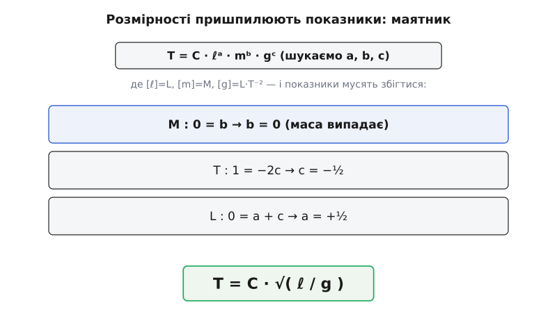
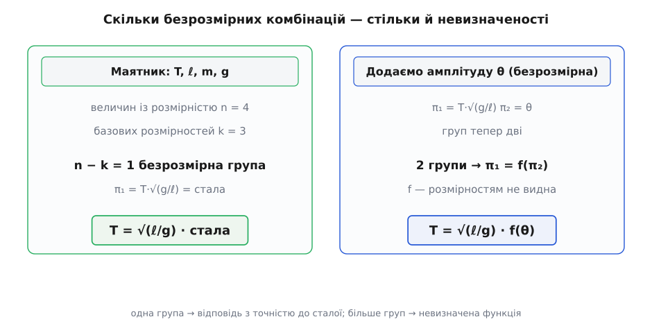

# 🧮 Аналіз розмірностей: алгебра, що ловить хиби й угадує формули

«3.5 метра» — це число і одиниця. Але сховаймо на мить, у чому саме міряли: у метрах, футах чи світлових роках. Щось важливе лишиться навіть тоді — це **щось є довжина**. Не «метр», не «фут», а сам **рід** величини, спільний для всіх мірок довжини на світі. Оцей рід, очищений від конкретної одиниці, звуть **розмірністю** (англ. *dimension* — вимір, протяжність). Розмірність — це відповідь на запитання «що це взагалі за величина?», ще до того, як ми домовилися, чим її міряти.

Крок нагору по щаблях узагальнення тут простий, але вирішальний. Одиниця — конкретна мірка (метр). Розмірність — рід, до якого мірка належить (довжина). Одна розмірність, багато одиниць: довжину можна міряти в метрах, дюймах, парсеках — розмірність у всіх одна, L. І виявляється, що з цими родами можна робити те саме, що з числами, — множити, ділити, підносити до степеня, — за власними, дуже жорсткими правилами. Виходить окрема **алгебра над величинами**, і саме вона ловить хиби у формулах ще до підстановки чисел, а часом навіть угадує вигляд формули, якої ми не виводили.

## Сім родів і квадратні дужки

Домовмося про запис: квадратні дужки читаємо як «розмірність того, що всередині». `[v]` — розмірність швидкості, `[E]` — розмірність енергії. Уся фізика стоїть на семи незалежних родах величин, і кожному дали однолітерний символ:

```
L — довжина            I — сила електричного струму
M — маса               Θ — термодинамічна температура
T — час                N — кількість речовини
                       J — сила світла
```

Це **не одиниці** (не метр і не кілограм), а самі роди; одиниця — то вже вибір мірки всередині роду. Сім символів — це сім «літер», з яких складаються «слова» всієї метрології. І будь-яка фізична величина, хоч би яка складна, має розмірність вигляду **добутку степенів** цих семи:

```
[x] = Lᵃ · Mᵇ · Tᶜ · Iᵈ · Θᵉ · Nᶠ · Jᵍ
```

Уся розмірність — це набір показників `(a, b, c, d, e, f, g)`. Більше ні від чого вона не залежить. Швидкість — це шлях, поділений на час, тож `[v] = L·T⁻¹`: показник довжини +1, показник часу −1, решта нулі. Скажеш «L у першому степені, T у мінус першому» — і повністю задав рід «швидкість», не згадавши ні метра, ні секунди.

Придивіться, що ці показники поводяться як **вектор**. Кожній величині відповідає точка в семивимірному просторі показників; перемножити дві величини — додати їхні вектори показників; поділити — відняти. Це не метафора, а буквальна будова: розмірності утворюють векторний простір над раціональними числами (показники, як побачимо, бувають і дробові). Оцей простий факт — що вся алгебра розмірностей зводиться до додавання й віднімання цілочислових наборів — і робить її такою потужною.

## Правила алгебри — і одне, що дає їй зуби

Правил небагато, і вони прямо випливають із того, що розмірність — добуток степенів.

```
множення:      [x·y]  = [x]·[y]        показники додаються
ділення:       [x/y]  = [x]/[y]        показники віднімаються
степінь:       [xⁿ]   = [x]ⁿ           показники множаться на n
```

Приклад: кінетична енергія має вигляд `m·v²`. Її розмірність — `[m]·[v]² = M·(L·T⁻¹)² = M·L²·T⁻²`. Жодних одиниць, суто робота з показниками: квадрат подвоїв показники швидкості, множення на масу додало M.

А тепер правило, яке відрізняє цю алгебру від звичайної арифметики й дає їй усю силу:

```
додавання:     [x + y]  визначене ЛИШЕ якщо [x] = [y],
               і тоді  [x + y] = [x]
```

Множити можна що завгодно на що завгодно — метри на секунди, кілограми на ампери, вийде новий, цілком законний рід. А **додавати** можна тільки однорідне до однорідного. «Три метри плюс дві секунди» — не мала величина й не велика, а **безглуздя**: немає такого роду, до якого належала б ця сума. Стара приказка «не додавай яблука до апельсинів» тут стає точним математичним законом. Саме ця заборона й перетворює аналіз розмірностей із бухгалтерії на інструмент: рівняння, у якому щось додається, змушене тримати всі доданки одного роду — інакше воно нічого не означає.

Окремий випадок — коли всі показники нулі: `[x] = 1`. Такі величини звуть **безрозмірними** — це чисті числа, від вибору одиниць не залежні. Кут, відношення двох довжин, лічба штук, ККД. І тут ховається тонкий, але глибокий наслідок, вартий уваги: **аргумент будь-якої «неалгебричної» функції — експоненти, логарифма, синуса — мусить бути безрозмірним**. Чому? Візьмімо експоненту. Її означують нескінченним рядом (кожну таку функцію [розкладають на суму степенів аргументу](topic:math-analysis/taylor-series) — eˣ = 1 + x + x²/2 + x³/6 + …):

```
eˣ = 1 + x + x²/2 + x³/6 + …
```

Праворуч додаються `1`, `x`, `x²`, `x³`… За щойно введеним законом додавати можна лише однорідне. Але `x` і `x²` мають однакову розмірність тільки в одному-єдиному разі — коли `[x] = 1`, бо тоді й `x`, і `x²`, і всі вищі степені однаково безрозмірні. Якби `x` був часом, то `x²` був би часом у квадраті, і сума `x + x²` порушила б заборону. Отже, побачивши в формулі `e^(−t/τ)`, ви **напевно** знаєте, не питаючи автора: `t/τ` безрозмірне, а отже `τ` — час. Так само в `sin(ωt)` добуток `ωt` мусить бути безрозмірним, звідки `ω` — обернений час, частота. Алгебра розмірностей сама диктує, що куди підставляти.

Зберімо для дальшого кілька механічних розмірностей — усі вони збудовані з трьох родів M, L, T:

```
швидкість   = шлях / час              [v] = L·T⁻¹
прискорення = швидкість / час         [a] = L·T⁻²
сила        = маса · прискорення      [F] = M·L·T⁻²
енергія     = сила · шлях             [E] = M·L²·T⁻²
тиск        = сила / площа            [p] = M·L⁻¹·T⁻²
```

Розмірність сили тут не з повітря: вона прямо з [другого закону Ньютона](topic:ph-mechanics/newtons-second-law) — сила дорівнює масі, помноженій на прискорення (F = m·a), — тож `[F] = M·(L·T⁻²) = M·L·T⁻²`. Кожен рядок — не означення, яке треба запам'ятати, а наслідок того, як величина будується з простіших.

## Перше застосування: безкоштовна перевірка рівнянь

З правила додавання випливає закон, який 1822 року в «Аналітичній теорії тепла» чітко сформулював французький математик Жозеф Фур'є, — **принцип розмірної однорідності**: у будь-якому осмисленому фізичному рівнянні кожен доданок має однакову розмірність, і обидві частини рівні за розмірністю. Інакше рівняння додавало б різнорідне, а це, як ми бачили, порожній звук.

Звідси — найдешевша перевірка в усій фізиці. Вивели ви формулу чи знайшли її в довіднику — перш ніж підставляти числа, звірте розмірності. Візьмімо рівняння рівноприскореного руху:

```
Перевірка:  s = v₀·t + ½·a·t²

    [s]       = L
    [v₀·t]    = (L·T⁻¹)·T          = L        ✓
    [½·a·t²]  = (L·T⁻²)·T²         = L        ✓

Усі три доданки — довжина. Рівняння розмірно однорідне.
```

Зверніть увагу на `½`: воно безрозмірне, і перевірка його просто **не бачить** — множник ½ на розмірність не впливає. Це важлива риса методу, до якої ще повернемося.

Тепер подивімося, як гейт ловить помилку. Уявімо, що хтось пригадав кінетичну енергію як `½·m·v` — забув квадрат:

```
    [½·m·v]  = M·(L·T⁻¹)          = M·L·T⁻¹
    [E]      = M·L²·T⁻²           (енергія)

    M·L·T⁻¹  ≠  M·L²·T⁻²   — не збігається → формула хибна.

Правильне E = ½·m·v²:
    [½·m·v²] = M·(L·T⁻¹)²         = M·L²·T⁻²   ✓
```

Одного погляду на показники досить, щоб відкинути хибну формулу, — не розв'язуючи жодного рівняння, не знаючи навіть, звідки та формула взялася.

Але будьмо чесні щодо меж методу — тут ховається його справжня природа. Розмірна перевірка **необхідна, та не достатня**. Вона впіймала пропущений квадрат, бо той змінив показники. Але забутий безрозмірний множник — ½ замість 1, загублене 2π — прослизне повз неї непоміченим, адже безрозмірне на показники не впливає. Тобто гейт уміє сказати «це напевно хибне» або «це, можливо, правильне» — і ніколи «це напевно правильне». Асиметрія на нашу користь: перевірка дешева, а відсіює вона саме грубі структурні помилки, яких у розрахунках найбільше. Розмірно хибна формула хибна **завжди**; розмірно правильна — ще під питанням, але вже пройшла найдешевший фільтр.

> 🔧 **Навіщо це.** Звірка розмірностей — перше, що варто робити з кожною формулою, перш ніж довіряти їй числа: власною, вичитаною зі статті чи підказаною бібліотекою. У живих обчисленнях, де величини тягнуть за собою одиниці — швидкість у м/с, тиск у паскалях, — це ловить сплутані множники, перевернуті частки й забуті степені за секунди, тоді як пошук тієї ж помилки в готовому числі коштує годин. Половина «загадкових» багів у інженерних розрахунках — це насправді розмірна невідповідність, яку ніхто не звірив.

## Друге застосування: угадати формулу з самих розмірностей

Тепер сміливіший хід. Якщо величина може залежати лише від кількох інших, то розмірності часто **самі** визначають вигляд формули — з точністю до безрозмірного числа, яке доводиться шукати окремо. Метод простий: припускаємо, що шукана величина є добутком невідомих степенів тих, від яких вона може залежати, і вимагаємо, щоб розмірності зійшлися. Заборона додавати різнорідне лишає, як правило, єдиний спосіб скласти показники — і формула виринає майже сама.

**Період маятника.** Класика жанру. Запитаймо: від чого залежить період T (час одного гойдання) простого маятника? Здоровий глузд підказує кандидатів: довжина підвісу ℓ, маса тягарця m, сила тяжіння g. Пишемо найзагальніший добуток степенів і дивимося, що вимагають розмірності:

```
    T = C · ℓᵃ · mᵇ · gᶜ         (C — безрозмірне число)

Підставляємо розмірність кожної величини:
    [T] = T
    [ℓ] = L
    [m] = M
    [g] = L·T⁻²        (прискорення)

    T¹ = Lᵃ · Mᵇ · (L·T⁻²)ᶜ = Mᵇ · L^(a+c) · T^(−2c)

Прирівнюємо показники при кожній розмірності — ліворуч і праворуч:
    M :  0 = b          →   b = 0        (маса випадає!)
    T :  1 = −2c        →   c = −½
    L :  0 = a + c      →   a = +½

Отже:
    T = C · ℓ^½ · g^(−½) = C · √(ℓ / g)
```

Спинімося й оцінімо, що щойно сталося. Ми **не розв'язували жодного диференціального рівняння руху** — а дістали, що період пропорційний кореню з довжини, поділеної на тяжіння. Ба більше: показник маси вийшов нулем, тобто **маса тягарця на період не впливає** зовсім. Це не припущення й не наближення — це справжнє фізичне передбачення, що випало з чистої бухгалтерії показників. Важкий тягарець і легкий на однаковому підвісі гойдаються з однаковим періодом. Саме такий результат дає й повна теорія — недарма маятниковий годинник іде однаково, чи повний його маятник свинцю, чи ні.


*Три роди — M, L, T — дають три рівняння на показники; вони визначають a, b, c однозначно. Показник маси виходить нулем сам собою: маятник «не відчуває» маси. Розмірності лишають єдиний спосіб скласти час — корінь із ℓ/g.*

Чого метод **не** дав — безрозмірної сталої C. Насправді C = 2π, і це число з розмірностей не витягнеш ніяк: воно з геометрії малих коливань, [де маятник поводиться як гармонічний осцилятор](topic:ph-waves/harmonic-oscillator) і множник 2π приходить із періоду синуса. Розмірності дають скелет закону — форму залежності; плоть — конкретне число — треба заробити повним розв'язком.

І ще одна межа, дуже показова. Ми взяли кандидатами ℓ, m, g — але забули **кут розмаху** θ. А він безрозмірний (відношення дуги до радіуса). Тому метод його просто **не бачить**: до відповіді можна безкарно домножити будь-яку функцію від θ, і розмірності від цього не зміняться. Насправді C і є не константою, а C(θ): при великих розмахах період помітно росте з амплітудою, і саме цієї залежності аналіз розмірностей угледіти неспроможний. Запам'ятаймо це — за мить воно складеться в загальну картину.

**Швидкість хвилі на струні.** Той самий прийом. Хвиля біжить натягнутою струною; від чого залежить її швидкість v? Розумні кандидати — натяг F (сила, що тримає струну) і погонна маса μ (маса на одиницю довжини, `[μ] = M·L⁻¹`):

```
    v = C · Fᵃ · μᵇ

    [v] = L·T⁻¹
    [F] = M·L·T⁻²        (сила)
    [μ] = M·L⁻¹

    L·T⁻¹ = (M·L·T⁻²)ᵃ · (M·L⁻¹)ᵇ = M^(a+b) · L^(a−b) · T^(−2a)

    M :  0 = a + b
    T : −1 = −2a        →   a = +½
    L :  1 = a − b      →   b = a − 1 = −½

    v = C · √(F / μ)        (точне значення C = 1)
```

Знову форму пришпилено намертво: тугіше натягни (більше F) — хвиля швидша; важча струна (більше μ) — повільніша, і саме як квадратні корені. Тут навіть стала виявилася рівною одиниці, тож розмірності дали формулу цілком.

**Час падіння.** І контрольний приклад, де знову випадає маса. Скільки падає тіло з висоти h під тяжінням g? Перевірмо заразом і масу m, щоб побачити, як метод сам її відкидає:

```
    t = C · hᵃ · gᵇ · mᶜ

    [t] = T,   [h] = L,   [g] = L·T⁻²,   [m] = M

    T = Lᵃ · (L·T⁻²)ᵇ · Mᶜ = Mᶜ · L^(a+b) · T^(−2b)

    M :  0 = c          →   c = 0        (маса знову випадає)
    T :  1 = −2b        →   b = −½
    L :  0 = a + b      →   a = +½

    t = C · √(h / g)       (точна кінематика дає C = √2)
```

Маса тягарця не впливає й на час падіння — важке й легке падають однаково, той самий висновок, який колись доводили, скидаючи тіла з вежі. [Точний закон вільного падіння](topic:ph-mechanics/free-fall) (h = ½·g·t²) дає C = √2; форму ж — корінь із h/g, незалежність від маси — ми здобули з самих розмірностей, без жодної механіки.

## Чому це працює — і коли перестає: теорема π

Спитаймо тепер по-дорослому: **коли** аналіз розмірностей дає відповідь, а коли лишає лише невизначену функцію, як із амплітудою маятника? Відповідь ховається в тому, що ми весь час, самі не називаючи, робили: розв'язували лінійну систему на показники.

Погляньмо на маятниковий приклад як на алгебру. Кожна величина вносить стовпчик показників при родах M, L, T. Безрозмірна комбінація — це такий набір степенів усіх величин, що **обнуляє кожен рід одразу**. Іншими словами, це вектор у **[ядрі](topic:math-algebra/null-space)** матриці показників — у просторі розв'язків однорідної системи, яка кожну розмірність зводить до нуля. А розмірність цього ядра лінійна алгебра рахує однією теоремою про ранг: якщо величин `n`, а незалежних родів серед них `k`, то незалежних безрозмірних комбінацій рівно `n − k`.

Це і є **теорема Букінгема π**: співвідношення між `n` величинами, збудованими з `k` розмірностей, зводиться до співвідношення між `(n − k)` безрозмірними групами (їх позначають літерою π). Назва й символ π — від американця Едгара Букінгема, який 1914 року в Національному бюро стандартів дав методові чіткий вигляд; та честь тут спільна: формально теорему вивів раніше француз Еме Ваші (1892), а незалежно від нього — Дмитро Рябушинський і Александр Федерман (1911). [Повне доведення й техніку добору π-груп](topic:math-numeric/buckingham-pi-theorem) розбирає окрема математична стаття; нам зараз важлива сама лічба.

Прочитаймо цією лічбою обидва випадки маятника — і туман розсіється.

```
Маятник без амплітуди:
    величини з розмірністю:  T, ℓ, m, g   →  n = 4
    базові розмірності:      M, L, T      →  k = 3
    n − k = 1  безрозмірна група:  π₁ = T·√(g/ℓ)

    Теорема: π₁ = стала  ⟹  T = √(ℓ/g) · стала
    ← одна група, тож відповідь з точністю до числа. Саме тому вийшло чисто.
```

А тепер додаймо амплітуду θ — вона вже безрозмірна, тобто сама собі окрема π-група:

```
З амплітудою θ:
    π₁ = T·√(g/ℓ),   π₂ = θ   →  тепер груп ДВІ
    Теорема: π₁ = f(π₂)  ⟹  T = √(ℓ/g) · f(θ)
    ← дві групи, тож замість сталої — невизначена функція f(θ).
```

Ось воно, все разом. Кількість безрозмірних комбінацій — це точно міра того, скільки метод лишає невизначеним. Одна група понад шукану величину — відповідь з точністю до **сталої** (найкращий випадок, як маятник чи струна). Дві й більше — відповідь із точністю до **функції**, якої розмірності визначити не можуть, і та функція `f(θ)` — це рівно амплітудна залежність, невидима для показників. Не метод «слабший» у другому випадку — просто фізики в задачі об'єктивно більше, ніж уміщає сама бухгалтерія розмірностей.


*Лічба Букінгема: від числа величин відняти число незалежних розмірностей — стільки й безрозмірних груп. Одна група → стала; кожна зайва безрозмірна величина (як кут θ) додає групу й перетворює сталу на функцію, яку доводиться шукати поза розмірностями.*

## Що метод уміє насправді: енергія вибуху з фотографії

Аби відчути, наскільки далеко тягнеться цей простий важіль, — один реальний випадок. Точковий вибух вивільняє енергію E в повітря густиною ρ; ударна сфера роздувається радіусом R за час t. Припустімо, що R залежить лише від E, ρ і t. Тоді:

```
    R = C · Eᵃ · ρᵇ · tᶜ

    [R] = L
    [E] = M·L²·T⁻²        (енергія)
    [ρ] = M·L⁻³           (маса на об'єм)
    [t] = T

    L = M^(a+b) · L^(2a−3b) · T^(−2a+c)

    M :  0 = a + b
    L :  1 = 2a − 3b
    T :  0 = −2a + c

    b = −a;  1 = 2a − 3(−a) = 5a  →  a = 1/5,  b = −1/5,  c = 2/5

    R = C · (E·t² / ρ)^(1/5)      ⟺      E = (1/C⁵) · ρ · R⁵ / t²
```

Ця залежність `R ∝ (E·t²/ρ)^(1/5)` — та сама, що незалежно вивели під час війни британець Джеффрі Тейлор, угорсько-американський математик Джон фон Нейман і радянський механік Леонід Сєдов. А далі Тейлор зробив те, від чого захоплює подих: узявши розсекречені кадри першого ядерного випробування, де видно радіус вогняної кулі в різні миті, він відклав R і t, підставив у формулу (стала C виявилася близькою до одиниці) — і дістав енергію вибуху близько **двадцяти кілотонів** тротилу. Тоді ще засекречене число — з лінійки, секундоміра й показників розмірностей. Жодного диференціального рівняння: сам скелет закону, здобутий бухгалтерією семи родів, ніс у собі відповідь.

Отут і видно природу всієї цієї алгебри. Вона стоїть на виборі кількох незалежних родів величин — тих самих базових, з яких збудовано всю систему одиниць: сім розмірностей L, M, T, I, Θ, N, J — це сім «твірних» усього простору. Коли одиниці підібрано узгоджено, бухгалтерія розмірностей і бухгалтерія одиниць — та сама дія, без жодних перевідних множників, що заплутують рахунок. А єдина сліпа пляма методу — безрозмірні числа — виявляється не вадою, а вказівкою: саме там, у числі Рейнольдса, у сталій тонкої структури, у куті розмаху маятника, і ховається найтонша фізика, яку розмірностям не видно й яку ще належить здобути повним розв'язком. Розмірності дають кістяк закону задарма; м'ясо доводиться заробляти.
