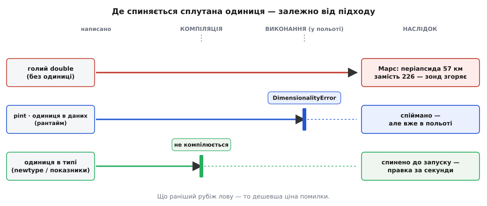

# ⚙️ Одиниця в самому типі: компілятор як метролог

23 вересня 1999 року міжпланетна станція Mars Climate Orbiter підійшла до Марса — і зникла. Замість вийти на орбіту з найнижчою точкою (періапсидою) близько 226 кілометрів над поверхнею, вона пірнула до якихось 57 кілометрів, глибоко під межу ≈80 км, яку апарат був здатен пережити, — і згоріла в атмосфері. Місія за 327.6 мільйона доларів загинула не від складної фізики й не від зламаного заліза. Її вбило одне число без правильної одиниці. Розберімо цю катастрофу до кінця, а тоді збудуймо на її уроці програму, у якій **такий самий недогляд не проходить далі компіляції** — не доживає навіть до запуску, не те що до Марса.

## Задача: число правильне, одиниця — ні

У станції всередині крутилися важкі маховики-гіродини; щоб скидати з них накопичений обертовий момент, апарат раз у раз пускав короткі поштовхи маленьких двигунів (маневр десатурації, angular momentum desaturation). Кожен такий поштовх трішки штовхав і саму станцію, збиваючи її з курсу, тож наземна навігація мусила ці поштовхи враховувати. Наземна програма підсумовувала їхній сукупний **імпульс** — добуток сили на час, тобто зміну кількості руху — і передавала число навігаційному розрахунку, який підправляв прицілювання на Марс.

Ось де розчахнулася прірва. Наземна програма (її писав підрядник Lockheed Martin) видавала імпульс у **фунт-силах на секунду** (lbf·s) — усупереч письмовій специфікації інтерфейсу, що вимагала одиниць СІ. Навігаційний розрахунок у Лабораторії реактивного руху читав ці числа як **ньютон-секунди** (N·s), нічого не підозрюючи. А фунт-сила майже вп'ятеро більша за ньютон:

```
1 lbf = 4.448222 Н

Наземна програма звела імпульс усіх увімкнень:  J = 1.85 lbf·s   (число умовне)
справжній імпульс у СІ:  1.85 · 4.448222 = 8.23 Н·с
навігація прочитала «1.85» як Н·с  →  недооцінила поштовх у 4.45 раза
```

Помножте цю недооцінку на сотні поштовхів за дев'ять місяців перельоту — і обчислена траєкторія тихо відповзе від справжньої на тисячі кілометрів. Станція йшла до Марса, певна, що цілиться в 226 км, а насправді летіла в 57. Що тут по-справжньому підступне: **програма ні разу не збрутала**. Немає ділення на нуль, немає виходу за межі масиву, немає жодного винятку. Кожен рядок відпрацював бездоганно, число `1.85` спокійно поїхало з однієї підсистеми в іншу — бо для комп'ютера це було просто число з рухомою комою, [гладке 64-бітне значення](root:hw-arch/floating-point) без жодного натяку на те, що воно означає. Одиниця жила лише в паперовій специфікації та в головах інженерів, а не в самих даних. Тому єдина «перевірка», яку мала система, була найгіршою з можливих: реальний політ до Марса.

Придивімося, що саме треба вловити. Тут не одна помилка, а **два різних роди** сплутування, і плутати їх між собою не можна:

- **Різні розмірності.** Хтось додає метри до секунд, або підставляє час туди, де формула чекає довжину. Тут величини несумісні **в принципі** — це як додавати яблука до годин.
- **Однакова розмірність, різна одиниця.** N·s і lbf·s — обидва імпульс, обидва «сила на час», однакова розмірність. Їх **можна** додавати за змістом, але тільки звівши до спільної шкали; узяти число однієї за число другої — і виходить рівно марсіанська катастрофа.

Мрія проста: хай **машина** ловить обидва роди — і ловить **до запуску**, поки код ще лежить на столі, а не в польоті. І тут фізика підказує програмісту напрочуд елегантний хід.

## Ідея: одиниця живе в типі, а не в голові

Корінь біди в тому, що імпульс, довжина й час у пам'яті виглядають однаково — усі троє просто `double`. Компілятор не бачить між ними різниці, бо різниці в даних і немає; вона є лише в нашому наміри. То **вкладімо цей намір у самі дані** — зробімо так, щоб «ньютон-секунда» і «фунт-секунда», «метр» і «секунда» були для компілятора **різними типами**, а не однаковими числами. Тоді перевіркою одиниць займеться той, хто й так читає кожен рядок ще до запуску, — сама система типів.

Механізмів рівно два, і вони дзеркалять два роди сплутування вище.

Перший — **іменована обгортка** (у різних мовах її звуть newtype, branded type, opaque type). Загортаємо голе число в тип із власним іменем: `NewtonSeconds`, `PoundForceSeconds`. Усередині — той самий `double`, але для компілятора це **два різних типи**, і він відмовиться підставити один туди, де чекають другий. Це нове ім'я не несе жодного числа — воно несе **сенс**, і саме сенс компілятор тепер звіряє. Так ловиться другий рід: однакова розмірність, різна одиниця.

Другий — **розмірність, закодована в типі**. У тип зашивають показники степенів основних одиниць: маса, довжина, час. Довжина — це (0, 1, 0): нуль по масі, одиниця по довжині, нуль по часу. Швидкість — (0, 1, −1): метр поділити на секунду. Тепер найкрасивіше: множення величин **складає** ці показники, ділення — **віднімає**, і похідна одиниця виводиться **сама собою**, без жодного рядка ручної роботи. Поділив довжину на час — дістав тип швидкості автоматично. А додавати дозволено лише те, у чого показники збігаються, — тож метр плюс секунда не скомпілюється, бо (0,1,0) ≠ (0,0,1). Так ловиться перший рід. Це буквально [аналіз розмірностей](root:ph-mechanics/newtons-second-law) — той самий, що ним фізик перевіряє формулу, — тільки виконує його компілятор, автоматично, на кожному множенні.

> 🔧 **Навіщо це.** Найважливіше — **ціна нуль**. Обгортка над числом існує лише для очей компілятора; коли перевірку типів пройдено, вона **стирається**, і в машинному коді лишається той самий голий `double`, ті самі інструкції, та сама швидкодія, ніби жодних одиниць і не було. Ви платите безпекою одиниць не тактами процесора, а лише кількома зайвими рядками означень типів. Це і робить підхід придатним навіть для гарячого бортового циклу: захист коштує рівно нічого під час виконання, бо весь він відбувся раніше — у компіляторі.

Головне тут — **коли** ловиться помилка. Голий `double` не ловить її ніде — вона летить на Марс. Перевірка під час виконання (побачимо її нижче на Python) ловить її, коли доходить черга до того рядка, — а для зонда «черга» може настати вже в далекому космосі. А тип ловить її **до першого запуску**: несумісний код просто не збереться в програму. Ту саму помилку можна впіймати на трьох різних рубежах, і що раніший рубіж, то дешевша ціна — від кількох секунд правки до втраченої станції.


*Де спиняється помилка залежно від підходу. Тип ставить стіну найраніше — перед запуском; рантайм-перевірка (pint) — уже під час виконання; голе число не ставить її ніде, і єдиною перевіркою стає сам політ до Марса.*

## Робочий код: одиниця, яку не сплутати

Візьмімо саме марсіанський сценарій. Є функція, що коригує траєкторію й **вимагає** імпульсу в ньютон-секундах. Спробуймо, як робила наземна програма, згодувати їй фунт-секунди — і подивімося, як компілятор зупиняє нас на місці. Компіляційна перевірка одиниць найприродніше лягає на мови зі строгою статичною системою типів; ось той самий приклад у трьох таких мовах.

:::tabs
```rust
// Кожна одиниця — окремий тип-обгортка над f64. Число всередині
// однакове; різними їх робить САМЕ ім'я типу — і компілятор.
#[derive(Clone, Copy)]
struct NewtonSeconds(f64);
#[derive(Clone, Copy)]
struct PoundForceSeconds(f64);

// Єдиний дозволений місток між одиницями — явний перевід із коефіцієнтом.
impl From<PoundForceSeconds> for NewtonSeconds {
    fn from(x: PoundForceSeconds) -> NewtonSeconds {
        NewtonSeconds(x.0 * 4.448222)
    }
}

// Навігація приймає ЛИШЕ ньютон-секунди — це записано в типі аргументу.
fn apply_impulse(j: NewtonSeconds) {
    // ... коригуємо траєкторію, знаючи, що j — точно в Н·с ...
    let _ = j.0;
}

fn main() {
    // apply_impulse(PoundForceSeconds(1.85));      // ← НЕ КОМПІЛЮЄТЬСЯ:
    //   expected `NewtonSeconds`, found `PoundForceSeconds`
    apply_impulse(NewtonSeconds::from(PoundForceSeconds(1.85))); // ✓ перевід явний
    apply_impulse(NewtonSeconds(8.23));                          // ✓ вже в Н·с
}
```
```cpp
#include <cstdio>

// Кожна одиниця — окрема структура-обгортка над double. Усередині
// однакове число; різними їх робить тип — і компілятор.
struct NewtonSeconds     { double v; };
struct PoundForceSeconds  { double v; };

// Єдиний дозволений місток — явний перевід із коефіцієнтом.
constexpr NewtonSeconds to_ns(PoundForceSeconds x) {
    return NewtonSeconds{ x.v * 4.448222 };
}

// Навігація приймає ЛИШЕ ньютон-секунди — це записано в типі аргументу.
void apply_impulse(NewtonSeconds j) {
    (void)j.v;   // ... коригуємо траєкторію, знаючи, що j — точно в Н·с ...
}

int main() {
    // apply_impulse(PoundForceSeconds{1.85});   // ← НЕ КОМПІЛЮЄТЬСЯ:
    //   cannot convert 'PoundForceSeconds' to 'NewtonSeconds'
    apply_impulse(to_ns(PoundForceSeconds{1.85}));  // ✓ перевід явний
    apply_impulse(NewtonSeconds{8.23});             // ✓ вже в Н·с
}
```
```ts
// «Бренд» — фантомне поле лише для перевірки типів; у рантаймі його немає.
type Brand<T, B> = T & { readonly __unit: B };

type NewtonSeconds     = Brand<number, "N·s">;
type PoundForceSeconds = Brand<number, "lbf·s">;

// Конструктори — єдиний спосіб «охрестити» голе число одиницею.
const ns   = (x: number) => x as NewtonSeconds;
const lbfs = (x: number) => x as PoundForceSeconds;

// Єдиний дозволений місток — явний перевід із коефіцієнтом.
const toNs = (x: PoundForceSeconds): NewtonSeconds => ns(x * 4.448222);

// Навігація приймає ЛИШЕ ньютон-секунди — це записано в типі аргументу.
function applyImpulse(j: NewtonSeconds) {
    /* ... коригуємо траєкторію, знаючи, що j — точно в Н·с ... */
}

// applyImpulse(lbfs(1.85));          // ← ПОМИЛКА ТИПУ:
//   'PoundForceSeconds' is not assignable to 'NewtonSeconds'
applyImpulse(toNs(lbfs(1.85)));       // ✓ перевід явний
applyImpulse(ns(8.23));               // ✓ вже в Н·с
```
:::

У всіх трьох мовах суть одна: рядок, що повторює марсіанську помилку, **закоментовано, бо він не збереться в програму**. Компілятор бачить, що `apply_impulse` жадає `NewtonSeconds`, а йому підсовують `PoundForceSeconds`, — і зупиняється. Щоб код скомпілювався, ви **зобов'язані** назвати перевід уголос: `to_ns(...)`. І в цьому місці — де раніше число мовчки міняло сенс — тепер стоїть видимий, свідомий, помітний на око-рецензента перехід із коефіцієнтом 4.448222. Плутанина, що коштувала станції, стала синтаксично неможливою.

Мови розрізняються тим, **наскільки глибоко** сидить обгортка. У Rust і C++ `NewtonSeconds` — справжній окремий тип аж до машинного коду (хоч і стирається до голого числа за оптимізації). У TypeScript «бренд» — це фікція **лише часу компіляції**: запис `number & { __unit }` існує для перевірника типів, а щойно код перетворюється на JavaScript, від бренду не лишається й сліду — у рантаймі це звичайне число. Це і сила (нуль накладних витрат), і межа: TypeScript упіймає плутанину, поки ви пишете код, але жодного захисту під час виконання не дасть — тому арифметика `a + b` над двома брендами повертає голий `number`, і результат треба «охрестити» одиницею наново.

### Ви вже цим користуєтеся: `std::chrono`

Ідея «одиниця в типі» не екзотика — стандартна бібліотека C++ саме так тримає **час**, і мільйони програм щодня спираються на це, навіть не думаючи. Тип `std::chrono::duration` знає свою одиницю в самому типі, і компілятор рахує переводи за вас:

```cpp
#include <chrono>
using namespace std::chrono;

seconds      t1 = 30s;      // тип каже: це секунди
milliseconds t2 = 500ms;    // тип каже: це мілісекунди

auto total = t1 + t2;       // ✓ = 30500ms — спільну одиницю ОБРАНО САМЕ,
                            //   без утрати точності (звелося до дрібнішої)

// seconds s = 500ms;       // ← НЕ КОМПІЛЮЄТЬСЯ: перевід мілісекунд у секунди
//   утратив би точність — стандарт вимагає явного duration_cast
// int x = t1 + 5;          // ← НЕ КОМПІЛЮЄТЬСЯ: секунда — не голе число «5»
```

Тут видно ще один тонкий бік розумної системи одиниць: `chrono` не лише **боронить** сплутати секунди з голим числом, а ще й **сам** звужує до спільної одиниці, коли перевід безпечний (секунди + мілісекунди → мілісекунди), і **відмовляє**, коли перевід губив би точність (мілісекунди → секунди без явного округлення). Захист і зручність тут не сваряться.

### Показники в типі: розмірність, що виводиться сама

Обгортки-імена ловлять сплутану **одиницю**, але не виводять похідних. Наступний крок — зашити в тип **показники розмірності** й дати арифметиці типів працювати самій. C++-шаблони лягають на це напрочуд чисто: закодуймо одиницю трьома цілими — степенями маси, довжини й часу.

```cpp
// Одиниця = три цілих у типі: показники M (маса), L (довжина), T (час).
template <int M, int L, int T>
struct Quantity {
    double value;
    explicit constexpr Quantity(double v) : value(v) {}
};

// Додавати можна ЛИШЕ однакові розмірності — типи мусять збігтися.
template <int M, int L, int T>
constexpr Quantity<M, L, T> operator+(Quantity<M, L, T> a, Quantity<M, L, T> b) {
    return Quantity<M, L, T>{ a.value + b.value };
}

// Множення СКЛАДАЄ показники, ділення — ВІДНІМАЄ: похідна одиниця сама собою.
template <int M1,int L1,int T1, int M2,int L2,int T2>
constexpr Quantity<M1+M2, L1+L2, T1+T2>
operator*(Quantity<M1,L1,T1> a, Quantity<M2,L2,T2> b) {
    return Quantity<M1+M2, L1+L2, T1+T2>{ a.value * b.value };
}
template <int M1,int L1,int T1, int M2,int L2,int T2>
constexpr Quantity<M1-M2, L1-L2, T1-T2>
operator/(Quantity<M1,L1,T1> a, Quantity<M2,L2,T2> b) {
    return Quantity<M1-M2, L1-L2, T1-T2>{ a.value / b.value };
}

using Length   = Quantity<0, 1, 0>;    // м
using Time     = Quantity<0, 0, 1>;    // с
using Mass     = Quantity<1, 0, 0>;    // кг
using Velocity = Quantity<0, 1, -1>;   // м/с
```

А тепер спостерігаймо, як тип похідної величини **народжується сам**, без жодного оголошення:

```cpp
Length d{ 100.0 };            // 100 м
Time   t{ 4.0 };              // 4 с

Velocity v = d / t;           // ✓ d/t має тип Quantity<0,1,-1> — тобто м/с,
                              //   компілятор вивів це сам зі степенів
// Velocity bad = d * t;      // ← НЕ КОМПІЛЮЄТЬСЯ: d*t це Quantity<0,1,1> (м·с),
//                                 а Velocity це Quantity<0,1,-1> — не той тип
// auto nonsense = d + t;     // ← НЕ КОМПІЛЮЄТЬСЯ: (0,1,0) ≠ (0,0,1),
//                                 метр і секунда не додаються
```

Погляньте, що ми здобули майже задарма. Ніхто не писав правила «довжина поділена на час дає швидкість» — воно **випало** зі складання показників: (0,1,0) мінус (0,0,1) дорівнює (0,1,−1), і це за визначенням швидкість. Компілятор став маленьким метрологом: він розкладає кожен вираз до основних одиниць — рівно так, як робиться на папері, коли ват зводять до кг·м²/с³, — і звіряє, що зліва й справа від знаку рівності виходить одне й те саме. Спроба додати різнорозмірне не збереться. Формула, розмірно хибна, не доживе до запуску.

Писати всі сім показників (додати ще ампер, кельвін, моль, канделу) вручну втомливо, тож у бойовому коді беруть готову бібліотеку, де це вже зроблено й доведено до блиску: у C++ — **mp-units** чи Boost.Units, у Rust — крейт **uom** (units of measurement). Вони поєднують **обидва** механізми — і показники розмірності, і конкретну одиницю зі шкалою, — тож `5.0 * newton * second` і `5.0 * pound_force * second` там різні значення, які до того ж автоматично зводяться до єдиної внутрішньої одиниці СІ ще на побудові. Саме тому в такій системі марсіанська помилка **не може виникнути всередині програми**: щоб узагалі записати імпульс, ви мусите назвати його одиницю, а назвавши lbf·s — негайно дістаєте коректно переведені N·s.

## Рантайм замість компіляції: коли одиниця — це дані

А що, коли мова не має статичних типів, як Python? Тоді одиницю все одно можна причепити до значення — але жити вона буде **як дані під час виконання**, і перевірка станеться не в компіляторі, а в мить, коли виконається відповідний рядок. Так працює бібліотека **pint**:

```py
import pint
u = pint.UnitRegistry()

def apply_impulse(j):
    j_ns = j.to("newton * second")   # вимагаємо саме Н·с — або виняток
    # ... коригуємо траєкторію, маючи j_ns у Н·с ...
    return j_ns

apply_impulse(1.85 * u("pound_force * second"))  # ✓ pint сам переведе → 8.23 Н·с
apply_impulse(1.85 * u.metre)                    # ✗ pint.DimensionalityError,
#   Cannot convert from 'meter' ([length]) to 'newton*second' ([mass]·[length]/[time])
```

Тут одиниця — повноправна частина значення: `1.85 * u.metre` знає, що воно метри, тож спроба видати його за імпульс кидає `DimensionalityError`. І, на відміну від голого числа наземної програми, коректно теговані фунт-секунди pint **сам** переведе в ньютон-секунди — бо знає коефіцієнт. Здавалося б, ось і рятунок від марсіанської біди.

Пастка в слові **«під час виконання»**. Виняток спрацює лише тоді, коли керування дійде до того рядка з тими даними. Для наземної обробки, яку ганяють тисячі разів на землі, це, може, й спіймалося б на випробуваннях. Але міркуйте, що це означає для коду **на борту**: перевірка озветься не раніше, ніж хибне значення реально піде в обчислення, — а «не раніше» для зонда легко означає «вже в далекому космосі». Рантайм-перевірка чесна й корисна, та вона по суті переносить рубіж лову з-перед-запуску на під-час-виконання. Тип ставить стіну до старту; pint — усередині польоту. Обидва кращі за голе число, що не ставить її ніде, — але для незворотної місії різниця між «не скомпілювалося на столі» і «кинуло виняток дорогою до Марса» вирішальна.

## Складність і пастки

Підхід могутній, але не безкоштовний у сенсі зусиль і має свої гострі кути. Пройдімося по тих, що справді кусають.

**Показники розмірності НЕ розрізняють одиниць тієї самої розмірності.** Це головна й найпідступніша пастка, і вона б'є прямо в марсіанський випадок. N·s і lbf·s мають **однакову** розмірність — маса·довжина/час, тобто (1, 1, −1). Отже, суто дименсійний тип `Quantity<1,1,-1>` вважатиме їх **одним типом** і спокійно пропустить фунт-секунди туди, де чекають ньютон-секунди, — той самий недогляд, що згубив станцію! Дименсійні показники ловлять лише **перший** рід сплутування (метри плюс секунди), а **другий** (N·s проти lbf·s) — ні. Щоб упіймати і його, потрібне або окреме ім'я-обгортка (як `NewtonSeconds` vs `PoundForceSeconds` на початку), або залізне правило «всередині програми — тільки одна канонічна одиниця (СІ), перевід лише на межі вводу-виводу». Серйозні бібліотеки (uom, mp-units) роблять саме друге: зберігають величину внутрішньо в СІ й переводять на побудові, тож фунт-секунди перетворюються на ньютон-секунди в ту ж мить, як їх набрали, і далі всередині живуть уже лише N·s. Мораль тонка, але критична: **сама лише розмірність — це не одиниця**, і захист від Марса дає не аналіз розмірностей, а канонізація одиниці на вході.

**Тип боронить усередині програми — а Марс зламався на межі між програмами.** Ось відрізвлива правда. Уся ця машинерія працює в межах **одного** процесу, який компілюється разом. Але наземна програма й навігаційний розрахунок були **різними програмами**, що спілкувалися через **файл**. А коли число виходить у файл, у мережу чи в JSON, воно скидає обгортку й стає голими байтами — рівно там, де специфікація інтерфейсу (єдине місце, де жила одиниця) і була знехтувана. Система типів не бачить, що там на іншому кінці файлу. Тож повний захист вимагає ще двох речей: **покласти одиницю в сам формат обміну** (не просто число `1.85`, а поле на кшталт `{"impulse": 1.85, "unit": "lbf·s"}`) і **перевіряти її на межі десеріалізації**, зводячи до канонічної одразу на вході. Типи роблять внутрішність програми безпечною **безкоштовно** — але кордон, де вони безсилі, треба стерегти вручну; саме на цьому кордоні Марс і згорів.

**Точка — не вектор: величини, які не можна просто додавати.** Не всяку однакову за одиницею пару можна складати. Дві **тривалості** додати можна (5 с + 3 с = 8 с), а два **моменти часу** — ні: «третя година дня плюс п'ята година дня» безглузде, хоч різниця моментів — законна тривалість. Те саме з температурою: різниця 20 °C і різниця 20 °C складаються, а «двадцять градусів плюс двадцять градусів» як абсолютних температур — ні (у кельвінах це 293 + 293, що безглуздо). Такі величини звуть афінними: віднімати дві точки можна (виходить вектор-різниця), додавати — ні. Тому `std::chrono` навмисне тримає **два** різних типи — `time_point` (момент) і `duration` (тривалість), — і не дасть їх переплутати; добра система одиниць чинить так само з абсолютними шкалами.

**Кути й «безрозмірне».** Радіан — це метр на метр, тобто розмірно **одиниця**, чисте число. Отже, дименсійний тип не відрізнить радіани від градусів чи від будь-якого голого числа — обидва (0,0,0). А сплутати радіани з градусами — джерело власного букета помилок. Тут рятує лише ім'я-обгортка (`Radians` vs `Degrees`), бо розмірність тут безпорадна. Це нагадування, що два механізми доповнюють один одного, а не заміняють.

**Ергономіка й стіни помилок.** За безпеку платять багатослів'ям: кожен літерал доводиться «хрестити» одиницею (`NewtonSeconds{8.23}` замість просто `8.23`), а на стику з чужими бібліотеками, що беруть голі `double`, доводиться свідомо розгортати й згортати обгортку. Окрема біда — **діагностика C++-шаблонів**: коли не збігаються показники, компілятор інколи вивалює екран нечитабельного тексту про `Quantity<1, 1, -1>` проти `Quantity<0, 1, -1>`, і в цьому ще треба розгледіти суть. Rust тут дружніший, повідомлення чистіші; TypeScript — теж стерпний. А pint платить інакше — **швидкодією**: кожна операція тягне за собою метадані одиниці й перевід, тож у гарячому циклі на мільйони ітерацій це помітно гальмує. Звідси практичне правило: суворі одиниці — на **межах** системи (розбір вводу, інтерфейси між підсистемами, публічні сигнатури), де ціна помилки найвища, а в найгарячішій внутрішній петлі — уже голі канонічні СІ-числа, які на межі гарантовано звірено.

Підсумок простий і невблаганний. Число без одиниці — напівфабрикат, готовий тихо змінити сенс на першому ж стику, і жоден об'єм тестів не гарантує, що згубний стик виконається саме на землі, а не дорогою до Марса. Але одиницю можна вкласти в сам тип даних — іменем-обгорткою проти сплутаних одиниць, показниками розмірності проти сплутаних величин — і тоді звірянням займеться той, хто читає код раніше за будь-який запуск. Компілятор перетворюється на метролога, що стоїть на кожному множенні й додаванні; ціна цьому — нуль тактів у рантаймі й трохи багатослів'я в означеннях. Mars Climate Orbiter коштував 327.6 мільйона доларів. Тип `NewtonSeconds` коштує один рядок.
