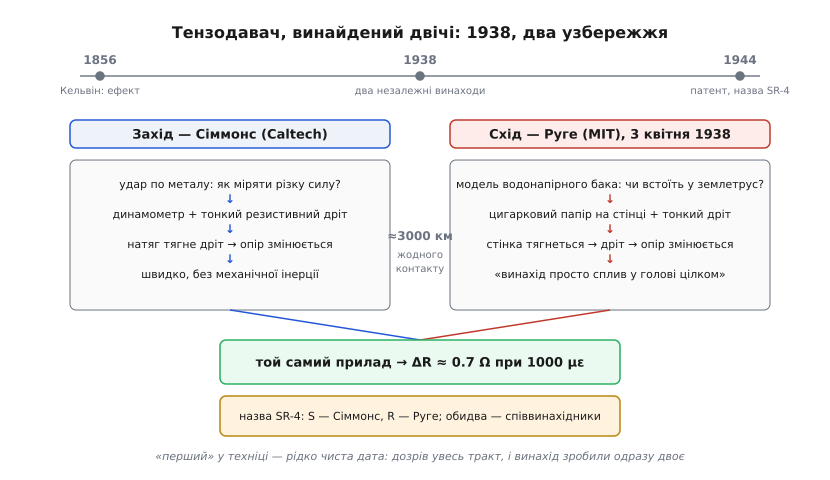
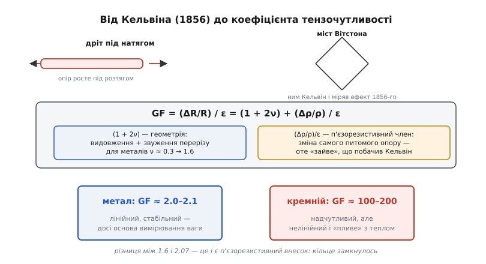

# 📜 Тензодавач, винайдений двічі: Сіммонс і Руге, 1938

> Це історична вставка про [тензодавач](root:hw-sensing/strain-gauges) — наклеєну фольгову змійку, що під розтягом віддає мікроскопічну зміну опору, ΔR ≈ 0.7 Ом при тисячі мікрострейн. Цей пристрій двоє людей вигадали майже одночасно, на протилежних узбережжях США, не знаючи один про одного. Один ловив удар у каліфорнійській лабораторії, другий боявся землетрусу за масачусетську водонапірну вежу. Вони прийшли до того самого рішення — і нарешті воно стало приладом під назвою SR-4, де перша літера від одного, друга від іншого. Та ще й найважливіша деталь: ефект, покладений в основу цього давача, знали за вісімдесят два роки до того — і весь цей час він чекав на дешевий клей і дешевий підсилювач. Ця історія повчальна двічі: і як технологія дозріває, і що таке «першість» у техніці насправді.

---

## Передісторія: Кельвін уже все бачив (1856)

Перш ніж двоє дослідників у 1938 році незалежно «вловили» одну ідею — варто запитати: а коли вперше помітили, що розтяг змінює опір дроту? Відповідь веде на вісімдесят два роки назад, до знайомого імені.

**Вільям Томсон** (*William Thomson*, 1824–1907) — майбутній лорд Кельвін, на честь якого названо абсолютну шкалу температур, — звів термоелектрику в єдину теорію і дав закон Ома й поняття опору в сучасному вигляді. У 1856 році він опублікував роботу «On the Electro-dynamic Qualities of Metals» і повідомив про дещо цілком нове: **опір залізних і мідних дротів зростає під поздовжнім натягом**. Виміряв це Кельвін модифікованим [мостом Вітстона](root:hw-sensing/wheatstone-bridge) — тим самим, яким сьогодні читають тензодавач. Іронія кола: засіб вимірювання ефекту й засіб читання давача — одна й та сама схема.

Але найважливіше, що побачив Кельвін, — не сам факт зміни опору, а те, що **залізо і мідь під однаковим натягом реагують по-різному**. Це не збігалося з тим, що можна було очікувати від простої геометрії: якщо дріт видовжується й стискається в перерізі, R = ρ·L/A мав би рости суто кількісно, і для всіх металів однаково. Але залізо давало одне число, мідь — інше. Значить, під натягом змінювалась і сама **питома провідність** матеріалу. Кельвін не вжив слова «п'єзорезистивність» — воно з'явиться набагато пізніше, — але по суті він розглянув саме зерно коефіцієнта тензочутливості (gauge factor, GF).

Серед мотивів для цих вимірювань були, серед іншого, й клопоти телеграфних компаній: опір довгих повітряних ліній «плив» залежно від натягу проводів, і це спотворювало сигнали. Точно ця мотивація Кельвіна документально не підтверджена, але контекст цілком реальний — саме телеграфна епоха гостро цікавилась поведінкою опору в різних умовах.

Згодом ефект підтвердили й уточнили інші дослідники — зокрема Герберт Томлінсон (*Herbert Tomlinson*), який у 1870-х роках окремо виділив, яка частка приросту опору йде від геометрії (видовження й звуження), а яка — від зміни самого питомого опору. Наукова картина ставала дедалі виразнішою.

Та ось парадокс: від чіткого знання ефекту до практичного приладу пройшло **вісімдесят два роки**. Справа не у відкритті, а у двох речах, яких бракувало. Перша — надійний спосіб **приклеїти** тонкий провідник до деталі так, щоб він точно повторював її деформацію. Друга — **дешевий підсилювач** для мікровольтів: ΔR ≈ 0.2% ΔR/R залишалась би невидимою без електронної схеми зчитування — та сама думка «чи є чим прочитати», що супроводжує кожен слабкий [фізичний ефект давача](root:hw-sensing/piezo-optical-semiconductor). Обидві ці речі дозріли до кінця 1930-х — і тоді ідею «зловили з повітря» одразу двоє.

> 🔧 **Навіщо це.** Фундаментальне явище може десятиліттями лежати без застосування, доки не дозріє решта вимірювального тракту. Шукаючи давач для нової задачі, питай не лише «який ефект», а й «чи є чим його зчитати» — пряме відлуння логіки [вимірювального ланцюга](root:hw-sensing/what-is-a-sensor).

---

## Захід: Сіммонс і дріт на динамометрі (Caltech, 1936–1938)

Час настав. Почнімо з того, хто, за більшістю джерел, визрів першим за датою.

**Едвард Е. Сіммонс-молодший** (*Edward E. Simmons Jr.*, 1911, Лос-Анджелес — 2004, Пасадіна) — американський інженер-електрик. Він навчався в Каліфорнійському технологічному інституті (*California Institute of Technology*, Caltech): бакалавр 1934-го, магістр 1936-го. Після закінчення лишився при інституті й проводив дослідження під керівництвом асистент-професора Дональда Кларка (*Donald Clark*) і Детвайлера (*Dätwyler*).

Задача у Сіммонса стосувалась **ударних навантажень**: як поводяться метали, коли сила прикладається різко, миттєво, а не плавно? Оптичні й механічні тензометри того часу мали інерцію — вони просто не встигали за ударним фронтом. Сіммонс запропонував інше: оснастити **динамометр** (силовимірювач) тонкими резистивними дротами. Натяг деталі тягнув дріт, опір дроту змінювався, а зміну читали електрично — швидко й без механічної інерції. Малий наклеєний дріт майже не навантажував деталь і відповідав миттєво.

Зверніть увагу на логіку: перше застосування тензодавача — не «виміряти деформацію для інженерного аналізу», а **виміряти силу через деформацію**. Саме це і є архетип ваговимірювання: деформація → ΔR → сила → вага. Динамометр Сіммонса і сучасна ваг-комірка з HX711 — одна й та сама ідея, просто різних поколінь.

Щодо пріоритету: за більшістю джерел задум і реалізація Сіммонса дозріли приблизно 1938-го, причому початок роботи відносять навіть до 1936-го. Частина досліджень схиляється до того, що він випередив Руге десь на рік, хоча Wikipedia формулює обережніше — «майже одночасно і незалежно». Тому коректно: Сіммонс, найімовірніше, перший за датою, але не з відривом, який виправдовував би титул «єдиного винахідника».

Далі почалося те, що часто трапляється з університетськими винаходами: Caltech претендував на патент. Сіммонс не погодився й відстоював своє право через **Верховний суд Каліфорнії** — і виграв у 1949 році. Тобто «перший» у часі коштував йому одинадцять років судової тяганини.

Людська деталь: з роками Сіммонс уславився ексцентричністю — студенти Caltech прозвали його «людиною Міллікена» (*Millikan Man*) за нічні блукання кампусом біля бібліотеки Міллікена. Геній і дивацтво нерідко ходять поруч. 1944 року Інститут Франкліна (*Franklin Institute*) відзначив його медаллю Едварда Лонгстрета (*Edward Longstreth Medal*) — визнання прийшло раніше за суд.


*Подвійний незалежний винахід. Ліворуч — Сіммонс (Caltech): удар по металу → динамометр із тонким дротом → ΔR. Праворуч — Руге (MIT, 3 квітня 1938): землетрус → модель водонапірного бака → дріт на цигарковому папері → ΔR. Між ними — близько 3000 км і жодного контакту. Внизу — спільний вузол: той самий прилад, назва SR-4, патент 1944. Угорі — тонка лінія часу від Кельвіна (1856) до приладу.*

> 🔧 **Навіщо це.** Сіммонсів хід — архетип ваговимірювання: деформацію перетворюю на ΔR, а ΔR — на силу. Динамометр і ваг-комірка стоять на одному принципі.

---

## Схід: Руге, водонапірна вежа й землетрус (MIT, 3 квітня 1938)

За три тисячі кілометрів, не чувши нічого про Сіммонса, інша людина гналася за зовсім іншою задачею — і прийшла до того самого.

**Артур Клод Руге** (*Arthur Claude Ruge*, 28 липня 1905, Тома (*Tomah*), штат Вісконсин — 3 квітня 2000, Лексінгтон, штат Массачусетс) — американський інженер-механік. Першу освіту здобув у Технологічному інституті Карнегі (*Carnegie Institute of Technology* у Піттсбурзі; з 1967 року — Університет Карнегі-Меллона), магістерський і докторський ступені — у MIT. З 1932 року він там і залишився: **професор інженерної сейсмології** (*engineering seismology*).

Задача, що підштовхнула його до винаходу, прийшла від аспіранта — **Дж. Ганса Маєра** (*J. Hanns Meier*, подекуди написання Maier). Маєр вивчав, як землетрус навантажує підняті водонапірні баки: реальні баки могли б обвалитись при сейсмічних поштовхах, тож їхні моделі трясли на вібростолі й намагалися виміряти напруження в тонких стінках. Оптичні методи виміру деформації для маленької тонкостінної моделі не годились — вони були занадто громіздкими й недостатньо чутливими.

І тут настав момент, який Руге описав сам:

> «the invention just popped into my mind, whole» — «винахід просто сплив у голові цілком».

Це сталося **3 квітня 1938 року**. Руге наклеїв на стінку моделі цигарковий папір, а на нього — тонкий дріт із виводами. Розтяг стінки розтягував дріт, а опір дроту змінювався. Все.

Далі — класична помилка інституційного комітету. Руге подав ідею до патентного відомства MIT; комітет розглянув і постановив: цікаво, але значної комерційної перспективи не видно, тож права відступаємо самому винахіднику. Це рішення MIT зі смаком повторюють у всіх розповідях про цю історію — як приклад того, що «комітети не вміють бачити золото». Але для самого Руге вийшло добре: права залишились у нього.

Після відмови MIT Руге дізнався, що приблизно роком раніше той самий прилад — дріт, наклеєний так, щоб повторювати деформацію деталі, — незалежно винайшов Едвард Сіммонс на Caltech. Жодної крадіжки: два дослідники, два окремих узбережжя, жодного контакту. Обидва визнані **співвинахідниками** — і саме такий статус закріпив спільний патент.

Зворушливий, але справжній збіг: Артур Руге помер 3 квітня 2000 року — рівно в річницю 3 квітня 1938-го, коли «винахід просто сплив у голові цілком».

1939 року Руге разом із колегою по MIT Альфредом де Форестом (*Alfred de Forest*) заснував фірму Ruge-de Forest, що стала комерційно випускати тензодавачі. Перше велике замовлення — **50 000 штук** — надійшло 1941 року через компанію Baldwin-Southwark. Прилад отримав торгову назву **SR-4**. «SR», одностайно, — це Simmons-Ruge, на честь обох. Щодо «4» — розповідають по-різному: за однією (поширеною) версією, це четверо причетних, тобто двоє винахідників і двоє їхніх помічників; за детальнішим викладом, «4» позначало чотирьох учасників фінальної наради про назву — Татнолл (*Tatnall*), Кларк, де Форест і патентний повірений Гетевей (*Hathaway*). Як саме пояснюють цифру — залежить від джерела, але «SR» без сумнівів вшановує обох. Спільний патент США виданий **6 червня 1944 року**.

> 🔧 **Навіщо це.** Шлях «лабораторний дослід → цигарковий папір із дротом → фірма → 50 000 штук → стандартна назва в даташиті» — це типове дорослішання давача. А ще: MIT відмовився від патенту, визнавши ідею малоперспективною. Отже, «комітет з оцінки перспектив» в техніці помиляється регулярно — майте на увазі.

---

## Чому 1938-й, а не 1856-й: дозрів увесь тракт

Дві незалежні лінії зійшлися в одній точці часу не випадково. Що змінилося за вісімдесят два роки після Кельвіна?

**Перше — клей і носій.** Кельвін тримав дріт окремо і просто натягував його в приладі. Щоб перетворити ефект на давач деформацій, потрібно було **приклеїти** тонкий провідник до деталі — так, щоб він точно повторював кожен мікрон її деформації, не ковзав, не відлипав. Руге використав цигарковий папір, Сіммонс — шовк і дріт. Це попередники сучасної фольгової основи на полімері.

**Друге — підсилення.** З'явились відносно доступні електронні підсилювачі для мілі- й мікровольтів. Без цього ΔR ≈ 0.2% від номінального опору залишалась би «тихим голосом», якого ніщо не могло почути. Тут спрацьовує правило, що [зчитати давач](root:hw-sensing/what-is-a-sensor) — окрема задача, і що сигнал треба [узгодити з входом і підсилити](root:hw-sensing/sensor-input-matching).

**Третє — попит.** Авіація, машинобудування, сейсміка 1930-х гостро потребували **вимірювати** напруження в реальних конструкціях — не рахувати на папері, а вимірювати. Руге мав землетруси й водонапірні баки, Сіммонс — ударні навантаження на метали. Технологія народилася під тиском конкретних задач, а не заради академічного інтересу.

Підсумок той самий, що і для [п'єзоефекту та ефекту Холла](root:hw-sensing/piezo-optical-semiconductor): **ефект 1856-го + клей + підсилювач + попит = давач 1938-го**. Знання ефекту — необхідна умова, але далеко не достатня.

> 🔧 **Навіщо це.** Для інженера — нагадування: давач — це ефект **плюс** спосіб його зчитати **плюс** потреба, що виправдовує складність. Бракує будь-чого одного — приладу нема.

---

## Worked-приклад: чому сигнал тензодавача — це мілівольти

**Від коефіцієнта тензочутливості Кельвіна до напруги на мості.** Сценарій: одиночний тензодавач SR-4-класу, опір R = 350 Ом, коефіцієнт GF = 2.07 (конкретне значення для певного типу BLH AB-1; загальний діапазон для металевих тензодавачів — 2.0–2.1), у чвертьмості Вітстона з напругою збудження V_зб = 5.0 В. Деталь зазнає робочої деформації ε = 1000 мікрострейн (1 mε = 0.001) — типове робоче значення для металевого тензодавача.

```
крок 1 — відносна зміна опору (означення gauge factor):
  ΔR/R = GF · ε = 2.07 · 0.001 = 0.00207 = 0.207 %

крок 2 — абсолютна зміна опору:
  ΔR = 0.00207 · 350 Ом ≈ 0.724 Ом      (лише ~0.7 Ом)

крок 3 — розбаланс чвертьмоста дає диференційну напругу:
  V_вих = (V_зб / 4) · (ΔR/R)            (формула чвертьмоста — мала ΔR)
        = (5.0 / 4) · 0.00207
        = 1.25 · 0.00207 В
        ≈ 0.00259 В ≈ 2.59 мВ
```

На повну робочу деформацію — лише ~2.6 мВ. На типову малу (100 µε) — уже сотні мікровольтів. Саме тому сигнал тензомоста — мілі- і мікровольти, які мусять пройти через [інструментальний підсилювач](root:hw-analog/instrumentation-amp), перш ніж їх «побачить» [АЦП](root:hw-analog/adc) з кроком у сотні мкВ. І саме тому Кельвінів ефект чекав аж до 1938-го: дріт-на-деталі уже міг повторювати деформацію, але мікровольти лишались би мертвим капіталом без дешевого підсилювача.

GF = 2.07 — це і є «те зайве» в формулі, яке побачив Кельвін 1856-го. Для чисто геометричного ефекту при ν ≈ 0.3 очікувалось би 1 + 2ν ≈ 1.6. Різниця між 1.6 і 2.07 — це внесок зміни питомого опору, п'єзорезистивний член. Кільце замкнулось.

Для повного ж і напівмоста сигнал підіймається у 2 або 4 рази — це вже арифметика вставки 🧮 [«Міст Вітстона в числах»](root:hw-sensing/strain-gauges/math-wheatstone-bridge.md).

---

## Gauge factor: від Кельвіна до рядка в даташиті


*Фізичне зерно коефіцієнта тензочутливості. Угорі: дріт під натягом і міст Вітстона — той самий, яким Кельвін міряв ефект 1856-го. Посередині: розклад формули GF = (1 + 2ν) + (Δρ/ρ)/ε — геометричний член і п'єзорезистивний внесок, що Кельвін побачив як «зайвий». Внизу: контраст метал (GF ≈ 2.0–2.1) проти напівпровідника (GF ≈ 100–200, але нелінійний).*

Коефіцієнт тензочутливості виглядає так:

```
GF = (ΔR/R) / ε = (1 + 2ν) + (Δρ/ρ) / ε

де:
  (1 + 2ν)     — геометричний член: видовження + стискання перерізу
                 для металів ν ≈ 0.3, тому (1 + 2·0.3) = 1.6
  (Δρ/ρ) / ε  — п'єзорезистивний член: зміна самого питомого опору
                 для металів малий; для Si (напівпровідник) — домінує
```

Для металевих тензодавачів геометричний член переважає, п'єзорезистивний невеликий — разом виходить GF ≈ 2.0–2.1. У напівпровідникових (кремнієвих) давачах п'єзорезистивний член гігантський, і GF досягає 100–200: звідси й надчутливість. Але платою є нелінійність і сильна температурна залежність — ось чому металеві тензодавачі у промисловому вимірюванні ваги й навантаження досі в більшості.

---

## Що з цієї історії лишилось у вашому даташиті

- **Сам прилад.** [Тензодавач](root:hw-sensing/strain-gauges) — це Сіммонсів дріт-на-динамометрі й Ругеів дріт-на-папері, доведені до фольги на полімері. Архетип [параметричного давача](root:hw-sensing/what-is-a-sensor): деформація → ΔR → міст → підсилювач.
- **Gauge factor.** Те, що Кельвін розгледів 1856-го — опір змінюється більше, ніж від самої геометрії, — сьогодні стоїть у кожному даташиті як GF ≈ 2 (реально 2.0–2.1; конкретні типи — близько 2.07). Це число читають як параметр у [класах перетворювачів](root:hw-sensing/transducer-classes).
- **Чому завжди міст і підсилювач.** ΔR ≈ 0.2% → мілівольти на мості → обов'язкове підсилення: уся «вхідна» інфраструктура тензодавача ([міст Вітстона](root:hw-sensing/wheatstone-bridge), [узгодження з входом і підсилення](root:hw-sensing/sensor-input-matching)) виросла саме тому, що сигнал крихітний. Той самий мотив, що жене підсилення слабкого сигналу й у термопари.
- **Слова.** «SR-4», «gauge factor», «bonded resistance strain gage», «quarter/half/full bridge» — лексика, що дослівно народилась у цій історії й чекає в довідниках, специфікаціях і на корпусі ваг-комірки.
- **Людський урок.** По-перше, велика ідея визріває, коли дозрів увесь тракт — і тоді її легко роблять одразу двоє. По-друге, «перший» у техніці — рідко чиста дата: тут вона обернулась судами на обох узбережжях і компромісним подвійним авторством у самій назві приладу. Чесний висновок без героїзації жодного «єдиного винахідника» — тому що жодного єдиного тут не було.
