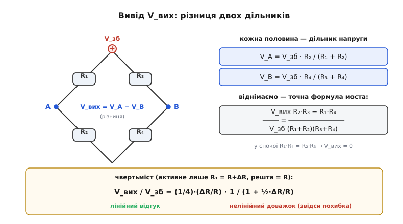
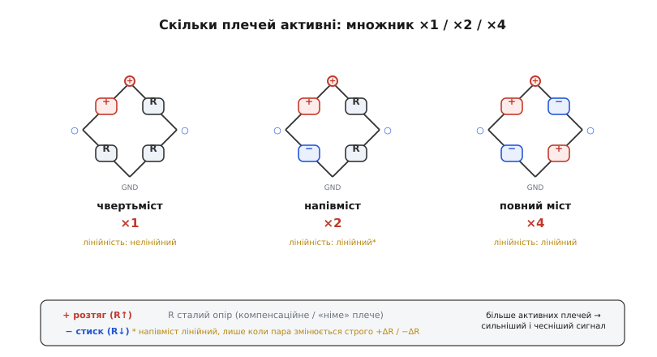
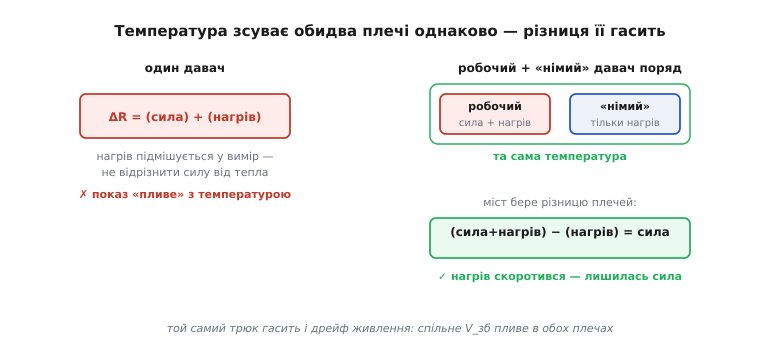

# 🧮 Напруга розбалансу моста для тензодавача

Тензорезистор віддає мізерію: під робочим навантаженням його опір змінюється на якісь дві десятих відсотка, і ця крихітна зміна сидить на тлі великого сталого опору, який ще й «пливе» з температурою. Прочитати її прямо неможливо. Рятунок — [міст Вітстона](topic:hw-sensing/wheatstone-bridge): він віднімає сталий фон і лишає саму зміну. Але «віднімає фон» — це слова; інженерові потрібна **формула**: скільки точно мілівольтів дасть міст на задану деформацію, наскільки ця залежність лінійна і де ховається похибка. Виведімо все від першопричини — від чотирьох законів Ома на чотирьох плечах — і дійдімо до робочих формул чвертьмоста, напівмоста й повного моста, до множника ×1/×2/×4 і до того, як сусіднє плече задарма гасить температуру.

### Точна формула: різниця двох дільників

Міст — це [два дільники напруги](topic:hw-analog/voltage-divider) пліч-о-пліч, увімкнені від спільного живлення V_зб до спільної землі, а вихід знімають **між** їхніми середніми точками. Назвімо плечі так: ліва вітка — R₁ зверху, R₂ знизу, з вузлом A між ними; права вітка — R₃ зверху, R₄ знизу, з вузлом B. Кожен дільник задає свою середню напругу незалежно:

```
V_A = V_зб · R₂ / (R₁ + R₂)
V_B = V_зб · R₄ / (R₃ + R₄)
```

Вихід моста — це їхня різниця V_вих = V_A − V_B. Зводимо до спільного знаменника:

```
V_вих       R₂·(R₃+R₄) − R₄·(R₁+R₂)        R₂·R₃ − R₁·R₄
──── =  ─────────────────────────  =  ──────────────────
V_зб           (R₁+R₂)·(R₃+R₄)            (R₁+R₂)·(R₃+R₄)
```

Це **точна** формула моста, без жодних наближень. У ній одразу видно дві важливі речі. По-перше, живлення V_зб входить чистим множником — отже, вихід прямо пропорційний збудженню (це знадобиться). По-друге, чисельник дорівнює нулю, коли R₂·R₃ = R₁·R₄ — це і є **умова балансу**: при ній міст мовчить незалежно від V_зб. Тензодавач завжди будують так, щоб у спокої міст був точно збалансований; уся корисна напруга з'являється як **відхилення** від цього нуля.


*Звідки береться формула моста. Ліва вітка R₁/R₂ задає у вузлі A напругу дільника, права вітка R₃/R₄ — у вузлі B; вихід — їхня різниця. Зведення до спільного знаменника дає точний вираз із чисельником R₂·R₃ − R₁·R₄, що обертається на нуль в умові балансу. Унизу — чвертьміст: лінійний відгук (¼)·(ΔR/R) з нелінійним доважком у знаменнику.*

### Чвертьміст: один активний тензорезистор

Тепер уведімо деформацію. У найпростішому ввімкненні активне лише одне плече — скажімо, R₁ = R + ΔR, а решта три — сталі опори того ж номіналу R₂ = R₃ = R₄ = R. Підставмо це в точну формулу. Чисельник: R₂·R₃ − R₁·R₄ = R·R − (R+ΔR)·R = −R·ΔR. Знаменник: (R+ΔR+R)·(R+R) = (2R+ΔR)·2R. Звідси

```
V_вих        −R·ΔR              −ΔR/R
──── =  ─────────────────  =  ──────────
V_зб     (2R+ΔR)·2R           4·(1 + ΔR/2R)
```

Знак мінус — лише питання того, який вузол ми назвали «плюсом» виходу; за модулем важливе ось що:

```
V_вих       1     ΔR/R
──── =  ── · ──────────        (точний чвертьміст)
V_зб        4    1 + ½·(ΔR/R)
```

Розгляньмо цей вираз уважно. Множник ¼ — це чутливість моста: чвертьміст віддає чверть від відносної зміни опору, помноженої на збудження. Звідки саме чверть? Один дільник R/(R+R) сидить рівно на половині V_зб, і мала зміна одного плеча зрушує його середню точку на (¼)·(ΔR/R)·V_зб — половина від половини. А знаменник 1 + ½·(ΔR/R) — це **нелінійний доважок**: він трохи «загинає» характеристику, бо коли R₁ росте, він міняє не лише чисельник, а й власний дільник.

### Наскільки кривить нелінійність — і коли можна знехтувати

Член ½·(ΔR/R) у знаменнику — мала величина, тож розкладімо дріб у ряд (1 + x)⁻¹ ≈ 1 − x для малого x:

```
V_вих       1            (    1  ΔR )
──── ≈  ── · (ΔR/R) · ( 1 − ── · ── )      (лінеаризація)
V_зб        4            (    2   R )
```

Перший доданок — чистий лінійний відгук (¼)·(ΔR/R), яким користуються на практиці. Другий — відносна похибка нелінійності, що дорівнює приблизно ½·(ΔR/R). Підставмо реальне число. Метал має коефіцієнт тензочутливості GF ≈ 2 (відношення відносної зміни опору до деформації, GF = (ΔR/R)/ε), тож при бадьорій деформації ε = 1000 µε маємо ΔR/R = GF·ε = 0.002. Похибка нелінійності виходить ½·0.002 = 0.001 = **0.1 %** від показу.

```
ΔR/R = GF · ε = 2.0 · 0.001 = 0.002 = 0.2 %
нелінійність ≈ ½ · (ΔR/R) = ½ · 0.002 = 0.1 %
```

Для звичайної ваги 0.1 % цілком терпимо, тому чвертьмости масово працюють «у лоб», без жодної корекції. Та коли потрібна точність у соті частки відсотка або деформації більші — нелінійність уже кусає, і її прибирають або математично (знаючи формулу, вираховують ΔR/R із виміряного V_вих точно), або **схемно** — додаючи активні плечі так, щоб квадратичний член скоротився сам. Саме тут і починається перевага напівмоста й повного моста.

> 🔧 **Навіщо це.** Перш ніж тягтися до калібрувальної таблиці, погляньте на очікувану ΔR/R: помножте GF на максимальну деформацію. Якщо вийде менше за тисячну, нелінійність чвертьмоста — соті частки відсотка, і морочитися з нею не варто. Якщо ж ваш давач дає відсотки (наприклад, напівпровідниковий або великий хід мембрани) — закладайте лінеаризацію вже в проєкт.

### Напівміст і повний міст: множник і де зникає нелінійність

Хитрість обох розширень одна: ставити тензорезистори так, щоб під навантаженням одні плечі **розтягувались** (+ΔR), а інші — **стискались** (−ΔR). На пружній балці це природно: верхнє волокно подовжується, нижнє коротшає на ту саму величину. Працюють такі плечі **назустріч**, і їхні внески у вихід додаються, а не віднімаються.

**Напівміст** — два активні плечі в одній вітці, що змінюються протилежно: R₁ = R + ΔR, R₂ = R − ΔR, а R₃ = R₄ = R. Чисельник точної формули: R₂·R₃ − R₁·R₄ = (R−ΔR)·R − (R+ΔR)·R = −2R·ΔR — рівно вдвічі більший за чвертьмостовий. Знаменник: (R+ΔR + R−ΔR)·(2R) = 2R·2R = 4R² — а в ньому ΔR **скоротилося повністю**. Результат разючий:

```
V_вих       1   ΔR
──── =  ── · ──        (напівміст: рівно лінійний, удвічі більший)
V_зб        2    R
```

Подвоєння сигналу — і **жодного** нелінійного доважка: дві протилежні зміни в одній вітці скорочують квадратичний член точно. Це найважливіший практичний висновок усього виводу.

**Повний міст** — усі чотири плечі активні, двома протилежними парами: R₁ = R₄ = R + ΔR (розтяг), R₂ = R₃ = R − ΔR (стиск). Чисельник: (R−ΔR)(R−ΔR) − (R+ΔR)(R+ΔR) = (R−ΔR)² − (R+ΔR)² = −4R·ΔR. Знаменник: (2R)·(2R) = 4R². Звідси

```
V_вих   ΔR
──── = ──            (повний міст: рівно лінійний, учетверо більший)
V_зб    R
```

Учетверо сильніший за чвертьміст і так само ідеально лінійний. Звідси й тяжіння до повномостових збірок там, де важать останні мікровольти й найвища точність.


*Скільки плечей роблять активними. Чвертьміст (одне активне плече) дає базовий сигнал ×1, але нелінійний. Напівміст (пара назустріч, +ΔR і −ΔR) подвоює сигнал і лінеаризує його. Повний міст (дві протилежні пари) учетверо сильніший і теж рівно лінійний. Червоне — розтяг (опір росте), синє — стиск (опір падає), сірі R — сталі компенсаційні плечі.*

### Температурна компенсація випливає з тієї самої різниці

Тепер — другий дарунок моста, і він теж не магія, а пряме слідство формули. Опір металу росте з нагрівом сам собою, без жодної деформації; назвімо цю спільну добавку ΔR_t. Вона з'являється **в усіх** плечах однаково — вони з того самого сплаву й лежать у тому самому кліматі. Поставмо поряд із робочим тензорезистором другий, **«німий»** (англ. *dummy*): наклеєний на ненавантажену ділянку тієї ж деталі, він зазнає тієї самої температури, але не деформації. Увімкнімо робочий як R₁, німий — як R₂ (сусіднє плече тієї ж вітки):

```
R₁ = R + ΔR + ΔR_t      (робочий: деформація + нагрів)
R₂ = R       + ΔR_t      (німий: лише нагрів)
```

Підставмо в чисельник точної формули, з R₃ = R₄ = R:

```
R₂·R₃ − R₁·R₄ = (R + ΔR_t)·R − (R + ΔR + ΔR_t)·R = −R·ΔR
```

Температурна добавка ΔR_t стоїть в **обох** доданках чисельника з тим самим знаком — і при відніманні **зникає безслідно**. Лишається рівно −R·ΔR, тобто чистий внесок деформації, наче нагріву й не було. Ось чому компенсаційне плече має сидіти **в сусідній** позиції вітки (R₁↔R₂ або R₃↔R₄): саме сусіди в одній вітці входять у чисельник різницею, тож їхній спільний дрейф там самознищується.


*Як міст гасить температуру. Робочий ловить «деформацію + нагрів», сусіднє «німе» плече — «лише нагрів». У чисельнику моста R₂·R₃ − R₁·R₄ спільна добавка ΔR_t стоїть у двох доданках з однаковим знаком і скорочується — лишається сама деформація. Той самий механізм гасить і дрейф живлення: спільне V_зб пливе в обох вітках однаково.*

У повному мості компенсація ще краща: чотири однакові тензорезистори дрейфують від температури разом, тож скорочується не лише температурний нуль, а й **дрейф живлення** — хитання V_зб однаково масштабує обидві вітки, а в різницю входить лише асиметрія від деформації. Один-єдиний прийом — «читати різницю сусідів» — задарма вирішує три задачі: прибирає сталий фон, гасить температуру й послаблює вимогу до стабільності збудження.

### Worked-приклад: від збудження до мілівольтів і коду

Зберімо все на числах. Повномостова ваг-комірка ([тензодавач](topic:hw-sensing/load-cell)), збудження V_зб = 5 В, чотири металеві тензорезистори GF = 2.0, максимальна деформація пружного тіла під номіналом ε = 1000 µε.

```
крок 1 — відносна зміна опору одного плеча:
  ΔR/R = GF · ε = 2.0 · 0.001 = 0.002

крок 2 — вихід повного моста (рівно лінійний):
  V_вих = V_зб · (ΔR/R) = 5 · 0.002 = 0.010 В = 10 мВ

для порівняння — чвертьміст за тих самих умов:
  V_вих = (V_зб/4) · (ΔR/R) = 1.25 · 0.002 = 2.5 мВ
```

Повний міст віддає 10 мВ проти 2.5 мВ у чвертьмоста — ті самі вчетверо. Але навіть 10 мВ — це мілівольти: перш ніж їх «побачить» [АЦП](topic:hw-analog/adc), сигнал проводять через [інструментальний підсилювач](topic:hw-analog/instrumentation-amp). Вихід моста зручно характеризувати **чутливістю** в мілівольтах на вольт збудження (мВ/В) — для типових ваг-комірок це 2 мВ/В, рівно наш випадок (10 мВ / 5 В).

Тут спрацьовує ще одне слідство пропорційності V_вих ∝ V_зб: якщо **те саме** V_зб живить і міст, і опорний вхід АЦП, то збудження скорочується з результату — це **співвідносне** (англ. *ratiometric*) вимірювання, і воно робить показ незалежним від дрейфу живлення. Перетворення сирого коду АЦП назад у деформацію в прошивці виглядає так:

```c
// Повний міст, ratiometric АЦП: V_ref(АЦП) = V_зб(моста).
// Тоді V_зб скорочується, і код залежить лише від ΔR/R та підсилення.
#define GF        2.0f      // коефіцієнт тензочутливості
#define GAIN      128.0f    // підсилення інструментального підсилювача
#define ADC_FS    0x7FFFFF  // повна шкала 24-біт зі знаком (±)

// code = ADC_FS * GAIN * (V_вих / V_зб) = ADC_FS * GAIN * (ΔR/R)   [повний міст]
float strain_from_code(int32_t code)
{
    float ratio = (float)code / (float)ADC_FS;   // V_вих / V_зб, бо ref = збудження
    float dR_over_R = ratio / GAIN;              // знімаємо підсилення
    return dR_over_R / GF;                        // ε = (ΔR/R) / GF  → деформація
}
```

Якби це був **чвертьміст**, лінійна формула дала б `ε = 4·ratio/(GAIN·GF)` (через множник ¼), а за потреби високої точності довелося б ще зняти нелінійність, розв'язавши точне рівняння замість лінійного:

```c
// Чвертьміст, зняття нелінійності: з ratio = (1/4)·(ΔR/R)/(1 + (1/2)ΔR/R)
// точно виражаємо ΔR/R (а не наближено).
float dR_over_R_quarter(float ratio)   // ratio = V_вих / V_зб
{
    // 4·ratio·(1 + x/2) = x  →  x·(1 − 2·ratio) = 4·ratio
    return (4.0f * ratio) / (1.0f - 2.0f * ratio);
}
```

Знаменник 1 − 2·ratio і є тією поправкою, що повертає чвертьмосту точність повного моста ціною одного ділення. Для напівмоста й повного моста він не потрібен — там лінійність точна за побудовою.

Через увесь вивід проходить одна думка. Міст не «підсилює» сигнал — він **переставляє** його з-під великого сталого фону на чистий нуль, віднімаючи дві майже однакові половини. Уся математика — це різниця R₂·R₃ − R₁·R₄: у ній сталий фон обертається на умову балансу, спільний температурний дрейф сусідів скорочується сам, а протилежні зміни плечей складаються й заразом убивають нелінійність. Порахувавши цей чисельник для свого ввімкнення, ви відразу знаєте і множник сигналу (×1/×2/×4), і чи буде відгук кривим, і куди ставити компенсаційне плече.
