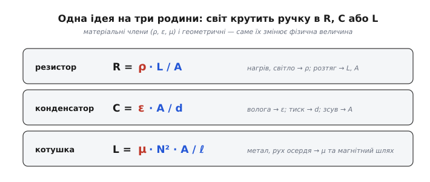
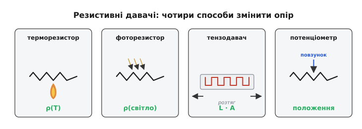
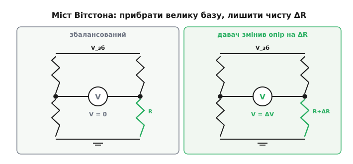
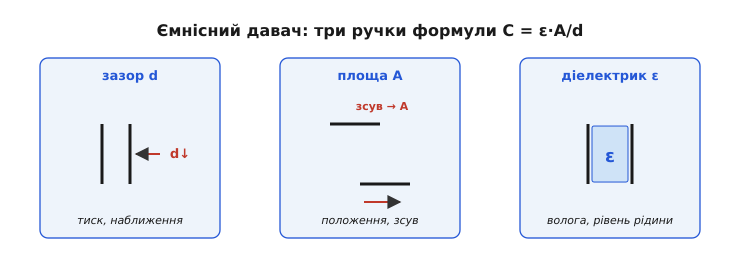
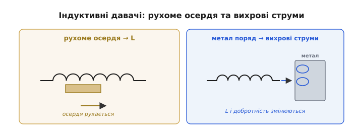
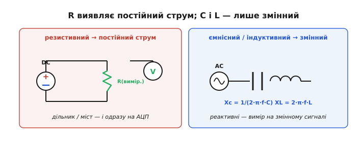
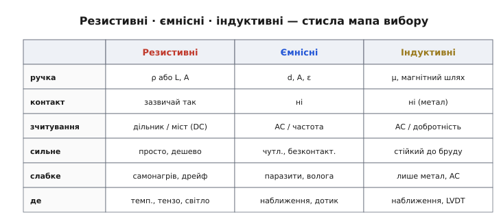

# Класи перетворювачів

Слово «перетворювач» (від лат. *transducere* — «переводити, переносити») означає пристрій, що переносить величину з одного фізичного світу в інший: тиск — у напругу, температуру — в опір. [Параметричні давачі](root:hw-sensing/what-is-a-sensor) — ті, що змінюють пасивну властивість і потребують живлення, — найбільша й найуживаніша сім'я перетворювачів у техніці. І тут на нас чекає подарунок: вони побудовані на **трьох добре знайомих компонентах** — [резисторі](root:hw-components/resistor), [конденсаторі](root:hw-components/capacitor) і [котушці](root:ph-electromagnetism/inductor-coil). Щоб зрозуміти всю цю родину давачів, не треба нової фізики — досить по-новому глянути на знайомі формули.

### Одна ідея на три родини: змінюй R, C або L

Придивімося до означальних формул трьох компонентів як до **рецептів із ручками регулювання**:

```
резистор:    R = ρ · L / A           (ρ — питомий опір, L — довжина, A — переріз)
конденсатор: C = ε · A / d           (ε — діелектрична проникність, A — площа, d — зазор)
котушка:     L = μ · N² · A / ℓ       (μ — проникність осердя, N — витки, A, ℓ — геометрія)
```

У кожній формулі є **матеріальні** члени (ρ, ε, μ) і **геометричні** (довжини, площі, зазори, витки). Звідси й головна думка: **будь-яка фізична величина, що штовхає хоч одну з цих «ручок», народжує давач**. Нагрів змінює ρ — маємо термодавач. Натиск зсуває пластини й змінює зазор d — маємо давач тиску. Метал поряд міняє магнітний шлях і L — маємо давач наближення. Увесь зоопарк параметричних давачів зводиться до простого питання: **яку ручку, на якому з трьох компонентів, ворушить наш фізичний світ**.


*Єдина ідея трьох родин. У кожній формулі підсвічено члени, які може змінити фізична величина: матеріальні (ρ, ε, μ) і геометричні (L, A, d, ℓ). Давач — це компонент, в якого реальний світ «крутить» один із цих параметрів.*

Саме тому ці три родини й переважають: вони **повторно використовують** добре відомі деталі разом з усією їхньою теорією. Ця ощадливість — не лише педагогічна зручність: переважна більшість давачів у промисловості й побуті належить саме до цих трьох родин, бо вони стоять на дешевих, надійних, давно вивчених компонентах. Хто розуміє резистор, конденсатор і котушку, той уже наполовину розуміє відповідні давачі — лишається з'ясувати, яка величина й яку «ручку» в них крутить. Кожна родина має свій характер, свої сильні місця й свою плату за них.

### Резистивні: найпростіша й найпоширеніша родина

Резистивний давач змінює **опір**. Дороги до цього дві: смикати матеріал (ρ) або смикати геометрію (L, A).

**Через питомий опір ρ:**
- **температура** → **терморезистор** (*thermistor*, від *thermal resistor*): NTC (опір падає з нагрівом) і PTC (зростає); а також **RTD** (*resistance temperature detector* — резистивний давач температури) на платині, майже лінійний і дуже стабільний еталон;
- **світло** → **фоторезистор** (*LDR, photoresistor*): світло вибиває носії, ρ падає (явище фотопровідності). *Зауважте:* давачі світла [на p-n переході (фотодіод)](root:hw-sensing/piezo-optical-semiconductor) працюють інакше — вони самі генерують сигнал, а не змінюють опір;
- **газ / волога** → **хеморезистор** (від грец. *chēmeia* — хімія): молекули осідають на чутливому шарі й міняють його опір (типові давачі чадного газу, диму).

**Через геометрію L, A:**
- **деформація** → **тензодавач** (*strain gauge*): тонкий дріт-змійка, наклеєний на деталь; розтягнеш — довжина L росте, переріз A меншає, обидва піднімають R. Це фундамент давачів сили, ваги, тиску (тензоміст у «ваг-комірках»);
- **положення** → **потенціометр** (від лат. *potentia* — «сила, напруга» + грец. *metron* — «міра»): повзунок відбирає частку опору — пряме перетворення кута чи зсуву на опір (а через дільник — на напругу);
- **сила/натиск** → **резистор, чутливий до тиску** (*FSR*): більший натиск — більша площа контакту провідних зерен — менший опір.


*Чотири резистивні давачі й «ручка», яку смикає величина: ρ(T) у терморезистора, ρ(світло) у фоторезистора, геометрія L·A у тензодавача за розтягу, положення повзунка в потенціометра.*

Переваги родини — простота, дешевизна й те, що опір **видно постійним струмом**: досить дільника (а часто й одного). Плата — **самонагрів** (струм через давач гріє його сам, спотворюючи вимір температури), **дрейф** і часта **нелінійність** (опір NTC падає по крутій кривій, не по прямій).

Ці недоліки варто зрозуміти, бо вони визначають практику. **Нелінійність** NTC така сильна, що прямою її не опишеш: залежність опору від температури майже експоненційна, тож у коді її задають кривою або довідковою таблицею — це і є та [обернена задача перетворення показу назад у фізичну величину](root:hw-sensing/what-is-a-sensor). Платиновий RTD, навпаки, майже лінійний, за що його й цінують як еталон, хоч він дорожчий і менш чутливий. **Самонагрів** підступніший: вимірювальний струм виділяє в давачі [потужність I²R](root:ph-electromagnetism/joule-heating), яка піднімає його власну температуру й додає до показу фальшиві градуси, — тому терморезистор живлять малим струмом. Уся родина — це компроміс «чутливість проти лінійності й стабільності».

**Приклад (який крихітний сигнал дає тензодавач).** Тензодавач характеризують **коефіцієнтом тензочутливості** (*gauge factor*, GF ≈ 2 для металевої фольги): відносна зміна опору дорівнює GF, помноженому на відносну деформацію ε. Візьмімо типову робочу деформацію 1000 мікрострейн (тобто ε = 0.001 — розтяг на одну тисячну довжини) на давачі 350 Ом:

```
ΔR / R = GF · ε = 2 · 0.001 = 0.002 = 0.2 %
ΔR = 0.002 · 350 Ом = 0.7 Ом
```

Лише **0.7 ома** на тлі 350 — ось чому тензодавач ніколи не вмикають у простий дільник: така дрібка потоне в зсуві. Потрібна хитріша схема зчитування.

### Зчитати малу ΔR: міст Вітстона

Уявіть тензодавач у звичайному дільнику з напругою 3.3 В. Вихід стоятиме біля половини живлення (≈ 1.65 В), а корисний сигнал від 0.7 Ом — це якісь мілівольти, що тремтять **верхи на величезному сталому зсуві** в 1.65 В. Підсилити такий сигнал, не загнавши підсилювач у насичення сталою складовою, важко.

Розв'язок — [**міст Вітстона**](root:hw-sensing/wheatstone-bridge) (*Wheatstone bridge*): не один дільник, а **два поруч**, увімкнені між тим самим живленням. Беремо різницю їхніх середніх точок. Коли всі чотири плечі однакові, міст **збалансований** — різниця рівно нуль, ніякого зсуву. Щойно давач змінює опір на ΔR, баланс порушується, і на виході з'являється **лише корисна різниця**, яку вже можна сміливо підсилювати.


*Чому міст кращий за дільник. Ліворуч — баланс: середні точки рівні, вихід 0, без сталого зсуву. Праворуч — давач змінив опір на ΔR: з'являється диференційна напруга, пропорційна **тільки** зміні. Її підсилюють без боротьби з постійною складовою.*

Міст дарує ще один подарунок — **придушення спільної завади**. Якщо всі плечі однаково попливли від температури навколишнього, вони зсунулись разом, баланс зберігся, і дрейф **сам скоротився**. Тому ваги, давачі тиску й RTD майже завжди читають саме мостом, а не голим дільником.

Активних плечей у мості може бути різна кількість, і це прямо впливає на сигнал. **Чвертьміст** — один давач і три сталі резистори (найпростіше). **Напівміст** — два давачі в суміжних плечах (в одній гілці-дільнику моста): скажімо, коли балка згинається, один тензодавач розтягується, другий стискається, тож їхні протилежні за знаком зміни **додаються** у вихід, а спільний дрейф гаситься ще краще. **Повний міст** — усі чотири плечі активні: максимальна чутливість і найкраща температурна компенсація; саме так роблять промислові ваг-комірки. Правило просте: що більше активних плечей, то більший корисний сигнал з тієї самої деформації.

> 🔧 **Навіщо це.** Правило на все життя: коли треба зміряти **малу зміну на великій сталій базі** (тензо, RTD, будь-який давач із крихітною ΔR), не вмикайте його в простий дільник — беріть **міст**. Він прибирає базу до підсилювача й заодно гасить спільний дрейф. Половина мистецтва читати резистивний давач — у схемі моста й доброму інструментальному підсилювачі за ним.

### Ємнісні: вимір без дотику

Ємнісний давач змінює **ємність** C = ε·A/d, і в нього аж **три ручки**: зазор d, площа перекриття A та діелектрик ε.

- **зазор d** → наближення, зсув, **тиск** (мембрана прогинається — зазор меншає — C росте); на цьому ж принципі стоїть [ємнісний MEMS-акселерометр](root:hw-sensing/accelerometer) (його гребінки — це змінний зазор); сюди ж **сенсорний дотик** — палець підміняє один «електрод»;
- **площа A** → лінійне й кутове **положення**: пластини насуваються одна на одну, перекриття змінює C;
- **діелектрик ε** → **волога** (вода має ε ≈ 80; вологий шар між пластинами підіймає ємність), **рівень рідини** (заповнення міняє діелектрик між обкладками), розпізнавання матеріалу.


*Три ручки ємнісного давача. Зміна зазору d (наближення, тиск), зміна площі перекриття A (положення) і зміна діелектрика ε (волога, рівень рідини) — кожна дає свій клас давачів на тій самій формулі C = ε·A/d.*

Зчитування тут принципово інше. Ємність **невидима для постійного струму** — [заряджений конденсатор його просто не пропускає](root:hw-components/capacitor). Тому ємність читають **змінним сигналом**: міряють [реактивний опір](root:hw-components/capacitive-reactance) Xc = 1/(2·π·f·C), або час заряду RC, або вмикають давач у генератор і ловлять **зсув частоти**.

Кожен спосіб має свій смак. Метод **часу заряду** простий: мікроконтролер заряджає давач через відомий резистор і [таймером](root:hw-arch/timer-counter) міряє, скільки часу мине до порогу, — більша ємність дає довший час. **Генераторний** спосіб чутливіший: давач задає частоту коливань, і навіть пікофарадна зміна помітно її зсуває, а частоту легко рахувати. Щоб приборкати паразитну ємність, поряд із чутливим електродом кладуть **охоронний** (*guard* — «охорона, заслона»): його тримають під тією самою напругою, тож між ним і робочим електродом нема різниці потенціалів — паразитні лінії поля замикаються на охорону, а не на корисний електрод. І це не дрібниця: корисні ємності тут — одиниці пікофарад, того ж порядку, що й паразитні.

**Приклад (які мізерні ці ємності).** Дві пластини площею 1 см² із зазором 1 мм у повітрі:

```
C = ε₀ · A / d = 8.854×10⁻¹² · (1×10⁻⁴) / (1×10⁻³)
C ≈ 8.9×10⁻¹³ Ф ≈ 0.89 пФ
```

Менше пікофарада! Зменшимо зазор удвічі (натиск) — ємність подвоїться, але це досі одиниці пікофарад. А ємність вашого тіла чи кабелю — теж пікофаради. Ось чому ємнісні давачі **бояться паразитної ємності**: рука, дріт, волога поруч дають сигнал того ж порядку, що й корисний. Звідси екранування, короткі виводи й охоронні електроди (а далі — [узгодження давача з вимірювальним входом](root:hw-sensing/sensor-input-matching)).

Переваги — **безконтактність** (нема тертя й зносу), висока чутливість, мале споживання. Недоліки — крихітний сигнал у пікофарадах, страх вологи/бруду/паразитів і потреба у змінному зчитуванні.

### Індуктивні: бачити метал крізь бруд

Індуктивний давач змінює **індуктивність** L. Вона залежить від витків N, геометрії та — найголовніше для давачів — від **магнітного шляху**: осердя, зазорів, провідників поруч.

- **рухоме феромагнітне осердя** змінює L — на цьому стоїть **LVDT** (*linear variable differential transformer* — лінійний диференційний трансформатор зі змінним зв'язком), точний і витривалий давач лінійного зсуву, улюбленець промисловості;
- **вихрові струми** (*eddy currents*): метал біля котушки наводить у собі вихрові струми (пряма рідня [електромагнітної індукції](root:ph-electromagnetism/electromagnetic-induction)), які протидіють полю й змінюють ефективну L та добротність котушки — це **індуктивний давач наближення**, що відчуває метал без дотику;
- **змінний зазор / магнітний опір**, обертові давачі, деякі давачі струму.


*Дві індуктивні схеми. Ліворуч — рухоме осердя змінює зв'язок котушок (принцип LVDT): зсув стає напругою. Праворуч — метал поряд наводить вихрові струми, що «гасять» котушку: змінюються L і добротність — давач бачить метал, не торкаючись.*

Зчитують індуктивний давач знов-таки **змінним струмом**: міряють [реактивний опір](root:hw-components/inductive-reactance) XL = 2·π·f·L або стежать за частотою/добротністю генератора з цією котушкою.

Означення «диференційний» у назві LVDT не випадкове. Усередині дві вторинні котушки, увімкнені назустріч: коли осердя точно по центру, їхні сигнали рівні й гасяться — на виході чистий нуль; зсув в один бік підіймає одну котушку, у протилежний — другу. Тому з амплітуди та фази читаються **і величина, і напрямок** зсуву, причому без «мертвої зони» в центрі. А вихрострумовий давач корисний ще й тим, що бачить **будь-який** метал, а не лише феромагнітний: вихрові струми течуть і в міді чи алюмінії, тож такий давач відрізнить метал від пластику навіть там, де простий магніт безсилий.

Сильний бік — **витривалість**: індуктивному давачу байдуже до мастила, пилу, води чи фарби, бо нема оптики, яку можна забруднити, і часто нема контакту. Саме тому конвеєри й верстати рахують металеві деталі індуктивними давачами. Слабкі боки — реагує переважно на **метал** (вихрострумовий тип), потребує змінного живлення, габаритніший і чутливий до температури.

> 🔧 **Навіщо це.** Коли давач мусить працювати в бруді, мастилі, вологому чи запиленому середовищі — на верстаті, у двигуні, під дощем, — індуктивний тип нерідко єдиний розумний вибір: його нема чим «засліпити». Оптику заллє й заялозить, ємнісному завадить волога й бризки, а котушці на все це байдуже. Ціна витривалості — він бачить лише метал і потребує змінного збудження; та коли довкілля вороже, це чесний обмін.

### Спільний знаменник: R читають постійним, C і L — змінним

У способах зчитування трьох родин ховається красива закономірність. Опір — це «справжній» (активний) опір: його виявляє **сталий** струм, тому резистивний давач читають **постійним** струмом — дільником чи мостом. А ємність і індуктивність [**реактивні**](root:hw-components/reactance): їхній вплив проявляється **лише на змінному** сигналі. Тому ємнісні й індуктивні давачі — за самою природою «змінного струму»: їх збуджують AC, міряючи реактивний опір, або стежать за частотою.

Це не дрібниця реалізації, а розвилка всього проєкту. Для резистивного давача джерелом «питання» може бути проста стала напруга, і весь тракт зводиться до дільника та АЦП — нічого не коливається. Для ємнісного чи індуктивного потрібен **змінний** збуджувач (генератор) і спосіб виміряти реактивний відгук: реактивний опір, час заряду або частоту. Тому, побачивши в специфікації слова «ємнісний» чи «індуктивний», уже наперед знаєш, що в схемі буде коливальний вузол, а не самий лише дільник, — і закладаєш на нього і місце, і час розробки.


*Спільний знаменник зчитування. Резистивний давач — постійний струм, дільник/міст. Ємнісний та індуктивний — реактивні, тож потрібен змінний сигнал: реактивний опір Xc, XL або зсув частоти генератора.*

> 🔧 **Навіщо це.** Це правило підказує «передній край» ще до вибору давача. Бачите резистивний — готуйте дільник/міст і АЦП. Бачите ємнісний чи індуктивний — потрібен змінний збуджувач або частотомір/таймер. Недарма мультиметр опір міряє напряму, а ємність та індуктивність — лише подавши власний **змінний** тест-сигнал.

### Як обрати: коротке порівняння


*Три родини поряд: яку «ручку» крутять, контактні чи ні, чим зчитують, сильні й слабкі боки, типове застосування. Стисла мапа для вибору.*

Грубий орієнтир вибору: потрібно дешево, просто й контакт не заважає — **резистивний**; потрібен безконтактний, чутливий вимір у чистому середовищі — **ємнісний**; потрібно безконтактно ловити **метал** у бруді й мастилі — **індуктивний**. Усі три, проте, лишають сигнал, який ще треба нормувати й оцифрувати, — а отже, повертають до [спільного вимірювального ланцюга давача](root:hw-sensing/what-is-a-sensor).

Ці три родини сильні тим, що повторно використовують відомі пасивні компоненти. Поряд із ними існує й інша велика гілка — [давачі на глибшій фізиці матеріалів](root:hw-sensing/piezo-optical-semiconductor): п'єзоелектриці, фотопереходах і напівпровідникових ефектах, де перетворювач часто сам генерує сигнал, не потребуючи живлення.

---
