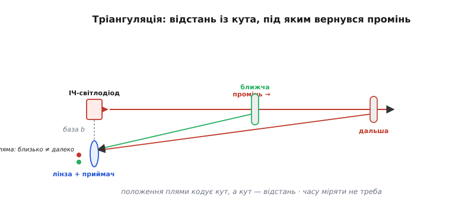
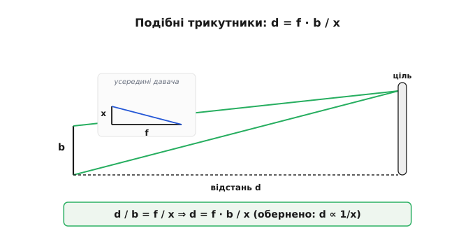
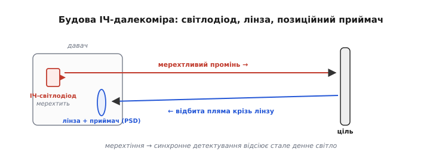
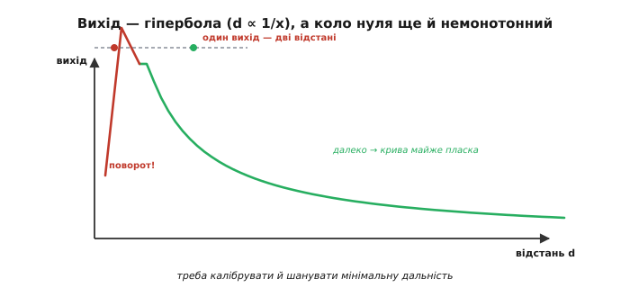
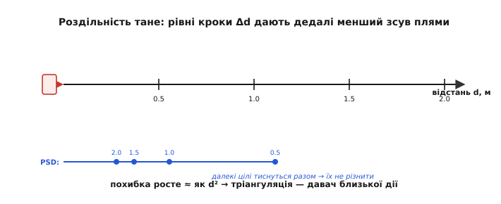
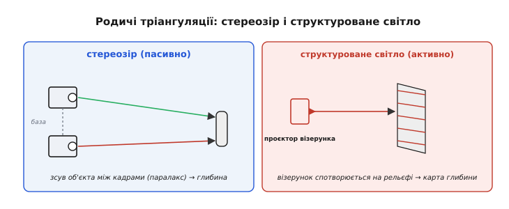

# Тріангуляція

Виміри відстані через [час польоту](root:hw-sensing/ultrasonic-tof-method) воюють із годинником: ультразвук мучить температурний дрейф, а [світловий ToF](root:hw-sensing/tof-laser) — пікосекунди. Тріангуляція (від латинського *triangulum* — трикутник) цю війну **оминає**. Вона дістає відстань не з часу подорожі хвилі, а з **геометрії** — з кута, під яким відбитий промінь повертається до давача. Жодного точного часу, жодної надшвидкої електроніки: усе вирішує проста шкільна теорема про подібні трикутники. За це тріангуляцію й люблять у дешевих короткобійних далекомірах — тих маленьких інфрачервоних «очах», що їх ставлять роботам, щоб не з'їжджали зі столу й не тицялись у стіну. Плата за дешевизну — нелінійний вихід і коротка дальність, і саме ці дві риси визначають, де такий давач доречний.

### Відстань із трикутника, а не з годинника

Ідея напрочуд давня — нею землеміри тисячі років міряли недосяжне, а наші два ока щомиті оцінюють, як далеко чашка на столі. Давач робить те саме в мініатюрі. Він випромінює вузький промінь (зазвичай інфрачервоний); промінь долітає до цілі, відбивається, і **лінза** збирає відбиту пляму на крихітний приймач, **зсунутий убік** від випромінювача на відому відстань — **базу**. Уся суть у тому, що **положення** плями на приймачі залежить від **кута** повернення променя, а кут — від **відстані**: близька ціль відбиває промінь під крутим кутом, і пляма лягає в один край приймача; далека — під пологим, і пляма зсувається в інший. Поміряти, **куди** впала пляма, — і відстань відома, без жодного годинника.


*Принцип тріангуляції. Промінь від випромінювача відбивається від цілі, і лінза фокусує пляму на приймач, зсунутий на базу b. Близька ціль (зелений промінь) повертається круто й лягає в один край приймача, далека (червоний) — полого, в інший. Положення плями кодує кут, а кут — відстань. Часу міряти не треба.*

Це той самий принцип, яким працює і **стереозір** двох очей, і землемірна зйомка: знаючи довжину бази й вимірявши кут, обчислюють недосяжну сторону трикутника. Стара ідея — а вмістилася в чип завбільшки з квасолину.

Варто на мить оцінити, яка це давня хитрість. Землеміри ще в античності міряли ширину річки, не перепливаючи її: ставали у двох точках відомої бази, брали на ціль два кути — і відстань падала з трикутника. Тим самим прийомом астрономи зміряли відстані до **зір**: за півроку Земля переходить на протилежний бік орбіти (величезна база), і близька зоря трохи зсувається на тлі далеких — цей **паралакс** (від грецького *parallaxis* — зміщення) і дає відстань до неї. Тріангуляційний далекомір — той самий трикутник, тільки база скоротилася з діаметра земної орбіти до двох сантиметрів між світлодіодом і приймачем.

### Геометрія: подібні трикутники

Перетворімо картинку на формулу. Промінь, лінза й приймач утворюють два **подібні** трикутники — великий (давач–ціль) і малий (усередині давача, від лінзи до плями). З їхньої подібності прямо випливає зв'язок відстані d зі зсувом плями x:

```
d = f · b / x

b — база (зсув приймача від випромінювача)
f — відстань від лінзи до приймача
x — зсув плями на приймачі від «нуля»
```


*Чому d = f·b/x. Великий трикутник (база b, відстань d) подібний до малого всередині давача (фокус f, зсув плями x). З подібності d/b = f/x, звідки d = f·b/x. Відстань **обернено** пропорційна зсуву плями — і це визначає весь характер давача.*

**Приклад (як пляма стає відстанню).** Хай база b = 2 см, фокус f = 4 см. Якщо пляма зсунулась на x = 1 мм, ціль на відстані:

```
d = f · b / x = 40 мм · 20 мм / 1 мм = 800 мм = 0.8 м
```

А якщо ціль ближча й пляма зсунулась удвічі сильніше, x = 2 мм, то d = 40·20/2 = 400 мм = 0.4 м. Видно ключове: **удвічі ближча ціль дала вдвічі більший зсув**. Відстань і зсув плями пов'язані **обернено**, d ∝ 1/x, — і саме звідси ростуть усі сильні й слабкі риси тріангуляції.

Дві умови ховаються у простоті цієї формули. По-перше, «нуль» зсуву x — це не справжній нуль, а положення плями для **нескінченно** далекої цілі (паралельний промінь); від нього й відлічують x, тож точне калібрування цього нуля тут особливо важливе. По-друге, формула чиста, лише поки промінь, база й вісь приймача лежать в одній площині; перекоси складання й аберації лінзи додають свої дрібні поправки, які виробник ховає у заводську калібрувальну криву. Тому навіть «проста» тріангуляція в точному виконанні спирається на ретельне калібрування — геометрія лише задає форму кривої, а числа дає повірка.

### Анатомія інфрачервоного далекоміра

У залізі цей принцип — три скромні деталі. **Випромінювач**: інфрачервоний світлодіод, чиє світло **мерехтить** на відомій частоті, щоб давач упізнавав власний промінь і не плутав його з рівним денним світлом. **Лінза**: збирає відбиту пляму й проєктує її на приймач. **Приймач**: або **позиційно-чутливий** фотоприймач (англійською position-sensitive device, PSD) — особливий фотодіод, що віддає не «скільки світла», а «**де** саме воно впало» одним аналоговим сигналом, — або лінійка з багатьох фотоелементів, де номер засвіченого й дає положення.

Як PSD дізнається координату плями — гарний трюк. Це довгий фотодіод із двома виводами по краях: світло, що впало ближче до одного краю, дає більший струм у той вивід; **відношення** двох струмів і кодує положення плями — безперервно, без жодних пікселів. А щоб відсіяти денне світло, давач застосовує **синхронне детектування**: світлодіод мерехтить, і приймач зараховує лише ту частину сигналу, що мерехтить **у такт** із ним, ігноруючи рівне сонячне тло. Це той самий хід «модулюй сигнал подалі від нуля частот», яким б'ють [повільний дрейф і шум](root:hw-sensing/drift-hysteresis-noise), — тут він б'є засвітку.


*Три деталі тріангуляційного давача. Інфрачервоний світлодіод шле мерехтливий промінь; лінза фокусує відбиту пляму на позиційно-чутливий приймач (PSD), який повідомляє координату плями. Мерехтіння дає змогу відсіяти стале денне світло — рахується лише власний блимливий промінь.*

> 🔧 **Навіщо це.** Запам'ятайте, що такий давач віддає **не відстань, а положення плями** (зазвичай як напругу). Перетворити цю напругу на чесні сантиметри — ваша задача, і вона нетривіальна, бо зв'язок різко нелінійний — гіперболічний через d ∝ 1/x. Сире число з тріангуляційного давача без калібрування майже нічого не означає — це класичний приклад [оберненої задачі давача](root:hw-sensing/what-is-a-sensor). Як саме її розв'язати в прошивці — калібрувальна таблиця «напруга → відстань» з лінійною інтерполяцією та простіша альтернатива, керування прямо по 1/d, — з готовим C/C++ показано в [практичній вставці](root:hw-sensing/triangulation/proj-linearize.md).

### Вихід нелінійний — і коло нуля неоднозначний

Оскільки d ∝ 1/x, передавальна характеристика тріангуляції — це **гіпербола**, а не пряма. Близькі цілі розкидають пляму широко (великий x), далекі тиснуться в крихітний діапазон x під самим «нулем». Тому сирий вихід (напруга з PSD) **різко нелінійний** щодо відстані, і без [лінеаризації](root:hw-sensing/sensor-characteristics) по таблиці чи [калібрувальній кривій](root:hw-sensing/calibration) користуватися ним не можна.

Але є гірша пастка — **немонотонність коло нуля**. Дуже близька ціль штовхає пляму аж на край приймача (чи й за нього), і характеристика там **повертає назад**: вихідна напруга, що росла з наближенням, починає **падати**. Через це той самий вихід відповідає **двом різним** відстаням — далекій і дуже близькій, — і нижче від певної мінімальної дистанції давач **бреше**, показуючи «далеко» там, де ціль майже впритул.


*Чому тріангуляцію треба калібрувати — і боятися зблизька. Вихід проти відстані — гіпербола (d ∝ 1/x), різко нелінійна. А коло нуля крива **повертає**: одному виходу відповідають дві відстані, тож ближче за мінімум давач плутає «дуже близько» з «далеко».*

> 🔧 **Навіщо це.** Це пряме втілення [застороги про монотонність](root:hw-sensing/sensor-characteristics). Для уникання зіткнень немонотонність **небезпечна**: підкотившись упритул, робот раптом «бачить», що попереду вільно, і врізається. Тому в тріангуляційного давача свято шанують **мінімальну дальність** — ближче за неї його показу вірити не можна — і обов'язково лінеаризують криву калібруванням. Дешевизна тут оплачується дисципліною.

На практиці гіперболу приборкують двома шляхами. Або заносять у мікроконтролер **таблицю** «напруга → відстань», знявши її [калібруванням](root:hw-sensing/calibration) по кількох відомих дистанціях, і інтерполюють між вузлами. Або користуються тим, що сама величина **1/d** виходить майже **лінійною** за зсувом плями: якщо потрібна не відстань як така, а, скажімо, утримання сталого проміжку до стіни, зручніше керувати прямо по 1/d і зовсім не випрямляти криву. Що обрати — залежить від того, що робити з числом далі; але «взяти напругу як сантиметри» не годиться ніколи — це найперша помилка з таким давачем.

### Роздільність падає з відстанню

Та сама обернена залежність d ∝ 1/x несе ще один наслідок, дзеркальний до часу польоту. Однакові кроки **відстані** вдалині тиснуться у дедалі **менші** кроки **плями**: близька ціль рухає пляму щедро, далека — ледь-ледь. Тож роздільність тріангуляції **гарна зблизька й кепська вдалині** — рівно навпаки до ToF, що тримає роздільність по всьому діапазону.


*Роздільність тане з відстанню. Біля давача рівні кроки Δd зсувають пляму помітно (великі Δx), а далеко — на крихту, що тоне в шумі приймача. Звідси похибка, що росте приблизно як d²: тріангуляція — давач близької дії.*

**Приклад (як похибка росте з квадратом відстані).** Похибку відстані можна оцінити так:

```
Δd ≈ (d² / (f·b)) · Δx
```

Хай Δx (найдрібніший помітний зсув плями) = 0.05 мм, f·b = 800 мм². На 0.4 м (400 мм): Δd ≈ 160000/800 · 0.05 = 10 мм. На 1.5 м (1500 мм): Δd ≈ 2250000/800 · 0.05 ≈ 140 мм. Та сама дрібка зсуву плями обернулася сантиметром зблизька й **чотирнадцятьма** сантиметрами вдалині. Ось чому тріангуляційні далекоміри роблять короткими: за метр-півтора їхня точність уже не варта того.

> 🔧 **Навіщо це.** Підбираючи тріангуляційний давач, дивіться не на «максимальну» дальність, а на те, де ще **прийнятна роздільність**: біля верхньої межі вона вже така груба, що число майже марне. Тримати дистанцію в півметра — чудово; стежити за ціллю на двох метрах — беріть ToF. Тріангуляція — інструмент **близької** руки, і працювати з нею слід у її сильній зоні, а не на краю паспортного діапазону, де паспорт лестить.

### Що вміє і чого ні

Підсумуймо вдачу методу. **Сильні боки**: дешевизна (ні годинника, ні пікосекунд), **швидке оновлення** (пляма видна одразу — не треба, як ультразвуку, чекати повернення відлуння, тож десятки вимірів на секунду даються легко), робота в темряві (давач несе власне світло), і — приємний бонус — менша чутливість до **кольору** цілі, ніж у світлового ToF: тріангуляції досить, щоб пляма була **видна**, а не щоб полічити час кожного фотона, тож темнувата ціль зблизька ще читається. **Слабкі боки**: коротка дальність (десятки сантиметрів — півтора метра), нелінійний і немонотонний вихід, роздільність, що тане вдалині, і та сама залежність від відбиття — дзеркало, прозоре скло чи різко скошена поверхня відведуть пляму вбік або розмиють її, і вимір зірветься. Текстура й нахил цілі теж зсувають пляму, додаючи похибки.

Цю чутливість до поверхні варто пояснити докладніше. Матова (розсіювальна) ціль вертає круглу чітку пляму, яку легко зловити, — найкращий випадок. Блискуча чи дзеркальна відбиває промінь **дзеркально**, і пляма або летить повз приймач (вимір зривається), або стрибає від найменшого нахилу цілі. Скошена поверхня зміщує пляму вбік, удаючи іншу відстань; груба текстура розмиває її, послаблюючи сигнал. До того ж дуже **яскраве сонце** здатне пересилити навіть мерехтливий промінь, засліпивши приймач. Тому тріангуляція найкраще почувається на звичайних матових поверхнях у приміщенні, а не на склі, металі чи воді під сонцем.

### Родичі: стереозір і структуроване світло

Тріангуляція — велика родина, і два її родичі варті згадки. **Стереозір** — це **пасивна** тріангуляція: дві камери дивляться на ту саму сцену, і зсув (паралакс) об'єкта між двома зображеннями дає його відстань — тією ж геометрією трикутника, лише на природному світлі, без власного променя. Так бачать глибину наші очі. **Структуроване світло** — навпаки, активний хитрий варіант: на сцену проєктують відомий візерунок (смуги чи сітку точок), і за тим, **як він спотворюється** на рельєфі, обчислюють глибину кожної точки. Так працюють дешеві камери глибини.

У стереозору є свій компроміс бази, дзеркальний до ІЧ-далекоміра: ширше рознести камери — краще видно далеку глибину, але важче «зіставити», де та сама точка на двох кадрах. А структуроване світло буває різним — від простих смуг, що згинаються на рельєфі, до густої сітки **десятків тисяч інфрачервоних точок**, яку перша масова камера глибини кидала на кімнату й читала викривлення кожної. І стерео, і структуроване світло дають уже не одну відстань, а цілу **карту глибини** сцени — те, чого поодинокий далекомір не вміє, бо бачить лише вздовж однієї лінії.


*Тріангуляція ширша за один давач. Стереозір — дві камери й паралакс на природному світлі (пасивно). Структуроване світло — проєктований візерунок, що спотворюється на рельєфі (активно). В основі обох — той самий трикутник, що й у простого ІЧ-далекоміра.*

Стереозір і структуроване світло — уже царина машинного бачення, з власним обчислювальним апаратом; тут вони важливі тим, що показують: **тріангуляція — не один давач, а ціла стратегія** діставати глибину з геометрії, від квасолини-далекоміра до тривимірних камер.

Поставивши тріангуляцію поряд із часом польоту, бачимо чисте дзеркало двох філософій. ToF питає «**скільки часу** летіла хвиля» — і тому лінійний, тримає роздільність по всьому діапазону, бере далеко, але мусить мати точний годинник і тому дорожчий. Тріангуляція питає «**під яким кутом** вернувся промінь» — і тому безгодинникова, дешева, чудова зблизька, та нелінійна, немонотонна коло нуля й сліпне вдалині. Навіть роздільність у них тане в **протилежні** боки: у тріангуляції вона краща зблизька й гірша далеко, у ToF — рівна скрізь. Тому між ними обирають передусім за **дальністю** й **бюджетом**: до метра й задешево — тріангуляція; далі, точно й рівно — час польоту. Третього способу обходити дотик у далекомірах майже не буває: або час, або кут.

Тут варто розвести два схожі слова, які раз у раз плутають. **Тріангуляція** дістає положення з **кутів** при відомій базі — саме нею працює цей давач. А коли положення рахують із прямо виміряних **відстаней** до кількох відомих точок, це вже **трилатерація** (від латинського *latus*, родовий відмінок *lateris* — сторона): жодних кутів, лише довжини сторін. У цьому сенсі час польоту ближчий до трилатерації — він міряє саме відстань, а не кут. На цьому стоїть і супутникова навігація: приймач знає відстань до кількох супутників (із часу приходу сигналу) і перетинає сфери, а не кути — тому це трилатерація, а не тріангуляція, попри поширену обмовку.

Отже, тріангуляція — дешевий, безгодинниковий спосіб на близьку руку: чудовий, поки ціль недалеко й ви чесно відкалібрували його гіперболу та шануєте мінімальну дальність. ToF тримає лінійність і дальність, але потребує часу; тріангуляція жертвує і тим, і тим заради простоти. Та всі три способи — і обидва ToF, і тріангуляція — стоять на одній мовчазній умові: що хвиля чи промінь **повернеться**. Чи повернеться вона — і скільки її повернеться — вирішує фізика [відбиття й поглинання](root:hw-sensing/reflection-absorption).

---
