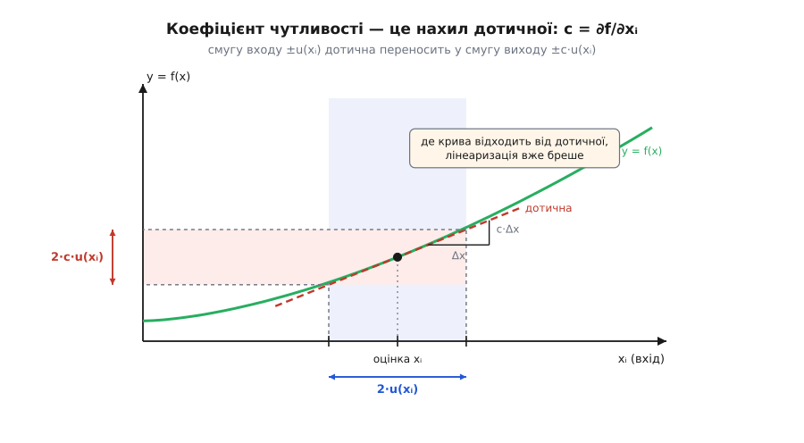
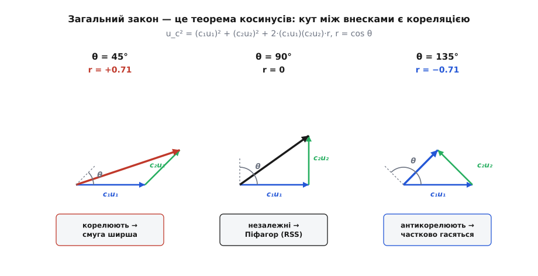

# 🧮 Закон поширення невизначеності: повне виведення

Ви майже ніколи не міряєте прямо те, що вам потрібно. Прискорення `g` дістаєте з довжини й періоду, густину — з маси й об'єму, опір — з напруги й струму. Кожен вхід приходить зі своєю смугою невизначеності, і постає точне питання: якщо я знаю, наскільки розмиті **входи**, наскільки розмитим вийде **результат**, порахований із них за формулою? Відповідь дає **закон поширення невизначеності** (англ. *law of propagation of uncertainty*), і вся ця замітка — про те, звідки він береться, аж до останнього коефіцієнта.

Щоб було видно, куди ми йдемо, ось кінцева формула в її повному вигляді. Для моделі `y = f(x₁, x₂, …, xₙ)`, де кожен вхід `xᵢ` має стандартну невизначеність `u(xᵢ)`:

```
u_c²(y) = Σᵢ cᵢ²·u²(xᵢ)  +  2·Σᵢ Σⱼ>ᵢ cᵢ·cⱼ·u(xᵢ,xⱼ),     cᵢ ≡ ∂f/∂xᵢ
```

Тут `cᵢ` — коефіцієнти чутливості, `u(xᵢ,xⱼ)` — коваріації між входами. Наприкінці кожен символ у цьому рядку матиме своє «звідки»: чому саме похідні, чому квадрати, звідки другий доданок і коли він зникає. Це не формула для завчання — її можна вивести з двох простих ідей, і зробити це варто, бо тоді вона перестає бути магією й починає підказувати, що робити з приладом.

## Дві ідеї, з яких усе випливає

Весь закон стоїть на двох стовпах, і кожен сам по собі очевидний.

**Перший: мала смуга бачить лише нахил.** Невизначеність входу — це вузька смужка навколо його оцінки, зазвичай частки відсотка. На такому дрібному масштабі будь-яка гладка функція виглядає прямою — своєю дотичною. Тож зовсім не важить, наскільки крива модель загалом; важить лише, **як круто вона нахилена тут**, у точці ваших оцінок. А крутизну нахилу міряє [похідна](root:math-analysis/derivative) — вона й скаже, у скільки разів дрож входу підсилиться на виході.

**Другий: розкид міряють квадратами.** Ширину смуги виражають дисперсією — [середнім квадратом відхилення](root:math-probability/mean-variance) від центру. Квадрат тут не косметика: він робить відхилення в обидва боки однаково «поганими» й, як побачимо, саме він змушує незалежні джерела складатися особливим чином. Стандартне відхилення `σ` — це просто корінь із дисперсії, повернення до звичних одиниць.

Складіть ці дві ідеї — «замінити криву дотичною» і «розкид рахувати квадратами» — і закон поширення випаде сам. Робимо це строго.

## Крок 1 — розклад Тейлора: звідки беруться коефіцієнти чутливості

Уявімо кожен вхід не як одне число, а як **випадкову величину** `Xᵢ`, що гойдається навколо своєї оцінки `xᵢ` з розкидом завширшки `u(xᵢ)`. Тоді й результат `Y = f(X₁, …, Xₙ)` гойдається навколо `y = f(x₁, …, xₙ)`, і нам потрібна ширина цього гойдання — `u_c(y)`.

Позначмо відхилення кожного входу від його оцінки як `δᵢ = Xᵢ − xᵢ`. Це малі випадкові величини із середнім близько нуля й розкидом `u(xᵢ)`. Тепер розкладемо `f` у **ряд Тейлора** навколо точки оцінок — тобто випишемо функцію через її значення й похідні в одній точці:

```
Y = f(x₁+δ₁, …, xₙ+δₙ)
  = f(x₁,…,xₙ) + Σᵢ (∂f/∂xᵢ)·δᵢ  +  ½·Σᵢ,ⱼ (∂²f/∂xᵢ∂xⱼ)·δᵢδⱼ  +  …
```

Перший доданок — це `y`. Другий — лінійний по відхиленнях, з коефіцієнтами-похідними. Третій і далі — квадратичні й вищі. Оскільки `δᵢ` малі (частки відсотка), їхні квадрати — це частки відсотка **від часток відсотка**, дрібниця проти лінійного доданка. Відкидаємо їх і лишаємо саму дотичну:

```
Y − y  ≈  Σᵢ cᵢ·δᵢ ,      cᵢ ≡ ∂f/∂xᵢ   (обчислена в точці оцінок)
```

Ось воно, найголовніше цього кроку: **відхилення результату — це зважена сума відхилень входів**, а вагами стоять частинні похідні. Ці похідні й звуться **коефіцієнтами чутливості** `cᵢ`. Вони не вгадані — вони буквально випали з ряду Тейлора як коефіцієнти при `δᵢ`. Кожен каже одне: коли вхід `xᵢ` зсунеться на одиницю, результат зсунеться на `cᵢ`. Похідна тут — точний курс обміну «дрож входу → дрож виходу».


*Коефіцієнт чутливості — це нахил дотичної. Смуга входу завширшки ±u(xᵢ) проходить угору через дотичну й лягає на вісь виходу смугою завширшки ±c·u(xᵢ). Що крутіша дотична, то ширша вихідна смуга. Праворуч угорі крива вже помітно відходить від дотичної — там, де вхідна смуга надто широка, лінеаризація починає брехати.*

> 🔧 **Навіщо це.** Коефіцієнт чутливості — не проміжна абстракція, а найкорисніше число всього розрахунку. Він каже інженерові, який вхід тримати в шорах: вхід із великим `cᵢ` підсилює свій дрож і псує результат, вхід із малим `cᵢ` можна міряти абияк. Ще до жодного експерименту `cᵢ = ∂f/∂xᵢ` показує, де формула сама по собі вразлива.

## Крок 2 — дисперсія зваженої суми

Другий крок уже не має ніякої фізики — це чиста статистика. Ми звели складну модель до простого твердження `Y − y ≈ Σᵢ cᵢ·δᵢ` і питаємо: якщо результат є зваженою сумою випадкових відхилень, яка його дисперсія?

Дисперсія — це середнє квадрата відхилення від центру. Позначмо усереднення по всьому уявному ансамблю повторів кутовими дужками `⟨·⟩`. Тоді:

```
u_c²(y) = ⟨(Y − y)²⟩ = ⟨(Σᵢ cᵢδᵢ)·(Σⱼ cⱼδⱼ)⟩ = Σᵢ Σⱼ cᵢ·cⱼ·⟨δᵢδⱼ⟩
```

Ми просто розкрили квадрат суми в подвійну суму всіх пар. Уся сіль тепер у величині `⟨δᵢδⱼ⟩` — у середньому добутку двох відхилень. Вона має два різні смисли залежно від того, однаковий індекс чи ні:

```
i = j :   ⟨δᵢ²⟩   = u²(xᵢ)          ← дисперсія входу (розкид самого xᵢ)
i ≠ j :   ⟨δᵢδⱼ⟩ = u(xᵢ,xⱼ)        ← коваріація (чи ходять xᵢ і xⱼ разом)
```

**Коваріація** (англ. *covariance*, від лат. *co-* — спільно) — це середнє добутку двох відхилень, міра їхнього спільного ходіння. Якщо коли `xᵢ` підскакує вгору, `xⱼ` теж радше йде вгору, їхні `δ` частіше однакового знаку, добуток `δᵢδⱼ` частіше додатний, і коваріація додатна. Якщо навпаки — від'ємна. А якщо знак одного нічого не каже про знак іншого, плюси й мінуси в середньому гасяться, і коваріація дорівнює нулю.

Розділимо подвійну суму на діагональ (`i = j`) і решту (`i ≠ j`), а симетричні пари `ij` та `ji` зведемо в один доданок із двійкою. Дістаємо повний закон:

```
u_c²(y) = Σᵢ cᵢ²·u²(xᵢ)  +  2·Σᵢ Σⱼ>ᵢ cᵢ·cⱼ·u(xᵢ,xⱼ)
```

Це і є той рядок, з якого ми почали. У міжнародному довіднику з невизначеності — GUM (англ. *Guide to the Expression of Uncertainty in Measurement*, чинна редакція JCGM 100:2008) — це рівняння (13), загальна форма для корельованих входів, а його усічення без другого доданка — рівняння (10). Обидва, як і в нас, виведені з першого члена ряду Тейлора; довідник прямо застерігає, що при сильній нелінійності доводиться брати й вищі члени. Ми щойно вивели центральну формулу всієї метрології двома рухами: лінеаризація й розкриття квадрата.

## Крок 3 — незалежні входи й корінь із суми квадратів

Тепер найчастіший випадок. Секундомір і рулетка нічого не знають одне про одного: промах годинника не натякає на промах лінійки. Для таких **незалежних** входів усі коваріації дорівнюють нулю, і весь другий доданок випаровується. Лишається сама діагональ:

```
u_c²(y) = Σᵢ cᵢ²·u²(xᵢ)        →        u_c(y) = √( Σᵢ (cᵢ·u(xᵢ))² )
```

Ось звідки береться знамените **складання по квадрату** (англ. *sum in quadrature*): невизначеність кожного входу спершу переводять у одиниці результату множенням на `cᵢ`, а тоді ці внески складають не в лоб, а через корінь із суми квадратів. Проста сума `Σ cᵢu(xᵢ)`, до якої тягне рука, — це не помилка округлення, а буквально ті самі перехресні доданки, що щойно зникли: вона правильна лише тоді, коли всі входи змовились ходити разом, а для незалежних систематично перебільшує розкид.

## Чому саме квадрати, а не щось інше

Оце «по квадрату» варте того, щоб копнути глибше, бо воно не випадкове й не умовне. Є два способи побачити, **чому** незалежні внески складаються саме так.

**Алгебраїчний.** Розкрийте квадрат суми двох відхилень: `(a + b)² = a² + b² + 2ab`. Перехресний доданок `2ab` — це вся різниця між «по квадрату» й «у лоб». Для незалежних `a` і `b` він у середньому дорівнює нулю: добуток `ab` однаково часто виходить додатний (обидва однакового знаку) і від'ємний (різного), і при усередненні ці випадки гасяться. А от `a²` і `b²` невід'ємні завжди, хоч який знак у самих `a`, `b` — їх усереднення не прибирає. Дисперсія, зроблена з квадратів, зберігає лише цю «завжди-додатну» частину, і саме вона додається. Квадрат тут не прикраса — це фільтр, що пропускає стійкий розкид і вбиває випадкову інтерференцію знаків.

**Геометричний — і це справжня причина.** Уявімо кожну випадкову величину як вектор в абстрактному просторі, а скалярним добутком двох таких векторів оголосимо їхню коваріацію: `⟨A, B⟩ = cov(A, B)`. Тоді квадрат довжини вектора — це `⟨A, A⟩ = cov(A, A) =` дисперсія, а сама довжина — стандартне відхилення. І дивіться, що робить незалежність: нульова коваріація означає нульовий скалярний добуток, тобто **перпендикулярність**. Незалежні внески — це ортогональні вектори. А для перпендикулярних векторів довжина суми підкоряється теоремі Піфагора:

```
незалежні  ⟺  ⟨A, B⟩ = 0  ⟺  ‖A + B‖² = ‖A‖² + ‖B‖²
```

Переведіть назад — і це рівно `u_c² = u₁² + u₂²`. Ось чому трикутник із катетами-невизначеностями й гіпотенузою-результатом не аналогія, а точна правда: дисперсія **є** квадрат довжини, незалежність **є** прямий кут, а корінь із суми квадратів **є** теорема Піфагора. Складання по квадрату — це геометрія простору випадкових величин, а не домовленість метрологів.

## Кореляція: коли входи ходять разом

Що ж коли входи не незалежні? Другий доданок оживає, і зручно виразити коваріацію через безрозмірний **коефіцієнт кореляції** `r`, що завжди лежить між −1 і +1:

```
u(xᵢ,xⱼ) = r(xᵢ,xⱼ)·u(xᵢ)·u(xⱼ),      −1 ≤ r ≤ +1
```

Для двох входів формула стає прозорою, і в ній видно всі три режими:

```
u_c² = (c₁u₁)² + (c₂u₂)² + 2·(c₁u₁)(c₂u₂)·r
```

```
r = 0    →  u_c² = (c₁u₁)² + (c₂u₂)²            ← чистий Піфагор (незалежні)
r = +1   →  u_c² = (c₁u₁ + c₂u₂)²               ← складаються В ЛОБ
r = −1   →  u_c² = (c₁u₁ − c₂u₂)²               ← віднімаються, гасяться
```

Погляньте на середній рядок: повна додатна кореляція повертає ту саму просту суму, якої ми уникали. Це і є розгадка «найгіршого випадку» — він не гіпотетичний, а конкретний: `r = +1` означає, що входи змовились рухатися разом, і тоді дрож справді додається один-до-одного. Незалежність (`r = 0`) — щаслива середина, а від'ємна кореляція навіть краща за неї: внески почасти з'їдають одне одного.


*Загальний закон — це теорема косинусів. Складіть два внески «голова до хвоста»: `‖C₁+C₂‖² = ‖C₁‖² + ‖C₂‖² + 2‖C₁‖‖C₂‖·cos θ`. Кут `θ` між внесками — це і є кореляція, `cos θ = r`. Прямий кут (r = 0) дає Піфагора, гострий (r > 0) — довшу рівнодійну, тупий (r < 0) — коротшу. Незалежність — це просто перпендикулярність.*

Порівняйте цю формулу з теоремою косинусів `‖C₁+C₂‖² = ‖C₁‖² + ‖C₂‖² + 2‖C₁‖‖C₂‖·cos θ` — вони збігаються символ у символ, якщо `cos θ = r`. Отже, коефіцієнт кореляції — це буквально **косинус кута** між векторами-внесками. Незалежність — прямий кут; повна кореляція — вектори лягли на одну пряму; антикореляція — вони дивляться врізнобіч. Складання по квадрату виявляється не окремим правилом, а одним випадком (`θ = 90°`) загальної теореми косинусів.

> 🔧 **Навіщо це.** Кореляція — не екзотика, вона заводиться щоразу, коли два входи мають **спільне джерело**. Зміряли дві довжини однією непроградуйованою рулеткою — обидві поповзли в один бік разом, це додатна кореляція, і складати їх по квадрату вже не можна: справжня невизначеність більша. Той самий термометр за двома показами, той самий калібрувальний еталон за двома приладами, той самий опорний резистор — усе це впускає в бюджет перехресні доданки. Забути про них — типовий спосіб недооцінити невизначеність і повірити в результат сильніше, ніж він того вартий.

## Добутки й степені: показник стає вагою

Дуже багато фізичних формул — це не суми, а **добутки степенів**: `g = 4π²L·T⁻²`, площа `S = a·b`, потужність `P = U²/R`. Для них загальна формула згортається в напрочуд охайний вигляд, і варто побачити, звідки він.

Нехай модель — одночлен:

```
y = k · x₁^p₁ · x₂^p₂ · … · xₙ^pₙ
```

Пряме диференціювання дало б купу доданків, але є коротший шлях — [логарифм](root:math-analysis/logarithms), який перетворює добуток на суму:

```
ln y = ln k + p₁·ln x₁ + p₂·ln x₂ + … + pₙ·ln xₙ
```

Тепер візьмімо малу зміну обох боків. Оскільки диференціал `ln`-а — це відносна зміна (`d(ln x) = dx/x`), дістаємо:

```
dy/y = p₁·(dx₁/x₁) + p₂·(dx₂/x₂) + … + pₙ·(dxₙ/xₙ)
```

Придивіться: це знову та сама лінійна форма з Кроку 1, тільки в **відносних** змінних. Роль «відхилення входу» тепер грає відносне відхилення `dxᵢ/xᵢ`, а роль «коефіцієнта чутливості» — просто показник степеня `pᵢ`. Застосуймо до цього готовий результат Кроку 3 (дисперсія зваженої суми незалежних доданків):

```
( u_c(y)/y )² = p₁²·( u(x₁)/x₁ )² + p₂²·( u(x₂)/x₂ )² + … + pₙ²·( u(xₙ)/xₙ )²
```

**Відносна невизначеність результату — це корінь із суми квадратів відносних невизначеностей входів, зважених на показники степенів.** І тепер зрозуміло, чому показник стоїть у квадраті: він увійшов як коефіцієнт чутливості в логарифмічному просторі, а коефіцієнти чутливості завжди входять у квадраті (Крок 3). Звідси й два наслідки, що спантеличують новачка. По-перше, **знак показника байдужий** — квадрат його з'їдає, тож вхід у знаменнику (від'ємний показник) шкодить рівно стільки ж, скільки такий самий у чисельнику. По-друге, вхід із більшим показником б'є по результату сильніше, і не лінійно, а через квадрат показника: подвоєний показник дає вчетверо більший внесок дисперсії.

Зв'язок із «звичайним» `cᵢ` теж прямий. Оскільки `∂(ln y)/∂xᵢ = pᵢ/xᵢ`, то `cᵢ = ∂y/∂xᵢ = y·pᵢ/xᵢ`, і відносний внесок `cᵢ·u(xᵢ)/y = pᵢ·u(xᵢ)/xᵢ` — рівно те, що складається у формулі вище. Логарифмічний фокус нічого не додав до закону, лише переписав його в найзручніших для добутків одиницях.

## Де це працює: маятник до останнього коефіцієнта

Зберемо все на живій моделі `g = 4π²L/T²`. Спершу коефіцієнти чутливості — просто беремо частинні похідні:

```
c_L = ∂g/∂L = 4π²/T²      = g/L           (показник L дорівнює +1)
c_T = ∂g/∂T = 4π²L·(−2)T⁻³ = −8π²L/T³ = −2g/T   (показник T дорівнює −2)
```

Двійка при `c_T` — це прямо показник степеня `T`, що вийшов наперед при диференціюванні. А тепер два різні шляхи до однієї відповіді. Прямий: підставити `c_L`, `c_T` у корінь із суми квадратів. Через логарифми: `g ∝ L¹·T⁻²`, тож

```
( u_c(g)/g )² = 1²·(u_L/L)² + (−2)²·(u_T/T)²      →      u_c(g)/g = √( (u_L/L)² + (2·u_T/T)² )
```

Множник 2 при `T` — це `|−2|`, модуль показника; знак мінус зник під квадратом. Обидва шляхи дають те саме число, і код це показує наочно — заразом перевіряючи аналітичні похідні чисельною скінченною різницею:

```python
import math

def g_model(L, T):
    return 4 * math.pi**2 * L / T**2

# --- входи та їхні стандартні невизначеності ---
L, u_L   = 0.9500, 0.0006          # довжина, м (тип B: рулетка ±1 мм)
t50, u_t50 = 97.77, 0.25           # час 50 коливань, с (тип A)
T, u_T   = t50 / 50, u_t50 / 50    # період і його невизначеність
g = g_model(L, T)

# --- коефіцієнти чутливості: аналітично і чисельно (мають збігтися) ---
cL_an, cT_an = g / L, -2 * g / T
h = 1e-7
cL_num = (g_model(L + h, T) - g_model(L - h, T)) / (2 * h)   # ∂g/∂L
cT_num = (g_model(L, T + h) - g_model(L, T - h)) / (2 * h)   # ∂g/∂T

# --- внески у невизначеність g і незалежне складання по квадрату ---
aL, aT = abs(cL_an) * u_L, abs(cT_an) * u_T
u_g = math.hypot(aL, aT)                       # √(aL² + aT²)

print(f"g   = {g:.4f} м/с²")
print(f"c_L: аналітично {cL_an:.3f}, чисельно {cL_num:.3f}")
print(f"c_T: аналітично {cT_an:.3f}, чисельно {cT_num:.3f}")
print(f"внесок L = {aL:.4f}   внесок T = {aT:.4f}")
print(f"u(g) = {u_g:.4f}  →  U = {2*u_g:.2f} (k=2)")

# --- а якби входи КОРЕЛЮВАЛИ з коефіцієнтом r (той самий доданок 2·aL·aT·r) ---
for r in (-1.0, 0.0, 1.0):
    uc = math.sqrt(aL**2 + aT**2 + 2 * aL * aT * r)
    print(f"  r = {r:+.0f}  →  u_c = {uc:.4f}")
```

Програма друкує:

```
g   = 9.8087 м/с²
c_L: аналітично 10.325, чисельно 10.325
c_T: аналітично -10.032, чисельно -10.032
внесок L = 0.0062   внесок T = 0.0502
u(g) = 0.0505  →  U = 0.10 (k=2)
  r = -1  →  u_c = 0.0440
  r = +0  →  u_c = 0.0505
  r = +1  →  u_c = 0.0564
```

Аналітичні похідні збіглися з чисельними до третьої цифри — підтвердження, що `cᵢ = ∂f/∂xᵢ` не метафора, а обчислюваний нахил. Незалежне складання дало `u(g) = 0.0505`, і внесок часу (0.0502) геть переважає внесок довжини (0.0062) — бо показник `T` дорівнює −2, і його відносна невизначеність увійшла подвоєною ще до піднесення в квадрат.

А три останні рядки показують ціну кореляції. Довжина й період тут насправді незалежні (різні прилади), тож правильна відповідь — `r = 0`, тобто 0.0505. Але якби вони чомусь ходили разом, `u_c` роздувся б до 0.0564 (`r = +1`, складання в лоб); якби навпаки — впав би до 0.0440 (`r = −1`). Уся вилка — від `|aT − aL|` до `aT + aL`, і незалежність сидить якраз посередині, під коренем із суми квадратів. Це той самий діапазон, що його малює трикутник косинусів вище: від тупого кута через прямий до нульового.

## Коли лінеаризація ламається

Чесність вимагає назвати межу. Увесь закон стоїть на першому кроці — заміні кривої дотичною, — а вона правдива лише поки крива на ширині вхідної смуги майже пряма. Два випадки її ламають. Перший: **велика невизначеність** — смуга входу така широка, що модель на ній устигає викривитися, і відкинутий квадратичний член `½·(∂²f/∂x²)·δ²` уже не дрібниця. Другий, підступніший: **зникомий коефіцієнт чутливості** — якщо в робочій точці `∂f/∂xᵢ = 0` (модель проходить через екстремум за цим входом), то лінійний внесок нульовий, і головним стає саме той квадратичний доданок, який ми викинули; тут прямий розрахунок показав би оманливий нуль.

У таких випадках або дописують у формулу члени другого порядку, або кидають лінеаризацію зовсім і **розкидають входи за їхніми розподілами чисельно**, проганяючи модель тисячі разів і дивлячись на розкид виходу, — метод Монте-Карло. Але для переважної більшості вимірів, де смуги вузькі, а модель гладка, першого члена Тейлора досить, і весь бюджет невизначеності живе на цій одній наближеній рівності.

Отак увесь закон стискається у два рухи, які тепер можна тримати в голові замість формули. Замінюєш криву моделі її дотичною — і невизначеність кожного входу підсилюється своїм нахилом `cᵢ = ∂f/∂xᵢ`. Тоді складаєш підсилені внески як довжини векторів: перпендикулярних (незалежних) — за Піфагором, похилених (корельованих) — за теоремою косинусів, де косинус кута є коефіцієнт кореляції. А для добутків степенів той самий закон одягається в найпростіший одяг: складаєш відносні невизначеності, зважені на показники, у квадраті. Усе інше — арифметика.
