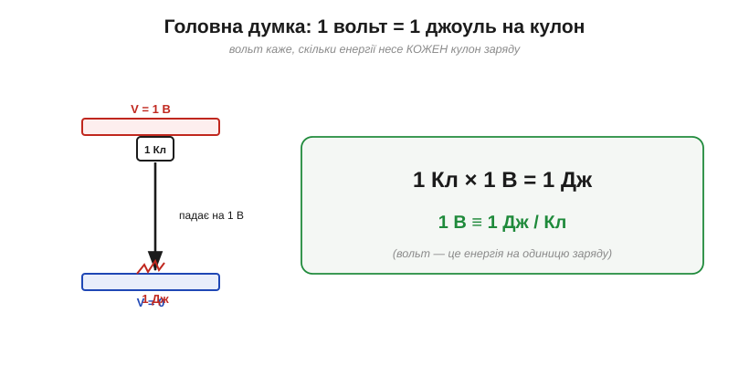
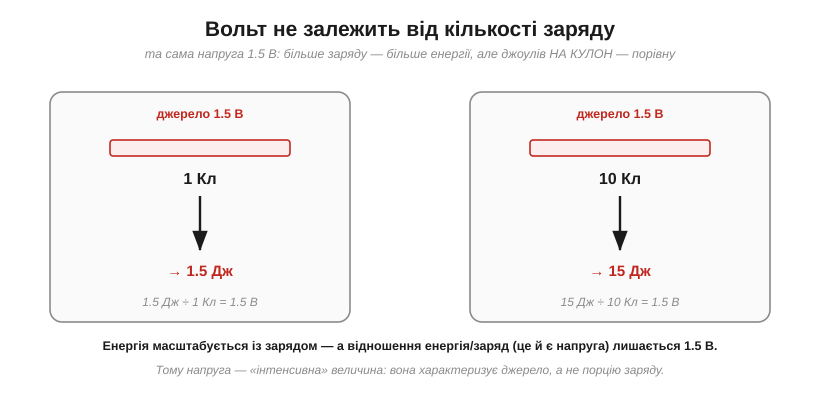
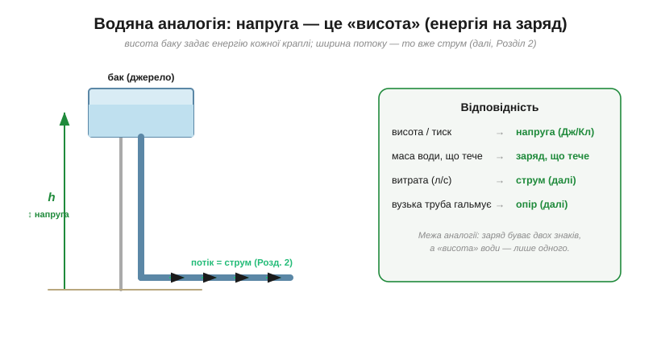
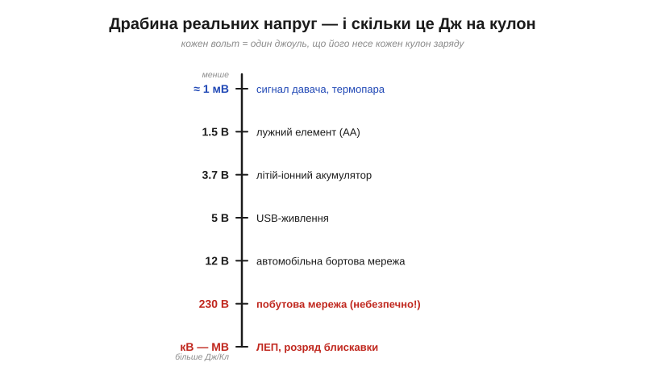
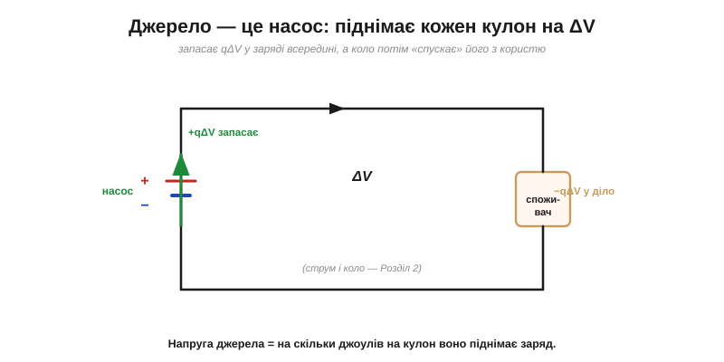

# Головна думка: вольт — це джоуль на кулон

Вольт легко зустріти як одиницю [потенціалу](topic:ph-electromagnetism/electric-potential) — майже мимохідь. Але якщо в усій електростатиці є **одна** думка, яку треба винести й закарбувати назавжди, — то це вона. Вольт — найважливіша робоча величина всієї електроніки: її ви бачитимете на кожному джерелі, кожному виводі, у кожному рядку даташита. І весь її глибокий сенс уміщається в коротку рівність:

```
1 В = 1 Дж / Кл
```

**Вольт — це енергія на одиницю заряду.** Не сила, не кількість заряду, не «потужність розетки» — а саме скільки **джоулів** несе кожен **кулон**. Зрозуміти це до кінця — значить отримати ключ до всього подальшого.

### Що це означає буквально

Розшифруймо рівність якомога конкретніше. Якщо між двома точками напруга 1 вольт, то кожен кулон заряду, пройшовши від однієї до іншої, віддає (або набирає) рівно 1 джоуль енергії.


*Уся суть на одній картинці: коли заряд в 1 кулон «падає» на різницю в 1 вольт, вивільняється 1 джоуль енергії. Вольт відповідає на питання «**скільки енергії на кожен кулон?**».*

Звідси одразу й робоча формула, що її можна читати просто як визначення вольта: енергія, яку несе заряд q, пройшовши напругу V, — це

```
W = q · V        (джоулі = кулони × вольти)
```

«3.7 В» на акумуляторі означає буквально: кожен кулон, що вийде з нього, принесе колу 3.7 джоуля. «5 В» на USB — кожен кулон несе 5 джоулів. Напруга — це **густина енергії в заряді**.

Має значення й **напрям**. Пройти від нижчого потенціалу до вищого — це «підйом» (заряд набирає енергію), а від вищого до нижчого — «спад» (заряд віддає). Тому напругу часто записують зі знаком або стрілкою: вона каже не лише «скільки джоулів на кулон», а й «у який бік» — заряд багатшає чи бідніє на енергію. А електронвольт показує ту саму монету з іншого боку: 1 вольт — це не тільки джоуль на (величезний) кулон, а й рівно 1 еВ на кожен окремий елементарний заряд. Ідея «енергія на заряд» однаково працює на обох кінцях шкали — від батарейки до одного електрона.

### Чому саме «на кулон» — і чому це так зручно

Може здатися дивним означати величину «на одиницю» чогось. Та в цьому й уся сила: завдяки діленню на заряд напруга стає **інтенсивною** величиною — вона характеризує **саме джерело чи різницю**, а не якусь конкретну порцію заряду.


*Через ту саму напругу 1.5 В пропустимо 1 кулон — дістанемо 1.5 Дж; пропустимо 10 кулонів — 15 Дж. Енергія росте із зарядом, але **відношення** енергія/заряд (а це і є напруга) лишається 1.5 В. Тому напруга описує джерело, а не порцію.*

Саме тому можна спокійно сказати «джерело на 5 вольтів», не уточнюючи, скільки заряду крізь нього пройде: 5 вольтів — це обіцянка дати **5 джоулів кожному кулону**, хоч би скільки тих кулонів знадобилося. Так само, як «висота водоспаду» однакова незалежно від того, ллється відро води чи ціла річка: висота — це енергія на одиницю, а не повна енергія.

> 🔧 **Навіщо це.** Ось чому в даташитах напруга живлення стоїть **окремо** від струму чи ємності: вона каже про «якість» енергії (скільки на кулон), а не про її кількість. Логіка працює на 3.3 В чи 5 В — це про те, якими «порціями на заряд» спілкуються мікросхеми; а скільки заряду вони візьмуть — то вже інше питання ([струм](topic:ph-electromagnetism/electric-current)).

### Водяна аналогія — тепер точна

Знайому «висотну» аналогію [потенціалу](topic:ph-electromagnetism/electric-potential) тут можна зробити по-справжньому корисною. Уявіть водонапірний бак: що **вище** він стоїть, то більше енергії несе кожна крапля, що з нього падає. Висота баку — це **напруга**.


*Висота баку (тиск) задає енергію кожної краплі — це **напруга** (енергія на заряд). Скільки води тече за секунду — то вже **струм**, а вузька труба, що гальмує потік, — то опір. Аналогія точна там, де йдеться про «енергію на одиницю»; ламається ж тому, що заряд буває двох знаків, а висота води — лише одного.*

Ця аналогія варта засвоєння, бо вона правильно розділяє два поняття, які новачки постійно плутають: **напругу** (висота — скільки енергії на одиницю) і **потік** (скільки тієї одиниці тече — це [струм](topic:ph-electromagnetism/electric-current)). Високий бак із тонкою цівкою й низький бак із потужним потоком — геть різні речі, хоч «води» може витекти порівну.

### Чого вольт НЕ означає

Найчастіша плутанина початківця — змішати вольти з амперами й ватами. Тримаймо чітко: **вольт — це енергія на одиницю заряду** (Дж/Кл), і нічого більше. Це **не** кількість заряду, що тече (то [ампер](topic:ph-electromagnetism/electric-current) — і він про енергію нічого не каже), і **не** енергія за секунду (то [ват — потужність](topic:ph-electromagnetism/electric-power)). Висока напруга з крихітним потоком може нести зовсім мало енергії за секунду — статика б'є кіловольтами, та лише лоскоче; а низька напруга з потужним потоком — багато: стартер авто живиться всього 12 вольтами, проте провертає холодний двигун. Вольт каже про «якість» енергії на кожен кулон, а не про її кількість чи темп. Цю різницю варто закласти твердо вже тут, бо на ній спотикаються найчастіше. Саме одиниці й не дають сплутати ці величини: щойно формула змішує Дж/Кл з амперами чи ватами, [аналіз розмірностей](topic:math-numeric/dimensional-analysis) викриває це ще до підстановки чисел.

### Калібруємо чуття: реальні напруги

Щоб вольт став відчутним, корисно прив'язати його до знайомих чисел.


*Від мілівольтів (кволі сигнали давачів) до мегавольтів (блискавка). Кожен вольт — це один джоуль на кожен кулон: ось чому 230 В мережі небезпечні, а мілівольти термопари — ні (за тієї самої кількості заряду енергія на кулон різниться в сотні тисяч разів).*

Запам'ятавши цю драбину, ви легко оцінюватимете порядки: пальчиковий елемент — 1.5 В, літій — 3.7 В, USB — 5 В, авто — 12 В, мережа — 230 В, а сигнали давачів часто живуть у світі мілівольтів. Кожне число — це безпосередньо «джоулів на кулон». Мілі-, кіло-, мега- — ці [префікси СІ та інженерна нотація](topic:math-numeric/si-prefixes) трапляються тут і далі на кожному кроці, тож варто навчитися перемножувати величини з ними усно, щоб «1 мкА × 10 кОм = 10 мВ» рахувалося в голові.

> 🔌 А кіловольти на верхівці драбини можна дістати геть без батареї — просто стукнувши по кристалу. Саме так працює п'єзозапальничка газової плити: [П'єзозапальничка](topic:hw-sensing/volt/comp-piezo-igniter.md).

> 🔧 **Навіщо це.** Тому й рівні логіки (3.3 В / 5 В), і «слабкі» сигнали давачів (мілівольти), і небезпека мережі — усе це мова **вольтів = Дж/Кл**. Коли побачите в даташиті підсилювача «підсилення по напрузі», знайте: мова про збільшення саме цієї «енергії на кулон», а не кількості заряду.

### Звідки береться саме «1.5 вольта»

Чому елемент дає близько 1.5 В, а літій — близько 3.7 В? Це число задає **хімія**: кожна реакція всередині елемента вивільняє певну енергію на кожен перенесений електрон — і саме вона визначає «джоулі на кулон». Інша хімія — інша енергія на заряд: лужний елемент дає ≈1.5 В, свинцево-кислотний ≈2 В, літій-іонний ≈3.7 В. Напруга елемента — це, по суті, енергетична «висота» його реакції, переведена у вольти.

А якщо потрібно більше? Елементи **складають у стовпчик** ([послідовно](topic:hw-analog/series-connection)): тоді кожен кулон піднімають по черзі всі елементи, і їхні напруги **додаються**. Три елементи по 1.5 В дають 4.5 В — кожен кулон набирає 1.5 + 1.5 + 1.5 джоуля. Саме так із 3.7-вольтових банок збирають акумулятори на 7.4 чи 11.1 В.

> 🔌 Як саме хімія цинку й діоксиду мангану «вирішує» дати рівно 1.5 В — і чому AA, AAA та D однаково по 1.5 В, а більший лише довше тягне: [Лужна батарейка AA зсередини](topic:hw-sensing/volt/comp-alkaline-cell.md).

### Джерело — це насос енергії

І останній, найпрактичніший образ. Звідки заряд бере свою «висоту»? Його **піднімає джерело**. Батарея працює як насос: усередині вона переганяє заряд із нижчого потенціалу на вищий, **запасаючи** в кожному кулоні енергію qΔV. А коло потім дає цьому заряду «скотитися» назад — і витрачає запасене на світло, тепло, рух.


*Джерело піднімає кожен кулон на свою напругу ΔV, вкладаючи в нього qΔV енергії; зовнішнє коло «спускає» заряд через споживача, вивільняючи цю енергію. Напруга джерела — це буквально «на скільки джоулів на кулон воно піднімає заряд».*

Ця «піднімальна» здатність джерела має й власну назву — **електрорушійна сила** (*ЕРС*, *EMF*), але суть її та сама: скільки енергії на кулон джерело готове надати. Тільки затямте одразу: усі ці числа — **номінальні**, виміряні майже без навантаження. Реальне джерело має ще й [внутрішній опір](topic:hw-analog/internal-resistance), тож щойно з нього потече помітний струм, напруга на клемах трохи **просідає** (а в міру виснаження — і поготів). Тому «1.5 В» чи «3.7 В» — це радше напруга «на холостому ході», ніж залізна стала.

**Приклад (скільки енергії в пальчиковій батарейці).** Лужний елемент AA має напругу 1.5 В і ємність близько 2000 мА·год. Скільки в ньому енергії?

```
заряд:    Q = 2000 мА·год = 2 А·год = 2 × 3600 = 7200 Кл
енергія:  W = Q · V = 7200 Кл × 1.5 В ≈ 10800 Дж ≈ 10.8 кДж
```

**Приклад (акумулятор телефона).** 3.7 В, 3000 мА·год:

```
Q = 3000 мА·год = 3 А·год = 10800 Кл
W = Q · V = 10800 × 3.7 ≈ 40000 Дж ≈ 40 кДж ≈ 11 Вт·год
```

Звідси видно й сенс одиниці **ват-година** (Вт·год) на акумуляторах: це теж енергія (заряд × напруга), просто в зручніших одиницях — кожні 3600 джоулів дають 1 Вт·год.

### Звідки ім'я

Одиницю названо на честь **Алессандро Вольти** (*Alessandro Volta*), який 1800 року подарував світові перше джерело **сталої** напруги — батарею, і тим відкрив добу практичної електрики. А народилася вона із запеклої наукової суперечки, що тривала роками.

> 📜 Драму «жаб'ячої електрики» — суперечку Вольти з Гальвані, з якої постала батарея, — викладено у вставці [Вольта проти Гальвані](topic:hw-sensing/volt/hist-volta.md).

---

Підсумок короткий, бо думка одна: **вольт — це джоуль на кулон**, енергія, яку несе кожна одиниця заряду. Це **інтенсивна** величина: вона характеризує джерело чи різницю потенціалів, а не кількість заряду; її дає «насос»-джерело й витрачає коло; і саме нею проградуйовано весь світ електроніки — від мілівольтів давача до кіловольтів лінії. А [поле й потенціал](root:embedded/field-and-potential), із яких напруга постає, — це не дві різні речі, а одне явище, розказане двома мовами.

---
