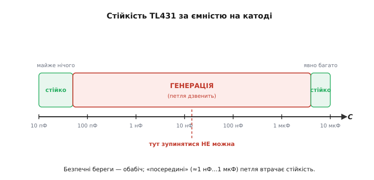
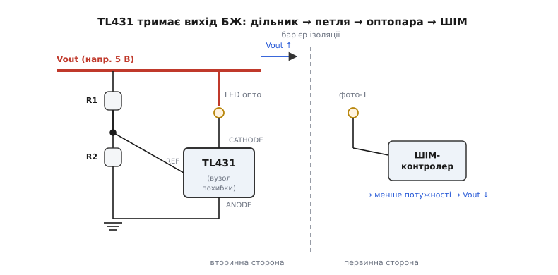

# 🔌 TL431 — програмований стабілітрон зблизька

Найпоширеніша мікросхема, про яку більшість не чула. TL431 (TI, **adjustable precision shunt regulator** — регульований прецизійний шунтовий стабілізатор) стоїть майже в кожному зарядному пристрої, у блоці живлення комп'ютера, у телевізорі — мільярдами штук на рік. Назовні в неї лише три виводи й копійчана ціна, а всередині — повноцінна слідкуюча петля. Тут розберемо її саме **як деталь**: чому її звуть «програмованим стабілітроном», що насправді тримає вихід, скільки струму їй треба для життя, де її ставлять і — найголовніша практична пастка — чому вона раптом починає дзвеніти на робочому столі.

## Чому «програмований стабілітрон»

Звичайний стабілітрон (zener) — пасивний: його напруга «вшита» фізикою переходу й змінити її не можна, а від температури вона повзе на сотні ppm/°C. TL431 робить те саме — тримає на собі постійну напругу, поки крізь неї тече струм, — але **поріг задаєш ти**, і тримає вона його активно, а не пасивно. Звідси прізвисько.

Усередині (це детально розкрив Кен Ширріфф, реверс-інженер мікросхеми, 2014) — три вузли:

1. **Bandgap-ядро ≈ 2.495 В** — внутрішня опорна точка, незмінна за температурою. Її дає класичний трюк: два транзистори з різною площею емітера (один у 8 разів більший) дають різницю напруг ΔV_be, що **зростає** з температурою; її складають із прямою напругою переходу, яка **падає** з температурою, — і нахили гасяться. Це [той самий числовий трюк](root:hw-sensing/voltage-reference/math-bandgap-math.md), що тримає будь-яку bandgap-опору.
2. **Підсилювач похибки** (error amplifier) — порівнює напругу на виводі **REF** із цими 2.495 В.
3. **Вихідний транзистор** між **CATHODE** і **ANODE** — потужний (тримає до 100 мА), відкривається рівно настільки, щоб REF лишався при 2.495 В.

Три виводи звуть як у діода невипадково: **ANODE** — земля схеми, **CATHODE** — вихідний вузол (туди тече струм, як у стабілітрон), **REF** — вхід зворотного зв'язку. Петля проста: щойно REF піднявся над 2.495 В, підсилювач сильніше відкриває транзистор, той просаджує катод і тягне струм — REF повертається назад. Це активне **слідкування**, а не пасивний пробій, тому TL431 на порядки стабільніший за справжній стабілітрон.

## Два резистори задають вихід

Внутрішня мітка завжди 2.495 В, але петля стежить лише за виводом REF. Якщо подати на REF не повний катодний потенціал, а його **частку** через дільник, петля підніме катод так, щоб ця частка дорівнювала 2.495 В, — і вихід стане вищим. Дільник: **R1** (катод → REF) і **R2** (REF → анод):

```
Vout = Vref · (1 + R1/R2),   Vref = 2.495 В
```

З'єднав REF із катодом напряму (R1 = 0) — на виході рівно 2.495 В, мінімум класу; підняв R1 — вихід росте, аж до 36 В (стеля деталі). Той самий поділ робить будь-який [резистивний дільник](root:hw-analog/voltage-divider), лише тут його «вершиною» стежить активна петля.

**Підбір дільника під опору АЦП 3.300 В**

```
Мета:   Vout = 3.300 В  (зручна повна шкала)
Беремо: R2 = 10.0 кОм   (струм крізь дільник ≈ Vref/R2 = 0.25 мА — нехтовний)
R1 = R2 · (Vout/Vref − 1)
   = 10000 · (3.300 / 2.495 − 1)
   = 10000 · 0.3227
   ≈ 3.23 кОм
Найближчий E96:  3.24 кОм
Реальний Vout = 2.495 · (1 + 3240/10000) ≈ 3.303 В   (похибка +0.1 %)
```

Тонкість, яку легко проґавити: точність дільника входить у похибку Vout **повністю**. Резистори на 1 % зведуть нанівець опору на 0.5 %, тому беруть точні (0.1 %) з низьким власним температурним коефіцієнтом (tempco, ppm/°C) — інакше дрейф дільника переважить дрейф самого ядра.

> 🔧 **Навіщо це.** Коли треба чесна, дешева й налаштовна на будь-який номінал опорна напруга — для входу АЦП, для порогу [компаратора](root:hw-analog/comparator), для контролю заряду — TL431 закриває потребу одним корпусом і двома резисторами. Там, де потрібні десятки ppm/°C роками й на морозі, переходять на series-REF; але «достатньо й задешево» в дев'яти випадках з десяти — це TL431.

## Скільки струму їй треба жити: вікно катода

«Мова» TL431 — не байт, а струм через катод. Петля працює лише у **робочому вікні**: від мінімуму **I_ka(min) ≈ 1 мА** (нижче петля «відпускає» й напруга провисає) до максимуму близько **100 мА**. На практиці цілять не в самий край, а трохи вище — близько **5 мА**: там вища крутість петлі й менший вихідний опір.

У класичному **shunt-вмиканні** живлення подають на катод через баластний резистор Rs; опора сама «з'їдає» рівно стільки струму, скільки треба, щоб тримати напругу, — решту віддає навантаженню. Rs підбирають із найгіршого випадку:

```
Rs = (Vsupply − Vout) / (I_ka(min) + I_load)

приклад: Vsupply = 5.0 В, Vout = 3.300 В, навантаження I_load = 0.5 мА
Rs = (5.0 − 3.300) / (1.0 мА + 0.5 мА)
   = 1.700 / 1.5 мА
   ≈ 1.13 кОм   → беремо 1.0 кОм (запас по струму катода вгору — добре)
```

Запас угору безпечний (зайвий струм опора просто шунтує в себе), запас **униз** — ні: якщо навантаження раптом забере все, катодного струму не лишиться й опора випаде з вікна. Це причина №1 скарги «опора показує не те».

## Найгостріша пастка: ємність на катоді й генерація

TL431 — це петля з підсиленням, а в будь-якої петлі є запас стійкості. Конденсатор на катоді додає в петлю фазове запізнення, і в певному діапазоні ємностей запас зникає — петля **самозбуджується** й генерує. Найпідступніше тут те, що небезпечна не «велика» й не «мала» ємність, а **середня**: береги стійкі, а долина між ними — ні.


*Стійкість залежно від ємності на катоді: при дуже малій ємності (до ≈50 пФ) і при явно великій (одиниці мкФ і більше) петля стійка; «посередині», грубо від одиниць нФ до ≈1 мкФ, вона дзвенить. Класичний 100 нФ «для надійності» падає рівно в долину.*

Практичний висновок прямий і контрінтуїтивний: **або майже нічого** на катоді (десятки пФ — фактично гола доріжка), **або свідомо багато** (одиниці–десятки мкФ, щоб вийти за долину з іншого боку). Найгірше — рефлекторно поставити «розв'язувальні» 100 нФ: це точно в зону генерації. Інший рецепт — невеликий резистор послідовно з ємнісним навантаженням (одиниці–сотні Ом), він гасить дзвін. І чесна засторога: TI у даташиті прямо визнало, що їхні графіки меж стійкості надміру оптимістичні, тож на краю долини не балансують — беруть із запасом.

## Де вона працює

**Зворотний зв'язок імпульсного блоку живлення.** Це її головна робота на мільярди штук. У зарядці вихід ізольований від мережі бар'єром, і похибку треба передати назад крізь цей бар'єр. TL431 сидить на вторинній стороні: дільник знімає частку Vout на REF, а катод керує світлодіодом **оптопари**. Піднявся вихід — TL431 тягне більше струму через світлодіод — фототранзистор на первинній стороні передає це ШІМ-контролеру — той зменшує потужність — вихід падає назад. Петля замкнулася через світло, ізоляція ціла.


*Петля стабілізації імпульсного БЖ: TL431 на вторинній стороні порівнює частку Vout із 2.495 В і модулює струм світлодіода оптопари; фототранзистор на первинній стороні веде ШІМ-контролер, замикаючи зворотний зв'язок крізь ізоляційний бар'єр.*

**Опора для АЦП.** Друга роль — давати точний потенціал на вхід REF аналого-цифрового перетворювача або як еталон для калібрування. Тут важлива межа: TL431 — це **опора напруги**, не стабілізатор. Вона тримає точний *потенціал*, але майже не вміє живити споживача струмом; сплутати її з [LDO](root:hw-power/ldo), який саме віддає струм під навантаження, — типова помилка. У платформ на кшталт ESP32 окремого виводу AREF немає (опора внутрішня), тож зовнішню TL431 тут ставлять як **точну шкалу** для звірки або годують нею зовнішній АЦП:

:::tabs
```cpp
// Зовнішня TL431 (Vout = 3.300 В) на GPIO34 — звіряємо точність внутрішньої опори ESP32
int mv_esp = analogReadMilliVolts(34);   // мВ із вбудованою поправкою опори ESP32
int err_mv = mv_esp - 3300;              // відхилення від відомого еталона = залишкова похибка ESP32
```
```py
from machine import ADC, Pin

# Зовнішня TL431 (Vout = 3.300 В) на GPIO34 — звіряємо точність внутрішньої опори ESP32
adc = ADC(Pin(34))
mv_esp = adc.read_uv() // 1000       # read_uv() дає мкВ із вбудованою поправкою опори ESP32
err_mv = mv_esp - 3300               # відхилення від відомого еталона = залишкова похибка ESP32
```
:::

## Звідки вона взялася

Лінію почав **TL430** (Texas Instruments, 1976) — регульований шунтовий стабілізатор з опорою 2.75 В, менш точний, ще без захисного діода на виході. Покращений варіант — **TL431** — анонсували 1977-го й запустили 1978-го: точніше ядро, краща стійкість, опора зведена до 2.495 В. Сорок із гаком років по тому це й досі de facto стандарт вузла похибки для імпульсних блоків живлення з оптопарною розв'язкою — рідкісний випадок, коли копійчана аналогова мікросхема пережила покоління складніших рішень просто тому, що робить свою роботу.
