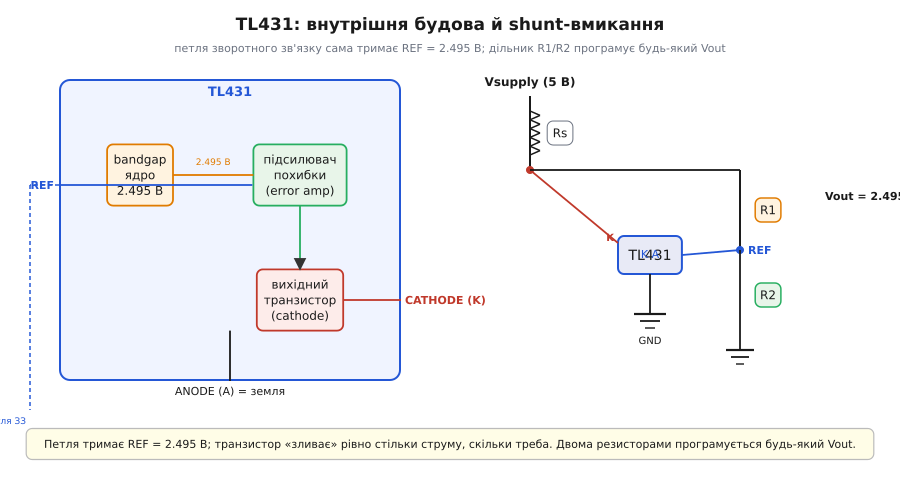
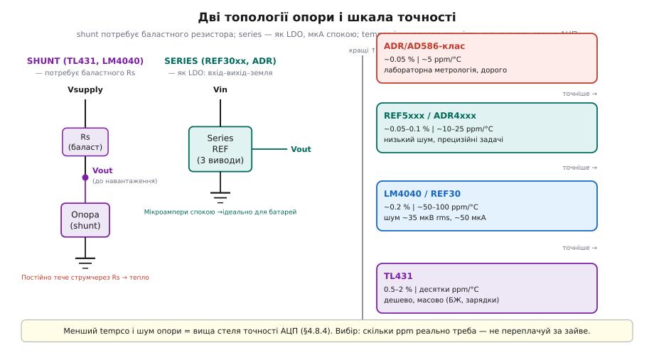

# 🔌 Джерела опорної напруги: TL431 і REF-класи — стабільні мілівольти

> Компонентна вставка про **прецизійні джерела опорної напруги (Vref)**. Зовнішня прецизійна опора — найточніше джерело Vref для АЦП. Тут розкриваємо її **як деталь**: що всередині TL431, як двома резисторами задати будь-яку напругу, чим шунтова опора (shunt reference) відрізняється від послідовної (series), які реальні цифри точності й де її ставити перед АЦП.

## Клас пристрою: «програмований стабілітрон»

Vref — це лінійка АЦП, і її точність є стелею всього вимірювання. Але звідки береться найкраща лінійка? Відповідь — окрема мікросхема класу **прецизійне джерело опорної напруги (voltage reference)**: її єдина робота — тримати **одну** напругу незмінною попри температуру, час і навантаження. Це не стабілізатор: [LDO](topic:hw-power/ldo) дає **струм** під навантаження, а опора дає лише **точний потенціал** і майже не може живити споживача.

Найдешевший і найпоширеніший представник цього класу — **TL431 (adjustable shunt regulator)**: він поводиться як стабілітрон, але поріг задаєш сам, і він на порядки стабільніший за справжній стабілітрон. Всередині — bandgap-ядро, яке дає незмінну внутрішню точку відліку незалежно від температури.

## Що всередині TL431

Щоб зрозуміти, чому TL431 точніший за звичайний стабілітрон, досить поглянути на три внутрішні вузли:

1. **Bandgap-ядро ≈ 2.495 В** — незмінна внутрішня опорна точка, із якою звіряється всe.
2. **Підсилювач похибки (error amplifier)** — порівнює напругу на виводі REF із цими 2.495 В.
3. **Вихідний транзистор (cathode)** — відкривається або закривається так, щоб REF завжди дорівнював 2.495 В.

Інтуїція зворотного зв'язку: якщо REF трохи вищий за 2.495 В, підсилювач відкриває транзистор сильніше, той просаджує катод, REF повертається назад. Це **слідкуюча петля**, а не пасивний поріг, — саме тому TL431 на порядки стабільніший за стабілітрон. Мікросхема має три виводи: **REF**, **ANODE** (земля схеми) і **CATHODE** (вихідний вузол).


*Усередині TL431 і базове shunt-вмикання: bandgap-ядро 2.495 В, підсилювач похибки й транзистор катода, що тримає REF рівним 2.495 В; зовні — баластний резистор від живлення й дільник R1/R2, який задає вихід.*

## Два резистори задають будь-яку Vout

Фіксована внутрішня мітка 2.495 В — ще не кінець: АЦП може потребувати 3.000 В або 4.096 В. Тут у гру вступає **дільник R1 (катод → REF) і R2 (REF → земля)**. Дільник подає на REF лише *частку* вихідної напруги; петля тримає цю частку рівною 2.495 В, тому вихід виявляється вищим:

```
Vout = Vref × (1 + R1/R2),   Vref = 2.495 В
```

Якщо з'єднати REF напряму з катодом (R1 = 0), вийде «голе» вмикання — на виході рівно 2.495 В, мінімальна напруга класу.

**Приклад: підбір дільника під 4.096 В**

```
Мета: Vout = 4.096 В (зручна шкала для 12-біт АЦП: 1 мВ/LSB при 4096)
Задамо R2 = 10 кОм
R1 = R2 × (Vout/Vref − 1)
   = 10 000 × (4.096 / 2.495 − 1)
   = 10 000 × 0.642
   ≈ 6.42 кОм

Найближчий E96: 6.49 кОм
Реальний Vout ≈ 2.495 × (1 + 6490/10000) ≈ 4.116 В  (похибка ~0.5 %)
→ Точність дільника також входить у похибку Vout:
  1 % резистори додають ~1 % внеску, зводячи нанівець 0.5 % опори.
  Брати точні (0.1 %) резистори з низьким власним tempco.
```

## Як «запитати» опору струмом: баластний резистор

Аналогова «мова» TL431 — не байт, а струм. Щоб опора почала працювати, через неї має текти струм у **робочому вікні**: типово від **1 мА (мінімум) до 100 мА (максимум)**. Нижче мінімуму петля «відпускає» й напруга падає.

У класичному **shunt-вмиканні** живлення (наприклад, 5 В) подається через **баластний резистор Rs** до катода. Опора «бере на себе» рівно стільки струму, скільки потрібно, щоб тримати напругу, — як активний стабілітрон. Rs підбирають із умови:

```
Rs = (Vsupply − Vout) / (I_load + I_kat)
```

де I_kat беруть із запасом над навантаженням, зазвичай 1–10 мА.

На самому ESP32 виводу AREF немає (опора внутрішня, а поправки входять у `analogReadMilliVolts`), тому зовнішню TL431 тут радше використовують як **точну шкалу для калібрування** або подають на вхід *зовнішнього* АЦП. Прочитати цю точну напругу через вбудований АЦП і звірити відхилення можна так:

:::tabs
```cpp
// Зовнішня TL431 на виводі GPIO34 — перевіряємо точність внутрішньої опори ESP32
int raw    = analogRead(34);
int mv_esp = analogReadMilliVolts(34);   // мВ із вбудованою поправкою опори ESP32
// mv_esp порівнюємо з відомим Vout TL431 — різниця = залишкова похибка ESP32
```
```python
# Зовнішня TL431 на виводі GPIO34 — перевіряємо точність внутрішньої опори ESP32
from machine import ADC, Pin

adc = ADC(Pin(34))
raw    = adc.read()                      # сирий відлік 0..4095
mv_esp = adc.read_uv() // 1000           # мВ із вбудованою поправкою опори ESP32
# mv_esp порівнюємо з відомим Vout TL431 — різниця = залишкова похибка ESP32
```
:::

## Типові граблі

- **Замалий струм катода** (Rs завеликий або навантаження забирає все) — опора виходить із робочого вікна, напруга «провисає». Класична причина «опора показує не те».
- **Ємнісне навантаження → автоколивання.** У TL431 є зона ємностей, де петля стає нестійкою й генерує. Це відоме місце даташита (графік стабільності): лік — або дуже мала ємність на виході, або достатньо велика, але не «посередині».
- **Дешеві резистори дільника зводять нанівець точність опори.** Резистори 5 % руйнують перевагу від 0.5 % опори. Брати точні (0.1 %) з низьким власним температурним коефіцієнтом (tempco, ppm/°C).
- **Самонагрів і термоградієнт.** Струм через опору гріє її саму; гарячі вузли поряд (радіо, LDO) дають температурний дрейф. Тримати опору подалі від джерел тепла.
- **Земля опори ≠ земля АЦП (різні точки).** Падіння напруги на доріжці додається до Vref. Спільна точка землі — обов'язково.

## Shunt проти series і «скільки ppm купуєш»

Існує два топологічних різновиди опор:

- **Shunt** (TL431, LM4040-клас) — як стабілітрон: потребує баластного резистора, простий, але постійно «їсть» струм. Підходить для схем із достатнім живленням.
- **Series** (REF30xx, REF5xxx, ADR-клас) — три виводи (вхід–вихід–земля), як у LDO, сам регулює без баласту, мікроампери спокою — ідеально для батарейного й портативного живлення.

Вибір усередині кожного класу — це компроміс початкової точності (initial accuracy, %) і температурного коефіцієнта (tempco, ppm/°C):

| Клас | Початкова точність | Tempco | Застосування |
|---|---|---|---|
| TL431 | 0.5–2 % | десятки ppm/°C | БЖ, зарядки, «достатньо й задешево» |
| REF30 / LM4040 | ~0.2 % | ~50–100 ppm/°C | АЦП середньої точності, ~50 мкА |
| REF5xxx / ADR4xxx | ~0.05–0.1 % | ~10–25 ppm/°C | прецизійні вимірювання |
| ADR / AD586-клас | ~0.05 % | ~5 ppm/°C | лабораторна метрологія, дорого |


*Дві топології опори (shunt із баластним резистором проти series як у LDO) і сходинка точності: від TL431 (~0.5–2 %, десятки ppm/°C) через REF30/LM4040 (~0.2 %, 50–100 ppm/°C) до прецизійних ADR/AD586 (~0.05 %, ~5 ppm/°C).*

Зв'язок із точністю вимірювання прямий: що менший tempco й шум опори, то вища стеля точності АЦП — ось за що платять при переході від TL431 до ADR-класу.

> 🔧 **Навіщо це.** Коли потрібні чесні мілівольти — лічильник енергії, [вимір струму шунтом](topic:hw-sensing/current-monitor), заряд батареї, лабораторний прилад — внутрішньої опори МК (±кілька %, дрейф від чипа до чипа) не вистачає. Тоді на платі з'являється окрема опора: дешевий TL431 на 2.495 В + дільник там, де «непогано й задешево»; series-REF на 50 ppm/°C там, де вимір має триматися роками й на морозі. Правило вибору: спершу запитати, скільки ppm і відсотків реально потрібно (часто менше, ніж здається) — і не переплачувати за зайву точність.
